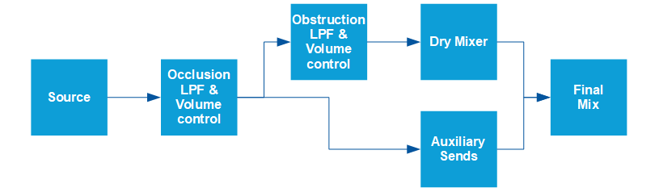
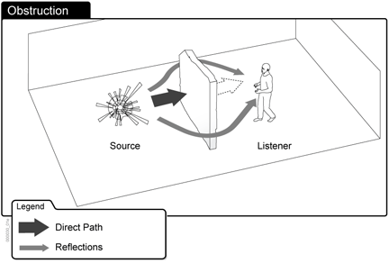
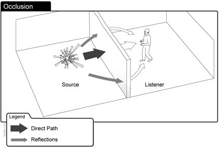
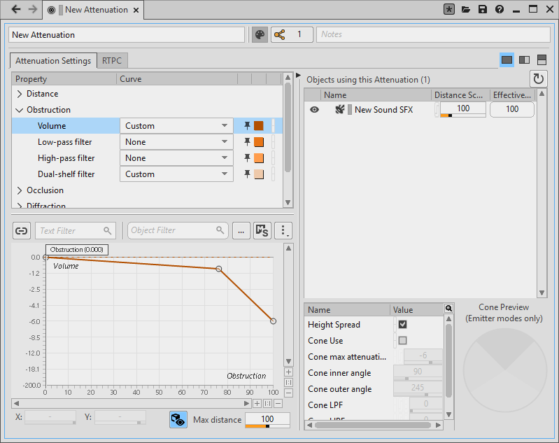

# 声障、声笼及 Game-defined Auxiliary Sends

|  |
| --- |
| Wwise SDK 2025.1.4 - Windows |

声障、声笼及 Game-defined Auxiliary Sends

在游戏中，游戏对象经常会被另一对象（如墙壁或横梁）阻挡或被封闭在房间内，这时听者只能听到通过墙壁透出的一点声音。为此，可使用辅助发送来表现信号的反射。

Wwise 本身不会计算声障和声笼级别。游戏必须执行物理计算并通过 [AK::SoundEngine::SetObjectObstructionAndOcclusion()](namespace_a_k_1_1_sound_engine_a1b3e18a25b405e55ba82de9b70cd11ba.html#a1b3e18a25b405e55ba82de9b70cd11ba) 将结果传给声音引擎。

Wwise 声音引擎会将声障和声笼级别映射到用户在其中定义的一系列音量、低通滤波器和高通滤波器曲线。在默认情况下，这些曲线会应用于整个工程。不过，可使用 Attenuation ShareSet 来针对不同的声音进行自定义。然后，便可在声音受声障和声笼影响时将这些曲线应用于声音对象。您定义的值为相对值，并且会与已经应用于游戏对象的音量和 LPF/HPF 值一起累计。

在这些条件的实现中，声音引擎会计算比例值并将其指派给声障和声笼以增强真实感。这些比例基于游戏引擎的实时定位信息，可反应游戏对象进出被遮挡区域的情况。比如，特工角色可能会穿过布满大型雕塑的画廊。在特工从各个雕塑后面经过时，声障的比例会随着其所处位置不断变化。同样，在特工悄悄溜出完全封闭的杂物间时，声笼的比例也会随之变化。

您可以单独使用声障和声笼，也可与 Spatial Audio 结合使用。有关 Spatial Audio 的详细信息，请参阅 [Spatial Audio](spatial_audio.html) 章节。

以下是声音引擎中声障/声笼处理管线的示意图：

声障/声笼处理管线

# 了解声障

声障是指游戏中的对象（如墙壁或柱子）部分挡住了声源和听者之间的空间。比如，在特工游戏中，即便玩家躲在柱子后面，照样能听到前方的枪声。

声障的示例

您可以通过向信号的直达路径应用音量、低通滤波器 (LPF) 或高通滤波器 (HPF) 来模拟声障效果。辅助发送反射不受影响。

# 了解声笼

声障是指游戏中的对象完全挡住了声源和听者之间的空间。比如，在特工游戏中，即便隔着一堵墙，玩家仍有可能听到隔壁房间的枪声。

声笼的示例

您可以通过向信号的直达路径和辅助发送反射应用音量、低通滤波器 (LPF) 或高通滤波器 (HPF) 来模拟声笼效果。声障和声笼现象可能会同时发生。声障值和声笼值都会对直达路径产生影响。然而，反射路径只受声笼值的影响。

# 设置声障和声笼

游戏引擎会根据对象和听者在游戏中的位置确定声障值和声笼值。

You can set curves in Wwise Authoring to determine how the volume, LPF, HPF, or DSF react to calculated obstruction and occlusion values. You can also enable or disable any curve to best suit their performance and realism needs.

在默认情况下，所有声音都会使用 Wwise 工程中指定的曲线。有关详细信息，请参阅[为工程定义声障和声笼曲线](https://www.audiokinetic.com/library/edge/?source=Help&id=defining_obstruction_and_occlusion_curves_for_project)。

除此之外，还可借助 Attenuation ShareSet 来针对声音单独启用、禁用或设置声障和声笼。有关详细信息，请参阅[应用衰减](https://www.audiokinetic.com/library/edge/?source=Help&id=applying_distance_based_attenuation)。

In both cases, modifying the obstruction and occlusion curves is done in Wwise, in the Attenuation Editor. In the following example, an obstruction value of 1.0f (100%) produces a volume change of -6 dB on the source object. Obstruction and Occlusion levels are between 0.0f and 1.0f.

Customizing the Obstruction and Occlusion Curves in Wwise

游戏设计师必须计算影响每个听者的游戏对象的声障和声笼，并通过调用 [AK::SoundEngine::SetObjectObstructionAndOcclusion()](namespace_a_k_1_1_sound_engine_a1b3e18a25b405e55ba82de9b70cd11ba.html#a1b3e18a25b405e55ba82de9b70cd11ba) 将值传给声音引擎。

在为游戏对象启用多个听者时，声音引擎会确定所有听者都能听到的最小 LPF 值和最大音量值。然后，使用这些值来计算声障/声笼结果。

## 示例：设置声障和声笼

#define MAIN\_LISTENER 0

// 游戏循环

while( TRUE )

{

(...)

for( int iGameObject = 0; iGameObject < nbObjects; iGameObject++ )

{

[AkReal32](_ak_numeral_types_8h_afc38459f26e2b23defe588026e886a98.html#afc38459f26e2b23defe588026e886a98) fCalculatedObs, fCalculatedOcc;

pGeometryModule->GetObsAndOccForGameObject( iGameObject, MAIN\_LISTENER, &fCalculatedObs, &fCalculatedOcc );

[AK::SoundEngine::SetObjectObstructionAndOcclusion](namespace_a_k_1_1_sound_engine_a1b3e18a25b405e55ba82de9b70cd11ba.html#a1b3e18a25b405e55ba82de9b70cd11ba)( iGameObject, MAIN\_LISTENER, fCalculatedObs, fCalculatedOcc );

}

(...)

}

# 其他资源

- 有关如何在 Wwise 设计工具中设置声障和声笼的说明，请参阅[为工程定义声障和声笼曲线](https://www.audiokinetic.com/en/library/edge/?source=Help&id=defining_obstruction_and_occlusion_curves_for_project)。
- 有关如何在 Unity 集成包中设置声障和声笼的信息，请参阅 [Obstruction 和 Occlusion](https://www.audiokinetic.com/library/edge/?source=Unity&id=pg_obs_occ.html)。
- 有关如何在 Unreal 集成包中结合 Spatial Audio 设置声障和声笼的信息，请参阅 [Unreal Spatial Audio 教程](https://www.audiokinetic.com/en/library/edge/?source=UE4&id=spatialaudio.html)。
- 有关 WAAPI 和 SDK 函数的信息，请参阅以下页面：
  - [ak.soundengine.setObjectObstructionAndOcclusion](ak_soundengine_setobjectobstructionandocclusion.html)
  - [设置游戏对象的声障和声笼电平](ak_soundengine_setobjectobstructionandocclusion_example_setting_the_obstruction_and_occlusion_level_of_a_game_object.html)
  - [AK::SoundEngine::SetObjectObstructionAndOcclusion()](namespace_a_k_1_1_sound_engine_a1b3e18a25b405e55ba82de9b70cd11ba.html#a1b3e18a25b405e55ba82de9b70cd11ba)

参见
:   - [了解环境和 Game-defined Auxiliary Sends](concept_environments.html)
    - [集成详情——环境和游戏定义的辅助发送](soundengine_environments.html)

[AkReal32](_ak_numeral_types_8h_afc38459f26e2b23defe588026e886a98.html#afc38459f26e2b23defe588026e886a98)

float AkReal32

32-bit floating point

**Definition:** [AkNumeralTypes.h:43](_ak_numeral_types_8h_source.html#l00043)

[AK::SoundEngine::SetObjectObstructionAndOcclusion](namespace_a_k_1_1_sound_engine_a1b3e18a25b405e55ba82de9b70cd11ba.html#a1b3e18a25b405e55ba82de9b70cd11ba)

AKSOUNDENGINE\_API AKRESULT SetObjectObstructionAndOcclusion(AkGameObjectID in\_EmitterID, AkGameObjectID in\_ListenerID, AkReal32 in\_fObstructionLevel, AkReal32 in\_fOcclusionLevel)