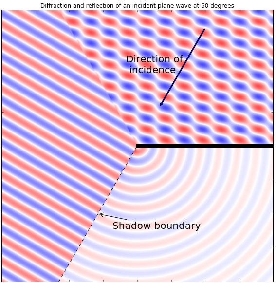

# Spatial Audio 概念

|  |
| --- |
| Wwise SDK 2025.1.4 - Windows |

Spatial Audio 概念

此页面简要阐述了几个与 Spatial Audio 相关的基本声学概念：

- [衍射](spatial_audio_concepts.html#spatial_audio_concepts_diffraction)
- [透射](spatial_audio_concepts.html#spatial_audio_concepts_transmission)
- [声障和声笼（Obstruction and Occlusion）](spatial_audio_concepts.html#spatial_audio_concepts_obsocc)
- [房间耦合](spatial_audio_concepts.html#spatial_audio_concepts_roomcoupling)

# 衍射

在声波遇到小型障碍物、大型障碍物边缘或房间开口边缘时，会在其周围发生弯曲，出现衍射现象。这时声音会穿过房间开口（门户），传播到另一侧。也就是说，听者不用站在房间开口正前方也能听到声音。在游戏中，衍射很重要。因为它可以告知玩家与发声体之间存在哪些路径。在以下声场图中，平面波从右上方入射，并在传播过程中遇到有限面（图中表示为从中央向外延伸的黑线）。此边缘造成的扰动即称为“衍射”。左侧区域为 View Region（可视区）。在此，平面波直接穿过，不发生任何改变。右上区域为 Reflection Region。在此，平面波遇到表面发生反射，并与入射波混合，呈现锯齿状。右下区域为 Shadow Region。在此，衍射发挥主导作用。此图只是一个粗略的示意图。在现实中，区域边界处的声场是连续的，而且 View Region 也会出现边缘衍射，只是与入射波本身相比通常可以忽略不计。

我们可以把边缘看作一个点声源，其振幅随距离减小。并且，频率越高，振幅减小得越快。也就是说，我们可以使用低通滤波器准确地对其进行建模。Wwise Spatial Audio 通过两个 API 函数构建衍射模型。如需了解如何利用 Room 和 Portal 构建门户衍射模型，请参阅 [衍射](spatial_audio_roomsportals_apioverview.html#spatial_audio_roomsportals_modelingsoundpropagationfromotherrooms_diffraction) 章节；如需了解如何利用几何构造构建发声体及早期反射衍射模型，请参阅 [使用 Geometry API 模拟衍射和透射](spatial_audio_apigeometry_diffract.html) 章节。

# 透射

声音透射是 Wwise Spatial Audio 内模拟的另一相关声学现象。透射是指声能穿透障碍物的传播情形，透射损失是指能量被障碍物消耗的比例。请不要将其与吸收混淆。后者是指能量被反射声波消耗的比例。

不过，两种媒介的分界面上的交互作用可能会相当复杂。反射与吸收能量的比率取决于材料表面的特性，而传播与透射损失则与障碍物的大小、形状和密度有关。

在声波遇到密致材料（如混凝土）构成的障碍物时，与衍射相比，通过透射传达给听者的能量比例可能会很小，尤其是在附近有开口的情况下。倘若附近没有开口或者障碍物由松散材料（如木板或玻璃）构成，透射所起的作用就会非常明显，这时便有必要加以模拟。

# 声障和声笼（Obstruction and Occlusion）

在声源和听者之间的空间被阻挡时，声音就会出现声障和声笼现象。声障是指部分阻挡，声笼是指完全阻挡。在使用 Spatial Audio 时，建议着重使用带衍射和透射的几何构造来实现想要的效果。不过，也可选择结合 Spatial Audio 或单独设置声障值和声笼值。有关声障和声笼的详细信息，请参阅 [声障、声笼及 Game-defined Auxiliary Sends](soundengine_obsocc.html) 章节。

# 房间耦合

在经过足够长时间后，发声体会在所处环境内制造出一个基于声学属性的漫反射场。在游戏中，为了模拟这一情形，通常会利用混响效果器来调节参数，并以此表示与其关联的环境。另外，漫反射场还会穿过 Room 开口和墙壁，传播到听者所在 Room，并对听觉环境产生激励作用。房间耦合也叫混响，是指声能从某一环境或 Room 到另一环境或 Room 的传播。游戏一般通过将某一 Room 的混响器输出馈送到另一 Room 的混响器来对此进行建模。

# 摘要：总结

在 Spatial Audio 环境下，声障、声笼、衍射和透射紧密关联并会相互影响。

简写如下：

- 在声源和听者之间的区域被对象或门户部分阻挡时，会出现*声障*现象。
- 在声源和听者之间的区域被完全阻挡时，会出现*声笼*现象。
- *衍射*是指声波绕过障碍物传播的现象。
- *透射*是指声波穿透障碍物传播的现象。
- 因此，在声障条件下，会涉及到透射和衍射；因为有些声波会绕开障碍物，有些则会穿透障碍物。在声笼条件下，只会涉及到透射。