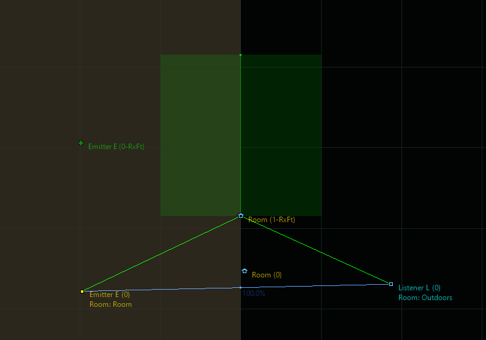

# Room 和 Portal 概述

|  |
| --- |
| Wwise SDK 2025.1.4 - Windows |

Room 和 Portal 概述

以下是此页面的概要：

- [声音传播特性概要](spatial_audio_roomsportals_apioverview.html#spatial_audio_roomsportals_summary)
- [为其他房间的声音传播建模](spatial_audio_roomsportals_apioverview.html#spatial_audio_roomsportals_modelingsoundpropagationfromotherrooms)
- [衍射](spatial_audio_roomsportals_apioverview.html#spatial_audio_roomsportals_modelingsoundpropagationfromotherrooms_diffraction)
- [Wet Path Diffraction](spatial_audio_roomsportals_apioverview.html#spatial_audio_roomsportals_modelingsoundpropagationfromotherrooms_wet_diffraction)
- [通过 Portal 模拟虚拟定位和衍射](spatial_audio_roomsportals_apioverview.html#spatial_audio_roomsportals_aboutgameobjects_emitters)
- [透射](spatial_audio_roomsportals_apioverview.html#spatial_audio_roomsportals_modelingsoundpropagationfromotherrooms_transmission)
- [房间耦合](spatial_audio_roomsportals_apioverview.html#spatial_audio_roomsportals_modelingsoundpropagationfromotherrooms_coupling)
- [多房间穿透](spatial_audio_roomsportals_apioverview.html#spatial_audio_roomsportals_multiplerooms)
- [Room 游戏对象行为](spatial_audio_roomsportals_apioverview.html#spatial_audio_roomsportals_aboutgameobjects_roomsandportals)
- [房间底噪](spatial_audio_roomsportals_apioverview.html#spatial_audio_roomsportals_roomtones)
- [Portal 的 Spread 和 Aperture 值](spatial_audio_roomsportals_apioverview.html#spatial_audio_roomsportals_spread)

# 声音传播特性概要

下表简要列出了 Spatial Audio Room 和 Portal 的特性，并根据声学现象进行了分组，同时说明了与之对应的 Spatial Audio 属性以及声音设计师如何将其用于工程。

| Acoustic Phenomenon | Spatial Audio | Sound Design in Wwise |
| --- | --- | --- |
| Diffraction of direct path | - Calculates indirect sound paths that drive diffraction values - Modifies the game object position to simulate the perceived angle of incidence of the diffracted sound | - Assigns diffraction values to volumes and filters via diffraction curves in the Attenuation ShareSet, project diffraction curves, or built-in RTPCs |
| Diffuse field (reverb) | - Send to room's auxiliary bus - Constant power transitions | - Reverb, bus volume and game-defined send offset on Property Container |
| Room coupling: reverb spatialization and diffraction of adjacent room's diffuse field | - Calculates the propagation of the diffuse field through portals - Room object positioning and spread - Send to listener's room's auxiliary bus | - Assigns diffraction values to volumes and filters via diffraction curves in the Attenuation ShareSet, project diffraction curves, or built-in RTPCs - Volume, filtering, or any property on Bus - 3D panning of busses, reverb, bus volume and game-defined send offset of Auxiliary Bus to other busses |
| Transmission | - Drives transmission loss values according to the room and surfaces the sound path goes through | - Assigns transmission loss values to volumes and filters via transmission curves in the Attenuation ShareSet, project transmission curves, or built-in RTPCs |

# 为其他房间的声音传播建模

在 Spatial Audio Room 和 Portal 环境下，将利用抽象概念 Room 和 Portal 来管理听者之外其他房间的声音传播。另一 Room 内的发声体会通过多个 Portal 及与这些 Portal 关联的衍射将声音传播到听者；若无衍射路径，则通过声音对房间墙壁的透射来传播。对于需要传播的所有声音，确保在 Positioning 选项卡中选中 **Enable Diffraction and Transmission** 复选框。

# 衍射

对于相邻 Room 内的每个发声体，Spatial Audio 都会计算相连 Portal 最近边缘与 Shadow Boundary（阴影边界）的衍射角。有关详细信息，请参阅 [衍射](spatial_audio_concepts.html#spatial_audio_concepts_diffraction) 章节。然后，将此衍射角（最大 180 度）映射为衍射系数 (0 ~ 100%)，并提供给 Wwise 用户，以便从两种方式中选一种来设置对应音频变换。用户可为“发声体”游戏对象设置 Diffraction 值，也可设置内置游戏参数 Diffraction 值。

“发声体”游戏对象上的 Diffraction 值用于驱动设计工具中的曲线。By default, the project diffraction curves are used. They can be authored in the Project Settings' Environmental Curves tab and will impact Volume, LPF, and HPF to emulate volume and frequency-dependent behaviors. Project diffraction curves impact all the sounds in a project, which makes them less flexible. 不过，可在应用于声音的 Attenuation ShareSet 中创建自定义 Diffraction 曲线。

除此之外，还可使用 Diffraction 内置参数。为此，可创建游戏参数并在对应 **Bind to Built-in Parameter** 下拉菜单中选择 **Diffraction**。推送至该游戏参数的值的作用域由游戏对象界定，确保与发声体一一对应。You may then use it with an RTPC to control any property of your Property Container. Output Bus Volume 和 Output Bus LPF 要优于基准 Volume 和 LPF，因为它们只会应用于直达信号路径，而不会应用于 Room 混响对应的辅助发送。

|  |  |
| --- | --- |
|  | **警告:** 跟曲线相比，在使用内置参数时需要执行更多操作。内置游戏参数也只应用在适用于游戏对象的所有位置的单个值上。在设有多个值时，取最小值。如上文所述，在 Room 包含不止一个 Portal 时，会使用多个游戏对象位置。因此，不建议将内置参数用于此类场景。 |

# Wet Path Diffraction

A Room's diffuse energy is an essential part of the Wwise Spatial Audio sound propagation model. The reverb signal chain, or wet path, also has diffraction ("wet diffraction") applied to it. Wet diffraction models the diffuse field of a room being scattered as it propagates out of portals or around obstacles. Wet diffraction is applied on the input connection to the Room bus (that is, the auxiliary send from the emitter to the room), so that each sound uses its own individual diffraction curve. The wet diffraction value for each Room Auxilliary Send is calculated using the path between the emitter and the listener.

The wet diffraction calculation is similar to the dry diffraction calculation, but with a modified diffraction angle calculation as the path passes through the Room to which the emitter is sending. Spatial Audio assumes that the diffuse energy enters or exits a Room perpendicular to its Portals, and does not diffract inside the Room itself. Thus, when the path enters or exits the Room, it computes a diffraction angle relative to the Portal's normal vector, effectively using only half of the angle as the path bends into the Portal. All geometry inside the Room is ignored, because the Room is treated as an ideally diffuse field.

Consider the following scenario, with an emitter, listener, and a single sound propagation path. The emitter has two Room Auxilliary Sends: one to "Outside," the room the emitter is currently in, and one to "Room A," an adjacent room.

Wet diffraction is calculated separately for each of the two Room Auxilliary Sends:

- For the Room send to "Outside":
  - There are no diffraction points (due to geometry) in the Outside Room, but if there were, they would be ignored, because the Outside is considered an ideally diffuse field.
  - The path then exits Outside from "Portal 1." Diffraction from portal 1, as the paths exits the portal, is calculated using the portal normal. This is angle C.
  - Portal 2 is not connected to Outside, so we use the standard diffraction calculation. This is angle D.
  - TOTAL Wet Diffraction: C + D
- For the Room send to "Room A":
  - There are no diffraction points (due to geometry) in the Outside Room, but if there were, they would be accounted for using the standard diffraction calculation.
  - The path enters "Room A" through "Portal 1." Diffraction from portal 1, as the path enters the portal, is calculated using the portal normal. This is angle A.
  - The path then exits "Room A" through "Portal 2." Diffraction from portal 2, as the paths exits the portal, is calculated using the portal normal. This is angle E.
  - TOTAL Wet Diffraction: A + E

Finally, the wet diffraction value can never exceed the dry diffraction value. It is clamped if the calculation above results in a value greater than the dry diffraction value.

# 通过 Portal 模拟虚拟定位和衍射

在完成 Spatial Audio 的初始化设置 `AkSpatialAudioInitSettings::bCalcEmitterVirtualPosition` 后，将修改听者相邻 Room 内发声体的位置，使其与听者之间呈衍射角（如适用）。In the screenshot of the 3D Game Object Profiler, below, the listener (*Listener L*) is on the right of the Portal and the "real" emitter is on the lower left (*Emitter E*). 因此，Spatial Audio 将发声体重新定位到了左上方，使视位置看上去就像从该角落切入一样，并始终符合传播距离的衰减规律。The listener is about 45 degrees into the shadow zone of the Portal edge, resulting in a diffraction factor of about 27%.

在有多个 Portal 连通两个 Room 时，Spatial Audio 会将多个位置指派给发声体（每个 Portal 指派一个）。这时将使用 `MultiPosition_MultiDirection` 模式，以免在启用或禁用 Portal 时影响与此同时感知到的其他 Portal 的音量。

# 透射

When an emitter is in a different room than the listener, and has no direct line of sight through a portal, Spatial Audio models sound transmission through walls by applying a transmission loss factor to the Game Object.

Spatial Audio models sound transmission between Rooms differently depending on whether or not geometry is available. Refer to [Modeling Transmission Between Rooms with Geometry](spatial_audio_roomsportals_apioverview.html#spatial_audio_roomsportals_modelingsoundpropagationfromotherrooms_transmission_geometry) and [Modeling Transmission Between Rooms without Geometry](spatial_audio_roomsportals_apioverview.html#spatial_audio_roomsportals_modelingsoundpropagationfromotherrooms_transmission_no_geometry).

Regardless of how the transmission loss coefficient is derived, it is applied on the Room send connection, between the emitter and each Room, and is converted using the curves defined in the attenuation settings to map transmission loss to volume attenuation and filtering. Refer to [针对衍射和透射设置声音](spatial_audio_apigeometry_diffract.html#spatial_audio_apigeometry_diffract_direct_api).

By default, the project transmission curves are used for transmission. They can be authored in the Project Settings' Environmental Curves tab and will impact Volume, LPF, and HPF to emulate volume and frequency-dependent behaviors. Project transmission curves impact all the sounds in a project, which makes them less flexible. 不过，可在应用于声音的 Attenuation ShareSet 中创建自定义 Transmission 曲线。

It is also possible to map transmission loss to any other Wwise parameter with an RTPC bound to the Transmission Loss built-in parameter. However it is difficult to use the Transmission Loss built-in parameter effectively because the transmission path is typically one of many sound paths between and emitter and listener, and RTPCs are applied at the Game Object scope.

|  |  |
| --- | --- |
|  | **备注:** 最好使用曲线而非 RTPC 来模拟透射损失，因为这样在一并对透射和衍射进行建模时具有更高的精确度。由于 RTPC 无法单独应用于某条特定声音路径，所有映射至透射损失 RTPC 的参数会同时影响源自发声体的潜在衍射路径。 |

## Modeling Transmission Between Rooms with Geometry

When geometry is available, sound transmission is modeled using `AkAcousticSurface::TransmissionLoss`. Spatial Audio Geometry allows for detailed sound transmission modeling because you can, if desired, assign different transmission loss coefficients to each individual triangle. Spatial Audio also uses room geometry to compute a spread value for the transmission path. When a sound emitter is blocked by one or more geometric surfaces, then the transmission loss factor of the geometry (as defined by [AkAcousticSurface::transmissionLoss](struct_ak_acoustic_surface_ab0ec8a6eee25b28b4f8b9e91dbff17da.html#ab0ec8a6eee25b28b4f8b9e91dbff17da)) is applied. If there is more than one surface between the emitter and listener, then the maximum transmission loss factor is taken. Refer to [针对透射设置几何构造](spatial_audio_apigeometry_diffract.html#spatial_audio_apigeometry_diffract_geometry_settings_transmission) for more details.

|  |  |
| --- | --- |
|  | **备注:** For accurate room transmission, it is necessary to define a shape for the Room so that the Room has a source and an extent. The Room shape is calculated from the bounding box surrounding the geometry associated with the Room. To set up Room transmission via the API, refer to [设置 Room 几何构造](spatial_audio_roomsportals_apiconfig.html#spatial_audio_roomsportals_apiconfigroomgeometry). If you do not want to use the geometry for diffraction and reflection calculation, set the `AkGeometryInstanceParams::UseForReflectionAndDiffraction` to false on the Room's `AkGeometryInstance`. |

## Modeling Transmission Between Rooms without Geometry

If geometry is not available to Spatial Audio, the transmission loss value is approximated from each Room's `AkRoomParams::transmissionLoss` value. Room 之间的透射损失依据 Room 设置的 `AkRoomParams::TransmissionLoss` 参数进行计算，并取听者所在 Room 和发声体所在 Room 当中的最大值。A bounding box for the Room is approximated by fitting a bounding box around all Portals. This bounding box is used to calculate the spread value of the transmission path.

## Transmission of Room Tones and a Room's Diffuse Field

In addition to sound transmission of individual emitters within a Room, Spatial Audio models sound transmission of the Room itself and this includes the contribution of the diffuse reverb field, as well as any Room tones that are playing inside a Room, transmitting through walls.

Transmission loss filtering and attenuation is applied at the input of a Room Auxilliary Bus, so that individual emitters can contribute differently to the reverb. However, it is the output of the Room Game Object that is spatialized. It is necessary to set `AkRoomParams::transmissionLoss` to properly spatialize the Room's reverb. A low transmission loss value emphasizes panning the Room towards the Room's center (the center of the Room bounding box) and a high value emphasizes panning towards the Room's Portals.

Because Room tones do not have a point source position, they also rely on `AkRoomParams::transmissionLoss` to simulate transmission. Therefore, it is always necessary to have a representative value assigned to the Room's `AkRoomParams::transmissionLoss`.

# 房间耦合

相邻房间内通过 Portal 渗透到听者所在房间的衍射能量可被视为 Portal 位置的声源，因此也应对听者所在房间产生激励作用。也就是说，应将其发送至听者所在房间对应的 Auxiliary Bus。为此，可针对相邻房间对应的辅助总线勾选 **Enable Game-Defined Sends** 复选框（如上文所述）。您可以使用 Game-Defined Send Offset（游戏定义的发送偏置）来调节发送到其他 Room 混响器的散布量。

# 多房间穿透

多个房间之间也会发生声音传播。在搜索传播路径时，会在 SpatialAudio 内部搜索 Room 树。为了避免循环连接，在遇到已经到过的 Room 时，将停止搜索。搜索深度可通过 Spatial Audio 的初始化设置 `AkSpatialAudioInitSettings::uMaxSoundPropagationDepth（默认值为` 8）来加以限制。

# Room 游戏对象行为

Spatial Audio 会在内部按 Room 将游戏对象逐个注册到 Wwise。

The positions associated with a Room's game object, as seen in the Game Object 3D Viewer, are calculated by Spatial Audio based on the paths to that room. Rooms do not use the positions set by `AK::SoundEngine::SetPosition`.

|  |  |
| --- | --- |
|  | **警告:** 此游戏对象的位置和辅助发送值不可直接调节。 |

在听者位于 Room 内时，Room 内的游戏对象将随听者移动。因此，Room 和 Listener 对象之间的距离近似为 0。不过，其朝向与 Room 设置 (`AkRoomParams`) 中指定的朝向保持一致。有关 3D 总线朝向的论述，请参见“ [在 Wwise 中设置 Room Auxiliary Bus](spatial_audio_roomsportals_wwisesetup.html#spatial_audio_roomsportals_using3dreverbs) ”部分。

在听者位于 Room 外时，Room 内的游戏对象将沿用对应 Portal 的位置。More precisely, it is placed on the plane that represents the Portal's center, at the point that is closest to the listener. 您可以通过查看 Room 内的游戏对象来验证这一点（参见上文“ [通过 Portal 模拟虚拟定位和衍射](spatial_audio_roomsportals_apioverview.html#spatial_audio_roomsportals_aboutgameobjects_emitters) ”部分的 3D Game Object Profiler 截图）。

对于多个 Portal，在 `MultiPosition_MultiDirection` 模式下，将为 Room 内的游戏对象指派多个位置（情形与发声体相同）。

# 房间底噪

Room 游戏对象的主要作用在于对混响（发声体的湿声路径）实施空间化处理。不过，我们可以有效运用 Room 和 Portal 的空间化行为（参见 [Room 游戏对象行为](spatial_audio_roomsportals_apioverview.html#spatial_audio_roomsportals_aboutgameobjects_roomsandportals) 章节），来直接针对 Room 游戏对象发送 Event 以实现房间底噪。有关如何在 Wwise 中设置房间底噪的信息，请参阅 [在 Wwise 中设置房间底噪](spatial_audio_roomsportals_wwisesetup.html#spatial_audio_roomsportals_roomtonesinwwise) 章节。有关如何发送 Event 的信息，请参阅 [针对 Room 游戏对象发送 Event](spatial_audio_roomsportals_apiconfig.html#spatial_audio_roomsportals_apiconfigroomtones) 章节。

# Portal 的 Spread 和 Aperture 值

Wwise 中声音的散布决定在将 3D 声音摆位到 Audio Bus 时要构建多宽的声场。对于大部分声音，Wwise 中会依据声音衰减设置中的曲线来定义散布。不过，对于 Room 游戏对象上播放的声音（即房间底噪）和发送到 Room Auxiliary Bus 的混响，并不需要定义所述曲线，因为 Spatial Audio 会自动计算散布。

若针对声音在 Wwise 的衰减设置中定义了散布曲线，且该声音穿过了一个或多个 Portal，则最终的散布曲线将由这些 Portal 的 Aperture 决定。您可以将 Aperture 值视为声音散布的上限，并利用其模拟声音穿过 Portal 时声场的收缩。

通过以下设置，可在 Wwise 的 Game Object 3D Viewer 中直观地显示发声体的散布：

- 在捕获数据前，确保在 Profiler Settings 中选中 **Obstruction/Occlusion Data**。
- 在 Game Object 3D Viewer Settings 对话框中，确保选中 **Show Spread Cones**。

除此之外，也可在 Advanced Profiler 的 Obs/Occ 选项卡中查看游戏对象的 Spread 值和 Portal 的 Aperture 值。

## 游戏对象的 Spread 值

Game objects may have a Spread value that is calculated by Spatial Audio if they are [Radial Emitters](spatial_audio_radial_emitters.html).

For Room Game Objects, the Spread value is the same as the Aperture value, and it is calculated by approximating the solid angle that each Portal subtends on the listener. Note that a Room Game Object has a unique spread value per Portal (each Portal is rendered as a unique sound position).

## Portal 的 Aperture 值

The Aperture value for a Game Object is calculated on a per-path basis, and is the result of the minimum spread value for all Portals traversed in a particular sound path. 对于 Room 游戏对象，Spread 和 Aperture 采用相同的值。

## Spread 计算概要

对于给定的声音位置和听者对，按照以下方式计算最终的 Spread 值：

- 依据声音位置和听者之间的距离对声音的散布曲线取值。
- 若没有散布曲线，则由游戏对象的半径决定 Spread 值（参见 `AK::SpatialAudio::SetGameObjectRadius` 章节）。若未给出半径，则不定义散布曲线，并将 Spread 值设为 0。
- The sound's Aperture value is calculated from all Portals in the sound position's path. 最后通过取最小值将多个 Portal 的 Aperture 值合而为一。
- 通过取较小值将声音的 Spread（源自散布曲线或游戏对象的 Spread 值）和 Aperture 合而为一。最后将该 Spread 值传给声音引擎中的声像摆位器。

## Portal Area of Influence

The shape of a Portal is defined by the values in `AkPortalParams::Extent`. However, a Portal has an area of influence past the box formed by these extents. The effects of a Portal are based on distance from the Portal's center, up to `AkPortalParams::Extent::halfDepth`, and extend past the Portal's opening in every direction. Although the Game Object 3D Viewer displays a Portal as a rectangle, in practice this shape is rounded.

The following illustration is a top-down view of a Portal that connects a small Room to the outside.

|  |  |
| --- | --- |
|  | Room |
|  | Portal |
|  | Outside |

The area in green represents the Portal's `AkPortalParams::Extent`. The area in blue is the area of influence of the Portal while inside the small Room. The area in red shows the influence of the Portal while outside of the Room. This area extends around the corner and behind the Portal.