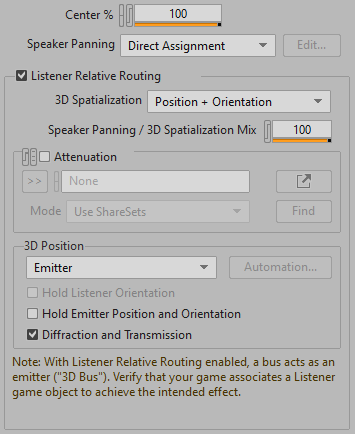
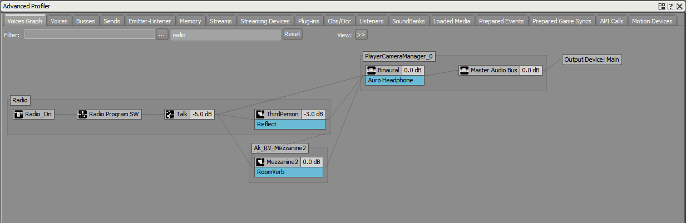

# 在 Wwise 中设置 Room 和 Portal

|  |
| --- |
| Wwise SDK 2025.1.4 - Windows |

在 Wwise 中设置 Room 和 Portal

# 在 Wwise 中设置声音

要想在“发声体”游戏对象上使用 Room Reverb，必须在 Wwise 设计工具中启用 **Use game-defined auxiliary sends** 复选框。除了游戏要求的 Game-defined 发送，Spatial Audio 还会应用针对 Room 的发送。

# 在 Wwise 中设置 Room Auxiliary Bus

在创建 Room 总线时需要选用正确的定位选项：启用 **Listener Relative Routing**，将 3D Spatialization 设为 Position + Orientation，同时启用 **Use game-defined auxiliary sends**。除此之外，也可使用 "<b>Room Auxiliary Bus</b>" Preset（预设）来创建总线。

Spatial Audio Room 和 Portal 所用的 Auxiliary Bus 设计与传统的环境建模并无本质区别。它要求为每个 Room 指派一条 Auxiliary Bus，并针对其启用声音设计师所选混响效果器。无论听者是在 Room 内部还是外部，使用的都是同一条总线。唯一的区别是需要在 Positioning（定位）选项卡中启用 Listener Relative Routing，并将 3D Spatialization 设为 Position + Orientation（位置 + 朝向）或 Position（位置），以便将其设为 3D 模式（如下图所示）。如此一来，Spatial Audio 便可在 Portal 位置对相邻 Room 的混响进行空间化处理，进而作用于 Room 内的游戏对象定位和 Spread（散布）。

Room 的基准朝向在房间设置（ `AkRoomParams::Up` 和 `AkRoomParams::Front` ）中定义，并保持不变。对应游戏对象的朝向与 Room 的朝向保持一致。在听者位于 Room 内时，Spatial Audio 会将总线的 Spread 设为 100（360 度）。借助 3D 定位，可根据听者和 Room 的相对朝向旋转混响输出，并将其摆位至父总线。这是因为 Auxiliary Bus 与 Room 内的游戏对象绑定，而父总线又与听者绑定。以下截图显示了一个发声体——无线电——正在向 Auxiliary Bus *Mezzanine2* 发送。从下图可以看出，针对该房间（*Ak\_RV\_Mezzanine*）创建了独立的游戏对象 。该对象既不是 Radio（无线电），也不是听者 (*PlayerCameraManager\_0*)。

假如混响中内嵌有空间化早期反射模式（该模式直接存在于 RoomVerb 的 ER 部分，并间接存在于 AK Convolution Reverb 中使用的多声道 IR 录音中），则其将与 Room 绑定，而不会随听者转向。这样做是为了适当营造沉浸感。换句话说，最好使用“旋转特性稳定”的配置。Ambisonics 配置相对于旋转具有不变性，所以更合适。标准配置（4.0、5.1 等）则不太合适。在使用标准配置时，最好选用没有中置声道的配置，并为各条辅助总线应用完全相同的配置，同时将 Focus（聚焦）设为 100。在这种情况下，假设 4.0 混响跟随 Room 朝向北方，那么听者在面朝北方时听到的混响效果会跟直接指派给扬声器时一样。听者在面朝正东、正西或正南时则会听到原始混响，但声道会互换。最后，听者在面朝其他方向时会听到每个声道的原始混响被混入一对输出声道。

在听者远离房间对应 Portal 时，Spatial Audio 会根据 Portal 的尺寸来缩小散布范围，随着距离的延长逐渐将混响输出收缩为点声源。在听者位于 Portal 中间时，Spread 设为 50（180 度）。在穿过房间后，Spread 进一步增大。此时，房间开口始终朝向最近的 Portal。

在为穿过 Portal 的声音混音时，Spatial Audio 会计算声源和听者之间整条路径的距离。在将声音混音到 Room 总线之前，此距离会应用于每个声音的衰减曲线，以此保证采用不同衰减曲线的声音具有正确的相对音量。向 Room 总线直接应用额外的衰减不会产生任何效果。

Room 游戏对象的位置由 Spatial Audio 控制。在听者位于 Room 之内时，该游戏对象将被放在与听者相同的位置。在这种情况下，若指派有衰减曲线，则全部在距离 0 处取值。

|  |  |
| --- | --- |
|  | **备注:** 现在使用原始声音的衰减曲线将 Room 混响的 Diffraction、Transmission Loss、Occlusion 和 Obstruction 应用于 Emitter-Room Connection。将衰减指派给 "Room" Auxiliary Bus 不会产生任何效果。 |

# 房间耦合

房间耦合（参见 [房间耦合](spatial_audio_concepts.html#spatial_audio_concepts_roomcoupling) 部分）可通过链接 Room 总线来实现。为此，请确保针对所有 "Room" Auxiliary Bus 启用 **Enable Game-Defined Sends**（启用游戏定义的发送）复选框。这样 Room 就可同时将混响发送到听者所在的 Room 或路径中的下一 Room。声音的 Game-Defined Auxiliary Sends 音量和衰减曲线会控制要将多少声音混音到房间混响效果器链的第一条总线，各个 Room 的 Game-Defined Auxiliary Sends 音量则会决定将多少发送到效果器链中的下一 Room。它会影响通过 Portal 传播到相邻 Room 的声能数量。

对于选中 **Enable Game-Defined Sends** 复选框的发声体，会发送到其自身 Room 的总线以及所有与听者之间存在活跃路径的相邻 Room。各个 Room 的相对发送电平代表通过 Portal 传播到相邻 Room 和留在发声体所在 Room 的声能能量。所有与发声体所在 Room 连通的 Portal 都包含在此比率计算中，即便跟该 Portal 反面 Room 的 Auxiliary Bus 之间并无活跃通路。

# 在 Wwise 中设置房间底噪

对于要用作房间底噪的声音，应尽量在 Wwise 内 Property Editor 的 Positioning 选项卡中为其设定与 Room Auxiliary Bus 相同的设置（参见 [在 Wwise 中设置 Room Auxiliary Bus](spatial_audio_roomsportals_wwisesetup.html#spatial_audio_roomsportals_using3dreverbs) 章节）。

房间底噪的设置跟 Room Auxiliary Bus 的设置类似。两者均：

- 启用 **Listener Relative Routing**。
- 将 **3D Spatialization** 设为 **Position + Orientation**。
- 将 **3D Position** 设为 **Emitter**。
- 若要求房间底噪对 Room 的混响（参见 [针对 Room 游戏对象发送 Event](spatial_audio_roomsportals_apiconfig.html#spatial_audio_roomsportals_apiconfigroomtones) 章节）和相邻 Room 产生激励作用，则启用 **Use game-defined aux sends**。

不过，这两项设置有一个区别：

- 房间底噪通常具有唯一的 Attenuation ShareSet，而 Room Auxiliary Bus 则不会定义衰减（Room 总线会转而使用“发声体”游戏对象所播放声音的 Auxiliary Send Volume 曲线）。记住设计该曲线时 Room 对象的定位行为：在听者处在 Room 之内或刚好处在相连 Portal 位置时，距离的取值为零。在听者慢慢远离 Portal 时，该值会逐渐增大。