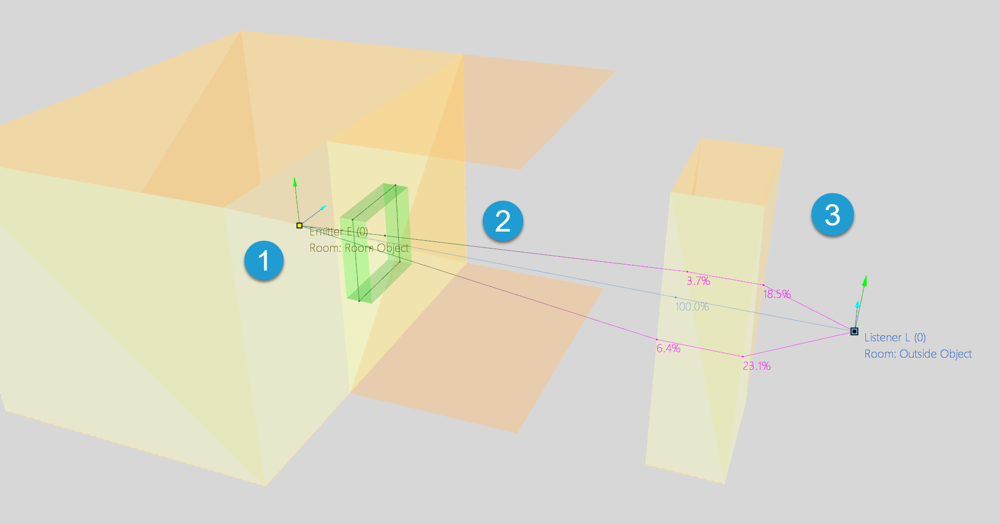
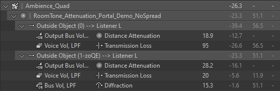
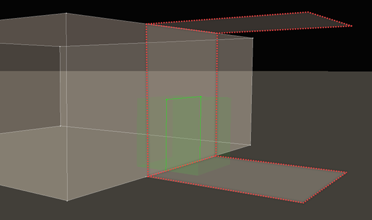

# 使用 Reverb Zone

|  |
| --- |
| Wwise SDK 2025.1.4 - Windows |

使用 Reverb Zone

Reverb Zone 可对具有不同混响效果器的 Room 内的区域进行建模，但不需要将 Portal 连到相邻 Room。在没有明显的墙壁或区域交界处的负空间大于正空间时，一般就要使用 Reverb Zone 而非标准 Room。下面是一些可以使用 Reverb Zone 的示例场景：

- 有遮盖并与户外空间连通的阳台。它会形成一个没有墙壁但有地板和顶棚的 Room。
- 高速立交桥。立交桥下的区域需要独特的混响效果。相较于与外部区域连通的大型 Portal，Reverb Zone 解决方案更为精准、便捷。
- 森林区域。森林混响跟周围环境不同，而且可能有独特的环境声。
- 山区的小城市或村落。

Reverb Zone 是 Wwise Spatial Audio 内的一种 Room，其具有与标准 Room 相同的各种属性。除此之外，Reverb Zone 还有：

- 父级 Room。Reverb Zone 的父对象是包含 Reverb Zone 的 Room。父级 Room 也可以是有自己父对象的 Reverb Zone。Reverb Zone 及其父对象合起来构成 Room 层级结构。建议将 Reverb Zone 完全包含在其父对象之内。
- 过渡区。过渡区是 Reverb Zone 与其父对象交界处的模糊边界。过渡区的宽度可按游戏单位来自定义。过渡区相当于将 Reverb Zone 与其父对象连通的 Portal：在 Game Object 处于过渡区内时，其可基于各项参数应用交叉淡变，实现两个 Room 之间的平滑过渡。
- Geometry Set 和 Geometry Instance。藉此，可定义 Reverb Zone 的大小和形状。 对于标准 Room，可以选择是否定义几何构造。不过，对于 Reverb Zone，必须定义几何构造。这样 Spatial Audio 才能计算对象进出 Reverb Zone 的时机。
- 衰减方面的独特考虑（参见 [Reverb Zone 和衰减](spatial_audio_roomsportals_reverbzones.html#spatial_audio_roomsportals_reverbzones_attenuation) 章节）。

# 通过 Reverb Zone 传播声音

您可以通过不同的方式来管理声音的传播：既可通过 [AK::SoundEngine::SetGameObjectAuxSendValues](https://www.audiokinetic.com/library/edge/?source=SDK&id=namespace_a_k_1_1_sound_engine_af960fca0239e219b9d08c2659fe9e5d4.html) 添加 Auxiliary Send，也可选择使用 Reverb Zone。不过，Reverb Zone 有个优点：其可紧密结合并充分利用 Wwise Spatial Audio 中的 Room 和 Portal API 所提供的声音传播框架。

- Reverb Zone 也是 Room。因此，其可通过独特的 Game Object 进行渲染，并以 3D 形式实施空间化处理。
- Reverb Zone 可与其他 Room（包括其他 Reverb Zone）联用。在两个 Room 通过 Portal 连通时，声音可在这两个 Room 之间传播；在某个 Reverb Zone 为另一 Reverb Zone 的父级 Room 时，声音可在这两个 Reverb Zone 之间传播。

以下示例展示了 Reverb Zone 的用法。该示例包含在 Integration Demo 工程中，并作为 Wwise SDK 的一部分一并分发。

|  |  |
| --- | --- |
|  | 发声体在 "Room Object" Room 内播放声音。 |
|  | 声音通过与 "Patio Object" Reverb Zone 连通的 Portal 传出。 |
|  | 声音继续向外传播到 Reverb Zone 的父级 Room。在传到外部时，声音还会绕过几何构造所定义的障碍物进行衍射。 |

在 Advanced Profiler 或 Voice Inspector 的 Voice Graph 中，可以看到五个 Game Object 被连在了一起。

|  |  |
| --- | --- |
|  | Emitter E 发声体将信号发送到其当前所在 Room 及相邻 Room。In this case, the emitter is inside "Room Object" and adjacent to "Patio Object". |
|  | 各个 Room 沿着通往听者的最短路径将信号发送到下一 Room。Room Object 将信号发到 Patio Object，Patio Object 再将信号发到 Outside Object。Patio Object 和 Outside Object 之间的通路是基于两个 Room 之间的父子关系建立的。 |

# Reverb Zone 过渡区

您可以使用 `AK::SpatialAudio::SetReverbZone` API 指定 Reverb Zone 和父级 Room 之间的过渡区。此过渡区的功能跟 Portal 差不多。过渡区之间可以重叠，跟 Portal 也可以重叠，只要 Room 的几何构造不重叠就行。您可以通过这种重叠在 Reverb Zone 之间实现平滑的交叉淡变。若要为 Reverb Zone 定义过渡区，Reverb Zone Room 须有包含 1 个或更多透明表面的几何构造。透明表面是指 `AkAcousticSurface::transmissionLoss` 设为 0 的表面。Reverb Zone 过渡区的边界由 Room 的透明三角形的位置和传给 `AK::SpatialAudio::SetReverbZone` 的 `in_transitionRegionWidth` 参数定义。过渡区以所述各个三角形为中心。比如，在 Room 包含一个由透明表面构成的墙壁时，可通过调用 `AK::SpatialAudio::SetReverbZone` 并将 `in_transitionRegionWidth` 设为 5 来将其定义为 Reverb Zone。过渡区从 Game Object 距离 Reverb Zone 外侧透明墙壁 5 个单位开始，到 Game Object 距离 Reverb Zone 内侧墙壁 5 个单位结束。因为过渡区仅由透明三角形定义，所以可为过渡区设定自定义形状。有关如何定义 Room 几何构造的详细信息，请参阅 [设置 Room 几何构造](spatial_audio_roomsportals_apiconfig.html#spatial_audio_roomsportals_apiconfigroomgeometry) 章节。

# 创建 Reverb Zone

本节将介绍常规 Reverb Zone 的创建流程。以下示例展示了如何创建被户外环境包围的森林区域。森林区域和户外环境都有独特的混响效果。

1. 自定义 "Outdoors" Room 参数。系统会自动创建 "Outdoors" Room。不过，用户要调用 [AK::SpatialAudio::SetRoom](namespace_a_k_1_1_spatial_audio_ab991cec1e8c9f4d2721fea2d37b285c8.html#ab991cec1e8c9f4d2721fea2d37b285c8) 来为其指派混响总线。

   paramsRoom.TransmissionLoss = 0.f;

   paramsRoom.ReverbAuxBus = [AK::SoundEngine::GetIDFromString](namespace_a_k_1_1_sound_engine_a1aae6ebdec25946fb2897ce0e025366d.html#a1aae6ebdec25946fb2897ce0e025366d)("Outdoors\_Reverb"); // Auxiliary Bus 的名称，在 Wwise 设计工具中定义。

   paramsRoom.RoomPriority = 1; // 我们希望 "Outdoors" 具有最低优先级。

   [AK::SpatialAudio::SetRoom](namespace_a_k_1_1_spatial_audio_ab991cec1e8c9f4d2721fea2d37b285c8.html#ab991cec1e8c9f4d2721fea2d37b285c8)(

   [AK::SpatialAudio::kOutdoorRoomID](namespace_a_k_1_1_spatial_audio_a0b178cf8987e4fe5e2b33a6d51116a1c.html#a0b178cf8987e4fe5e2b33a6d51116a1c), // Outdoors has a special reserved ID

   paramsRoom,

   "Outdoors");
2. 定义 Reverb Zone 的形状。在本例中，形状为简单的方框。以下示例代码展示了如何创建定义表面和三角形的 Geometry Set 以及定义森林规模和位置的 Geometry Instance。

   [AkGeometryParams](struct_ak_geometry_params.html) geometryParams;

   // 为 Geometry Set 定义一个单位大小的方框。

   // 在必要时，可将这个方框重复用于多个透明 Room。

   [AkVertex](struct_ak_vertex.html) vertices[] = {

   { 0, 0, 0 },

   { 0, 1.f, 0 },

   { 1.f, 0, 0 },

   { 1.f, 1.f, 0 },

   { 1.f, 0, 1.f },

   { 1.f, 1.f, 1.f },

   { 0, 0, 1.f },

   { 0, 1.f, 1.f }

   };

   // 表面索引 ID。

   // 一并设为单个透明表面。

   [AkSurfIdx](_ak_typedefs_8h_a1d462cf28f5a36878db54c59ab410fc0.html#a1d462cf28f5a36878db54c59ab410fc0) bottomWall = 0;

   [AkSurfIdx](_ak_typedefs_8h_a1d462cf28f5a36878db54c59ab410fc0.html#a1d462cf28f5a36878db54c59ab410fc0) rightWall = 0;

   [AkSurfIdx](_ak_typedefs_8h_a1d462cf28f5a36878db54c59ab410fc0.html#a1d462cf28f5a36878db54c59ab410fc0) topWall = 0;

   [AkSurfIdx](_ak_typedefs_8h_a1d462cf28f5a36878db54c59ab410fc0.html#a1d462cf28f5a36878db54c59ab410fc0) leftWall = 0;

   [AkSurfIdx](_ak_typedefs_8h_a1d462cf28f5a36878db54c59ab410fc0.html#a1d462cf28f5a36878db54c59ab410fc0) floor = 0;

   [AkSurfIdx](_ak_typedefs_8h_a1d462cf28f5a36878db54c59ab410fc0.html#a1d462cf28f5a36878db54c59ab410fc0) ceiling = 0;

   [AkTriangle](struct_ak_triangle.html) triangles[] = {

   {0, 1, 2, bottomWall},

   {1, 2, 3, bottomWall},

   {2, 3, 4, rightWall},

   {3, 4, 5, rightWall},

   {4, 5, 6, topWall},

   {5, 6, 7, topWall},

   {6, 7, 0, leftWall},

   {7, 0, 1, leftWall},

   {0, 2, 4, floor},

   {0, 4, 6, floor},

   {1, 3, 5, ceiling},

   {1, 5, 7, ceiling}

   };

   // 只需要一个表面。

   [AkAcousticSurface](struct_ak_acoustic_surface.html) surface;

   surface.[transmissionLoss](struct_ak_acoustic_surface_ab0ec8a6eee25b28b4f8b9e91dbff17da.html#ab0ec8a6eee25b28b4f8b9e91dbff17da) = 0.f;

   surface.surface = "Transparent"

   geometryParams.[NumVertices](struct_ak_geometry_params_a1a6ffe46c9c19a547b752a44c71051ca.html#a1a6ffe46c9c19a547b752a44c71051ca) = 8;

   geometryParams.[Vertices](struct_ak_geometry_params_acc48f1b3060eaf1824086feed5f15c62.html#acc48f1b3060eaf1824086feed5f15c62) = vertices;

   geometryParams.[NumTriangles](struct_ak_geometry_params_aa4185b0fb36392987a62aff89f1c7925.html#aa4185b0fb36392987a62aff89f1c7925) = 12;

   geometryParams.[Triangles](struct_ak_geometry_params_ab808e7f98df0ca947216913c388f1713.html#ab808e7f98df0ca947216913c388f1713) = triangles;

   geometryParams.[NumSurfaces](struct_ak_geometry_params_a7da0be30513e79a77de79c6650944fab.html#a7da0be30513e79a77de79c6650944fab) = 1;

   geometryParams.[Surfaces](struct_ak_geometry_params_af7b6645b9c4b14eb2a81bd4179c946ca.html#af7b6645b9c4b14eb2a81bd4179c946ca) = &surface;

   [AK::SpatialAudio::SetGeometry](namespace_a_k_1_1_spatial_audio_a0cada36fab682ebb3005a79dd05a5640.html#a0cada36fab682ebb3005a79dd05a5640)(BOX\_GEOMETRY\_ID, geometryParams);

   // 创建用来定义 Reverb Zone 的几何构造实例。

   //

   [AkGeometryInstanceParams](struct_ak_geometry_instance_params.html) instanceParams;

   instanceParams.[GeometrySetID](struct_ak_geometry_instance_params_a8e7503216a7291f52c09825799cdce53.html#a8e7503216a7291f52c09825799cdce53) = BOX\_GEOMETRY\_ID;

   // 自定义森林的规模和位置。

   [AkVector](struct_ak_vector.html) scale = {WIDTH, HEIGHT, DEPTH};

   instanceParams.[Scale](struct_ak_geometry_instance_params_ace410bb740f89af9c10c0ecead3ecb27.html#ace410bb740f89af9c10c0ecead3ecb27) = scale;

   [AkWorldTransform](struct_ak_world_transform.html) position;

   position.[SetOrientation](struct_ak_world_transform_a00d8566d46d54639f8d742b90d415fd6.html#a00d8566d46d54639f8d742b90d415fd6)(0.f, 0.f, 1.f, 0.f, 1.f, 0.f);

   position.[SetPosition](struct_ak_world_transform_a3b29511546d8d6dcf6cf1ccaabd7e214.html#a3b29511546d8d6dcf6cf1ccaabd7e214)(X, Y, Z);

   instanceParams.[PositionAndOrientation](struct_ak_geometry_instance_params_a3287a24b0ce9ff51320b80367d832b31.html#a3287a24b0ce9ff51320b80367d832b31) = position;

   // 此几何构造实例仅用于定义 Reverb Zone。

   instanceParams.[UseForReflectionAndDiffraction](struct_ak_geometry_instance_params_a30ef95f856b020642d4a45d43c3df86d.html#a30ef95f856b020642d4a45d43c3df86d) = false;

   [AK::SpatialAudio::SetGeometryInstance](namespace_a_k_1_1_spatial_audio_ac2d5e660de0cc2a323d50f44a2731fa9.html#ac2d5e660de0cc2a323d50f44a2731fa9)(FOREST\_GEOMETRY\_INSTANCE, instanceParams);
3. 为森林创建 Room。调用 AK::SpatialAudio::SetReverbZone，来将 "Outdoors" Room 指派为父级 Room，并设置 Transition Region Width。

   paramsRoom.TransmissionLoss = 0.f; // 确保声音从某个 Room 传播到另一 Room 时没有任何透射损失。

   paramsRoom.ReverbAuxBus = [AK::SoundEngine::GetIDFromString](namespace_a_k_1_1_sound_engine_a1aae6ebdec25946fb2897ce0e025366d.html#a1aae6ebdec25946fb2897ce0e025366d)("Forest\_Reverb"); // Auxiliary Bus 的 ID，在 Wwise 设计工具中定义。

   [AK::SpatialAudio::SetRoom](namespace_a_k_1_1_spatial_audio_ab991cec1e8c9f4d2721fea2d37b285c8.html#ab991cec1e8c9f4d2721fea2d37b285c8)(FOREST\_ROOM\_ID, paramsRoom, "Forest");

   const [AkReal32](_ak_numeral_types_8h_afc38459f26e2b23defe588026e886a98.html#afc38459f26e2b23defe588026e886a98) kTransitionRegionWidth = 10.f; // customize as desired.

   [AK::SpatialAudio::SetReverbZone](namespace_a_k_1_1_spatial_audio_af57f04a0250faecc0246cf0552c03ca6.html#af57f04a0250faecc0246cf0552c03ca6)(FOREST\_ROOM\_ID, [AK::SpatialAudio::kOutdoorRoomID](namespace_a_k_1_1_spatial_audio_a0b178cf8987e4fe5e2b33a6d51116a1c.html#a0b178cf8987e4fe5e2b33a6d51116a1c), kTransitionRegionWidth)

# Reverb Zone 和衰减

就衰减而言，Reverb Zone 会沿用 Room 的行为和属性，同时加入以下诸多考量因素：

## 透射损失

通常，衍射路径并不会考虑透射损失，因为只有透射路径能穿透表面。对于 Reverb Zone，若衍射路径穿过 Reverb Zone 过渡区且 `AkRoomParams::TransmissionLoss` 大于 0，则湿声路径和房间底噪会有例外。在这种情况下，源自同一 Room 的各条路径可能会有不同程度的透射损失。对此，可在 Voice Inspector 中查看：

在这个房间底噪示例中，有一条从 Room 到听者的直接透射路径。除此之外，还有一条通过 Portal 衍射的路径。每条路径都有不同程度的透射损失。

直接透射路径上的透射按照 [Emitter-Listener (Direct) Connection](spatial_audio_roomsportals_paths.html#spatial_audio_roomsportals_paths_direct) 中所述计算（取听者 Room 和发声体 Room 透射损失当中的最大值）。在这些 Room 分属不同的 Reverb Zone 层级结构时，透射损失为 Room 和其父对象透射损失当中的最大值。

在衍射路径上，每次路径穿过过渡区，都会应用子级 Room 的透射损失（由 `AkRoomParams::TransmissionLoss` 指定）。最终透射损失为路径上各透射损失当中的最大值。

## 距离

在选择将 Reverb Zone 的哪些表面设为透明表面（透射损失为 0）时要特别小心，因为其会影响 Reverb Zone 中对象与父级 Room 之间距离的计算。所有从 Reverb Zone 或到 Reverb Zone 的距离计算都基于最近的不透明三角形。

比如，对大型 Reverb Zone 的地面来说就是如此。如果 Reverb Zone 的地面是透明的（表面透射损失为 0），而且听者所在位置远离任何墙壁，那么在计算与父级 Room 的最近距离时路径将会穿过地面。这种情况通常是不可取的。

比如，在 Reverb Zone 中的表面带有连通另一 Room 的 Portal 时就是如此。一般来说，与 Portal 相连的表面应当是不透明的。

在本例中，我们将三个高亮显示的 Reverb Zone 表面设为了不透明表面。其中，底部表面与地面共用。左侧表面与另一 Room 共用并与 Portal 相连。顶部表面可根据需要进行设计。比如，用来表示有遮盖的阳台。其余表面都是透明的。

# Reverb Zone 放置建议

- 使用 `AK::SpatialAudio::SetReverbZone` API 创建 Room 层级结构。直接通过 `AK::SpatialAudio::SetReverbZone` 创建父子关系；通过为多个 Reverb Zone 指定同一父级 Room 创建同级关系。
- 不可使用 Portal 连通同一层级结构中的 Room，因为 Reverb Zone 与父级 Room 之间的过渡已由过渡区定义。在调用 `AK::SpatialAudio::SetReverbZone` 或 `AK::SpatialAudio::SetPortal` 时，若所用参数会导致 Portal 与同一层级结构中的 Room 连通，调用操作会失败。
- Reverb Zone 过渡区始终与父级 Room 直接连通，并且不可用于连通相邻或同级 Room。所以，在两个 Reverb Zone 直接相邻并共用墙壁时，两者共用的墙壁不能是透明的。对于这些共用墙壁， `AkAcousticSurface::transmissionLoss` 要大于 0。某一 Reverb Zone 不可直接过渡到另一 Reverb Zone，所以 Reverb Zone 和其过渡区不可以重叠。
- 与其他 Room 共用的表面一般不能是透明的（包括 Reverb Zone 与父级 Room 共用表面的情形）。其中包括 Reverb Zone 的地面和顶面。一般来说，声音穿过这些表面传播是不合理的。
- 跟 Portal 一样，Reverb Zone 过渡区的大小决定 Reverb Zone 的属性在哪些地方生效。为了平滑过渡到 Reverb Zone，可能需要设定较大的过渡区。

[AkTriangle](struct_ak_triangle.html)

Triangle for a spatial audio mesh.

**Definition:** [AkSpatialAudioTypes.h:417](_ak_spatial_audio_types_8h_source.html#l00416)

[AkGeometryParams::NumTriangles](struct_ak_geometry_params_aa4185b0fb36392987a62aff89f1c7925.html#aa4185b0fb36392987a62aff89f1c7925)

AkTriIdx NumTriangles

Number of triangles in Triangles.

**Definition:** [AkSpatialAudioTypes.h:792](_ak_spatial_audio_types_8h_source.html#l00792)

[AkAcousticSurface](struct_ak_acoustic_surface.html)

**Definition:** [AkSpatialAudioTypes.h:454](_ak_spatial_audio_types_8h_source.html#l00453)

[AkAcousticSurface::transmissionLoss](struct_ak_acoustic_surface_ab0ec8a6eee25b28b4f8b9e91dbff17da.html#ab0ec8a6eee25b28b4f8b9e91dbff17da)

AkReal32 transmissionLoss

**Definition:** [AkSpatialAudioTypes.h:483](_ak_spatial_audio_types_8h_source.html#l00483)

[AkWorldTransform::SetOrientation](struct_ak_world_transform_a00d8566d46d54639f8d742b90d415fd6.html#a00d8566d46d54639f8d742b90d415fd6)

void SetOrientation(const AkVector &in\_orientationFront, const AkVector &in\_orientationTop)

Set orientation. Orientation front and top should be orthogonal and normalized.

**Definition:** [Ak3DObjects.h:220](_ak3_d_objects_8h_source.html#l00220)

[AkGeometryInstanceParams::PositionAndOrientation](struct_ak_geometry_instance_params_a3287a24b0ce9ff51320b80367d832b31.html#a3287a24b0ce9ff51320b80367d832b31)

struct AkWorldTransform PositionAndOrientation

**Definition:** [AkSpatialAudioTypes.h:858](_ak_spatial_audio_types_8h_source.html#l00838)

[AK::SpatialAudio::SetReverbZone](namespace_a_k_1_1_spatial_audio_af57f04a0250faecc0246cf0552c03ca6.html#af57f04a0250faecc0246cf0552c03ca6)

AKSOUNDENGINE\_API AKRESULT SetReverbZone(AkRoomID in\_ReverbZone, AkRoomID in\_ParentRoom, AkReal32 in\_transitionRegionWidth)

[AkGeometryInstanceParams::Scale](struct_ak_geometry_instance_params_ace410bb740f89af9c10c0ecead3ecb27.html#ace410bb740f89af9c10c0ecead3ecb27)

struct AkVector Scale

**Definition:** [AkSpatialAudioTypes.h:864](_ak_spatial_audio_types_8h_source.html#l00838)

[AkSurfIdx](_ak_typedefs_8h_a1d462cf28f5a36878db54c59ab410fc0.html#a1d462cf28f5a36878db54c59ab410fc0)

AkUInt16 AkSurfIdx

Index of surface in SA geometry

**Definition:** [AkTypedefs.h:72](_ak_typedefs_8h_source.html#l00072)

[AkGeometryInstanceParams::UseForReflectionAndDiffraction](struct_ak_geometry_instance_params_a30ef95f856b020642d4a45d43c3df86d.html#a30ef95f856b020642d4a45d43c3df86d)

bool UseForReflectionAndDiffraction

**Definition:** [AkSpatialAudioTypes.h:879](_ak_spatial_audio_types_8h_source.html#l00879)

[AkWorldTransform::SetPosition](struct_ak_world_transform_a3b29511546d8d6dcf6cf1ccaabd7e214.html#a3b29511546d8d6dcf6cf1ccaabd7e214)

void SetPosition(const AkVector64 &in\_position)

Set position.

**Definition:** [Ak3DObjects.h:200](_ak3_d_objects_8h_source.html#l00200)

[AkGeometryParams::NumVertices](struct_ak_geometry_params_a1a6ffe46c9c19a547b752a44c71051ca.html#a1a6ffe46c9c19a547b752a44c71051ca)

AkVertIdx NumVertices

Number of vertices in Vertices.

**Definition:** [AkSpatialAudioTypes.h:802](_ak_spatial_audio_types_8h_source.html#l00802)

[AkReal32](_ak_numeral_types_8h_afc38459f26e2b23defe588026e886a98.html#afc38459f26e2b23defe588026e886a98)

float AkReal32

32-bit floating point

**Definition:** [AkNumeralTypes.h:43](_ak_numeral_types_8h_source.html#l00043)

[AK::SpatialAudio::SetGeometry](namespace_a_k_1_1_spatial_audio_a0cada36fab682ebb3005a79dd05a5640.html#a0cada36fab682ebb3005a79dd05a5640)

AKSOUNDENGINE\_API AKRESULT SetGeometry(AkGeometrySetID in\_GeomSetID, const AkGeometryParams &in\_params)

[AK::SpatialAudio::SetGeometryInstance](namespace_a_k_1_1_spatial_audio_ac2d5e660de0cc2a323d50f44a2731fa9.html#ac2d5e660de0cc2a323d50f44a2731fa9)

AKSOUNDENGINE\_API AKRESULT SetGeometryInstance(AkGeometryInstanceID in\_GeometryInstanceID, const AkGeometryInstanceParams &in\_params)

[AkVertex](struct_ak_vertex.html)

**Definition:** [AkSpatialAudioTypes.h:163](_ak_spatial_audio_types_8h_source.html#l00162)

[AkGeometryParams::Surfaces](struct_ak_geometry_params_af7b6645b9c4b14eb2a81bd4179c946ca.html#af7b6645b9c4b14eb2a81bd4179c946ca)

struct AkAcousticSurface \* Surfaces

**Definition:** [AkSpatialAudioTypes.h:809](_ak_spatial_audio_types_8h_source.html#l00809)

[AkGeometryInstanceParams](struct_ak_geometry_instance_params.html)

Parameters passed to SetGeometryInstance

**Definition:** [AkSpatialAudioTypes.h:833](_ak_spatial_audio_types_8h_source.html#l00832)

[AK::SpatialAudio::kOutdoorRoomID](namespace_a_k_1_1_spatial_audio_a0b178cf8987e4fe5e2b33a6d51116a1c.html#a0b178cf8987e4fe5e2b33a6d51116a1c)

constexpr AkRoomID kOutdoorRoomID

The outdoor room ID. This room is created automatically and is typically used for outdoors,...

**Definition:** [AkSpatialAudioTypes.h:158](_ak_spatial_audio_types_8h_source.html#l00158)

[AkGeometryParams::NumSurfaces](struct_ak_geometry_params_a7da0be30513e79a77de79c6650944fab.html#a7da0be30513e79a77de79c6650944fab)

AkSurfIdx NumSurfaces

Number of of AkTriangleInfo structures in in\_pTriangleInfo and number of AkTriIdx's in in\_infoMap.

**Definition:** [AkSpatialAudioTypes.h:812](_ak_spatial_audio_types_8h_source.html#l00812)

[AK::SoundEngine::GetIDFromString](namespace_a_k_1_1_sound_engine_a1aae6ebdec25946fb2897ce0e025366d.html#a1aae6ebdec25946fb2897ce0e025366d)

AKSOUNDENGINE\_API AkUInt32 GetIDFromString(const char \*in\_pszString)

[AkWorldTransform](struct_ak_world_transform.html)

Position and orientation of game objects in the world (i.e. supports 64-bit-precision position)

**Definition:** [Ak3DObjects.h:134](_ak3_d_objects_8h_source.html#l00133)

[AkGeometryParams::Vertices](struct_ak_geometry_params_acc48f1b3060eaf1824086feed5f15c62.html#acc48f1b3060eaf1824086feed5f15c62)

AkVertex \* Vertices

**Definition:** [AkSpatialAudioTypes.h:799](_ak_spatial_audio_types_8h_source.html#l00799)

[AkVector](struct_ak_vector.html)

3D vector for some operations in 3D space. Typically intended only for localized calculations due to ...

**Definition:** [Ak3DObjects.h:71](_ak3_d_objects_8h_source.html#l00070)

[AkGeometryInstanceParams::GeometrySetID](struct_ak_geometry_instance_params_a8e7503216a7291f52c09825799cdce53.html#a8e7503216a7291f52c09825799cdce53)

AkGeometrySetID GeometrySetID

**Definition:** [AkSpatialAudioTypes.h:872](_ak_spatial_audio_types_8h_source.html#l00872)

[AkGeometryParams::Triangles](struct_ak_geometry_params_ab808e7f98df0ca947216913c388f1713.html#ab808e7f98df0ca947216913c388f1713)

struct AkTriangle \* Triangles

**Definition:** [AkSpatialAudioTypes.h:789](_ak_spatial_audio_types_8h_source.html#l00789)

[AkGeometryParams](struct_ak_geometry_params.html)

Parameters passed to SetGeometry

**Definition:** [AkSpatialAudioTypes.h:778](_ak_spatial_audio_types_8h_source.html#l00777)

[AK::SpatialAudio::SetRoom](namespace_a_k_1_1_spatial_audio_ab991cec1e8c9f4d2721fea2d37b285c8.html#ab991cec1e8c9f4d2721fea2d37b285c8)

AKSOUNDENGINE\_API AKRESULT SetRoom(AkRoomID in\_RoomID, const AkRoomParams &in\_Params, const char \*in\_RoomName=nullptr)