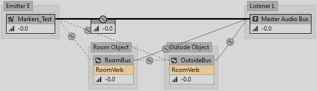
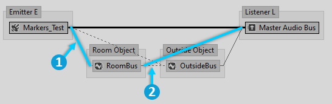
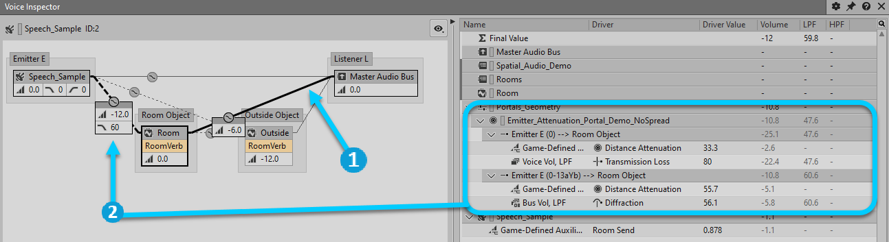

# Room 和 Portal 信号模型中的传播路径

|  |
| --- |
| Wwise SDK 2025.1.4 - Windows |

Room 和 Portal 信号模型中的传播路径

以下章节阐述了 Spatial Audio 如何影响 Voice Graph 中的信号流以及声音传播模型在这当中所起的作用。

# 路径和通路

在运行时，声部和总线与其他总线相连。对此，可参见 Wwise Profiler 的 Voice Graph 或 Voice Inspector 视图。在此，我们将 Wwise 对象之间的连线称为 Connection（通路）。An Emitter-Listener pair is created whenever a voice or bus associated to a game object (an Emitter or a Room) is connected to a different game object (another Room, or the top-level Listener). Emitter-Listener pairs, which we will refer to as paths for the rest of this discussion, are used to compute attenuation curves, amongst other things. 一条通路中可能包含零条、一条或多条路径。比如，在游戏使用 [AK::SoundEngine::SetMultiplePositions](namespace_a_k_1_1_sound_engine_aec6be4dca0249557ea2680b755bd218a.html#aec6be4dca0249557ea2680b755bd218a) 为游戏对象设置多个位置时，就会创建多条路径。Spatial Audio 对路径有广泛的应用。In the following discussion, we will examine the paths within each connection in the simple scenario where an Emitter is located in a Room, adjacent to that of the Listener, as illustrated by the signal graph below.

# Emitter-Listener (Direct) Connection

The connection between the Emitter and Listener carries the dry (unreverberated) signal between the Emitter and the Listener. Spatial Audio creates a first path between the position of the Emitter and the position of the Listener to represent the sound wave that travels directly from the Emitter to the Listener. Its length is thus the distance between the two, and the Emitter's attenuation curves are evaluated based on that distance. Also, unless the Emitter and Listener have a direct line of sight, an additional Transmission Loss factor is added to this path: it is the maximum Transmission Loss found on the geometry in a straight line between the Emitter and Listener (or the maximum of both Rooms' Transmission Loss if there is no geometry). We call this path the direct path, or the transmission path, depending on whether it has a zero or non-zero Transmission Loss.

It's often possible for another sound wave to reach the Listener by means of diffraction, either through a Portal, or around the edges of geometry. This is a diffraction path. It bends around an edge, and its total length is thus longer than that of the transmission path. It does not have Transmission Loss, but instead it has diffraction, proportional to the angles by which it bends.

The following image of the Voice Inspector shows two paths on the Direct Connection: one for transmission and one for diffraction through a Portal.

下表对 Direct Connection 当中的路径进行了说明。

| Path Type (Number) | Characteristics |
| --- | --- |
| Transmission/Line-of-sight (1) | - **Distance**: Straight line from Emitter to Listener - **Transmission Loss**: Maximum of loss of occluding geometry, or of Room's Transmission Loss - **Spread**: Emitter's (from the sound's Attenuation, or from the game object radius - see [游戏对象的 Spread 值](spatial_audio_roomsportals_apioverview.html#spatial_audio_roomsportals_spreadgameobjectspread)) |
| Diffraction (N) | - **Distance**: Diffraction path's length - **Diffraction**: Sum of Portal Diffraction and diffraction on geometry edges - **Spread**: Emitter's (from the sound's Attenuation, or from the game object radius - see [游戏对象的 Spread 值](spatial_audio_roomsportals_apioverview.html#spatial_audio_roomsportals_spreadgameobjectspread)), further clamped by the Portal's aperture |

|  |  |
| --- | --- |
|  | **备注:** No delay is applied to the diffraction paths, even though the wavefronts taking those paths travel a longer distance and should thus arrive at the Listener later than those taking the transmission path. |

所有这些路径都包含在同一通路之内。我们可以将其视为并行声音传播路径。Indeed, the signal of Markers\_Test that is mixed into Main Audio Bus is panned and attenuated independently for each path. 不过，其最终将由单个滤波器实施滤波。该滤波器的截止频率基于各条路径当中由透射驱动和衍射驱动的滤波器值以及其各自的重要性。

|  |  |
| --- | --- |
|  | **备注:** 严格来说，多条路径并行存在并不违反能量守恒法则。基于这一法则，Spatial Audio 不会试图将路径的音量归一化。不过，它会利用声音引擎的 Multi-Direction 声像摆位算法，来实现类似于音量归一化的结果。 |

# Emitter-Room Connection

|  |  |
| --- | --- |
|  | Emitter-Room Connection |
|  | Room-Listener Connection |

The auxiliary connection of the Emitter towards a Room bus represents the energy injected by the source that reverberates inside the Room and produces a diffuse field. There is a connection to the Room that the Emitter occupies, and additional connections to each of the Rooms adjacent to the Emitter. The adjacent Room connections, and their send levels, represent the proportion of acoustic energy that propagates through those Portals into the adjacent Rooms. The remaining proportion is sent to the Emitter's Room.

The connection to the Emitter's own Room contains paths that are comparable to the Direct Connection. The first path is a straight line to the Listener with distance attenuation, as well as Transmission Loss if there is no line of sight between the Emitter and Listener. There are also diffraction paths, which are longer than direct / transmission paths, and have diffraction instead of transmission.

The additional connections to adjacent Rooms work the same way, except that the Portal that connects the Emitter's Room to the adjacent Room can introduce diffraction on the direct/transmission path: If an adjacent Room is not part of the shortest path from the Emitter's Room back to the listener, then diffuse energy exits the Room and "loops back" on trajectories perpendicular to the Portals' opening. Diffraction angles are computed from Portals' normal vectors if they have to bend to reach the Listener. (See [Wet Path Diffraction](spatial_audio_roomsportals_apioverview.html#spatial_audio_roomsportals_modelingsoundpropagationfromotherrooms_wet_diffraction))

# Room-Listener Connection

The connection between a Room's bus and the Listener represents the Room's diffuse energy, simulated by the reverb Effect, propagating to the Listener. Unlike the previously discussed connections, filtering is applied "upstream", per sound, on the Emitter-Room connection, therefore although this connection does embed paths, they are only used for spatialization and Spread.

|  |  |
| --- | --- |
|  | **备注:** Auxiliary busses used in Spatial Audio to represent Rooms normalize their outputs across the number of outgoing connections from each bus. A Room bus with two outgoing connections, for example, often reports -6 dB in the Voice Graph when you select either of those outgoing connections. This normalization is not otherwise reported in the Contribution List. |

|  |  |
| --- | --- |
|  | **备注:** The model does not take into account further obstruction due to geometry outside the Room. 这种几何构造产生的影响被认为可以忽略不计。 |

# 湿声信号基于距离的衰减

The length of the paths introduced in the previous sections, which represent the propagation of a Room's diffuse energy to the Listener, cannot be defined exactly. 模型会依据从 Room 内的声源到墙壁的距离来对声音的衰减作出假设。至于之后从墙壁到墙壁的距离，则完全由混响效果器本身决定。Thus, a reasonable approximation of a path's origin would be the middle of the Room. However, a more satisfying result is obtained if the distance attenuation of the Room's diffuse energy depends on whether the source that excited it is located closer or farther from the Listener, especially if the Room is large.

相较于现实中的物理机制，在 Wwise 中会使用自定义曲线来模拟声音随距离的衰减。In order to accurately compute the distance attenuation of the Room to the Listener, the Room should use the sound Emitter's attenuation curves. This poses a problem, because there can be multiple Emitters in a Room, each with its own position, and each with its own attenuation curve. Once all sounds within a Room have been downmixed and passed through a reverb Effect, it is impossible to selectively scale their volume based on their respective distance attenuation.

A brute-force solution to this problem would be to have a distinct bus and reverb effect for each sound within this Room. Since this would be prohibitively costly, Spatial Audio implements the following instead: The distance evaluation and attenuation, for the entirety of the distance between the Emitter and Listener, is applied on the connection between the Emitter and its immediate Room bus. 也就是，在下混和混响之前应用衰减。从数学上来说，相当于为每个声源配置一条总线和一个混响效果器，只要总线上的效果器是线性的就行。事实上，混响效果器一般都是如此。

A similar principle applies to transmission and diffraction. In order for all parameters of a sound through Rooms to be customizable per-sound, those parameters are applied at the first connection between the Emitter and a Room. Every subsequent connection from Room to Room, or from a Room to the Listener are not filtered using these parameters. Assigning attenuation curves to a Room bus has no effect because they cannot be selectively applied to each sound in that Room.

# 再谈 Emitter-Room Connection 和 Room-Listener Connection

Attenuation, as well as Occlusion, Obstruction, Transmission Loss and Diffraction of the wet path is applied on the Emitter-Room connection, using the attenuation specified on the Emitter. Setting an attenuation on a Room bus will have no effect.

下表对 Emitter-Room Connection 当中的路径进行了说明。

| Path Type (Number) | Characteristics |
| --- | --- |
| Transmission/Line-of-sight (1) | - **Distance**: Straight line from Emitter to Listener - **Transmission Loss**: Maximum of loss of occluding geometry, or of Room's Transmission Loss - **Diffraction**: 0 for Emitter's Room. Portal Diffraction for some adjacent Rooms - **Spread**: 0 (irrelevant) |
| Diffraction (N) | - **Distance**: Diffraction path's length - **Diffraction**: Sum of Portal Diffraction and diffraction on geometry edges - **Spread**: 0 (irrelevant) |

下表对 Room-Listener Connection 当中的路径进行了说明。

| Path Type (Number) | Characteristics |
| --- | --- |
| Transmission/Line-of-sight (1) | - **Distance**: 0 (applied to the Emitter-Room connection) - **Transmission Loss**: 0 (applied to the Emitter-Room connection) - **Spread**: Based on the Room's extent (see [设置 Room 几何构造](spatial_audio_roomsportals_apiconfig.html#spatial_audio_roomsportals_apiconfigroomgeometry)) |
| Diffraction (N) | - **Distance**: 0 (applied to the Emitter-Room connection) - **Diffraction**: 0 (applied to the Emitter-Room connection) - **Spread**: Emitter's (from the sound's Attenuation, or from the game object radius (see [游戏对象的 Spread 值](spatial_audio_roomsportals_apioverview.html#spatial_audio_roomsportals_spreadgameobjectspread)), further clamped by the Portal's aperture |

The following image shows both connections in the Voice Inspector. The highlighted section shows the paths in the Emitter-Room connection, where distance attenuation, Transmission Loss, and diffraction are applied. Paths embedded in the Room-Listener connection are not displayed here.

|  |  |
| --- | --- |
|  | Room-Listener Connection |
|  | Emitter-Room Connection |

# Room 之间的耦合

The connection between the Emitter's Room and the Listener's Room represents the diffuse energy of the Emitter's Room transferred into the Listener's Room and contributing to its diffuse energy. This transfer occurs through walls and open Portals.

Like the Room-Listener connection, paths are embedded here only for spatialization. Transmission, diffraction, and distance attenuation have already been applied at the Emitter-Room connection (see the discussion in [湿声信号基于距离的衰减](spatial_audio_roomsportals_paths.html#spatial_audio_roomsportals_paths_wetdistance)).

|  |  |
| --- | --- |
|  | **备注:** If an open Portal exists, its propagation path will likely dominate the transmission path and enable coupling of both Rooms at full volume. The model does not try to modulate the transfer of energy based on the surface ratio of open Portals versus walls. 对此，我们将在未来版本中加以改进。 |

|  |  |
| --- | --- |
|  | **备注:** The model assumes that geometry in the receiving Room does not interfere with the transfer of energy from the emitting Room. |

下表对从 Emitter 所在 Room 到 Listener 所在 Room 的通路当中的路径进行了说明。

|  |  |
| --- | --- |
|  | **技巧:** 您可以使用设计工具中的 Game-Defined Auxiliary Sends Volume 来偏置耦合通路的音量。This volume applies to a given Room bus towards all connected Rooms. |

# 听者所在 Room 和听者之间的通路

This connection represents the diffuse energy of the Listener's Room that envelops the Listener. 通路的输入端已应用距离衰减，所以此处不会再另外应用衰减。同时还将假定没有任何阻碍，因而其 Spread 接近于 100。