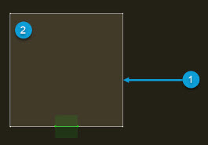
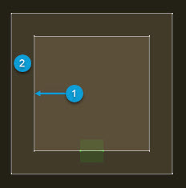
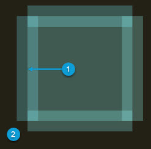
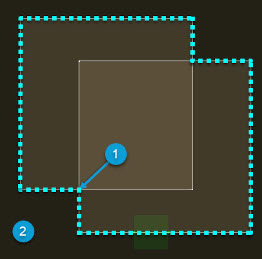
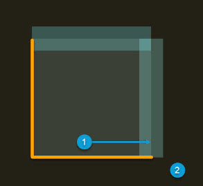
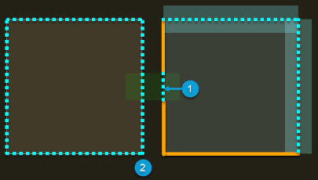
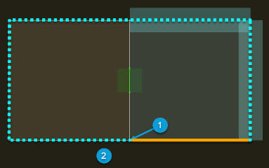
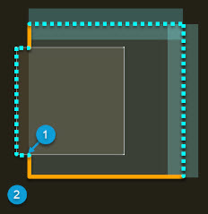
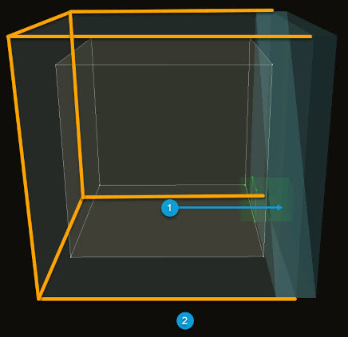
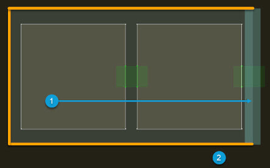

# Geometric Room Distance on Direct Paths

|  |
| --- |
| Wwise SDK 2025.1.4 - Windows |

Geometric Room Distance on Direct Paths

The distance to a room, most often used for Room Tones, and seen as a driver in the Voice Inspector on the direct path (noted as the "(0)" path), is based on the provided room geometry. Reverb Zones and nested rooms necessitate a robust distance measurement that takes into account the intersection of Rooms and Portals features, and accurately reflects any provided geometry. This document describes the direct distance to a room whose shape is described by geometry, on the direct path. The distance driver for diffraction paths is unaffected by this update and continues to be based on the length of the path.

# Understanding Direct Distance Measurement

At a high level, the direct distance to a room's geometry is the shortest distance between the listener and the closest point on any surface of the room.

|  |  |
| --- | --- |
|  | **备注:** Distance can be measured to either the listener or a distance probe. However, this document refers to either as the listener. Although all distance calculations are in 3D, most images in this section are 2D for clarity. Numbered callouts share the same meaning for all images in this section. |

|  |  |
| --- | --- |
|  | Position of the Listener |
|  | Source of the Room Tone |

When a room is nested inside of another room, and the listener is placed inside of the innermost room, then the space defined by the inner room is not considered to be part of the outer room. Therefore, it is not included in calculations of the distance to the outer room.

The space inside of a Reverb Zone is generally measured the same way as any other nested rooms. This means the space of the Reverb Zone is omitted of it's parent, and the distance measured to the parent room increases as the listener travels deeper into the Reverb Zone.

Room Priority determines which rooms are inner rooms and which ones are outer rooms. If Room Priority is not set, or two rooms have the same priority, then when rooms overlap, the one with the smaller volume is considered to be inside of the larger one. We recommend that you set Room Priority for all rooms.

If several rooms overlap, then the closest distance to the outside, or to an outer surrounding room, is measured to the perimeter of the combined shapes.

In the following image, the cyan dotted line represents the surfaces from which distance can be measured:

# Reverb Zones and Distance

If a Reverb Zone is created with only transparent surfaces, then a Reverb Zone behaves the same way as a standard room when it comes to distance. However, the distance into or out of a Reverb Zone is measured from its Transition Regions, which are only the surfaces that have a transmission loss of 0. As a result, any surface of a Reverb Zone that is not used as part of its Transition Region (a surface that is opaque, not completely transparent) blocks direct distance calculations. In this way, Reverb Zones provide extra control over the measurement of direct path distance.

In the following image, the solid orange line represents surfaces from which distance cannot be measured.

The distance-blocking effect does not apply to the area where a Reverb Zone's opaque surface intersects with either a portal or another room. You can use a portal through an opaque surface to bridge two spaces that measure distance differently. The portal opening is a valid place from which to measure distance, just like the transition region.

In the following image, the solid orange line is broken by the bounding box of a portal, where the portal opening represents a space from which distance can be measured:

The same principles apply when a Reverb Zone's opaque surfaces overlap with or touch another room: the part of an opaque surface that intersects with another room can no longer block distance measurements to the outside of the combined shape. This behavior occurs because, as mentioned earlier, the distance to outside is measured from the perimeter of the whole shape, and some parts of the Reverb Zone that block distance are no longer part of the perimeter of the shape. The surfaces of a normal (non-Reverb Zone) room do not have this blocking property, so any standard room surface that forms part of the perimeter of a group of overlapping rooms is always a valid place from which to measure distance.

In the following image, a standard room on the left shares a surface with a Reverb Zone on the right. The shared wall would normally be an opaque surface that blocks distance measurements, but in this case it is not part of the perimeter of the whole structure:

The following image shows how overlapping rooms affect the perimeter:

# Portals

Portal volume is not included in the shape of the geometry used to measure distance. If the geometry of two rooms are not touching or overlapping, then there is a gap between the rooms and they do not form a continuous perimeter. When there is a gap between rooms, even a small gap, then the physical volume of the outside or surrounding room fills the gap. Therefore, the distance to the outside can be measured to that gap.

Therefore, if a portal bridges two rooms that are not physically touching, leaving a gap between the opening surfaces of the portal, then the space between the two rooms does not belong to either room in the distance calculation. That space is considered outside or a part of any surrounding room, and the distance to outside will approach zero as the listener approaches the portal.

# Encapsulating Rooms Inside an Outer Room

In some cases, it might be desirable to surround a room, or a group of rooms, with an outer room, to control how distance is calculated to the outside of that arrangement.

For example, you could position a single large room on the ground and post a room tone to the outside. When a listener enters the large room, the outside sound is attenuated according to the shortest distance out of the room. However, the closest point to the outside is the floor, as demonstrated in the following image.

You might also create two rooms (possibly representing the interior of a single building) separated by a small amount of space (representing the thickness of the wall between the rooms), using a portal to bridge that gap, with a room tone posted to outside. The distance to the outside sound approaches 0 as the listener approaches the entrance to the portal, but this is not intuitive because the room tone comes from a space that is outside of the building that forms this two-room structure.

Both of these problems can be mitigated by surrounding the desired structure with an outer room. A portal can bypass this outer room to connect an inner room to the outside. The distance to the outside of any arrangement of rooms follows the rules of the surrounding outer room. This outer room can be a Reverb Zone, and that Reverb Zone's Transition Region and opaque surfaces can be used to control how the distance to outside is measured for the whole structure.

In the following image, the outer Reverb Zone causes the distance to outside to be measured to the Reverb Zone Transition Region, instead of being measured to the floor:

In the following image, the distance is also measured to the Transition Region, instead of being measured to the closest wall, or through the portal to the gap between rooms:

# Subtraction from Parent Rooms

By default, each room is a distinct space and is subtracted from the shape of its parents and overlapping rooms of lower priority. To change this behavior, set `AkRoomParams::DistanceBehavior` to `AkRoomDistanceBehavior_Exclude`, which excludes the room from measurements of distance to other rooms. When inside the room, distance attenuation does not apply to its parents or overlapping sections of lower-priority rooms, because it does not form a distinct space and is not subtracted from the shape of other rooms.