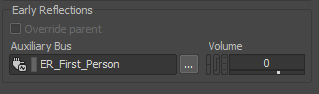
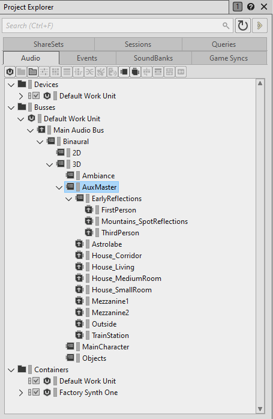
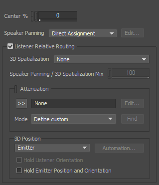
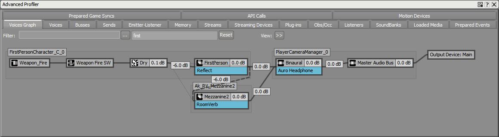
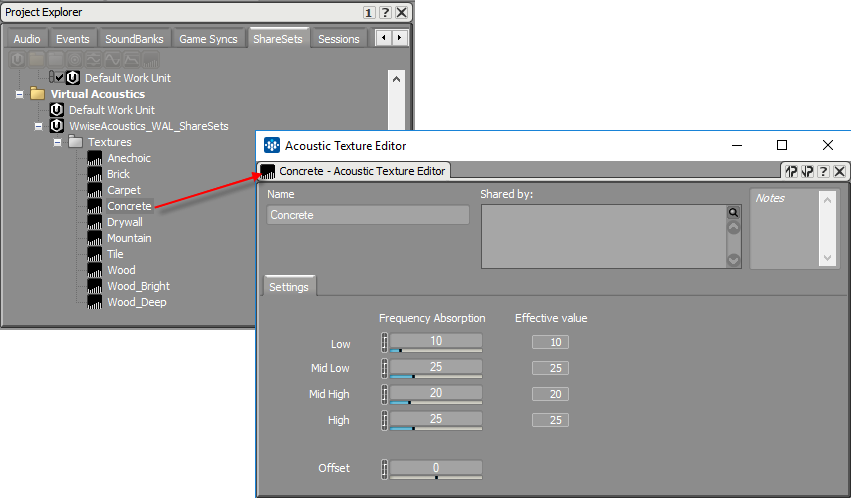

# 使用 Geometry API 模拟早期反射

|  |
| --- |
| Wwise SDK 2025.1.4 - Windows |

使用 Geometry API 模拟早期反射

# 简介

为了计算镜像声源以模拟动态早期反射，Geometry API 会结合 [Reflect](https://www.audiokinetic.com/library/edge/?source=Help&id=wwise_reflect_plug_in_effect) 插件使用发声体和听者位置以及构成游戏中简化几何构造的三角形。声音设计师可以直接在 Reflect 中根据距离和材质调节相应属性，从而控制镜像声源位置的转换。

Refer to the Reflect Diffraction demo and its code in the [Integration Demo 示例](soundengine_integration_samplecode.html) (in *SDK/samples/IntegrationDemo*) for an example of using the geometry API to simulate Early Reflections in conjuction with with the Reflect plug-in. Look for Spatial Audio Demos > Reflect Demo.

如需简要了解几何构造驱动的早期反射（简称 ER），请参阅[动态早期反射的声源成像法](https://blog.audiokinetic.com/image-source-approach-to-dynamic-early-reflections/)和[为虚拟现实创造引人入胜的混响](https://blog.audiokinetic.com/creating-compelling-reverberations-for-virtual-reality/)这两篇博文。

|  |  |
| --- | --- |
|  | **备注:** 反射阶数是指波阵面在到达听者所在位置前遇到的反射表面数量。比方说，在一个包含六个表面的鞋盒形 Room 中，在模拟一阶反射时每个发声体会产生 6 x 1 次早期反射（也叫镜像声源）。结果就是共有 6 次反射。同样地，在模拟二阶反射时每个发声体会产生 6 次一阶反射和 6 x 5 次二阶反射。结果就是共有 36 次反射。反射次数随阶数呈指数级增长。  Wwise Spatial Audio 目前支持最多模拟四阶反射。反射阶数通过 [AkSpatialAudioInitSettings::uMaxReflectionOrder](struct_ak_spatial_audio_init_settings_a346377be1b9f6905fb2d8d3e1540eb39.html#a346377be1b9f6905fb2d8d3e1540eb39 "Maximum reflection order [1, 4] - the number of 'bounces' in a reflection path. A high reflection ord...") 初始化设置进行全局设定。另外，还可使用 [AK::SpatialAudio::SetReflectionsOrder](namespace_a_k_1_1_spatial_audio_adbda0987d76ef56f38389a21479cf1ad.html#adbda0987d76ef56f38389a21479cf1ad) 实施动态修改。 |

# Wwise 工程设置

对于每个要支持动态早期反射的声音，请确保在 Wwise 设计工具中的 General Settings 选项卡下指派早期反射总线，以指明搭载所需 [Reflect](https://www.audiokinetic.com/library/edge/?source=Help&id=wwise_reflect_plug_in_effect) 插件的 Auxiliary Bus（辅助总线）。Spatial Audio 会专门建立一条到该总线的辅助发送连接。除此之外，您还可以设置发送音量。

对于环境混响，一般会针对“听者”游戏对象创建 Auxiliary Bus，以便多个发声体共用同一总线和效果器实例。在 Spatial Audio 将 Room 用于后期混响时也是一样，但是对早期反射来说并非如此，因为每个发声体都会基于自身位置产生一系列反射。在这种情况下，要针对“发声体”游戏对象创建早期反射 (ER) 总线实例，并将各个发声体发送到不同的 Auxiliary Bus 实例。具体可参见下述 [发送至后期混响的早期反射](spatial_audio_apigeometry_er.html#spatial_audio_wwiseprojectsetup_ertolr) 章节的 Voices Graph 截图。

您需要理解总线结构设计的以下这些方面，才能更有效地在您的 Wwise 工程中管理动态环境效果器。

## 衰减设计

为了确保高效的计算性能，在针对 Spatial Audio 所用的声音设计衰减曲线时要特别注意一点。对于指派有早期反射 Auxiliary Bus 和设计工具中标有 **Enable Diffraction and Transmission** 的声音，必须为衰减曲线指派一个有限半径来限定路径的计算。

Spatial Audio 会通过声音的衰减确定可能的最大传播距离以执行反射和衍射路径计算，所以必须确保最大衰减距离是一个有效值。另外，倘若衰减曲线没有低于平台的指定音量阈值，那么声音的半径其实相当于是无限的。在这种情况下，Spatial Audio 在计算反射和衍射时会尝试忽略听者在环境中的位置。为了确保把 Spatial Audio 计算限定在“发声体”游戏对象周围有限半径内，由距离驱动的音量曲线和 Auxiliary Send Volume 曲线都要将最右侧的终点设到音量阈值以下。注意，音量阈值可在 Project Settings（工程设置）对话框中定义。为此，请转到设计工具的 Project（工程）菜单。

|  |  |
| --- | --- |
|  | **备注:** 若游戏对象同时播放多个声音，而每个声音都指派有不同的衰减曲线，则将使用其中最大的衰减半径来限定路径处理。每个游戏对象只会执行一次路径处理，之后必要时会为多个声音重复使用路径。 |

若希望早期反射具有与发声体相似的衰减设计，可将 Reflect 效果器曲线设为 **Use Attenuation**。我们称之为 Reflect 的简化模式。确保将 Early Reflections Auxiliary Bus 输入总线配置设为 **Audio Objects**，以便声音引擎能够检索对应的衰减曲线。

## 辅助总线设计

一般来说，不同的辅助总线是用来表示不同环境的，而这些总线可能承载着不同的 ShareSets，这些 ShareSets 模拟着环境的混响特征。当使用动态早期反射时，比如由 [Reflect](https://www.audiokinetic.com/library/edge/?source=Help&id=wwise_reflect_plug_in_effect) 在 Spatial Audio 下处理的那些，后期混响可能还会使用辅助总线上的混响来设计。但是，您可能会想要禁用这些混响的ER部分（如果有 ER 部分的话），因为这部分是应由 Reflect 处理的。

另一方面， Reflect 应该和用于后期混响的辅助总线平行运作。下图展示了典型的总线结构，其中 *EarlyReflections* 总线下的三条辅助总线每条都包含一个 Reflect 的 ShareSet。您会注意到，在这个设计中，我们只用到了少量 ShareSets 来生成早期反射。这是由于在运行时，这个效果的“空间属性”是由游戏的几何空间来驱动的。我们只在这里使用不同的 ShareSets ，因为我们希望玩家（听者）发出的声音与其他对象发出的声音有不同的衰减曲线。通过使用 Reflect 的简化模式，还可减少所需的 Reflect ShareSet 数量。有关详细信息，请参阅[预期的 Reflect 工作流程](https://www.audiokinetic.com/library/edge/?source=Help&id=wwise_reflect_plug_in_effect#reflect_intended)。

## 总线实例

有多少游戏对象当前在播放指派有 ER 总线的声音，ER 总线（搭载 [Reflect](https://www.audiokinetic.com/library/edge/?source=Help&id=wwise_reflect_plug_in_effect)）就会存在多少个实例。这一点很重要，因为镜像声源的定位取决于发声体的位置。为了正确设置 ER 总线的输出方式，您需要启用下图所示的 Listener Relative Routing 复选框。这样便可将多个 ER 总线实例生成的信号恰当地混音到下一条混音总线的单一实例中。这个单一实例对应监听这个发声体的游戏对象（通过 `AK::SoundEngine::SetListeners` 设置），这个对象一般是对应玩家（或镜头）的最终听者。

若为同一游戏对象播放的各个声音指派了不同的早期反射辅助总线，则将针对同一“发声体”游戏对象创建多个总线实例。Spatial Audio 仍然只针对每个游戏对象执行一次反射计算，不过会将结果发送到两个不同的 [Reflect](https://www.audiokinetic.com/library/edge/?source=Help&id=wwise_reflect_plug_in_effect) 插件实例。这样用户通过在插件中设置不同的共享集，就可以为每个声音自定义反射曲线。

|  |  |
| --- | --- |
|  | **警告:** 虽然 ER 总线必须启用 Listener Relative Routing（听者相对通路）才能确保将所有发声体实例并入听者对应总线，但是为了避免 Wwise 进行“双重 3D 空间化”，必须将 3D Spatialization（3D 空间化）模式设为 None（无）。同样地，除非希望在 Reflect 中为镜像声源曲线应用额外衰减，否则不要使用衰减设置。 |

## 发送至后期混响的早期反射

另外，由于游戏对象（发声体）会向 Auxiliary Bus 发送早期反射以便处理后期混响，所以也会在 ER 总线和后期混响总线之间建立一条连接。这一般来说是可取的，因为生成的 ER 之后会用于后期混响的着色和“加浓”要做到这一点，需确保在 ER 总线编辑器的 General Settings 选项卡中启用 **Use game-defined auxiliary sends** 复选框。之后，可使用下方的 Volume 滑杆来在要发送到后期混响的早期反射和直达声的数量之间取得平衡。

下图是之前所讲到内容的实时演示。注意以下事项：

- Weapon Fire SW 因为早期反射发送而被输出到了 FirstPerson 早期反射总线。
- FirstPerson 总线在 FirstPersonCharacter 游戏对象的作用范围之内。若是换作其他游戏对象，则会根据需要发送到不同的 FirstPerson 总线实例。
- 因为启用了 **Use game-defined auxiliary sends**，所以有个从 FirstPerson 总线到 Mezzanine2 辅助总线的发送连接。
- 因为针对 FirstPerson 总线启用了 **Listener Relative Routing** 选项，所以 FirstPerson 的输出总线 Binaural 在听者（即 PlayerCameraManager）的作用范围之内。所有早期反射总线实例都要启用此选项，这样才能全部返回到一个听者 Binaural 总线实例。假如不这样做，将会针对“发声体”游戏对象错误地生成单独的 Binaural 总线实例。
- 因为已经在 [Reflect](https://www.audiokinetic.com/library/edge/?source=Help&id=wwise_reflect_plug_in_effect) 内设置并应用了 ER 衰减，所以由于距离原因 FirstPerson 和 Binaural 总线之间并无衰减。

## 使用 Acoustic Texture

对于每个反射三角形，游戏都会传递材质 ID。这些材质能以 Acoustic Textures（声学纹理）的形式在 Wwise 工程中编辑，位于 Virtual Acoustics ShareSets 中。在这里您可以定义每种材质的吸声特性。

