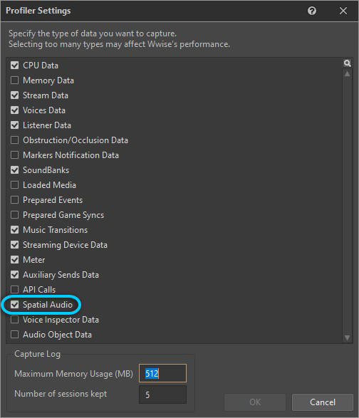
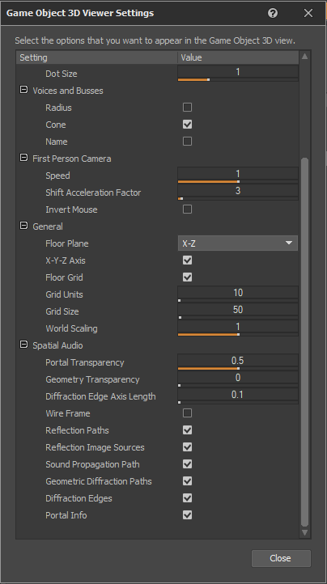
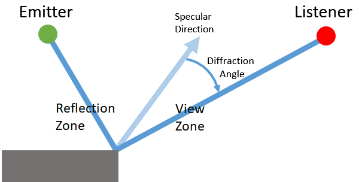
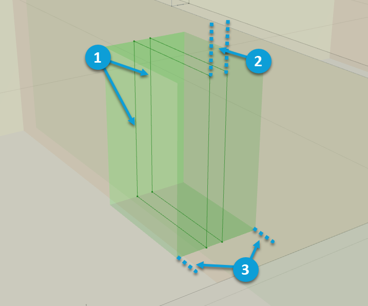

# 使用 Geometry API 模拟衍射和透射

|  |
| --- |
| Wwise SDK 2025.1.4 - Windows |

使用 Geometry API 模拟衍射和透射

# 简介

我们可以使用传给 Wwise Spatial Audio 的几何构造来模拟声音的衍射和透射。如此一来，便可完全替代游戏引擎在声障计算中使用的射线投射法。

在发声体和听者之间有物体阻挡时，Spatial Audio 会沿着物体边缘（如有）计算路径，并计算这些边缘周围声波弯曲产生的衍射系数。同时，相应地修改发声体的视入射角，并将衍射值发送给 Wwise，以便控制对声音的最终影响。通常，衍射会造成低通滤波。

此外，Spatial Audio 还会计算声音穿透几何构造的路径。在传播过程中穿透障碍物的声音需要应用透射损失系数。该系数取决于通过 API 指派给几何构造的表面属性。通常情况下，会使用低通滤波器和音量衰减来对透射损失进行建模。

下图为 Wwise 中 3D Game Object Viewer 的截图。它显示了声音在薄壁边缘周围的衍射路径以及透射损失为 100% 的透射路径。

|  |  |
| --- | --- |
|  | **警告:** 虽然我们可以使用几何衍射和透射来完全替代游戏引擎在声障计算中使用的射线投射法，但要注意，随着几何构造越来越复杂，占用资源也会逐渐增加。因此，传给 Spatial Audio 的几何构造应尽量简单。另外，为了降低 Geometric Diffraction 的计算复杂度，最好结合运用 Room 和 Portal 抽象概念，这样会更加高效（参见“ [使用房间和门户](using_rooms_and_portals.html) ”部分）。 |

几何衍射可用来影响发声体和听者之间的直达声音传播路径。在结合使用 Reflect 时，还可用来影响早期反射路径。

# 针对衍射设置几何构造

对于传给 Spatial Audio 的每项几何构造集，都要明确声明是否要将其用于计算衍射路径。为此，可使用 `AkGeometryParams::EnableDiffraction` 标记。此标记方便生成衍射计算所需的边缘数据，其在直达路径的几何衍射和反射路径的衍射中均有应用。

另外，还要考虑是否允许网格的边界边缘衍射声音。对于给定网格，边界边缘被定义为多重三角网格边界上仅与一个三角形相连的边缘。边缘数量越多，衍射计算的复杂度越大。因此，在网格包含不会衍射声音的边界边缘时，应禁用相应选项。

最后还要注意，指派给声学表面的声学材质不会对衍射产生任何影响，因为边缘材料并不吸收能量。边缘只会造成声波弯曲。

# 针对透射设置几何构造

在针对声音透射设置几何构造时不用执行额外的步骤，不过可能要针对各种几何构造类型调节透射损失系数。比如，混凝土结构可能会阻挡几乎所有的声音透射，而胶合板材质的几何构造则可能只会阻挡很少一部分声音。

`AkGeometryParams::Triangles` 数组中的每个 `AkTriangle` 都包含对 `AkGeometryParams::Surfaces` 数组的索引 `AkTriangle::surface` 。`AkAcousticSurface::transmissionLoss` 字段用于描述要将多少透射损失应用于穿透对应三角形的声音。该字段的取值范围为 0 ~ 1。透射损失会换算为百分比并用来评估 Wwise 曲线。对于具有给定透射损失的声音，最终应用的音量衰减和滤波器值取决于工程中定义的曲线。By default, the project transmission curve is used. 自定义透射曲线可在添加到声音的 Attenuation ShareSet 中创建。另外，您还可以将透射损失作为内置参数来加以应用，并将其映射至 RTPC。

## Transmission through Solid and Non-Solid Geometry

By default, each geometry instance is treated as a collection of infinitely thin surfaces for the purpose of transmission. This means that when a transmission path passes through a geometry instance, it applies transmission loss at each triangle that the path intersects. A geometry instance can be marked as solid by using `AkGeometryInstanceParams::IsSolid`. A solid geometry instance applies transmission loss every time a transmission path passes entirely through the geometry, recognized by two triangle intersections. The transmission loss applied is the max of the triangles intersected when entering and exiting the geometry. `AkGeometryInstanceParams::IsSolid` has no effect when `AkSpatialAudioInitSettings::eTransmissionOperation` is set to `AkTransmissionOperation_Max`.

|  |  |
| --- | --- |
|  | **备注:** A transmission path can pass through a solid geometry instance more than once. When this happens, transmission loss is applied each time a path enters and exits the shape through two triangle intersections. |

# 直达路径的几何衍射

Refer to the Geometric Diffraction demo and its code in the [Integration Demo 示例](soundengine_integration_samplecode.html) (in *SDK/samples/IntegrationDemo*) for an example of using geometry for the purpose of geometric diffraction of the direct path. Look for Spatial Audio Demos > Geometry Demo.

## 针对衍射和透射设置声音

在 Wwise 设计工具的 Positioning 选项卡中，确保选中 **Enable Diffraction and Transmission**。此复选框用来启用与衍射和透射相关的 Spatial Audio 功能，包括：

- 在适用情况下通过几何构造或 Portal 来计算声音的衍射路径。只要游戏对象当前播放的声音启用了衍射和透射，Spatial Audio 就会针对其执行路径计算。若同一游戏对象在播放多个启用了衍射的声音，则仅执行一次路径计算。
- 计算声音穿透几何构造或在两个 Room 之间的透射路径。最终透射损失系数总是取透射路径当中出现的最大透射损失值，无论其来自 Room 的 `AkRoomParams::transmissionLoss` 还是与三角形关联的 `AkAcousticSurface::TransmissionLoss` 。
- 在设定了 Spatial Audio 的初始化设置 `AkSpatialAudioInitSettings::bCalcEmitterVirtualPosition` 的情况下，针对衍射路径生成虚拟位置并将其发送到声音引擎来渲染声音。
- 根据衍射系数和透射损失系数应用曲线。

By default, the project diffraction curves are used for diffraction and the project transmission curves are used for transmission.

可通过向声音添加 Attenuation ShareSet 来创建自定义衍射和透射曲线。使用 Attenuation Editor 创建自定义 Volume、LPF 和 HPF 曲线并在监控过程中进行微调。有关详细信息，请参阅 Wwise Help 的[应用衰减](https://www.audiokinetic.com/library/edge/?source=Help&id=applying_distance_based_attenuation)章节。

## Wwise 中的直达路径衍射和透射

通过适当设置性能分析设置和视图选项，可以在 3D Game Object Viewer 中查看衍射和透射设置（见下图）。

在此，将针对各条衍射边缘显示计算得出的发声体与听者之间路径的衍射系数。您可以通过将所绑定的 Game Parameter 添加到 Game Sync Monitor 来分析内置游戏参数值，并在 Profiler 的 Obs/Occ 选项卡中分析 Obstruction 和 Diffraction。

在 Game Object 3D Viewer 中，会在对应透射路径的旁边显示计算得出的透射损失系数。若透射损失源自于几何构造，则指示碰撞点及相应的透射损失百分比。若透射损失源自于 Room，则显示透射损失百分比并在下方附加 (Room) 文本。

跟 Portal 一样，在发声体位于听者视线之内时，Diffraction 值为 0。在穿过阴影区的过程中，该值不断增大（参见“[衍射](spatial_audio_concepts.html#spatial_audio_concepts_diffraction) ”部分）。有关阴影区衍射的更多详细信息以及如何使用曲线和 Built-in Diffraction Game Parameter 的论述，请参阅“Room 和 Portal”的 [衍射](spatial_audio_roomsportals_apioverview.html#spatial_audio_roomsportals_modelingsoundpropagationfromotherrooms_diffraction) 部分。

## 直达路径衍射与 Spatial Audio Room 和 Portal 的相互影响

在使用 Spatial Audio Room 和 Portal（参见“ [使用房间和门户](using_rooms_and_portals.html) ”部分）时，Portal 也会对相邻房间内直达声音的衍射建模。这两个系统互为补充，对于与听者不在同一房间的发声体，确保不会搜索几何构造驱动的衍射路径。Room 和 Portal 比几何构造的计算效率高很多。为了降低计算复杂度，最好结合使用两个系统。

# 早期反射的几何衍射

Refer to the Reflect Diffraction demo and its code in the [Integration Demo 示例](soundengine_integration_samplecode.html) (in *SDK/samples/IntegrationDemo*) for an example of using geometry for the purpose of geometric diffraction of Early Reflections. Look for Spatial Audio Demos > Reflect Demo.

如上文所述，早期反射可能会在边缘附近发生衍射。在发声体连通 Reflect 的情况下，Spatial Audio 支持对这一现象建模。

在解释如何建模之前，我们需要先定义可视区衍射。

在下图中，发声体位于听者视线之内，但听者并不在镜面反射路径上。因此，它在**可视区**。如“[衍射](spatial_audio_concepts.html#spatial_audio_concepts_diffraction) ”中所述，可视区也会出现衍射。不过，在 Wwise Spatial Audio 中，无论是 Room 和 Portal 还是直达路径模型的 Geometric Diffraction，都不考虑可视区的衍射，因为其相较于实际直达路径可以忽略不计。然而，对于反射来说，可视区衍射会产生很大影响。若没有衍射，则只有反射区能听到早期反射（纯镜面反射）。一旦听者进入可视区，反射就会不起作用。在启用衍射后，边缘会衍射反射波。这样在进入和离开反射区时虽然有滤波和衰减，但听者仍可感知到反射。

In the reflection zone, there is no diffracted path and, therefore, no diffraction value is calculated, because the specular reflection is assumed to take over. 在反射区和可视区之间的边界处，给定边缘的可视区衍射计算值为 0；在可视区和阴影区之间的边界处，该值为 100。

对于高阶早期反射，同时存在可视区和阴影区衍射。

## 针对适用的声音启用反射

在 Wwise 设计工具中，针对所有需要反射的声音将所需的早期反射发送设置为带有 Reflect 的辅助总线。有关更多详细信息，请参阅 [Wwise 工程设置](spatial_audio_apigeometry_er.html#spatial_audio_wwiseprojectsetup) 。在此，既不需要针对衍射反射专门设置并启用衍射，也不需要为几何构造启用衍射。

## Reflect 中的设置

在 Reflect 中，受衍射影响的反射将呈现为镜像声源。您可以根据衍射状况使用以下三条曲线来设计衍射对反射的影响：Diffraction Attenuation（衍射衰减）、Diffraction LPF（衍射 LPF）和 Diffraction HPF（衍射 HPF）。有关更多详细信息，请参阅 [Reflect 文档](https://www.audiokinetic.com/library/edge/?source=Help&id=wwise_reflect_plug_in_effect)。

# 结合 Room 和 Portal 使用几何构造 API

我们可以结合 Wwise Spatial Audio 中的 Room 和 Portal 使用几何构造 API 来构建反射和衍射模型。为此，可将 Room 和 Portal 网络视为对周围几何构造的上层抽象（或者说细节程度较低）。适当地结合 Room 和 Portal 使用上层几何构造，可以让声学环境的模拟具有一定细节并且高效。

## Distance to Rooms on the Transmission Path

When geometry is used to represent the shape of a room, the distance to the room for the direct or transmission path is measured from the shape of the geometry and interacts with other Rooms and Portals features. See [Geometric Room Distance on Direct Paths](spatial_audio_roomsportals_distance.html) for more information.

## 通过 Portal 模拟几何衍射

若发声体正在播放声音且正确设置了几何衍射（参见 [针对衍射和透射设置声音](spatial_audio_apigeometry_diffract.html#spatial_audio_apigeometry_diffract_direct_api) 部分），但其与听者不在同一 Room，则按照以下方式计算几何路径：

- 使用 Room 和 Portal 网络来计算从发声体到听者的声音传播路径。
- 对于每一条路径，使用几何衍射算法来计算发声体和最靠近发声体的 Portal 之间的路径段（将该 Portal 视为听者）。除非从听者的角度来看发声体位于某个 Portal 正后方，否则只计算一条几何路径（检测到的最短路径）。计算发声体和 Portal 之间的其他路径只会造成虚声源位置重复，因此是不必要的。
- 在两个 Portal 之间不存在直接视线时，同样使用几何衍射来计算两者之间的路径段。每次在场景中添加/移除几何构造或 Portal 时都会执行这些计算，并会在需要时重复使用。一般情况下，只会使用两个 Portal 之间的最短路径。不过，若听者位于其中一个 Portal 正后方，则会使用多条路径，以此避免在听者从某一 Room 慢慢进入另一 Room 时通过 Portal 听到的声音出现间断。
- 对于每一条路径，使用几何衍射算法来计算听者和最靠近听者的 Portal 之间的路径段（将该 Portal 视为发声体）。
- 将以上路径合并成结果路径，并在必要时细分或附加路径。

## 通过 Portal 模拟反射

Reflections can pass through portals and can reflect off of walls on either or both sides of the portal. Reflections can pass through more than one portal, possibly reflecting on surfaces between them if the reflection order is high enough (refer to `AkSpatialAudioInitSettings::uMaxReflectionOrder`). To ensure smooth reflections through portals, we recommend that you set [AkSpatialAudioInitSettings::uDiffractionOnReflectionsOrder](struct_ak_spatial_audio_init_settings_a245b315e0cca157bdbef7cde581e8561.html#a245b315e0cca157bdbef7cde581e8561) to at least 2, but be aware that increasing this setting also increases CPU usage.

Because the portal itself describes an acoustic opening, it is not necessary to also "cut holes" in the triangle geometry to allow a sound to pass through, which would greatly increase the number of triangles. A portal box represents negative space, so remember that any geometry that intersects a portal is effectively ignored, for example in a room where the geometry is described by a box, with two triangles for each of the six sides. To ensure that sound can propagate outside the box, add a portal that intersects one of the walls along the portal's z-axis.

When using the Simplified Reflect workflow, reflection paths that cross through a portal carry the occlusion value associated with that portal, set using `AK::SpatialAudio::SetPortalObstructionAndOcclusion`. If a reflection path crosses multiple portals, it carries the highest portal occlusion value encountered along the path. For more information about the Simplified Reflect workflow, see [Intended Reflect Workflow](https://www.audiokinetic.com/library/edge/?source=Help&id=wwise_reflect_plug_in_effect#reflect_intended).

|  |  |
| --- | --- |
|  | **备注:** Unlike diffraction, reflection paths through portals are not calculated independently for each room and then later combined. Instead, reflections are calculated exactly as if the emitter and listener were in the same room, and the portal is treated as a hole in the geometry. |

## 有关如何使用几何构造设定 Room 之间 Portal 朝向的技巧

下图举例展示了 Portal 朝向的正确设定。

|  |  |
| --- | --- |
|  | - Geometry cut-outs allow reflection and diffraction paths to pass through the portal. - A rectangular opening is subtracted from any geometry overlapped by the portal. - Geometry cut-outs are drawn in the Game Object 3D Viewer with a dark green outline. - For correct cut-out detection, the planes intersected by the portal must be non-intersecting (but not necessarily parallel), and they both must span the entire width (X) and height (Y) of the portal. |
|  | - 两个平面之间以及由 Portal 连通的两个 Room 之间允许存在间隙。不过，只有在游戏对象之前处于其中一个相邻 Room 的情况下才允许其进入 Portal。 - 在游戏对象慢慢穿过 Portal 时，仅将传给 [AK::SpatialAudio::SetGameObjectInRoom](namespace_a_k_1_1_spatial_audio_a3f080206f12c04b3464838cb18c43f4e.html#a3f080206f12c04b3464838cb18c43f4e) 的 Room 几何包含关系检测结果用作提示信息。The exact room is determined by projecting the game object's position onto the portal's Z-axis, and then testing if the game object is in the front-half or back-half of the portal, corresponding to the front and back rooms respectively. - The portal does not need to be perfectly aligned and centered between the two rooms. - The transition point between two rooms is the center of the cut-out. When there is a gap between the two opening planes, values interpolating over the transition (such as Room Transmission Loss) are held at the midpoint while a game object is inside of the gap. |
|  | - 确保 Portal 在 Z 轴上足够深入，以便在两个 Room 之间平滑过渡。 - 若两个 Room 之间的过渡太过突然，一般沿 Z 轴将 Portal 延长便可解决。 |