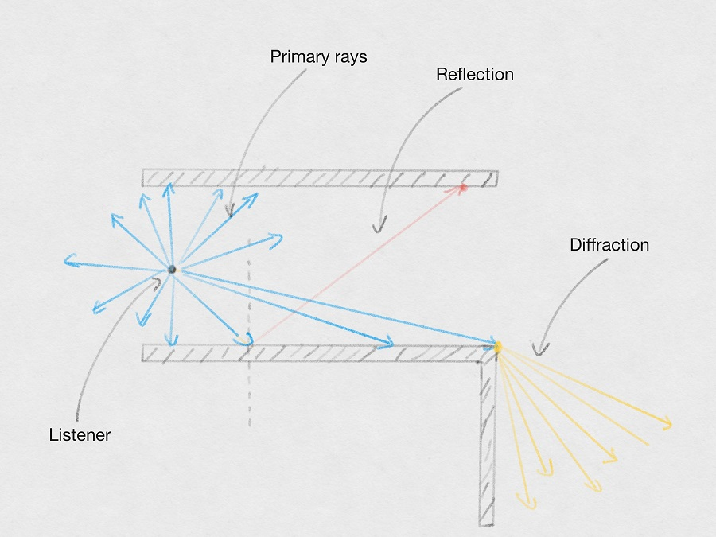
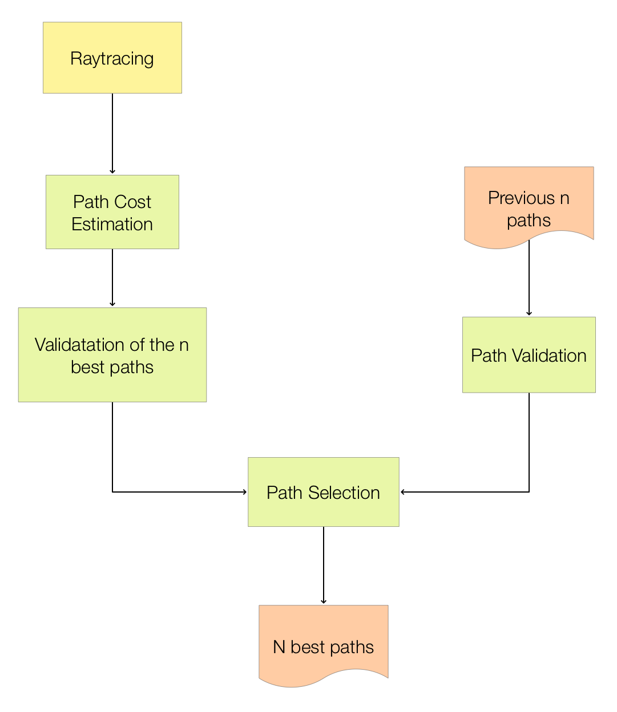
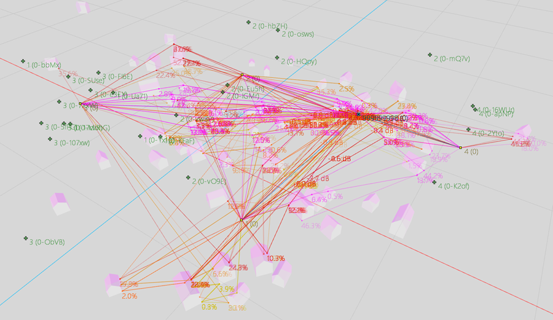
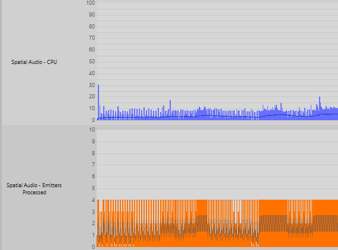
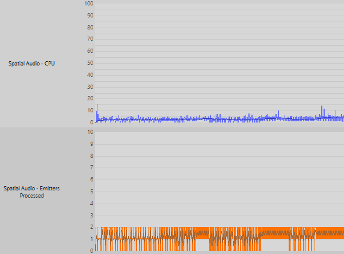
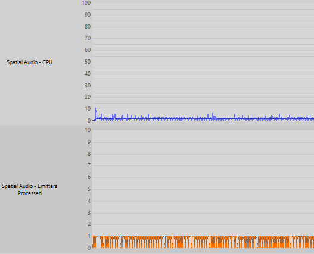
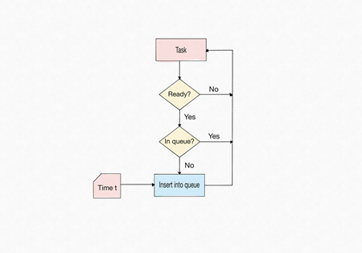
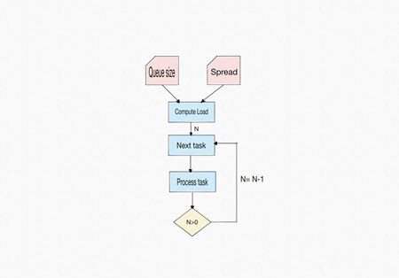
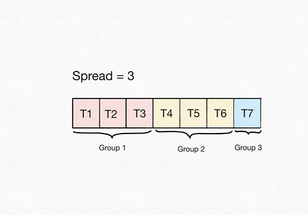
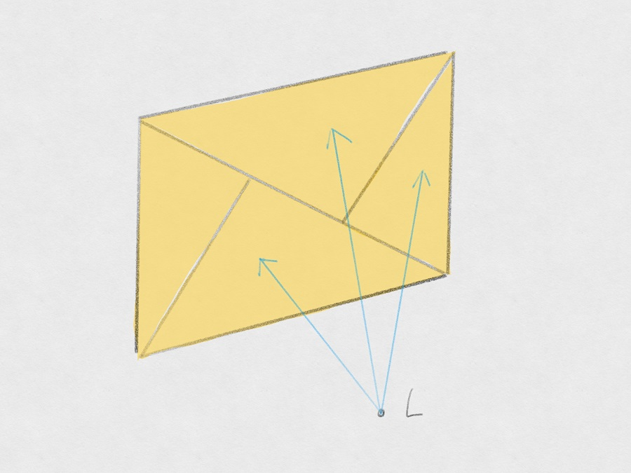

# 射线追踪引擎几何构造指南

|  |
| --- |
| Wwise SDK 2025.1.4 - Windows |

射线追踪引擎几何构造指南

# 简介

“射线追踪”是一种可以高效地估算 N 阶反射和衍射的技术。它的基本理念是从听者端随机地投射射线，并通过一系列反射和衍射来追踪其路径。这种技术是在图形渲染技术的基础上演化而来的。最高反射阶数 [1-4] 和最高衍射阶数 [1-8] 值在 `AkSpatialAudio.h` 的 `AkSpatialAudioInitSettings` 结构中定义。有关更多详细信息，请参阅 [AkSpatialAudioInitSettings](struct_ak_spatial_audio_init_settings.html) 。

# 概念

- 初级射线：直接从听者端投射的射线
- 反射：声波被表面反弹
- 衍射：声波绕过物体曲线传播
- 路径：从听者到发声体的一系列反射/衍射

# 设置

为了调节 Spatial Audio CPU 的性能和品质，射线追踪引擎使用了多项参数。有关 Spatial Audio 设置的详细说明，请参阅 [AkSpatialAudioInitSettings()](struct_ak_spatial_audio_init_settings.html "Initialization settings of the spatial audio module.")。

# Path Sorting

Reflection path validation can become expensive when the total number of rays and/or emitters is high. However, in most cases, a few reflection paths are relevant to the perception of early reflections. Path sorting is an experimental feature that attempts to validate a user-specified number of reflection paths (see [AkSpatialAudioInitSettings()](struct_ak_spatial_audio_init_settings.html)). Path sorting can significantly reduce the CPU load.

## Path Sorting Overview

In the first phase, path sorting estimates the cost (length and diffraction) of each potential reflection path based on the results of the raytracing. The paths are then processed in ascending order until a maximum of n (the user-specified number of reflection paths) paths are validated. To reduce flickering (switching between paths), the previous paths are also validated. In the second phase, the best n paths are selected from the current and previous validated paths based on their final real costs.

Path Sorting Overview

## Path Sorting Limitations

The selection of the n best reflection paths is global to all emitters. This means that, depending on the user-specified number of paths and the number of emitters, some emitters might not have any associated reflection paths. The cost in the first phase is an estimate of the real cost, so in some cases the selected paths are not the best overall paths, and some flickering might still occur.

# Emitter Clustering (Experimental)

As the number of emitters increases, the computational cost of reflection and diffraction path validation increases as well. However, individual path calculations are less important for distant emitters than for close emitters. To reduce resource consumption, you can use emitter clustering, an experimental feature that groups emitters based on their distance from the listener.

Definitions:

- Cluster: a group of emitters.
- Cluster generator: the emitter within a cluster that created the cluster.
- Cluster leader: the emitter inside a cluster that is the closest to the listener. All emitters inside the cluster share the reflection and diffraction paths of the leader.

To form emitter clusters, emitters must satisfy three criteria (see [AkSpatialAudioInitSettings()](struct_ak_spatial_audio_init_settings.html)):

- Spatial proximity: distance between emitters must be less than the user-defined `AkSpatialAudioInitSettings::fClusteringMaxDistance`.
- Minimum number of emitters: a cluster requires at least `AkSpatialAudioInitSettings::uClusteringMinPoints` emitters. Setting `AkSpatialAudioInitSettings::uClusteringMinPoints` to less than 2 disables clustering.
- Emitters within a cluster must share identical properties:
  - All emitters within a cluster must be visible (or not not visible) from the listener.
  - All emitters must be visible from the cluster generator.
  - All emitters within a cluster must have the same reflection and diffraction status: enabled or disabled.

Upon clustering, the emitter closest to the listener is selected as the cluster leader. Paths to the leader are then calculated and replicated for all other emitters in the cluster.

After clustering, the emitter count decreases from N to n + c, where n represents the number of ungrouped emitters and c represents the number of clusters. The expected performance gain factor is N / (n + c).

The following image depicts emitters clustered by color, with cluster leaders indicated by larger spheres. Emitters closest to the listener are ungrouped.

Emitters grouped into several clusters

## Emitter Clustering Limitations

Emitter clustering has the following limitations:

- Changes in listener or emitter position can cause emitters to enter or exit clusters, which triggers updates to reflection and diffraction paths that might manifest as Doppler effects.
- If emitters within a cluster are not mutually visible with the cluster leader, computed paths might be erroneous. To ensure path accuracy, we recommend that you increase `AkSpatialAudioInitSettings::fClusteringDeadZoneDistance`, the dead zone distance used during clustering (see [AkSpatialAudioInitSettings()](struct_ak_spatial_audio_init_settings.html)).

# 负荷均衡

借助负荷均衡，可将 Spatial Audio 任务计算分摊到多个帧，从而尽量避免 CPU 用量达到峰值。Spatial Audio 会执行不同类型的任务（如射线投射和路径验证）来计算声音传播路径（反射和衍射）。在每次需要执行其中某项任务时，都会将其放到优先级队列中等待进一步处理而非马上执行。随后，会在负荷均衡分摊设置中指定的帧数内执行队列中的任务。

## 负荷均衡用例

There are several ways to tweak spatial audio performance: change the order of reflection, enable or disable diffraction and diffraction on reflections, and adjust the motion threshold setting. 您可以将负荷均衡与其他设置结合来实现品质和性能之间的理想平衡。

虽然在任何场景中都可以使用负荷均衡，但其最适合涉及多个活跃发声体的情形。负荷均衡行为可通过 [AkSpatialAudioInitSettings::uLoadBalancingSpread](struct_ak_spatial_audio_init_settings_adb7560b0a616975d9f95fb932380002e.html#adb7560b0a616975d9f95fb932380002e "Spread the computation of paths on uLoadBalancingSpread frames [1..[. When uLoadBalancingSpread is se...") 设置来控制（参见 [AkSpatialAudioInitSettings](struct_ak_spatial_audio_init_settings.html) 章节）。分摊到 1 帧相当于禁用功能，因为每项任务都会立即执行。数值越大，CPU 性能越高，但可能会导致结果不准确。比如，对于 1024 个样本的帧缓冲区分摊到 4 帧（约 21 ms/48 kHz），会在 84 ms 的时段内执行任务。在将分摊值设在 10 以下时，品质应当不会受到明显影响。

## 负荷均衡示例

以下示例对相同场景下采用三个不同分摊值时的性能进行了对比：1（禁用）、4 和 10。该场景中包含 944 个三角形和 649 个衍射边缘。发声体数量为 4。反射阶数设为 4，同时启用了衍射。

城市环境中设有多个发声体

下表显示了不同负荷均衡值对场景的影响。

| Spread | Average CPU % | Max CPU % |
| --- | --- | --- |
| Disabled | 4.8 | 52.76 |
| 4 | 3.16 | 23.26 |
| 10 | 1.71 | 10.22 |

在禁用负荷均衡时，一帧内的发声体数可多达 4 个，导致 CPU 峰值过高。

在将分摊值设为 4 时，最多会在给定帧内处理 2 个发声体，可以降低 CPU 峰值。

在将分摊值设为 10 时，只会在给定帧内处理 1 个发声体，可以进一步降低 CPU 峰值。

## 负荷均衡常见问题解答

- 负荷均衡会导致出现延迟吗？

  不一定。在更新路径信息上会有延迟，但不会增加音频信号的延迟。比如，在下次更新之前可能会使用相同的射线。仍会在每帧计算路径，但是不会每帧都验证。也就是说，有些路径可能会不准确。比如，镜面反射位置可能会不太精准。
- 负荷均衡会提升 CPU 的平均性能吗？

  虽然负荷均衡主要侧重于降低 CPU 峰值，不过也会降低 CPU 处理资源的平均用量，因为它会阻止同一类型的任务多次出现在队列中。若任务在队列中，则须先执行完该任务，然后才能将同一类型的另一任务添加到队列中。
- 在只有一个发声体时，负荷均衡会提升 CPU 性能吗？

  不会有显著提升。路径验证是占用 CPU 处理资源最多的 Spatial Audio 任务。鉴于每个发声体都会执行一项路径验证任务，所以负荷均衡更适合涉及多个发声体的情形。不过，它可以避免进行重复计算。这样会略微提升只有一个发声体时的性能。

## 负荷均衡详述

在每次需要执行 Spatial Audio 任务时，都会将其放到优先级队列中等待进一步处理而非马上执行。倘若任务已经在队列中，不会再次将其放到队列中。这样可以避免进行重复计算，从而降低 CPU 用量。在每一帧，都会根据队列中的元素数和负荷均衡分摊设置来计算所要处理的任务数 (N)。随后，会从队列中调取前 N 项优先任务并予以执行。

总的来说，任务优先级由任务的创建/插入时间决定：先执行较早的任务。对于有些任务（如路径验证），优先级的设定可能会所有不同。在每次发声体变为活跃状态时，都会提高路径验证任务的优先级，来强制执行对新路径的验证。这样可以避免在创建路径时产生延迟。

若尚未对任务做出安排，会先将其放到队列中。

在每一帧，都会从队列中调取 N 项任务来执行。

队列中有 7 个元素，负荷均衡分摊值被设为了 3。此帧内要执行的任务数 (N) 为 CEIL(7/3) = 3。任务 T1、T2 和 T3 将在同一帧内执行。下一帧会重复这一流程。

## Dynamic Load Balancing

Static load balancing is sensitive to fluctuations in scene complexity, which can cause problems in some cases. As an alternative, you can use dynamic load balancing, which adapts the spread according to current CPU usage and the specified CPU limit (see `AkSpatialAudioInitSettings::fCPULimitPercentage`). When enabled (`fCPULimitPercentage` > 0), dynamic load balancing interprets `uLoadBalancingSpread` as the upper bound of the spread, which then varies dynamically between 1 and this maximum. The spread scales with CPU load, and a gradual reduction is implemented to avoid sudden oscillations. Dynamic load balancing operates analogously to a soft compressor with attack and release phases. The dynamic load balancing system, constrained by the maximum spread and subject to fluctuating scene complexity, might not always maintain the specified CPU limit. If the CPU limit is consistently exceeded, we recommend that you review and modify settings according to the guidelines provided in [性能调节](raytracing_geometry_guide.html#raytracing_geometry_guide_performance_tweaking).

# 限制

在针对射线追踪引擎定义几何构造时，存在一些限制。这些限制会对 CPU 性能和应用效果产生影响。

# 几何构造可见角度

在三角形小于采样密度时，射线追踪引擎有可能会找不到它。

几何构造的可见角度 α 是指听者可从怎样的角度看到几何构造。两条射线之间的平均角度 γ 则会随着初级射线数变化。α 和 γ 之间的关系会影响找到与物体的交点（反射点或衍射点）的可能性。若 γ 小于 α，则找到交点的可能性较高。若 γ 大于 α，则找到交点的可能性较低。

在本例中，γ 小于 α。因此，找到与物体的交点的可能性较高。

在本例中，γ 大于 α。因此，找到与物体的交点的可能性较低。

# 三角形数

几何构造中包含的三角形数会直接影响引擎的 CPU 用量：三角形越多，CPU 用量就越高。这是因为需要对物体进行更多的相交检测。通常，声音传播并不需要太过精细的几何构造。在不影响应用效果的前提下，可通过适当减少三角形数来提升 CPU 性能。

此处的平面由 4 个三角形组成：需要针对每个三角形对射线进行相交检测。

# 几何构造形状

有些几何构造形状会比较不好处理。通常，像平面和箱体这样的几何构造处理起来较为简单，在声音传播方面的应用效果也最好。球体和圆柱体则容易出现错误。这是因为球体和圆柱体会涉及到曲率的问题。有些衍射边缘可能会无法找到，从而导致部分衍射路径丢失。大部分情况下会借助各种启发式算法来克服这一问题。通过增加初级射线数或简化几何构造也可解决该问题。

在此情形下，我希望找到从 L 经过 E2、E3、E4 到 E 的衍射路径。然而 E1 和 E2 之间的表面太小了，所以很难找到所需交点来生成衍射边缘 E2。在这种情况下，比较有可能找到跟 E1 的交点。但是，L 不在 E1 的阴影区。这样算法就很难从 E2 找到衍射路径。

# 性能调节

下表阐述了如何针对不同用例来调节相应参数。

| 故障 | 可能的解决方案 |
| --- | --- |
| Spatial Audio - General CPU 存在问题 | - **降低反射阶数：**在大多数情况下，一阶和二阶反射就足够了。 - **在非必要时禁用衍射或对衍射的反射：**衍射的计算会占用大量 CPU 资源。在可能的情况下减少场景中衍射边缘的数量，而不是完全禁用衍射。 - **使用 Room 和 Portal：**若场景由相互独立的部分组成，可考虑使用 Room 和 Portal 将其分隔。 - **Increase the motion threshold:** small values might validate reflection and diffraction paths too often. 可考虑在保证结果品质的情况下将此项设为尽可能高的值。Low values might introduce some inaccuracy in the reflection and diffraction paths. Some examples of inaccuracy: reflections might not be perfectly specular, some paths might be discovered with some delay, some invalid paths might be removed later than expected. - **在可能的情况下减少三角形数量：**若对象的细节层次 (LOD) 较高，不仅会增加 CPU 用量，而且会降低整体品质。 - **Decrease the maximum number of reflection paths:** validation of a high number of paths increases CPU cost. Low values might affect the overall quality. |
| Spatial Audio - Raytracing CPU is high | - **Decrease the number of primary rays:** values as low as 5 can still produce good results. - **Enable Dynamic Load Balancing ([Dynamic Load Balancing](raytracing_geometry_guide.html#raytracing_geometry_guide_dynamic_load_balancing)):** set your desired CPU percentage, and the feature will automatically control the load balancing spread to keep the CPU below the specified value. |
| Spatial Audio - Path Validation CPU 很高且只有一个发声体 | - **在非必要时禁用衍射或对衍射的反射：**衍射的计算会占用大量 CPU 资源。在可能的情况下减少场景中衍射边缘的数量，而不是完全禁用衍射。 - **Decrease the maximum number of reflection paths:** validation of a high number of paths increases CPU cost. Low values might affect the overall quality. |
| Spatial Audio - Path Validation CPU 很高且有多个发声体 | - **启用负荷均衡：**先将值设在 10 以下，必要的话再进行调节。在将值设在 10 以下时，品质应当不会受到明显影响。You can also enable Dynamic Load Balancing ([Dynamic Load Balancing](raytracing_geometry_guide.html#raytracing_geometry_guide_dynamic_load_balancing)). - **Decrease the maximum number of reflection paths:** validation of a high number of paths increases CPU cost. Low values might affect the overall quality. |
| Spatial Audio - CPU 很高（同时涉及路径验证和射线追踪）且只有一个发声体 | - **启用负荷均衡：**将值设为 2。这样可将对射线追踪和路径验证的计算分摊到不同的帧，进而降低峰值 CPU 用量。设置更大的值并不会带来太大帮助。 - **增大振动阈值：**在这种情况下，主要会降低平均 CPU 用量（相较于峰值 CPU 用量）。 - **Decrease the maximum number of reflection paths:** validation of a high number of paths increases CPU cost. Low values might affect the overall quality. |