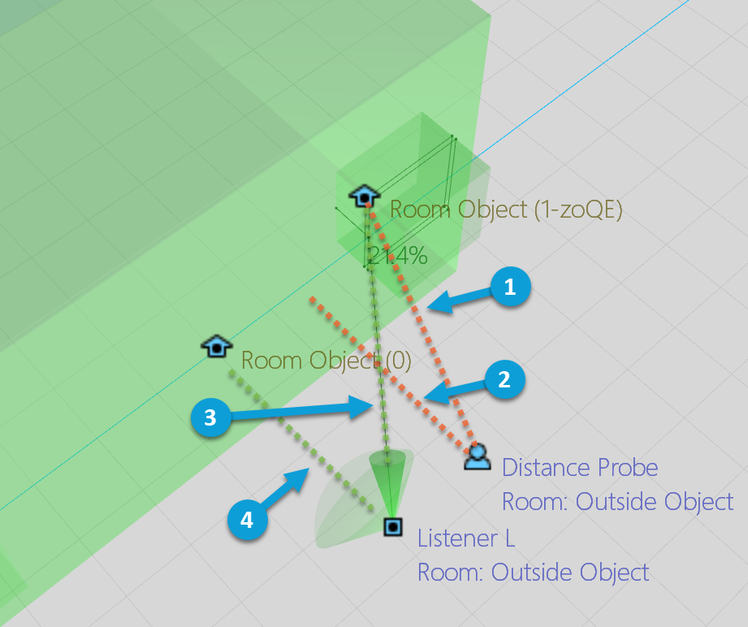

# 第三人称视角和 Spatial Audio

|  |
| --- |
| Wwise SDK 2025.1.4 - Windows |

第三人称视角和 Spatial Audio

|  |  |
| --- | --- |
|  | **备注:** 有关如何在第三人称游戏中设置听者的介绍，请参阅 [在第三人称游戏中设置听者](soundengine_listeners.html#third_person_perspective) 章节。本节详细阐述了与 Spatial Audio 相关的具体细节。 |

在初始化 Wwise Spatial Audio 的情况下构建第三人称视角 (TPP) 体验时，有一些特别注意事项。

Wwise Spatial Audio 利用基于射线的声学模拟技术执行声音传播计算。从广义上讲，我们可以借助 Spatial Audio 来计算发声体和听者之间的声音传播路径。声音路径可能受制于以下因素：

- 反射：从表面反弹。
- 衍射：绕过物体、表面或 Portal。
- 透射：穿透物体、表面或 Room。

一般来说，单个声音和听者之间有很多条路径，它们结合起来产生最终渲染的声音。有关 Spatial Audio 的详细信息，请参阅 [Spatial Audio](spatial_audio.html) 章节。

在 TPP 体验中，摄像机体验和角色体验之间存在差异的情形并不少见。在此类情况下，可能很难或无法按照简单的规则来基于 Distance Probe 对距离衰减和滤波进行渲染并基于摄像机位置实施声像摆位/空间化处理。针对声学模拟执行的计算可能会占用大量 CPU 资源，所以不可能也不需要同时针对 Listener 和 Distance Probe 游戏对象实施模拟。

不过，仍可将 Distance Probe 指派给 Spatial Audio Listener。通常，Wwise Spatial Audio 会使用 Listener 位置执行声音传播计算。传给声音引擎的距离值会被增强以提供与针对 Distance Probe 游戏对象进行计算更为接近的结果。在增强距离值时所用的方法因路径类型而异；如需详细了解这会对反射、衍射和透射路径产生怎样的影响，请参阅以下各个章节。这种方法可以确保空间化和声像摆位符合模拟的需求，而不会破坏玩家的沉浸感。不过，在 Distance Probe 和 Listener 的位置存在很大差异时，衰减值可能会产生不太符合预期的结果。倘若使用了 Spatial Audio 功能，但路径计算产生不受阻挡的直线，衰减结果将完全符合预期。

以下章节详细阐述了如何在将 Distance Probe 指派给 Spatial Audio Listener 时运用各种 Spatial Audio 功能。

# 衍射和虚拟定位

Spatial Audio 中的衍射系统主要负责针对特定声音和听者渲染干声信号路径。通常，单个声音会有多条衍射路径。

- 根据 Emitter 和 Listener 游戏对象的位置计算衍射路径。根据几何构造和/或 Portal 沿着路径查找衍射点。
- 计算虚声源位置。
- 根据虚声源位置照常对声音实施声像摆位。
- 根据 Emitter 和 Listener 游戏对象之间的路径计算衍射系数，进而对声音实施进一步的衰减和滤波。
- 在估算声音衰减曲线时所用的距离是虚声源位置和 Distance Probe 游戏对象之间的距离。

# 透射

对于干声信号路径，可直接结合 Distance Probe 使用透射声音，因为透射路径始终遵循直线。

# 反射

Spatial Audio 中的反射系统使用 Reflect 插件针对声音和 Listener 渲染早期反射。

- 通过从 Listener 投射射线计算反射路径。
- 在找到路径时，会从 Emitter 向后追溯，经过一系列表面反弹，最后到达 Listener 所在位置。随后，计算镜像声源位置并将其传给 Reflect 插件。
- 在 Reflect 插件中：
  - 根据 Listener 游戏对象和镜像声源的位置对反射声实施声像摆位。
  - 根据镜像声源和 Distance Probe 游戏对象之间的距离对反射声实施衰减。在估算对反射声的衰减时所用的曲线由 Reflect 插件的设置决定。

# Room 和 Portal

Room 和 Portal 系统主要用于对混响实施空间化处理，不过也会用于干声信号路径的衍射计算。经过空间化处理的混响涉及湿声信号路径，一般来说可将其视为来自插件的混响输出，或 Room 游戏对象上直接播放的房间底噪。

- 在 Listener 位于被混响或房间底噪激励的 Room 内时：
  - 混响和/或房间底噪是各向均匀的。而且，Room 的声场是逆向旋转的。这样的话，无论 Listener 的朝向如何，其相对于 Room 朝向都是固定的。 demonstrating this scenario.
- 在 Listener 位于被混响或房间底噪激励的 Room 外时：
  - 根据通往 Room 的 Portal 的位置对从 Room 发出的声音实施空间化处理。
  - 从 Portal 到 Room 的每条路径还有关联的虚声源位置。计算虚声源位置是为了对从 Portal 传来的声音实施声像摆位，确保与源自 Portal 的路径的角度及相对于听者的入射角匹配。
  - 对于 Room 的透射路径，规则与 Listener 位于 Room 内时相同（只不过在这种情况下，会将透射损失应用于声音）。
- Distance is evaluated between the Distance Probe and the geometry that represents the shape of a room (or the room extent bounding box if there is no geometry). See [Geometric Room Distance on Direct Paths](spatial_audio_roomsportals_distance.html) for more information on how distance to room geometry is evaluated and affected by other Rooms and Portals features.

## 示例场景

以下 Game Object 3D Viewer 注解图举例展示了带有单个 Portal 的 Room。其中，Distance Probe 和 Listener 均位于 Room 外。

|  |  |
| --- | --- |
|  | 距离：从 Distance Probe 到 Portal 的虚声源位置。此距离用于对从 Portal 传来的声音进行估算。 |
|  | Distance: Distance Probe to room geometry or extent. 此距离用于渲染透射路径。 |
|  | 方向：从 Listener 到 Portal 的虚声源位置。此方向用于对从 Portal 传来的声音实施声像摆位。 |
|  | 方向：从 Listener 到 Room 边界。This direction is used to pan the contribution of the transmission path. |

|  |  |
| --- | --- |
|  | **备注:** Room extent visualization can be enabled in the Game Object 3D Viewer Settings by setting the Room Extent Opacity slider to a value greater than zero. |