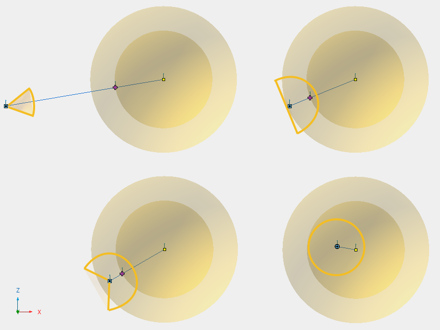
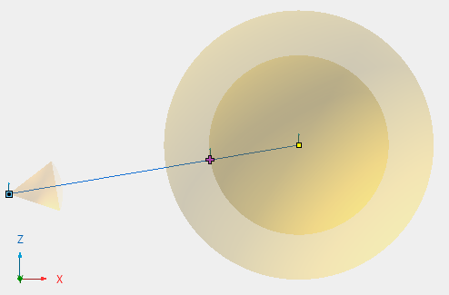

# Radial Emitters

|  |
| --- |
| Wwise SDK 2025.1.4 - Windows |

Radial Emitters

A Radial Emitter is an emitting game object, set with non-zero inner or outer radii, that simulates sound emitting from a spherical volume of space. The inner and outer radii are set with `AK::SpatialAudio::SetGameObjectRadius()`. Otherwise, the game object acts as a point source.

# Game Object Spread

The two radii drive a position-driven spread value that applies to the sounds emitted by the game object. When using a Radial Emitter, it is not necessary to define a spread curve in the Attenuation of the sound.

|  |  |
| --- | --- |
|  | **备注:** If a game object has a spread curve defined in an Attenuation ShareSet, the spread curve takes precedence over the game object's radial extent passed into `AK::SpatialAudio::SetGameObjectRadius`. |

The spread is calculated as follows:

- If the listener is outside the outer radius, the spread is defined by the area that the sphere occupies in the listener field of view.
- When the listener intersects the outer radius, the spread is exactly 50%.
- When the listener is between the inner and outer radii, the spread interpolates linearly from 50% to 100% as the listener transitions from the outer radius towards the inner radius.
- If the listener is inside the inner radius, the spread is 100%.

# Distance to a Radial Emitter

The inner radius is also used to calculate the distance between the listener and the radial emitter. The distance sent to the Attenuation of the sound is the distance between the listener's position and the closest point on the surface of the inner radius sphere. In the Game Object 3D Viewer, a plus sign icon indicates the virtual position of the radial emitter.

# Volumetric Emitter

Combine multipositioned Radial Emitters to simulate a volumetric sound source of any shape. An example is available in the [Wwise Audio Lab sample game](https://www.audiokinetic.com/library/wal/?source=WwiseAudioLab&id=welcome_to_wwise_audio_lab) where the ocean sound is created with a volumetric emitter that follows the shape of the shore.

参见
:   - [为单个游戏对象设置多个位置](soundengine_3dpositions.html#soundengine_3dpositions_multiplepos)