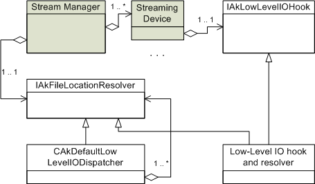

# Low-Level I/O

|  |
| --- |
| Wwise SDK 2025.1.4 - Windows |

Low-Level I/O

|  |
| --- |
| **Default Streaming Manager Information**    Low-Level I/O 是高级 Stream Manager API 默认实现的一个子模块，用于为 I/O 传输提供比实现高级 Stream Manager API 更简单的接口，因此只有在 Stream Manager 默认实现的环境中才适用。 |

# 简介

Low-Level I/O 系统是特别针对 Audiokinetic 厂商实现的 Stream Manager，其接口于 *<Wwise Installation>/SDK/include/AK/SoundEngine/AkStreamMgrModule.h* 中定义。

Low-Level I/O 系统有两个目的：

- 解析文件位置。
- 将实际 I/O 传输抽象化。

One and only one object that implements [AK::StreamMgr::IAkFileLocationResolver](class_a_k_1_1_stream_mgr_1_1_i_ak_file_location_resolver.html), referred to as the File Location Resolver, must be registered to the Stream Manager (using `AK::StreamMgr::SetFileLocationResolver()`). To open a standard or automatic stream, the Stream Manager will call `AK::StreamMgr::IAkFileLocationResolver::GetNextPreferredDevice()` to find which streaming device is likely to have the file. 流播放设备通过 `AK::StreamMgr::CreateDevice()` 在 Stream Manager 中创建和注册。

必须为每个流播放设备提供一个 Low-Level I/O 挂钩。This I/O hook implements `AK::StreamMgr::IAkLowLevelIOHook` and is responsible for communicating with the platform's I/O API and handles the unique properties and behavior of that physical device. Whenever a streaming device needs to perform an I/O transfer, it calls the low-level I/O hook's `AK::StreamMgr::IAkLowLevelIOHook::BatchRead()`, or `AK::StreamMgr::IAkLowLevelIOHook::BatchWrite()` method. No direct call to a platform's I/O API is ever issued from the High-Level Stream Manager. File Location Resolver 和 I/O 挂钩共同构成 Low-Level I/O 系统。

下图从默认 Stream Manager 角度描述了 Low-Level I/O 系统接口。

游戏需要实现 Low-Level I/O 接口来解析文件位置，执行实际的 I/O 传输。The easiest and most efficient way to integrate the Wwise sound engine's I/O management in your game is to use the default implementation of the Stream Manager and implement a Low-Level I/O system. 在此，您可以执行自带文件的读取操作，或者使用自己的 I/O 管理技术来处理 I/O 请求。

Wwise SDK 包含默认的 Low-Level I/O。It can be used as is, or as a starting point to implement your own. Refer to the [默认实现示例纵览](streamingmanager_lowlevel.html#streamingmanager_lowlevel_default_implementation_walkthrough) section for a detailed overview of the Low-Level I/O samples.

# 文件位置解析

## File Location Resolver（ File Location Resolver ）

File Location Resolver 需要使用 `AK::StreamMgr::SetFileLocationResolver()` 注册至 Stream Manager。 在 Stream Manager 创建流对象时，其会调用此解析器的 GetNextPreferredDevice() 方法，并返回 AkDeviceID 以识别用来打开相应文件的 I/O Device。此函数只会通过名称、标记、语言等查找文件位置，而不会执行磁盘操作或其他物理检查。真正的 Open 调用会被转发给指定的设备来执行磁盘操作。因此，该函数要快速返回结果。 若 Device 无法查找或打开相应文件，将再次调用 GetNextPreferredDevice。If no other Devices are known, or the file is unlikely to be found in other locations, then AK\_FileNotFound should be returned to notify the end of the search.

Low-Level I/O 中的文件数量与同一时间 Stream Manager 中流对象数量相同。

游戏必须使用 `AK::StreamMgr::CreateDevice()` 在 Stream Manager 中至少创建一个流播放设备。 返回的 AkDeviceID 应由调用程序保留并按照以上所述在 `AK::StreamMgr::GetNextPreferredDevice` 中返回。 还可以根据需要创建所需数量的设备。每个流播放设备在独立的线程中运行，并将 I/O 请求发送到各自的 I/O 挂钩。通常应为每个物理设备创建一个流播放设备。 在 [AkFileDesc](struct_ak_file_desc.html) 结构中，有 deviceID 字段。File Location Resolver 需要将其设置为已有流播放设备的 deviceID 之一。This is how file handling is dispatched to the appropriate device. Additionally, the file's size and offset (`uSector`) must be returned, and a system file handle should be created (although this is not strictly necessary).

## 文件说明

Clients of the Stream Manager identify files either using strings (const AkOSChar \*), IDs (AkFileID, integer), or file descriptors ([AkFileDesc](struct_ak_file_desc.html)). This is why the stream creation methods of the Stream Manager (`AK::IAkStreamMgr::CreateStd()`, `AK::IAkStreamMgr::CreateAuto()`) use a struct call [AkFileOpenData](struct_ak_file_open_data.html) that groups both possible file identification methods. 在打开相应文件后， `AK::StreamMgr::IAkLowLevelIOHook::BatchOpen()` 方法必须创建有效的文件描述符。

每次调用底层 I/O 挂钩的方法都会传回此文件描述符。Three members of the structure are used by the High-Level Stream Manager:

- deviceID：须为调用 `AK::CreateDevice()` 所获得的有效设备 ID。Stream Manager 用其将文件关联到正确的高级设备。一旦建立关联，将通过创建设备时传递的 I/O 挂钩执行 I/O 传输。
- uSector：所述文件开头的偏置。This is relative to the beginning of the file represented by the AkFileHandle `AkFileDesc::hFile`. It is expressed in terms of blocks (sectors), which size corresponds to the value returned by `AK::StreamMgr::IAkLowLevelIOHook::GetBlockSize()` for this file descriptor. 当流播放设备调用 I/O 传输方法时，会将文件开头的偏置（单位：字节）作为 AkTransferInfo 结构的一部分发送给其 Low-Level I/O 挂钩。偏置的计算方式是：Current\_Position + ( [AkFileDesc::uSector](struct_ak_file_desc_a3fc9acc74908496f0966c75b41b8e61e.html#a3fc9acc74908496f0966c75b41b8e61e) \* Block\_Size)。注意块大小也通过此挂钩查询，为每个文件描述符各查询一次。
- iFileSize：Stream Manager 用其来检测文件结尾。然后通过 `AK::IAkStdStream::GetPosition()`, `AK::IAkAutoStream::GetPosition()` 向用户报告，并停止自动流的 I/O 传输。

其余的成员归 Low-Level I/O 系统所独自占有。例如，Win32 中类型定义为 HANDLE 的 `AkFileHandle` 可用于容纳传递到 Win32 `ReadFile()` 的实际有效文件句柄。它还可以用作 ID 或者指针。High-level devices never modify or read file descriptor fields. Thus, the Low-Level I/O is free to close and reopen a file handle, for example, if files have been laid out redundantly on the game disk.

在关联流对象的整个生命周期，由 `AK::StreamMgr::IAkLowLevelIOHook::BatchOpen()` 返回的文件描述符结构都要保持不变，直到调用 `AK::StreamMgr::IAkLowLevelIOHook::Close()` 为止。

## 延迟打开

用户既可同步也可延迟完成由 `AK::StreamMgr::IAkLowLevelIOHook::BatchOpen()` 执行的所有文件打开操作。 若设备的原生 API 支持延迟打开文件，出于性能上的考虑最好采用这种方式。这样的话，在某些系统上便可并行执行文件打开和读写操作，或者根据需要为其设置不同的优先级。

The parameter to [Open()](namespace_a_k_1_1_sound_engine_1_1_dynamic_sequence_ab6daddd96e109dc7669889733ce4f2cc.html#ab6daddd96e109dc7669889733ce4f2cc) is an [AkAsyncFileOpenData](struct_ak_async_file_open_data.html) struct which derives from [AkFileOpenData](struct_ak_file_open_data.html) that contains all the information passed from the `AK::IAkStreamMgr::CreateStd()` or `AK::IAkStreamMgr::CreateAuto()` functions. It also contains a callback function necessary to notify the completion of the Open operation to the high-level Streaming Manager and the return `AkFileDesc` structure to fill out.

All calls to `AK::StreamMgr::IAkLowLevelIOHook::BatchOpen()` are considered asynchronous, from the Stream Manager perspective. Once the open operation is resolved, signal the result of the operation through the notification callback (`io_pOpenData->pCallback`). It is imperative to notify of the result once it is known, otherwise the stream object waiting for this file will stay alive indefinitely and cause a memory leak. If the result reported by `io_pOpenData->pCallback` is `AK_Success`, it is expected that `io_pOpenData->pFileDesc` is filled properly and usable. Note that it is supported to call `io_pOpenData->pCallback` right away (synchronously) if the result of the operation is known at the moment of the BatchOpen() call.

|  |  |
| --- | --- |
|  | **技巧:** The [AkAsyncFileOpenData](struct_ak_async_file_open_data.html) (`io_pOpenData`) parameter that is passed to `AK::StreamMgr::IAkLowLevelIOHook::BatchOpen()` will stay valid until the notification `io_pOpenData->pCallback` is received. |

If the file is opened successfully, set `in_eResult` to `AK_Success` and create the file descriptor structure (`io_pOpenData->pFileDesc`) properly. The `pFileDesc` member must point to memory that will be valid for the lifetime of the stream object, until [Close()](namespace_a_k_1_1_sound_engine_1_1_dynamic_sequence_ab204d963f6b81abc102a6d6b8272b591.html#ab204d963f6b81abc102a6d6b8272b591) is called. Use `AK_FileNotFound` if the file was not found and set `io_pOpenData->pFileDesc` to null. Other error codes are possible, such as `AK_FilePermissionError`, `AK_FilePathTooLong` or `AK_UnknownFileError`.

## 文件系统标志

The Stream Manager's `AK::IAkStreamMgr::CreateStd()` and `AK::IAkStreamMgr::CreateAuto()` methods accept a pointer to an [AkFileSystemFlags](struct_ak_file_system_flags.html "File system flags for file descriptors mapping.") structure, which is passed to `AK::StreamMgr::IAkFileLocationResolver::GetNextPreferredDevice()` and `AK::StreamMgr::IAkLowLevelIOHook::BatchOpen()`. 此结构是用户直接传递信息到 Low-Level I/O 的一种方式。例如，此信息可以用于完成文件位置逻辑。Stream Manager 的一般用户可以传递 NULL，但声音引擎总是传递含有相关信息的结构，以告知 File Location Resolver 该请求来自声音引擎。

文件系统标志结构包含以下字段：

- uCompanyID：声音引擎总是设置此字段为 AKCOMPANYID\_AUDIOKINETIC，因此 Low-Level I/O 的实现者知道此文件须由声音引擎读取。 在流播放 External Source（外部源）时，声音引擎将传递 AKCOMPANYID\_AUDIOKINETIC\_EXTERNAL。
- uCodecID：此字段可用于辨别文件类型。它将告知声音引擎使用的文件类型。声音引擎使用的编解码器 ID 在 AkTypes.h 中定义。主机程序可以使用与其中相同的值来定义它自己的 ID，只要不将 companyID 设为 AKCOMPANYID\_AUDIOKINETIC 或 AKCOMPANYID\_AUDIOKINETIC\_EXTERNAL 就可以。 Note the predefined CodecID AKCODECID\_BANK, AKCODECID\_BANK\_EVENT, AKCODECID\_BANK\_BUS which, on top of the traditional Codecs, can be useful for file organization.
- bIsLanguageSpecific：此字段指示查找的文件是否针对当前语言。通常，系统会将包含语言特定内容的文件存放在不同的位置（一般会放在语言文件夹中）。Low-Level I/O 需要根据当前选择的语言解析路径。请参阅 [多语言专用的（“语音”和“混合”） SoundBank](soundengine_banks_general.html#soundengine_banks_general_identification_language) 了解更多详情。
- 自定义参数和大小：用于文件位置机制的、游戏特有的扩展名。例如，在文件描述符中可以存储扩展名。声音引擎总是传递 0。

## 解析声音引擎文件

声音引擎读取 SoundBank 文件和流播放音频文件。此小节解释 Low-Level I/O 如何能够将其标识符解析为实际文件。

Different strategies exist to map the ID received in [AK::StreamMgr::IAkLowLevelIOHook::BatchOpen()](class_a_k_1_1_stream_mgr_1_1_i_ak_low_level_i_o_hook_a0abfde848b599b5e5b8e8ed63dc8b555.html#a0abfde848b599b5e5b8e8ed63dc8b555) to a valid file descriptor in the Low-Level I/O:

- 实现并使用 ID 到文件名称的映射
- 使用 ID 创建文件名字符串
- get the system handle of a big file that concatenates all streamed audio files (for e.g. a file package generated with the File Packager application - refer to the Wwise Help for more details), and implement and use a map of IDs to file descriptor structures that define their size and offset in this big file.

Low-Level I/O 的 SDK 示例使用两种不同的策略来解析文件位置。策略一（**CAkFileLocationBase**）将全局设置的路径拼接起来，创建可用于平台 `fopen()` 方法的完整路径字符串。The other one (`CAkFilePackageLowLevelIO`) manages a file package that was created with the File Packager utility. A file package is simply a big file in which many files are concatenated, with a header that indicates the relative offset of each original file.

File Location Resolver 的两种实现也被用作 SDK 的示例。They use a different strategy to manage file location. These strategies are described in the sample code walkthroughs, at the end of this section.

请参阅 [基本文件定位](streamingmanager_lowlevel.html#streamingmanager_lowlevel_default_implementation_walkthrough_file_location) 了解有关 Low-Level I/O 的默认实现所用策略的描述。

请参阅 [文件位置](streamingmanager_lowlevel.html#streamingmanager_lowlevel_filepackage_implementation_walkthrough_filelocation) 了解有关使用文件包的 Low-Level I/O 实现（**CAkFilePackageLowLevelIO**）所用策略的描述。

### SoundBank

Following an explicit or implicit request to load a bank from the main API (`AK::SoundEngine::LoadBank()` and `AK::SoundEngine::PrepareEvent()`), the Bank Manager of the sound engine may call either the ANSI string or the ID overload of [AK::IAkStreamMgr::CreateStd()](class_a_k_1_1_i_ak_stream_mgr_a1de2a7935a2d3cddb71e7cc7f48effd6.html#a1de2a7935a2d3cddb71e7cc7f48effd6). For a detailed explanation on the conditions that determine which overload is chosen, refer to [从文件系统加载 SoundBank](soundengine_banks_general.html#soundengine_banks_general_identification_filesystem).

在两种情况下，AKCOMPANYID\_AUDIOKINETIC 都将用作文件系统标志中的公司 ID，而 AKCODECID\_BANK 用作编解码器 ID。

The `LoadBank()` methods of the sound engine API do not expose a flag to specify whether or not the bank is language-specific. 解决方案要由您的 Low-Level I/O 来实现。 Since the sound engine is not aware of the SoundBank's language specificity, it calls the Stream Manager with the bIsLanguageSpecific flag set as True. 如果 Stream Manager（ Low-Level I/O）无法打开它，声音引擎将再次尝试，此次 bIsLanguageSpecific 标志设为 `False`。

Refer to [多语言专用的（“语音”和“混合”） SoundBank](soundengine_banks_general.html#soundengine_banks_general_identification_language) for more information on working with language-specific banks in the Wwise SDK.

|  |  |
| --- | --- |
|  | **技巧:** If you want to avoid having the Bank Manager call the Stream Manager twice for unlocalized banks and your file organization scheme allows you to find it regardless of language, you may ignore the bIsLanguageSpecific flag and open the soundbank directly, at the correct location. 只有您自己知道 SoundBank 的内容和位置。Also, the cookie that you pass to asynchronous versions of [AK::SoundEngine::LoadBank()](namespace_a_k_1_1_sound_engine_a95f8f6841a618ec3d5e51a30a1614e13.html#a95f8f6841a618ec3d5e51a30a1614e13) is passed to the [AK::StreamMgr::IAkLowLevelIOHook::BatchOpen()](class_a_k_1_1_stream_mgr_1_1_i_ak_low_level_i_o_hook_a0abfde848b599b5e5b8e8ed63dc8b555.html#a0abfde848b599b5e5b8e8ed63dc8b555) as the value of in\_pFlags->pCustomData. You may use it to help you determine if the bank should be opened from the language specific directory. |

### 流播放音频文件

流播放文件的参考将以整型 ID 形式存储在 SoundBank 中。The real file paths of the converted audio files that are meant to be streamed can be found in the SoundBanksInfo.xml file, generated along with the banks (refer to [SoundBanksInfo.xml](soundengine_banks_general.html#soundengine_banks_general_identification_infofile) for details).

|  |  |
| --- | --- |
|  | **技巧:** Selecting "Copy streamed files" in Wwise's SoundBank settings to automatically copy files in the Generated SoundBanks folder of the specific platform(s), renamed with the scheme [ID].[ext]. 请参阅 [流播放音频文件](soundengine_banks_general.html#soundengine_banks_general_identification_streamedaudio) 了解更多信息。 The default file location implementation (**CAkFileLocationBase**) is meant to be used with the "Copy Loose/Streamed Media" option. |

当声音引擎要流播放音频文件时，它会调用 [AK::IAkStreamMgr::CreateAuto()](class_a_k_1_1_i_ak_stream_mgr_afe30a576bd859ff4e9b60a3f8e1710fb.html#afe30a576bd859ff4e9b60a3f8e1710fb) 的 ID 重载。由上及下，将使用 [AK::StreamMgr::IAkLowLevelIOHook::BatchOpen()](class_a_k_1_1_stream_mgr_1_1_i_ak_low_level_i_o_hook_a0abfde848b599b5e5b8e8ed63dc8b555.html#a0abfde848b599b5e5b8e8ed63dc8b555) 的 ID 重载。Along with the ID, it passes an [AkFileSystemFlags](struct_ak_file_system_flags.html "File system flags for file descriptors mapping.") structure with the following information:

- uCompanyID 是 AKCOMPANYID\_AUDIOKINETIC
- uCodecID 是 AkTypes.h (AKCODECID\_XXX) 中定义的音频格式之一。
- bIsLanguageSpecific 标志。当需要在当前游戏语言位置中搜索文件时，此标志为 True，否则为 False。 By default, loading soundbanks query the language-specific folder first.

# I/O 传输接口

Once file location has been resolved through `AK::IAkFileLocationResolver::GetNextPreferredDevice()`, the Stream Manager then calls `AK::StreamMgr::IAkLowLevelIOHook::BatchOpen()` on the selected streaming device, which interacts with the Low-Level I/O system through its own I/O hook. 它将首先调用 [AK::StreamMgr::IAkLowLevelIOHook::GetBlockSize()](class_a_k_1_1_stream_mgr_1_1_i_ak_low_level_i_o_hook_a5018552d455ddc2a95b727fc543aac9e.html#a5018552d455ddc2a95b727fc543aac9e)，查询底层块大小限制。 Then, every input data transfer is executed through the hook's BatchRead() method, and output through the hook's BatchWrite() method. When the stream is destroyed, `AK::StreamMgr::IAkLowLevelIOHook::Close()` is called.

上述各方法将收到由 File Location Resolver 定义的相同文件描述符。

## 高级设备特性

Stream Manager 的当前实现仅定义了一种 I/O 挂钩，并采用异步握手方式与 Low-Level I/O 交换信号。

`AK::StreamMgr::CreateDevice()` returns a device ID that is set in the file descriptor structure by the File Location Resolver.

以下章节介绍了延迟型 I/O 挂钩。

## 延迟型 I/O 挂钩

The Stream Manager creates a streaming device which interacts with the Low-Level I/O system through the `AK::StreamMgr::IAkLowLevelIOHook` interface.

Low-Level I/O implementations must handle multiple transfer requests at the same time. The interface defines a few important methods: `AK::StreamMgr::IAkLowLevelIOHook::BatchOpen()`,`AK::StreamMgr::IAkLowLevelIOHook::BatchRead()` and `AK::StreamMgr::IAkLowLevelIOHook::BatchWrite()`. BatchRead() and BatchWrite() should return immediately, and notify the streaming device when one or more transfers are complete through the provided callback function. See details about `AK::StreamMgr::IAkLowLevelIOHook::BatchOpen()` in the section [延迟打开](streamingmanager_lowlevel.html#streamingmanager_lowlevel_location_deferred_open).

您可以在初始化设置中指定允许流播放设备发送到 Low-Level I/O 的并行 I/O 传输的最大数量 ([AkDeviceSettings::uMaxConcurrentIO](struct_ak_device_settings_af49f8b3af816b58296e952b20de2d7a3.html#af49f8b3af816b58296e952b20de2d7a3 "Maximum number of transfers that can be sent simultaneously to the Low-Level I/O."))。

For each transfer request sent to `AK::StreamMgr::IAkLowLevelIOHook::BatchRead()` or `AK::StreamMgr::IAkLowLevelIOHook::BatchWrite()`, the provided callback function in `AkAsyncIOTransferInfo` must be called once, with the result of the transfer. It must be called even in failure cases, otherwise the engine will wait for this transfer forever. The callback can be deferred to later, as it is common for asynchronous I/O subsystems to execute the transfer in the background.

The in\_eResult parameter of the callback should be AK\_Success if the transfer succeeds or any other error code if it fails. If any transfer is marked as AK\_Fail, the corresponding stream will be destroyed, and an "I/O error" notification will appear in the transfer log.

|  |  |
| --- | --- |
|  | **备注:** [AkDeviceSettings::uMaxConcurrentIO](struct_ak_device_settings_af49f8b3af816b58296e952b20de2d7a3.html#af49f8b3af816b58296e952b20de2d7a3 "Maximum number of transfers that can be sent simultaneously to the Low-Level I/O.") represents the *maximum* number of transfer requests that the device may post to the Low-Level I/O. The device's scheduler decides to post transfer requests only when clients of the Stream Manager call [AK::IAkStdStream::Read()](class_a_k_1_1_i_ak_std_stream_a2b12fb0cd1beb3c1d77c8206a8b5796d.html#a2b12fb0cd1beb3c1d77c8206a8b5796d)/Write(), or when a running automatic stream's buffering is below the buffering target ([AkDeviceSettings::fTargetAutoStmBufferLength](struct_ak_device_settings_af396c1626da7df1bbb6d9129e132b02f.html#af396c1626da7df1bbb6d9129e132b02f "Targetted automatic stream buffer length (ms). When a stream reaches that buffering,..."), refer to [Audiokinetic Stream Manager 初始化设置](streamingmanager_settings.html) for more details on the target buffering length). |

流播放设备会将一组 BatchIoTransferItem 传给 `AK::StreamMgr::IAkLowLevelIOHook` 的每个函数。 此结构包含有关每项传输的信息，包括 AkFileDesc、AkIoHeuristics 和 AkAsyncIOTransferInfo。 [AkAsyncIOTransferInfo](struct_ak_async_i_o_transfer_info.html) 结构是对前述 [AkIOTransferInfo](struct_ak_i_o_transfer_info.html) 结构的扩展。AkAsyncIOTransferInfo 包含所要读取或写入的缓冲区地址，并提供有 pUserData 字段以便实现人员将元数据附加到待处理传输。AkAsyncIOTransferInfo 结构将一直存活至调用回调函数为止。在调用回调函数后，不得再引用它。

若要将读取或写入内容输出到自己的 I/O 流播放设备以便对 I/O 请求进行重新排序，所提供的 [AkIoHeuristics](struct_ak_io_heuristics.html) 中包含的信息可能会很有用。

|  |  |
| --- | --- |
|  | **技巧:** The implementation of the default Stream Manager's scheduler is based on "client heuristics", not on "disk bandwidth heuristics". Stream Manager 不知道文件在磁盘上的布局。如果您自己的流技术允许，它可以使用这一信息来对 I/O 请求重新排序，来尽量减少磁盘寻址。 |

|  |  |
| --- | --- |
|  | **注意:** **请确保一定不要为给定的传输调用回调函数两次。** |

## 其他考虑因素

### 块大小（GetBlockSize()）

如前所述，Stream Manager 的用户必须考虑 Low-Level I/O 对于允许传输大小的限制。最常见的限制是这些大小必须是某个值的倍数。此基础值是 [AK::StreamMgr::IAkLowLevelIOHook::GetBlockSize()](class_a_k_1_1_stream_mgr_1_1_i_ak_low_level_i_o_hook_a5018552d455ddc2a95b727fc543aac9e.html#a5018552d455ddc2a95b727fc543aac9e) 为给定文件描述符所返回的值。例如，在 Windows® 中打开的带 FILE\_FLAG\_NO\_BUFFERING 标志的文件，必须使用扇区大小数倍的缓冲区大小进行读取。 [AK::StreamMgr::IAkLowLevelIOHook::GetBlockSize()](class_a_k_1_1_stream_mgr_1_1_i_ak_low_level_i_o_hook_a5018552d455ddc2a95b727fc543aac9e.html#a5018552d455ddc2a95b727fc543aac9e) 方法返回扇区大小。另一方面，如果 Win32 文件打开后不带该标志，AK::StreamMgr::IAkLowLevelIOHook::GetBlockSize() 应返回 1，从而不对 Stream Manager 的客户端加以限制。

|  |  |
| --- | --- |
|  | **注意:** [AK::StreamMgr::IAkLowLevelIOHook::GetBlockSize()](class_a_k_1_1_stream_mgr_1_1_i_ak_low_level_i_o_hook_a5018552d455ddc2a95b727fc543aac9e.html#a5018552d455ddc2a95b727fc543aac9e) 决不能返回 0。 |

|  |  |
| --- | --- |
|  | **技巧:** 处理底层块大小限制的重任将交给 Stream Manager 的客户端。 块大小值较大时将导致声音引擎浪费更多的流数据。You should use a low-level block size of 1 unless the platform's I/O system has specific alignment constraints or unless it helps you improve I/O bandwidth performance significantly. |

### 性能分析

[AK::StreamMgr::IAkLowLevelIOHook::GetDeviceDesc()](class_a_k_1_1_stream_mgr_1_1_i_ak_low_level_i_o_hook_a06860cb1211c2ebd5c49f4429cc66a0b.html#a06860cb1211c2ebd5c49f4429cc66a0b) 在 Wwise 中用于执行性能分析。Low-Level I/O 的默认实现提供的信息就是在 Wwise 中进行性能分析时看到的实际内容。

[AK::StreamMgr::IAkLowLevelIOHook::GetDeviceData()](class_a_k_1_1_stream_mgr_1_1_i_ak_low_level_i_o_hook_a885d39fdd78da3748f78e176615fb6ea.html#a885d39fdd78da3748f78e176615fb6ea) 与此相似，但是会在每个性能分析帧调用它。 其返回值显示在 Streaming Device 选项卡的 Custom Parameter 列。

# 默认实现示例纵览

Wwise SDK 附带有 Low-Level I/O 的默认实现。They are located in the samples/SoundEngine/ directory.

## 类概述

下图是 Low-Level I/O 示例及其与 Low-Level I/O API 关系的类图。

CAkDefaultIOHookDeferred implements the File Location Resolver API (`AK::StreamMgr::IAkFileLocationResolver`) and the deferred I/O hook (`AK::StreamMgr::IAkLowLevelIOHook`). This implementation can be used in a single-device I/O system. **CAkDefaultIOHookDeferred::Init()** creates a streaming device in the Stream Manager, passing it the device settings, and store the returned device ID.

另外，此设备还会在 Stream Manager 中将自己注册为唯一的 File Location Resolver。 但是，这**只有**在 Stream Manager 中尚未注册 File Location Resolver 的情况下才可能。

下图是表示单设备 I/O 系统的方框图。"Low-Level IO" is any class that implements the File Location Resolver API as well as one of the I/O hook APIs. 可以是以下任意示例类：

- CAkDefaultIOHookDeferred
- CAkFilePackageIOHookDeferred

下面展示了如何单独使用 **CAkDefaultIOHookDeferred** 来初始化 I/O 系统（无需处理错误）。

// 创建 Stream Manager。

[AkStreamMgrSettings](struct_ak_stream_mgr_settings.html) stmSettings;

[AK::StreamMgr::GetDefaultSettings](namespace_a_k_1_1_stream_mgr_a50fe8111fcb883651390fab6e9dc5ebc.html#a50fe8111fcb883651390fab6e9dc5ebc)( stmSettings );

[AK::StreamMgr::Create](namespace_a_k_1_1_stream_mgr_af9d67dd0e502e5603a2921099916e2ab.html#af9d67dd0e502e5603a2921099916e2ab)( stmSettings );

// 创建流播放设备。

[AkDeviceSettings](struct_ak_device_settings.html) deviceSettings;

[AK::StreamMgr::GetDefaultDeviceSettings](namespace_a_k_1_1_stream_mgr_a7d01e09a9bb6b6d34c2bb8f4c8995214.html#a7d01e09a9bb6b6d34c2bb8f4c8995214)( deviceSettings );

CAkDefaultIOHookDeferred lowLevelIO;

// 如果 lowLevelIO 尚未定义，则初始化时会将其注册为 File Location Resolver ，并创建流播放设备。

lowLevelIO.Init( deviceSettings );

设备内的 File Location Resolver 实现使用 **CAkFileLocationBase** 的服务。设备也会沿用这些服务。For more details on the file location strategy implemented in **CAkFileLocationBase**, refer to [基本文件定位](streamingmanager_lowlevel.html#streamingmanager_lowlevel_default_implementation_walkthrough_file_location) below.

有关默认延迟型 I/O 挂钩实现的更多详细信息，请参阅下文的 [延迟型 I/O 挂钩纵览](streamingmanager_lowlevel.html#streamingmanager_lowlevel_default_implementation_walkthrough_hook_deferred) 章节。

There is another class, written as a template, which adds the ability to manage file packages to classes that implement both [AK::StreamMgr::IAkFileLocationResolver](class_a_k_1_1_stream_mgr_1_1_i_ak_file_location_resolver.html) and [AK::StreamMgr::IAkLowLevelIOHook](class_a_k_1_1_stream_mgr_1_1_i_ak_low_level_i_o_hook.html) (like **CAkDefaultIOHookDeferred**). 这个类就是 **CAkFilePackageLowLevelIO<>**。File packages are files that are created using the [AK](namespace_a_k.html "Definition of data structures for AkAudioObject") File Packager utility. 请参阅下面的 [示例 File Package Low-Level I/O 实现纵览](streamingmanager_lowlevel.html#streamingmanager_lowlevel_filepackage_implementation_walkthrough) 一节了解有关 Low-Level I/O 中文件包处理的更多信息。 **CAkFilePackageIOHookDeferred** 类是对 **CAkDefaultIOHookDeferred** 的具体定义，其增添了文件包管理功能。

如果您要使用多个设备实现 I/O 系统，就需要向 Stream Manager 注册单独的 File Location Resolver ，其任务是为适当的设备分派文件管理任务。The SDK provides a canvas to implement this functionality: **CAkDefaultLowLevelIODispatcher**. Refer to [多设备 I/O 系统](streamingmanager_lowlevel.html#streamingmanager_lowlevel_default_implementation_walkthrough_multidevice) for more details on multi-device I/O systems.

## 基本文件定位

声音引擎使用的文件会通过 ID（用于流播放音频文件和 SoundBank）或字符串（一般保留用于 SoundBank）打开。**CAkDefaultIOHookDeferred** 由 **CAkFileLocationBase** 继承而来，其暴露了用来设置全局路径的方法：**SetBasePath()**、**AddBasePath()**、**SetBankPath()**、**SetAudioSrcPath()**。Both overloads of **CAkDefaultIOHookDeferred::BatchOpen()** call **CAkFileLocationBase::GetFullFilePath()**, to create a full file name that can be used with native file open functions. 最前面是基本路径， 如果文件是 SoundBank，其后将添加 SoundBank 路径。If it is a streamed audio file, the audio source path is added. In both cases, if it is a file with a location dependent on the current language, the language directory name is added.

如果使用的是字符串重载，则会在此路径后附加文件名字符串。

在 ID 重载中，只解析 Audiokinetic 的文件 ID。使用 ID 重载的游戏需要根据它的 ID 映射机制来更改实现。The mapping scheme of **CAkFileLocationBase** is the following: it creates a string based on the file ID, and appends an extension that depends on the file type (specified with the Codec ID). 这与 SoundBank 的 “Copy Streamed Files” 生成后续步骤设置使用的流播放文件命名规则兼容。 请参阅 Wwise 帮助了解有关 SoundBank 设置的更多信息。

|  |  |
| --- | --- |
|  | **备注:** When the option "Use SoundBank names" of the SoundBank settings is not selected, Wwise generates bank files with names' in the format [ID].bnk. Therefore, explicit bank loads by ID (through the ID overload of [AK::SoundEngine::LoadBank()](namespace_a_k_1_1_sound_engine_a95f8f6841a618ec3d5e51a30a1614e13.html#a95f8f6841a618ec3d5e51a30a1614e13)) and implicit bank loads triggered from [AK::SoundEngine::PrepareEvent()](namespace_a_k_1_1_sound_engine_a2e6ebb779470b43d78984c27f6a0c238.html#a2e6ebb779470b43d78984c27f6a0c238) will be mapped properly in the Default Low-Level I/O. When "Use SoundBank names" is selected, Wwise generates bank files with their original names (bank\_name.bnk). 隐式 SoundBank 加载和使用字符串的显式 SoundBank 加载将得到正确映射。但使用 ID 的显式 SoundBank 加载将不起作用，因为默认 Low-Level I/O 将尝试打开名为 [ID].bnk 的文件，而此文件根本不存在。  请参阅 [使用 SoundBank 名称](soundengine_banks_general.html#soundengine_banks_general_identification_using_names) 了解从 SDK 角度开展的有关 “Use SoundBank names” 选项的讨论，或者参阅 Wwise 帮助文档来了解通用 SoundBank 设置。  同样，默认 Low-Level I/O 打开名称格式为 [ID].[ext] 的流播放音频文件。[ext] 是取决于音频格式的扩展名。It is possible to tell Wwise to automatically copy all streamed audio files in the Generated SoundBank path, with the [ID].[ext] file name format, at the end of the SoundBank generation (refer to [流播放音频文件](soundengine_banks_general.html#soundengine_banks_general_identification_streamedaudio) and the Wwise Help). |

在获取完整的文件路径后，**CAkDefaultIOHookDeferred::Open()** 会直接使用系统 API（封装在平台特定示例文件 AkFileHelpers.h 中实现的辅助函数中）来打开文件。

From the game code you can set the base, SoundBank, audio source, and language-specific paths by using the methods of **CAkFileLocationBase** mentioned above. Refer to the sample code of the [默认底层 I/O 实现](samplecode.html#samplecode_integration_defaultlowlevelio) for more information.

|  |  |
| --- | --- |
|  | **技巧:** 声音引擎不知道何时需要从特定语言的目录中加载 SoundBank。 因此它总是调用 [AK::IAkStreamMgr::CreateStd()](class_a_k_1_1_i_ak_stream_mgr_a1de2a7935a2d3cddb71e7cc7f48effd6.html#a1de2a7935a2d3cddb71e7cc7f48effd6)，第一次调用时，它将 [AkFileSystemFlags](struct_ak_file_system_flags.html "File system flags for file descriptors mapping.") 的 bIsLanguageSpecific 标志设置为 True，如果第一次调用失败，则将该标志设置为 false。The sample default implementation of the Low-Level I/O blindly tries to open the file from the current language-specific directory, which is of course inefficient because of the failed calls made to fopen(), which should be avoided.  应该总是重新实现 Low-Level I/O 来满足需您的求。If you know the names of the language-specific SoundBanks, or you defined a nomenclature to identify them, load them from the correct folders early in the process. |

## 延迟型 I/O 挂钩纵览

Generally, asynchronous file read APIs on platforms require that you pass a platform-specific structure to fread() (OVERLAPPED on Windows), and keep it for the whole duration of the I/O operation, until a callback function gets called to notify you that I/O is complete.

此实现在所有平台上都有相似之处。**CAkDefaultIOHookDeferred** allocates an array of these platform-specific structures in its own memory pool. When **CAkDefaultIOHookDeferred::Read()** is called, it finds the first structure that is free, marks it as "used", fills it with the information provided in [AkAsyncIOTransferInfo](struct_ak_async_i_o_transfer_info.html), and passes it to fread(). It also passes a local static callback function whose signature is compatible with the platform's asynchronous fread() function. 此函数中会确定操作是否成功，释放特定于平台的 I/O 结构，并回调流播放设备。

Obtaining and releasing the platform-specific I/O structure from the array must be atomic, as we need to avoid race conditions between Read()/Write() and the system's callback.

|  |  |
| --- | --- |
|  | **注意:** Do not cancel I/O requests. 如果您取消，最终可能会输入无效或受损数据，这可能导致声音引擎崩溃。 |

## 多设备 I/O 系统

下图表示多设备 I/O 系统。

What you need to do to work with multiple streaming devices is to instantiate and register a File Location Resolver that is distinct from the device's low-level I/O hooks. 此对象的目的是将文件分派到适当的设备， 确定由哪个设备处理哪些文件的策略由您定义， 可以使用 **CAkDefaultLowLevelIODispatcher** 作为画布。默认实现使用比较强硬的方法：要求每个设备都尝试打开文件，直至其中一个设备成功。因此这些设备还必须实现 [AK::StreamMgr::IAkFileLocationResolver](class_a_k_1_1_stream_mgr_1_1_i_ak_file_location_resolver.html) 接口。 可以是 SDK 中提供的示例：

- CAkDefaultIOHookDeferred
- CAkFilePackageIOHookDeferred

下面展示了如何在多设备系统中将延迟型设备和文件包设备实例化（此示例仅供参考，并没有实践意义）。

// 创建 Stream Manager。

[AkStreamMgrSettings](struct_ak_stream_mgr_settings.html) stmSettings;

[AK::StreamMgr::GetDefaultSettings](namespace_a_k_1_1_stream_mgr_a50fe8111fcb883651390fab6e9dc5ebc.html#a50fe8111fcb883651390fab6e9dc5ebc)( stmSettings );

[AK::StreamMgr::Create](namespace_a_k_1_1_stream_mgr_af9d67dd0e502e5603a2921099916e2ab.html#af9d67dd0e502e5603a2921099916e2ab)( stmSettings );

// 创建并注册 File Location Resolver 。

CAkDefaultLowLevelIODispatcher lowLevelIODispatcher;

[AK::StreamMgr::SetFileLocationResolver](namespace_a_k_1_1_stream_mgr_ab5c2340963ac5ff81e49969b74ef2520.html#ab5c2340963ac5ff81e49969b74ef2520)( &lowLevelIODispatcher );

// 创建第一个设备。

CAkDefaultIOHookDeferred hookIODeferred;

[AkDeviceSettings](struct_ak_device_settings.html) deviceSettings1;

[AK::StreamMgr::GetDefaultDeviceSettings](namespace_a_k_1_1_stream_mgr_a7d01e09a9bb6b6d34c2bb8f4c8995214.html#a7d01e09a9bb6b6d34c2bb8f4c8995214)( deviceSettings1 );

hookIODeferred.Init( deviceSettings1 );

// 将它添加到全局 File Location Resolver 。

lowLevelIODispatcher.AddDevice( hookIODeferred );

// 创建第二个设备（具有文件包管理功能）。

CAkFilePackageIOHookDeferred hookIOFilePackage;

[AkDeviceSettings](struct_ak_device_settings.html) deviceSettings2;

[AK::StreamMgr::GetDefaultDeviceSettings](namespace_a_k_1_1_stream_mgr_a7d01e09a9bb6b6d34c2bb8f4c8995214.html#a7d01e09a9bb6b6d34c2bb8f4c8995214)( deviceSettings2 );

hookIOFilePackage.Init( deviceSettings2 );

// 将它添加到全局 File Location Resolver 。

lowLevelIODispatcher.AddDevice( hookIOFilePackage );

|  |  |
| --- | --- |
|  | **技巧:** 仅当存在多个物理设备时才应使用多个设备。 |

# 示例 File Package Low-Level I/O 实现纵览

## 一般说明

**CAkFilePackageLowLevelIO<>** 类是默认 Low-Level I/O 挂钩的上层，作为其延伸，可以加载示例 File Packager 生成的文件（请参阅 [File Packager 实用程序](samplecode.html#samplecode_integration_filepackager) ）。 它使用更先进的策略将 ID 解析为文件描述符。File packages are composed of many concatenated files (streamed audio files and bank files), and their header contains information about these files.

请参阅 [文件包底层 I/O 实现](samplecode.html#samplecode_integration_filepackagelowlevelio) 了解代码示例。You can use the File Package Low-Level I/O "as-is" (**CAkFilePackageLowLevelIODeferred**), along with its counterpart, the File Packager utility. 或者仅将它们视为实现高级文件位置解析方法的概念验证。

File Package Low-Level I/O 提供方法 **CAkFilePackageLowLevelIO::LoadFilePackage()**，其参数是使用 File Packager 示例生成的文件包名称。 It opens it using the services of the default implementation, then parses the header and builds the look-up tables. 您可以加载任意数量的文件包。**LoadFilePackage()** 返回 ID，您可以结合 **UnloadFilePackage()** 使用此 ID 来卸载它。

The class **CAkFilePackage** represents a loaded file package, and all data structures and code to handle file look-up is defined in class **CAkFilePackageLUT**. The **CAkFilePackageLowLevelIO<>** class overrides some of the methods of the default I/O hooks, to invoke the look-up services of **CAkFilePackageLUT**. 未找到文件描述符或者请求的文件描述不属于文件包时，则调用默认实现。

## 文件位置

The idea behind file look-up inside packages is the following: you get a file handle from the platform's file open function only once, and then at each call to [AK::StreamMgr::IAkLowLevelIOHook::BatchOpen()](class_a_k_1_1_stream_mgr_1_1_i_ak_low_level_i_o_hook_a0abfde848b599b5e5b8e8ed63dc8b555.html#a0abfde848b599b5e5b8e8ed63dc8b555), you simply return a file descriptor that uses this file handle, but with an offset that corresponds to the offset of the original file inside the file package (using the uSector field of the file descriptor [AkFileDesc](struct_ak_file_desc.html)). 这也有助于加强对磁盘文件分布的控制。

The File Packager utility carefully prepares its header so that the Low-Level I/O only has to cast some pointers to obtain the look-up tables it contains, that is, one for the streamed audio files, and one for the bank files. 查询表是以下结构组成的数组：

struct AkFileEntry

{

[AkFileID](_ak_typedefs_8h_adff75ad09d4237d128c034afd17f3b35.html#adff75ad09d4237d128c034afd17f3b35) fileID; // File identifier.

[AkUInt32](_ak_numeral_types_8h_a39c6c5d577901802ca77775760b704ce.html#a39c6c5d577901802ca77775760b704ce) uBlockSize; // 一个块的大小，要求对齐（单位：字节）。

[AkInt64](_ak_numeral_types_8h_a3f2533eb6fb2011f230af7474daabc6c.html#a3f2533eb6fb2011f230af7474daabc6c) iFileSize; // 文件大小，单位：字节。

[AkUInt32](_ak_numeral_types_8h_a39c6c5d577901802ca77775760b704ce.html#a39c6c5d577901802ca77775760b704ce) uStartBlock;// 启动块，以 uBlockSize 表示。

[AkUInt32](_ak_numeral_types_8h_a39c6c5d577901802ca77775760b704ce.html#a39c6c5d577901802ca77775760b704ce) uLanguageID;// 语言 ID。如果不是专门针对特定语言，则为 AK\_INVALID\_LANGUAGE\_ID。

};

表格键值是文件的 fileID。However, corresponding files of different languages have the same fileID, but a different uLanguageID. File Packager 总是先根据 fileID 对文件条目排序，然后再根据 uLanguageID 排序。在 **CAkFilePackageLowLevelIO::Open()** 中，ID 将传递给 **CAkFilePackageLUT::LookupFile()**（在 [Open()](namespace_a_k_1_1_sound_engine_1_1_dynamic_sequence_ab6daddd96e109dc7669889733ce4f2cc.html#ab6daddd96e109dc7669889733ce4f2cc) 的字符串版本中，字符串首先使用声音引擎 API 的服务 [AK::SoundEngine::GetIDFromString()](namespace_a_k_1_1_sound_engine_a1aae6ebdec25946fb2897ce0e025366d.html#a1aae6ebdec25946fb2897ce0e025366d) 进行散列）。 **CAkFilePackageLUT::LookupFile()** 根据 uCodecID 标志选择要搜索的相应表格，并根据 fileID 和 uLanguageID 键执行二进制搜索。If it finds a match, the file entry's address is returned to **CAkFilePackageLowLevelIO::Open()**, which gathers the necessary information to fill the file descriptor ([AkFileDesc](struct_ak_file_desc.html)).

|  |  |
| --- | --- |
|  | **技巧:** 将搜索每个文件包，直至找到匹配项为止。If you use a file package with soundbanks exclusively, and another with streamed files exclusively, then you may modify the implementation to use the [AkFileSystemFlags](struct_ak_file_system_flags.html "File system flags for file descriptors mapping.") to only look up files in the proper file package, once. |

文件描述符的句柄 hFile 也是文件包的句柄。The file size, iFileSize, was stored directly in the file entry, and so was the starting block, uSector.

|  |  |
| --- | --- |
|  | **备注:** 如前文所述，对于句柄 hFile 所示文件开头的相对偏置，Stream Manager 不使用字节，而使用块（“扇区”）。块大小代表文件位置的粒度。File Packager 的当前版本对所有文件使用相同的块大小，块大小在生成时指定（使用 -blocksize switch，请参阅 Wwise 帮助文档了解有关 File Packager 命令行参数的更多详情）。It performs zero-padding so that concatenated files always start on a block boundary. |

The File Package low-level I/O uses the uCustomParamSize field of the file descriptor to store the block size. 这样做有 2 个目的：

- 易于访问其块大小；
- 区别文件包中的文件描述符（uCustomParamSize == 0 意味着在文件包中未找到文件）。 For example, the file handle (which is shared between all files of a package) is not closed in [CAkFilePackageLowLevelIO::Close()](namespace_a_k_1_1_sound_engine_1_1_dynamic_sequence_ab204d963f6b81abc102a6d6b8272b591.html#ab204d963f6b81abc102a6d6b8272b591) when the file is part of a package.

## 管理语言

Since Wwise version 2011.2, the current language is set on the default Stream Manager module, using [AK::StreamMgr::SetCurrentLanguage()](namespace_a_k_1_1_stream_mgr_ae4820886baae734dd90177a49a2be1eb.html#ae4820886baae734dd90177a49a2be1eb), defined in [AkStreamMgrModule.h](_ak_stream_mgr_module_8h.html). Pass the name of the language, **without a trailing slash or backslash**.

The default low-level I/O implementations inheriting from **CAkFileLocationBase** get the language name from the Stream Manager, and append it to the base path. 因此语言名称应为该语言本地化素材的存储目录名称。

File Packager 实用程序生成的文件包可以包含同一素材的若干语言版本。 它们的文件头中包含语言名称的字符串映射。The File Package Low-Level I/O listens to language changes on the Stream Manager, and uses the current language name to look-up the correct localized version of packaged localized assets.

[AK::StreamMgr::GetDefaultSettings](namespace_a_k_1_1_stream_mgr_a50fe8111fcb883651390fab6e9dc5ebc.html#a50fe8111fcb883651390fab6e9dc5ebc)

AKSOUNDENGINE\_API void GetDefaultSettings(AkStreamMgrSettings &out\_settings)

[AkDeviceSettings](struct_ak_device_settings.html)

**Definition:** [AkStreamMgrModule.h:59](_ak_stream_mgr_module_8h_source.html#l00058)

[AkFileID](_ak_typedefs_8h_adff75ad09d4237d128c034afd17f3b35.html#adff75ad09d4237d128c034afd17f3b35)

AkUInt32 AkFileID

Integer-type file identifier

**Definition:** [AkTypedefs.h:56](_ak_typedefs_8h_source.html#l00056)

[AkInt64](_ak_numeral_types_8h_a3f2533eb6fb2011f230af7474daabc6c.html#a3f2533eb6fb2011f230af7474daabc6c)

int64\_t AkInt64

Signed 64-bit integer

**Definition:** [AkNumeralTypes.h:41](_ak_numeral_types_8h_source.html#l00041)

[AK::StreamMgr::Create](namespace_a_k_1_1_stream_mgr_af9d67dd0e502e5603a2921099916e2ab.html#af9d67dd0e502e5603a2921099916e2ab)

AKSOUNDENGINE\_API IAkStreamMgr \* Create(const AkStreamMgrSettings &in\_settings)

[AK::StreamMgr::GetDefaultDeviceSettings](namespace_a_k_1_1_stream_mgr_a7d01e09a9bb6b6d34c2bb8f4c8995214.html#a7d01e09a9bb6b6d34c2bb8f4c8995214)

AKSOUNDENGINE\_API void GetDefaultDeviceSettings(AkDeviceSettings &out\_settings)

[AK::StreamMgr::SetFileLocationResolver](namespace_a_k_1_1_stream_mgr_ab5c2340963ac5ff81e49969b74ef2520.html#ab5c2340963ac5ff81e49969b74ef2520)

AKSOUNDENGINE\_API void SetFileLocationResolver(IAkFileLocationResolver \*in\_pFileLocationResolver)

[AkUInt32](_ak_numeral_types_8h_a39c6c5d577901802ca77775760b704ce.html#a39c6c5d577901802ca77775760b704ce)

uint32\_t AkUInt32

Unsigned 32-bit integer

**Definition:** [AkNumeralTypes.h:35](_ak_numeral_types_8h_source.html#l00035)

[AkStreamMgrSettings](struct_ak_stream_mgr_settings.html)

**Definition:** [AkStreamMgrModule.h:50](_ak_stream_mgr_module_8h_source.html#l00049)