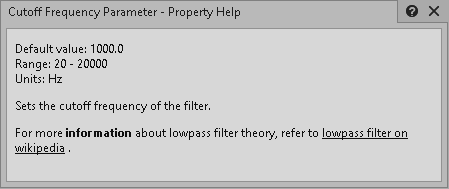

# 构建插件属性文档

|  |
| --- |
| Wwise SDK 2025.1.4 - Windows |

构建插件属性文档

在创建新的插件时，Wwise Property Help 视图方便告知用户有关插件属性的信息：含义、默认值、取值范围、单位和用法。Property Help 视图会针对 Wwise 内最后选中的属性来显示帮助条目。 若插件提供与特定属性对应的文档文件，则每次选中该属性都会自动显示其帮助信息。

在 Wwise 目录内，可在 `<Wwise>/Authoring/Data/Plugins/<plugin_name>/Html/<language>/PropertyName.html` 中找到属性文档文件。

`Html` 文件夹内包含多个面向不同语言的属性帮助文件。若要更改 Wwise 中显示的文档语言，请在菜单栏中依次单击 **Help > Documentation Language**。支持的语言代码 (`<language>`) 如下：

| en | English |
| --- | --- |
| ko | Korean |
| zh | Mandarin |
| ja | Japanese |

# 构建属性帮助文件

属性帮助文档源文件必须存放在 `<PluginProject>/WwisePlugin/res/Md/<language>/PropertyName.md` 中（每个文件对应一项属性）。

这些文件中的文本采用 Markdown 格式，稍后会由 `wp.py` 开发工具转换为 HTML。有关开发工具的更多详细信息，请参阅 [使用开发工具](effectplugin_tools.html) 章节。 所有 Markdown 样式（如粗体强调、列表块或超链接）都可用于设置帮助消息的格式。

|  |  |
| --- | --- |
|  | **备注:** 若要构建属性帮助文档，请安装以下两个 Python 依赖项： pip install markdown  pip install jinja2 |

使用 `wp.py` 为插件构建 Wwise Property Help 文件：

python "%WWISEROOT%/Scripts/Build/Plugins/wp.py" build Documentation

此命令将执行由 Markdown 到 HTML 的转换，并把生成的文件保存到相应的 Wwise 目录下。

# 示例

下面的例子展示了 Cutoff Frequency Parameter 属性的 Help 文件及 Wwise 的 Property Help 视图中显示的结果。

```
##Cutoff Frequency Parameter

Set the cutoff frequency of the filter.

For more **information** about lowpass filter theory, refer to [lowpass filter on wikipedia](https://en.wikipedia.org/wiki/Low-pass_filter).

Range: 20 - 20000 <br/>
Units: Hz <br/>
```

