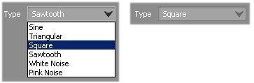
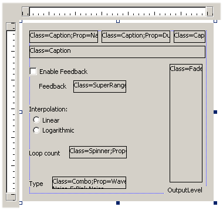
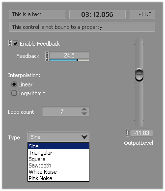

# Wwise 插件对话框参考文档

|  |
| --- |
| Wwise SDK 2025.1.4 - Windows |

Wwise 插件对话框参考文档

Windows DLL 插件可包含与用户编辑插件属性时 Wwise 中所显示对话框相关的资源。这同时适用于源插件和效果器插件。

此页面专门介绍有关这些对话框资源的详细信息，比如对话框的预期尺寸、如何在对话框中加入各种控件以及如何将这些控件与插件的属性绑定。

有关详细信息，请参阅以下章节：

- [如何为插件创建对话框资源](wwiseplugin_dialog_guide.html#wwiseplugin_dialog_guide_creating)
- [对话框尺寸](wwiseplugin_dialog_guide.html#wwiseplugin_dialog_guide_dimensions)
- [利用Wwise检索对话框资源](wwiseplugin_dialog_guide.html#wwiseplugin_dialog_guide_getdialog)
- [如何向对话框中添加常规控件](wwiseplugin_dialog_guide.html#wwiseplugin_dialog_guide_controls_regular)
- [如何向对话框中添加 Wwise 属性控件](wwiseplugin_dialog_guide.html#wwiseplugin_dialog_guide_controls_wwise)
- [示例](wwiseplugin_dialog_guide.html#wwiseplugin_dialog_guide_example)
- [测试插件对话框](wwiseplugin_dialog_guide.html#wwiseplugin_dialog_guide_testing)
- [故障排除](wwiseplugin_dialog_guide.html#wwiseplugin_dialog_guide_troubleshooting)

# 如何为插件创建对话框资源

在 [Microsoft](namespace_microsoft.html) 开发环境中，使用对话框编辑器将对话框资源添加到 Wwise 插件 DLL 工程中。然后您可以使用 Toolbox（工具箱）窗口的 Dialog Editor（对话框编辑器）部分中的工具添加控件。有关更多详细信息，请参阅 [Creating Resource Files for Your Plug-in](effectplugin_tools_resource_file.html) 章节。

# 对话框尺寸

Effect plug-in（效果器插件）可在 Wwise 中通过 Effect Editor 的 Effect Settings 选项卡编辑。Source plug-in（源插件）既可在 Contents Editor 中编辑，也可在 Property Editor 中编辑。

Effect Editor 和 Property Editor 中显示的对话框可能很大，而 Contents Editor 中显示的对话框受到限制，尺寸较小，以便能轻松地融入视图中。

|  |  |
| --- | --- |
|  | **备注:** 如 [获取对话框](plugin_frontend_windows.html#wwiseplugin_dialogcode) 中所述，AK::Wwise::Plugin::GUIWindows::GetDialog() 和 [AK::Wwise::Plugin::GUIWindows::WindowProc()](class_a_k_1_1_wwise_1_1_plugin_1_1_v1_1_1_g_u_i_windows_a8ea33835cc026463f2f64b4327f89b17.html#a8ea33835cc026463f2f64b4327f89b17 "Window message handler for dialogs.") 应检查 AK::Wwise::Plugin::GUIWindows::eDialog 参数以了解调用的是哪个对话框。 |

## Property Editor 和 Effect Editor 对话框的尺寸

对于源插件的 Property Editor 对话框和源插件/效果器插件的 Effect Editor 对话框，建议宽度不超过 525 个对话框单位，高度不超过 325 个单位。对话框单位的值可在 Visual Studio 的 Resource Editor 中找到。

注意，对话框单位将依据以下因数换算为不同的像素大小：

- **Windows 显示设置**：文本、应用程序及其他相关项的大小。通常设在 100% ~ 200% 之间。Windows 可能会根据监视器的大小和分辨率自动设置该值。
- **Wwise 用户界面字体大小**：在 User Preferences 对话框中定义。字体大小可介于 8 ~ 10 之间。字体越大，对话框越大。

最好在各种不同的设备上都试用一下插件，确保编辑器与较小的屏幕（如笔记本屏幕）相称。

|  |  |
| --- | --- |
|  | **注意:** 对话框如果太大会被裁剪，用户可能无法看到全部控件。 |

|  |  |
| --- | --- |
|  | **技巧:** 在 [Microsoft](namespace_microsoft.html) 开发环境对话框编辑器中选中您的对话框时，状态栏最右侧会显示对话框的尺寸，以对话框单位表示。 |

## Content Editor对话框的尺寸

对于源插件，Content Editor 对话框最大宽度应为 194 个对话框单位，高度正好为 13 个单元。

|  |  |
| --- | --- |
|  | **注意:** 对话框如果太大会被裁剪，用户可能无法看到全部控件。 |

|  |  |
| --- | --- |
|  | **技巧:** 在 [Microsoft](namespace_microsoft.html) 开发环境对话框编辑器中选中您的对话框时，状态栏最右侧会显示对话框的尺寸，以对话框单位表示。 |

# 利用Wwise检索对话框资源

请参阅 [获取对话框](plugin_frontend_windows.html#wwiseplugin_dialogcode) 了解有关 [AK::Wwise::Plugin::GUIWindows::GetResourceHandle()](class_a_k_1_1_wwise_1_1_plugin_1_1_v1_1_1_g_u_i_windows_a400dc71bed3f216d4c5afe2297474de1.html#a400dc71bed3f216d4c5afe2297474de1 "Retrieves the plug-in's HINSTANCE used for loading resources.") 和 [AK::Wwise::Plugin::GUIWindows::GetDialog()](class_a_k_1_1_wwise_1_1_plugin_1_1_v1_1_1_g_u_i_windows_a21b81136769b185c244ada93e6767f14.html#a21b81136769b185c244ada93e6767f14 "Retrieves the plug-in dialog parameters.") 的信息，它们是您查找对话框资源而必须为 Wwise 实现的功能。

# 如何向对话框中添加常规控件

您可以直接在 [Microsoft](namespace_microsoft.html) 开发环境 Dialog Editor 中使用 Toolbox 的 Dialog Editor 版块的相应工具添加常规控件，例如静态控件、编辑控件、复选框、按钮、单选按钮和组合控件。Wwise 将自动细分这些控件，使它们与应用程序中其他位置的相似控件有相同的外观。

|  |  |
| --- | --- |
|  | **备注:** 一个明显的例外是下拉框/组合框控件不会自动细分。如果您在对话框中需要下拉控件，则应使用 `Combo` 自定义控件。请参阅 [“Class”控件属性](wwiseplugin_dialog_guide.html#wwiseplugin_dialog_guide_controls_wwise_class) 了解详情。 |

|  |  |
| --- | --- |
|  | **备注:** 当属性支持 RTPC 时，将自动显示控件绑定到该属性的 RTPC 小组件。请参阅 [属性要素](plugin_xml_properties.html#wwiseplugin_xml_properties_tag) 了解有关如何对属性启用 RTPC 的详情。 |

## 如何将常规控件绑定到属性

复选框和单选按钮可关联到您的插件属性，以便它们在用户操作控件时进行更新（反之亦然），而无需您添加更多代码。

为此，必须使用 [AK/Wwise/Plugin.h](_plugin_8h.html "Wwise Authoring Plug-ins - Main include file.") 中定义的宏来创建“填充表”：

[AK\_WWISE\_PLUGIN\_GUI\_WINDOWS\_BEGIN\_POPULATE\_TABLE](_g_u_i_windows_8h_ace7e697c1d8a310c9794cf05ce8ce1d8.html#ace7e697c1d8a310c9794cf05ce8ce1d8)(PropertyTable)

[AK\_WWISE\_PLUGIN\_GUI\_WINDOWS\_POP\_ITEM](_g_u_i_windows_8h_af6140142c9fe6ff132aee5ad0fde1caf.html#af6140142c9fe6ff132aee5ad0fde1caf)(IDC\_CHECK\_SWEEPFREQ, szSweepFreq)

[AK\_WWISE\_PLUGIN\_GUI\_WINDOWS\_POP\_ITEM](_g_u_i_windows_8h_af6140142c9fe6ff132aee5ad0fde1caf.html#af6140142c9fe6ff132aee5ad0fde1caf)(IDC\_RADIO\_FREQSWEEPLIN, szSweepFreqType)

(... insert other items here...)

[AK\_WWISE\_PLUGIN\_GUI\_WINDOWS\_END\_POPULATE\_TABLE](_g_u_i_windows_8h_a286a575e82a4a1b002ff737b186d4c76.html#a286a575e82a4a1b002ff737b186d4c76)()

从 [AK\_WWISE\_PLUGIN\_GUI\_WINDOWS\_BEGIN\_POPULATE\_TABLE()](_g_u_i_windows_8h_ace7e697c1d8a310c9794cf05ce8ce1d8.html#ace7e697c1d8a310c9794cf05ce8ce1d8 "Starts a new property-control bindings table.") 宏入手，它有一个参数，即表格的标识符。该标识符必须是一个有效的 C++ 标识符，在其所属范围内不能有重名。它是您在 [AK::Wwise::Plugin::GUIWindows::GetDialog()](class_a_k_1_1_wwise_1_1_plugin_1_1_v1_1_1_g_u_i_windows_a21b81136769b185c244ada93e6767f14.html#a21b81136769b185c244ada93e6767f14 "Retrieves the plug-in dialog parameters.") 中设置填充表 *out* 参数时将使用的同一标识符（请参阅 [获取对话框](plugin_frontend_windows.html#wwiseplugin_dialogcode) 了解详情）。

随后可使用 [AK\_WWISE\_PLUGIN\_GUI\_WINDOWS\_POP\_ITEM()](_g_u_i_windows_8h_af6140142c9fe6ff132aee5ad0fde1caf.html#af6140142c9fe6ff132aee5ad0fde1caf "Declares an association between a control and a property within a property-control bindings table.") 宏将控件与属性关联。 每个必须与属性绑定的控件在列表中都要有对应的 [AK\_WWISE\_PLUGIN\_GUI\_WINDOWS\_POP\_ITEM()](_g_u_i_windows_8h_af6140142c9fe6ff132aee5ad0fde1caf.html#af6140142c9fe6ff132aee5ad0fde1caf "Declares an association between a control and a property within a property-control bindings table.") 条目。 此宏的第一个参数是对话框中控件的 ID。 第二个参数为插件 XML 定义文件中所定义的属性名称。 有关属性名称的详细信息，请参阅 [属性要素](plugin_xml_properties.html#wwiseplugin_xml_properties_tag) 章节。

复选框可以关联到`bool` 类型的属性。属性值`true` 代表控件已被选定，而属性值`false` 代表控件没有被选定。

单选按钮可关联到`int32` 类型的属性。控件组中的各个单选按钮对应于一个特定值。组中的第一个单选按钮对应于值 0，第二个对应于值 1，第三个对应于 2，以此类推。要使单选按钮正常工作，必须小心设置两个属性：单选按钮的Tab键顺序和控件组。

要在 [Microsoft](namespace_microsoft.html) 开发环境对话框编辑器中编辑对话框时查看 Tab 键顺序，打开 Format 菜单，然后选择 Tab Order。各个控件旁边会出现对应于 Tab 键顺序的编号。要更改顺序，单击应设为第一的控件，然后是应设为第二的控件，以此类推，直至按需要设置好所有控件的顺序。完成后，返回 Format 菜单，并重新选择 Tab Order 以关闭该选项。

要将控件组合在一起，在 [Microsoft](namespace_microsoft.html) 开发环境的 Properties 窗口中将第一个单选按钮的*Group* 属性设为*True* 。将该组其他单选按钮的*Group* 属性设为*False* 。

请参阅 [Microsoft](namespace_microsoft.html) 开发环境文档了解有关 Tab 键顺序、控件组和对话框编辑器的更多一般信息。

在定义所有 [AK\_WWISE\_PLUGIN\_GUI\_WINDOWS\_POP\_ITEM()](_g_u_i_windows_8h_af6140142c9fe6ff132aee5ad0fde1caf.html#af6140142c9fe6ff132aee5ad0fde1caf "Declares an association between a control and a property within a property-control bindings table.") 条目后，使用 [AK\_WWISE\_PLUGIN\_GUI\_WINDOWS\_END\_POPULATE\_TABLE()](_g_u_i_windows_8h_a286a575e82a4a1b002ff737b186d4c76.html#a286a575e82a4a1b002ff737b186d4c76 "Ends the declaration of a property-control bindings table.") 宏结束填充表的声明。

|  |  |
| --- | --- |
|  | **技巧:** 您可以将此声明放置在 [AK::Wwise::Plugin::GUIWindows::GetDialog()](class_a_k_1_1_wwise_1_1_plugin_1_1_v1_1_1_g_u_i_windows_a21b81136769b185c244ada93e6767f14.html#a21b81136769b185c244ada93e6767f14 "Retrieves the plug-in dialog parameters.") 的同一 CPP 文件夹中，它是您唯一需要访问的位置。 |

# 如何向对话框中添加 Wwise 属性控件

要将 Wwise 对话框控件（例如标题 、滑块和推子）集成到对话框中，使用标题文本经过特殊编码的静态文本控件占位符。此文本需要具有以下格式：

Class=[Classname];Prop=[Propname];[Attribute1]=[Value1];[Attribute2]=[Value2];[...]

|  |  |
| --- | --- |
|  | **技巧:** 为了更加便于查看对话框控件的布局，可在 [Microsoft](namespace_microsoft.html) 开发环境对话框编辑器中将静态占位符属性的*Border* 设为*True* 。请参阅 [示例](wwiseplugin_dialog_guide.html#wwiseplugin_dialog_guide_example) 了解示例。 |

|  |  |
| --- | --- |
|  | **备注:** 当属性支持 RTPC 时，将自动显示控件绑定到该属性的 RTPC 小组件。请参阅 [属性要素](plugin_xml_properties.html#wwiseplugin_xml_properties_tag) 了解有关如何对属性启用 RTPC 的详情。 |

下面我们将详细地查看这些属性：

## “Class”控件属性

`Class` 属性是必备的。它用于标识将插入对话框中来替换静态占位符的控件类型。此属性采用以下格式：

Class=[Classname]

其中*[Classname]*可以是以下某一个：

- `Caption` ：只读文本显示   

  

    
  资源中的静态控件高度应正好为 13 个单位，宽度足以容纳它可能包含的最长文本。
- `Combo` ：下拉列表   

  

    
  资源中的静态控件高度应正好为 13 个单位，宽度足以容纳它可能包含的最长文本。
- `Edit` ：可编辑的文本   
    
  资源中的静态控件高度应正好为 13 个单位，宽度足以容纳它可能包含的最长文本。“字符串”类型的属性应绑定到此控件。
- `Fader` ：音量推子   

  
- `Spinner` ：带微调控件的整型数值编辑器  

  

    
  资源中的静态控件高度应正好为 13 个单位，宽度足以容纳它可能包含的最大值。
- `SuperRange` ：带横向滑块的数值编辑器   

  

    
  资源中的静态控件高度应正好为 13 个单位，宽度足以容纳它可能包含的最大值。

|  |  |
| --- | --- |
|  | **备注:** 其中各个控件支持各种可选属性，以调整它们的行为来满足各个属性的特定需求。请参阅 [其他控件属性](wwiseplugin_dialog_guide.html#wwiseplugin_dialog_guide_controls_wwise_attributes) 了解详情。 |

## “Prop”控件属性

`Prop` 属性可让您将控件绑定到插件属性之一。此属性采用以下格式：

Prop=[Propname]

其中*[PropName]*指定该控件应该绑定到的属性的名称。该名称为插件 XML 定义文件中的指定名称（请参阅 [属性要素](plugin_xml_properties.html#wwiseplugin_xml_properties_tag) 了解详情）。

此属性为可选。如果不指定此属性，则仍会创建此控件，但它不会绑定到某个属性。例如您可以使用`Caption` 控件来显示您使用`SetWindowText()` 在控件上设置的某个文本。

|  |  |
| --- | --- |
|  | **注意:** 绑定到属性的控件可以根据其属性值来显示文本。绝对不要在这些控件上具体设置窗口文本。 |

|  |  |
| --- | --- |
|  | **注意:** 在创建*不* 绑定到属性的控件时，确保保留控件文本原样，直至完全*创建* 对话框。如果更改控件文本过早，例如在 [AK::Wwise::Plugin::GUIWindows::WindowProc()](class_a_k_1_1_wwise_1_1_plugin_1_1_v1_1_1_g_u_i_windows_a8ea33835cc026463f2f64b4327f89b17.html#a8ea33835cc026463f2f64b4327f89b17 "Window message handler for dialogs.") 中处理`WM_INITDIALOG` 消息，资源文本中设置的`Class` 属性在需要时则将不可用，Wwise 无法创建相应的控件。 |

## 其他控件属性

除上述`Class` 和`Prop` 属性外，某些控件还支持其他其他属性，这些属性可让您微调控件来满足各个属性的需求。

**Decimals**

格式：

Decimals=[Number]

其中 *[Number]* 是小数点后显示的位数。此值必须是非负整数。如果设为 0，则不会显示小数和小数点。

当以下类型的控件绑定到数值属性时，可对这些控件使用此属性：

- `Caption`
- `Fader`
- `SuperRange`

|  |  |
| --- | --- |
|  | **警告:** 此属性将会废除。必须在插件描述 XML 中的 /PluginModule/{EffectPlugin or SourcePlugin}/Properties/Property/UserInterface[Decimals] 处定义它。请参阅 [UserInterface](plugin_xml_properties.html#wwiseplugin_xml_userinterface) 了解详情。 |

**Min**

格式：

[Min](namespace_a_k_1_1_speaker_volumes_1_1_vector_a8661f38fe4c56e23ffd967dc427bcde2.html#a8661f38fe4c56e23ffd967dc427bcde2)=[Number]

其中*[Number]*是在此控件中可以输入的最小值。此值可以是整数或小数，具体取决于控件所绑定的属性类型。

当以下类型的控件绑定到数值属性时，可对这些控件使用此属性：

- `Fader`
- `SuperRange`

|  |  |
| --- | --- |
|  | **警告:** 此属性将会废除。必须在 /PluginModule/{EffectPlugin 或 SourcePlugin}/Properties/Property/Restrictions/ValueRestriction/Range/Min 处的插件描述 XML 中定义它。请参阅 [UserInterface](plugin_xml_properties.html#wwiseplugin_xml_userinterface) 了解详情。 |

**Max**

格式：

[Max](namespace_a_k_1_1_speaker_volumes_1_1_vector_a5cf5edb6e0760f5bd0ef29d98c322d9c.html#a5cf5edb6e0760f5bd0ef29d98c322d9c)=[Number]

其中 *[Number]* 是此控件中可以输入的最大值。此值可以是整数或小数，具体取决于控件所绑定的属性类型。

当以下类型的控件绑定到数值属性时，可对这些控件使用此属性：

- `Fader`
- `SuperRange`

|  |  |
| --- | --- |
|  | **警告:** 此属性将会废除。必须在 /PluginModule/{EffectPlugin or SourcePlugin}/Properties/Property/Restrictions/ValueRestriction/Range/Max 处的插件描述 XML 中定义它。请参阅 [UserInterface](plugin_xml_properties.html#wwiseplugin_xml_userinterface) 了解详情。 |

**Mid**

格式：

Mid=[Number]

其中*[Number]*是显示在`SuperRange` 控件底部的小滑块的锚固点。此值可以是整数或小数，具体取决于控件所绑定的属性类型。

此属性可以用于以下类型的控件：

- `SuperRange`

|  |  |
| --- | --- |
|  | **警告:** 此属性将会废除。必须在 /PluginModule/{EffectPlugin or SourcePlugin}/Properties/Property/UserInterface[Mid] 处的插件描述 XML 中定义它。请参阅 [UserInterface](plugin_xml_properties.html#wwiseplugin_xml_userinterface) 了解详情。 |

**Step**

格式：

Step=[Number]

其中 *[Number]* 是移动滑块时的数值变化量。此值可以是整数或小数，具体取决于控件所绑定的属性类型。

当以下类型的控件绑定到数值属性时，可对这些控件使用此属性：

- `Fader`
- `SuperRange`

|  |  |
| --- | --- |
|  | **警告:** 此属性将会废除。必须在 /PluginModule/{EffectPlugin or SourcePlugin}/Properties/Property/UserInterface[Step] 处的插件描述 XML 中定义它。请参阅 [UserInterface](plugin_xml_properties.html#wwiseplugin_xml_userinterface) 了解详情。 |

**Fine**

格式：

Fine=[Number]

其中 *[Number]* 是在按住 SHIFT 键的同时移动滑块而发生的数值变化量。此值可以是整数或小数，具体取决于控件所绑定的属性类型。

当以下类型的控件绑定到数值属性时，可对这些控件使用此属性：

- `Fader`
- `SuperRange`

|  |  |
| --- | --- |
|  | **警告:** 此属性将会废除。必须在 /PluginModule/{EffectPlugin or SourcePlugin}/Properties/Property/UserInterface[Fine] 处的插件描述 XML 中定义它。请参阅 [UserInterface](plugin_xml_properties.html#wwiseplugin_xml_userinterface) 了解详情。 |

**UIMin**

格式：

UIMin=[Number]

其中 *[Number]* 是通过使用滑块初始可设置的最小值。如果此值大于使用`Min` 属性设置的值，则用户可通过输入一个小于此属性指定值的值来强制将它设为更小值，从而扩大控制范围。

此值可以是整数或小数，具体取决于控件所绑定的属性类型。

|  |  |
| --- | --- |
|  | **技巧:** 此属性的目的是使控件滑块的初始值域更加适用于属性值域非常大的情形。如果某个属性具有较大的理论范围，但用户一般使用较小的范围，则使用 `Min/Max 属性设置` *实际范围，并使用* `UIMin/UIMax 属性设置滑块的初始范围。` |

当以下类型的控件绑定到数值属性时，可对这些控件使用此属性：

- `SuperRange`

|  |  |
| --- | --- |
|  | **警告:** 此属性将会废除。必须在 /PluginModule/{EffectPlugin或SourcePlugin}/Properties/Property/UserInterface[UIMin] 处插件描述 XML 中定义它。请参阅 [UserInterface](plugin_xml_properties.html#wwiseplugin_xml_userinterface) 了解详情。 |

**UIMax**

格式：

UIMax=[Number]

其中 *[Number]* 是通过使用滑块初始可设置的最大值。如果此值小于使用`Max` 属性指定的值，则用户可通过输入一个比此属性指定值更大的值来强制将它设为更大值，从而扩大控制范围。

此值可以是整数或小数，具体取决于控件所绑定的属性类型。

|  |  |
| --- | --- |
|  | **技巧:** 此属性的目的是使控件滑块的初始值域更加适用于属性值域非常大的情形。如果某个属性具有较大的理论范围，但用户一般使用较小的范围，则使用 `Min/Max 属性设置` *实际范围，并使用* `UIMin/UIMax 属性设置滑块的初始范围。` |

当以下类型的控件绑定到数值属性时，可对这些控件使用此属性：

- `SuperRange`

|  |  |
| --- | --- |
|  | **警告:** 此属性将会废除。必须在 /PluginModule/{EffectPlugin or SourcePlugin}/Properties/Property/UserInterface[UIMax] 处的插件描述 XML 中定义。请参阅 [UserInterface](plugin_xml_properties.html#wwiseplugin_xml_userinterface) 了解详情。 |

**Options**

格式：

Options=[Value1]:[Text1],[Value2]:[Text2],...,[ValueN]:[TextN]

其中 *[ValueX]* 是数值属性的一个可能值，*[TextX]* 是控件中与该值相关联的文本。此字符串包含多对“value:text”，各对之间用逗号隔开，每对中包含一个数值和用冒号隔开的相关文本。例如：

- 布尔值属性："0:Off,1:On"
- 视为枚举的数值属性："0:Low Pass,1:High Pass,2:Band Pass"

|  |  |
| --- | --- |
|  | **备注:** 对于`bool` 属性，值/文本组的值一侧使用0代表 `false` ，1代表 `true` 。 |

此属性可以用于以下类型的控件：

- `Combo`

它用于定义下拉列表的内容。Wwise用户使用`Combo` 控件只可设置`Options` 属性中的值。

|  |  |
| --- | --- |
|  | **备注:** `Options` 属性的格式与 [AK::Wwise::Plugin::PropertyDisplayName::DisplayNamesForPropValues()](class_a_k_1_1_wwise_1_1_plugin_1_1_v1_1_1_property_display_name_a2d1788ed6ead7d8d9d38b16ff0c868a9.html#a2d1788ed6ead7d8d9d38b16ff0c868a9 "Get the user-friendly names of possible values for the specified property.") 方法的格式相同。请参阅 [属性显示名称和数值](plugin_backend_model.html#wwiseplugin_displaynames) 了解详情。 |

|  |  |
| --- | --- |
|  | **警告:** 此属性将会废除。必须在 /PluginModule/{EffectPlugin or SourcePlugin}/Properties/Property/Restrictions/ValueRestriction/Enumeration/Value[DisplayName] 处的插件描述 XML 中为各个枚举值定义这些选项。请参阅 [UserInterface](plugin_xml_properties.html#wwiseplugin_xml_userinterface) 了解详情。 |

**SliderType**

格式：

SliderType=[integer value]

请参阅 [UserInterface](plugin_xml_properties.html#wwiseplugin_xml_userinterface) 了解 SliderType 值

当以下类型的控件绑定到数值属性时，可对这些控件使用此属性：

- `Fader`
- `SuperRange`

|  |  |
| --- | --- |
|  | **警告:** 此属性将会废除。必须在 /PluginModule/{EffectPlugin or SourcePlugin}/Properties/Property/UserInterface[SliderType] 处的插件描述 XML 中定义它。请参阅 [UserInterface](plugin_xml_properties.html#wwiseplugin_xml_userinterface) 了解详情。 |

**Align**

格式：

Align=[Left|Center|Right]

此属性可用于以下类型的控件：

- `Caption`
- `Edit`

它用于对齐控件显示的文件。

**FontSize**

格式：

FontSize=[0|1]

其中数字代表：

- 0（默认值）：标准字体
- 1：大字体

此属性可以用于以下类型的控件：

- `Caption`

它用于指定控件所显示文本的字体大小。

**TimeDisplay**

格式：

TimeDisplay=[0|1|2]

其中数字代表：

- 0（默认值）：无特殊时间格式。
- 1：使用 MM:SS.mmm（分钟、秒钟、毫秒）格式。最小值为 -59:59.999，最大值为 59:59.999。
- 2：使用 HH:MM:SS.mmm（小时、分钟、秒钟、毫秒）格式。在这种情况下无最小值或最大值。

当以下类型的控件绑定到代表毫秒的`int32` 类型属性时，此属性可用于这些控件：

- `Caption`

请参阅 [属性要素](plugin_xml_properties.html#wwiseplugin_xml_properties_tag) 了解有关属性类型的详情。

# 示例

以下是 [Microsoft](namespace_microsoft.html) 开发环境对话框编辑器中所示的效果器插件对话框资源示例：

以下是对话框资源代码，准确地显示了用于对话框中各种静态止位符的标题文本：

IDD\_MYPLUGIN DIALOGEX 0, 0, 217, 187

STYLE DS\_SETFONT | DS\_FIXEDSYS | WS\_CHILD

FONT 8, "MS Shell Dlg", 0, 0, 0x0

BEGIN

LTEXT "Class=Caption;Prop=Name",IDC\_NAME,8,8,78,13,WS\_BORDER

LTEXT "Class=Caption;Prop=Duration;Align=1;TimeDisplay=1;FontSize=1",

IDC\_DURATION,90,8,78,13,WS\_BORDER

LTEXT "Class=Caption;Prop=OutputLevel;Align=2;Decimals=1",

IDC\_OUTPUTLEVEL\_CAPTION,172,8,36,13,WS\_BORDER

LTEXT "Class=Caption",IDC\_CUSTOM\_CAPTION,8,24,200,13,WS\_BORDER

CONTROL "Enable Feedback",IDC\_CHECK\_FEEDBACKENABLED,"Button",

BS\_AUTOCHECKBOX | WS\_TABSTOP,8,46,70,10

LTEXT "Feedback",IDC\_STATIC\_FEEDBACK,19,62,32,8

LTEXT "Class=SuperRange;Prop=Feedback;Min=0;Mid=0;Max=100;UIMin=0;UIMax=10;Step=0.5;Fine=0.1;Decimals=1",

IDC\_RANGE\_FEEDBACK,58,60,60,13,WS\_BORDER

LTEXT "Interpolation:",IDC\_INTERPOLATION\_STATIC,8,86,45,8

CONTROL "Linear",IDC\_RADIO\_LINEAR,"Button",BS\_AUTORADIOBUTTON |

WS\_GROUP,11,97,35,10

CONTROL "Logarithmic",IDC\_RADIO\_LOG,"Button",BS\_AUTORADIOBUTTON,

11,108,54,9

LTEXT "Loop count",IDC\_STATIC,8,132,36,8

LTEXT "Class=Spinner;Prop=LoopCount;Min=1;Max=32767",

IDC\_LOOP\_COUNT\_SPINNER,53,129,65,13,WS\_BORDER

LTEXT "Type",IDC\_STATIC,8,164,17,8

LTEXT "Class=Combo;Prop=WaveType;Options=0:Sine,1:Triangular,2:Square,3:Sawtooth,4:White Noise,5:Pink Noise",

IDC\_COMBO\_WAVETYPE,34,161,84,13,WS\_BORDER | WS\_TABSTOP

LTEXT "Class=Fader;SliderType=1;Prop=OutputLevel;Min=-96.3;Max=0;Decimals=2",

IDC\_LEVEL\_FADER,167,43,37,124,WS\_BORDER

CTEXT "OutputLevel",IDC\_VOLUME\_STATIC,161,171,48,8,

SS\_CENTERIMAGE

END

|  |  |
| --- | --- |
|  | **警告:** 此代码示例中的某些属性将会废除：Decimals、Step、Fine、SliderType、Mid、UIMin、UIMax。请参阅 [UserInterface](plugin_xml_properties.html#wwiseplugin_xml_userinterface) 了解详情。 |

在此例中，*Enable Feedback* 复选框和 *Interpolation* 单选按钮需要绑定到属性，因此插件的.cpp文件定义了下表，此表由插件的 [AK::Wwise::Plugin::GUIWindows::GetDialog()](class_a_k_1_1_wwise_1_1_plugin_1_1_v1_1_1_g_u_i_windows_a21b81136769b185c244ada93e6767f14.html#a21b81136769b185c244ada93e6767f14 "Retrieves the plug-in dialog parameters.") 返回：

constexpr auto szFeedbackEnabled = u8"FeedbackEnabled";

constexpr auto szInterpolation = u8"Interpolation";

// 没有将静态文本 UI 控件绑定到属性上

[AK\_WWISE\_PLUGIN\_GUI\_WINDOWS\_BEGIN\_POPULATE\_TABLE](_g_u_i_windows_8h_ace7e697c1d8a310c9794cf05ce8ce1d8.html#ace7e697c1d8a310c9794cf05ce8ce1d8)(MyPopTable)

[AK\_WWISE\_PLUGIN\_GUI\_WINDOWS\_POP\_ITEM](_g_u_i_windows_8h_af6140142c9fe6ff132aee5ad0fde1caf.html#af6140142c9fe6ff132aee5ad0fde1caf)(IDC\_CHECK\_FEEDBACKENABLED, szFeedbackEnabled)

[AK\_WWISE\_PLUGIN\_GUI\_WINDOWS\_POP\_ITEM](_g_u_i_windows_8h_af6140142c9fe6ff132aee5ad0fde1caf.html#af6140142c9fe6ff132aee5ad0fde1caf)(IDC\_RADIO\_LINEAR, szInterpolation)

[AK\_WWISE\_PLUGIN\_GUI\_WINDOWS\_END\_POPULATE\_TABLE](_g_u_i_windows_8h_a286a575e82a4a1b002ff737b186d4c76.html#a286a575e82a4a1b002ff737b186d4c76)()

(...)

bool MyPlugin::GetDialog(

[AK::Wwise::Plugin::eDialog](namespace_a_k_1_1_wwise_1_1_plugin_a5a9328b141630d1de228c92e81e9034d.html#a5a9328b141630d1de228c92e81e9034d) in\_eDialog,

UINT& out\_uiDialogID,

PopulateTableItem\*& out\_pTable) const

{

if (in\_eDialog == [SettingsDialog](namespace_a_k_1_1_wwise_1_1_plugin_a5a9328b141630d1de228c92e81e9034d.html#a5a9328b141630d1de228c92e81e9034da70f74e61c5e7bef5d95559c73c9978cc))

{

out\_uiDialogID = IDD\_DELAY\_BIG;

out\_pTable = MyPopTable;

return true;

}

return false;

}

最后，下面是 Wwise 用户在 Effect Editor 中可见到的对话框：

# 测试插件对话框

## Effect Editor 对话框（仅限于效果器插件）

要在 Wwise 中查看对话框：

1. 访问 Views 菜单，并选择 Effect Editor
2. 在 Effect 下拉列表中，选择您的效果器插件。如果插件没有出现在列表中，则请参阅 [Wwise 源插件和效果器插件故障排除指南](plugin_troubleshooting.html) 。

效果器插件的对话框现在应已显示在 Effect Editor 中了。请参阅 Wwise 文档了解有关效果器用法的详情。

## Contents Editor 对话框（仅限源插件）

要在 Wwise 中查看对话框：

1. Right-click on Containers - Default Work Unit then choose New Child > Sound SFX. 此操作将创建新的声音。
2. 双击新声音以检查它
3. 在Contents Editor 中，单击 Add Source 按钮并在列表中选择您的插件。如果插件没有出现在列表中，则请参阅 [Wwise 源插件和效果器插件故障排除指南](plugin_troubleshooting.html) 。

源插件的对话框现在应已显示在 Contents Editor 中。

## Property Editor 对话框（仅限于源插件）

要在 Wwise 中查看对话框：

1. Right-click on Containers - Default Work Unit then choose New Child > Sound SFX. 此操作将创建新的声音。
2. 双击新声音以检查它。
3. 在Contents Editor 中，单击 Add Source 按钮并在列表中选择您的插件。如果插件没有出现在列表中，则请参阅 [Wwise 源插件和效果器插件故障排除指南](plugin_troubleshooting.html) 。
4. 双击针对您的插件所显示的小对话框。

Property Editor 现在应已显示您的插件对话框。

# 故障排除

如果遇到任何问题，请参见 [Wwise 源插件和效果器插件故障排除指南](plugin_troubleshooting.html) 中的帮助。

参见
:   [获取对话框](plugin_frontend_windows.html#wwiseplugin_dialogcode)
:   [资源句柄](plugin_frontend_windows.html#wwise_plugin_frontend_windows_resource)
:   [属性要素](plugin_xml_properties.html#wwiseplugin_xml_properties_tag)
:   [属性显示名称和数值](plugin_backend_model.html#wwiseplugin_displaynames)

[AK.Wwise::Plugin::eDialog](namespace_a_k_1_1_wwise_1_1_plugin_a5a9328b141630d1de228c92e81e9034d.html#a5a9328b141630d1de228c92e81e9034d)

eDialog

**Definition:** [PluginDef.h:138](_plugin_def_8h_source.html#l00137)

[AK::SpeakerVolumes::Vector::Max](namespace_a_k_1_1_speaker_volumes_1_1_vector_a5cf5edb6e0760f5bd0ef29d98c322d9c.html#a5cf5edb6e0760f5bd0ef29d98c322d9c)

AkForceInline void Max(AkReal32 \*in\_pVolumesDst, const AkReal32 \*in\_pVolumesSrc, AkUInt32 in\_uNumChannels)

**Definition:** [AkSpeakerVolumes.h:283](_ak_speaker_volumes_8h_source.html#l00283)

[AK.Wwise::Plugin::SettingsDialog](namespace_a_k_1_1_wwise_1_1_plugin_a5a9328b141630d1de228c92e81e9034d.html#a5a9328b141630d1de228c92e81e9034da70f74e61c5e7bef5d95559c73c9978cc)

@ SettingsDialog

**Definition:** [PluginDef.h:139](_plugin_def_8h_source.html#l00141)

[AK\_WWISE\_PLUGIN\_GUI\_WINDOWS\_END\_POPULATE\_TABLE](_g_u_i_windows_8h_a286a575e82a4a1b002ff737b186d4c76.html#a286a575e82a4a1b002ff737b186d4c76)

#define AK\_WWISE\_PLUGIN\_GUI\_WINDOWS\_END\_POPULATE\_TABLE()

Ends the declaration of a property-control bindings table.

**Definition:** [GUIWindows.h:78](_g_u_i_windows_8h_source.html#l00078)

[AK\_WWISE\_PLUGIN\_GUI\_WINDOWS\_POP\_ITEM](_g_u_i_windows_8h_af6140142c9fe6ff132aee5ad0fde1caf.html#af6140142c9fe6ff132aee5ad0fde1caf)

#define AK\_WWISE\_PLUGIN\_GUI\_WINDOWS\_POP\_ITEM(theID, theProp)

Declares an association between a control and a property within a property-control bindings table.

**Definition:** [GUIWindows.h:68](_g_u_i_windows_8h_source.html#l00068)

[AK\_WWISE\_PLUGIN\_GUI\_WINDOWS\_BEGIN\_POPULATE\_TABLE](_g_u_i_windows_8h_ace7e697c1d8a310c9794cf05ce8ce1d8.html#ace7e697c1d8a310c9794cf05ce8ce1d8)

#define AK\_WWISE\_PLUGIN\_GUI\_WINDOWS\_BEGIN\_POPULATE\_TABLE(theName)

Starts a new property-control bindings table.

**Definition:** [GUIWindows.h:54](_g_u_i_windows_8h_source.html#l00054)

[AK::SpeakerVolumes::Vector::Min](namespace_a_k_1_1_speaker_volumes_1_1_vector_a8661f38fe4c56e23ffd967dc427bcde2.html#a8661f38fe4c56e23ffd967dc427bcde2)

AkForceInline void Min(AkReal32 \*in\_pVolumesDst, const AkReal32 \*in\_pVolumesSrc, AkUInt32 in\_uNumChannels)

**Definition:** [AkSpeakerVolumes.h:291](_ak_speaker_volumes_8h_source.html#l00291)