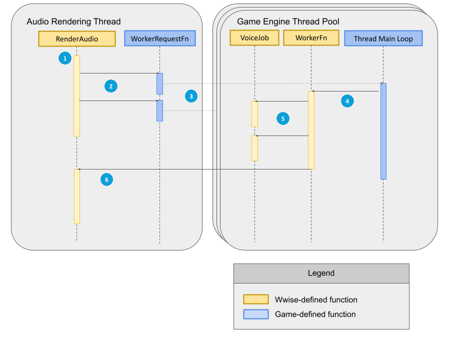

# 优化 CPU 用量

|  |
| --- |
| Wwise SDK 2025.1.4 - Windows |

优化 CPU 用量

# 音频渲染线程

By default, the Wwise Sound Engine does all its command processing and audio rendering in a dedicated thread named `AK::AudioManager`, controlled by the [AkPlatformInitSettings::threadLEngine](struct_ak_platform_init_settings_a85496f71f556e9c59d8af4b423e018ac.html#a85496f71f556e9c59d8af4b423e018ac "Lower engine threading properties") parameters. 调用 `AK::SoundEngine::RenderAudio` 表明游戏帧结束，线程可处理自上次调用 `RenderAudio` 以来的所有 API 命令。

将 `AkInitSettings::bUseLEngineThread` 设为 `false` 会禁用此线程，促使 `RenderAudio` 同步执行命令处理和音频渲染（如有必要）。音频输出的实际速度仍由音频终端控制。若 `RenderAudio` 调用间隔短于 `AkInitSettings::uNumSamplesPerFrame` 和输出采样率限定的缓冲周期，则有些 `RenderAudio` 调用将跳过音频渲染部分。相反，若 `RenderAudio` 调用间隔长于输出缓冲周期，则 `RenderAudio` 可能会一次处理多个缓冲区，导致出现 CPU 用量峰值，并可能最终造成音频卡顿。

启用离线渲染会禁止音频线程异步执行命令处理和音频渲染。每次调用 `RenderAudio` 时渲染的音频数量取决于发给 `AK::SoundEngine::SetOfflineRenderingFrameTime` 的非零正值。零值或负值会强制 `RenderAudio` 精准处理一个音频缓冲区。

|  |  |
| --- | --- |
|  | **注意:** 在禁用音频渲染线程或启用离线渲染时，**不得从** `RenderAudio` 调用方的同一线程同步调用 `AK::SoundEngine::LoadBank` 和 `AK::SoundEngine::UnloadBank` API。因为这些调用可能会阻塞线程，直到有音频缓冲区被渲染来完成 Stop 操作并释放 SoundBank 媒体（只有并发调用 `RenderAudio` 才能实现）。 |

在 [Microsoft](namespace_microsoft.html) 平台上，由于使用了单线程单元 (STA) 并发模型，在将 `AkInitSettings::bUseLEngineThread` 设为 `false` 时，必须从调用 `AK::SoundEngine::RenderAudio` 的同一线程调用 `CoInitializeEx()` 。

# Bank Manager Thread

By default, the Wwise Sound Engine processes bank loading, unloading, and preparation in a dedicated thread named `AK::BankManager`, controlled by the `AkPlatformInitSettings::threadBankManager` parameters. This thread is automatically signalled whenever the client calls a bank operation such as `AK::SoundEngine::LoadBank` or `AK::SoundEngine::PrepareEvent`. The synchronous versions of these calls block until the Bank Manager thread finishes processing the requested operation and then returns the result. The asynchronous versions of these calls put the operation in a queue for the thread to process later. When the Bank Manager thread processes an asynchronous request, it calls the `AkBankCallbackFunc` function to send a notification about the result.

To disable the thread, set `AkInitSettings::bUseSoundBankMgrThread` to `false`. This mode has two effects:

- Synchronous bank operations are executed on the calling thread.
- Asynchronous bank operations are executed after the client calls `AK::SoundEngine::ProcessBanks`.

|  |  |
| --- | --- |
|  | **注意:** In this mode, `AK::SoundEngine::ProcessBanks` and synchronous bank operations are not thread-safe. The Sound Engine expects a single thread to perform these calls. |

`AK::SoundEngine::ProcessBanks` must be called once per game frame after all asynchronous bank operations have been requested.

# 使用 Query API 函数

有些 [AK::SoundEngine::Query](namespace_a_k_1_1_sound_engine_1_1_query.html) 函数可能会导致 CPU 用量突然增加。为了尽量避免浪费 CPU 时间并确保最佳性能，建议遵守以下准侧：

- 在开发版本中使用 Query 函数，避免在生产环境中使用它们。
- 如有必要使用 Query 函数，请在 SoundEngine 全局回调内使用（参见 [AkGlobalCallbackLocation](https://www.audiokinetic.com/library/edge/?source=SDK&id=_ak_callback_8h_ae7a5e30e1402c7cf90d1b47420911676.html)）。比如，若要读取 RTPC 值，可将代码放在 AkGlobalCallbackLocation\_BeginRender 或 AkGlobalCallbackLocation\_EndRender 中。

# 利用 Job Manager 并行执行音频渲染作业

在默认情况下，Wwise 声音引擎会在音频渲染线程上依次执行其各种音频渲染任务（或称作业）。这些作业包括但不限于总线和声部处理任务。

您可以通过指定回调来允许 Wwise 声音引擎在游戏管理的线程上请求预留 CPU 时间以启用对音频作业的并行执行。在游戏通过 `AkJobMgrSettings::fnRequestJobWorker` 提供对此回调的实现时，会在 Wwise 声音引擎中启用并行执行。

|  |  |
| --- | --- |
|  | **备注:** 在启动并行作业执行时，并行作业工作线程会生成部分 [AK::SoundEngine](namespace_a_k_1_1_sound_engine.html) 回调。有些插件可能不支持并行执行。 |

要理解声音引擎的 Job Manager 的工作机制，需先了解两个重要回调之间的区别：

1. **工作请求函数**由*游戏引擎*定义并由 *Wwise 声音引擎*调用。
2. **工作函数**由 *Wwise 声音引擎*定义并由*游戏引擎*调用。

|  |  |
| --- | --- |
|  | **备注:** Wwise 声音引擎预计对于每个工作请求只会执行一次对**工作函数**的调用。比如，若调用**工作请求函数**一次来请求执行三项 `AkJobType_AudioProcessing` 类型的工作，然后再次调用来请求执行两项 `AkJobType_Generic` 类型的工作，则声音引擎预计游戏会针对 `AkJobType_AudioProcessing` 调用**工作函数**三次，并针对 `AkJobType_Generic` 调用两次。这些调用可从不同的线程按照任意顺序（依次或同时）发布。 |

在定义**工作请求函数**后，音频渲染线程会按照如下方式执行：

图示 – 工作执行顺序

1. 音频渲染线程识别可在多个线程上执行的作业（如声部或总线处理）。
2. 音频渲染线程调用游戏的**工作请求函数**来请求在另一线程上预留 CPU 时间。在此步骤中，游戏引擎会接收所要调用的**工作函数**的地址。
3. 游戏引擎在其线程池上对请求进行调度。这时会相应地唤醒一些工作线程。
4. 游戏的工作线程调用步骤 2 中由声音引擎提供的**工作函数**。
5. 每次调用**工作函数**至少执行一项音频渲染作业。如果有的话，可以执行更多的音频渲染作业。
6. 在执行完所有要求的作业后，音频渲染线程继续进行处理。

此流程可在一个音频渲染过程中重复多次，音频渲染线程会尝试执行尽可能多的任务。比如，在渲染总线通路图时，一旦完成对所有输入的处理，就会请求为给定总线预留处理时间，并且可独立于其他总线来运行。藉此，Job Manager 可确保将吞吐量最大化。

|  |  |
| --- | --- |
|  | **备注:** **工作请求函数**可从任何执行声音引擎代码的线程调用，而且*必须*以不影响线程安全的情况下运行。 |

## 与游戏引擎的现有 Existing Job Scheduler 集成

Wwise 声音引擎的 Job Manager 可与现有作业调度程序结合使用来实现协同多任务处理。对于已经有作业调度程序的游戏引擎，在使用**工作请求函数**时，要确保在其现有作业系统内调度**工作函数**的执行。

在调用**工作函数**时，游戏引擎的作业调度程序可指定超时时限（毫秒）。这样可以避免声音引擎在调用线程上占用太多 CPU 时间。在超过此超时时限时，**工作函数**会停止并在有更多作业可执行时请求执行额外的工作。这样的话，就可在该线程上执行可能拥有更高优先级的其他游戏引擎工作。

|  |  |
| --- | --- |
|  | **备注:** 在延迟执行**工作函数**或限制声音引擎工作执行时间时必须小心，因为这可能会导致出现声部匮乏。在将声音引擎作业集成到现有作业调度程序中时，建议将音频渲染作业视为高优先级工作。 |

对于还没有作业调度程序的游戏引擎，`SDK/samples/SoundEngine/Common/AkJobWorkerMgr.[h,cpp]` 下的 SDK 示例中提供了此类调度程序的实现示例。在此示例的基础上，可以更加清楚地了解如何并行执行音频渲染作业。除此之外，IntegrationDemo 还提供了代码来演示如何将该实现示例集成到实际的终端用户应用程序中。

## 使用 Job Manager 时的最佳做法

下面列出了有关如何有效运用 Job Manager 的一些建议。

1. 在有新的工作请求传入时，不要按需创建线程。在大部分系统上，创建新的线程都会占用很大一部分资源。相较之下，最好在初始化声音引擎之前预先分配预定数量的线程，并在这些线程之间分配工作请求。
2. 只要能并行执行声音引擎作业就行，不要使用过多的工作线程。在有些情况下，所请求工作的开销可能会导致 CPU 时间的浪费，而其本可更加有效地用于其他任务。同样，由于在内存分配器中使用线程本地缓存或在声音引擎中使用其他系统，工作数量的增加可能会导致声音引擎请求的内存总量上升。
3. 在支持执行作业的游戏引擎工作线程上，建议在初始化和终止线程时调用 `AK::MemoryMgr::InitForThread` 和 `AK::MemoryMgr::TermForThread` 以确保正确地初始化和终止线程本地内存资源。另外，建议在运行工作函数后进入非活跃期时调用 `AK::MemoryMgr::TrimForThread` 以释放近期可能不会再使用的线程本地内存资源。
4. 在 CPU 核心数量固定且事先已知的平台上，设置工作线程关联以确保每个线程都在同一 CPU 核心上。确保在执行过程中不会将音频工作指派到多个 CPU 核心，以免在线程迁移到不同核心时刷新 CPU 缓存。
5. 在具有多个 Cluster 或 Core Complexes (CCX) 的系统上，设置线程关联来确保工作线程和音频渲染线程全部都在同一 CCX 上运行，以此提高各个核心之间的缓存一致性。
6. 在具有 Simultaneous Multi-Threading (SMT) 的系统上，设置线程关联来确保在单独的物理核心上运行工作线程而非共用同一核心，以此减少对 CPU 资源的争用。
7. 您可以通过 `AK::SoundEngine::SetJobMgrMaxActiveWorkers` 来在不重新初始化声音引擎的情况下更改最多可发布多少工作请求。藉此，可对游戏运行条件的变化做出动态的响应，或轻松体验和设定多线程工作的不同配置。

您需要参考游戏的其他需求来对上述建议做出权衡。即便不遵从其中的有些建议，Job Manager 仍不失为一种增大声音引擎整体吞吐量的便捷方式。

## 优化 Job Manager 内存用量

“在分配作业时出现内存不足问题”被视为严重故障，因为音频渲染的逻辑流程会被中断并且无法恢复。这可能会导致不符合预期的结果和资源泄漏。

为了避免出现这种情况，Job Manager 会分配内存片。这些内存片会被保留并重复使用，直到声音引擎终止。其中的大部分内存片都在声音引擎初始化期间预先分配。不过，也可根据需要分配其他的内存片。

您可以通过 `AkInitSettings::settingsJobManager` 控制内存片的大小以及初始化时预先分配的内存片数量。

|  |  |
| --- | --- |
|  | **备注:** 若 `AK::MemoryMgr::Malloc` 无法在渲染期间分配新的内存片，Job Manager 会一直尝试进行分配，直到成功为止。若发现声音引擎在内存不足的情况下挂起，请在初始化设置中增大预分配的内存片数。 |