# 新增功能概述 2025.1

|  |
| --- |
| Wwise SDK 2025.1.4 - Windows |

新增功能概述 2025.1

### 目录

- [用户体验](#features_25_1_ue)
  - [Media Pool](#features_25_1_media_pool)
    - [Databases](#features_25_1_db)
    - [Database Settings](#features_25_1_db_settings)
    - [Filters](#features_25_1_filter)
    - [Search](#features_25_1_search)
    - [Results](#features_25_1_results)
    - [Metadata](#features_25_1_metadata)
    - [Transport 属性](#features_25_1_transport)
    - [Audio Preview/Region Selector](#features_25_1_preview)
    - [Similar Sound Search](#features_25_1_similar_sound)
  - [层级结构合并和重命名](#features_25_1_merging)
    - [将 Actor-Mixer Hierarchy 和 Interactive Music Hierarchy 合并到了 Containers 下！](#features_25_1_containers)
    - [将 Actor-Mixer 重命名为了 Property Container！](#features_25_1_prop_container)
    - [将 Master-Mixer Hierarchy 重命名为了 Busses！](#features_25_1_busses)
    - [将 Audio Devices 重命名为了 Devices！](#features_25_1_devices)
    - [工程文件夹结构迁移](#features_25_1_)
  - [Event 限制](#features_25_1_event_limiting)
  - [Mute/Solo RTPC](#features_25_1_rtpc_ms)
  - [Audio File Importer 视图](#features_25_1_importer)
  - [Property Editor 改进](#features_25_1_prop_editor)
    - [大小调节](#features_25_1_resize)
    - [Favorites 默认设置](#features_25_1_fav_defaults)
    - [使用键盘浏览属性](#features_25_1_tab_nav)
    - [可展开 Notes](#features_25_1_notes)
    - [持续显示 Default Editor](#features_25_1_default_edit)
    - [编辑器用法更新](#features_25_1_edit_usabilty)
  - [Multiband Meter](#features_25_1_multiband_meter)
  - [旁链压缩](#features_25_1_sidechaining)
    - [旁链压缩混音](#features_25_1_sidechain_mixes)
    - [Sidechain Send 效果器](#features_25_1_sc_send)
    - [Sidechain Receive 效果器](#features_25_1__sc_receive)
    - [对 Compressor 和 Expander 效果器实施了改进](#features_25_1_comp_expand)
  - [对 Parametric EQ 实施了改进](#features_25_1_para_eq)
  - [External Source – WAV 播放](#features_25_1_exteral_source)
  - [ReadSpeaker speechEngine](#features_25_1_speechengine)
  - [添加了 WAQL 访问器](#features_25_1_waql_additions)
  - [插件单元测试框架](#features_25_1_plugin_unit_test)
- [集成](#features_25_1_integratrions)
  - [Unity Wwise Browser](#features_25_1_unity_browser)
  - [Unreal Dynamic Dialogue](#features_25_1_unreal_dyn_dialogue)
  - [Unreal Packaging 改进](#features_25_1_unreal_package)
  - [Gym 改进](#features_25_1_gym_improv)
- [Spatial Audio：Acoustics](#features_25_1_sa_acoustics)
  - [双通道搁架滤波器 (DSF)](#features_25_1_dsf)
    - [High-Frequency Gain](#features_25_1_hfg)
    - [DSF Emphasis](#features_25_1_dsf_emp)
  - [Project Environmental Curves ShareSet](#features_25_1_project_curves)
  - [Game Object 3D Viewer 更新](#features_25_1_go3dv)
  - [对 Reflect 插件实施了改进](#features_25_1_reflect)
  - [Emitter Clustering（实验功能）](#features_25_1_emitter)
  - [Dynamic Load Balancing](#features_25_1_dlb)
  - [Room Distance Behavior](#features_25_1_rooms)
- [Spatial Audio：3D Audio](#features_25_1_3d_audio)
  - [Recorder (ADM) 插件 – 实验功能](#features_25_1_recorder_adm)
- [声音引擎](#features_25_1_sound_engine)
  - [行为改写](#features_25_1_behavior)
  - [Command Buffer API](#features_25_1_command_buffer)
- [平台支持](#features_25_1_platform)

# 用户体验

## Media Pool

在 Media Pool 视图中，可搜索、组织和选择音频文件来导入到 Wwise 中。这在下载了 Strata 库或使用第三方声音库时特别有用。这些库往往包含大量的文件。这样在查找自己想要的内容时可能会很耗时。为此，可将这些库文件夹添加到 Media Pool 数据库，然后直接在 Wwise 中搜索并试听文件。另外，还可添加筛选器作为搜索条件来进一步优化结果列表。

在找到自己想要的文件后，可在 Media Pool 的 Transport 分区试听。除此之外，还可在试听文件的同时修改播放属性，并在导入文件时选择性地应用这些更改。Media Pool 允许将最终选定内容导入到 Wwise 工程中，并在 Wwise 内的同一视图中完成整个工作流程的操作。在 Wwise 菜单栏中，依次单击 **Project > Media Pool** (Ctrl+P) 来打开视图。

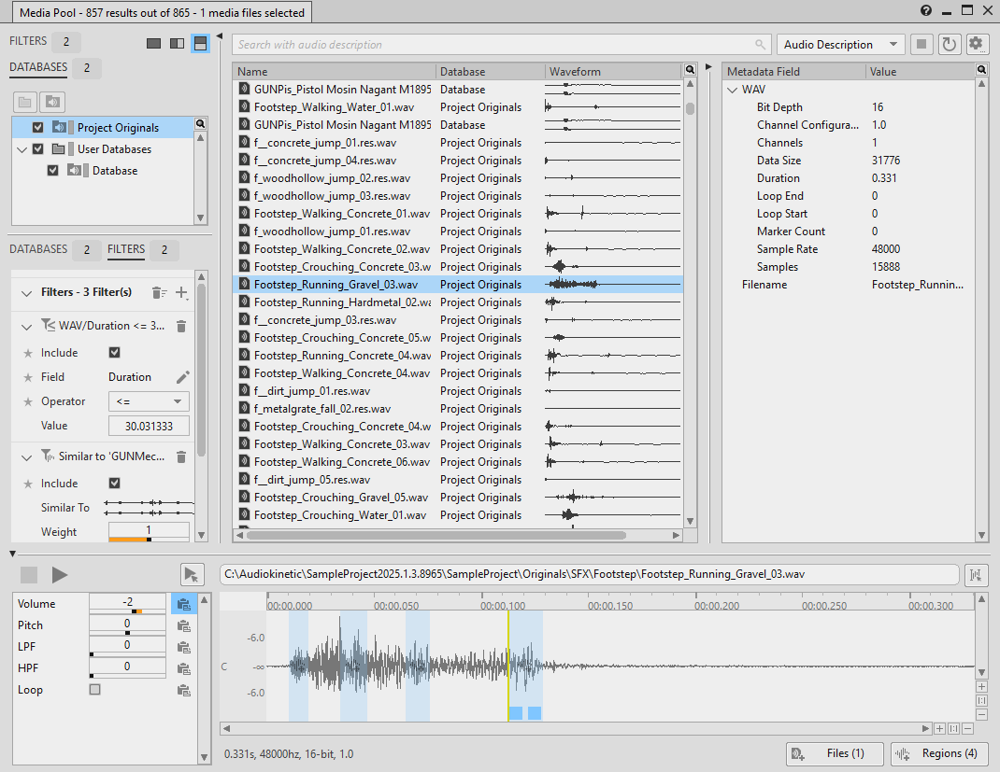

### Databases

Databases 选项卡中设有 Project Originals 和 User Databases 文件夹。在此，可创建 User Database 并定义音频文件所在文件夹的路径。另外，还可将 User Database 分组存放到 Virtual Folder，并分别为其指派不同的颜色来高效地加以组织。同时，使用相应的复选框来在搜索结果中包含或排除某些文件夹或数据库。

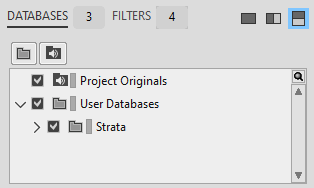

### Database Settings

在 Media Pool Database Settings 对话框中，可添加或移除数据库文件夹。另外，还可重新扫描数据库来递归扫描被追踪文件夹中的所有音频文件，并将元数据和提取的音频特征添加到缓存中。系统会定期扫描 `Originals` 目录下的音频文件。

### Filters

您可以使用 Filters 选项卡来添加、删除或修改筛选器来包含或排除某些条件以优化搜索结果。对于 Field 筛选器，可指定受筛选器影响的字段、筛选操作的类型以及筛选器的文本或数值。另外，还可筛选内容相近的声音，或键入对声音的描述来进行筛选。有关详细信息，请参阅 [Similar Sound Search](whatsnew_2025_1_new_features.html#features_25_1_similar_sound) 章节。

### Search

在选中 **Selected Fields** 搜索类型的情况下，您可以使用 Results 窗格顶部的搜索栏来查找特定的音频文件。在键入内容时，Media Pool 会搜索数据库文件中的元数据并在 Results 窗格中显示匹配项。

Search 字段支持借助以下操作符来准确找到自己想要的结果：

- **精确短语**：使用双引号查找特定短语（如 "footstep medium"）。
- **排除字词**：使用连字符或感叹号排除不想要的结果（如 footstep !concrete）。
  - 除此之外，还可排除特定短语。

若要选择所要搜索的元数据字段，请单击 Search 字段右侧的齿轮图标。Filename 字段会默认选中。

另外，还可选中 **Audio Description** 搜索类型，然后在搜索栏中键入对声音的描述。有关详细信息，请参阅 [Similar Sound Search](whatsnew_2025_1_new_features.html#features_25_1_similar_sound) 章节。

### Results

Results 窗格会基于搜索和筛选条件列出匹配的音频文件。最佳匹配项会显示在列表顶部。您可以使用 Results 快捷菜单来将音频文件添加到 Audio File Importer 或将其直接导入到工程的 Default Work Unit 中。另外，还可调整列的顺序并配置为显示各种 Metadata Field、Search Score 和 Waveform。

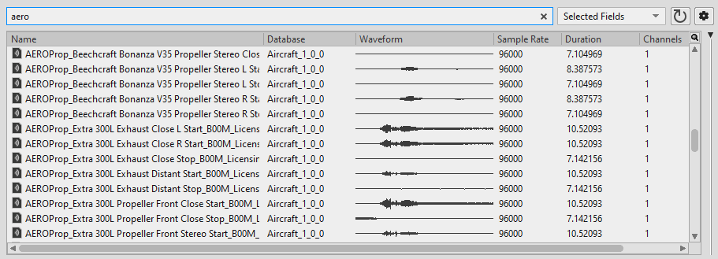

### Metadata

Metadata 窗格会显示在对选定文件进行检索后发现的所有元数据。在创建数据库并在本地或网络驱动器上指定路径时，Media Pool 会缓存每个文件的元数据。通过缓存这些元数据，可更快地搜索声音库，并精确地筛选结果。您可以选中 Metadata Field 并使用快捷菜单将其添加为列或筛选器。

### Transport 属性

在 Media Pool 中试听文件时，可使用 Transport 属性来修改 Volume、Pitch、Low-pass Filter 和 High-pass Filter。若选中 Loop 复选框，则会在检测到的区域内循环播放。在导入文件时，可根据需要应用这些更改。

### Audio Preview/Region Selector

Audio Preview/Region Selector 窗格允许预览并播放音频。在此，还可选择区域并将文件添加到 Audio File Importer。在导入文件时，会在工程中创建对应的对象。若选择了多个区域，则分别为其创建对象。您可以通过单击并拖动波形或单击音频文件中嵌入的标记来手动选择区域。按住 Ctrl 或 Shift 可选择多个区域。在启用 **Auto-select detected regions** 按钮时，会根据音频内容的测得能量自动选择区域。另外，还可拖动蓝色方框来编辑区域。

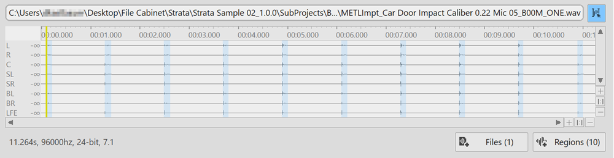

|  |  |
| --- | --- |
|  | **备注:** 在 Results 窗格中选择不同文件时，对选定区域的手动编辑是暂时的。 |

在导入区域时，会将整个音频文件导入到工程的 `Originals` 文件夹，并在工程的 Object Destination 创建对象，同时将选定区域应用为音频文件源的 Trim Start 和 Trim End。在导入不止一个区域时，会在保存各个区域时为对象名称附加编号。比如，若导入同一文件中的三个区域，则会分别将每个区域保存为对象，并在其名称末尾附加 \_01、\_02 和 \_03。

在单击 **Files** 或 **Regions** 时，会为 Audio File Importer 填充内容。在此，可进一步指定 Object Type 和 Object Destination。

### Similar Sound Search

Similar Sound Search 允许通过文本查询或参考音频片段在 Media Pool 数据库中搜索声音。这样便无需费力地标记关键词或花费大量时间手动浏览庞大的声音库。借助该音效搜索工具，可查找传统搜索方法难以找到的内容。比如，在查询“泥地中的脚步声”时可能会匹配到标记为“砸烂水果”的声音。

具体来说，Similar Sound Search 支持以下操作：

- **通过文本查询搜索音频**：在 Search 字段右侧的列表中，选中 **Audio Description** 并键入对所需声音的描述。这时会完全基于音频内容来筛选结果。
- **通过参考音频片段搜索音频**：在 Results 窗格中右键单击任意文件并选择 **Find Similar**。这时会参考文件的声音特性来查找相近的结果。

无论对于哪种情况，Similar Sound Search 都提供全新方式来查找音频，即便音频最初是为其他目的录制的。藉此，可优化依靠元数据的传统筛选技术，进一步拓展现有声音库的应用可能。

Similar Sound Search 运用非生成型机器学习模型将音频和文本放到共用搜索空间中，并在该空间按照声音在声学和语义上的相似性进行分组。您可以通过 Audiokinetic Launcher 将此可选数据包添加到 Wwise。

## 层级结构合并和重命名

### 将 Actor-Mixer Hierarchy 和 Interactive Music Hierarchy 合并到了 Containers 下！

为了将诸多对象类型更加紧密地融合到一个共用的音效、音乐和语音设计层级结构中，我们将 Interactive Music Hierarchy 和 Actor-Mixer Hierarchy 统一合并到了 Containers 层级结构下。这一改进保留了容器一直以来的运作方式。同时，也为将来在不同对象类型之间继续扩展和共用类似工作流程奠定了基础。

### 将 Actor-Mixer 重命名为了 Property Container！

同时，为了清楚表明 Actor-Mixer 用于指派可沿用的属性，我们将其重命名为了 Property Container。这一改进是根据我们从初学者那里收到的反馈做出的调整。其表示相关术语不好理解，在其他工具中也没有看到，跟预期行为之间缺乏关联。

### 将 Master-Mixer Hierarchy 重命名为了 Busses！

另外，为了确保名称能够清楚反映层级结构下的内容，我们还将 Master-Mixer Hierarchy 重命名为了 Busses。现在会创建新的顶层 Audio Bus 作为 New Main Audio Bus。也就是说，Wwise 的代码库中将不再使用 Master 这一术语。这一举措是应开发者关于从管线中去除争议性及非敏感术语的请求做出的。鉴于同样的原因，我们将 Master-Mixer Console 重命名为了 Busses Console。

### 将 Audio Devices 重命名为了 Devices！

最后，我们还将 Audio Devices 重命名为了 Devices。这样更短，而且没有空格。

### 工程文件夹结构迁移

从旧的 Wwise 版本迁移时会出现以下变动：

- "Audio Devices" 重命名为 "Devices"
- "Master-Mixer Hierarchy" 重命名为 "Busses"
- "Actor-Mixer Hierarchy" 重命名为 "Containers"
- "Interactive Music Hierarchy" 移到 Containers 层级结构下的 Virtual Folder 并重命名为 "Music (Migrated)"

如需了解这些改进会对自己的工程以及在工作流程中集成 WAAPI 产生怎样的影响，请参阅 [重要的迁移说明2025.1](whatsnew_2025_1_migration.html) 章节。

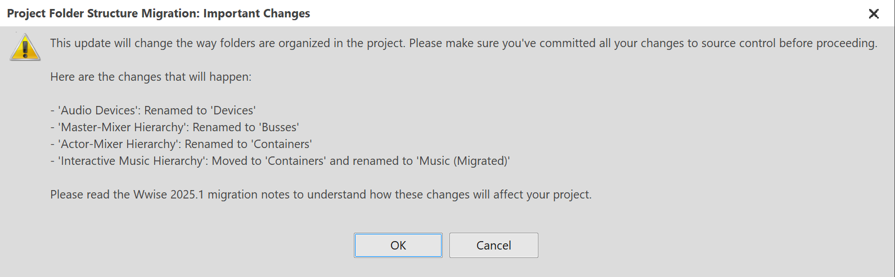

## Event 限制

实例限制功能是声部管线中最重要的基础设计和优化策略。现在我们又进一步把 Event 限制功能纳入了进来。您可以在全局或游戏对象层面限制 Event。在达到限值后，将暂停发送 Event。除此之外，还可定义 Cooldown Time（多久之后可再次发送 Event）。

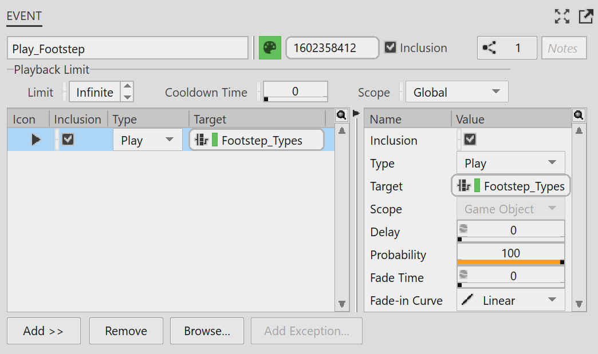

通过限制 Event 实例，您可以在游戏引擎请求同时播放很多相同的 Event 时让 Wwise 只发送一个或少数几个 Event。比如，物理模拟当中就经常出现单次撞击导致几十次请求发送同一 Impact Event 的情形。在有些情况下，可能会有人觉得最好创建一个系统来从游戏引擎端限制 Event 的发送。不管怎样，现在在 Wwise 中就可轻松限制 Event。

## Mute/Solo RTPC

现在允许在调试 Real Time Parameter Control (RTPC) 时 Mute 或 Solo 其产生的效果。另外，还可在连接到游戏时 Mute 或 Solo RTPC 来实时试听编辑效果。它的原理跟 Mute 和 Solo 音频是一样的。这样方便试听 RTPC 对最终效果的影响。

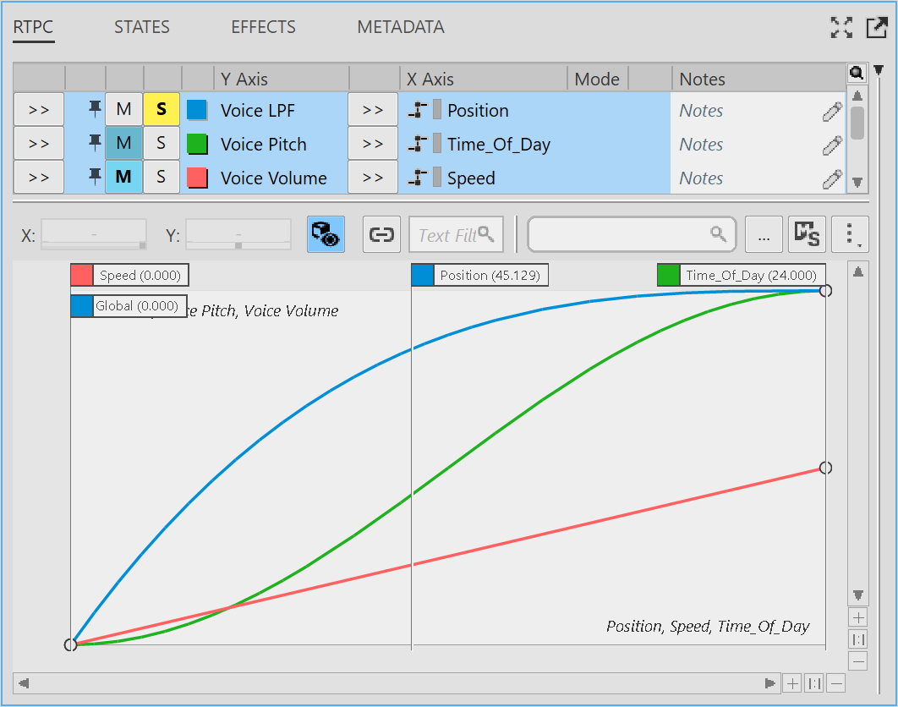

## Audio File Importer 视图

Audio File Importer 现为非模态视图并可停靠在任何布局中。另外，该视图中还新增了菜单、按钮以及拖放功能。

## Property Editor 改进

感谢来自社区的反馈。Property Editor 会越来越好用。我们一直都在改进。比如，在 Wwise 2024.1 中引入了纵向的 Property Editor。

### 大小调节

我们对属性类别和属性布局的视觉样式做了改进（包括调节字体大小）。另外，我们还移除了中间的分隔线，并改为自动调节属性列宽。

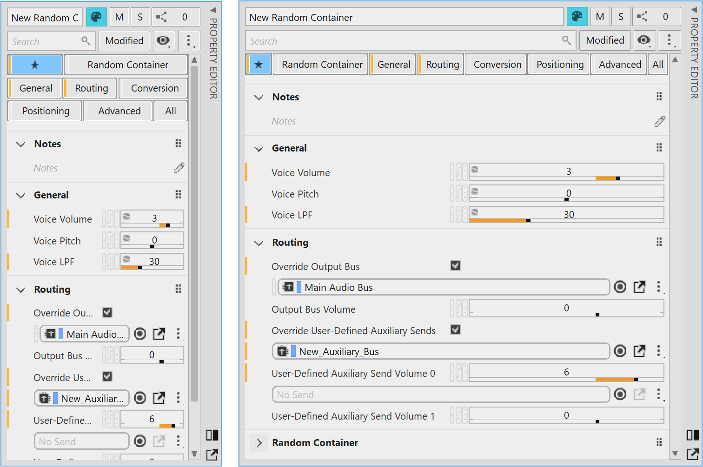

### Favorites 默认设置

Favorites 类别现在默认包含各个对象类型的通用属性。只要用过之前的 Wwise 版本，可能多少都知道这些属性。它们跟原有 Property Editor 的 General Settings 选项卡中显示的属性基本上是一样的。

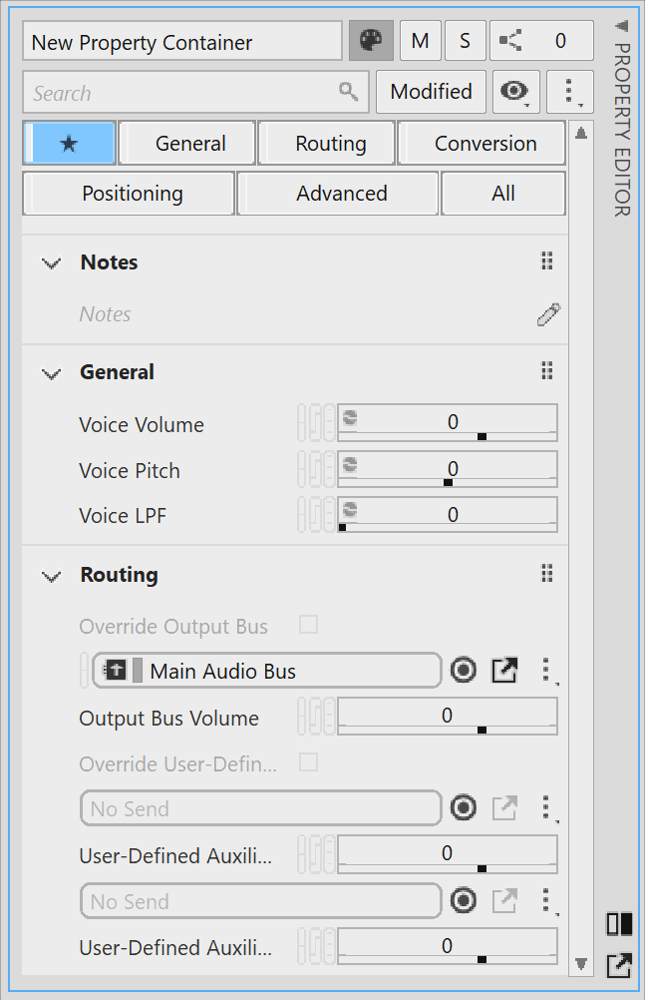

### 使用键盘浏览属性

现在可使用 Tab 键在不同属性页面之间切换。另外，还可使用 Shift+Tab 来按反向顺序浏览。

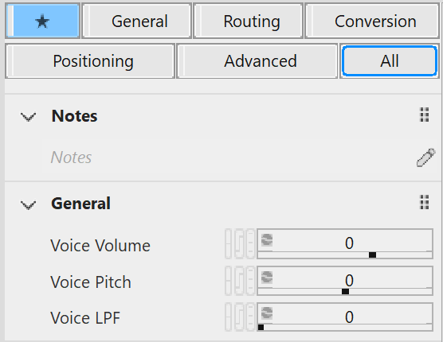

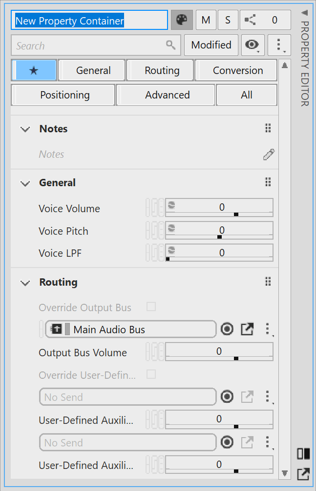

### 可展开 Notes

Property Editor 中的 Notes 字段常被用于为表明用途和实施决策提供上下文说明。有时团队还会以此来使用 Wwise 搜索功能查找特定的对象。现在 Notes 字段会展开并清晰显示全部内容。

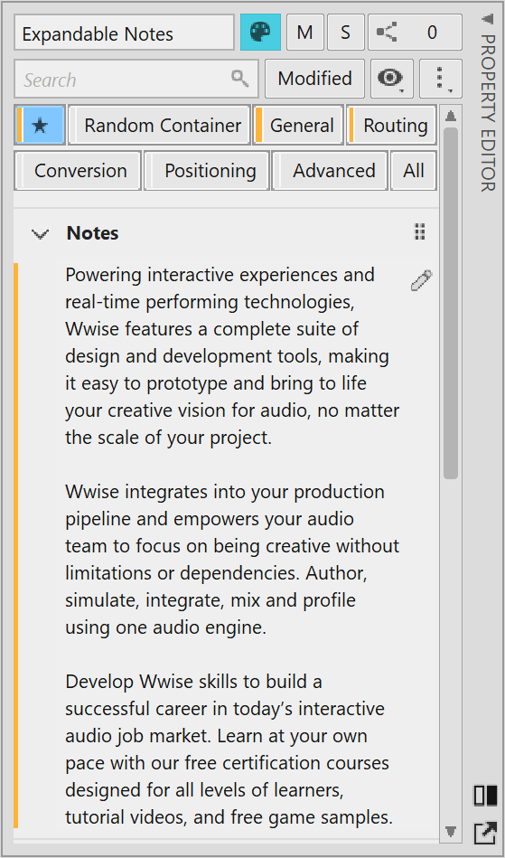

### 持续显示 Default Editor

现在将“在不同对象类型之间切换”这样的操作统一为了“在选中对象时始终显示 Default Editor”。

### 编辑器用法更新

我们在以下编辑器中添加了上下文菜单并对 Group 使用体验做了优化：

- Switch Container Editor
- Sequence Container Editor
- Music Playlist Editor

## Multiband Meter

在使用现有 Meter 效果器输出 Game Parameter 时，可利用动态参数控制整个音频层级结构的属性。借助新的效果器 Multiband Meter，不仅可测量传入音频信号的整个频段，还可单独测量四个用户配置的频段。

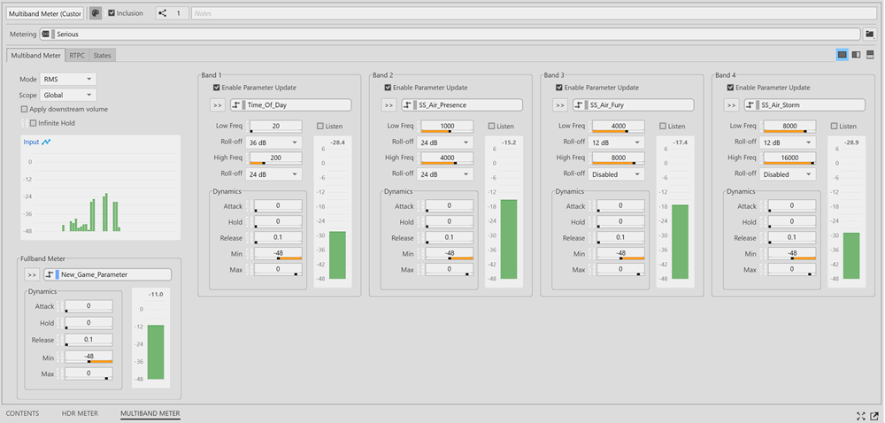

## 旁链压缩

旁链压缩现已作为一套插件以及对现有插件的扩展推出。藉此，可监控并应用音频信号来动态地调节混音。

### 旁链压缩混音

旁链压缩混音现在被做成了新的系统并作为一种 ShareSet 添加到了 Wwise 中。藉此，效果器插件可发送和接收 Voice Graph 以外的音频信号，并允许通过音频渲染将多个不同来源的音频信号结合在一起。

Sidechain Mix ShareSet 可用来识别和定义旁链压缩混音。旁链压缩混音从一个或多个 Sidechain Send 效果器接收音频信号，并可被 Sidechain Receive 效果器读取。或者，也可用作其他效果器（如 Compressor 和 Expander）上的 Sidechain Input。

### Sidechain Send 效果器

Sidechain Send 效果器可用在 Audio Bus 或 Aux Bus 上，来将音频信号发送到 Sidechain Mix ShareSet。

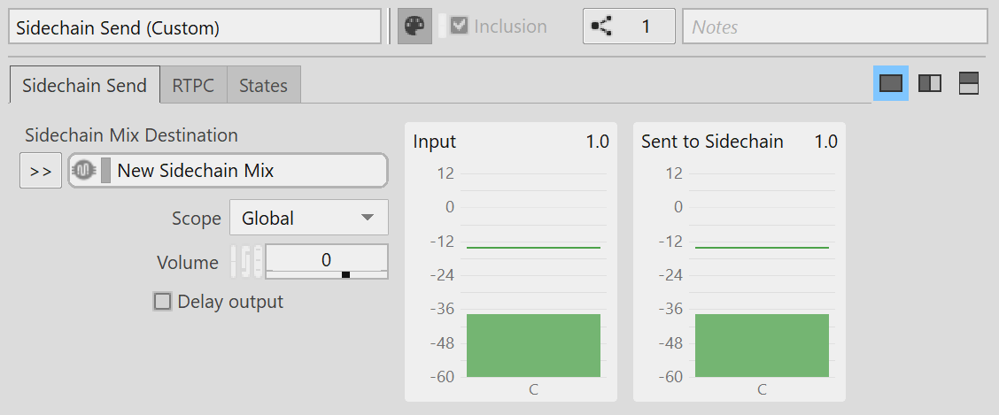

### Sidechain Receive 效果器

Sidechain Receive 效果器可用在 Audio Bus 或 Aux Bus 上，来接收来自 Sidechain Mix ShareSet 的音频信号。这对测试比较有用。因为它只是监控累积旁链压缩混音的音频信号，并将该音频信号用作效果器处理的输出。

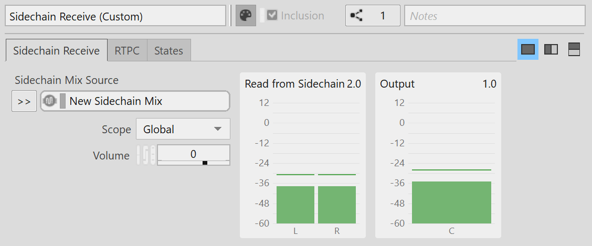

### 对 Compressor 和 Expander 效果器实施了改进

Compressor 和 Expander 效果器现在允许使用旁链压缩混音来动态调节输入音频信号。比如，Compressor 效果器会在给定旁链压缩混音的音频信号的音量增大时降低输入音频信号的音量。

现在可在 -3 dB 和 -96 dB 之间调节 Gain Reduction 电平表范围。这样可以更加轻松地监控输入音频信号中的小幅增益衰减。

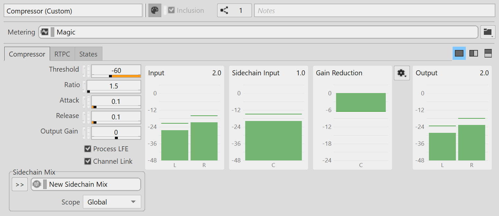

## 对 Parametric EQ 实施了改进

我们对 Parametric EQ 插件进行了大幅扩展，以增强性能并提升在诸多情形下的易用性。

它现在最多支持八个滤波器频段，同时还增添了几种新的滤波模式。借助新增的 Parametric EQ 频率图，可轻松配置并交互预览各项 Parametric EQ 属性。比如，通过拖动控制点来调节各个 EQ 滤波器的 Frequency、Gain 和 Q 值。该频率图会同时显示各个频段的频率响应和所有频段的累积效果。

除了预览所有 EQ 的累积频率响应，插件还会在对声音引擎实施性能分析时直观地显示运行时 EQ 曲线，同时兼顾效果器运行期间应用的所有 RTPC。另外，您还可以单独试听或独奏特定频段的音频，轻松预览某个 EQ Band 会影响音频混音的哪个部分。这样便可更加清晰、准确且快速地根据需要调节混音效果。

除此之外，插件还添加了一系列动态相关功能。现在可使用音频信号来在运行时自动修改 EQ 曲线。通过测量各个频段的音频信号的强度，插件可基于用户所做配置自动增大或减小对应频段的增益。另外，Parametric EQ 还可测量驱动动态的直通音频信号以及 Sidechain Mix。

在使用 Sidechain Mix 时，会为 Parametric EQ 加入基于频率的旁链压缩，以便对音频频谱的多个频段进行动态均衡处理。这样可以通过单独的 Sidechain Mix 音频自动调节频段，进而根据当前播放的其他声音动态地控制声音的频率。藉此，有效防止不同类别的声音出现频率叠加，并基于混音中的其他元素产生独特的均衡效果。

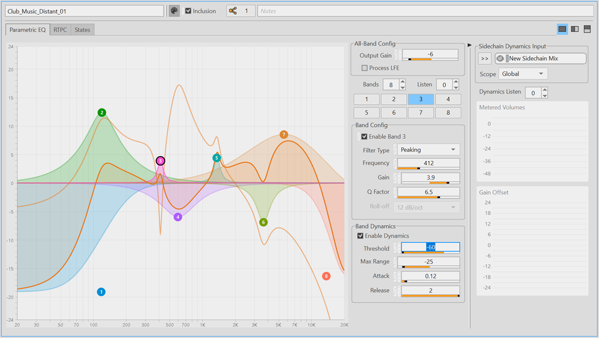

## External Source – WAV 播放

External Source 插件现在可直接加载 WAV 文件而无需将其转码为 WEM 格式。

借助 External Source 插件，可在运行时动态加载未包含在 SoundBank 中的源音频文件以供播放。该插件特别适合处理包含大量声音的场景（如多语言对白）。

## ReadSpeaker speechEngine

ReadSpeaker 的 speechEngine for Wwise 是个跨平台的设备端文本转语音插件，其可通过文本输入生成毫无违和感的语音。您可以在运行时从游戏端发送文本来将其转换为语音。比如，UI 旁白或多人文本聊天。在 Wwise 设计工具中，可在保持韵律的情况下对语音进行自定义并调节语调和语速等各种语音相关参数。speechEngine for Wwise 目前支持 10 种语言和 12 种语音，并将在未来版本中提供对更多语言和语音的支持。

另外，speechEngine for Wwise 还可生成单词和视素数据，并在语音中出现新的单词或视素时发出通知。您可以将之用于单词突显或对口型功能。除此之外，它还支持语音合成标记语言 (SSML)。

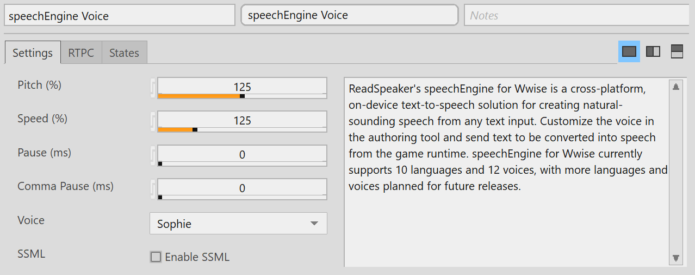

ReadSpeaker 致力于提供符合道德规范的 AI 语音解决方案。[点此](https://www.readspeaker.com/blog/ethical-ai-voice-for-gaming)详细了解其如何确保游戏中使用的 AI 语音符合道德规范。

有关此插件的更多详细信息，请参阅 [speechEngine for Wwise](https://www.audiokinetic.com/en/wwise/plugins/readspeaker/)。Wwise 2024.1.5、Wwise 2023.1.13 及更高版本中同样支持该插件。

## 添加了 WAQL 访问器

添加了多个 Wwise Authoring Query Language (WAQL) 访问器：

- `workunitIsLoaded`：若工程中当前加载了 Work Unit，则返回 true。
- `musicTransitionObject`：返回与当前 Music Transition 对象关联的过渡 Music Segment。
- `switchGroupGameParameter`：返回与当前 Switch Group 对象关联的 Game Parameter 对象。
- `customStates`：返回当前对象带定义值的自定义状态列表。
- `originalNonLFEChannelCount`：返回原始文件中的声道总数，不包括低频声道。
- `originalAmbisonicsChannelCount`：返回与当前对象关联的原始文件的 Ambisonics 声道总数。
- `convertedNonLFEChannelCount`：返回转码文件中的声道总数，不包括低频声道。
- `convertedAmbisonicsChannelCount`：返回与当前对象关联的转码文件中的 Ambisonics 声道总数。
- `convertedSampleRateSetting`：返回转码文件的选定采样率设置（以字符串形式表示）。
- `convertedTrimmedDuration`：返回修剪的与当前对象关联的转码音频源的时长（秒）。
- `isLanguageIncluded`：若音频源对象的父对象包含音频源的语言，则返回 true。
- `conversionFormat`：返回与当前对象关联的文件所用的编解码器。
- `supportsStates`：若对象支持在其属性上应用 State，则返回 true。
- `supportsRandomizer`：若对象支持在其属性上应用 Randomizer，则返回 true。
- `hasEmptySwitchStateAssignment`：若 Switch Container 和 Music Switch Container 上指派有空的对象或路径，则返回 true。
- `extractEvents`：返回 SoundBank 对象引用的 Event 对象。
- `extractStructures`：返回 SoundBank 对象引用的对象结构。
- `extractMedia`：返回 SoundBank 对象引用的媒体文件的路径。
- `soundbanksReferencingEvent`：返回引用当前 Event 对象的 SoundBank 对象。

## 插件单元测试框架

我们添加了单元测试架构以便在创建插件工程时包含其中。它允许开发者自定义单元测试。插件工程包含两个测试模板：一个用于声音引擎插件实现，一个用于其所用的各项参数。单元测试会在使用 `wp.py` 命令编译插件时自动构建并可通过 `wp.py test` 命令来启动。有关详细信息，请参阅 [Unit Testing Your Plug-in](effectplugin_tools_unittest.html) 章节。

# 集成

## Unity Wwise Browser

现在将 Wwise Unity Integration 中的 Wwise Picker 替换为了 Wwise Browser。Wwise Browser 中设有各种筛选器。您可以通过其轻松辨别 SoundBank 及关联 Wwise 工程的状态。另外，还可使用上下文菜单在 Unity 中浏览 Wwise 工程并执行走带控制等各种操作。有关详细信息，请参阅“利用 Wwise Browser 管理素材”。

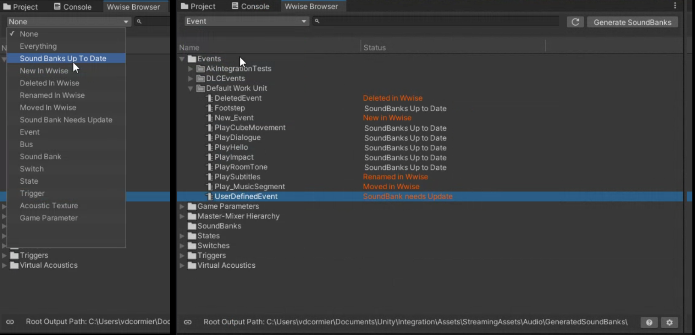

## Unreal Dynamic Dialogue

Wwise 中的 Dynamic Dialogue 使用决策树中的一组规则决定要在游戏的某一特定时刻播放哪个声音。藉此，可基于 Dialogue Event 中用户定义的路径关联灵活地决定要播放哪个声音。同时，据此使用 State 和 Switch 来选择最合适的声音。Dynamic Dialogue 系统的主要优势包括：使用 State 和 Switch 熟悉地设置动态音频、无需容器就可共用对象、精细地管理素材以及在运行时灵活处理对白总线…有关如何在 Wwise 中使用 Dynamic Dialogue 的详细信息，请参阅[管理 Dynamic Dialogue](https://www.audiokinetic.com/library/edge/?source=Help&id=managing_dynamic_dialogue) 。

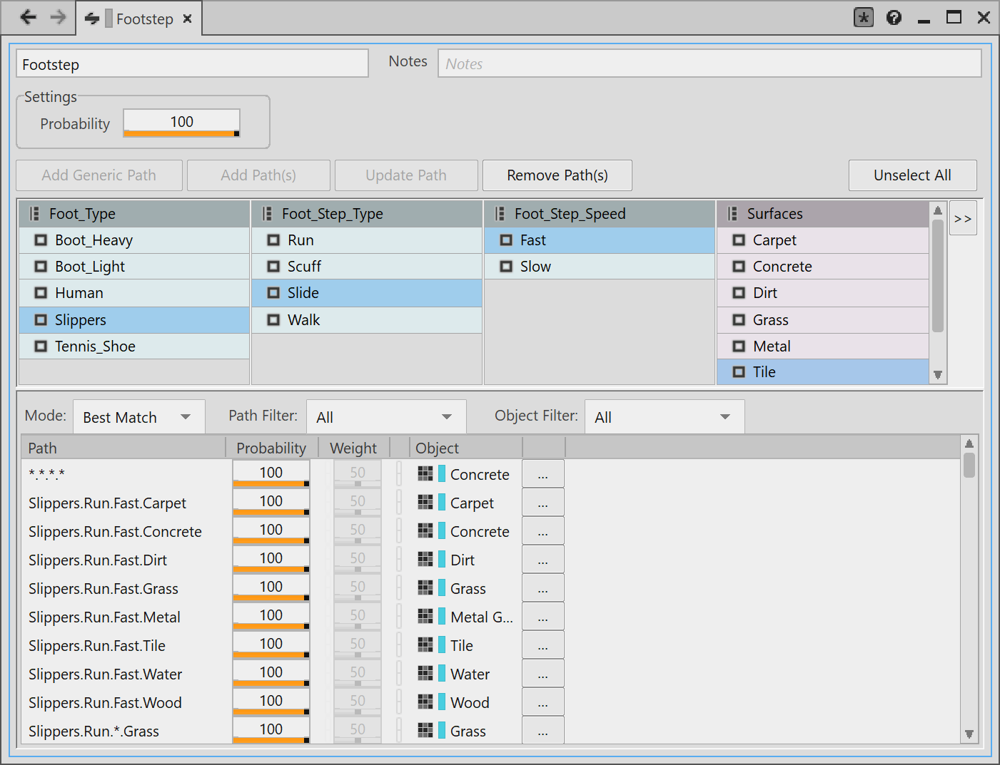

Dynamic Dialogue 系统由两个系统组成：

- Dialogue Event：包含可解析为音频节点的决策树结构。
  - Dialogue Event 包含 Switch Group 和 State Group 的路径。它们可以通过 Switch 和 State 值或默认路径解析为指派的对象。
- Dynamic Sequence：与包含已解析音频节点顺序播放列表的常规游戏对象（如 Unreal 中的 AkComponent）关联。
  - Dynamic Sequence 是个与游戏对象绑定的音频节点的播放列表。它跟游戏控制的 Music Playlist Container 或 Sequence Container 类似。

这些系统使用的*音频节点*是 Containers Hierarchy 下保存的可在常规 Event 中播放的对象（如音效、语音和容器）。

功能包括：

- 把 Dynamic Dialogue 功能做成 C++ 函数和 Blueprint 节点。
- 通过 Wwise Browser 导入 Dialogue Event（就像其他类型的 Event 一样）。
- 使用默认路径预览 Dialogue Event。
- 定义 Path Argument。
- 向 Resolve 操作添加参数。
- 向 Dynamic Sequence Playlist 添加音频节点。

## Unreal Packaging 改进

在 2024.1 和 2025.1 中对 Unreal 的 Packaging 功能实施了改进：

- 对 Unreal Modular Gameplay 功能体验做了改进
  - 扩展了对 DLC 的支持
  - 将 Auto-defined SoundBank 包含在正确的数据包中

## Gym 改进

Gym 可提供 Wwise 工程作为开发者的沙盒环境。藉此，可先在 Unreal、Unity 或自定义集成包中对 Wwise 功能进行测试再将其整合到游戏中。为了便于展示诸多 Wwise 功能，我们提供了各种演示用的 Gym。

在此版本中，我们提升了 Gym 的稳定性。Unity Gym 现在默认使用 Unity Addressables（与 Unreal Packaging 协调一致）。

# Spatial Audio：Acoustics

## 双通道搁架滤波器 (DSF)

新增的双通道搁架滤波器 (DSF) 可在保证物理精度的同时生成更加逼真的远距离声音。另外，相较于通过 LPF 提供戏剧性的滤波效果，我们可以借助 DSF 来调节音调。DSF 可将低架和高架滤波器合而为一，但其计算复杂度却跟 LPF 或 HPF 相当。该滤波器更接近实际声学效果（如衍射）并可与衰减曲线结合使用。在衍射或遮挡当中，可借助 DSF 构建更加自然的滤波体验。在 Alpha 测试阶段收集的早期反馈中，开发者发现 DSF 设置起来更快，而且适用于各种不同的内容类型，还可逼真地呈现声音随距离的传播效果。

### High-Frequency Gain

High-Frequency Gain 是 DSF 的主要控制参数。您可以通过更改此参数来调节高频段的增益。下图展示了滤波器在不同增益设置下的效果。注意，增益也可以是正值。这时会增强高频信号而非对其进行衰减。

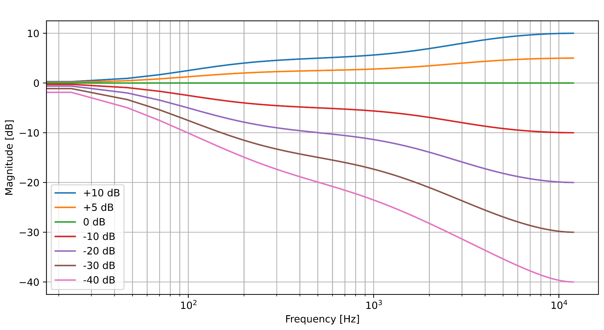

以下属性可改变高频增益：

- Output Bus

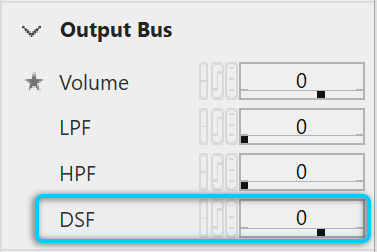

- Game-Defined Auxiliary Sends

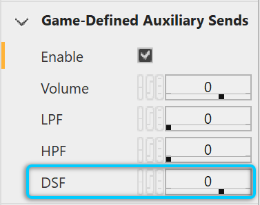

- Attenuation ShareSets

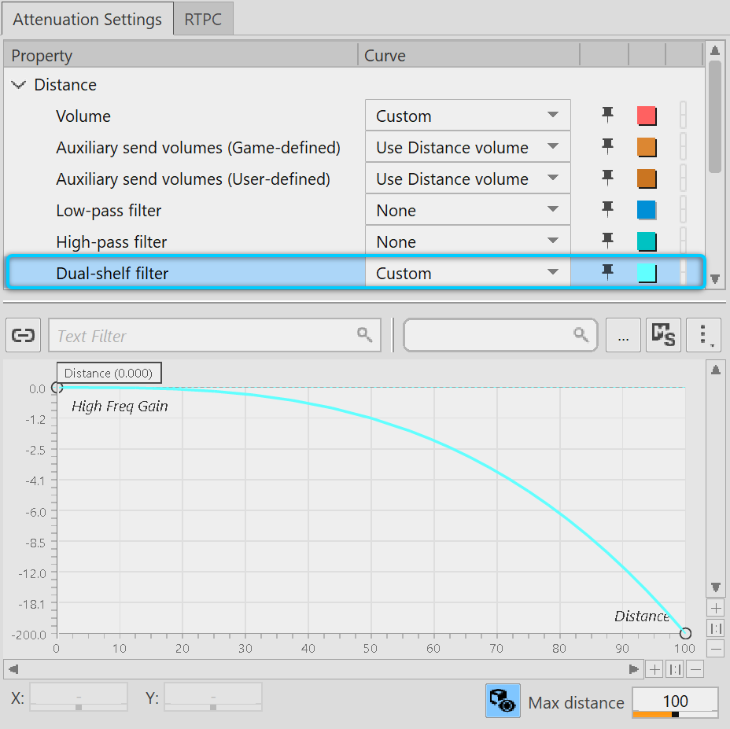

- Reflect 插件

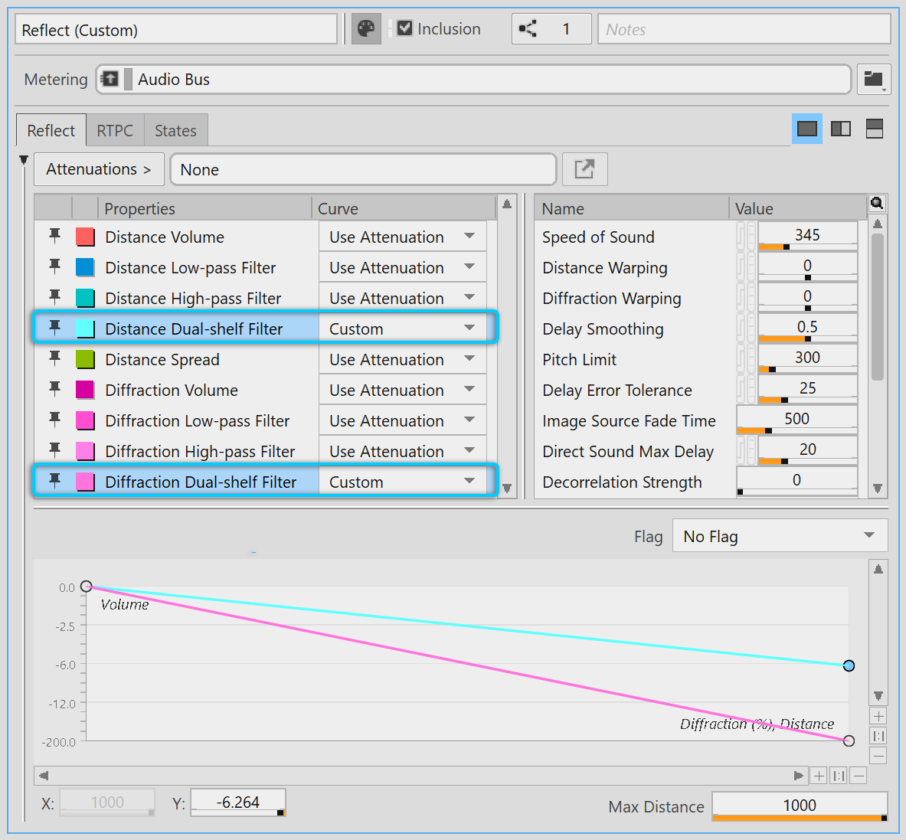

### DSF Emphasis

DSF Emphasis 属性可调节 DSF 过渡区的形状。其取值范围为 -1 ~ +1。默认值为 0。

下图展示了 DSF Emphasis 在各种设置下的效果。在第一张图中，High-Frequency Gain 被设为了 -20 dB。在第二张图中，High-Frequency Gain 被设为了 +10 dB。

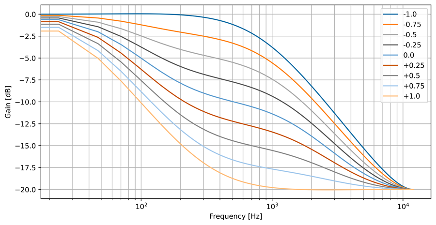

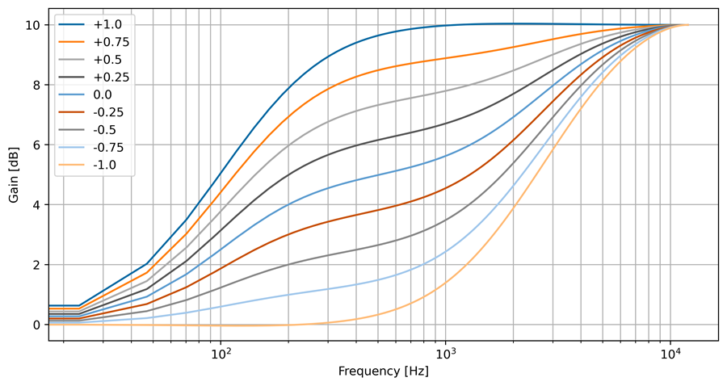

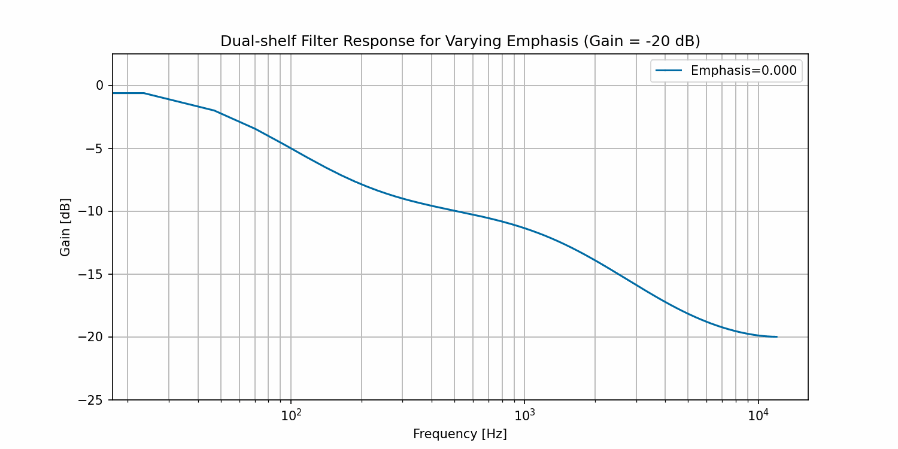

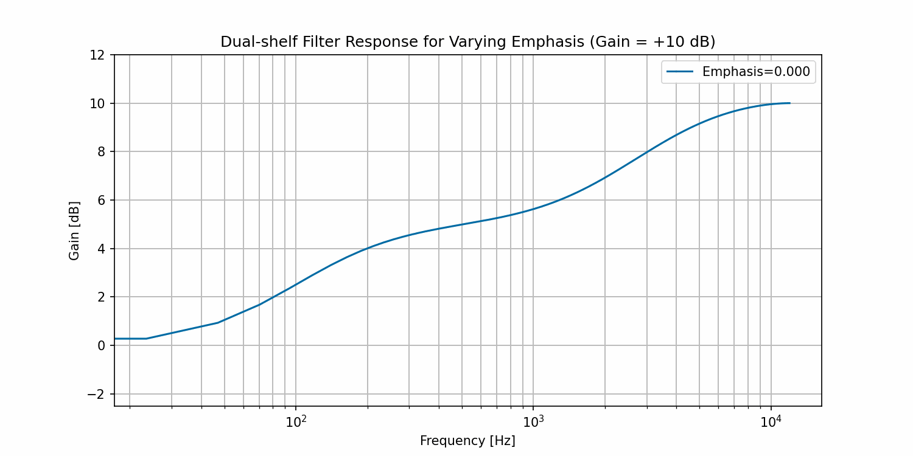

DSF Emphasis 的值越高，滤波效果越强，对中频信号的衰减越明显。

DSF Emphasis 是全局属性，可在 Project Settings 中调节。

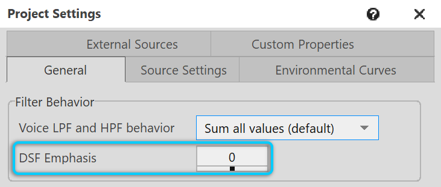

DSF 行为是累积的。在信号路径上有多个 DSF 时，会将 High-Frequency Gain 加在一起。比如，若声部先后经过 High-Frequency Gain 分别为 -2 dB、-1 dB 和 -3 dB 的 Distance DSF、Diffraction DSF 和 Output Bus DSF，则有效 High-Frequency Gain 为 -6 dB。另外，出于优化目的，相较于处理三个不同的 DSF 实例，声音引擎只会处理一个 High-Frequency Gain 为 -6 dB 的 DSF。

## Project Environmental Curves ShareSet

现在可通过 Project Settings 中指定的 Attenuation ShareSet 来定义工程层级的 Environmental Curve。这样既方便在运行时修改 Project Environmental Curve，又可基于 Attenuation 覆盖或移除各个曲线的继承关系。而且，还可轻松在工程之间共用 Environmental Curve。另外，新工程会默认采用基于物理的 Environmental Curve，并据此构建逼真的声学模拟效果。

|  |  |
| --- | --- |
|  | **备注:** 虽然被引用的 Project Environmental Curves ShareSet 包含距离曲线，但其不会用在工程层级。Environmental Curve 包括 Obstruction、Occlusion、Diffraction 和 Transmission 曲线。藉此，还可创建 Attenuation ShareSet 并将 Distance Volume 曲线设为 **None**。 |

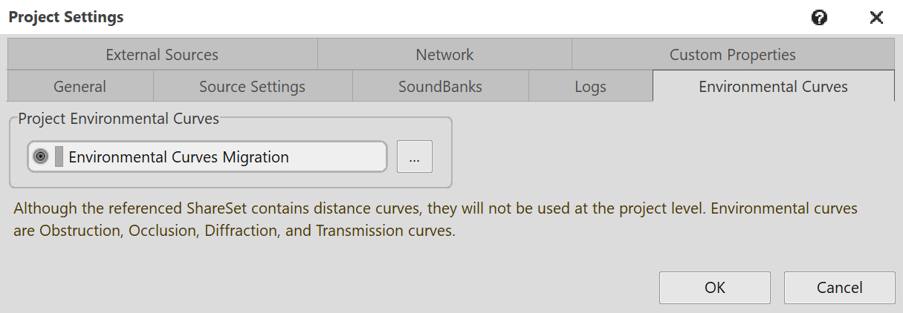

## Game Object 3D Viewer 更新

Game Object 3D Viewer 可在同一视图中直观地呈现游戏对象、发声体、几何构造和声学信息之间的关系。现在可使用新增的 Settings Toolbar 轻松自定义 Game Object 3D Viewer 中显示的数据。这些设置被分成了不同的类别：View、Text、Game Object 和 Acoustics。每个类别都设有选项并允许显示/隐藏、修改和锁定。另外，还可在中间窗格内选中对象。右侧新增的 Object Properties 窗格会提供关于所选对象的信息。

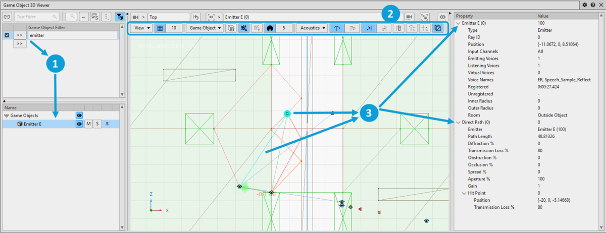

|  |  |
| --- | --- |
|  | **场景筛选**：筛选 Game Objects 列表来只显示所需对象。只有列表会受到影响，不会改变对象的状态。比如，上图中输入了 emitter 来筛选相应对象，但 3D Viewer 中仍会显示 Room 和听者。而且，系统只会隐藏而不会移除行。只要展开 Game Objects 列表，就还可以访问被滤掉的行。另外，还可使用列表中各个游戏对象旁边的眼睛图标在 3D Viewer 中显示/隐藏游戏对象。上下文菜单中还有其他操作可供选择。比如，**Show Only Selected in the 3D Viewer**。 |
|  | **选项工具栏**：之前 3D Viewer 选项显示在单独的窗口中。现在其显示在 3D Viewer 上面的工具栏中。该工具栏可自定义。其中包含可启用和禁用的选项类别。每个类别展开后都会显示可锁定到工具栏的选项列表。在上图中，可以看到选择了好几个锁定的选项。 |
|  | **对象选择**：您可以在 3D Viewer 中选择游戏对象、声学路径和镜像声源。在选中对象时，Selection Property 窗格中会显示相关信息。比如，在选中发声体时会显示 Type、Position、Virtual Voices、Outer Radius、Inner Radius 和 Room。发声体还会选定其对应的直达路径。声学路径属性包括 Emitter、Path Length、Diffraction 、Transmission Loss、Obstruction 、Occlusion 、Spread 、Aperture 、Gain 和 Node Information。 |

## 对 Reflect 插件实施了改进

现在将 Reflect 中的属性分成了以下分组：General、Warping、Doppler、Phasing 和 Output。同时，允许将最常使用的属性添加到新增的 Favorites 类别。

另外，还对 Doppler 分组下的属性做了以下改进：

- 将 Distance Smoothing 重命名为了 Delay Smoothing，并针对不同反射时间应用了平滑滤波器。
- 将 Pitch Threshold 重命名为了 Pitch Limit，以设置最大允许的多普勒变调幅度（音分）。
- 添加了 Delay Error Tolerance 以设置有效延迟和期望延迟之间最多允许存在多大差异。

将 **Same As Main Mix** 和 **Same As Passthrough Mix** 添加到了可能的 Output Config 列表。**Same as Main Mix** 现在是默认的 Output Config。

## Emitter Clustering（实验功能）

Emitter Clustering 为实验功能。它的目的在于将发声体聚类编组来减少所需的计算量，并以此提升反射和衍射路径计算的性能。该功能可将环绕听者的空间划分为径向网格，并将各个发声体指派给网格单元，然后根据角度和距离做进一步的划分。离听者越近，网格单元越细密，发声体被编组处理的几率越低。这样近处声音的精度就会更高。离听者越远，网格单元越稀疏，发声体被编组处理的几率越高。在编组之后，便可计算反射和衍射路径。

## Dynamic Load Balancing

Dynamic Load Balancing 会基于给定时间可用的处理资源持续分配声学任务。这样可以自动优化声学路径计算中延迟和吞吐量之间的平衡。它会根据可用的 CPU 资源把不同的声学任务（如路径查找、射线投射、发声体编组、反射路径验证和衍射）分摊到多个处理帧。在 CPU 用量较低时，可同时处理相对较多的声学任务。在 CPU 用量较高时，可将声学任务分摊到不同处理帧。这种方法取代了 CPU Limit。后者会试着动态调节 NumberOfPrimaryRays 的值。

Dynamic Load Balancing 把 CPU Limit 和 Load Balancing Spread 初始化设置合在了一起。若未设 CPU Limit，则负荷均衡在该设置下保持不变。若设有 CPU Limit，则动态增大 Load Balancing Spread 设置，并尝试最大限度地降低 CPU；在这种情况下，会将 Load Balancing Spread 值用作最大值。若 CPU 用量较低，则不增大 Load Balancing Spread；但若 CPU 用量在一段时间内保持高位，则对 CPU 负荷做动态均衡来加以补偿。

Dynamic Load Balancing 属性设在 `AkSpatialAudioInitSettings` 中。对于 Wwise Unity/Unreal Integration，其设置在 Project Settings 中。

## Room Distance Behavior

`AKSpatialAudioVolume` 可为 Room 添加 Distance Behavior 属性，决定在此房间与彼房间重叠或嵌套在其中时相互之间如何交互作用。

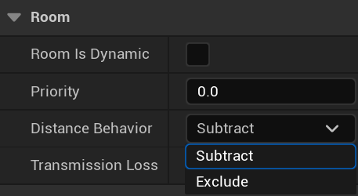

**Subtract**：在设为 Subtract 时，会随低优先级的重叠房间一起从父房间的形状中减去子房间。在这种情况下，会在听者进入此房间时为彼房间应用距离衰减，因为此房间被认为是不同的空间。

在本例中，听者听不到父房间的 Room Tone，因为子房间被设为了减掉房间的形状并应用距离衰减。

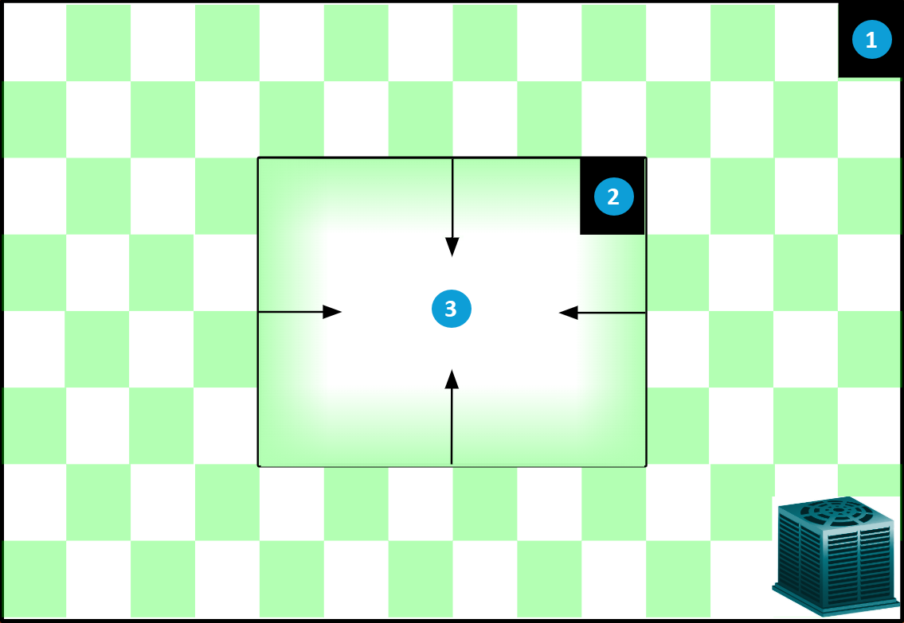

|  |  |
| --- | --- |
|  | 父房间 |
|  | 子房间 |
|  | 听者 |

**Exclude**：在设为 Exclude 时，此房间不参与彼房间的距离计算。在这种情况下，不会将距离衰减应用于此房间的父对象或低优先级房间的重叠部分。因为此房间不构成不同的空间，而且没有从彼房间的形状中减掉。

在本例中，听者能听到父房间的 Room Tone 且无衰减，因为子房间被设为了从距离计算中排除房间的形状。

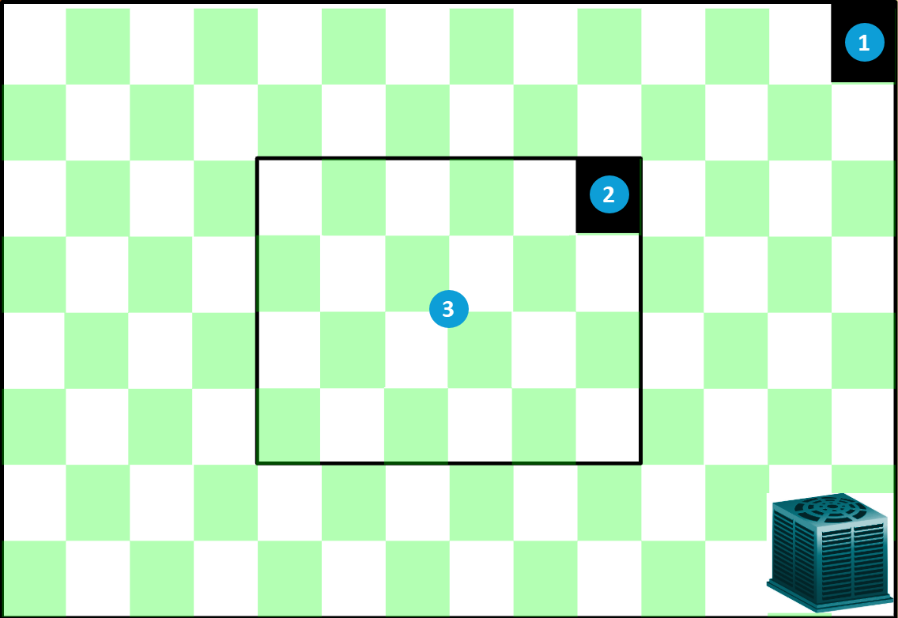

|  |  |
| --- | --- |
|  | 父房间 |
|  | 子房间 |
|  | 听者 |

# Spatial Audio：3D Audio

## Recorder (ADM) 插件 – 实验功能

Recorder (ADM) 是个实验性的效果器插件，用于录制发送到音频对象格式总线的信号。内容将被保存为 ADM 格式的 WAV 文件。此格式可录制多个 Bed 和带动画的 3D 对象。该插件在 Wwise 设计工具和游戏中均可使用。

WAV 文件的声道数在录制期间保持不变。各个声道可根据需要指派给 Main Mix、Passthrough Mix、附加 Bed 和音频对象。除标准指派规则外，在启用 **Preserve Extra Beds** 时，未应用 3D Spatialization 和扬声器声像摆位的对象将不参与混音。

在启用 **Hold** 时，即便录制期间有无声时段也只会创建一个文件。

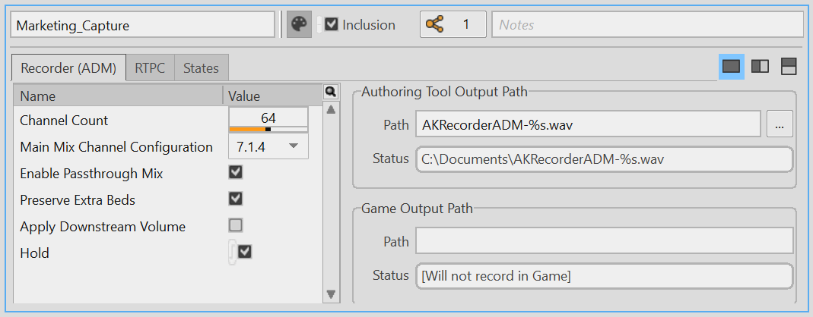

# 声音引擎

## 行为改写

为了优化不同系统中的播放效果，我们对 Wwise 声音引擎的行为做了大量的改写。这些改进对不断扩展声音引擎来为未来工作流程和游戏引擎功能提供支持来说非常关键。

## Command Buffer API

有些游戏会频繁地向声音引擎发送大量的数据。比如，包含很多 Game object 和 Game Sync 的游戏。它们会按照固定的时间间隔向声音引擎发送上百个数值。尽管我们可以使用现有的 C++ API 来管理这些数据的传输。不过新的兼容 C 语言且完全异步的 Command Buffer API 更有优势。

- 它可以在大规模数据传输当中最大限度地降低 CPU 用量并减少内存分配。
- 它与 C11 编译器完全兼容。所以，它的函数可直接与其他支持外部函数接口 (FFI) 的编程语言（如 Rust）绑定。

除此之外，您还可以使用 Command Buffer API 执行以下操作：

- 对 Event 进行分组 (PostEvent/SetRTPC)。
- 将命令合并到单个缓冲区或处理帧。
- 注册调用（如 Post 和 SetPosition）。

我们会在未来版本中对此版本中引入的函数做进一步的扩展。

# 平台支持

我们在 Wwise 2024.1.5 及更高版本中添加了对 Nintendo Switch 2 的支持。