# 新增功能概述 2024.1

|  |
| --- |
| Wwise SDK 2025.1.4 - Windows |

新增功能概述 2024.1

### 目录

- [用户体验](#features_24_1_ux)
  - [Live Media Transfer](#features_24_1_ux_media_transfer)
  - [对 Live Editing 的扩展](#features_24_1_ux_expanded_live_edit)
    - [Unreal 中对实时编辑所做的改进](#features_24_1_ux_live_editing_unreal)
  - [对编辑工作流程的优化](#features_24_1_ux_editing_workflow)
    - [Primary Editor：默认对象编辑器](#features_24_1_ux_object_editors)
    - [Primary Editor 和 Secondary Editor：Maximize 和 Pop-Out](#features_24_1_ux_pop_out)
    - [Secondary Editor：Contents Editor](#features_24_1_ux_contents_editor)
    - [对 Property Editor 的优化](#features_24_1_ux_property_editor)
  - [对 Attenuation Editor 的改进](#features_24_1_attenuation_editor)
  - [对 Light 和 Dark 主题的更新](#features_24_1_ux_themes)
- [集成](#features_24_1_integrations)
  - [Unity Auto-Defined SoundBank 和 Addressables](#features_24_1_addressables)
  - [Unreal 打包](#features_24_1_packaging)
  - [WwiseSoundEngine 插件模块化](#features_24_1_soundengine_modularization)
  - [“Null” SoundEngine](#features_24_1_null_soundengine)
- [Spatial Audio：3D Audio](#features_24_1_3d_audio)
  - [ADM 支持（实验功能）](#features_24_1_adm)
- [Spatial Audio：Acoustics](#features_24_1_acoustics)
  - [对 Reflect 的改进及 Parameter Smoothing（实验功能）](#features_24_1_path_interpolation)
- [SDK](#features_24_1_sdk)
  - [对 Converted File Cache 的重构](#features_24_1_file_cache)
  - [新的内存分配器](#features_24_1_memory_allocator)
- [WAAPI](#features_24_1_ux_waapi)
- [平台支持](#features_24_1_platform)
- [插件](#features_24_1_plugins)

为了方便用户构建令人信服且印象深刻的的沉浸音频体验，Wwise 2024.1 对一些基础的 Wwise 工作流程做了改进。比如，对 Wwise 和游戏引擎之间的实时连接做了优化：引入了 Live Media Transfer 并扩展了实时编辑功能以提供无缝衔接的工作流程。另外，还提高了默认对象编辑器和属性的辨识度，并明确聚焦于对音效、音乐和对白的行为起决定作用的因素。这些改进可为互动音频创作提供极大便利，并帮助设计师为用户打造出众的音频体验。

# 用户体验

## Live Media Transfer

在对声音进行迭代时，一般会在数字音频工作站 (DAW) 中渲染声音文件，然后将渲染的文件复制到 Wwise 的 `Originals` 文件夹中并替换之前的版本。现在可在将 Wwise 连接到游戏引擎的同时更新媒体，且无需重新生成 SoundBank 就可试听更新后的效果。音频源、MIDI、AK Convolution 插件所用的冲激响应文件都可执行这种 Live Media Transfer。当然，也可像往常一样创建新的 Sound SFX 和 Music Segment。比如，使用 Audio File Importer 导入音频文件，或将 WAV 文件拖到 Project Explorer 中。

新添加的和修改后的媒体文件不会替换磁盘上或游戏数据包中的文件；其会驻留在内存中，直至退出游戏为止。在此过程中，只会传输在 Wwise 工程中添加或修改且游戏正在使用的媒体。

有关如何控制专门为此分配的内存量和追踪内存用量的详细信息，请参阅 [User Preferences](https://www.audiokinetic.com/library/edge/?source=Help&id=user_preferences)。

## 对 Live Editing 的扩展

在 Wwise 中，随时都可连接到游戏来在运行时实施性能分析并编辑相应的属性，以便即时试听对混音和声音行为做出更改后的效果。Wwise 2024.1 对实时编辑功能做了进一步的扩展：解除了部分属性编辑限制并添加了新的选项（包括实时编辑 RTPC 曲线、效果器等）。

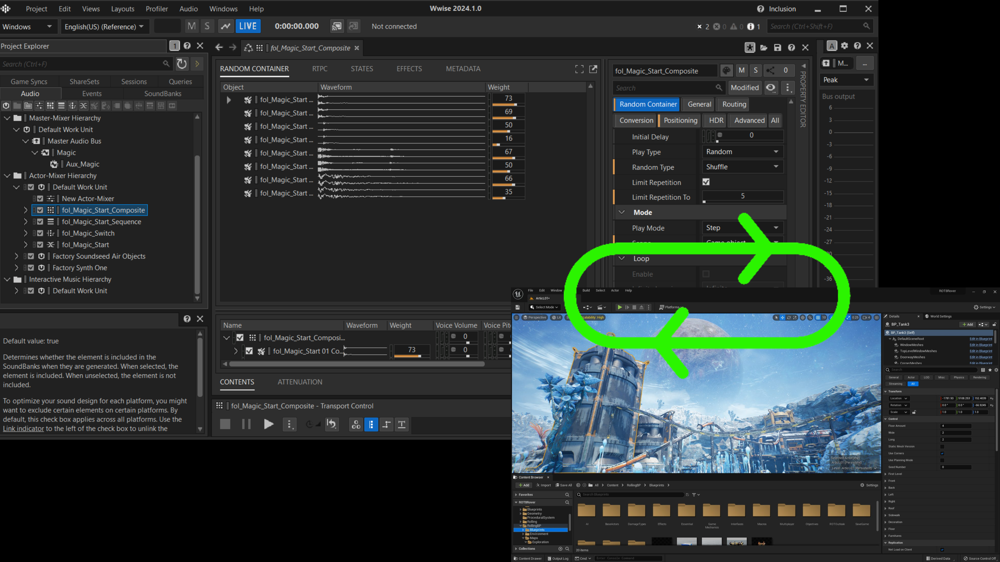

现在会在运行时将实施性能分析时所做的更改应用到游戏中而无需重新生成 SoundBank。支持的更改操作包括：

- 创建和移除 Actor-Mixer Hierarchy（声音、容器等）、Interactive Music Hierarchy（音轨、播放列表等）、ShareSet 以及 Event 中的各类对象。
- 对容器或播放列表的子对象重新排序或更改其父对象。
- 更改对象的输出总线。
- 重命名对象。
- 一些之前不可实时更改（显示为灰色）的次要属性现在也可以实时更改了。

由于这些改进，现在可在分析游戏性能的同时构建整个音频系统而无需生成或重新加载 SoundBank。

虽然大部分更改在游戏中都是无缝切换的的，但是如果会影响到当前在播放的音频结构，实时编辑时就可能会出现可辨的毛刺噪声。

通过 Live Media Transfer 的引入和实时编辑功能的扩展，我们在 DAW、Wwise 和游戏引擎之间构建了更加集中化也更方便迭代的实时工作流程。有关 Live Media Transfer、Live Editing、性能分析选项及相关影响的详细信息，请参阅[在分析游戏性能的同时实施编辑](https://www.audiokinetic.com/library/edge/?source=Help&id=editing_while_profiling)。

### Unreal 中对实时编辑所做的改进

此版本中对实时编辑所作的改进可为 Unreal Integration 用户提供很大的便利。现在无需经过烘焙便可对整个声音设计方案做迭代优化。在 Unreal Editor 中操作时，可通过 Wwise Browser 添加新的 Event 而无需生成 SoundBank。

## 对编辑工作流程的优化

在 Wwise 2022.1 中，我们引入了 Object Tab。Object Tab 方便在 Project Explorer 中快速导航。而且，还可像很多其他应用程序一样基于选项卡来显示属性和默认编辑器。凭借这一改进，用户可以更加轻松地访问默认编辑器。不过，这些编辑器的位置基本没变。另外，新的 Secondary Editor 也让访问更加便捷。Wwise 2024.1 则包含了更多对编辑流程的改进。

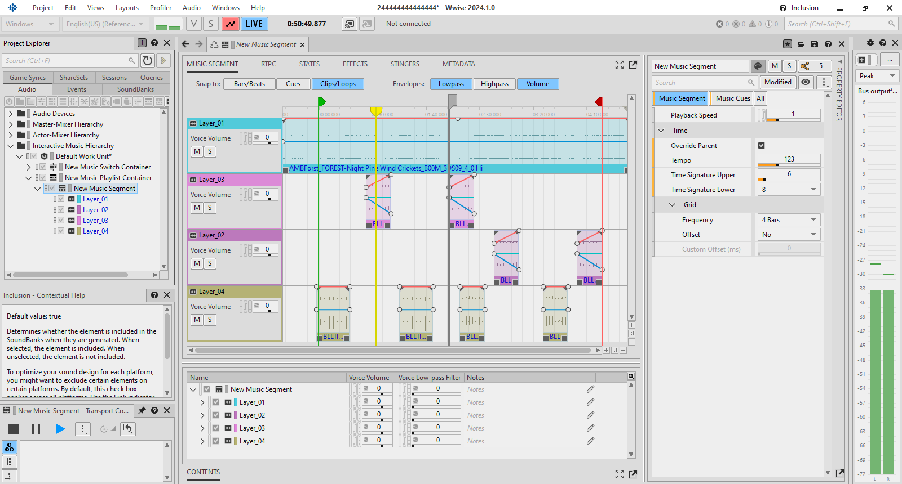

### Primary Editor：默认对象编辑器

在 2024.1 中，我们以 Primary Editor 的方式对默认对象编辑器的位置做了标准化设置。现在会在界面中间比较突出的位置统一显示对象行为。

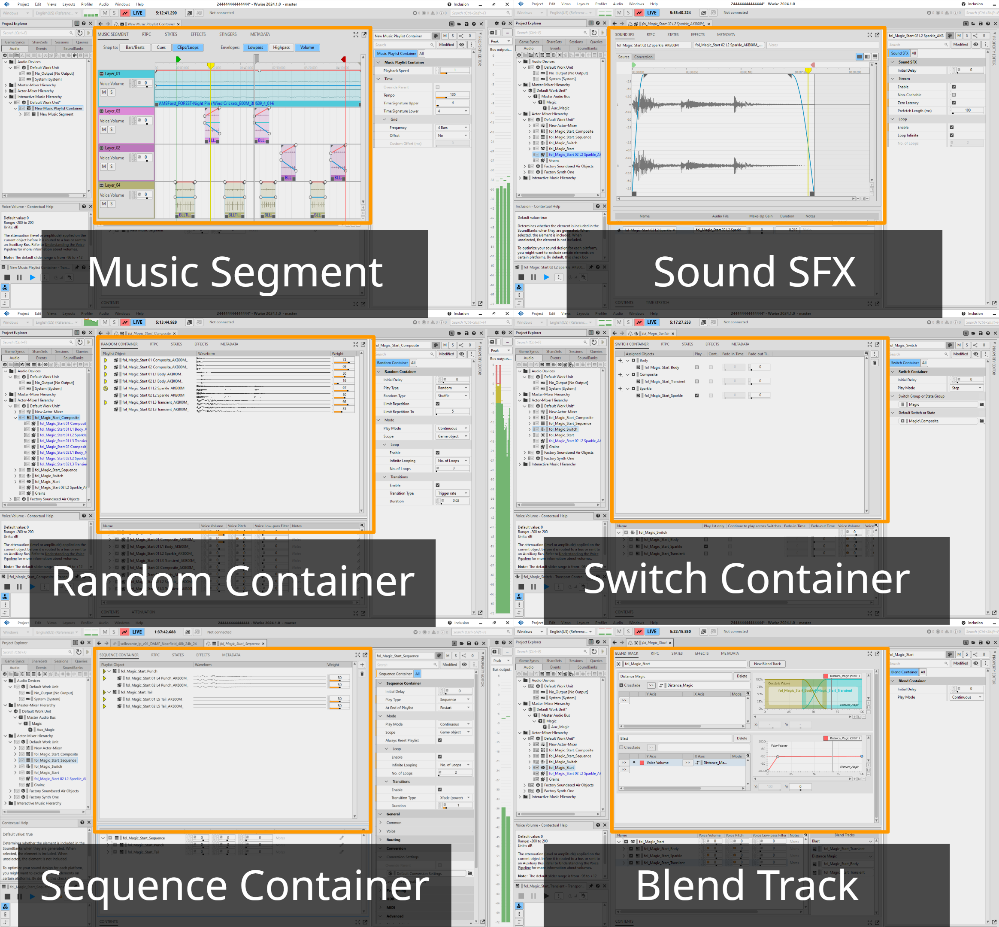

在做出这一改进的过程中，我们将部分属性移到了新的用户界面位置。其中包含了对以下对象编辑器的重大改进：

- Random Container Editor

  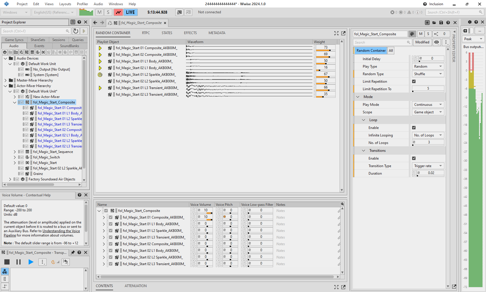
- Sequence Container Editor (Playlist)

  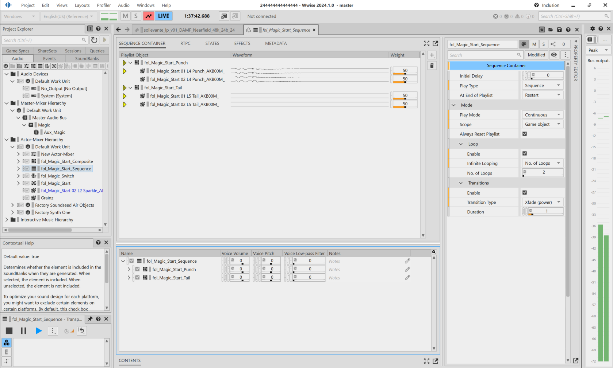
- Switch Container

  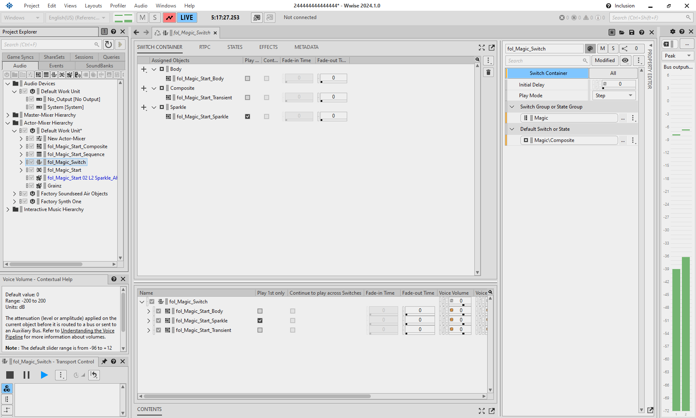

### Primary Editor 和 Secondary Editor：Maximize 和 Pop-Out

添加了用来最大化和弹出 Primary Editor 和 Secondary Editor 的图标。

### Secondary Editor：Contents Editor

对 Contents Editor 中的属性显示方式做了更新以减少冗余并提高效率。

### 对 Property Editor 的优化

对 Property Editor 进行了重新设计。现在以纵向布局的形式提供熟悉又便捷的体验。

**Property Editor：显示/隐藏属性类别**

基于这一改进，用户可选择在 Property Editor 内显示或隐藏属性类别，从而为不同的编辑工作流程提供便利。您可以保留熟悉的属性类别布局，或者根据需要选用新的组织形式。

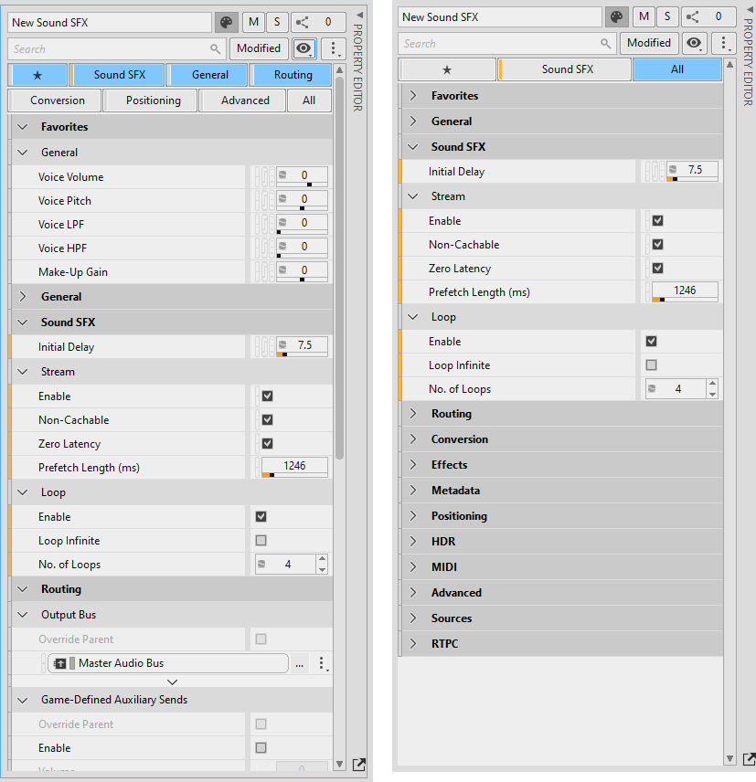

**Property Editor：其他功能**

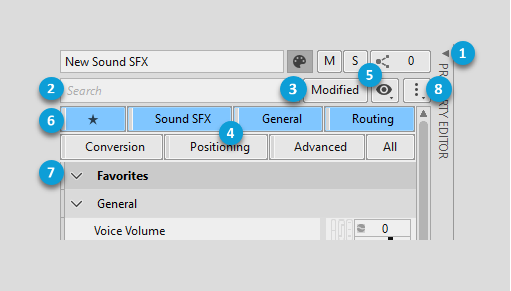

|  |  |
| --- | --- |
|  | **展开/折叠 Property Editor**：在折叠 Property Editor 时可为 Primary Editor 和 Secondary Editor 留出更多空间。这在这些编辑器中显示坐标图和曲线时特别有用。 |
|  | **搜索文本筛选器**：在键入属性名称时会对下方列表进行筛选。比如，若键入 pitch，则只在列表中显示名称中包含 pitch 的属性。 |
|  | **Modified**：在选中时只显示默认值被更改的属性。这些属性会显示橙色竖条。 |
|  | **类别筛选器**：在选中类别筛选器时会显示所有该类别的属性。可在按住 Ctrl 的同时单击选中多个类别筛选器，也可选中 **All** 来显示所有属性。 |
|  | **显示/隐藏类别筛选器**：在取消选中列表中的类别时会移除相应的类别筛选器。您可以选择 **Configure Favorites** 来打开对话框并根据需要选择各种属性，也可右键单击 Property Editor 中的任意属性并选择 **Add to Favorites**。在配置一些常用属性后，会显示常用属性类别筛选器 (6)。 |
|  | **Favorites**：选中该项可显示所有常用属性。 |
|  | **展开/折叠类别**：单击箭头可展开/折叠属性列表中的类别或分组。 |
|  | **更多选项**：可使用这些选项快速展开/折叠所有类别和分组或恢复为默认状态。 |

有关详细信息，请参阅[了解 Property Editor](https://audiokinetic.com/library/edge/?source=Help&id=getting_to_know_property_editor)。

## 对 Attenuation Editor 的改进

- **距离缩放百分比**
- **衰减曲线类别**

新的 Distance Scaling % 属性扩展了 Wwise 声音传播模拟功能。该属性位于 Attenuation Editor 中。其会列出引用衰减的对象。您可以按照最大衰减距离的百分比来对各个声音的距离进行缩放。在选中与对象对应的眼睛按钮时，会在 **Effective Max Distance** 字段和坐标图中反映对 **Distance Scaling %** 所做的更改。另外，现在还支持以可折叠类别的形式组织衰减曲线。

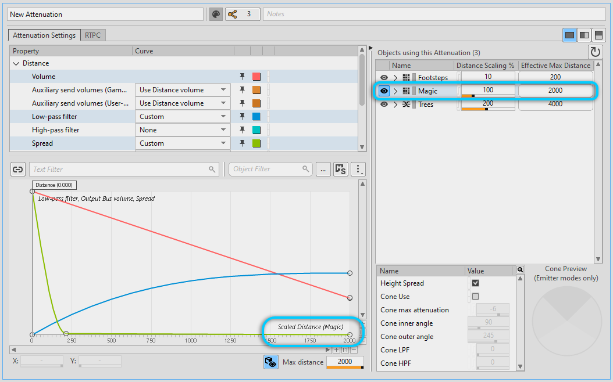

## 对 Light 和 Dark 主题的更新

对 Light 和 Dark 主题进行了更新，以增强可读性并缓解用眼疲劳。

# 集成

在 Wwise 2022.1 中，我们引入了 Auto-defined SoundBank。在使用这种 SoundBank 时，会为工程中的每个 Event 及其媒体生成 SoundBank。另外，还可采用混合策略来将 Event 分组存放到 User-defined SoundBank 中。该功能可与游戏引擎集成结合使用，来在运行时动态加载和卸载 Wwise 资源，确保仅将游戏所需的 Event 和 Media 加载到内存中。这一改进最初是为了给自研游戏引擎集成和 Wwise Unreal Integration 提供便利。在 2024.1 中，又进一步实现了对 Wwise Unity Integration 的支持。现在 Unreal 和 Unity 集成包都可使用 Auto-defined SoundBank。这样可以借助游戏引擎来简化素材管理并让设计师从这项任务中解脱出来。

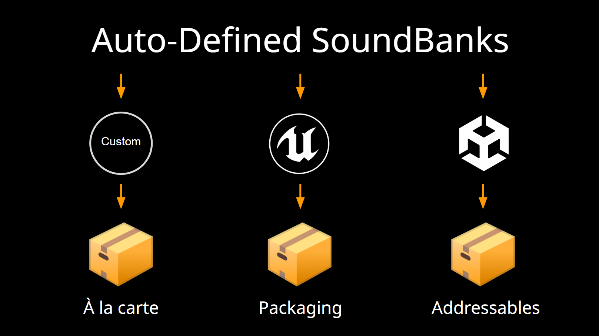

## Unity Auto-Defined SoundBank 和 Addressables

向 Wwise Unity 集成添加了对 Auto-Defined SoundBank 的支持，并可选择与 Unity 的动态素材管理系统 Addressables 结合使用。

## Unreal 打包

现在可依据 Unreal 打包标准将 Wwise 素材打包到 Unreal 素材中而非打包成单独的文件。新的选项可减少要打包的文件数并以此提升性能。有关详细信息，请参阅[将 Wwise 素材打包成批量数据](https://audiokinetic.com/library/edge/?source=UE4&id=using_features_package_as_bulk_data.html)。

全新打包功能有很多好处：

- 提高素材加载和卸载速度。
- 支持分块（如语言分块和用户特定分块）。
- 为 DLC 及其他素材的构建提供便利。
- 在打开工程或打包/烘焙时不会增加延迟。
- 允许实施模块化游戏构建和多进程烘焙。

## WwiseSoundEngine 插件模块化

对 WwiseSoundEngine 模块和 Wwise Sound Engine 库做了模块化处理，以便将这些库嵌入到其各自的 WwiseSoundEngine 插件中。这样就可移除 WwiseSoundEngine 模块和子模块以外的所有内容，从而简化对 WwiseSoundEngine 实现的定制化设计。

## “Null” SoundEngine

针对不完全支持的平台或未捆绑 SoundEngine 的情形（如服务器实例）添加了 “Null” SoundEngine。

# Spatial Audio：3D Audio

最近对 Spatial Audio 所做的改进可提高准确度并突显已有 Wwise 功能。3D Audio 会以中间格式将音频输送至终端 。这样方便在使用耳机时转码为双耳混音，或者转码为基于声道（含高度声道）的沉浸式混音。另外，Wwise Acoustics 还能以声学射线（与声能传输方向一致的直线）的形式来模拟声音的传播，从而在运行时结合引擎中的几何构造来构建逼真的空间声学模拟。

这些功能既可单独使用也可结合使用。藉此，可给听众以“听到的声音来自于其周围的世界”的感觉。

Wwise 现在支持在 Apple、Android、PlayStation、Xbox 和 Windows 平台上启用 3D Audio。这样可以为用户构建沉浸而富有想象力的音频体验提供更大便利。

在 Android 上，扩展了对 Open Sound Library for Embedded Systems (OpenSL ES) 的支持。现在支持在启用 3D Audio 时做各种空间化 Main Mix 配置。

为了在兼容的 Android 设备上支持 Dolby Atmos，Wwise 会将 5.1.4 或 7.1.4 的 Main Mix 声道配置下混为 5.1.2 以便做进一步的空间化处理。

## ADM 支持（实验功能）

针对 Audio Definition Model (ADM) WAV 文件的导入和播放添加了实验性的支持。这些音频源可包含基于对象的完整音频场景（带声道 Bed 和 3D 定位的动态对象）。这也为过场动画和沉浸音乐提供了另一种选择。 在导入音频文件时，会像常规 WAV 文件一样处理这些文件。ADM 文件可用作 Actor-Mixer Hierarchy 中的 Source，也可用作 Interactive Music Hierarchy 中的 Clip。

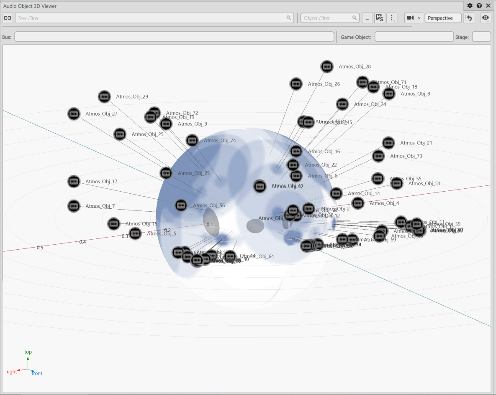

ADM 规格非常灵活。此 Wwise 版本添加了对其部分功能的支持。 尤其支持使用以下工具生成 ADM 内容：

- Avid Pro Tools 和 Steinberg Nuendo（在导出 Dolby Atmos Master ADM 时）
- REAPER 及 EAR Production Suite
- 360 WalkMix Creator

目前支持以下功能：

- 将声道 Bed 用于 Direct Speaker Panning
- 将单声道对象用作 3D 定位的动态对象（带动画）

ADM 通常会使用更多的声道。对此，有些硬件编解码器无法予以处理。在使用以下编解码器时，会保留 ADM 元数据：

- PCM
- ADPCM
- Vorbis
- Opus

有关此实验功能的各项已知问题，请参阅 [已知问题和限制](whatsnew_known_issues.html) 章节。

# Spatial Audio：Acoustics

## 对 Reflect 的改进及 Parameter Smoothing（实验功能）

对材料滤波做了优化。同时，向 Reflect 添加了相应设置以根据需要将材料滤波模式改为以下选项：

- **Favor Performance**：通过低架/高架滤波器模拟材料的声学属性（CPU 用量比原有方法低四倍）。在使用 Favor Performance 时，中低和中高频段的吸收并不是独立的，而是会共同形成中频增益。
- **Favor Quality**：通过精细的四频段滤波器逼真地模拟材料的声学属性（原有方法）。

添加了多项功能以便用户对 Wwise Acoustics 的性能和品质进行微调：

- 限制每个发声体可用衍射路径的最大上限（参见 [AkSpatialAudioInitSettings::uMaxDiffractionPaths](struct_ak_spatial_audio_init_settings_a94f819cee9905b9745f9d628aedf7cf2.html#a94f819cee9905b9745f9d628aedf7cf2) 和 [AK::SpatialAudio::SetMaxDiffractionPaths](namespace_a_k_1_1_spatial_audio_afa6911d223cce2c96613fa1ea824e6f1.html#afa6911d223cce2c96613fa1ea824e6f1) 章节）
- 自定义最大衍射系数：允许路径的衍射角度超过 180 度（参见 [AkSpatialAudioInitSettings::fMaxDiffractionAngleDegrees](struct_ak_spatial_audio_init_settings_aa22a7e11434285a698fe938d477e8279.html#aa22a7e11434285a698fe938d477e8279) 章节）。
- 自定义在声音穿过多个对象时如何累计透射损失系数（参见 [AkSpatialAudioInitSettings::eTransmissionOperation](struct_ak_spatial_audio_init_settings_a2580ab2686a91ec9e2f6038815ad6cec.html#a2580ab2686a91ec9e2f6038815ad6cec) 章节）。

Global Reflection Limit 为实验功能。您可以使用其来控制复杂环境下的 CPU 用量。首先，借助启发式计算对通过射线投射发现的潜在反射路径进行排序来决定哪些路径影响最为突出。然后，只针对最为突出的路径执行完整反射路径计算（具体由 [AkSpatialAudioInitSettings::uMaxGlobalReflectionPaths](struct_ak_spatial_audio_init_settings_a79d0a9ef505102dd2960e339e526f6b8.html#a79d0a9ef505102dd2960e339e526f6b8) 决定）。通过限制总共可执行多少次反射路径计算，可大幅降低 CPU 用量（参见 [AkSpatialAudioInitSettings::uMaxGlobalReflectionPaths](struct_ak_spatial_audio_init_settings_a79d0a9ef505102dd2960e339e526f6b8.html#a79d0a9ef505102dd2960e339e526f6b8) 和 [AK::SpatialAudio::SetMaxGlobalReflectionPaths](namespace_a_k_1_1_spatial_audio_a527726424152b0dd76d6a49828221ef8.html#a527726424152b0dd76d6a49828221ef8) 章节）。

Parameter Smoothing 为实验功能。您可以通过启用它来限制声学渲染参数随时间变化的速率。These parameters include diffraction, transmission loss, obstruction, occlusion, virtual position, and volume. 该功能解决了“在使用保守的射线投射和衍射设置时在不同声学环境下声音突然切入切出”的问题。藉此，不仅可以保证音频品质，还可降低 CPU 用量。参见 [AkSpatialAudioInitSettings::fSmoothingConstantMs](struct_ak_spatial_audio_init_settings_a406bea3f65e5fef84954eb2603b8ecd0.html#a406bea3f65e5fef84954eb2603b8ecd0) 和 [AK::SpatialAudio::SetSmoothingConstant](namespace_a_k_1_1_spatial_audio_a951213b89f613724613a2a0bea1bf80c.html#a951213b89f613724613a2a0bea1bf80c) 章节。

系统默认禁用被标记为“实验功能”的 Spatial Audio 功能。此类功能经过我们测试，而且应该不会出现问题。我们鼓励大家试用新的实验功能并为我们提供反馈和建议。

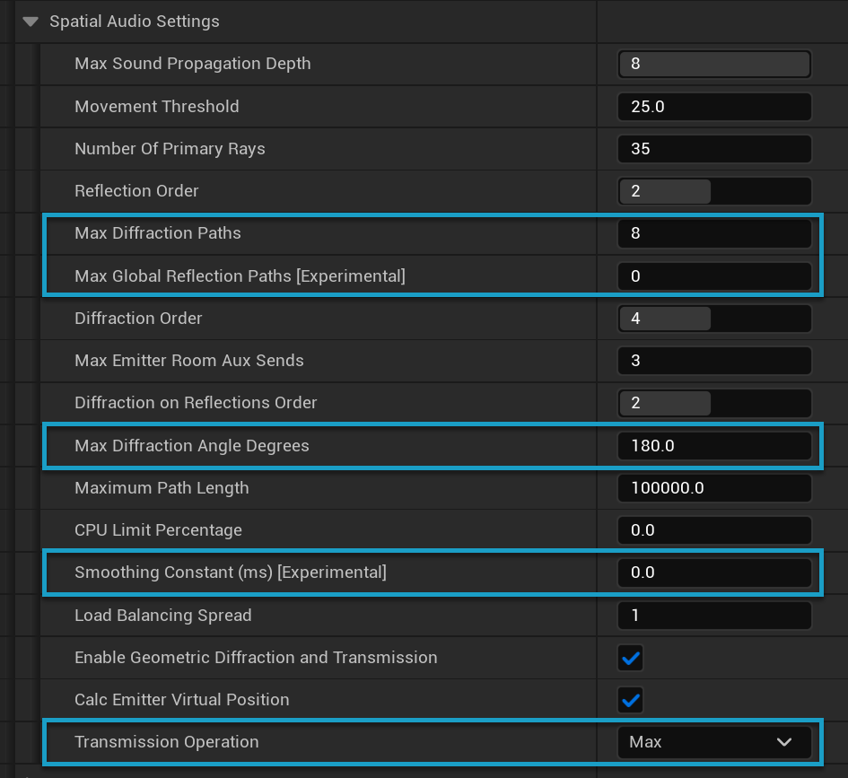

# SDK

## 对 Converted File Cache 的重构

为提高使用的便捷性并优化多平台开发，我们对 Converted File Cache 进行了重构。

- 将所有平台合并到了一起。当文件在不同平台上使用相同的设置时，只需转码一次。
- 转码后的文件别名将被用作文件名称，以避免文件重复并简化对缓存文件有效性的评估。

## 新的内存分配器

为了在整体上优化内存的使用、控制和监控，我们重写了 Wwise 的默认内存分配器，并使用 `AkMemoryArena` 替换了之前的 rpmalloc。下面列出了 `AkMemoryArena` 的一些优点。

- 相较于 rpmalloc，将内存用量降低约 10%
- 提供与大多数基于 TLSF (Two-Level Segregated Fit) 算法的通用内存分配器相当的碎片处理性能
- 保持内存资源的动态可扩展性，以便根据需要获取和释放新的内存空间而无需事先预留所有内存
- 提供各种配置选项以为游戏项目中的不同内存分配策略提供支持

在将 `AkMemoryArena` 集成到 Wwise 中后，还可对所用内存的布局进行分析以详细监控声音引擎中内存碎片随时间的变化。藉此，开发者可更好地了解、控制和优化 Wwise 的内存预留方式。

# WAAPI

向 Wwise Authoring API (WAAPI) 添加了多个与 Blend Container 相关的访问器：

- 现在可添加 Blend Track。
  - [ak.wwise.core.blendContainer.addTrack](ak_wwise_core_blendcontainer_addtrack.html)
- 现在可添加或移除 Blend Container Child Object 指派。
  - [ak.wwise.core.blendContainer.addAssignment](ak_wwise_core_blendcontainer_addassignment.html)
  - [ak.wwise.core.blendContainer.removeAssignment](ak_wwise_core_blendcontainer_removeassignment.html)
- 现在可检索 Blend Container 子对象的指派。
  - [ak.wwise.core.blendContainer.getAssignments](ak_wwise_core_blendcontainer_getassignments.html)

# 平台支持

Wwise 现在支持以下平台：

- Apple VisionOS
- OpenHarmony (OHOS)

除此之外，还优化了对 WebGL 平台的实验性支持：

- 为不使用 Unity 的游戏集成人员添加了多线程支持。
- 现在支持 Unity 2023.x。不再支持 Unity 2022.x。

# 插件

对适用于 Windows 的 Motion 插件做了更新，添加了对 GameInput API 的支持。藉此，设计师可在 Wwise 设计工具中测试 Impulse Trigger 所用 Motion 插件在 Xbox One 和 Xbox Series 手柄上的行为，并在 Windows 上支持的游戏中使用 Impulse Trigger。在实施这一改进的过程中，我们还移除了 Motion Sink 插件对 DirectInput 的支持以及部分相关的 API。有关如何结合 Motion 使用 GameInput 的详细信息，请参阅 [集成 Wwise Motion](integrating_elements_motion.html) 章节。