# 新增功能概述 2023.1

|  |
| --- |
| Wwise SDK 2025.1.4 - Windows |

新增功能概述 2023.1

### 目录

- [Spatial Audio](#features_23_1_spatial_audio)
  - [3D Audio](#features_23_1_3d_audio)
    - [Dolby Wwise 整合](#features_23_1_dolby_partner)
    - [Apple 对 Spatial Audio 的支持](#features_23_1_apple_spatial_support)
    - [Android 对 Spatial Audio 的支持](#features_23_1_android_spatial_support)
  - [声学模拟](#features_23_1_acoustic_simulation)
    - [连续射线投射](#features_23_1_cont_ray_casting)
    - [Room 几何关系检测](#features_23_1_room_containment)
    - [对 Portal 反射实施了改进](#features_23_1_portal_reflections)
    - [对 Room Aux Send 模型进行了完善](#features_23_1_room_aux_send)
    - [Reverb Zone](#features_23_1_reverb_zones)
    - [减弱 Reflect 的相位偏移效应](#features_23_1_phasing_mitigation)
  - [Unreal Obstruction/Occlusion 改进](#features_23_1_unreal_obs_occ)
- [设计工具](#features_23_1_authoring)
  - [增加了单个对象可应用的效果器数](#features_23_1_increased_effects)
  - [Loudness Normalization 模式和 Target](#features_23_1_loudness_normalization)
  - [为 Project Migration 对话框添加了 Source Control 支持](#features_23_1_source_control_support)
  - [UI 改进](#features_23_1_ui_enhancements)
    - [为 Audio Device 添加了 Secondary Editor](#features_23_1_au_sec_editor)
    - [在 Secondary Editor 中包含了 Meter 选项卡](#features_23_1_meter_tab)
    - [Source Editor 和 Music Segment Editor 流程改进](#features_23_1_source_editor)
    - [Search 工具改进](#features_23_1_search_filter)
    - [User Layout](#features_23_1_user_layouts)
    - [对 Effect Editor 的选项卡进行了优化](#features_23_1_reoriented_effects)
    - [Effect Editor 优化](#features_23_1_effect_editor_opt)
    - [Blend Track 和 RTPC 坐标图改进](#features_23_1_graph_improvements)
    - [现代化的 3D 图形后端](#features_23_1_modernized_graphics)
    - [可调节 SoundCaster 中 Game Sync 列表的大小](#features_23_1_resize_lists)
    - [将 Display Options 对话框替换为了视图](#features_23_1_display_options)
  - [对性能分析同步实施了改进](#features_23_1_profiling_sync)
  - [使用 IP:PORT 进行远程连接（无需 UDP）](#features_23_1_remote_connect)
  - [为 Saved Files 设置了 Line Ending 选项](#features_23_1_line_ending)
- [WAAPI](#features_23_1_waapi)
- [WAQL](#features_23_1_waql)
- [集成](#features_23_1_integrations)
  - [Unreal Wwise Browser](#features_23_1_wwise_browser)
    - [Asset Reconcile](#features_23_1_asset_reconcile)
  - [Unreal Auto-Defined SoundBank 改进](#features_23_1_unreal_auto_defined)
  - [Unity 集成：支持 Enter Play Mode 选项](#features_23_1_unity_play_mode)
- [SDK](#features_23_1_sdk)
  - [标记回调](#features_23_1_marker_callbacks)
  - [TTS 源插件开发](#features_23_1_tts_source_plugin_development)
- [插件](#features_23_1_plugins)
  - [AK Channel Router 转换](#features_23_1_channel_router)
  - [Motion 插件支持更多平台](#features_23_1_motion_apple_support)
- [实验功能](#features_23_1_experimental)
  - [Live Media Transfer](#features_23_1_lmt)

Wwise 2023.1 对 Wwise 互动音频管线的核心功能进行了扩展，后续还会不断优化来帮助用户轻松实现自己的音频构想。随着用户界面的持续改进，Wwise Authoring API (WAAPI) 将为 Wwise 工作流程提供更强力的支持，届时会推出一系列便捷的编辑功能。同时，不断完善 Spatial Audio 并提升其易用性，确保在运行时实现复杂精细的空间定位。最终，在 Wwise 基础架构的基础上精益求精，为用户提供全面的互动音频解决方案。

# Spatial Audio

## 3D Audio

通过在 2021.1 中引入基于对象的音频管线，Wwise 添加了对 3D Audio 的原生支持。同时，构建了相应工作流程来帮助调整平台的混音，以便充分发挥 Spatial Audio 的空间定位优势。在输出声音时可根据需要设置定位精度，来灵活满足各种声道配置的混音需求（包括耳机的双耳合成）。Wwise 2023.1 在适用性和兼容性上做了进一步提升：在支持 Spatialization 的平台列表中除了已有的 Windows、Xbox 和 PlayStation 平台，还增添了 Apple 和 Android 设备。

### Dolby Wwise 整合

今年，Audiokinetic 与 Dolby 建立了合作伙伴关系，以便 Wwise 用户采用标准化的方式面向游戏制作和交付空间互动音频内容，同时确保灵活满足各种设备和平台的需要。有关 Wwise 和 Dolby 整合的详细信息，请参阅相关新闻稿。

### Apple 对 Spatial Audio 的支持

向 System Audio Device 添加了 Apple 平台对 3D Audio 的支持。现在 Mac 和 iOS 设备可在运行时运用 Apple Spatial Audio 功能。

### Android 对 Spatial Audio 的支持

向 System Audio Device 添加了 Android 平台对 3D Audio 的支持。现在包含 Android Spatializer 的 Android 设备可在运行时运用 3D Audio 功能。

## 声学模拟

玩家对环境的沉浸要求越来越高，所以需要增强动态音频的真实感。Wwise Spatial Audio 的目的在于突显声音和环境之间的内在关联性。为此，我们在 Spatial Audio 中融合了各种技术和创新并提升了操作的便捷性：基于对现实世界声学现象的理解提升技术准确性，灵活调节环境音频设置来满足对体验的审美需求，不断简化 Spatial Audio 功能以便所有人都能使用。

引入了连续射线追踪、Room 几何包含关系检测，同时对 Portal 反射实施了改进并完善了 Room Aux Send 模型、Reverb Zone 和 Reflect 去相关功能。藉此，可轻松满足用户对实时空间声学效果的需求。这些功能有助于运用最新模拟技术并提升声学模拟精度。同时，也体现了我们竭力帮助 Wwise 用户将创作理念完美融入到游戏体验中的一贯承诺。

### 连续射线投射

射线投射可为用户提供相应信息，驱动游戏几何构造来影响环境声。凭借对听者周围空间环境的感知，Wwise 可精准地呈现启用 Spatial Audio 的声音。在存在障碍物或几何构造时，射线会告知要为声音应用怎样的声障、声笼、透射和衍射设置。在之前的实现当中，只有在听者的移动超出预定阈值时才会投射大量初级射线。在同一帧投射这些射线时，该帧的负荷会突然增加，导致 CPU 用量不时达到峰值。这样的移动阈值很难调节。现在，我们大幅减少了每帧投射的初级射线数。这样可将负荷分摊到多个帧，从而避免 CPU 用量达到峰值。藉此，可降低连续射线投射的总体成本，避开过时的移动阈值调节方式，简化实现过程并提升性能。

### Room 几何关系检测

Spatial Audio 依赖对声音所在 Room 的感知来基于听者执行各种计算。在改进之后，可快速确定哪个 Room 包含游戏对象（发声体）并自动加以指派。若某个 Room 完全包含在另一 Room 内，并且跟所在 Room 没有任何共有表面，就可以准确地自动确定正确的 Room。不过，若某个 Room 只有一部分包含在另一 Room 内，或者两个 Room 至少有一个共有表面，便很难确定要将声音指派给哪个 Room。现在可以为各个 Room 指派优先级编号，并借助优先级系统来确定要指派哪个 Room。若一个对象同时处在多个 Room 内（比如在某个 Room 包含在另一 Room 内时），会始终指派具有最高优先级的 Room；若优先级相同，会基于射线投射结果指派最里面的 Room。除此之外，现在还可借助 API 来覆盖为给定游戏对象自动指派的 Room。用户指定的 Room 将替换自动指派的 Room，除非用户非明确移除指定的关联 Room。

### 对 Portal 反射实施了改进

现在可在 Portal 之间自然地传播反射声。之前，在发声体和听者处于不同 Room 时，会以分段方式查找两者之间的路径。这种方式通过将不同的路径接合起来计算到 Portal 的值、Portal 之间的值和 Portal 到听者的值。过程比较复杂。现在，Spatial Audio 会使用随机射线投射引擎来通过 Portal 边缘受体查找整条路径，以便像普通几何构造一样模拟传播情形（包括在 Portal 之间自然地传播反射声）。

### 对 Room Aux Send 模型进行了完善

完善后的 Room Aux Send 模型在针对衍射、透射损失、声笼和声障更新信号流的同时，还允许发声体直接发送到所有相邻的、与听者有直达通路的 Room。这样就可模拟声音在环境中的传播情形，保留相关 Room 的混响并适当应用于最终混音。鉴于发声体现在会发送到相邻 Room，在发声体和听者处于同一 Room 但靠近打开的 Portal 时，声音会对临近 Room 产生激励作用。这一改进提高了应用于发声体的发送值的保真度。也就是说，现在可对各个 Room 的衍射进行不同的计算。之前，衰减是基于发声体-听者距离的；现在则基于路径的长度计算衰减，确保最终声音的一致性。

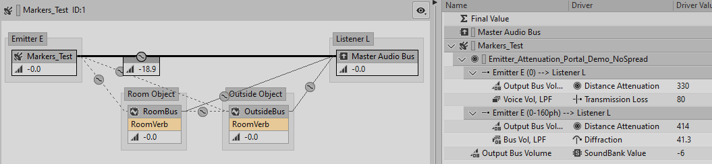

### Reverb Zone

在现有 Room 和 Portal 方法的基础上，Reverb Zone 扩展了对空间及其之间连接的定义方式。借助 Reverb Zone，无需 Portal 关联便可单独指定 Room 内的独立空间。随着现代环境的复杂化，对于逻辑上没有划分为单独 Room 的环境区域也经常需要设置自定义混响。而且在这种情况下，会很难或无法使用 Portal 将其分开。Reverb Zone 可以有多面墙壁，也可没有任何墙壁。它可以跟声音传播框架紧密集成：在适当情况下对混响、衍射、反射实施渲染。

|  |  |
| --- | --- |
|  | 发声体在 Room 内播放声音。 |
|  | 声音通过与 Reverb Zone 连通的 Portal 传出。 |
|  | 声音继续向外传播到 Reverb Zone 的父级 Room。在传到外部时，声音还会绕过几何构造所定义的障碍物进行衍射。 |

Reverb Zone 的应用情形包括：不带墙壁的遮盖区域、户外空间的森林区域、需要应用多个混响效果器的公共空间。跟标准的 Game-Defined Auxiliary Sends 相比，Reverb Zone 有很多优点：它们是完善后的 Room Aux Send 模型的一部分（参见上节），可以跟其他 Room 一起构成混响效果器链；它们的 3D 边界位置提供了进一步空间化处理的依据；它们可以跟 Wwise Spatial Audio 中模拟的其他声学现象（如衍射和透射）联动。

Reverb Zone 就是 Room，只不过多了两个属性：Parent Room 和 Transition Region Width。Reverb Zone 和 Parent Room 之间的父子关系形成一种层级结构，其允许在两者之间模拟声音传播：就像处在同一 Room 一样，无需连通的 Portal。父级 Room 可具有多个 Reverb Zone，但 Reverb Zone 只能有一个父对象。Reverb Zone 不能是自己的父对象。Portal 不能连通处于同一层级的 Room 和 Reverb Zone。自动创建的 'outdoors' Room 通常用作 Reverb Zone 的父级 Room，因为 Reverb Zone 常常用于模拟开放空间。Transition Region Width 代表 Reverb Zone 及其父对象之间的过渡区域。该区域以 Reverb Zone 几何构造为中心。它只在三角形透射损失设为 0 的情况下适用。

Unreal/Unity 集成包含 Reverb Zone 组件和相关函数。

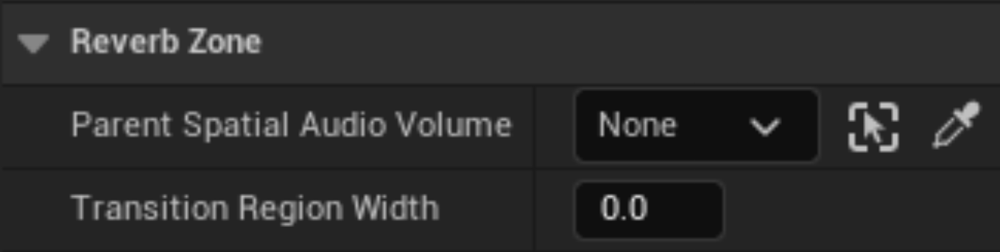

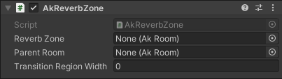

### 减弱 Reflect 的相位偏移效应

Reflect 插件现在提供两种方式来减弱相位偏移效应：Direct Sound Max Delay 和 Decorrelation Strength。Direct Sound Max Delay 可抑制反射声和直达声之间可能出现的相位偏移杂音；Decorrelation Strength 可控制滤波器来对反射的信号进行干扰，使其听起来跟未经干扰的信号差不多，同时避免在与直达信号混合时出现梳状滤波。此外，去相关滤波器还可用于拓宽立体声声场。

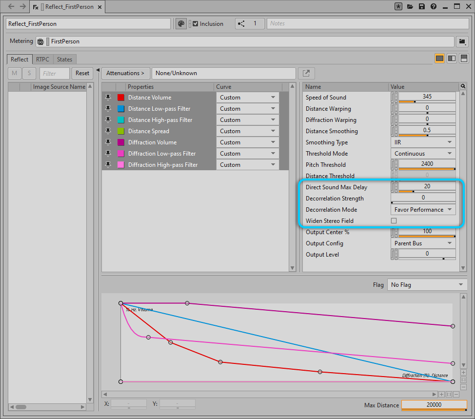

## Unreal Obstruction/Occlusion 改进

对 Spatial Audio 做了多项改进，简化了 Room 和 Portal 中 Obstruction 的使用。

AkComponent 包含 Collision Channel 和 Refresh Interval 相关属性。之前，这些属性仅用于计算处在同一 Spatial Audio Room 的发声体和听者之间的声障值或声笼值。在两者没有 Room 相隔时，应用声笼；在有 Room 相隔时，应用声障。

AkPortalComponent 也包含 Collision Channel 和 Refresh Interval 相关属性。之前，这些属性用于计算 Portal 的声障值和声笼值，会影响所有穿过门户的声音。

现在，在将 AkComponent 和 AkPortalComponent 的 Refresh Interval 属性设为非零值时，会在 AkComponent 及其听者（即便处在不同 Room）、同一 Room 的 AkComponent 和 AkPortalComponent、同一 Room 的各个 AkPortalComponent 之间计算声障。借助这种计算，可以精准地得出所发出声音的滤波量。用户可在包含 Spatial Audio 衍射和透射的场景中使用此功能，但要确保用于声障检查的 Collision Channel 不包含用于 Spatial Audio 衍射和透射的几何构造。

AkPortalComponent Collision Channel 和 Refresh Interval 之前的行为可通过声笼来实现。用户可在 Details 面板中设置初始声笼值，或在必要时使用 Blueprint 函数设置声笼值。藉此，针对开门或关门操作对声音进行调节。

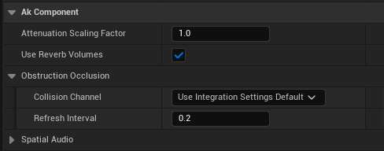

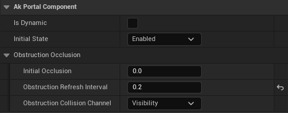

# 设计工具

## 增加了单个对象可应用的效果器数

单个对象可添加的效果器数由 4 个增加到了 255 个。如此一来，便可根据需要自由地运用动态或经过渲染的效果器了。这一改进在设有效果器属性的所有视图中均有体现，包括插入、编辑和监测效果器。

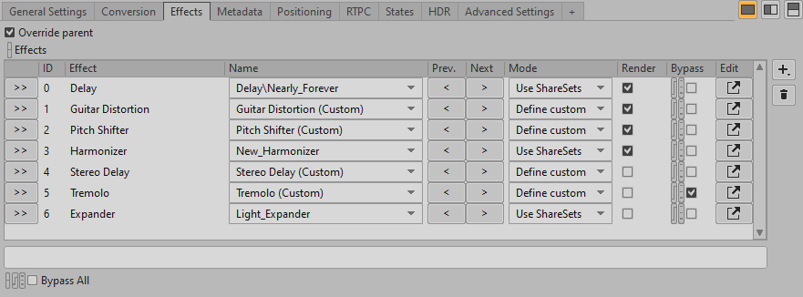

## Loudness Normalization 模式和 Target

为了在 Loudness Normalization 期间更加灵活地调控短时声音的响度测量，添加了 Momentary Max 类型以及对应的 Target 属性。现在可在 Integrated 和 Momentary Max 之间进行选择。前者适用于长的音频节目内容（如音乐或过场动画），后者适用于短的个别音频元素（如音效）。藉此，可在不同声音类别之间更加灵活对响度归一化进行非破坏性调节，确保采用一致的标准来构建互动混音。

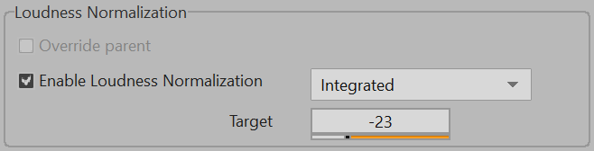

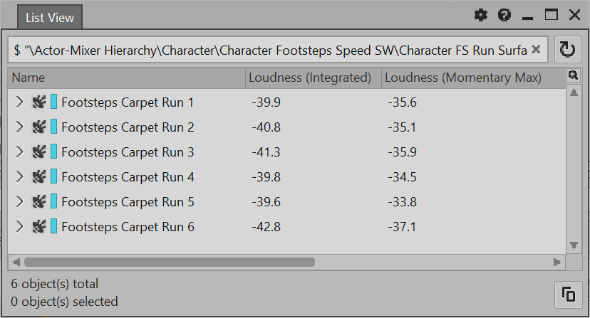

## 为 Project Migration 对话框添加了 Source Control 支持

为了在使用 Source Control 的情况下在工程迁移期间自动签出，向 Project Migration 对话框添加了相应的选项。

## UI 改进

以下章节详细介绍了对 UI 的各种改进。藉此，可优化空间的利用方式，并增强可理解性，确保实现起来更加便捷。

### 为 Audio Device 添加了 Secondary Editor

Audio Device Editor 现在包含 Secondary Editor。在此，可访问 Audio Device Meter 和 Effect Editor 选项卡。藉此，可保持在 Audio Device 上下文情境下浏览效果器及其属性，同时将电平表从 Primary Editor 移到与之对应的编辑选项卡。而且，无需离开 Object Tab 就可在跨平台 Mastering Suite 的 ShareSet 之间进行切换。

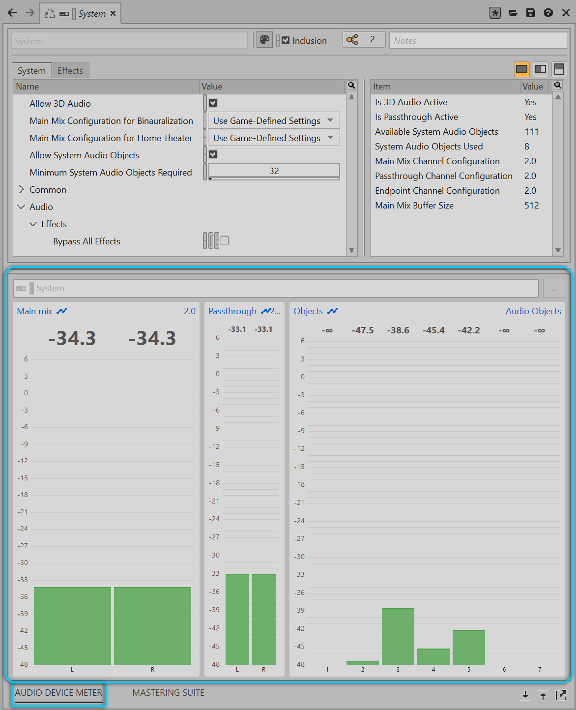

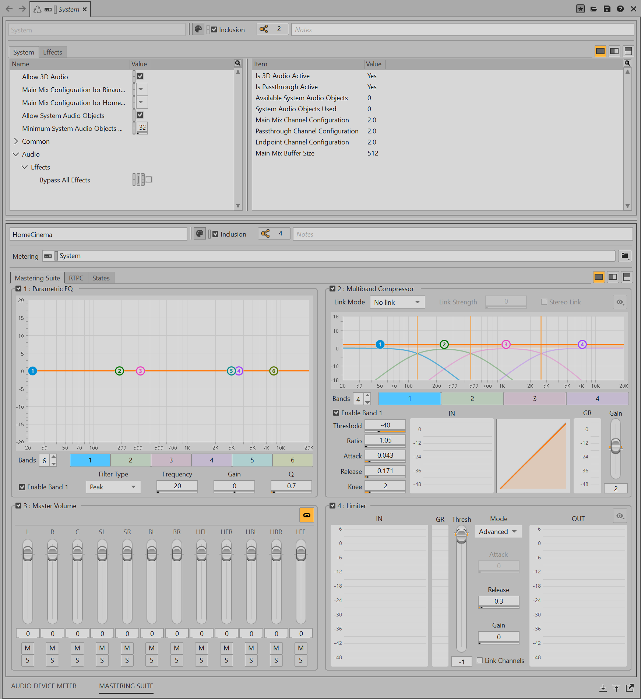

### 在 Secondary Editor 中包含了 Meter 选项卡

Audio Bus 现在在 Secondary Editor 中包含了 Meter 选项卡。用户可使用 Open in New Window (Alt+F11) 按钮将其解绑。这些 Meter 选项卡会被自动锁定。也就是说，它们跟四个 Meter Instance 都没有关联。这样就可以应用更多的 Meter，方便监控音频层级结构的不同部分。

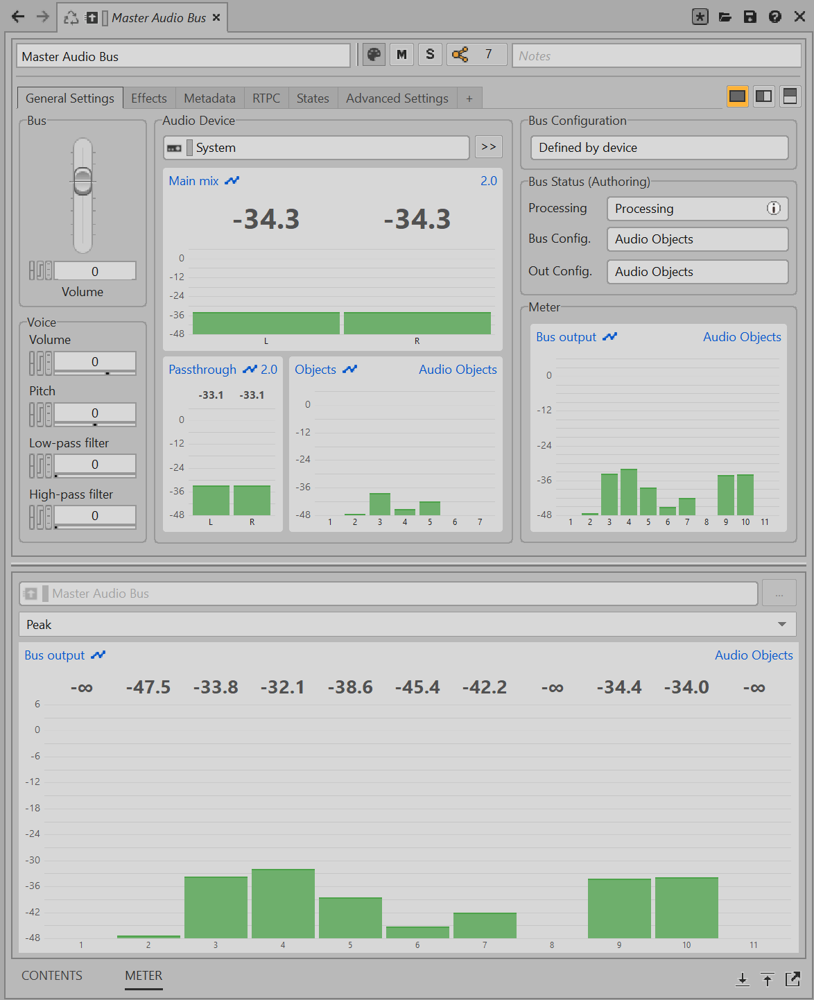

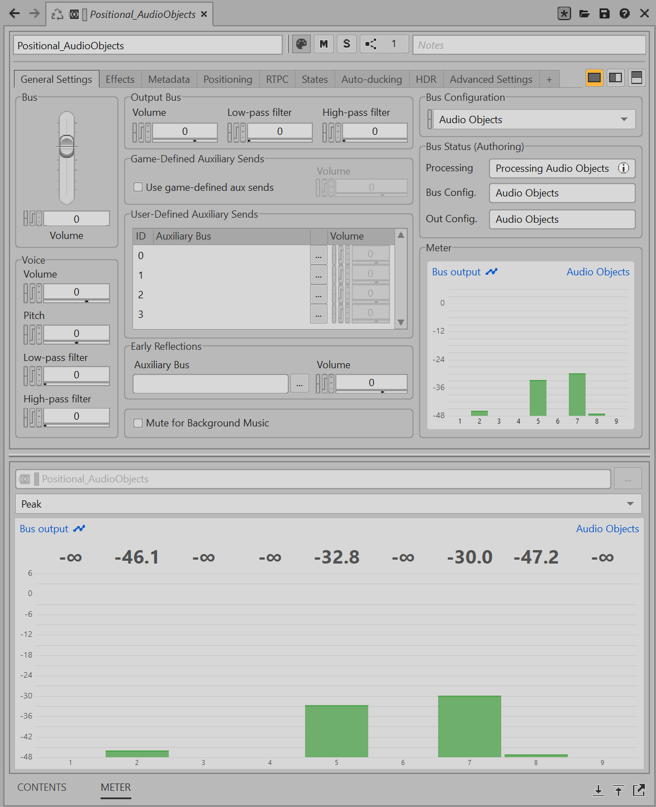

### Source Editor 和 Music Segment Editor 流程改进

现在可在 Source Editor 中更加灵活地调控试听和标记点操作。用户可通过在顶部时间线的任意位置单击来放置光标。随后，将光标拖到 Source 中的任意位置并显示精确的时间。除此之外，还可在按住 ALT 键的同时将鼠标悬停在 Music Segment Editor 中的标记点、光标或提示之上，来显示时间并沿着时间线拖动。

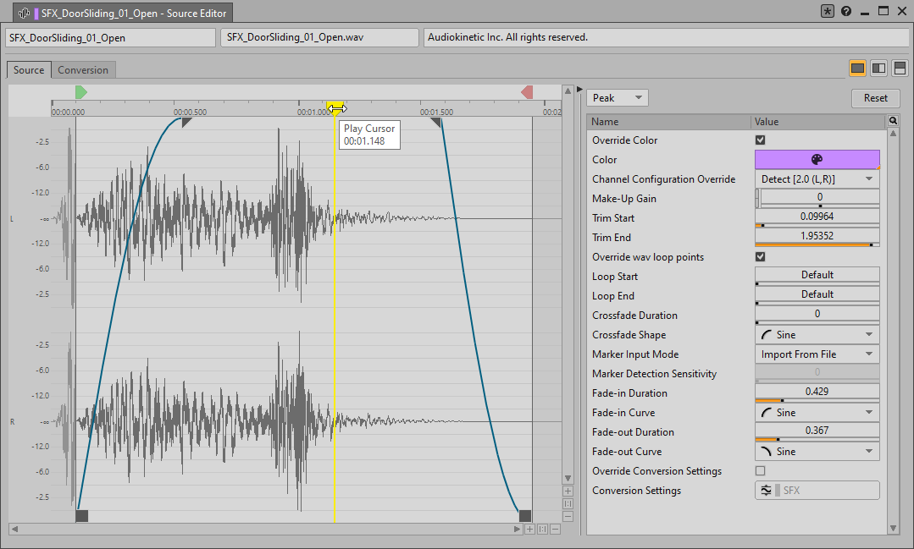

### Search 工具改进

现在可以使用方向键浏览 Search 工具结果。结果列表中的对象选择操作会反映在 Recycle 对象选项卡以及 Transport Control 中（便于试听）。除此之外，还可右键单击结果列表中的对象来访问快捷菜单（无需离开当前聚焦的 Object Tab），并使用键盘快捷方式进行选择。

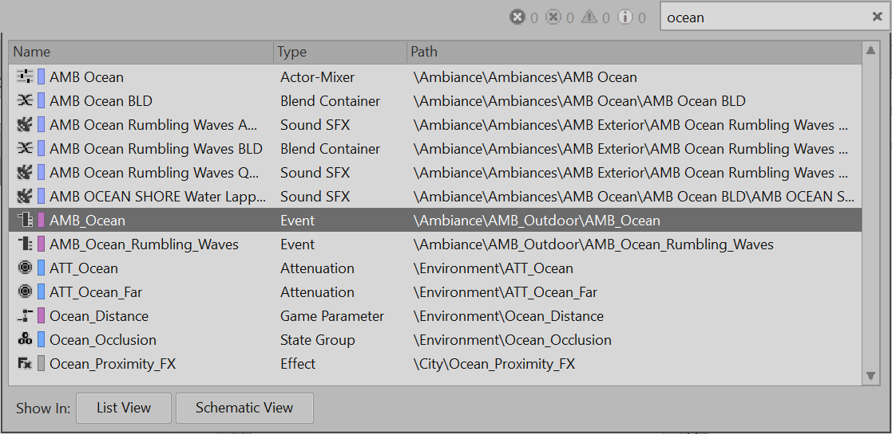

### User Layout

为了便于保存自定义的视图配置，向 Layouts 菜单添加了四个 User Layout。现在无需修改默认布局就可创建个性化的布局来为特定工作流程提供支持。

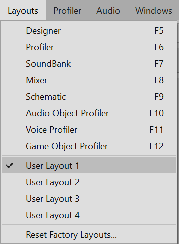

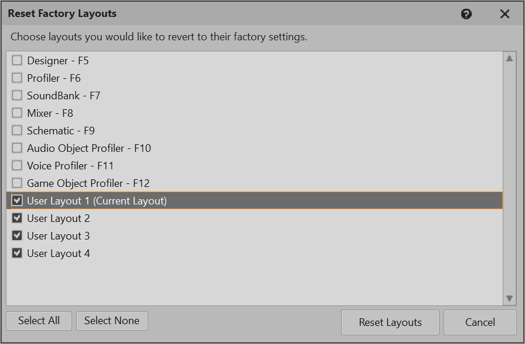

### 对 Effect Editor 的选项卡进行了优化

所有效果器编辑器的布局都进行了优化。现在会在 Secondary Editor 内并排显示各个效果器。另外，现在会将编辑器的最大高度设为效果器的最大高度，除非手动调节了 Secondary Editor 的高度。

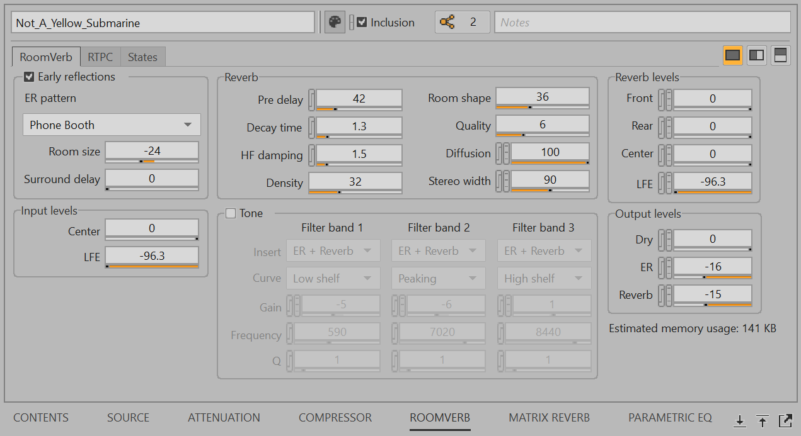

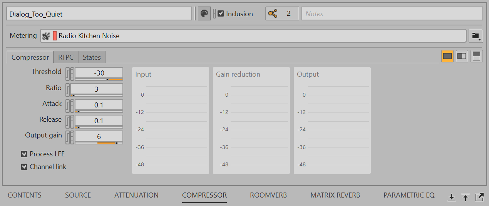

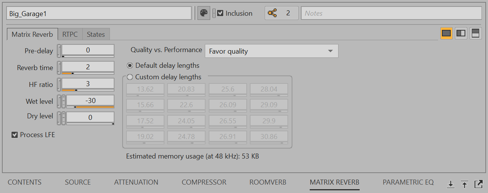

### Effect Editor 优化

Effect 列表中添加了用来添加和删除效果器的按钮，并新增了快捷菜单项以便将效果器插入到特定插槽。现在可将 Effect ShareSet 拖放到列表中，并选中列表中的多个条目来复制/粘贴或删除效果器。除此之外，还对空白区域进行了优化以使 UI 元素的呈现更加整洁。

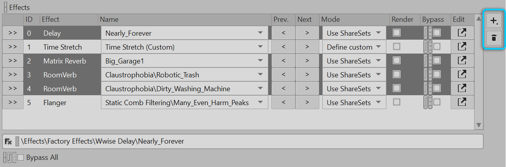

### Blend Track 和 RTPC 坐标图改进

对 Blend Track 和 RTPC 坐标图做了细微的改进，并对坐标图占用的空间进行了优化。现在会层叠显示对象名称。除此之外，还可根据需要设定不同的字体大小。

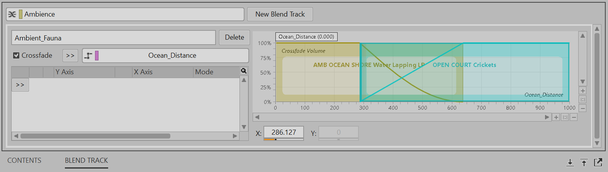

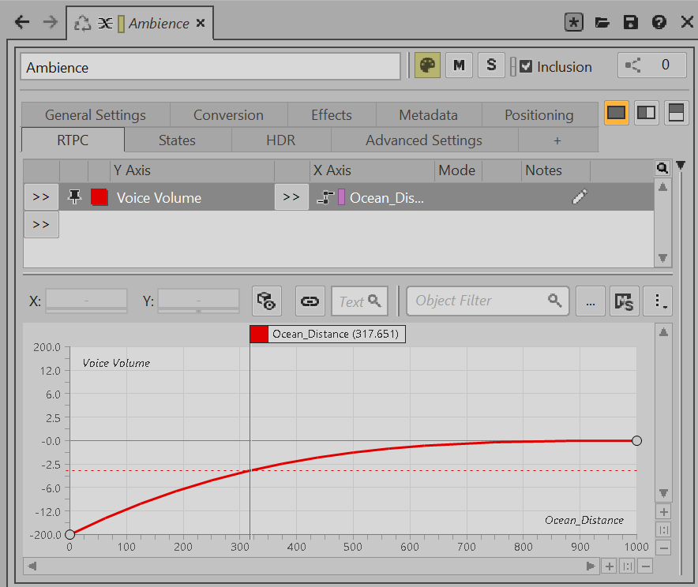

### 现代化的 3D 图形后端

现在使用现代化的 3D 图形后端替换了 DirectX 9 实现。藉此，来显示 Game Object 3D Viewer、3D Meter 和 Audio Object 3D Viewer。这还带来了硬件兼容性的增强以及用户体验的提升。用户可在 Game Object 3D Viewer 中更更加便捷地浏览、缩放和切换列表项。

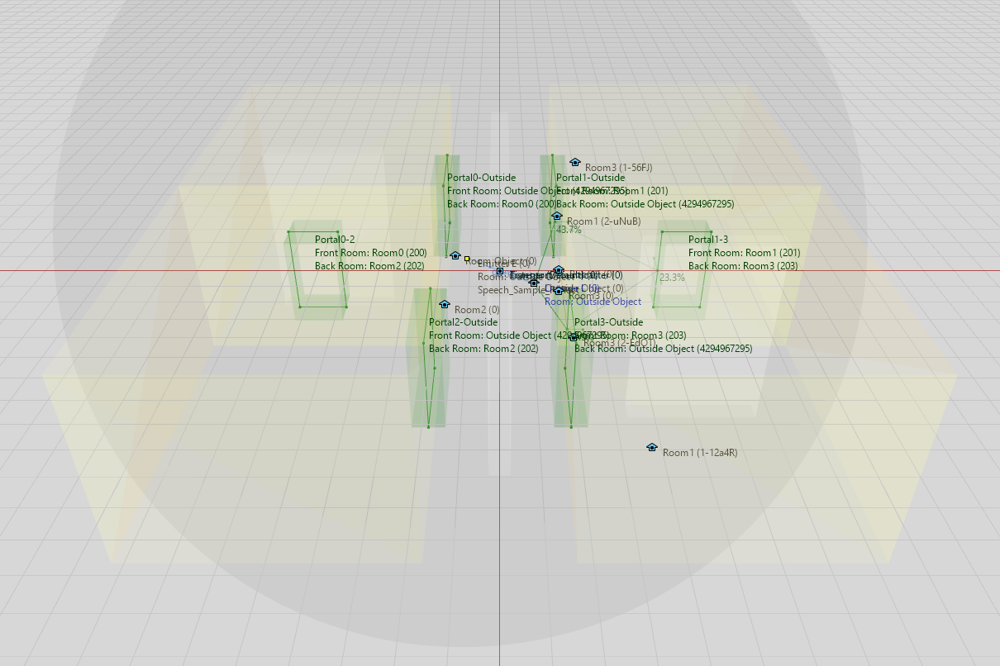

### 可调节 SoundCaster 中 Game Sync 列表的大小

现在可将 SoundCaster 中 Game Sync 列表调节为不同的长度。

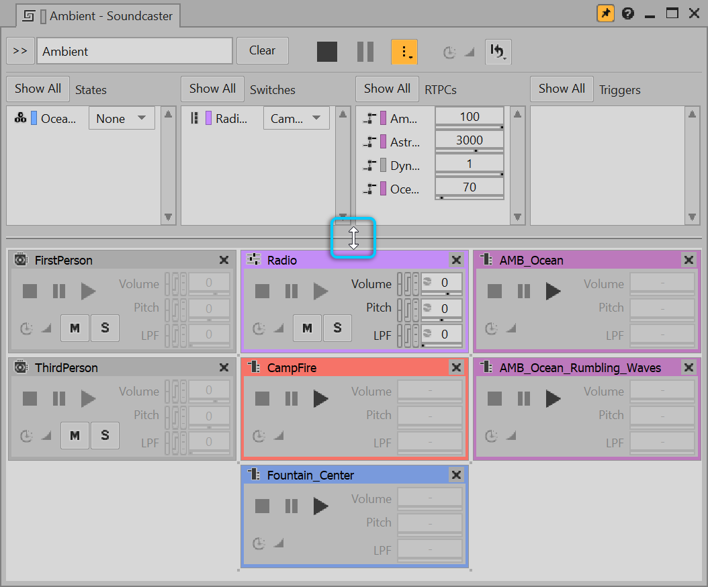

### 将 Display Options 对话框替换为了视图

现在将 Capture Log、Audio Object 3D Viewer 和 Game Object 3D Viewer 的显示选项放在了视图而非对话框内。您可以根据需要停靠视图以便快速访问。

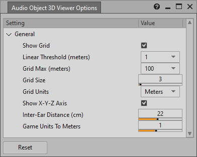

## 对性能分析同步实施了改进

为了将来对实时编辑做进一步的优化，对远程连接时的同步操作实施了改进。在选择 Profile and Edit (Sync All Modified Objects) 时，一经连接便会同步所有在远程实例中加载的对象（在连接的情况下加载 SoundBank 时也会如此）。

## 使用 IP:PORT 进行远程连接（无需 UDP）

现在可以在之前不支持的网络环境下连接 Wwise。

## 为 Saved Files 设置了 Line Ending 选项

现在为 Saved Files 设置了两个可选的 Line Ending 选项：LF (default) 和 CRLF。Wwise 2021.1.14 和 Wwise 2022.1.9 也包含此功能。

Wwise 会为以下所有文件应用选定的行结束符：

- 工程文件： `.wproj`
- 工程设置文件： `.wsettings`
- Work Unit 文件： `.wwu`
- `Wwise_IDS.h`
- SoundBank 文件：
  - Bank、Event 和 Bus 文件： `.xml`、 `.json`、 `.txt`
  - `ProjectInfo.xml`、`ProjectInfo.json`
  - `PlatformInfo.xml`、`Platform.json`
  - `SoundbanksInfo.xml`、`SoundbanksInfo.json`
  - `PluginInfo.xml`、`PluginInfo.json`

此选项可在 Project Settings 的 General 选项卡中找到。

# WAAPI

- WAAPI 音频文件导入
  - 现在可在 ak.wwise.core.object.set 中执行音频文件导入。
- 新增 WAAPI 函数
  - 向 Wwise Authoring API 添加了新的函数，以便访问可用的操作和属性，进而改善 Wwise 设计工具的开发流程。
  - 工程：添加 Wwise 工程加载和工程创建相关控件。
    - ak.wwise.console.project.close
    - ak.wwise.console.project.create
    - ak.wwise.console.project.open
    - ak.wwise.ui.project.create
  - Mute/Solo：添加 Mute/Solo 状态相关控件。
    - ak.wwise.core.audio.mute
    - ak.wwise.core.audio.solo
    - ak.wwise.core.audio.resetMute
    - ak.wwise.core.audio.resetSolo
  - 对象：添加对 Linking、State 和 Undo/Redo 属性的支持。
    - ak.wwise.core.object.isLinked
    - ak.wwise.core.object.setLinked
    - ak.wwise.core.object.setStateGroups
    - ak.wwise.core.object.setStateProperties
    - ak.wwise.core.undo.redo
  - Profiler：添加更多 Profiler 信息，并允许保存捕获数据。
    - ak.wwise.core.profiler.getCpuUsage
    - ak.wwise.core.profiler.getLoadedMedia
    - ak.wwise.core.profiler.getPerformanceMonitor
    - ak.wwise.core.profiler.getStreamedMedia
    - ak.wwise.core.profiler.saveCapture
  - Source Control：添加 Source Control 操作。
    - ak.wwise.core.sourceControl.add
    - ak.wwise.core.sourceControl.checkOut
    - ak.wwise.core.sourceControl.commit
    - ak.wwise.core.sourceControl.delete
    - ak.wwise.core.sourceControl.getSourceFiles
    - ak.wwise.core.sourceControl.getStatus
    - ak.wwise.core.sourceControl.move
    - ak.wwise.core.sourceControl.revert
    - ak.wwise.core.sourceControl.setProvider
  - 其他
    - ak.wwise.core.executeLuaScript
    - ak.wwise.debug.generateToneWAV
    - ak.wwise.core.log.addItem
    - ak.wwise.core.log.clear
  - 主题：
    - ak.wwise.core.log.itemAdded: new 'SourceControl' channel added
- WAAPI Work Unit 和 Perforce
  - 现在支持在 **waapi-server** 模式下通过命令行执行 Source Control 操作。
  - 现在会静默执行涉及 Source Control 的 WAAPI 操作（不会出现弹窗）。
  - 现在支持在 WAAPI 函数内执行 Work Unit 操作。
  - 现在支持在多个 WAAPI 函数中执行 Automatic Source Control Check Out/Add 操作。
  - 通过 WAAPI 添加了整套 Source Control API。
- 对象模型
  - 对以下元素进行了重构，现在可在 WAAPI 和 WAQL 中访问：
    - Random/Sequence Container 中的 Playlist
    - Audio File Source 中的标记点
    - Music Switch Container 中的关联和参数
    - Dialogue Event 中的条目
    - Music Stinger 中的 Trigger 和 Segment 引用
    - 音乐对象中的 Transition 根对象
    - Music Sequence Container 中的 Playlist 根对象

# WAQL

- 向 WAQL 添加了列表支持。
- 添加了以下列表函数：
  - count(CONDITION?)
  - any(CONDITION?)
  - all(CONDITION?)
  - first(CONDITION?)
  - last(CONDITION?)
  - take(NUMBER)
  - skip(NUMBER)
  - at(NUMBER)
  - where(CONDITION)
- 在 return 表达式中添加了别名。
- 现在支持返回复杂的结构和数组。
- 在 WAQL 表达式和查询中添加了以下访问器：
  - nodeType
  - originalRelativeFilePath
  - loudness.integrated
  - loudness.momentaryMax
  - stateProperties
  - stateGroups
  - validity.details
  - validity.severity
  - validity.isValid

# 集成

## Unreal Wwise Browser

Wwise Browser 也包含在 Wwise 2022.1.5 中，它取代了 Wwise Unreal 集成中的 Wwise Picker。其中包含 Wwise 和 Unreal 素材的状态，同时设有 SoundBank、UAsset 和 Type 筛选器。藉此，可轻松查看处于不同状态的工程元素。借助新增的右键单击快捷菜单，可从 Unreal 浏览工程并执行走带控制等各种操作。有关更多详细信息，请参阅[Managing Assets with the Wwise Browser](https://www.audiokinetic.com/library/edge/?source=UE4&id=features_editor_wwise_browser.html)。

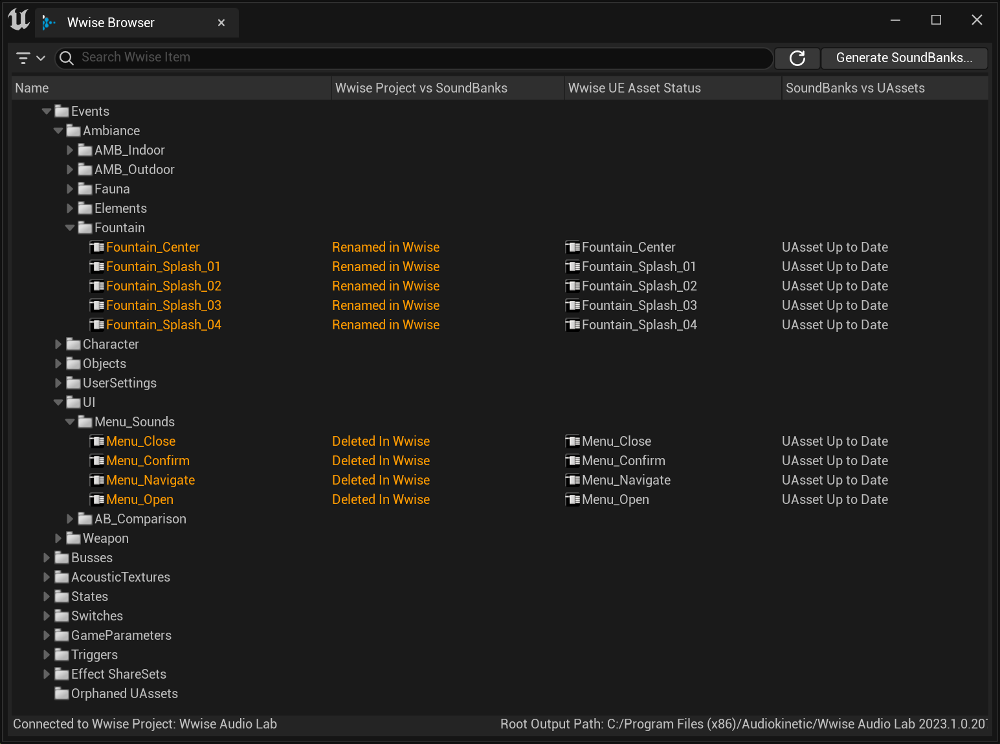

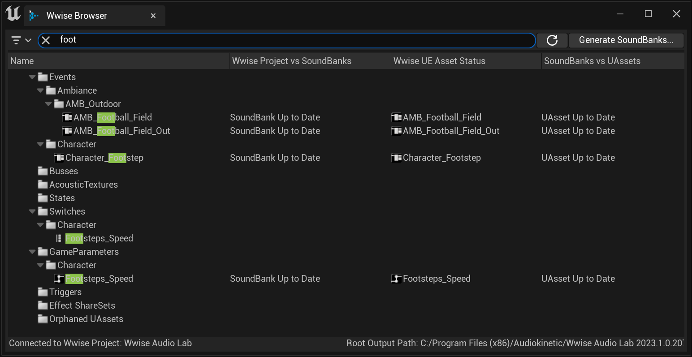

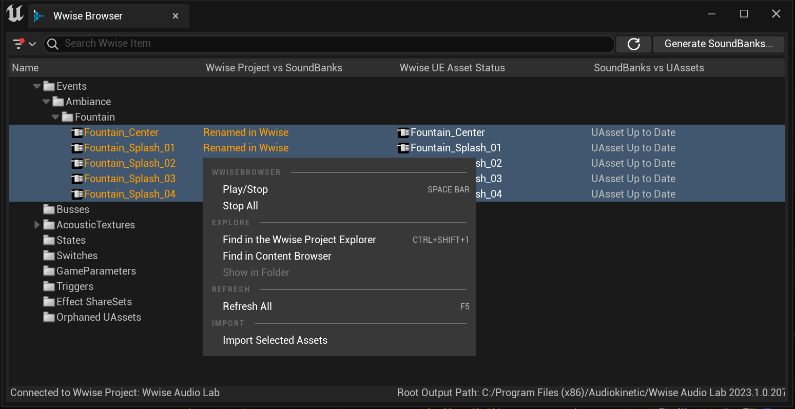

### Asset Reconcile

Wwise 2022.1.6 中向 Wwise Browser 添加了素材调和 (Asset Reconcile) 功能。现在可通过 Wwise Browser 本身或利用 Commandlet 来调和不同步的素材。有关详细信息，请参阅[调和 Wwise UAsset](https://www.audiokinetic.com/library/edge/?source=UE4&id=features_editor_reconcile.html)。

您可以通过模块来启用自动同步。

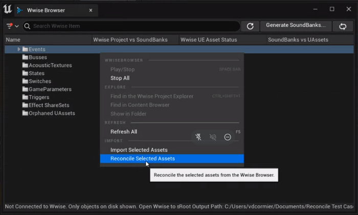

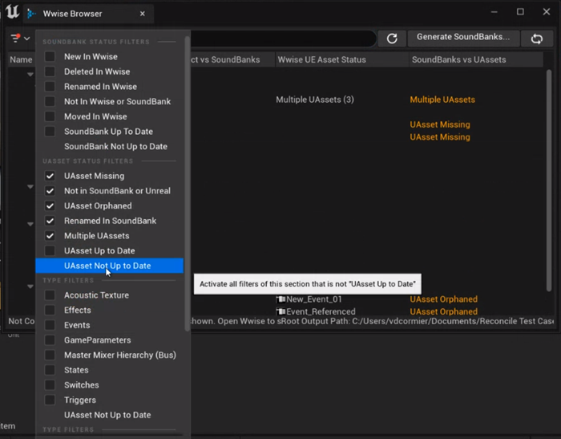

## Unreal Auto-Defined SoundBank 改进

基于来自 Wwise 社区的反馈和建议对 Auto-defined SoundBank 工作流程的稳定性做了整体改进。

## Unity 集成：支持 Enter Play Mode 选项

Wwise Unity 集成现在提供 Enter Play Mode 选项，以缩短从 Editor 进入 Play 模式所需的时间。

# SDK

## 标记回调

标记回调通知结构 `AkMarkerCallbackInfo` 现在会提供标签文本的大小。开发者可使用此信息在 WAV 文件标记内嵌入自定义数据来触发游戏事件。

## TTS 源插件开发

为了便于开发语音合成 (TTS) 源插件，SDK 现在允许源插件向游戏发送数据并从游戏接收数据。

借助 [AK::IAkSourcePluginContext::GetPluginCustomGameData()](class_a_k_1_1_i_ak_plugin_context_base_ac1312db4f8b44c176e9064f258c020a3.html#ac1312db4f8b44c176e9064f258c020a3)，插件可检索通过 [AK::SoundEngine::SendPluginCustomGameData()](namespace_a_k_1_1_sound_engine_a25efe2a9b18ad130f4fc4c0c3599ec30.html#a25efe2a9b18ad130f4fc4c0c3599ec30) 从游戏向其发送的数据。

源插件现在可生成标记通知。详请参阅 [Marker Generator 源插件示例](soundengine_markers.html#soundengine_markers_plugins_example) 章节。

在源插件内，可使用 `AK::IAkPluginServiceMarkers::CreateMarkerNotificationService()` 创建 `AK::IAkPluginServiceMarkers::IAkMarkerNotificationService` 实例。然后，可使用 `AK::IAkPluginServiceMarkers::IAkMarkerNotificationService::SubmitMarkerNotifications()` 将标记通知发给使用 `AkAudioMarker` 结构的游戏。

# 插件

## AK Channel Router 转换

AK Channel Router 由混音器插件转换为了 Object Processor 效果器插件。用户可使用 AK Channel Router 插件对具有不同声道配置的总线实施混音并输出到同一条总线。这在输出设备具有多个声道且需要非标准输出配置时特别有用。在总线上插入此效果器后，可将 Channel Router Setting Metadata 添加到任意子总线来配置子总线所输出到的声道。此插件仅可插入到将 **Bus Configuration** 设为 **Audio Objects** 的总线上。不可将该插件添加到 Master Audio Bus。

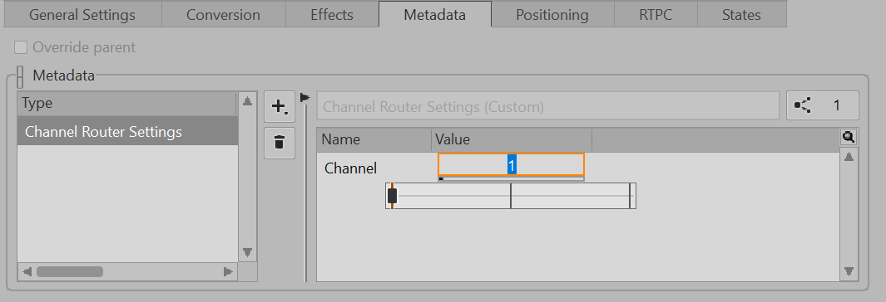

## Motion 插件支持更多平台

现在可使用 Motion 插件在 iOS、tvOS 和 macOS 上提供触觉和振动效果。

# 实验功能

## Live Media Transfer

这一仍在开发的功能旨在缩短连接游戏时的迭代时间。藉此，可添加或修改声音媒体并在不重新生成 SoundBank 的情况下试听效果。音频源、AK Convolution 插件所用的冲激响应文件和 MIDI 都可执行所述操作。您可以采用常规工作流程来创建新的 Sound SFX 和 Music Segment。比如，使用 Audio File Importer 对话框导入音频文件，或将 WAV 文件拖放到 Project Explorer 中。

Live Media Transfer 为实验功能，默认情况下不会启用。您可以在 User Preferences 中手动启用该功能，还可通过 **Max memory for Media updates** 设置来限制其所用的内存量。

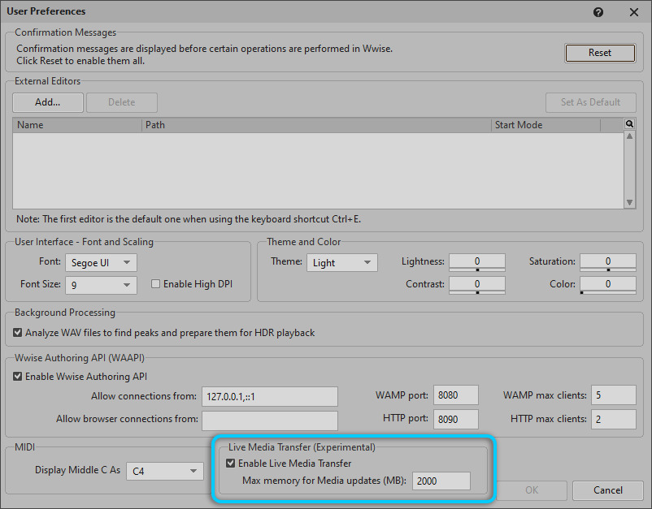

新添加的和修改后的媒体不会替换磁盘上或游戏数据包中的文件；它会驻留在内存中，直至游戏终止。在此过程中，只会传输在 Wwise 工程中添加或修改且游戏正在使用的媒体。

您可以在 Advanced Profiler 的 Loaded Media 选项卡中追踪 Live Media Transfer 所用的内存量。在 SoundBank Name 列中，会为基于此功能传输的媒体添加 From Authoring 标记。

Advanced Profiler 的 Memory 选项卡的 **Used** 值和 Performance Monitor 的 **Total Used Memory** 中也会包含 Live Media Transfer 所用的内存量。记住，这种内存增加只是暂时的，打包好的游戏所用的内存量会低一些。

已知问题：

- 在添加或修改媒体时，首次播放媒体时可能会略有延迟。
- 会在下次播放声音时播放新添加的媒体；并且，不会立即用其替换当前播放的声音。
- 对于循环声音，只有在停止或重新开始播放时才会更新。

如在使用此实验功能时遇到其他问题，请报告给我们以便在未来版本中改进。