# 新功能概述 2022.1

|  |
| --- |
| Wwise SDK 2025.1.4 - Windows |

新功能概述 2022.1

### 目录

- [设计工具](#features_22_1_authoring)
  - [编辑工作流程](#features_22_1_editing_workflow)
  - [布局更新](#features_22_1_layouts)
  - [Project Explorer Search](#features_22_1_pe_search)
  - [Paste Properties](#features_22_1_paste_properties)
  - [改进了 Attenuation Editor 的外观并添加了新的曲线](#features_22_1_attenuation_editor)
  - [Auto-Defined SoundBank](#features_22_1_auto_soundbank)
  - [在 File Manager 中添加了 Generated Files 选项卡](#features_22_1_generated_files)
  - [Transport Control 界面更新](#features_22_1_transport)
  - [Contextual Help 和 Capture Log 错误消息](#features_22_1_contextual_help)
  - [Filter Behavior：Use highest value](#features_22_1_filtering)
  - [复制和粘贴 State Group 及 State 值](#features_22_1_copy_states)
  - [Event Action：Show State/State Group](#features_22_1_event_states)
  - [Performance Monitor](#features_22_1_performance_mon)
  - [Selection Channel 和 Meter Instance](#features_22_1_selection_channels)
  - [鼠标滚轮的缩放和移动体验](#features_22_1_mouse)
  - [键盘快捷方式改进](#features_22_1_keyboard)
  - [快捷菜单更新](#features_22_1_shorcut_menus)
- [WAQL](#features_22_1_waql)
- [WAAPI](#features_22_1_waapi)
- [插件](#features_22_1_plugins)
  - [Reflect 工作流程简化](#features_22_1_reflect)
  - [3D Audio Bed Mixer 插件](#features_22_1_3d_audio_bed_mixer)
  - [Time Stretch 改进](#features_22_1_time_stretch)
- [Integration](#features_22_1_integrations)
  - [Unreal 对 Auto-Defined SoundBank 的支持](#features_22_1_unreal_soundbanks)
  - [Unreal Engine 5.0](#features_22_1_unreal_five)
- [SDK](#features_22_1_sdk)
  - [以第三人称视角放置听者](#features_22_1_TPP)
  - [Spatial Audio Geometry 性能改进](#features_22_1_sa_performance)
  - [对大世界坐标的支持](#features_22_1_sdk_large_worlds)
  - [RTPC 和 Switch 性能改进](#features_22_1_rtpc_mgr)
  - [对自动调度音频渲染任务的改进](#features_22_1_custom_scheduling)

# 设计工具

## 编辑工作流程

在 Wwise 2022.1 中，很容易注意到对基于选项卡的用户界面的改进，其目的在于提升编辑工作流程和界面浏览的效率。这些改进彰显了我们不断完善互动音频解决方案并增强其创新性和易用性的承诺。此版本优化了用户与 Wwise 工程的交互方式，进一步拓宽了互动音频整合和动态音频设计的语言。

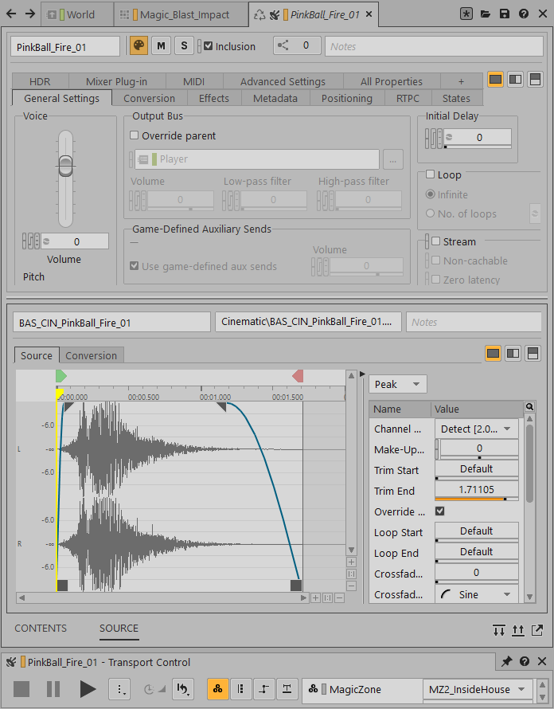

现在添加了 Object Tab Group 作为 Designer 布局的聚焦中心。Project Explorer 中的所有对象都可选中并显示在 Object Tab 中，方便在一个位置集中展示其属性及与之关联的编辑器。比如，在编辑 Interactive Music Hierarchy 下的对象时，无需切换布局便可访问 Music Editor；直接在 Object Tab 内就能调节对象的属性。

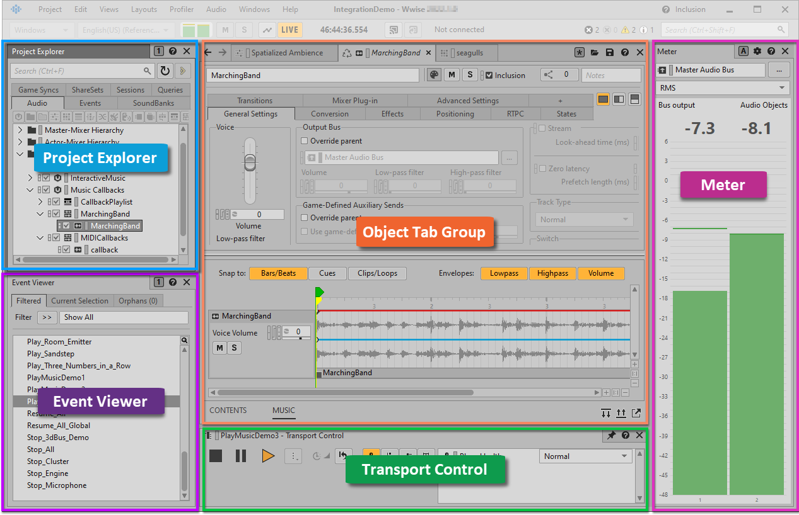

在 Object Tab 中，可执行以下操作：

- 在一个位置参考上下文集中编辑对象。
- 快速切换 Recycle 和 Keep Open 选项卡。
- 使用熟悉的“前进”和“后退”按钮浏览对象。

界面中设有两种类型的 Object Tab：Recycle 和 Keep Open。每次在 Project Explorer 内选中新的对象，Recycle 选项卡都会在同一对象选项卡中换掉之前选中的对象。除了 Recycle 选项卡，还有一些选项卡可以保持打开状态。用户可重新排列、停靠或取消停靠选项卡分组中的选项卡，以此来依据项目的实际需要对工作流程进行灵活性的调整。该功能方便分组管理要执行不同操作的选项卡，以便为自身开发当中特有的设计流程提供支持。

|  |  |
| --- | --- |
|  | Object Tab Group |
|  | 三个示例 Object Tab |

每个 Object Tab 由上部窗格中的 Primary Editor（适用于大部分对象类型）和下部窗格中的 Secondary Editor 组成。Primary Editor 会依据选定对象的类型显示 Property Editor、Event Editor、Audio Device Editor 或其他关联编辑器。Secondary Editor 会为每个与当前选定对象密切相关的其他编辑器留出一个选项卡。通过在基于选项卡的工作流程中引入与对象关联的 Primary Editor 和 Secondary Editor，用户可统一查看与编辑操作相关的所有信息。

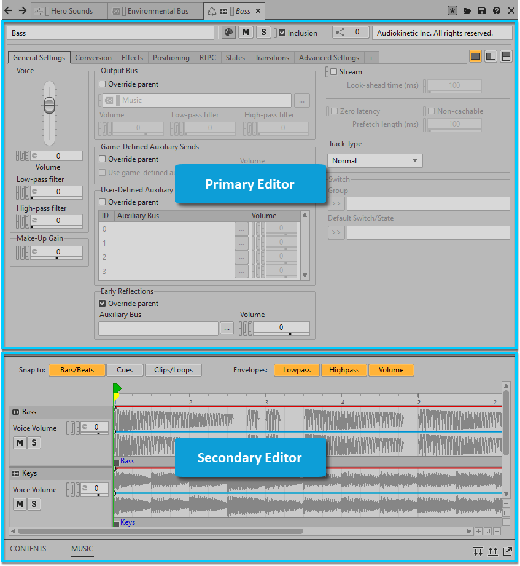

有关这一全新工作流程的更多详细信息，请参阅[使用 Object Tab 和 Object Tab Group](https://www.audiokinetic.com/library/edge/?source=Help&id=working_with_object_tabs)。

## 布局更新

同时，我们依据对编辑工作流程的改进对布局和布局的管理进行了更新。现在，所有与音乐相关的编辑器都可直接在 Designer 布局下的 Object Tab 中访问。为此，我们移除了 Interactive Music 布局。Object Tab Group 和 Object Tab 均可作为浮动窗口从布局中分离出来，并且可像其他视图一样停靠到布局或 Object Tab Group 内。为了便于在调整布局前了解停靠效果，我们对停靠目标和效果预览实施了改进。除此之外，还对调节设计窗口大小时的视图缩放做了相应的改进。

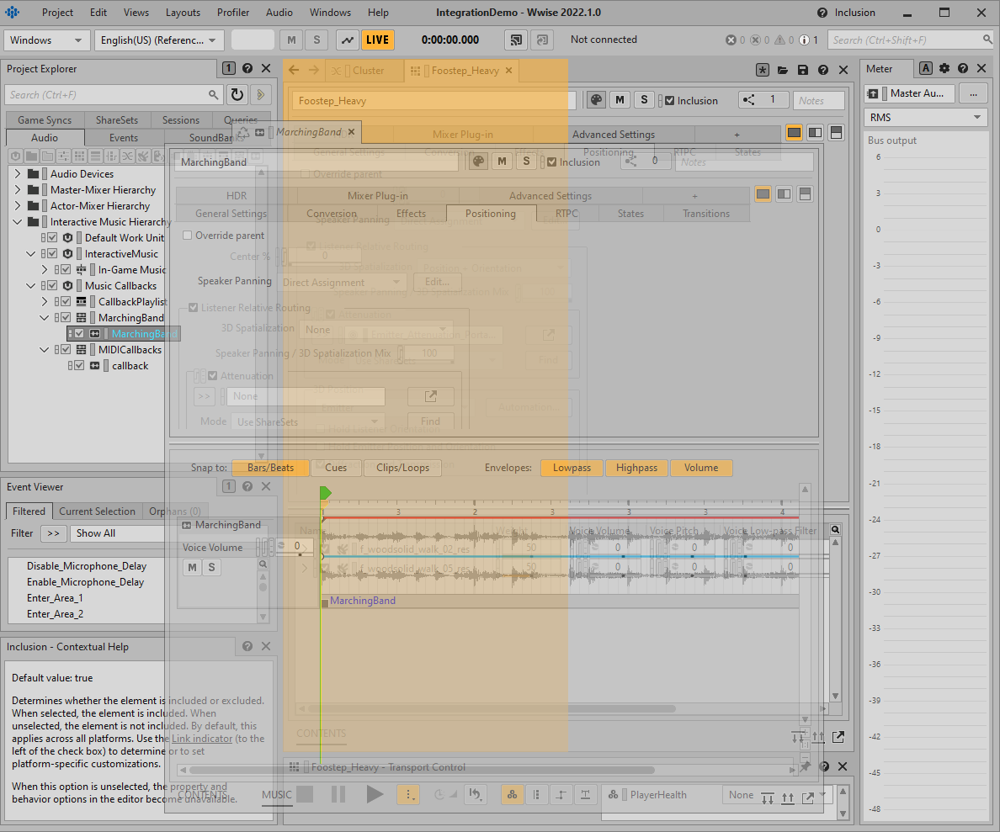

## Project Explorer Search

Project Explorer Search 方便在 Project Explorer 视图内执行自然搜索和筛选，同时还支持 Wwise Authoring Query Language (WAQL)。该功能对包含大量对象、多人参与开发的大型工程特别有用。通过高亮显示并展开匹配条目，用户可快速锁定 Project Explorer 中的对象。

只需在 Project Explorer 顶部的“搜索”字段中键入对象名称或将对象拖到该字段中便可查看结果。有关更多详细信息，请参阅[使用 Project Explorer Search](https://www.audiokinetic.com/library/edge/?source=Help&id=using_project_explorer_filter)。

## Paste Properties

现在可利用 Paste Properties 视图来将某个对象的属性复制到别的（一个或一系列）对象。藉此，可使工程中的各项属性保持一致，从而降低出现未知异常的可能性。在 Paste Properties 视图中，还可对比源对象和目标对象的属性。

利用这一新增视图，可复制并粘贴两种类型的信息：

- 属性：包括 Property Editor 中提供的属性（如 Output Bus、Loudness Normalization 等）。
- 列表元素：与对象对应的各项子元素。Paste Properties 视图支持以下列表元素：
  - RTPC
  - Stinger
  - Metadata
  - Music Cue

比如，您可能会想为不同的车辆或物理对象使用一系列相同的 RTPC。

为此，我们对 Wwise Authoring API (WAAPI) 进行了扩展。现在可返回源对象和目标对象之间存在区别的属性和列表 (ak.wwise.core.object.diff)，并将源对象的属性和列表粘贴到若干目标对象 (ak.wwise.core.object.pasteProperties)。如此一来，便可在自定义 WAAPI 工作流程当中执行 Paste Property 操作（包括 RTPC），从而提升开发管线的效率。

有关如何使用此视图的详细信息，请参阅[复制和粘贴对象属性](https://www.audiokinetic.com/library/edge/?source=Help&id=paste_properties)。

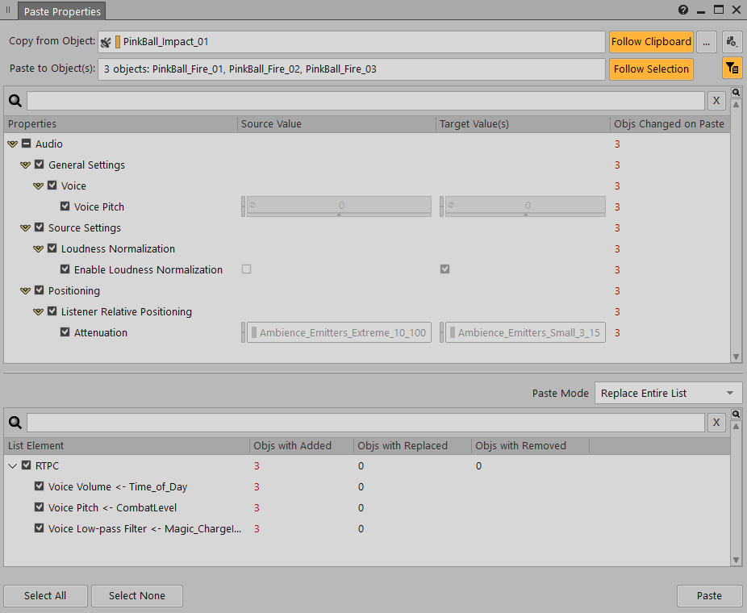

## 改进了 Attenuation Editor 的外观并添加了新的曲线

为了便于根据衰减情形进行自定义设置，我们添加了可选的声障、声笼、衍射和透射曲线。

这些曲线允许：

- 为 Obstruction/Occlusion 沿用 Project Setting 曲线。
- 为每项可用属性使用 Custom 曲线。
- 使用 None。

这提供了可以在每个衰减的基础上微调这些特性的曲线的灵活性，从而让空间音频的功能更加完善。

与此同时，为了与 Property Editor 中 RTPC 选项卡的布局协调一致，我们还对 Attenuation Editor 内的各项元素进行了调整。

- 调换了列表视图和曲线图视图的位置。
- 将附加的衰减属性放在了列表中。
- 添加了用以从坐标图中滤掉特定游戏对象的文本字段。

## Auto-Defined SoundBank

通过在 Wwise 设计工具内引入 Event-based SoundBank 方法，Auto-defined SoundBank 为游戏引擎集成提供了新的素材管理策略。该新增功能可与游戏引擎集成结合使用，来在运行时动态加载和卸载 Wwise 资源，确保仅将游戏所需的 Event 和 Media 加载到内存中。Wwise 允许同时使用自动定义和用户定义的 SoundBank，便于开发者根据自身需要优化 SoundBank 的选择。

另外，为了配合自动化、精细化的游戏素材管理方式，我们还对其他工作流程实施了一系列改进：

- 移除了 CopyStreamedFiles.exe。现在将与之等效的功能直接集成到了 Wwise SoundBank 生成过程中。
- 对输出文件夹进行了清理。
- 将输出文件夹放到了版本控制系统中。

该功能基于随 Wwise Unreal 集成引入的 Event-Based Packaging (EBP) 工作流程构建，便于借助对 EBP 的更新来充分发挥 Event-based SoundBank 方法的作用。通过在 Wwise 设计工具内加入 Event-based SoundBank，可使 EBP 工作流程的灵活性免受 Unreal 管线影响，便于在其他游戏引擎集成当中进一步扩展。

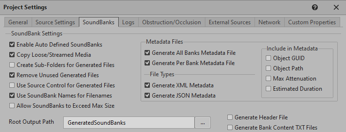

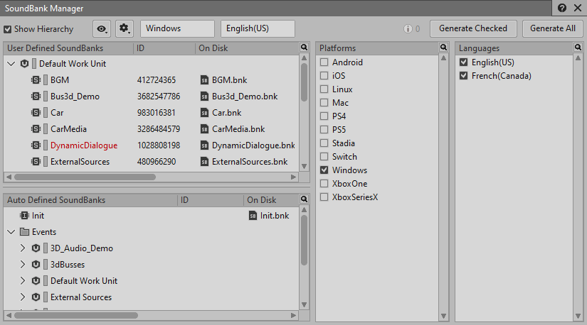

## 在 File Manager 中添加了 Generated Files 选项卡

File Manager 现在包含 Generated Files 选项卡，其会显示有关工程内输出文件夹所含文件的信息。在这个新增的选项卡中，可单独选择工程的各个平台并查看针对其生成的文件。您可以确定所生成文件的状态和所有者以及哪些文件为只读文件。而且，直接在 File Manager 内就可移动或删除生成的文件。

若在使用版本控制插件，可通过右键单击列表中的文件来访问一组附加命令（如 Submit Changes 和 Check out）。

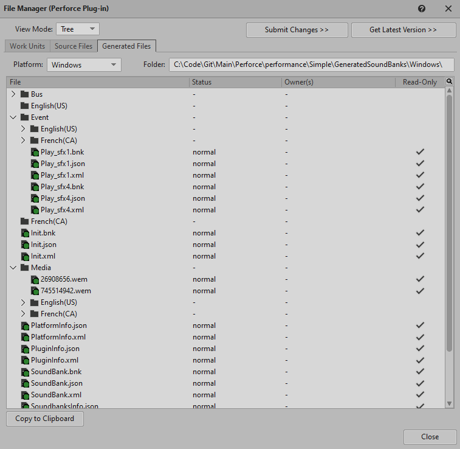

## Transport Control 界面更新

现在的 Transport Control 视图更加简洁：

- 改为了使用符号来表示 Game Parameter、选项和“重置”按钮。
- 将“播放”选项嵌套到了 Play 按钮旁的新增菜单下。
- 将 Reset 菜单分成了多个分组。

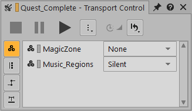

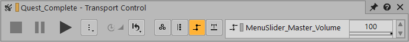

## Contextual Help 和 Capture Log 错误消息

为了反映拓展之后的用途，将 Property Help 视图重命名为了 Contextual Help。现在可选中 Capture Log 内的错误消息来在 Contextual Help 视图中查看详细说明、可能的原因以及解决步骤。

在与字段、复选框、按钮或滑杆交互时，只要是设置属性而非打开对话框、列表或视图，仍会显示帮助条目。

Contextual Help 视图中的所有内容均提供英语、日语、简体中文和韩语版本。对此，只需在 Help 菜单中选择所需 Documentation Language 即可。

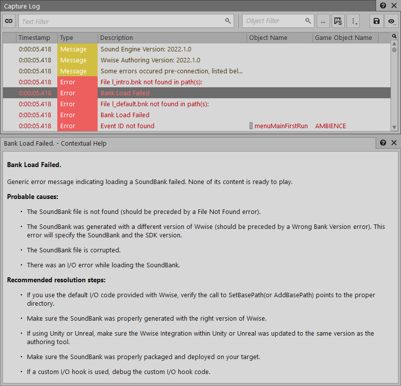

## Filter Behavior：Use highest value

现在可在 Project Settings 中定义 Voice LPF 和 Voice HPF 所用的累计方式。这样方便选择是通过将所有值叠加起来（之前只有这一种方式）还是通过取所有对象值当中的最大值来得出最终值。

在本例中，我们为每个对象指定了 LPF 属性值。最终应用于声音对象的 LPF 值取决于所选的累计方式。

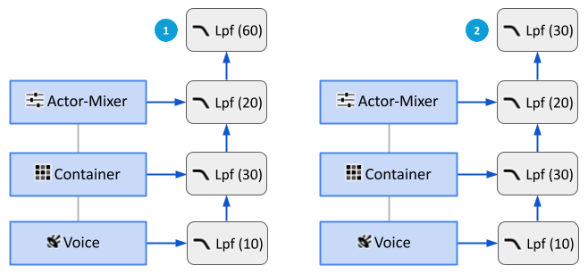

|  |  |
| --- | --- |
|  | Sum all values：将各个对象的 LPF 属性值加在一起。 |
|  | Use highest value：使用对象 LPF 属性值当中的最大值。 |

## 复制和粘贴 State Group 及 State 值

在 Property Editor 的 States 选项卡中，现在可在不同 State Group 和不同对象类型之间复制粘贴 State 值，包括在 Master-Mixer Hierarchy、Actor-Mixer Hierarchy 和 Interactive Music Hierarchy 之间进行复制粘贴。甚至，还可选择多个目标对象并将值一键粘贴到所有目标对象。

另外，还可将 State Group 及关联 State、属性和 State 值从一个对象复制到另一对象，而不受对象类型或层级结构限制。

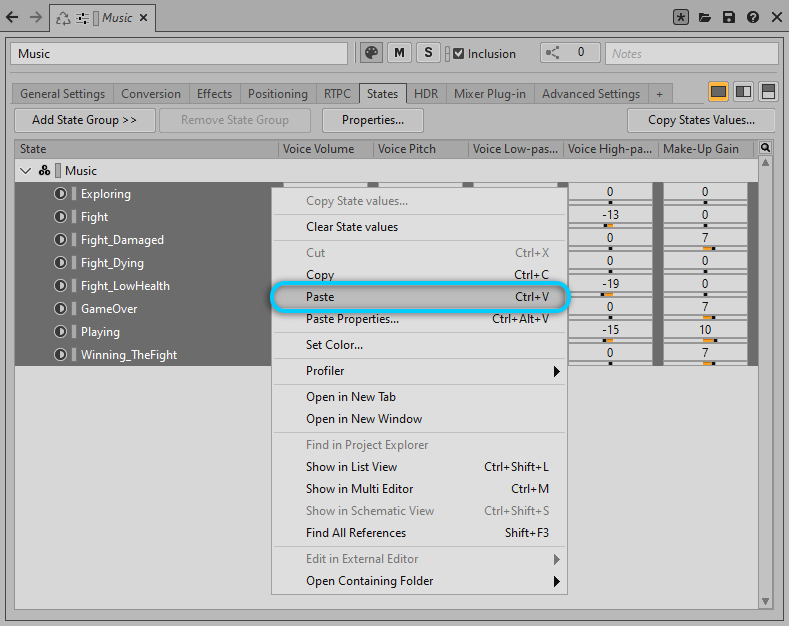

## Event Action：Show State/State Group

Event Action Set State 的 Target 字段现在会同时显示 State 及其所属的 State Group。这样便于区分属于不同 State Group 但名称完全相同的 State。

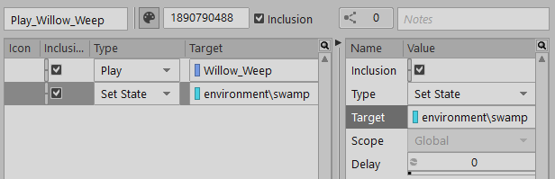

## Performance Monitor

为了涵盖所有最为实用的坐标图设置，我们对 Performance Monitor 默认设置进行了更新。

## Selection Channel 和 Meter Instance

为了便于自由选用以下方式将视图同步，我们将 Sync Group 替换为了 Selection Channel：

- **In the Project Explorer and Event Viewer**：若针对多个 Project Explorer 或 Event Viewer 实例选择了同一 Selection Channel，则某一视图实例中所作的选择或移动将自动应用于其他实例。
- **In other views that include the Selection Channel icon in their title bar**：使用此选项来将视图与 Project Explorer 或 Event Viewer 的特定 Selection Channel 同步。也就是说，只要在该通道对应 Project Explorer 或 Event Viewer 内选中对象，就会在同步的视图中自动选中所述对象。

同时，为了避免混淆，电平表不再设置 Sync Group，改为设定 Instance（A、B、C 和 D）。

## 鼠标滚轮的缩放和移动体验

为了获得更好的体验，我们更新了以下位置的鼠标滚轮行为：

- AK Convolution Reverb Editor
- Music Segment Editor
- Attenuation Editor
- RTPC 选项卡
- Performance Monitor
- Voice Monitor
- Game Sync Monitor
- Source Editor

总的来说，对于基于时间和基于范围的视图，现在默认适用以下操作规则：

- 鼠标滚轮：水平滚动
- Ctrl+鼠标滚轮：水平缩放
- Shift+鼠标滚轮：垂直滚动
- Ctrl+Shift+鼠标滚轮：垂直缩放

## 键盘快捷方式改进

我们对以下键盘快捷方式做了改进：

- Ctrl+F：在 Project Explorer 中搜索。
- Ctrl+Shift+F：在 Wwise 工具栏中搜索。
- Ctrl+Shift+L：打开 List View。
- F3：在当前视图中搜索。
- Shift+Q：打开 Query Editor。
- Dialog Event Editor 或 License Manager 不再有默认快捷方式。

## 快捷菜单更新

我们对 Contents Editor、List View、Query Editor 和 Reference View 中的快捷菜单进行了更新。现在其包含执行以下操作的选项：

- 删除对象。
- 重命名/批量重命名对象。

# WAQL

提升了 WAQL 的整体性能，并做了以下改进：

- 添加了 "duration" 访问器以便查找与指定时长匹配的对象。比如：$ from type sound where duration.max > 2。
- 使用了 isExplicitMute、isExplicitSolo、isImplicitSolo、isImplicitMute 来暴露 Mute 和 Solo 状态。比如：$ where isExplicitMute。

# WAAPI

为 WAAPI 添加了以下功能：

- 添加到 [ak.wwise.core.object.set](ak_wwise_core_object_set.html) 的功能：
  - 对 Wwise 对象进行批处理操作。
  - 设置属性和引用。
  - 创建新的对象作为子对象或列表对象（如 RTPC）。
  - 添加、修改和移除 RTPC。
  - 创建 Custom Modulator 和 ShareSet Modulator。
  - 创建 Custom 和 ShareSet 效果器。
  - 创建源插件。
- 添加了 [ak.soundengine.getState](ak_soundengine_getstate.html) 和 [ak.soundengine.getSwitch](ak_soundengine_getswitch.html) 以便从声音引擎检索当前的 Switch 和 State。
- 添加了 [ak.wwise.core.soundbank.convertExternalSources](ak_wwise_core_soundbank_convertexternalsources.html) 来为 External Source 转码提供支持。
- 添加了 [ak.wwise.core.soundbank.processDefinitionFiles](ak_wwise_core_soundbank_processdefinitionfiles.html) 来为 SoundBank 定义文件提供支持。
- 添加了主题 [ak.wwise.core.profiler.gameObjectRegistered](ak_wwise_core_profiler_gameobjectregistered.html) 和 [ak.wwise.core.profiler.gameObjectUnregistered](ak_wwise_core_profiler_gameobjectunregistered.html) 以便在注册或注销游戏对象时接收通知。
- 添加了 [ak.wwise.core.profiler.getGameObjects](ak_wwise_core_profiler_getgameobjects.html) 以便获取在特定性能分析捕获时间注册的一系列游戏对象。
- Mute 和 Solo 命令现在接受 true/false 值的传送，并可在没有指定任何状态时自动进行切换。
- 添加了主题 [ak.wwise.core.profiler.captureLog.itemAdded](ak_wwise_core_profiler_capturelog_itemadded.html) 以便在发布新的 Capture Log Event 时接收通知（2021.1.9+ 中也添加了该主题）。
- 添加了 [ak.wwise.core.object.diff](ak_wwise_core_object_diff.html) 和 [ak.wwise.core.object.pasteProperties](ak_wwise_core_object_pasteproperties.html) 来为 Paste Properties 功能提供支持（参见 [Paste Properties](whatsnew_2022_1_new_features.html#features_22_1_paste_properties) 章节）。
- 添加了 [ak.wwise.core.getProjectInfo](ak_wwise_core_getprojectinfo.html) 以便检索有关当前所打开工程的信息。
- 添加了 [ak.wwise.core.undo.undo](ak_wwise_core_undo_undo.html) 以便撤消上一操作。
- 添加了 [ak.wwise.core.sound.setActiveSource](ak_wwise_core_sound_setactivesource.html) 以便更改 Sound 对象的活跃 Source。
- 添加了 [ak.wwise.core.transport.prepare](ak_wwise_core_transport_prepare.html) 以便为播放准备对象及依赖项。

# 插件

## Reflect 工作流程简化

为了便于快速运用动态早期反射，我们对 Reflect 插件的工作流程进行了简化。现在可根据需要利用声音对象的衰减曲线来设定反射路径的衰减。既可沿用声音对象的衰减曲线，也可依据具体情形自定义或禁用曲线。除此之外，还可修改各个 Reflect 插件实例的 Distance 和 Diffraction 曲线，自由地选择是突显还是弱化反射效果。

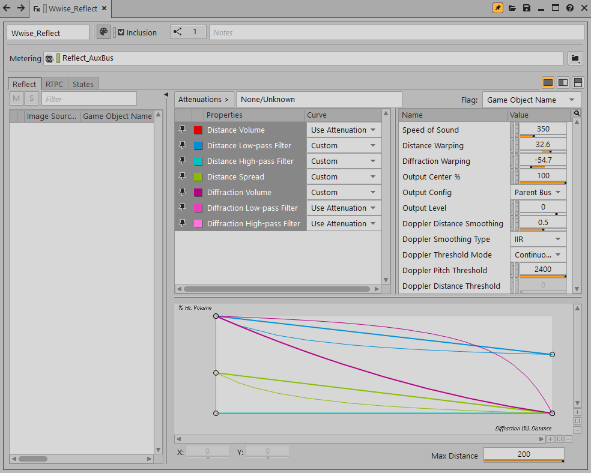

## 3D Audio Bed Mixer 插件

新增的 3D Audio Bed Mixer 插件可插入到 Audio Objects 总线上以减少发送到该总线的 Audio Object 数量。它会对部分 Audio Object 进行混音并生成三种可能的输出：Main Mix、Passthrough Mix 和一系列未经混音的 Audio Object（符合条件的话会在管线末端升级为 System Audio Object）。而且，还可利用各种设置来自定义插件的行为。

## Time Stretch 改进

为 Time Stretch 插件添加了新的拉伸模式，既保留了瞬态，又可掌控音质和 CPU 性能之间的平衡。Time Stretch 插件可在确保不影响音高的情况下调节音频信号的速度和时长。这样方便执行时间拉伸和时间压缩，对单声道和多声道声音都一样适用。另外，为了方便处理立体声声像定位并增加 Time Stretch 作为创作工具的灵活性，我们还添加了用于控制音高变换和随机音高变换的属性以及立体声处理模式。

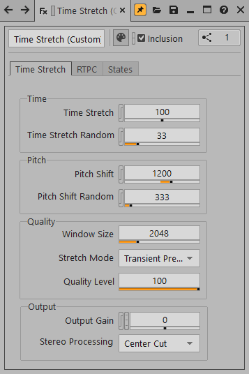

# Integration

## Unreal 对 Auto-Defined SoundBank 的支持

Wwise Unreal 集成中的 Event-Based Packaging 现在可充分利用 Auto-Defined SoundBank 功能（Wwise 2022.1 新增功能）。为了包含运行时引擎所需的各种信息以便设计师根据需要播放声音，我们对 SoundBank 元数据文件的内容实施了改进。这样便可抛开 Unreal 集成中的所有素材同步代码，转而依靠 Wwise 生成的元数据来实现。也就是说，现在不必每次都将 Wwise 工程中的所有条目自动添加到 Unreal Content 文件夹，只需在必要时创建 Unreal 素材即可。除非选择使用 Unreal 工程中的特定 Event，否则不会在磁盘上创建素材。在对工程进行打包之前，这些素材只包含对其所用资源的引用。只有到打包工程的时候才会将 SoundBank 复制到 Unreal 暂存文件夹层级结构。藉此还可解决音频以外的项目成员遇到的问题，之前他们有时必须安装 Wwise 才能将音频整合到工程中。新的集成包只需要有 GeneratedSoundbanks 文件夹便可在工程中获得全方位的 Wwise 音频支持。

## Unreal Engine 5.0

现在完全支持使用双精度（64 位）矢量来设定大世界坐标。之前只能使用 32 位精度值、重新定位世界的中心或使用自定义的 Local Grid。将来，我们会针对 Unreal Engine 5.0 版本不断进行更新。更多信息请参阅 [重要迁移说明 2022.1](whatsnew_2022_1_migration.html) 。

# SDK

## 以第三人称视角放置听者

在将音频整合到第三人称视角 (TPP) 的游戏或模拟环境中时，有时并不确定要将“听者”游戏对象放在哪里；有些人希望放在摄像机位置，有些人则喜欢放在玩家角色位置。现在可选择将新的 Distance Probe 作为“听者”游戏对象的代替物来实现最佳效果。

在将 Distance Probe 指派给听者时，为输出给听者的所有声音应用的衰减距离将基于 Distance Probe 和“发声体”游戏对象之间的距离。无论是否指派了 Distance Probe，声像摆位、空间化、散布和聚焦始终基于“听者”游戏对象的位置和朝向。通过利用Distance Probe对距离进行解耦，现在您可以动态地控制玩家在不同玩法状况下听到的内容。

除此之外：

- 每个“听者”游戏对象都可拥有零个或一个设为 Distance Probe 的游戏对象。
- 一个游戏对象可作为多个听者的 Distance Probe。
- 将听者指派给其自己的 Distance Probe 相当于将 Distance Probe 设为 None。

## Spatial Audio Geometry 性能改进

为了确保性能和可信环境呈现之间的平衡，我们一直在对 Spatial Audio 功能集进行优化。在计算衍射时需要沿着衍射边缘查找路径，这在运行时可能会消耗大量的 CPU 处理资源。为了优化 CPU 性能，我们采用了射线追踪法来采集重要的相邻衍射边缘，并据此构建了展示衍射边缘之间可见性的射线图。藉此，可提升衍射计算的效率。除此之外，我们还将 Spatial Audio 计算负荷分摊到了多个音频帧（由散布定义）以尽量避免 CPU 用量达到峰值。各项 Spatial Audio 任务（射线投射、路径验证等）会被放到优先级队列中，进而基于负荷均衡的散布设置来在每一帧执行队列中特定数量的任务。负荷均衡对同时使用大量发声体的情形特别有用。

## 对大世界坐标的支持

Wwise 声音引擎现在支持在定位时使用双精度值来为 Game Object 设定大世界坐标。即便对于数十亿单位大小的世界，也可按预期设置声音的定位行为。为此，我们对处理 Game Object 位置的 API 进行了更新，以便使用两个新的类型 [AkWorldTransform](struct_ak_world_transform.html "Position and orientation of game objects in the world (i.e. supports 64-bit-precision position)") 和 [AkVector64](struct_ak_vector64.html "3D 64-bit vector. Intended as storage for world positions of sounds and objects, benefiting from 64-b...") 来提供附加数据。更多信息请参阅 [重要迁移说明 2022.1](whatsnew_2022_1_migration.html) 。

## RTPC 和 Switch 性能改进

对数量持续增长的用于创建实时动态音频的参数的管理变得更加便捷。Real Time Parameter Control (RTPC) 和 Switch 的性能现在不会受到内存中加载的 Wwise 对象数量及其所用的 RTPC 或 Switch 影响。我们对 RTPC 和 Switch 值的设置和更新进行了优化，现在只取决于有多少注册的游戏对象和活跃的声音对象在使用 RTPC 或 Switch。

## 对自动调度音频渲染任务的改进

为了提升运行时性能，我们重写并优化了音频渲染管线的多线程执行。主要是通过转向基于作业的内部调度器，并对依赖关系进行建模，而不是采用分叉和连接的并行执行方法来实现。其中的关键要点包括：

- 大幅提升了 Voices Graph 中总线的并发处理和吞吐性能：允许同时处理 Voice Graph 的多条分支，而非每次仅处理 Voices Graph 的一个层级。
- 声部处理现在默认有经过优化的负荷均衡，无需游戏引擎来处理此类任务分配。
- 与游戏引擎作业管理程序的集成更加容易支持和维护。在大多数情况下，游戏引擎应可安排较之前更少的作业，降低集成所消耗的资源。
- 添加了新的 API 以便在外部工具中对 Wwise CPU 用量进行详细的分析。

现在，Wwise 可更加高效地使用 CPU 资源实现更为丰富的音频体验，同时更好地协调游戏引擎的任务协作和调度。