# 新功能概述2021.1

|  |
| --- |
| Wwise SDK 2025.1.4 - Windows |

新功能概述2021.1

# 基于对象的音频管线

## Wwise 2021.1 音频管线

Wwise 2021.1 允许根据平台特性灵活地渲染声音，以最大限度地提高终端输出配置的空间定位精度。为便于针对支持 Audio Object 的平台单独保留 Audio Object 定位和 Metadata，我们对整条 Wwise 音频管线进行了深入而系统的调整。同时对性能分析和用户界面实施了整体改进，以便从视觉上清晰地呈现信号通路和混音设计。其中包括 Bus Status 图标、Processing 状态和新的 Audio Object 性能分析视图。另外还对 Audio Device Editor 和 System Audio Device 进行了更新，以便针对不同输出配置快速设定相关属性并加以测定和分析。

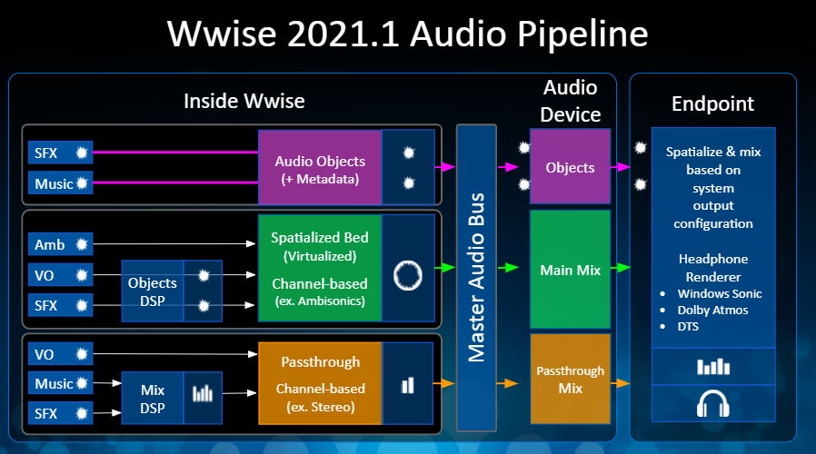

## System Audio Device 更新

### Audio Device 属性

改进后的跨平台 System Audio Device 支持针对所选平台统一设置 3D Audio，而不再需要为每个平台单独应用混音器插件。现在允许在 System Audio Device 中将发送到终端的输出设为不同的类型：Main Mix、Passthrough Mix 和 Object。终端具体能接收哪些类型的输出要看平台关联了怎样的 Audio Device 属性。对此，用户可根据需要在 Audio Device Editor 中加以配置。比如，若启用 **Allow 3D Audio** 选项，Audio Device 将尝试激活平台的现有 3D Audio 功能。注意，只有在平台支持的情况下才会激活 3D Audio。若禁用该选项，则将停用所有潜在 3D Audio 功能。 为帮助 Audio Device 针对工程支持的各个平台选用最佳配置，我们还额外添加了其他一些属性。有关 Audio Device 属性的详细信息，请参 [Audio Device Editor](https://www.audiokinetic.com/library/edge/?source=Help&id=audio_devices_editor)。

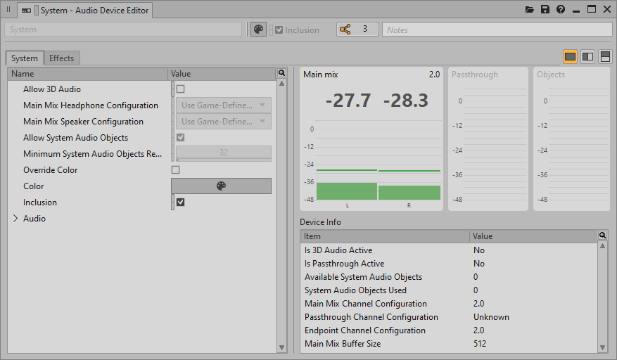

### Audio Device 电平表

在 Audio Device Editor 中添加了相应的电平表。它们会依据 Audio Device 所启用的输出类型显示 Main Mix、Passthrough Mix 或各个 Audio Object 的峰值电平。

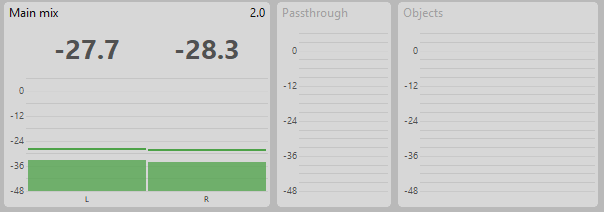

### Audio Device Info

利用初始化后 Audio Device 的属性信息，可更好地理解终端用来渲染音频的设置。为此，用户可在 Device Info 面板中查看各项 Audio Device 属性的状态和配置，包括：Is 3D Audio Active、Is Passthrough Active、Available System Audio Objects（如有）、System Audio Objects Used（如有）、Main Mix Channel Configuration、Passthrough Channel Configuration、Endpoint Channel Configuration 和 Main Mix Buffer Size。

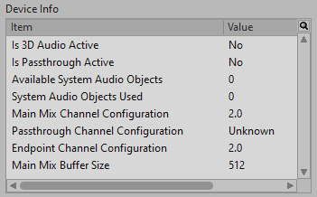

## Audio Bus：Audio Objects

### Bus Configuration：Audio Objects

在 Audio Bus 和 Aux Bus 的 Bus Configuration 列表中添加了新的选项：Audio Objects。在将 Bus Configuration 设为 Audio Objects 时，可使用 3D 信息和自定义 Metadata 对发送到该总线的声音进行单独处理。

### Bus Status：图标

添加了一系列 Bus Status 图标来直观地指示 Audio Bus 或 Aux Bus 的状态。用户可在 Project Explorer 的 Master-Mixer Hierarchy 及部分性能分析视图中查看这些图标。它们代表为总线设定的处理状态，便于理解发送到 Master Audio Bus 的混音或 Audio Object。

### Bus Status：Processing、Bus Config. 和 Out Config.

对 Master-Mixer Hierarchy 中的总线进行了更新，来清晰呈现其 Bus Status 以便理解所设定的属性。 确切地说，Property Editor 内 General Settings 选项卡中的 Bus Status (Authoring) 分区会显示 Processing、Bus Config. 和 Out Config. 的相关信息。在设计过程中以及在连通并实施性能分析时，会即时更新这些信息。这样便于评估总线可能会对通过其发送的声音产生怎样的影响。

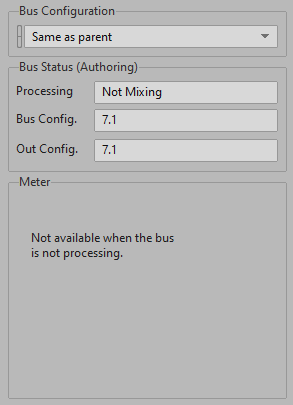

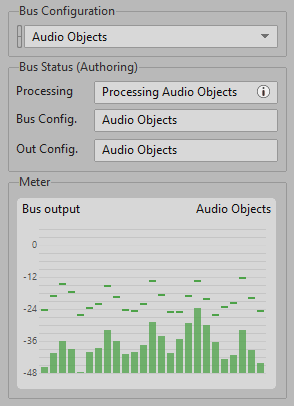

在将鼠标悬停在 Processing 字段上时还会显示工具提示，并列出对 Processing 状态产生影响的总线设定。

其中包括：

- Is a Master bus
- Is an Auxiliary bus
- Has an RTPC on bus volume
- Has an explicit Channel Configuration
- Has an Auxiliary Send
- Has Effects
- Has Listener Relative Routing
- Has Speaker Panning set to Balance-Fade
- Has HDR
- Has a Mixer Plugin

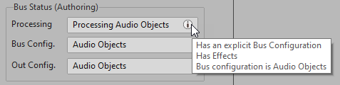

## Audio Object 性能分析视图

### Audio Object List

新增了 Audio Object List 视图，其内设有上下文 Bus Filter 和 Audio Object List（包含最近引入的筛选器工具栏）。用户可在该视图中查看经由音频管线处理的 Audio Object 的状态，包括处理当中发生的通路转换情况。另外还可在 Audio Object List 内调节 Audio Object 的可见性，并使用 Effect stage 按钮在 Pre-effects stage、Post-effects stage 和 All Effect stages 之间切换。

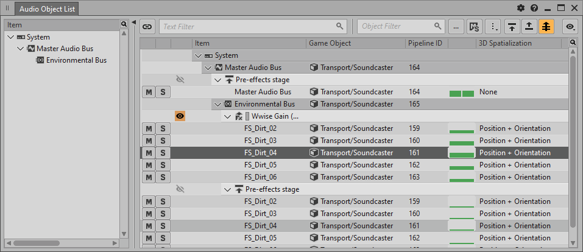

### Audio Object 3D Viewer、Audio Object Meter 和 Audio Object Metadata

Audio Object List 视图内所作的选择会直接影响以下三个新增视图中 Audio Object 的可见性：Audio Object 3D Viewer、Audio Object Meter 和 Audio Object Metadata。这些 Audio Object 视图可显示 Audio Object 的 3D 信息（3D 视图）、峰值电平及各项 Metadata 值（如 3D Position、Azimuth、Distance、Elevation、Focus、Spatialization、Spread 和自定义 Metadata）。

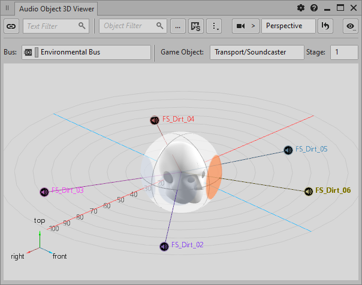

## Metadata 设定

在 Property Editor 中新增了 Metadata 选项卡，以便根据需要设置自定义 Metadata 并与 Audio Object 结合使用。在该选项卡中，可将自定义 Metadata 的 Mode 设为 Use ShareSets 或 Define custom，以此为管线后续的处理提供相应信息。另外，对于 "Wwise System Output Settings" Metatdata，还可根据 Audio Device 的配置选择将 Wwise 对象的 Mix Behavior 设为 Mix to Main 或 Mix to Passthrough。

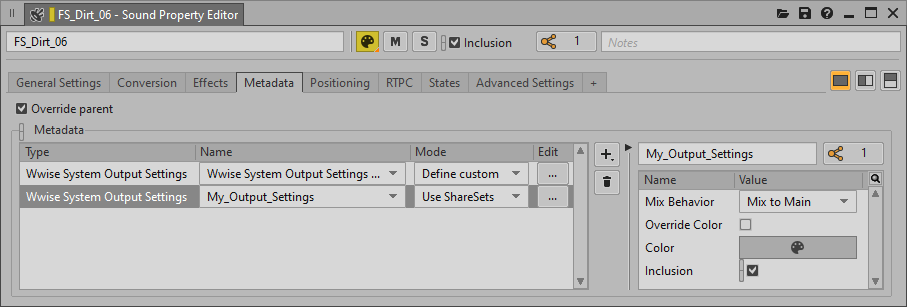

## Audio 菜单

### Main Mix Channel Configuration

现在允许明确指定 Wwise 设计工具所要使用的 Main Mix Channel Configuration 设置。

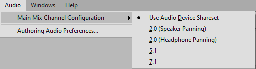

### Authoring Audio Preferences

对通过 Wwise 设计工具试听时所用的初始化设置进行了更新，添加了 Enable System Audio Objects 复选框。在选中该复选框时，会禁止随 Wwise 一起运行的程序和游戏使用 System Audio Object。

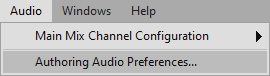

## 启用 Height Spread

在 Attenuation Editor 中添加了 Height Spread 复选框。这样可在非 3D 配置 (2.0 ~ 7.1) 下使用 Height Spread 来增添相应的散布效果，以弥补高度扬声器的缺失。在有高度扬声器而无深度扬声器的 7.1.4 配置下，会在听者下方应用 Height Spread（即高度为负值）。在 Ambisonics 配置下并不会使用该值。

# Spatial Audio

## Spatial Audio – 文档

对有关 Spatial Audio 功能的文档进行了全面更新。

## Spatial Audio – CPU Limit 和 Performance Monitor

现在允许将 Spatial Audio 的 CPU Limit 初始化设置 ([AkSpatialAudioInitSettings::fCPULimitPercentage](struct_ak_spatial_audio_init_settings_add22106d4e299a6697a4c8c0728dc9a9.html#add22106d4e299a6697a4c8c0728dc9a9 "Defines the targeted max computation time allocated for spatial audio. Defined as a percentage [0,...")) 作为被动调控机制来通过 SDK 动态地限制 CPU 用量。藉此，可在 CPU 资源充足的情况下增加射线数（围绕听者）和路径数，并在 CPU 用量达到峰值时控制 Spatial Audio 处理，最终提高 Spatial Audio 精度。

对 Performance Monitor 视图进行了更新，现在可分析 Raytracing CPU 和 Raytracing Emitters 的值。

## Spatial Audio – Game Object 3D Viewer

### 显示设置

对显示设置进行了更新和调整，以便更加灵活便捷地配置 Game Object 3D Viewer。

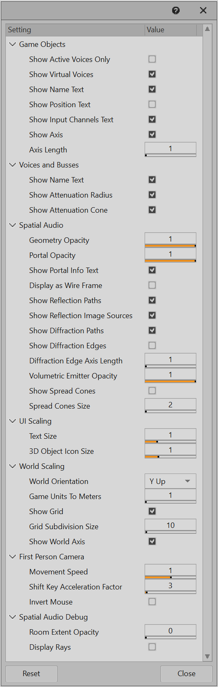

### Room 边界可视化

现在可在 Game Object 3D Viewer 中查看 Room 的边界。

### Emitter 散布可视化

现在可在 Game Object 3D Viewer 中查看发声体散布的衍射和透射百分比。

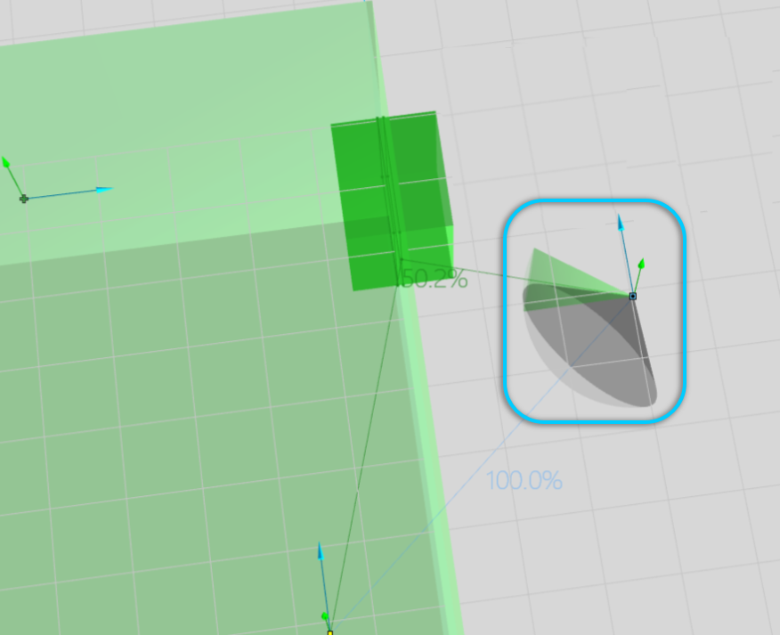

## Spatial Audio – Advanced Profiler 视图

在 Advanced Profiler 视图内的 Obs/Occ 选项卡中添加了 Diffraction、Transmission Loss、Spread 和 Aperture 列。

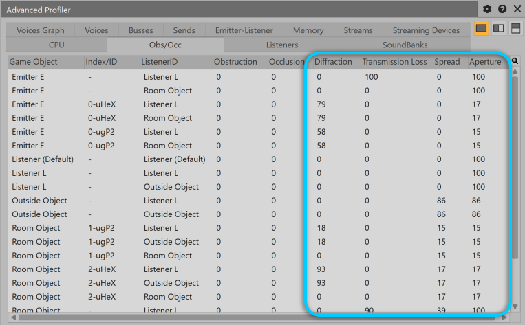

## Spatial Audio – Voice Inspector 视图

Voice Inspector 视图现在会显示与 Diffraction 和 Transmission Loss（在声音穿透几何构造的情况下）相关的 Driver 和 Driver Value。

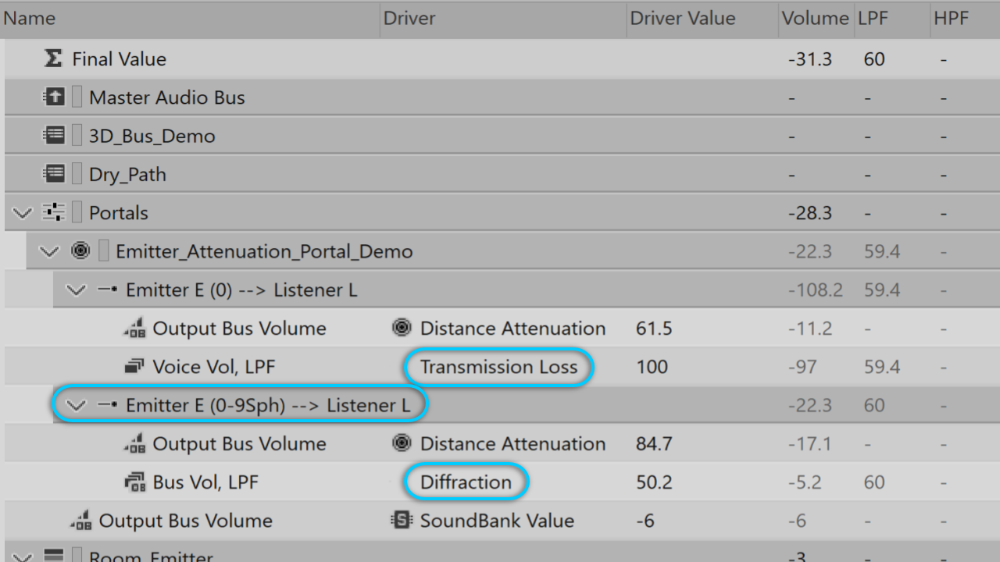

## Spatial Audio – 自定义 Portal Obstruction

SDK：现在可在整条 Spatial Audio 管线中调节 Wwise Direct-path Obstruction 值，以便根据需要进行自定义设置。

## Spatial Audio – Unreal

### Room 和 Portal – Fit to Geometry

为便于快速精准地放置 AkAcousticPortal 和 AkSpatialAudioVolume，Wwise Unreal 集成现在可检测场景周围的 Static Mesh Geometry，并确定场景内 Portal 和 Volume 的适宜尺寸和位置。用户可将 Fit to Geometry 用于各种常见的房间、窗户和地板形状。这样可减少正确放置 Room 和 Portal 几何构造时所需的手动操作。如需详细了解如何实现，请参阅 [Fit to Geometry](https://www.audiokinetic.com/library/edge/?source=UE4&id=sa_fittogeometry.html)。

### Room 和 Portal 可视化

在 Integration Settings 中添加了新的选项，以便在 Unreal 视口中绘制 Room 和 Portal 轮廓及其关联。这样便于在关卡中放置并对齐 Room 和 Portal。

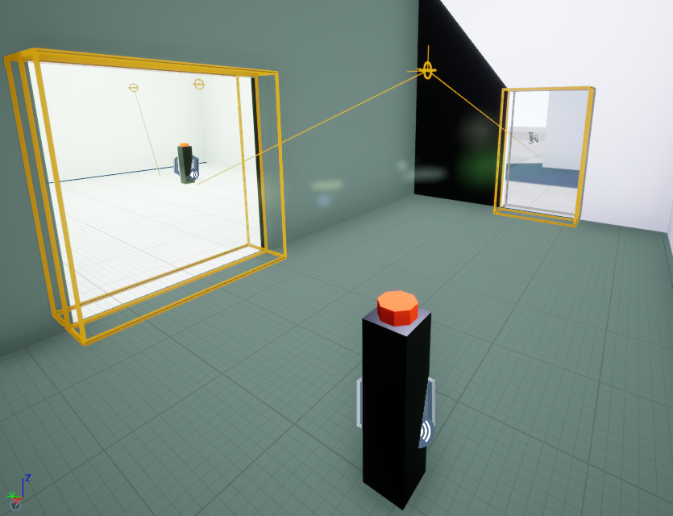

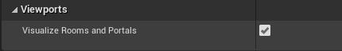

### Acoustic Surfaces Editor

现在可在 Unreal 中轻松识别 Spatial Audio Volume 所关联的声学表面属性，包括声学材质名称、关联颜色和 Transmission Loss 值。另外，还可在 Unreal Editor 中使用 Brush Editing 模式，来直接更改与 Volume 上一个或多个面关联的表面属性。

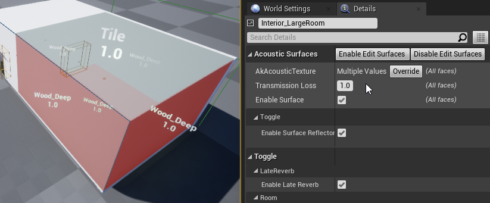

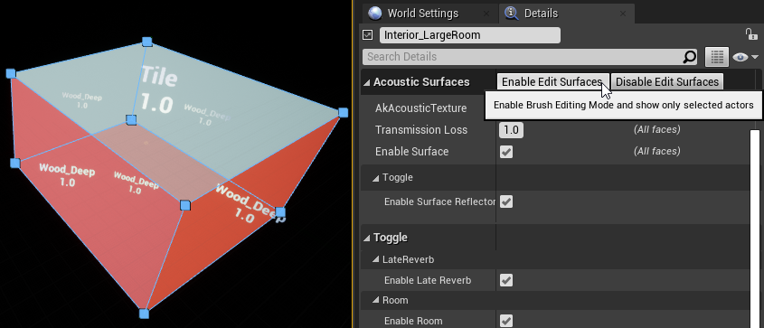

### Spatial Audio 组件更新

对 AkRoom、AkPortal、AkLateReverb 和 AkGeometry 组件全部进行了更新，现在支持将 UPrimitiveComponent 用作关联父对象。 也就是说，您可以使用 Spatial Audio 组件来根据需要设置自定义 Blueprint 类。

### 自动指派 Aux Bus

现在可根据 AkRoom 组件的预计 T60 衰减自动指派 Aux Bus。

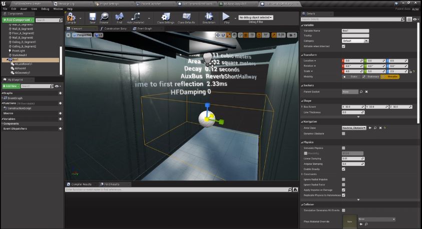

对 AKLateReverb 组件进行了更新，以便根据 Aux Bus Assignment Map 中的定义自动指派 Aux Bus。

Reverb Assignment Map 中会显示环境衰减值和 Wwise 工程中 Aux Bus 之间的关联。用户可将该 Map 与 AKLateReverb 组件的 Auto Assignment 属性结合使用，来针对 Volume 自动定义 Late Reverb。

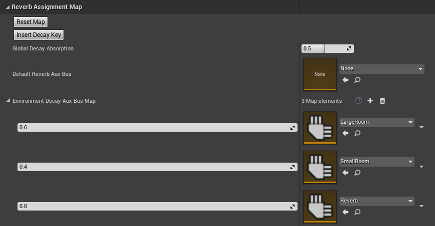

# 内核

## 新增平台

在 Wwise 中添加了对 [Microsoft](namespace_microsoft.html) Xbox Series X|S 和 Sony PlayStation®5 的支持。除了针对 Wwise 支持的所有平台统一提供的功能，新增平台还具备以下特性：

对于 Xbox Series X|S：

- 支持对 Opus (WEM) 音频数据实施硬件加速的解码和重新采样。
- 支持在 System 输出设备中应用 [Microsoft](namespace_microsoft.html) Spatial Audio，而无需额外使用其他插件。

对于 PlayStation®5：

- 支持对 Opus (WEM) 和 ATRAC9 实施硬件加速的解码和重新采样。
- 支持在 System 输出设备中应用 3D Audio，而无需额外使用其他插件。
- 支持对 Convolution Reverb 插件实施硬件加速的处理。
- 支持在 Wwise Motion 插件中将 DualSense 触觉反馈用作音频源和输出设备。

除此之外，我们还针对两个平台进行了其他一些改进，比如优化 I/O 系统来有效运用空闲高速存储、针对新的 CPU 优化音频渲染和处理。

## 一般改进

在 Wwise Memory Manager 中添加了运行时配置选项来为调试提供辅助。其中包括激活专用分配器来帮助检测 stomp 以及追踪并报告内存泄漏。

# Unity 集成

## Unity Addressables（实验功能）

Addressables 是 Unity 中新增的一个 Asset Management 系统，旨在增强对制作周期长、版本多的大型项目的支持。 该系统方便通过地址来调用并加载 Unity 素材（如 Prefab 和音频片段）。用户可在本机或服务器上将该地址设为任何存储位置，然后直接通过地址来查找特定素材，从而快速发布包含新素材的 DLC。您可以将 Unity 素材指派给 Addressables 分组，进而在运行时从相应位置加载这些 Addressables 素材。利用该实验包（可前往 Audiokinetic GitHub 下载），可将 SoundBank 和流媒体文件自动序列化为 Unity 中的 Scriptable Object，并将其提供给 Addressables 系统。

## Unity 中的 WAAPI 客户端

使用本机 C# 客户端彻底重写了 Unity 中的 WAAPI 客户端，进一步增强了其易用性。在适用情况下，Wwise Picker 窗口也会使用 WAAPI 来填充各种列表。除此之外，WAAPI 还在 Wwise Picker 窗口中融入了更多功能。

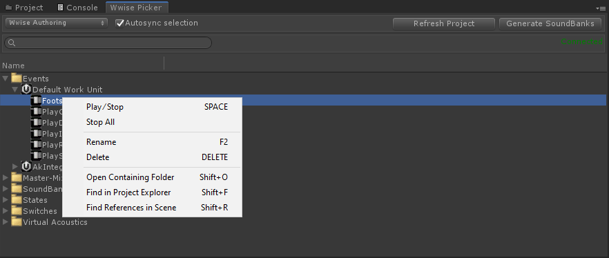

# 其他

## Impacter

Impacter 是在原有 SoundSeed Impact 插件基础上开发的源插件原型。它方便设计师将撞击类声音文件加载到插件中，进而通过交叉合成来创建不同的声音版本，并借助直观的物理信息参数进行操控。Impacter 的交叉合成功能还可进一步用于探索各种各样的声音设计创意。

## Speaker Panning – Steering

在 Speaker Panning 模式列表中添加了 Steering 选项，以便根据需要将不同声道的声音输出到相应扬声器中。

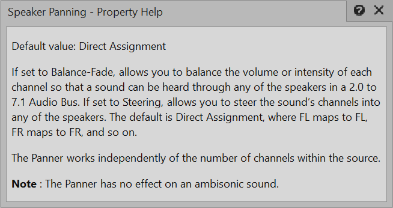

## 电平表历史记录、始终启用效果器、源插件监控

现在无需启动捕获会话便可监控效果器插件和源插件。比如，现在会在以下插件中自动启用电平表：Peak Limiter、Compressor、Meter、Mastering Suite 和 SoundSeed Grain。另外，还会在捕获会话中记录效果器插件和源插件的监控信息，并允许使用 Performance Monitor 等视图来移动时间光标。

## Loudness Meter 用户体验改进

对 Loudness Meter 用户体验进行了改进，添加了时间坐标图来监控捕获期间的瞬时值和短时值。

## WAQL

Wwise 设计工具现在拥有自己的集成查询语言 Wwise Authoring Query Language (WAQL)。该语言方便查询 Wwise 工程及其对象。藉此，用户可枚举各种 Wwise 对象（如 Sound、Container、Bus、Event 和 SoundBank），并按照属性（如名称、注释、ID、音量、音高和输出总线）加以筛选。另外，还可依据特定对象引用（如 Event 目标和输出总线）实施查询。

WAQL 可用于以下场合：

- Wwise 工具栏搜索
- List View 搜索
- Schematic View 搜索
- Query Editor
- WAAPI（使用 ak.wwise.core.object.get 函数）

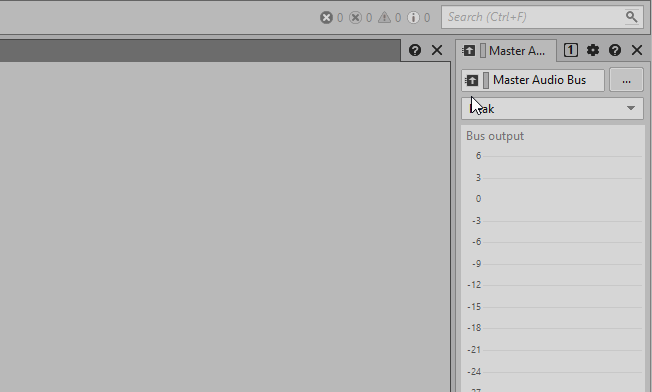

### WAQL 示例

筛选整个工程： $ where volume < 0 $ where name="Hello" $ where parent.name:"container"

指定查询的源： $ from type sound $ from type effect where pluginname:"Roomverb" $ from object "\Actor-Mixer Hierarchy\Default Work Unit\Hello" $ from object "\Actor-Mixer Hierarchy\Default Work Unit\Hello"

仔细查询工程： $ from type action select target $ from object "\Actor-Mixer Hierarchy\Default Work Unit" select descendants where type = "sound"

## WAAPI

对 WAAPI 进行了以下改进：

- 添加了对 WAQL 的支持，以便使用 ak.wwise.core.object.get 查询工程。
- 将之前包含冒号的 return 访问器改为了使用无冒号的别名。
- 现在支持在 ak.wwise.core.object.create 内创建列表（示例列表对象：Music Cue、Music Clip、Music Stinger 和 Music Sequence）。
- 现在允许使用 \ 来通过路径访问 Project 对象。

## 设计工具插件 API 2.0

针对设计工具插件引入了新的插件 API，以此增强架构的稳定性和可靠性，从而提升向后兼容能力并明确区分前端/后端。这一新的插件 API 允许以模块化方式开发插件，方便根据自身需要灵活地加以声明（或许只需一种 SoundBank 生成方式便可满足所有需求）。该 API 已重新构建为 C API，这样可减少对平台专用类型（如 VARIANT）的依赖。为方便在上层使用，我们还专门提供了更为安全、完善的改进型 C++ API。

## macOS 3D View

macOS 上的 Wwise 设计工具现在支持各种 3D 功能。比如，在 Game Object 3D Viewer 中显示电平和 Spatial Audio 属性。

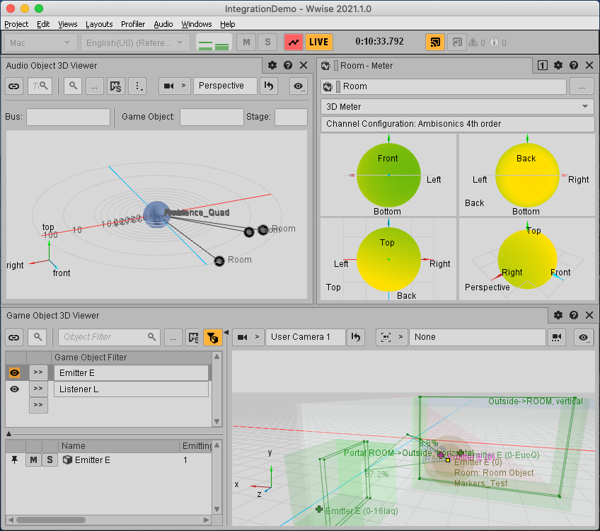

## Remote Connections：同步选项

添加了多个同步选项，允许在远程连接 Wwise 时执行不同的操作。

现在可在连接时自由选用以下选项：

- Profile Only
- Profile and Edit (Sync Inspected Objects Only)
- Profile and Edit (Sync All Modified Objects)

## Object View Bar

对 Property Editor 和 Effect Editor 视图中的 Object View Bar 进行了优化。调整了图标位置并添加了分割条，以便根据需要调节文本字段的可见性。

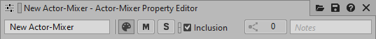

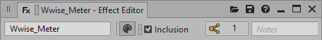

## 字体更新和大小调节

为了增强可访问性，在 User Preferences 对话框（通过 File 菜单打开）中添加了 Font 和 Font Size 选项，方便选择 Segoe UI 字体并调节字体大小。

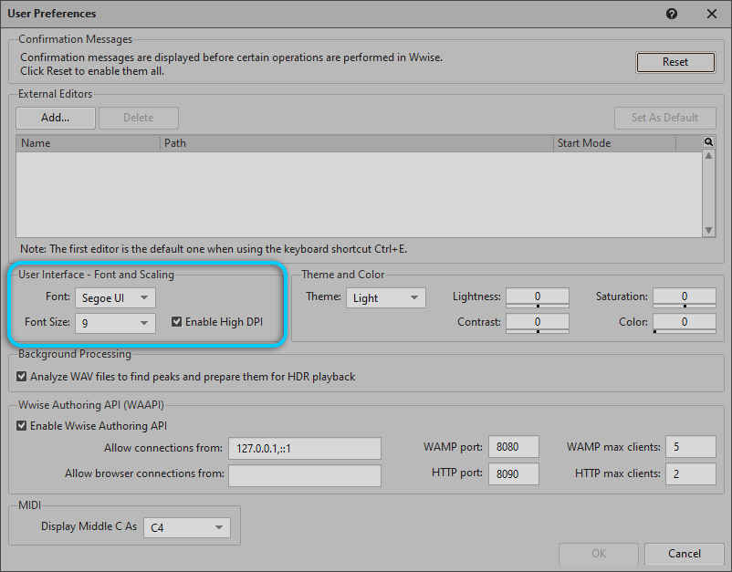

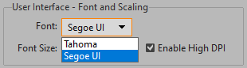

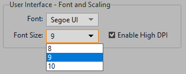

## Workgroup – Prompt for checkout on edit

在与使用版本控制系统的团队一起工作时，现在可使用 Project Settings 中新增的选项来最大限度地减少 Work Unit 之间的潜在冲突。若启用该选项，Wwise 会在修改工程时立即提示签出。若禁用该选项，Wwise 则会在保存工程时提示签出。

## 加载、卸载和重新加载 Work Unit

External Project Changes 现在允许根据外部更改（即添加、移除或修改文件）来选择是否重新加载 Wwise 工程。

现在无需重新加载 Wwise 工程本身便可从该工程卸载 Work Unit。

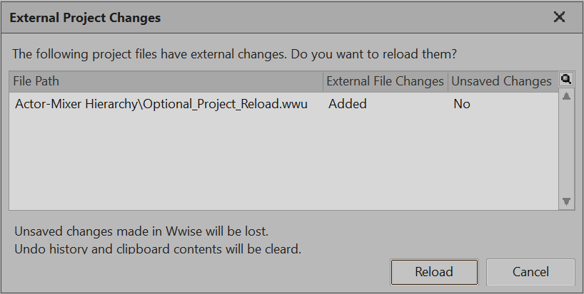

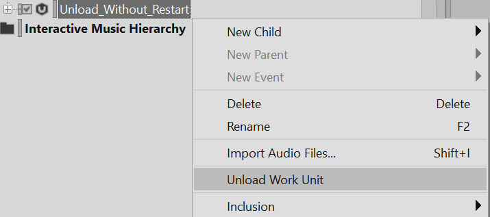

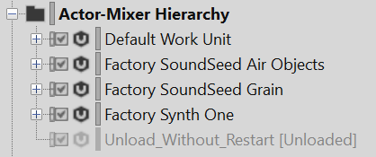

现在可在 Project 菜单中或通过右键单击 Work Unit 并打开快捷菜单来选择加载或卸载 Work Unit。

## Music Segment Custom Cue 改进

现在可在 Music Segment Editor 中选择 Show in Multi-Editor 和 Select Color...，以便调节 Custom Cue 的时间并设置 Custom Cue 标记点的颜色。

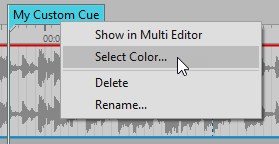

