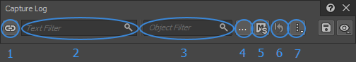
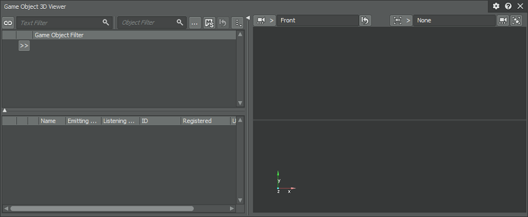
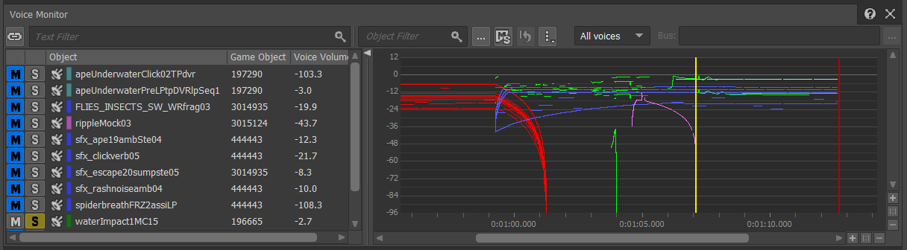
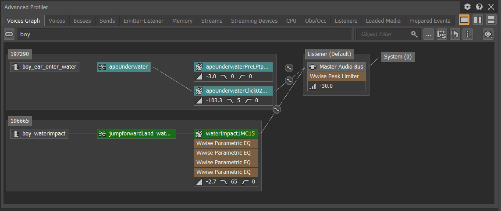
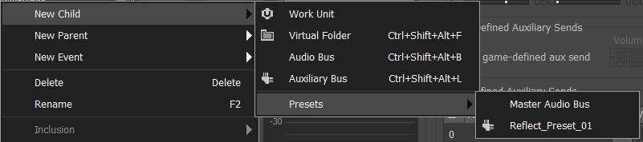
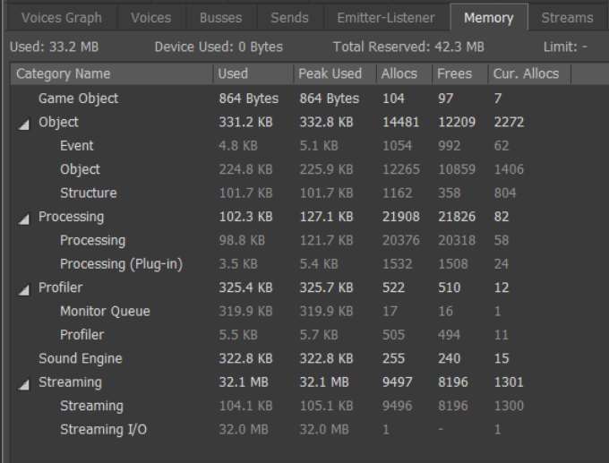

# 新增功能概述 2019.2

|  |
| --- |
| Wwise SDK 2025.1.4 - Windows |

新增功能概述 2019.2

# 性能分析器筛选器

在查看 Capture Session 时，在某一时刻常会显示大量捕获数据，导致很难准确找到所要查明的特定信息。筛选器工具栏能够帮助您快速缩小搜索范围，锁定想要查看的声音、问题或工程分区。筛选条件既可统一应用于所有性能分析视图，也可单独应用于某个特定视图，还可随时进行重置或同步。除此之外，Mute/Solo 筛选器允许在执行性能分析时只关注所听到的内容。如此一来，一方面可以充分借助自己的听觉来加以判断，另一方面又可通过筛选进一步缩小范围。通过综合利用这些筛选方式，您可以非常高效地组织和浏览捕获数据。

以下视图中设有筛选器工具栏：

- Voice Monitor
- Voice Explorer
- Voices Graph
- Voices
- Game Sync Monitor
- Game Object 3D Viewer

## 性能分析器筛选器工具栏

筛选器工具栏能够帮助您减少视图中显示的信息数量，以便快速锁定想要查看的元素。

1. **Unlink Filter**：允许或禁止在不同的性能分析视图之间同步筛选器。
2. **Text Filter**：通过指定文本来筛选内容。系统会将您所指定的关键词与内容中名称或字符串的开头进行匹配。关键词越多，结果越细化。此匹配功能不区分大小写。
3. **Object Filter**：通过指定 Wwise 对象来筛选内容。系统会将您所指定的 Wwise 工程对象与视图中的内容进行匹配。同时，还会依据对象关系（如父子对象关系和输出总线关系）对内容进行匹配。
4. **Browse Object Filter**：显示 Project Explorer 浏览器，以便选择所要筛选的对象。
5. **Mute/Solo Filtering**：若启用，则从结果中排除激活了 Mute 的对象，而只显示激活了 Solo 的对象。
6. **Reset Filter**：清除所有筛选器，包括 Text Filter 和 Object Filter。
7. **Options**：显示其他操作。

## 筛选器表达式

筛选器表达式提供包含和排除功能并允许使用通配符来结合文本、游戏对象、总线和事件加以筛选。这样您就可以制定精细的筛选方案并进一步减少结果条目，以便细化和浏览各个性能分析视图当中显示的内容。在借助筛选器表达式浏览捕获数据时，既可将筛选条件统一应用于所有性能分析视图，也可单独应用于某个特定视图。这样方便专注于特定的工程元素，更加灵活地查看想要的信息。

在默认情况下，会根据筛选器中的文本搜索以下对象名称：

- 总线
- 声音
- Event
- 播放目标
- 效果器
- Game Sync
- Game Object

有关筛选器表达式的详细信息，请参阅 [使用性能分析器筛选器表达式](https://www.audiokinetic.com/library/edge/?source=Help&id=using_profiler_filter_expressions)。

## Game Sync Monitor

**Game Sync Monitor** 进行了更新，可针对特定游戏对象来随着正在播放的声部不断显示 Game Sync 值。不再需要以显式方式将 RTPC 添加到 Game Sync 的 Watch List，现在会显示针对当前播放的游戏对象设定的所有 RTPC 值。性能分析器筛选器的核心在于允许查看所有信息并筛选结果，以便快速浏览捕获数据并清晰了解整个工程。

## Game Object 3D Viewer

为了充分利用各项捕获数据，并提供与其余性能分析视图中相同的筛选功能，我们对 **Game Object 3D Viewer** 进行了重新设计。除此之外，现在还可按照名称来筛选 Game Object，并锁定这些 Game Object 筛选器，以使所有性能分析会话保持一致，并允许轻松重复相应的工作流程。

## 性能分析器视图

**Voice Monitor**

Voice Monitor 现在包含经过重新设计的筛选器栏。

**Voice Explorer**

**Voice Explorer** 会依据为性能分析捕获会话设定的当前时间光标显示正在播放的声部。同时按照正在播放的实例来组织声部，确保每个正在播放的实例都与正在发送的 Event 对应。比如，在针对同一 Event 调用 PostEvent 两次时，会在 Voice Explorer 中生成两个正在播放的实例。Voice Explorer 提供有多个显示选项，方便按照 Game Object、Event Name 和 Event Target 进行分行。

**Voices Graph**

Voices Graph 现在包含经过重新设计的筛选器栏。

# Spatial Audio

Audiokinetic Spatial Audio 团队一直在努力地增强设计工具的性能，以便用户逼真地模拟动态反射并精准地协调衍射。

## 新的反射引擎

“随机射线追踪”现在可高效地估算反射声和衍射声的传播路径。不仅提高了灵活性，同时还优化了性能。从运行时角度来说，在运用高阶反射或衍射时，这一新的寻路算法有助于减轻对性能的影响。现在可以实现四阶反射了！

## 在设计工具中针对特定声音设置反射和衍射

现在可针对特定声音来定义 Spatial Audio 属性，允许用户选择将哪些声音发送到指定的 Aux Bus，并决定是否启用衍射。之前，只能通过游戏编辑器进行配置，而且只能针对特定游戏对象。现在，可以独立于声音层级结构的其他组件来应用和微调 Spatial Audio。

**在 General Settings 选项卡中添加了 Early Reflections**

**在 Positioning 选项卡中的 3D Position 下添加了 Enable Diffraction**

## 声音透射模型

声音可以穿透墙壁。房间或几何构造（由三角形组成）现在暴露了声笼系数，可对从发声体到听者的直达路径进行滤波。除此之外，湿声路径现在还会绕过几何构造边缘发生衍射。

## 四阶和五阶 Ambisonics

Wwise 现在支持在通过总线播放采用四阶和五阶 Ambisonics 音频源和声道配置的声音以便在运行时编码。

## 支持 Mesh

**Unreal**：不再局限于 Geometry Primitive。新的 AkGeometry 组件可在 Static Mesh 或 Collision Mesh 上应用 Surface Reflector，并将 Physical Material 自动映射到 Acoustic Texture。

**Unity**：Mesh 现在可针对每种 Rendering Material 设定一种 Acoustic Texture。之前，Unity 组件 AkSurfaceReflector 使用 Object Mesh 作为 Spatial Audio Geometry。现在，任何 Mesh 都可指派给 AkSurfaceReflector 组件。除此之外，您还可以将不同的 Acoustic Texture 指派给任一 Mesh Material。

## 房间底噪集成

Room 现在可发送 [AK](namespace_a_k.html "Definition of data structures for AkAudioObject") Event 并用来播放固定朝向的环境声（房间底噪）。在听者位于 Room 之内时，会在其周围实施 360 度的空间化处理。在听者位于 Room 之外时，会无缝过渡到定位在 Portal 位置的点声源发声体。

## 预设

针对不同容器类型保存和调取预设的过程可能会直接影响到设计效率。为此，我们对相应的工作流程进行了改进，尤其是与 Spatial Audio 相关的操作。现在，您可以将复杂或常用的 Aux Bus 配置保存为预设，并以此为基础来构建整个音频系统。

注意，对于使用旧版 Wwise Spatial Audio 构建的工程，在迁移到 Wwise 2019.2 时需要在游戏代码和 Wwise 工程中执行一些手动操作。有关更多详细信息，请参阅 [Wwise Spatial Audio 迁移指南](whatsnew_2019_2_migration.html#migration_19_2_spatial_audio) 。

# 使用 Memory Categories 替代和扩展 Memory Pools

我们在内存管理方面进行了大幅改进，使用 Memory Categories 替代了 Memory Pools，并通过其来表现内存分配。

- 现在没有了固定大小、预先分配的内存池。所有内存都在选定的全局限值下根据需要进行分配。
- Memory Manager 的默认实现现在使用 rpmalloc。它的性能比之前的分配器更好，尤其是对于多核渲染，效果更加突出。
- 内存分配按照类别而非内存池进行追踪，而且仅用于性能分析目的。
- 平台专用设备内存按照内存分配而非内存池来指定。

有关内存管理的详细信息，请参阅[管理内存](https://www.audiokinetic.com/library/edge/?source=Help&id=managing_memory_in_wwise)。

# Master-Mixer Hierarchy – Work Unit

Master-Mixer Hierarchy 现在支持在开发过程中逐步创建 Work Unit (.wwu)。这样可以提升音频团队的工作效率，尤其是对于发布有很多 DLC 包的游戏。

# WAAPI 2019.2

WAAPI 得到了进一步增强，现在功能更加强大，使用起来也更方便。

- WAAPI 用户更加得心应手了（丰富了文档内容，修复了各种漏洞，实施了多项改进）。
- 命令扩展的用户体验更好了：
  - 现在可直接通过 Keyboard Shortcuts 对话框创建新的命令扩展。
  - 命令扩展描述现在可指向已知目录位置，便于更加轻松地部署命令扩展。

# Wwise Console

我们构建了一个新的系统 Wwise Console，并使用其替代了原有的 Wwise CLI。后者现已弃用，但必要时仍可使用。有些 Wwise 操作可通过命令行接口来完成，包括 SoundBank 生成。这在自动操作流程中集成 Wwise 时非常有用，比如在例行游戏构建当中一并构建音频素材。

# 设备枚举

之前，只能在 Wwise 设计工具中通过 Audio Preferences 菜单执行设备枚举。现在，也可通过 SDK（使用 AK::SoundEngine::GetDeviceList）来针对音频设备插件枚举可用设备。也就是说，现在可使用 SDK 在游戏内构建 Audio Preferences 菜单。而且，还可在运行时获知音频设备插件是否仅支持默认设备，或者是否有多个设备可用。在支持多个音频设备（PC、Mac、Linux、XboxOne 和 PS4）的所有平台上，内置音频设备都可使用此 API。外部音频设备插件（如 ASIO 音频设备插件）现在也可实现设备枚举。

# 将 Media ID 存储在单个文件中

Media ID 现在可存储到单独的工程文件中以便根据需要调整管理策略。Media ID 不再保存到 Work Unit 文件中，以免发生版本控制冲突。通过将 Media ID 存储在单个文件中，可在整个工程构建期间更加清晰地管理 Media ID。有关媒体素材 ID 的详细信息，请参阅[管理媒体素材 ID](https://www.audiokinetic.com/library/edge/?source=Help&id=managing_media_asset_ids)。