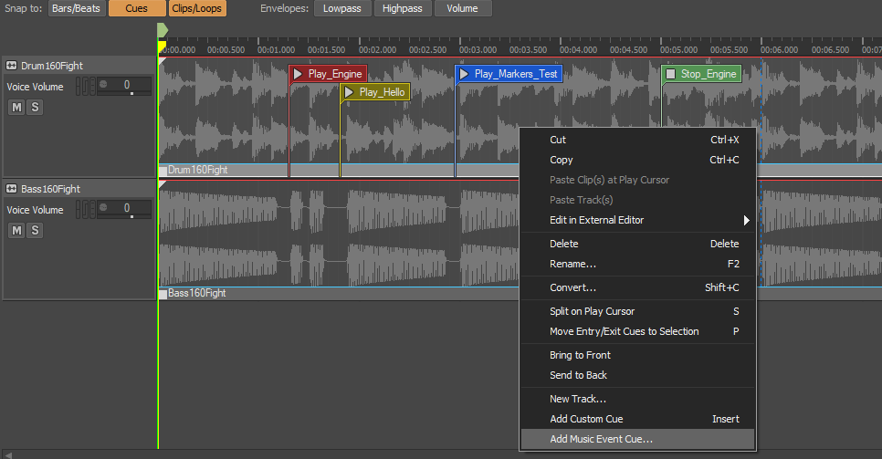
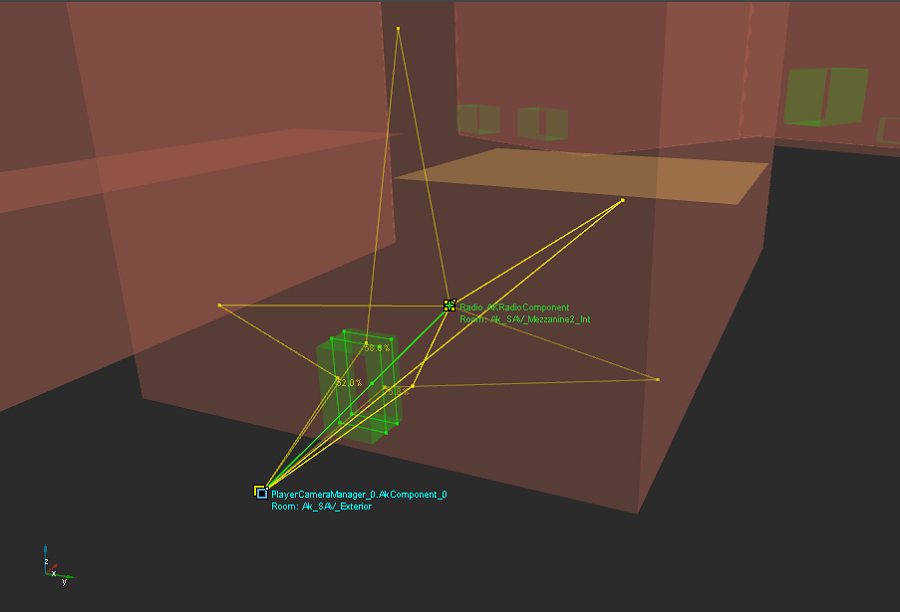
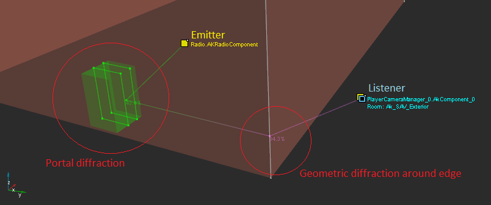
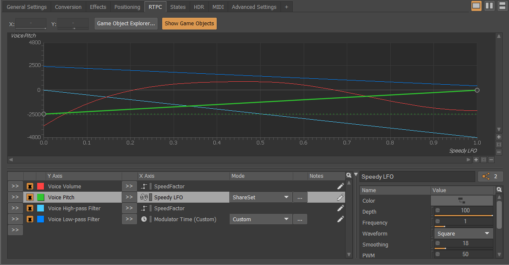
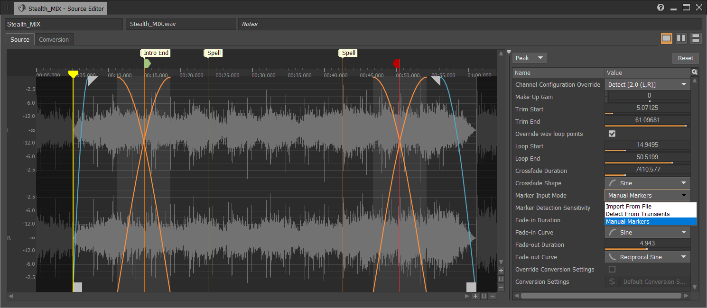
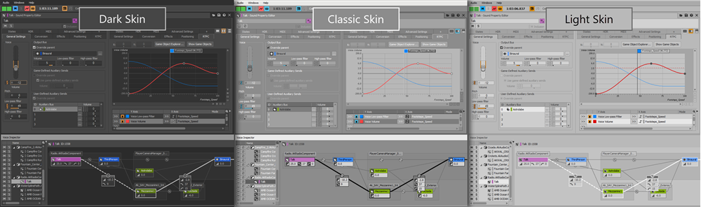

# 新功能概述2019.1

|  |
| --- |
| Wwise SDK 2025.1.4 - Windows |

新功能概述2019.1

# Voice Inspector

Wwise 的灵活性非常强，通常一个工程并不需要太大或者多复杂，用户就会遇到像*为什么这个声音的音量那么低？*这样的问题。为了让用户更加便捷的解决这类问题，我们新增了 Voice Inspector。它可以在声部存在期间显示针对音量、LPF 和 HPF 所做的全部修改。Voice Inspector 的 Voice Graph 面板每次会聚焦于一个声部，并详细显示所有的连接、路径（干声和湿声）和射线（将多个听者连接到游戏对象关系），避免了在详细调查属性变化时盲目推测。

具体来说，Voice Inspector 会显示针对以下元素所做的 Volume、LPF 和 HPF 修改：

- 声部层级结构中的所有对象，包括与音频设备对应的音频源、Master Audio Bus。
- RTPC、State、HDR、Aux Send、Event Action、Mute 和 Solo。
- Distance Attenuation、Cone Attenuation、Obstruction 和 Occlusion。
- 自动闪避、补偿增益、Randomizer 和特定 API 调用。

另外，Wwise 还添加了新的布局：Voice Profiler (F11)。Voice Profiler 布局显示在 Voice Inspector 中间，同时包含有 Voice Monitor，允许简要查看所有声部音量，还方便滚动捕获会话的时间线。

# Interactive Music

为了提高设计操作的便捷性和灵活性，我们对 Interactive Music Hierarchy 实施了两项改进：

- 现在可从 Music Segment 触发 Wwise Event。如此一来，便可创建各种新场景，进一步加强音乐与玩法之间的协调性，增添游戏配乐的声音交互变化。

  
- Music Playlist Container 新增了两个音乐过渡 Destination Jump 选项：**Last Played Segment** 和 **Next Segment**。在返回播放列表时，现在可从上次播放的位置继续播放，而不用从头开始播放。比如，假如在某一 Music Playlist Container 中播放了 Music Segment A、B 和 C，然后过渡到另一 Music Playlist Container，现在可从前一 Music Playlist Container 的 Music Segment C 或 D 开始继续播放，而不用像以前一样必须从 Music Segment A 开始从头播放。

  

# 空间音频

我们进一步优化了 Spatial Audio 的行为和性能。

## 通过门户传播反射声

在发声体与听者不在同一房间时，假如仍可通过门户听到声音，现在会执行 Wwise Reflect 早期反射计算，同时将门户衍射应用于反射路径。

## 实现了穿过房间和门户的声音路径与几何衍射路径之间的统一

在发声体与听者不在同一房间时，将把声音路径作为几何衍射（边缘衍射）和门户衍射生成的组合路径来进行计算。

## 无需在门户与几何构造相交时另建开口

即便有多达两个平面与门户开口相交，反射声也可穿过门户。因为门户本身来说就是声学开口，所以不用在几何构造上另建开口，声音也能穿过。如此一来，便大大减少了声音传播所需的三角形总数。

## Spatial Audio 优化

- **降低了更新速率：** 使用了新的 Spatial Audio 初始化参数来控制移动阈值。只要发声体和听者没有移到阈值定义的半径之外，Spatial Audio 就不会执行新的计算。这样可以降低 CPU 用量，不过精度会有所下降。事实上，根本没有必要每一帧都更新路径计算，完全可以在精度和 CPU 用量之间适当取舍。
- **支持多线程处理：** 通过平台初始化设置在 Wwise 声音引擎中实现了多线程处理，同时允许 Spatial Audio 在多个线程中为多个发声体执行路径计算。
- **将几何构造范围限定在单个房间：** 现在可以通过向各个独立房间指派声音传播几何构造集，来限制反射表面的搜索范围以及射线交叉计算。

# Wwise 设计工具

经过各种增强和改进，Wwise 设计工具变得比以前更加整洁时髦了。

## 用户体验和工作流改进

- **RTPC 选项卡**
  - 在 RTPC 选项卡的曲线列表右侧新增了一个面板，允许直接更改游戏参数、MIDI、LFO、Envelope 和 Time 属性值。
  - 新增了 Find All References 按钮，既可显示有多少对象在共用同一游戏参数，也可通过单击来打开 Reference View。
  - 现在可通过右键单击滑杆、推子、下拉菜单和复选框，来直接从上下文菜单添加 RTPC。
  - 添加了横向分隔器，十分方便处理使用了多条曲线的对象。
  - 新增了可关联 RTPC 的 Enable Attenuation 属性，让你来控制是否应用 Attenuation ShareSet。

    
- **Source Editor**
  - 为了最大化波形编辑窗口，重新调整了 Source Editor 视图。现在将所有音频源属性显示到了波形右侧的窗格。该窗格既可调整大小，还可展开和折叠。
  - 现在可在 Source Editor 中查看标记，并更改其位置和名称。

    
- **Project Explorer**
  - 现在允许将对象复制粘贴到本身所在位置，不用像以前一样要选择父对象才能复制子对象。
- **布局**
  - 现在会保存最后使用的布局，并在加载工程后自动恢复为该布局。
- **Work Unit**
  - 现在在从不同的工程导入 Work Unit（WWU 文件）时，取消链接的属性会保留。
- **Logs 视图**
  - 新增了 Logs 视图，包含了启动、工程加载、SoundBank 生成、音频文件转码和 WAAPI 消息。此视图可替代原来的 Project Load Log 和 SoundBank Generation Log 视图。
  - 在 Wwise 界面右上角添加了日志信息摘要，直接双击便可打开 Logs 视图。

    
- **Wwise 皮肤**
  - 新增了实验性的 Light 皮肤，具有比 Classic 皮肤更高的对比度。

    
  - 配色由调节皮肤色调改成了仅影响中性灰界面元素。

## 键盘快捷方式

- **Mute 和 Solo** 键盘快捷方式现在分别默认为 **Alt+M** 和 **Alt+S**。
- 现在可在 Project Explorer 中使用 **Tab 键**来浏览层级结构。
- **卷标提示**现在会显示与其关联的键盘快捷键。
- 现在可在 Profiler 布局中使用 **Alt+,** 和 **Alt+.** 移动到**上一帧和下一帧**。

## SoundSeed Grain

除了多项漏洞修复和 UX 调整，我们还对 SoundSeed Grain 源插件实施了以下改进：

- 现在支持 Vorbis。
- 针对所有包络类型优化了性能。
- 右键单击调制器图标可快速添加调制。
- 双击调制器图标可在调制列表中将其选中。

# 性能优化

我们对多个 Wwise 区域进行了优化。

- 大大减少了使用 Wwise 执行性能分析时的CPU开销。过去在执行性能分析时如果您发现速度有所减慢，那么现在您会发现有了很大提升。
- Performance Monitor 现在会显示平均曲线，方便按照曲线来配置采样间隔。我们将 Audio Thread CPU 和 Total Plug-in CPU 计时器设成了高频分辨率，而将其他曲线保留设为了原有的 200 ms 采样间隔。
- Spatial Audio 现在可向游戏的任务调度程序发送各项反射和衍射处理任务，并允许在 CPU 核心之间并行执行任务。通过更好地利用可使用的 CPU 资源，提升了系统的整体效率。
- 提升了 RTPC 和 Virtual Voice 管理性能。
- 将 Crankcase REV 源插件的运行速度提升了 4 ~ 10 倍。
- ADPCM 和 Opus 编解码器：
  - 将原有 ADPCM 编码器替换成了 Platinum Games 版本，提升了编码品质。不过，仍然兼容原有 ADPCM 文件。另请参阅 [ADPCM 编解码器不再有 Encoding Mode 属性](whatsnew_2019_1_migration.html#adpcm_codec_change) 迁移说明。
  - 将 Opus 编解码器更新到了 [1.3 版本](https://people.xiph.org/~jm/opus/opus-1.3/)，带来了品质提升，尤其是对于低比特率语音。在经过此次更新后，还将完全支持 Ambisonics。
- Android 延迟：
  - 对于运行 Android 8.1 或更高版本的设备，Wwise 现在支持使用 AAudio 低延迟 API。
  - Wwise 现在会在出现声部匮乏时根据硬件来自动增大缓冲区大小。

# Wwise 命令行界面 (WwiseCLI)

- WwiseCLI 现在支持 `-LoadProject` 选项，允许快速加载并退出工程。在结合使用 `-Save` 时，可自动迁移工程。

# WAAPI 改进

- 在新的 Logs 视图中设置了 WAAPI 专用选项卡。另请参阅 [WAAPI 日志条目格式](whatsnew_2019_1_migration.html#migration_waapi_log_return) 迁移说明。
- 现在默认启用 WAAPI，允许马上连接本地主机。
- WAAPI 返回选项现在支持级联表达式。
- 另外还实施了多项其他 WAAPI 改进，如性能分析器函数和随机化器设置。

# Unreal 集成改进

- 暴露了平台特定初始化设置和生成的 SoundBank 文件夹，并可通过 UE4 工程设置来进行配置。
- 向 Blueprint 暴露了 `GetRTPCValue` 和 `SetMultipleSpeakerEmitterPositions` 。

  