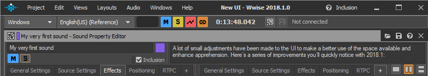
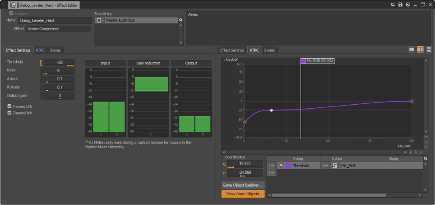
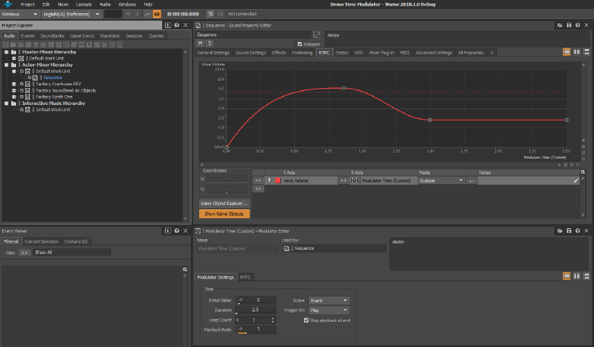
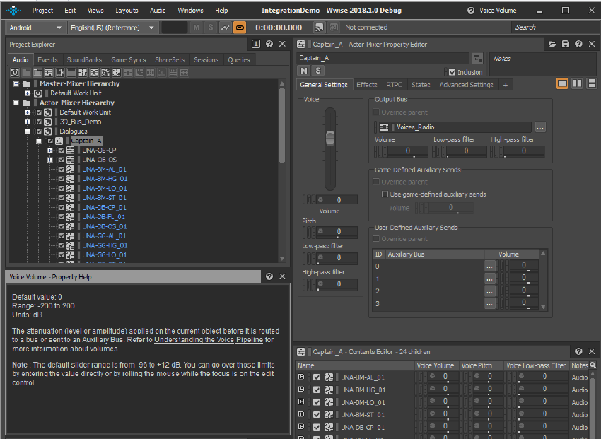
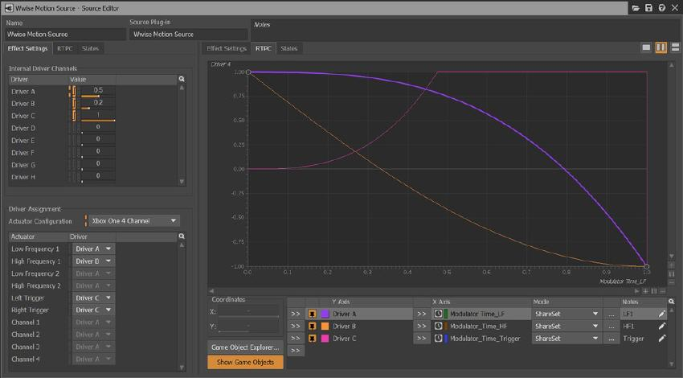
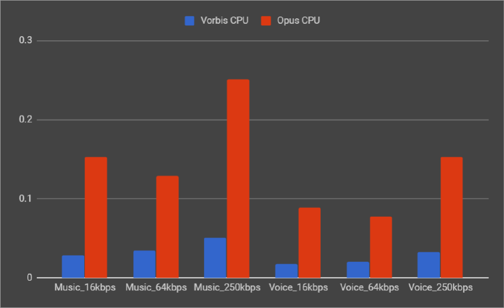
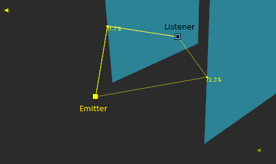
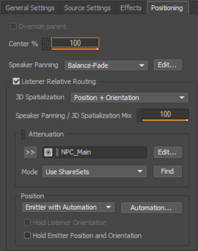
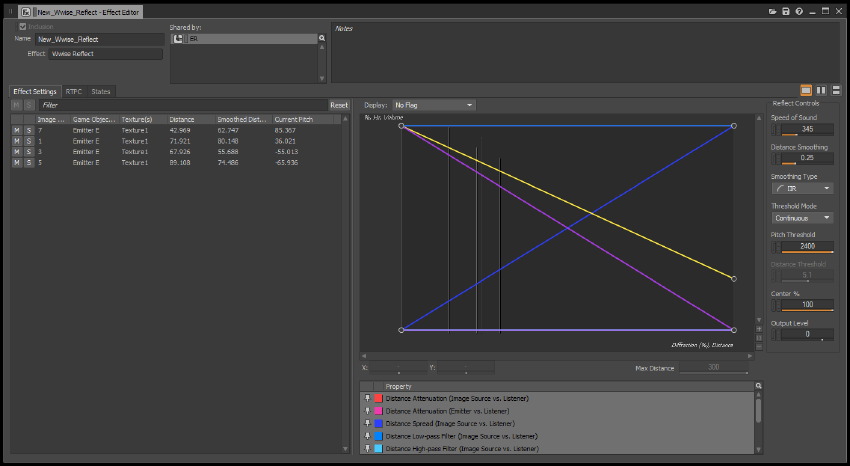

# 新功能概述 2018.1

|  |
| --- |
| Wwise SDK 2025.1.4 - Windows |

新功能概述 2018.1

# 用户界面颜色主题和自定义

为了满足广大用户需求，Wwise 2018.1 新增了 Dark 主题，进一步增强了 Wwise 界面元素的清晰度和对比度。这一全新外观令文本、彩色曲线和其他图标变得更加鲜明，同时也使 Wwise 界面美观了很多。对于习惯原有界面风格的老用户，仍可选择使用 Classic 主题。如果希望主题风格介于 Classic 和 Dark 之间，还可使用亮度、对比度、色调和饱和度控件来自定义用户界面 (UI)。

# 用户界面可供性

全新外观在细节上对 UI 进行了诸多改进，优化了空间利用方式，并增强了可理解性，让用户识别起来更加轻松。下面列出了 Wwise 2018.1 中一些显而易见的功能改进：

- 将主菜单移到了应用程序标题栏。
- 将部分带有名称的按钮（如 Start Capture 和 Follow Capture Time）替换成了图标，节省了大量空间。
- 对部分图标（如 Save Preset、Load Preset、Pin、View Settings 等）进行了重新设计，可更加清晰地表示其自身功能。
- 为了方便色盲用户识别，将 Dark 主题下的多个按钮和所有滑杆设置成了橙色（原为蓝色）。
- 激活状态下的 Mute 和 Solo 按钮采用了不同的颜色。Mute 改为蓝色，Solo 改为黄色。

# 纵向和横向选项卡分隔器

大部分包含选项卡的视图现在都可以纵向或横向分隔，方便用户在两个选项卡中同时查看对象内容。比如，您可以同时查看 General Settings 和 RTPC 选项卡。这在操作时会非常有用！

# 对象颜色

Wwise 中的每个对象（Project Explorer 中可供选择的所有对象）现在都可以分配颜色标签。这样方便用户根据对应状态、所有权或其他类别相关上下文来快速识别特定对象。此外，在 Project Settings 内，还可通过设置工程颜色来创建工程专用菜单条。这样方便用户在同时处理多个不同工程时快速识别所需工程。

# Time Modulator

现在可以结合使用全新 Time Modulator 和 RTPC 曲线来定义属性值随时间自动变化的特性。通过将 Time Modulator 与支持 RTPC 的属性关联，您可以轻松创建各种复杂的音量包络、音高渐变、滤波器调制或其他需要随时间变化的创意应用。

# Contents Editor 中的可配置列

Contents Editor 视图经过更新可提供与其他列表视图相同的功能设置。比如，调整列宽、排序/添加/移除属性列、在 Assigned Objects 分区中按字母顺序显示 Switch、筛选对象等。

# 上下文帮助

全新 Property Help 视图提供选定属性的相应解释。这样可以帮助用户快速了解某些属性或明确特定属性的单位类型和取值范围。此外，Property Help 视图还提供有 Chinese、Japanese 和 Korean 等多种语言版本，方便用户以首选语言查看相关信息。

# Capture Log 功能改进

Capture Log 视图应用了一些精心改进：

- 在将性能分析器连接至游戏时，Capture Log 会同时列出连接之前发生的错误。
- Capture Log 视图整合了与 Wwise 中其他列表视图相同的功能，方便用户自定义列的显示和排序设置。
- 现在可以利用搜索功能搜索所有单元。

# 其他 UI 和流程改进

- 多个视图均支持键盘 Tab 导航。
- 可在 Master Mixer Hierarchy 中复制/粘贴 Bus。同时，还可保存和加载 Bus Preset。
- 现在可在对象之间复制 Effect。
- 在 Advanced Profiler 的 Voices Graph 选项卡中，用户将可通过双击 Effect 直接打开 Effect Editor。
- New Child 上下文菜单将显示所有源插件，便于更快创建新的层级结构。
- Sound SFX 在创建后可转换为 Sound Voice（反之亦然）。
- 在多个视图中添加了分隔器，方便组织管理内容。
- Event Editor 演示流程经过了优化，添加了淡变图标。
- 对于 States 选项卡中的 State Group，将保持用户所选展开/折叠状态。
- Project Explorer 现在支持在拖动时自动滚动，同时更新了展开/折叠选项和命令。
- 现在会在浏览时继续显示工程搜索视图中的显示结果。

# 3D Meter

3D Meter 提供声场分布的球体表示图像。虽然监听点位于球体中心，但您可以在球体外侧查看声能分布（球体设有 Front、Back、Top 和 Perspective 等多个视点）。

在开发过程中，可利用 3D Meter 轻松判定音频源在听者周围的分布及响度。3D Meter 跟峰值电平表一样使用色阶，并设有可配置音量阈值，同时指示听者周围信号的强度。

# Wwise Motion

新增专用源插件 Wwise Motion Source 增强了 Motion 功能，并具备以下优势：

- 更加精准的促动器效果器；
- 跨平台流程；
- 更加灵活：采用 Time Modulator 曲线替换了原来的 ADSR、Period 和 Period Multiplier 设置。

此外，还创建有一系列 Factory Preset，可显示各种触觉反馈事件及其在不同平台上的应用情况。若要获取所述 Preset，请从 Project 菜单选择 Import Factory Assets，并找到 Wwise Motion。

|  |  |
| --- | --- |
|  | **备注:** 原有 Wwise Motion Generator 插件仍然可用，但不推荐使用。 |

# OPUS 编解码器

所有平台现在都支持 OPUS 编解码器。在文件大小存在严格限制时，可使用 Opus 完美替代 Wwise Vorbis。这样只需多占用一些 CPU 资源，便可提高压缩性能，并获得更高的感知品质。这两个编解码器各有所长，可满足不同的文件大小和 CPU 资源要求。

## Opus 循环和寻址说明

Opus 不需要使用寻址表就可以实施寻址或循环，但同时也会增加 CPU 用量和磁盘访问频率（流播放情况下）。因此，最好只将 Opus 用于基本上不需要寻址或循环的声音。注意，文件开头位置的寻址或循环微不足道，并不会造成上述问题。

## 资源用量 – 对比 Opus 和 Vorbis：

从 [listening-test.coresv.net](http://listening-test.coresv.net/results.htm) 的听感测试结果来看，在比特率大致相同的情况下，Opus 编解码器在感知品质方面的表现比 Vorbis 稍胜一筹。乍一听，在文件大小基本相同时品质越高好像越好。然而，Opus 的 CPU 用量却比 Wwise Vorbis 编解码器高出 4 ~ 5 倍。不过，它在压缩大量对白、长音效或流播放乐段（非循环）时仍是不错的选择。

对比 Vorbis 和 Opus 的 CPU 用量

如需详细了解 Opus 在音质方面与其他编解码器的对比情况，请参阅 <https://opus-codec.org/comparison/>。

# Wwise Recorder 插件功能改进

Wwise Recorder 插件现在可以采用 AmbiX 格式录制音频，增强了 Wwise 对 Ambisonics 文件格式的支持。

# WAAPI – 新增 SoundBank 函数和主题

现在可以通过 `ak.wwise.ui.commands.execute` 和键盘快捷方式调用新增命令，便于生成 SoundBank 并在任务完成后自动关闭 SoundBank 生成对话框。

其他新增命令：

- [ak.wwise.core.log.get](ak_wwise_core_log_get.html)
- [ak.wwise.core.log.itemAdded](ak_wwise_core_log_itemadded.html)
- [ak.wwise.core.soundbank.generated](ak_wwise_core_soundbank_generated.html)

# 实验功能

早期采用者将有机会优先使用一些实验功能。实验功能是指尚在开发阶段并将于 Wwise 未来版本中不断改进的功能。这些功能的设置可能有待完善，其性能也仍需改进。不过，这对感兴趣的开发人员来说将会是一个试用最新功能的难得机会。

## 并行执行音频渲染

- 声音引擎现在可以将各项 Voice 和 Bus 处理任务发布至游戏引擎的作业计划程序。这样方便多个 CPU 核心并行执行处理任务，从而更好地利用现有 CPU 资源，并提升系统的整体效率。

## 几何衍射

空间音频几何构造 API 具备以下优势：

- 计算游戏世界几何构造周围的路径，并确定发声体发出的声音须如何衍射才能到达听者所在位置。
- 采用与 Room 和 Portal API 相同的方式进行渲染：使用声障（根据声音路径处理 Volume、LPF 和 HPF）或与 RTPC 绑定。
- 可与 Room 和 Portal 结合使用。虽然几何构造 API 只是利用 Portal 就可更加精细地构建衍射模型，但是同时使用 Room 和 Portal 将可拓宽路径描边，还可减少 CPU 资源占用。
- 在空间音频发声体上应用几何衍射后，无需通过客户端射线检测便可确定声障值。

# Wwise Reflect – 衍射反射

- 采用两种方式对反射路径的衍射进行建模，从而解决自 Wwise 2017.1 添加该插件以来出现的各种常见问题。比如，镜像声源有时会突然显现或消失，导致突然听见或听不见。
- 在表面边缘对非镜面反射进行建模，从而做到让反射声能平滑淡入镜面区域。
- 采用类似于直达路径的方式来衍射被另一表面阻挡的反射，从而平滑淡入可见区域。

发声体和听者介于两个反射壁之间：

- 先进行两次镜面反射：

  
- 再进行两次非镜面反射：

  

# Positioning 选项卡功能增强

Positioning 选项卡中有多项属性在位置上稍有调整或改了名称，其目的在于增强易用性。同时，还添加了一些新的选项。主要变动概述如下：

## R.I.P. 2D/3D

自 90 年代以来，游戏音频就引入了 2D/3D 概念。然而，随着空间音频领域越来越多元化，这两个术语的适用范围越来越窄，有时甚至会造成误解。为了在未来开发中明确概念，我们对两者进行了重新命名：

- 2D 已重命名为 Speaker Panning，目前提供以下两个选项：   
  - Balance-Fade（原来的 2D Panner）
  - Direct Assignment
- 3D 已重命名为 3D Spatialization。

您现在可以同时设置 Speaker Panning 和 3D Spatialization，并在运行时使用混合值来调配两项设置。此 Speaker Panning / 3D Spatialization Mix 属性可与 RTPC 关联，从而实现模式之间的平滑过渡。

此外，原先用于在听者周围创建定位路径的 3D User-defined 功能也进行了重新命名。Automation 更能说明其所具备的功能。除了在听者周围使用自动化之外，现在还可在发声体周围创建自动化路径。

最后，为了更清晰地表示操作行为，还重新命名了以下两个复选框：

- Follow Listener Orientation 已重命名为 Hold Listener Orientation。
- Update at each frame 已重命名为 Hold Emitter Position and Orientation。

# Wwise Reflect 功能改进

- 在实施性能分析时，Game Object 3D Viewer 使用指派给 Acoustic Texture 的颜色。这样便于识别 3D 应用程序在哪里使用了哪些 Acoustic Texture。
- 在延迟线上应用了高级控件，可减少或增加反射所应用的多普勒效果器。

# Unity 集成功能改进

- Unity Editor 中整合了性能分析器使用的通信设置。
- 现在可在 Unity 集成中设置 APU 堆大小。
- 新增了 C# WAAPI Client 类，便于用户自行编写脚本，并通过 WAAPI 与 Wwise 设计工具进行通信。
- 现在可在 Unity Editor 中针对各个平台定义 Wwise 初始化设置（定义各个内存池大小）。

# UE4 Integration 功能改进

- Blueprint 中整合了 Event 和 SoundBank 回调功能。