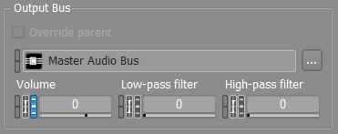
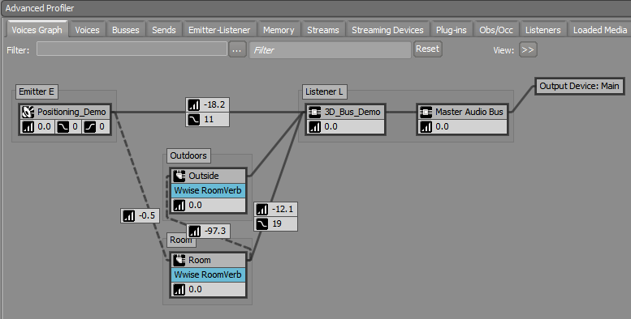
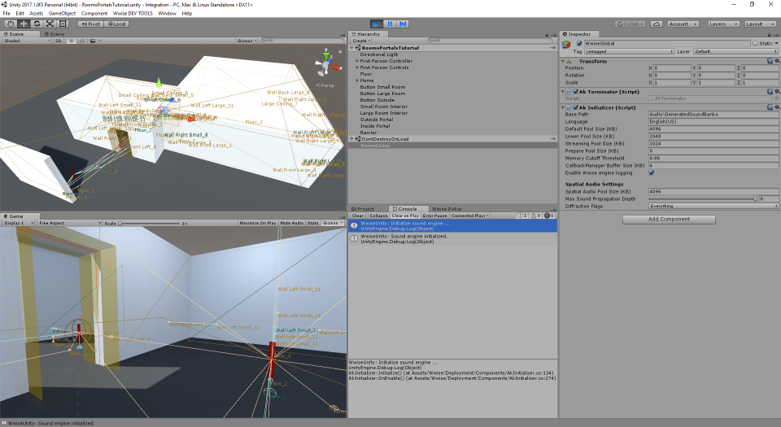
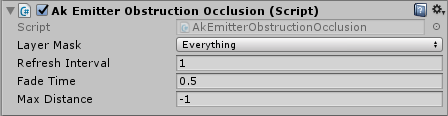
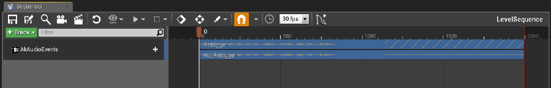
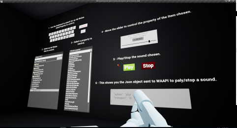
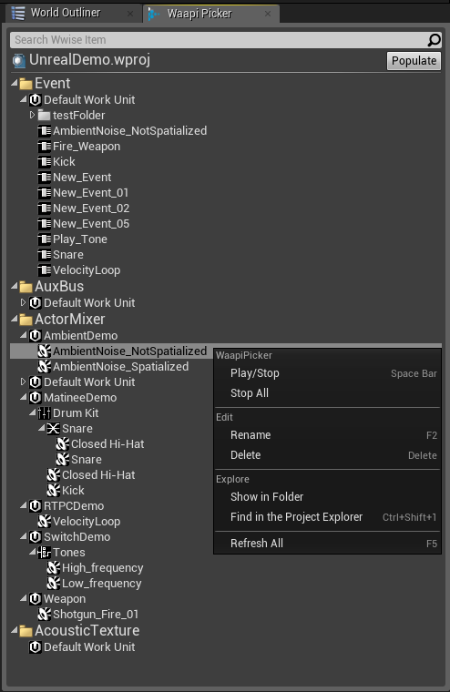

# 新功能概述 2017.2

|  |
| --- |
| Wwise SDK 2025.1.4 - Windows |

新功能概述 2017.2

# State 功能改进

## RTPC 属性现在都可用于 State

所有支持多条 RTPC 曲线的音频属性以及大部分 Wwise 插件属性现在都可通过 State 进行控制。若要为音频对象或插件添加新的 State 属性，只需打开 State Properties 视图并选择相应属性即可（如下所示）。您可以根据对象或插件单独进行选择，不用担心工程使用的各项属性会浪费系统资源。

Link/Unlink 和 RTPC 图标旁边添加了新的 State 图标，便于识别哪些属性可通过 State 进行修改。

## Mixing Desk 流程改进

现在可快速更改要监听 State 变化的 State Group。这样推子就会随着电动控制器的 State 变化而移动。在 Mixing Desk 会话包含多个 State Group 时，还可便捷地展开和折叠 State Group 及其他主类别（如 Monitoring、Positioning 和 Effect）。

# Spatial Audio：声音传播、Room 和 Portal

在 2017.2 开发过程中进一步完善了 Spatial Audio 功能，增强了易用性、运行时效率和操作灵活性。主要元素概述如下：

- 声音传播
  - 从发声体到听者的声音路径现在可穿过一个或多个 Portal。
  - 在声音来自最接近听者的 Portal 时，可使用虚声源位置进行模拟。
- Room 之间的平滑过渡
  - 现在通过音量而非点声源来控制 Portal，使得通过 Portal 时的声像摆位和散布更加平滑和精确。
  - 空间混响现在可随距离变化自动进行平滑的交叉淡变。
  - 空间化 Portal 游戏对象也可发送至听者所在空间。
- 衍射建模
  - 以角度形式表示衍射，取值范围为 0°（无衍射）至 180°。您可以通过声障和新的 *Diffraction* 内置参数来驱动衍射。
  - 发声体干声路径和 Room 湿声路径的角度设置有所不同。干声衍射角度等于与直线路径的偏差角度，湿声衍射角度等于与 Portal 法线的偏差角度。

- 基本透射建模
  - 在没有从发声体到听者的路径穿过 Portal 时，“透射声”路径将穿过墙壁。
  - Room 绑定有墙壁声笼值，便于 Wwise 设置发声体的声笼值。
- Portal 声障
  - 利用 Spatial Audio API，可为 Portal 对象设置游戏驱动的声障值。
- Profiler 功能改进
  - 在 Advanced Profiler 视图的 [Voices Graph](https://www.audiokinetic.com/library/edge/?source=Help&id=voices_graph#graph_view) 中，在音量值的基础上增加了 LPF 和 HPF 值。

- 高效利用 Game Object
  - 在听者位于 Room 外时，将在 Portal 处均衡利用多个位置。现在由于每个 Room 只会生成一个游戏对象实例，所以与2017.1 版本相比性能有了显著提升。
  - 在听者位于 Room 内时，将使用随听者变化的单点位置（不使用朝向）。 **Integrations in UE4, Unity, and an SDK Example Exposed in the Integration Demo Are Provided.**

# Filters in (and on) Busses

为了更好地模拟来自不同功能（如 Wwise 用户参数、Attenuation、Occlusion 和 Obstruction）的滤波器值，重新设计了声音引擎音频信号网络中的内置低通和高通滤波器。在此之前，Wwise 仅针对声部输出设有唯一一个滤波器，因此要占用此滤波器的多个参数值不得不合并为一个值；最终只使用最小值。Wwise 2017.2 允许针对每个独立输出（包括总线输出）分别设置滤波器，无需再将属于不同射线或输出总线的值进行合并。

在使用多个听者的场景中，将会发现这一改进的有用之处。比如，对于具有多个听者的游戏对象，将为每个听者设置不同的 Attenuation 曲线。因为，其所处距离可能有所不同。现在可使用曲线来定义低通滤波器值；在之前版本的 Wwise 中，每个声部只能使用一个低通滤波器值。将单个声部混音到各个发声体的输出总线中时，将把正确的滤波器值（由曲线决定）应用于每条输出总线。

总线新增了 Output Bus Volume、Output Bus LPF 和 Output Bus HPF 控件，方便对混音总线的输出进行滤波。另外，现在还可通过 RTPC 对用户定义的发送进行低通和高通滤波。

# 新增内置参数：Listener Cone 和 Diffraction

- **Listener Cone** 表示听者前部向量和发声体位置之间的角度。利用 Listener Cone，可通过 RTPC 来控制听者声锥。这样便于降低听者前部声锥以外的聚焦度，并模拟麦克风指向性。
- **Diffraction** 表示发声体和听者之间的角度，可与 Portal 结合使用。衍射内置参数值范围为 0°（无衍射）至 180°。该值可用于为 Room 干声和湿声路径构建不同的 Attenuation 曲线。

# Wwise Convolution Reverb 现在配有对应的 Ambisonics IR

原有 Wwise Convolution Reverb 所含全部 ShareSet 和立体声冲激响应现在都配有对应的 Ambisonics 冲激响应。对于允许使用 Convolution Reverb 的工程，可直接从 Wwise 的 Import Factory Assets... 菜单中选择对应的 Ambisonics 冲激响应（需要先从 Audiokinetic Launcher 下载）。

# 重新设计了音频输出管理和振动系统

音频输出管理和振动系统经过重新设计提高了操作灵活性。在此基础上，我们将会不断改进输出管理和触觉设备支持。

## 音频输出管理

- 现在主要在 Wwise 设计工具中管理音频输出，方法是将 Audio Device [ShareSets](https://www.audiokinetic.com/library/edge/?source=Help&id=sharesets_tab) 指派给主总线。
- 现在可在 Master-Mixer Hierarchy 中创建任意数量的主总线，并为其指派具体的音频设备。
- 现在可为特定音频内容（如语音聊天或用户音乐）和音频设备（如游戏控制器或备用物理输出）单独创建 Audio Device ShareSet。
- 现在可为主总线指派不同的输出设备，并将其用于设计工具和运行时声音引擎。这在开发复杂的声音装置时可大大简化设计流程。

## 重新设计了 Wwise Motion

重新设计了 Wwise Motion 用来支持在游戏控制器上产生振动效果的振动系统。现在使用与音频相同的功能和 API，而非像之前一样使用特定的代码路径。这一简化模型便于为 VR 装置或移动平台等设备提供第三方触觉插件支持。

# Wwise Authoring API 功能改进

## Wwise Authoring API 新增功能

2017.2 中添加了 WAAPI 试用用户要求提供的一系列功能。下面是一些相关用例。

- 为了便于在电脑之间传输，现在无需在磁盘上编写文件，便可导入 base64 编码的音频文件。
- 现在可通过 WAAPI 来收集或编辑与音频对象关联的 Switch Container。
- 可通过查询 WAAPI API 来获取所有可用函数。对于每个函数，都将以 JSON 数据规范的形式来返回信息。
- 可利用 WAAPI 将 Wwise 调至前台，并显示其 Process ID。
- 可通过命令行界面使用 Wwise 搜索功能。
- 使用 WAAPI 的应用程序可订阅 Transport 的操作通知。

# 游戏引擎集成 – Unity

## Wwise 空间音频

现在 Unity 集成中全面集成了 Spatial Audio 套件。为了方便用户了解相关功能，还提供有[分步教程](https://www.audiokinetic.com/library/edge/?source=Unity&id=pg_spatialaudio.html)。

## 简单的 Obstruction 和 Occlusion

发声体应用了 *Ak Emitter Obstruction Occlusion* 组件，方便利用基本射线投射系统来为声音设置声障或声笼。场景内有无 Ak Room 组件将决定是否要使用声笼或声障：

- 在场景中添加有 *Ak Room* 组件时，*Ak Emitter Obstruction Occlusion* 组件使用声障。
- 在场景中未添加 *Ak Room* 组件时，*Ak Emitter Obstruction Occlusion* 组件使用声笼。

虽然这一系统对有些游戏来说可能太过初级，但它对很多需要简单直接的声笼和声障管理机制的其它工程来说还是非常有用的。

## 时间线和音频刷听

现在可在时间线中的任意时间点播放音频，便于在编辑游戏电影音效时进行更精确的控制。同时，还支持音频刷听。这在编辑音视频同步时可能会非常有用。

## SoundBank 自动管理

无需再手动复制 *StreamingAssets* 文件夹中的 SoundBank。现在设有预构建处理步骤，方便生成 SoundBank 并将其复制到 Unity 构建管线的相应位置。

## 新增 C# 脚本

现在可通过 C# 脚本将 MIDI Event 发布至 Wwise。同时，还可通过 C# 脚本访问 Wwise Audio Input 源插件。

## 在 Editor 中预览

现在无需进入 Play 模式便可在 Inspector 视图中预览声音。

# 游戏引擎集成 – Unreal

## 在 Sequencer 中整合 DAW 流程

[Unreal Sequencer](https://www.audiokinetic.com/library/edge/?source=UE4&id=using__features__sequencer.html) 经过了重大改进，现在支持刷听音频、在音轨内寻址、显示波形。这些改进在编辑游戏电影音效和线性/交互 VR 体验时将会特别有用。

## 在 UE4 中集成 WAAPI

- **UMG Widget Library**：利用 WAAPI，您可以直接在 Unreal 中控制 Wwise。利用这一新增界面组件库，您可以在 Unreal 中构建自定义 UI，从而优化团队工作流程。

- **Blueprint：现在可从** Blueprint 访问 WAAPI，便于使用内置 UMG 小组件来控制 Wwise。
- **Wwise Picker**：UE4 集成中新增了支持 WAAPI 的 Wwise Picker，便于直接在 Unreal Editor 中完成一系列操作（比如选择音频对象、修改音量、播放/停止）。

## Listener 功能改进

AkComponents 现在可支持多个听者。另外，Unreal Editor 中还添加了一个跟随聚焦视点摄像机位置的听者（未进入 Play in Editor 模式时）。您可以利用这一功能直接在 Animation Editor 中预览声音和距离衰减。