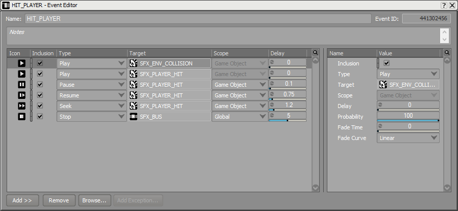
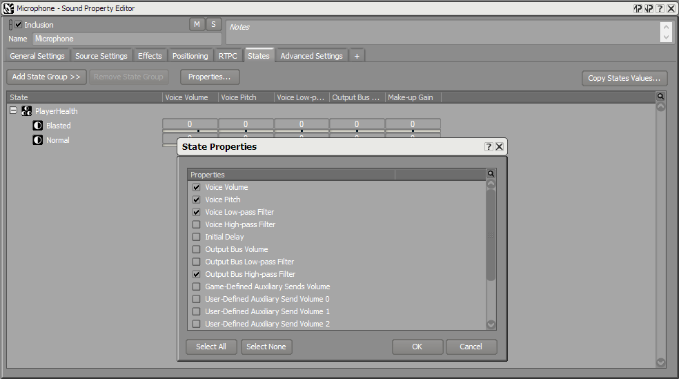
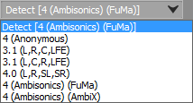
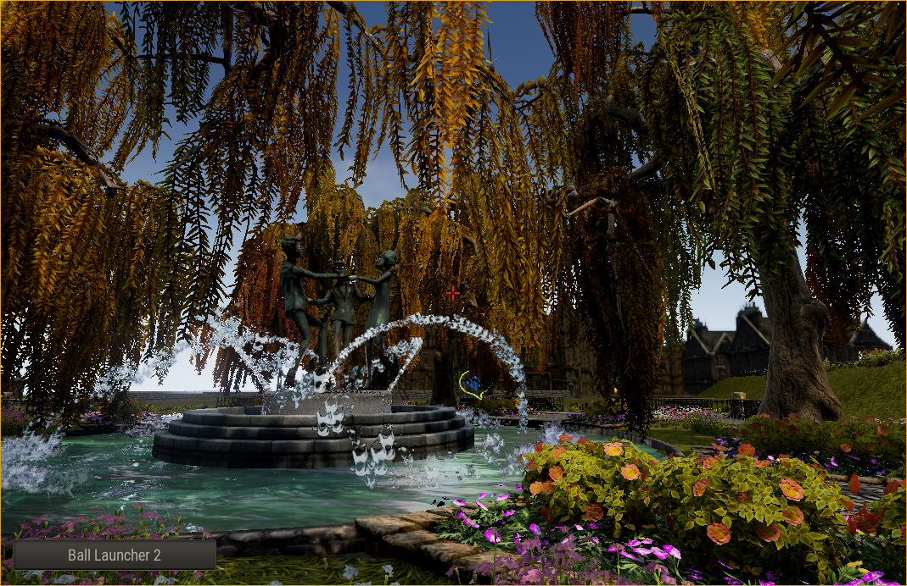
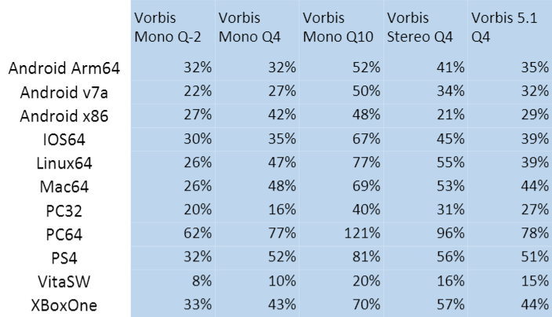
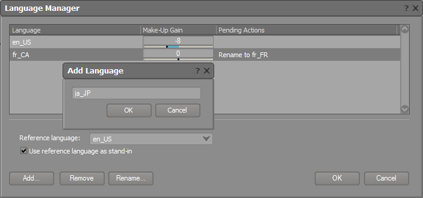

# 新功能概述2017.1

|  |
| --- |
| Wwise SDK 2025.1.4 - Windows |

新功能概述2017.1

# Event Editor（事件编辑器）

重新设计了 Event Editor，改善了可见度并加快了流程。视图的尺寸可以完全自主调整，Action 的属性可以显示出来，以便对比多个 Action 的属性，比如延迟。Action 清单进行了简化并按照类别进行了重新整理。

新的 Event Editor 可用来批量编辑多个 Action 和 Event。比如，现在可以一次操作五个不同 Event 包含的 12 个 Play Action，在它们所有的淡变时间上添加 0.5 秒的偏置。

# States 功能提升

大部分可以附加到 RTPC 的属性现在可以由 State 控制，这极大地扩展了 Wwise 动态混音的能力。想在任意总线或音频对象的 State 选项卡中显示更多属性，只需右键点击列标题并选择 Configure Columns。这样做会显示所有可以由 State 驱动的属性，并且允许用户通过在 State 选项卡中添加和移除属性来管理这张清单。Wwise 未来的版本还计划了新的改进，也会将布尔量和任意能由 RTPC 控制的 Effect 属性包括在内。

# Wwise 空间音频

Wwise Spatial Audio （空间音频）是一个内置空间音频功能家族，配以第一方和第三方插件，能无缝与 Wwise 制作流程集成。Wwise Spatial Audio 专门用于声音传播、虚拟声学，以及考虑空间信息的音频渲染。Wwise Spatial Audio API 提供了多种方式将几何形状发送到 Wwise，这让在大部分游戏引擎中的集成变得更为容易。UE4 的集成现已可下载安装，对 Unity 的支持正在制作中，应该会在今年晚些时候发布。

# Wwise Reflect 插件

Wwise Reflect 是一个 Effect 插件，它使用从游戏中接收到的几何形状来实时生成动态早期反射。考虑到性能，根据目标平台的可用内存和 CPU，该系统能生成的反射数目范围可从几个到几百个不等。

在 Wwise 中，用户可以对反射设置音量和滤波器，以及随着距离的散布衰减曲线。 Acoustic Textures（声学纹理），作为一个四波段滤波器，也可以被指派到反射面，通过对各条反射进行相应的滤波来模拟材质（如木头、干墙和混凝土）对声音的吸收。在制作过程中，Wwise Reflect 插件提供了多个内置于用户界面的调试工具，这使系统更易预测，并且相对更为易用。

## 3D 总线

3D 总线对信号流中任意位置的声音或混响组进行子混音，并将这些子混音置于 3D 世界之中，以此为程序员提供了高性能声音传播解决方案的组件。这让它们成为了实现空间音频特效的关键元素，如动态房间门户以及有向混响。

听者不再是独特的实体。它们现在也成为了游戏对象，总线可以关联它们并被置于 3D 空间中。

# LFO 调制器

LFO 调制器波形中添加了“Random（随机）”。

# Source Editor（源编辑器）声道设置

现在可以在 Source Editor 视图中变更音频文件的声道设置。比如，一个四声道的音频文件可以重新设置为 3.1（L，R，CLFE），3.1（L，C，R，LFE），4.0（L，R，SL，SR），Ambisonics（FuMa），Ambisonics（AmbiX），或 4（anonymous）。在这个选项中，也可以将单声道文件变更为 LFE，并且不需要使用 Multi-Channel Creator 工具。

# 回放游标

在 Source Editor 中，现在我们（终于！）可以看到伴随波形显示的回放游标了。现在可以点击波形显示的任意位置，从该处开始回放。

# Wwise Authoring API

Wwise Authoring API（WAAPI）允许任何外部应用直接与 Wwise 工程进行沟通和互动。它拥有核心层、声音引擎层和用户界面层。核心层用于操作 Wwise 工程数据，以及执行一些任务，如获取 Wwise 对象、对其设置信息、创建新对象等等。用户界面层用来控制视图，当前已选项，对象检查等。WAAPI 应用可以用任何支持互联网的程序语言编写，如 C++、JavaScript、Python 或 C::，并且可以在任何操作系统或 web 浏览器上使用。

WAAPI 能帮助您的团队在特定的工作领域提高生产力，因为它让游戏引擎集成、自动化、远程连接、自定义视图等有了更多可能。

# List View 和 Multi Editor 的改进

List View 和 Multi Editor 中也添加了以下改进：

- 现在可以在 Multi Editor 和 List View 中编辑 notes
- 从 Multi Editor 中编辑子级的新方式
- 现在可以从 Multi Editor 中编辑 Event Action。

# 平台支持

- 添加了对 Visual Studio 2017 的支持。
- Metro，以及该平台的其它名称，已被重命名为 Universal Windows Platform（UWP），并且现在支持 Visual Studio 2017。
- 以下平台在 Wwise 2017.1 中不再支持：
  - Xbox 360
  - PS3
  - Wii U

# Unity 集成

在这个版本中，我们集中移除了之前版本中的很多限制（如要求把特定组件添加到对象以及自动注册 GameObjects），让用户有更多控制权。自动注册游戏对象的代码现在成为了可选项，用户可以选择不安装。

我们也添加了新的 WwiseTypes 变量类型，这让用户能更精细地控制 Wwise 对象所代表的各项功能，而不需要为组件附加预定义的功能。这些新的类型都有自己的属性下拉菜单，当点击它们时会自动带出 Wwise 选择器，用来做游戏音频系统的快速原型设计。

# Wwise Audio Lab

*将在 Wwise 2017.1 后很快发布！* WAL（Wwise Audio Lab）是一个使用 Unreal Engine 4 构建的3D环境，呈现了一系列 Wwise 中可用的声学和空间音频技术和工具。遍布于世界的信息节点提供了很多信息，告诉了我们如何使用或对比特定的3D音频功能，这些信息就是：通过带有不同衰减曲线、混响和反射特效、双耳声、Ambisonics 环境声 vs Quad 的 A/B 对比、有方向的混响和其他功能所实现的 LOD（细节程度）。完整的 Wwise 工程可以用不同的设置进行试验。

WAL 也展现了 Wwise Reflect 插件生成的动态早期反射，并且提供了很好的机会来评估该技术能如何用于您的 UE4 或其他游戏引擎所制作的 3D 项目。最后，对于 UE4 用户，WAL 也提供了很多好的信息，告知用户如何使用 Wwise 与 UE4 集成。

# Vorbis 的重大优化

Vorbis 在更高质量设置时的重大优化（质量越高，优化比越高）。Vorbis 质量设置下各种平台上的优化概览（百分比越高，运行越快）：

# Auro3D

现在支持 Auro3D 的平台有：

- Mac
- iOS
- tvOS
- Linux

# 语言管理器的改善

之前可选择的语言是固定的，现在换成了用户定义的方式，对每个工程都可以决定需要多少种语言，并且可以自由命名这些语言。

# 现在已支持 Wwise 的多个实例

现在可以同时打开多个 Wwise。唯一的限制就是不允许多次打开同一个工程。

# Mac Authoring 成为 64 位应用

Mac Authoring 现在是64位应用了。这让用户可以载入更大的 Wwise 工程。