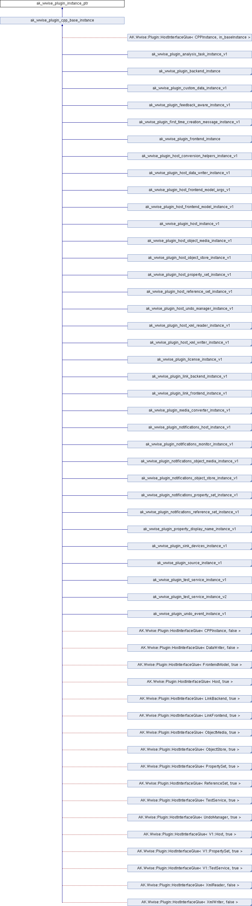

# ak_wwise_plugin_instance_ptr

|  |
| --- |
| Wwise SDK 2025.1.4 - Windows |

ak\_wwise\_plugin\_instance\_ptr结构体 参考

[Global](group__global.html)

Generic base for all plug-in instances. In C++, this is derived. In C, they are equivalent.
[更多...](structak__wwise__plugin__base__instance.html#details)

`#include <PluginInstanceTypes.h>`

类 ak\_wwise\_plugin\_instance\_ptr 继承关系图:

## 详细描述

Generic base for all plug-in instances. In C++, this is derived. In C, they are equivalent.

Pointer to a generic base for a plug-in instances.

参见
:   - [ak\_wwise\_plugin\_cpp\_base\_instance](structak__wwise__plugin__cpp__base__instance.html) for discrepancies between the C and C++ models.

在文件 [PluginInstanceTypes.h](_plugin_instance_types_8h_source.html) 第 [47](_plugin_instance_types_8h_source.html#l00047) 行定义.