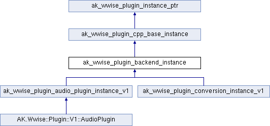

# ak_wwise_plugin_backend_instance

|  |
| --- |
| Wwise SDK 2025.1.4 - Windows |

[所有成员列表](structak__wwise__plugin__backend__instance-members.html)

ak\_wwise\_plugin\_backend\_instance结构体 参考

[Global](group__global.html)

Plug-in backend instance.
[更多...](structak__wwise__plugin__backend__instance.html#details)

`#include <PluginInstanceTypes.h>`

类 ak\_wwise\_plugin\_backend\_instance 继承关系图:

|  |  |
| --- | --- |
| 额外继承的成员函数 | |
| - Public 成员函数 继承自 [ak\_wwise\_plugin\_cpp\_base\_instance](structak__wwise__plugin__cpp__base__instance.html) | |
| virtual | [~ak\_wwise\_plugin\_cpp\_base\_instance](structak__wwise__plugin__cpp__base__instance_a38e5192dde370d925b0489a70374ff01.html#a38e5192dde370d925b0489a70374ff01) () |
|  | |

## 详细描述

Plug-in backend instance.

A backend contains all the logic for the Authoring part of the plug-in. It is uniquely instantiated for each plug-in instance in a project.

在文件 [PluginInstanceTypes.h](_plugin_instance_types_8h_source.html) 第 [103](_plugin_instance_types_8h_source.html#l00103) 行定义.