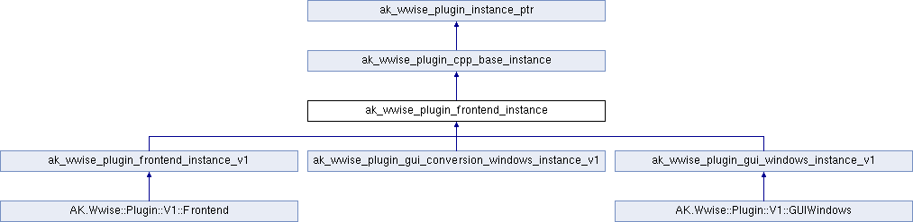

# ak_wwise_plugin_frontend_instance

|  |
| --- |
| Wwise SDK 2025.1.4 - Windows |

[所有成员列表](structak__wwise__plugin__frontend__instance-members.html)

ak\_wwise\_plugin\_frontend\_instance结构体 参考

[Global](group__global.html)

Plug-in frontend instance.
[更多...](structak__wwise__plugin__frontend__instance.html#details)

`#include <PluginInstanceTypes.h>`

类 ak\_wwise\_plugin\_frontend\_instance 继承关系图:

|  |  |
| --- | --- |
| 额外继承的成员函数 | |
| - Public 成员函数 继承自 [ak\_wwise\_plugin\_cpp\_base\_instance](structak__wwise__plugin__cpp__base__instance.html) | |
| virtual | [~ak\_wwise\_plugin\_cpp\_base\_instance](structak__wwise__plugin__cpp__base__instance_a38e5192dde370d925b0489a70374ff01.html#a38e5192dde370d925b0489a70374ff01) () |
|  | |

## 详细描述

Plug-in frontend instance.

A frontend contains the visual part of the Authoring plug-in. It is optional: for example, it is never instantiated when connecting through WwiseConsole. Therefore, do not implement any processing or business work in a frontend part.

For example, avoid using the frontend for handling licensing, SoundBank generation, audio processing, properties (such as validating ranges for property sets), media handling, media conversion, custom data loading, or other related work.

|  |  |
| --- | --- |
|  | **备注:** In legacy plug-ins from before Wwise 2021.1, there is only one instance of the Authoring plug-in that contains both the backend and the frontend. This has changed for multiple reasons: to be able to instantiate a plug-in backend without any frontend, or alternatively, to instantiate multiple copies of a frontend for a unique backend. |

在文件 [PluginInstanceTypes.h](_plugin_instance_types_8h_source.html) 第 [118](_plugin_instance_types_8h_source.html#l00118) 行定义.