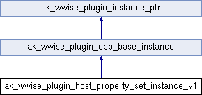

# ak_wwise_plugin_host_property_set_instance_v1

|  |
| --- |
| Wwise SDK 2025.1.4 - Windows |

[所有成员列表](structak__wwise__plugin__host__property__set__instance__v1-members.html)

ak\_wwise\_plugin\_host\_property\_set\_instance\_v1结构体 参考

[Global](group__global.html)

Base host-provided instance type for [ak\_wwise\_plugin\_host\_property\_set\_v1](structak__wwise__plugin__host__property__set__v1.html "Interface used to interact with property sets.").
[更多...](structak__wwise__plugin__host__property__set__instance__v1.html#details)

`#include <PluginInstanceTypes.h>`

类 ak\_wwise\_plugin\_host\_property\_set\_instance\_v1 继承关系图:

|  |  |
| --- | --- |
| 额外继承的成员函数 | |
| - Public 成员函数 继承自 [ak\_wwise\_plugin\_cpp\_base\_instance](structak__wwise__plugin__cpp__base__instance.html) | |
| virtual | [~ak\_wwise\_plugin\_cpp\_base\_instance](structak__wwise__plugin__cpp__base__instance_a38e5192dde370d925b0489a70374ff01.html#a38e5192dde370d925b0489a70374ff01) () |
|  | |

## 详细描述

Base host-provided instance type for [ak\_wwise\_plugin\_host\_property\_set\_v1](structak__wwise__plugin__host__property__set__v1.html "Interface used to interact with property sets.").

Is also compatible with [ak\_wwise\_plugin\_host\_property\_set\_v2](structak__wwise__plugin__host__property__set__v2.html).

参见
:   - [ak\_wwise\_plugin\_host\_property\_set\_v1](structak__wwise__plugin__host__property__set__v1.html "Interface used to interact with property sets.") C interface.
    - [AK::Wwise::Plugin::V1::PropertySet](namespace_a_k_1_1_wwise_1_1_plugin_1_1_v1_ab5503ef97167a06c2b7d7be5c043d081.html#ab5503ef97167a06c2b7d7be5c043d081) C++ class.
    - [ak\_wwise\_plugin\_host\_property\_set\_v2](structak__wwise__plugin__host__property__set__v2.html) C interface.
    - [AK::Wwise::Plugin::V2::PropertySet](class_a_k_1_1_wwise_1_1_plugin_1_1_v2_1_1_property_set.html "Interface used to interact with property sets.") C++ class.

在文件 [PluginInstanceTypes.h](_plugin_instance_types_8h_source.html) 第 [229](_plugin_instance_types_8h_source.html#l00229) 行定义.