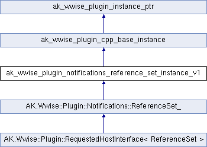

# ak_wwise_plugin_notifications_reference_set_instance_v1

|  |
| --- |
| Wwise SDK 2025.1.4 - Windows |

[所有成员列表](structak__wwise__plugin__notifications__reference__set__instance__v1-members.html)

ak\_wwise\_plugin\_notifications\_reference\_set\_instance\_v1结构体 参考

[Global](group__global.html)

Base instance type for receiving notifications on reference set's changes.
[更多...](structak__wwise__plugin__notifications__reference__set__instance__v1.html#details)

`#include <PluginInstanceTypes.h>`

类 ak\_wwise\_plugin\_notifications\_reference\_set\_instance\_v1 继承关系图:

|  |  |
| --- | --- |
| 额外继承的成员函数 | |
| - Public 成员函数 继承自 [ak\_wwise\_plugin\_cpp\_base\_instance](structak__wwise__plugin__cpp__base__instance.html) | |
| virtual | [~ak\_wwise\_plugin\_cpp\_base\_instance](structak__wwise__plugin__cpp__base__instance_a38e5192dde370d925b0489a70374ff01.html#a38e5192dde370d925b0489a70374ff01) () |
|  | |

## 详细描述

Base instance type for receiving notifications on reference set's changes.

参见
:   - [ak\_wwise\_plugin\_notifications\_reference\_set\_v1](structak__wwise__plugin__notifications__reference__set__v1.html) C interface.
    - [AK::Wwise::Plugin::Notifications::ReferenceSet\_](class_a_k_1_1_wwise_1_1_plugin_1_1_notifications_1_1_reference_set__.html) C++ class.
    - [ak\_wwise\_plugin\_host\_reference\_set\_v1](structak__wwise__plugin__host__reference__set__v1.html "Interface used to interact with reference sets.") Related C host interface.
    - [AK::Wwise::Plugin::ReferenceSet](namespace_a_k_1_1_wwise_1_1_plugin_aa9c66805a7050040225bb144c6be8d06.html#aa9c66805a7050040225bb144c6be8d06) Related C++ host class.

在文件 [PluginInstanceTypes.h](_plugin_instance_types_8h_source.html) 第 [451](_plugin_instance_types_8h_source.html#l00451) 行定义.