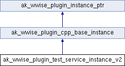

# ak_wwise_plugin_test_service_instance_v2

|  |
| --- |
| Wwise SDK 2025.1.4 - Windows |

[所有成员列表](structak__wwise__plugin__test__service__instance__v2-members.html)

ak\_wwise\_plugin\_test\_service\_instance\_v2结构体 参考

[Global](group__global.html)

`#include <PluginInstanceTypes.h>`

类 ak\_wwise\_plugin\_test\_service\_instance\_v2 继承关系图:

|  |  |
| --- | --- |
| 额外继承的成员函数 | |
| - Public 成员函数 继承自 [ak\_wwise\_plugin\_cpp\_base\_instance](structak__wwise__plugin__cpp__base__instance.html) | |
| virtual | [~ak\_wwise\_plugin\_cpp\_base\_instance](structak__wwise__plugin__cpp__base__instance_a38e5192dde370d925b0489a70374ff01.html#a38e5192dde370d925b0489a70374ff01) () |
|  | |

## 详细描述

在文件 [PluginInstanceTypes.h](_plugin_instance_types_8h_source.html) 第 [505](_plugin_instance_types_8h_source.html#l00505) 行定义.