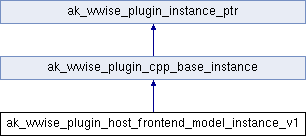

# ak_wwise_plugin_host_frontend_model_instance_v1

|  |
| --- |
| Wwise SDK 2025.1.4 - Windows |

[所有成员列表](structak__wwise__plugin__host__frontend__model__instance__v1-members.html)

ak\_wwise\_plugin\_host\_frontend\_model\_instance\_v1结构体 参考

[Global](group__global.html)

`#include <PluginInstanceTypes.h>`

类 ak\_wwise\_plugin\_host\_frontend\_model\_instance\_v1 继承关系图:

|  |  |
| --- | --- |
| 额外继承的成员函数 | |
| - Public 成员函数 继承自 [ak\_wwise\_plugin\_cpp\_base\_instance](structak__wwise__plugin__cpp__base__instance.html) | |
| virtual | [~ak\_wwise\_plugin\_cpp\_base\_instance](structak__wwise__plugin__cpp__base__instance_a38e5192dde370d925b0489a70374ff01.html#a38e5192dde370d925b0489a70374ff01) () |
|  | |

## 详细描述

在文件 [PluginInstanceTypes.h](_plugin_instance_types_8h_source.html) 第 [510](_plugin_instance_types_8h_source.html#l00510) 行定义.