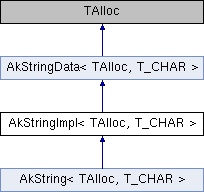

# AkStringImpl

|  |
| --- |
| Wwise SDK 2025.1.4 - Windows |

[所有成员列表](class_ak_string_impl-members.html)

AkStringImpl< TAlloc, T\_CHAR > 模板类 参考

`#include <AkString.h>`

类 AkStringImpl< TAlloc, T\_CHAR > 继承关系图:

|  |  |
| --- | --- |
| 额外继承的成员函数 | |
| - Public 成员函数 继承自 [AkStringData< TAlloc, T\_CHAR >](class_ak_string_data.html) | |
|  | [AkStringData](class_ak_string_data_a03bf201c536ca05cd5acc64c3ce6ba04.html#a03bf201c536ca05cd5acc64c3ce6ba04) () |
|  | |
|  | [AkStringData](class_ak_string_data_aeda0f395d19fc2af5a6d1f2e0be6446e.html#aeda0f395d19fc2af5a6d1f2e0be6446e) (const T\_CHAR \*in\_pStr) |
|  | |
|  | [~AkStringData](class_ak_string_data_ac17da50222f224ed4f280c698b5583a5.html#ac17da50222f224ed4f280c698b5583a5) () |
|  | |
| void | [Term](class_ak_string_data_a307075dd442fcbd7014baf5300244455.html#a307075dd442fcbd7014baf5300244455) () |
|  | |
| void | [ClearReference](class_ak_string_data_ac6cbc85527dcbe050d83856fc0c3936f.html#ac6cbc85527dcbe050d83856fc0c3936f) () |
|  | |
| - Protected 属性 继承自 [AkStringData< TAlloc, T\_CHAR >](class_ak_string_data.html) | |
| const T\_CHAR \* | [pStr](class_ak_string_data_a4ccedeabe08eac744e6d2a93e0727388.html#a4ccedeabe08eac744e6d2a93e0727388) |
|  | |
| bool | [bOwner](class_ak_string_data_aef3b9cbd81105c9ba135b88a0648381c.html#aef3b9cbd81105c9ba135b88a0648381c) |
|  | |

## 详细描述

### template<typename TAlloc, typename T\_CHAR> class AkStringImpl< TAlloc, T\_CHAR >

在文件 [AkString.h](_ak_string_8h_source.html) 第 [62](_ak_string_8h_source.html#l00062) 行定义.