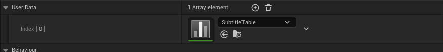

# 使用 Wwise Demo Game

|  |
| --- |
| Wwise Unreal Integration Documentation |

使用 Wwise Demo Game

您可以通过 Audiokinetic Launcher 下载 Wwise Demo Game（包含 Wwise Unreal 集成）。游戏的地图提供有多个演示环节。藉此，可测试各种集成功能。

为了构建演示游戏，您必须安装 Wwise SDK 并修改示例游戏中的 Wwise 集成包。Refer to [Installing Wwise and Component Packages](https://www.audiokinetic.com/library/wwise_launcher/?source=InstallGuide&id=installing_wwise_and_its_components) and [Upgrading or Modifying an Integration Package](https://www.audiokinetic.com/library/wwise_launcher/?source=InstallGuide&id=upgrade_or_modify_wwise_integration) for more information.

**下载 Wwise Demo Game：**

1. In the Audiokinetic Launcher, select the Unreal Engine page.
2. From the **Download** list, click **Demo Game** > **<IntegrationVersion>**.

   

   这时将打开文件资源管理器窗口。
3. 转到要在其中保存 Unreal 工程的文件夹并单击 **Select**。这时会安装所集成的 Unreal 工程。

# 生成 SoundBank

1. 在 Unreal Editor 中打开 WwiseDemoGame。
2. 在工具栏中，转到 **Build** 下，然后从 **Audiokinetic** 类别选择 **Generate SoundBanks...**。
3. 选择全部所需平台和语言，然后单击 **OK**。

在生成 SoundBank 后，会对与 GeneratedSoundBanks 文件夹关联的 Wwise 工程进行重新解析，并重新加载工程中的 Wwise 素材。

# 地图内容

## AkEvent Animation Notify

您可以使用 Animation Notify 将 AkEvent 发送到 SoundEngine。FPP\_Fire 动画中演示了其使用方法。

## Ambient Demo

此地图区域演示了如何使用 [AkAmbientSound](pg_features_objects_actors.html#features_akambientsound) Actor。关卡中的 `AmbientNoise_Spatialized` 环境声发声体由 Level Blueprint 中的 **Start All Ambient Sounds** 节点启动。为了便于找到该 Actor，在游戏当中会将衰减球体绘制成黄色。此发声体所用的 Event 包含在 `AmbientBank` SoundBank 中。

此外，该区域还有助于演示声笼功能。通过让玩家角色走到靠近环境声的墙壁后方（确保待在黄色区域内）或球体中的大箱子后方，可以听到声音上应用的声笼效果。为声音启用声笼的设置位于 Blueprint 关卡的 Ambient Sound handling（红色）部分中。

## AudioLink Demo

This section of the map demonstrates how to route Unreal Audio through Wwise using Unreal's AudioLink tool.

The button triggers the `Template1rst_WeaponFire02` Unreal Audio file, which uses an Unreal Sound Attenuation with AudioLink enabled. A Wwise AudioLink Settings asset is linked to the Sound Attenuation to override the default AudioLink settings. You can confirm that the sound is correctly routed through Wwise by profiling the editor with Wwise. A voice called `UnrealInput` is displayed in the Voices Graph each time the AudioLink Demo button is pressed. Triggering it multiple times generates just as many voices in the Profiler, which demonstrates AudioLink's granular control over audio.

For more information on using AudioLink in your Unreal project, see [Combining Unreal and Wwise Audio with AudioLink](using_audio_link.html).

## Sequencer Demo

此地图区域演示了如何使用 WwiseDemoSequence 资源中的 Event Track 和 RTPC Track。在 Sequencer Editor 中打开关卡序列后，可以看到 Event Track 在播放 Cube 上的鼓声，而 RTPC Track 在驱动 `DrumKitModulation` 游戏参数。

## 封装到 Spatial Audio Tutorial Map

在 Sequencer 旁边，有个隐藏的 Box Trigger。您可以使用它来传送到 Spatial Audio Tutorial Map。这样方便测试地图过渡。

## RTPC Demo

此地图区域演示了如何使用 Level Blueprint 中（绿色评论部分中）指向 Actor 的 **Set RTPCValue** 节点。鼠标滚轮（或游戏手柄方向键的向上和向下按钮，或在触摸屏上双指滑动）与作为 "Velocity" Game Parameter 的变量绑定，可控制 Wwise 工程中 `VelocityLoop` 声音的音高。

Level Blueprint 的 Create RTPC button Event dispatchers 环节还演示了如何使用 **Post Event** 节点为 Actor 发送 Event。

## Reverb Demo

此地图区域演示了如何使用 `AkReverbVolume` 。在球形洞穴内，可使用 `AkReverbVolume` 为武器声添加 Reverb Effect。注意，可将发出声音的 Actor 设为忽略 Use Reverb Volumes 功能。为此，可在 `MyCharacter` Blueprint 中的 `WeaponAkComponent` 上取消选中 Use Reverb Volumes。

## Switch Demo

此地图区域演示了如何使用 Blueprint 设置 Switch（Blueprint 关卡的 Switch Logic 环节）。您可以使用 Button（参见 Button 前方墙壁的相关说明）将 Event 发送到 SoundEngine。通过按下键盘上的 L 或 H（游戏手柄方向键的向左和向右按钮、触摸屏上的三指和四指敲击）更改 Switch 值。

## Subtitle Demo

此地图区域演示了如何在 Blueprint 中使用事件回调以及如何使用 Wwise 素材中的用户数据。

Event 播放的声音文件中包含 WAV 标记。通过注册与 Event 关联的 Marker 回调，可更新 Button 前方墙壁上的字幕。为此，我们在 Level Blueprint 中将 `Callback mask` 输入引脚设成了 `Marker` 。然后，将 `PostEventCallback` 输入引脚关联到了名为 `HandleSubtitles` 的自定义 Blueprint Event。

实际的字幕存储在 `/Game/WwiseAssets/SubtitleTable.uasset` 下的 DataTable 素材中。随后可在 SubtitleEvent 属性中的用户数据处设置此 `SubtitleTable` 。

在 `HandleSubtitles` Event 中，我们使用 [Get Ak Audio Type User Data](features_blueprint.html#blueprint_getAkAudioTypeUserData) 检索用户数据素材。然后使用 `MarkerCallback` 的 `Identifier` 字段作为表格中的索引来访问相应的字幕，之后再将该文本应用于墙壁上的 TextRenderActor。

有关如何在 Blueprint 中使用回调的详细信息，请参阅 [在 Blueprint 中使用回调](features_blueprintcallback.html) 章节。

## External Sources Demo

此地图区域演示了如何在 Blueprint 中使用 External Source。

Level Blueprint 包含 `CurrentExternalSourceArray` 变量。它包含预填的 `AkExternalSourceInfo` 结构。在发送 Event 时，会顺序播放 `CurrentExternalSourceArray` 变量中包含的三个文件。

有关如何使用 External Source 的详细信息，请参阅 [使用 External Source](using_features_ext_src.html) 章节。

## Localized Voice Demo

此地图区域演示了如何在 Blueprint 中使用本地化语音。

根据 Wwise 工程中的配置，由 Event 播放本地化语音。使用向左按钮播放 English 台词，使用向右按钮播放 French 台词。

有关如何使用本地化的详细信息，请参阅 [Localizing Audio Assets](using_features_localization.html) 章节。

## Sub level Demo

此地图区域演示了在拆分 Switch Container Media 时会对 Streaming Level 产生怎样的影响。

此演示游戏中的开场地图仅使用 “Footstep\_Material” Switch Container 中的 “Metal” Switch 值。在连接 Wwise Profiler 时，会显示针对此容器加载的媒体只有 Metal 媒体文件。在按下 Sub Level Demo 上的按钮时，会加载同时使用 “Wood” 和 “Grass” Switch 值的 Streaming Level。在 Wwise Profiler 中，则会加载与这些 Switch 值关联的媒体。再次按下按钮将卸载关卡以及 Grass 和 Wood 媒体文件。

有关如何拆分 Switch Container Media 的详细信息，请参阅 [Optimizing Memory Usage with Reference-Loaded Switch Containers](using_features_reference_load_switch_container.html) 章节。

## Niagara Demo

This section of the map demonstrates the use of Niagara with the Wwise Integration.

To spawn a Niagara System, interact with the button (see the instructions on the wall in front of the button).

To change the type of Niagara System, do one of the following:

- On the keyboard, press L or H.
- On a gamepad, press the D-Pad left or right.
- On a touchscreen, tap the screen three or four times.

For more information on using Niagara with the Wwise Integration, see [使用 Wwise Unreal Niagara Integration](using_features_niagara.html).