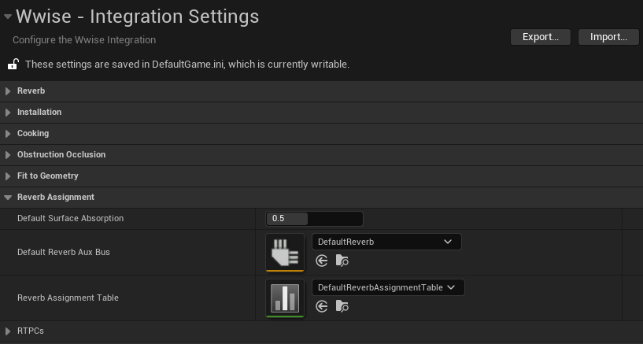
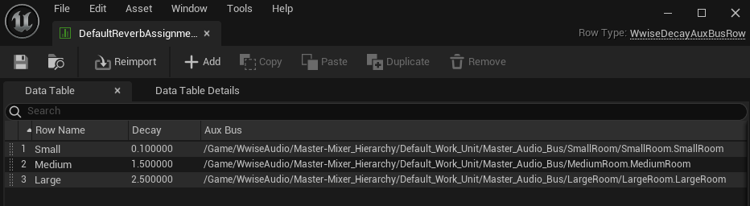
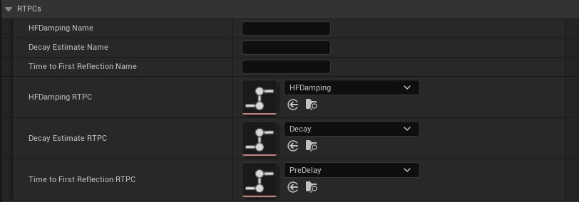

# Working with Reverb

|  |
| --- |
| Wwise Unreal Integration Documentation |

Working with Reverb

With the Wwise Unreal 集成, the [AkLateReverbComponent](pg_features_objects_components.html#features_aklatereverbcomponent) can automatically assign Reverb Aux Busses and drive reverb parameter RTPCs based on the shape and materials of the geometry to which it is attached.

|  |  |
| --- | --- |
|  | **TIP：** See the [Reverb Parameter Estimation](sa_reverbestimation.html) tutorial for example usage of these features. |

# Automatically Assigning a Reverb Aux Bus

Enable the **Auto Assign Aux Bus** property on an [AkLateReverbComponent](pg_features_objects_components.html#features_aklatereverbcomponent) to automatically assign a Reverb Aux Bus to it through the Reverb Assignment Table. This table, located in the project's Wwise Integration Settings, maps Decay values to Aux Bus assets.

Reverb Assignment in the Wwise Integration settings

Based on the geometry associated with the [AkLateReverbComponent](pg_features_objects_components.html#features_aklatereverbcomponent), a Decay estimate is calculated and compared with the Decay values in the table. The automatically assigned bus corresponds to the smallest Decay value in the table that is greater than or equal to the Decay estimate. If the Decay estimate is greater than the maximum Decay value in the table, it is assigned the Default Reverb Aux Bus that is specified in the Wwise Integration Settings.

Example of a simple Reverb Assignment Table with three Aux Busses

For example, based on the table above, if the estimated decay value for a [AkLateReverbComponent](pg_features_objects_components.html#features_aklatereverbcomponent) is 1.3 (seconds), the "MediumRoom" asset is assigned to the component's **Aux Bus** field. If it is 3, the "DefaultReverb" Aux bus asset is assigned instead.

# Decay estimation

The estimated Decay time is the time in seconds for the sound pressure to drop by 60dB. It is calculated using an absorption value that depends on the Acoustic Texture information provided by an associated [AkGeometryComponent](pg_features_spatialaudio.html#features_objects_akgeometrycomponent) or [AkSurfaceReflectorSetComponent](pg_features_spatialaudio.html#features_objects_aksurfacereflectorset). If there is no Acoustic Texture information, the Default Surface Absorption value (also found in the Wwise Integration Settings) is used instead.

The Default Surface Absorption setting

# Driving Reverb RTPCs

When correctly configured, the [AkLateReverbComponent](pg_features_objects_components.html#features_aklatereverbcomponent) automatically estimates reverb parameters and sets them through RTPCs on the reverb Aux Bus. The estimated parameters are the **T60 Decay time**, **High-Frequency Damping** (HFDamping), and **Time To First Reflection**. For more details about these reverb parameters, see the [AkLateReverbComponent](pg_features_objects_components.html#features_aklatereverbcomponent) properties.

The reverb parameter RTPCs are specified in the Wwise Integration settings, either by selecting an RTPC asset or the RTPC name. The RTPC asset fields take precedence over the name fields, and if both fields are empty, no RTPC is set.

Reverb estimation RTPC Assignment in the Wwise Integration settings

|  |  |
| --- | --- |
|  | **注記：**  - In order to set reverb RTPCs, the [AkLateReverbComponent](pg_features_objects_components.html#features_aklatereverbcomponent) must have a sibling [AkRoomComponent](pg_features_spatialaudio.html#features_objects_akroomcomponent) (a [AkRoomComponent](pg_features_spatialaudio.html#features_objects_akroomcomponent) that shares the same Primitive parent component). - The **High-Frequency Damping** is calculated if the [AkLateReverbComponent](pg_features_objects_components.html#features_aklatereverbcomponent) has a sibling [AkGeometryComponent](pg_features_spatialaudio.html#features_objects_akgeometrycomponent) (or [AkSurfaceReflectorSetComponent](pg_features_spatialaudio.html#features_objects_aksurfacereflectorset) if the parent Actor is a Volume). Alternatively, the **AssociateAkTextureSetComponent** blueprint function on the [AkLateReverbComponent](pg_features_objects_components.html#features_aklatereverbcomponent) can be used to associate a non-sibling component and enable this calculation. - The RTPC values are set on the Room's Game Object in the sound engine. |