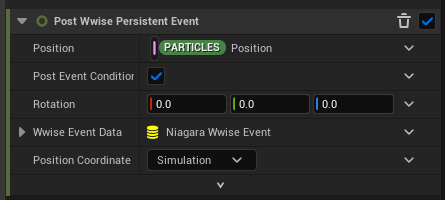
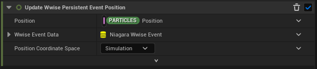
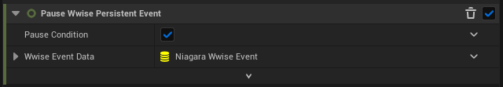
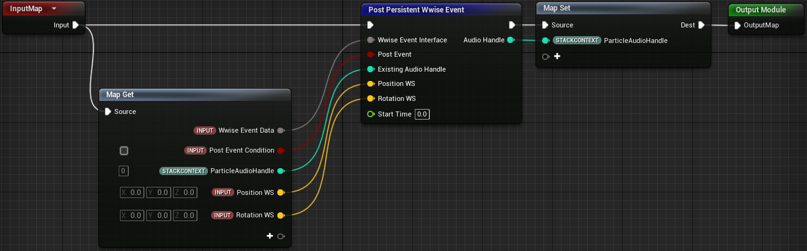
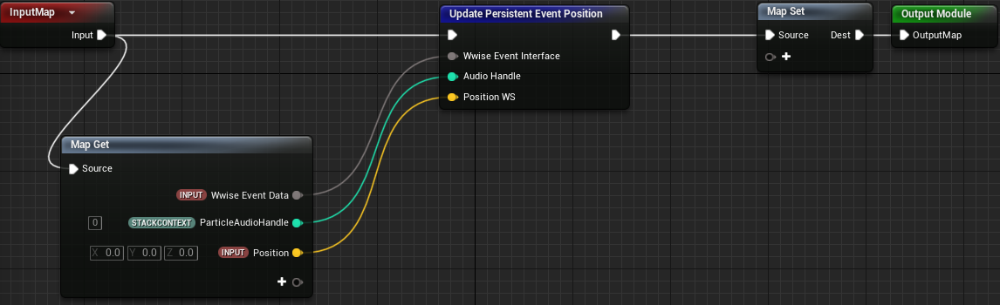
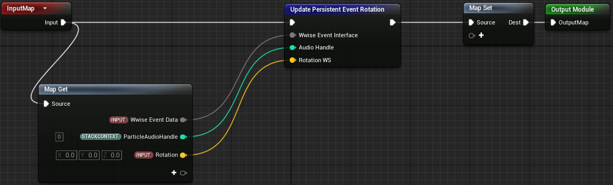
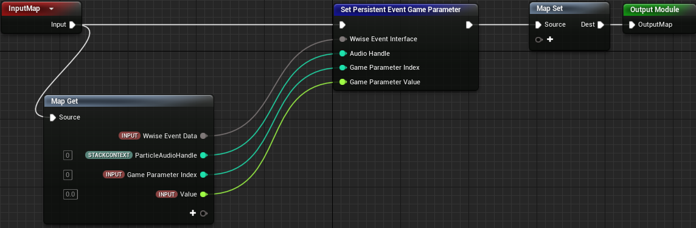
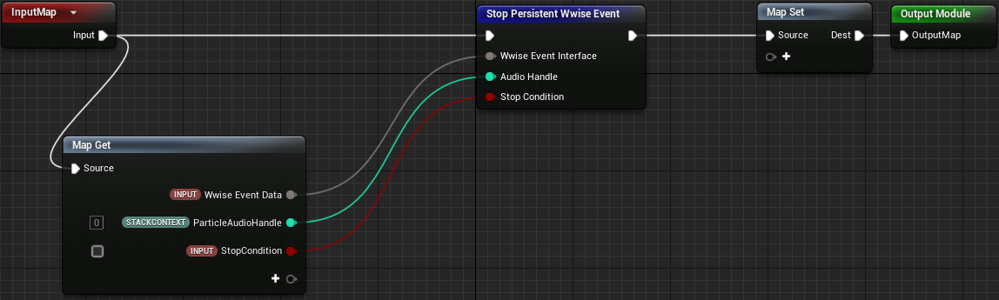
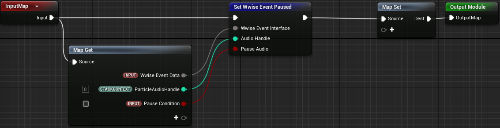

# 使用 Wwise Unreal Niagara Integration

|  |
| --- |
| Wwise Unreal Integration Documentation |

使用 Wwise Unreal Niagara Integration

### 目录

- [激活插件](#using_features_niagara_activating_plugin)
- [Niagara Wwise Event Data Interface](#using_features_niagara_datainterface)
- [Niagara 模块](#using_features_niagara_datainterface_modules)
  - [Post Wwise Event at Location](#using_features_niagara_datainterface_modules_post_at_location)
  - [Post Wwise Persistent Event](#using_features_niagara_datainterface_modules_post_persistent_event)
  - [Update Wwise Persistent Event Position](#using_features_niagara_datainterface_modules_update_position)
  - [Update Wwise Persistent Event Rotation](#using_features_niagara_datainterface_modules_update_rotation)
  - [Set Wwise Persistent Event Game Parameter](#using_features_niagara_datainterface_modules_set_gp)
  - [Stop Wwise Persistent Event](#using_features_niagara_datainterface_modules_stop)
  - [Pause Wwise Persistent Event](#using_features_niagara_datainterface_modules_pause)
- [有关限制活跃 Event 的技巧](#using_features_niagara_concurrency)
- [将粒子数据导出到 Blueprint](#using_features_niagara_export_particle_data)
- [Wwise Niagara 示例](#using_features_niagara_samples)
- [在旧的 Unreal 版本中使用 Wwise Niagara 模块](#using_features_UE4)
  - [Post Wwise Event at Location](#using_features_UE4_post_at_location)
  - [Post Persistent Wwise Event](#using_features_UE4_post_persistent_event)
  - [Update Persistent Event Position](#using_features_UE4_update_position)
  - [Update Persistent Event Rotation](#using_features_UE4_update_rotation)
  - [Set Persistent Event Game Parameter](#using_features_UE4_set_gp)
  - [Stop Persistent Wwise Event](#using_features_UE4_stop)
  - [Pause Persistent Wwise Event](#using_features_UE4_pause)

您可以使用 Unreal 的 Niagara VFX 系统并参照其可视化编程范例来构建复杂的特效系统。For additional information about the Niagara system, refer to the [Niagara Overview](https://dev.epicgames.com/documentation/en-us/unreal-engine/overview-of-niagara-effects-for-unreal-engine).

Wwise Unreal 集成 提供有必要的代码和 Niagara 模块以便在 Niagara 系统内发送和更新 Wwise Event。

# 激活插件

该插件可作为 Engine 或 Game 插件来安装。它会随 Wwise Unreal Engine Integration 插件一起自动安装。 在安装插件后，可在 Unreal Editor 中将其激活。若要激活，请依次选择 **Edit > Plugins**，然后选择 **Wwise Niagara Integration**。

# Niagara Wwise Event Data Interface

Unreal 集成 包含用于 Wwise Event 的 Niagara Data Interface。藉此，可在 Niagara 系统中引用 Wwise Event 和 Game Parameter 素材。此 Data Interface 仅与 Niagara CPU 模拟兼容。您可以使用其来发送一次性和持续性 Event 并在模拟过程中予以控制。对于持续性 Event，数据接口会追踪内部的 Audio Handle，并以此来将粒子或发射器实例映射到所发送的 Event。

|  |  |
| --- | --- |
|  | **注記：** 若要在 GPU 模拟中使用 Wwise Event，则可使用 Export Particle Data 模块（如 [将粒子数据导出到 Blueprint](using_features_niagara.html#using_features_niagara_export_particle_data) 中所述）。 |

**参数：**

- **Event to Post**（*必选*）：所要发送的 AkAudioEvent 素材。
- **Max Posts Per Tick**（*默认：10*）：设置每个时钟周期最多发送多少个 Event。若有更多的粒子尝试在给定时钟周期内播放声音，在达到限值前会一直播放声音，其余的将被弃用。
- **Stop when Component is Destroyed**（*默认：True*）：在 Niagara 组件被销毁（粒子消亡或系统停止或销毁）时停止 Event。在组件被销毁时，循环声音必然会停止。
- **Only Active During Gameplay**（*默认：False*）：仅在游戏过程中处理声音；在打开的 Viewport 中使用 Realtime Rendering 时不处理。在预览窗口中操作而不想听到声音的情况下，该功能会非常有用。
- **Game Parameters**：在 Set Wwise Persistent Event Game Parameter 模块中通过索引来更新的一组 Game Parameter。

# Niagara 模块

Niagara Wwise Event Data Interface 提供各种函数以便发送 Event 并更新其播放和 GameObject 参数。这些函数可在 Niagara 模块中使用，但不可直接用在 Niagara 发射器堆栈中。集成包内包含一组基础 Niagara 模块，其可将这些函数暴露给 Niagara 堆栈。

|  |  |
| --- | --- |
|  | **注記：** 这些模块包含在插件内。因此，在将新的模块添加到脚本时，必须选择 *Plugins* 筛选器以便将其显示在 *Add new Module* 选择框中。 |

## Post Wwise Event at Location

**参数：**

- **Post Event Condition**（*默认：True*）：必须满足该布尔条件才能发送 Event。
- **Position**（*默认：System/Emitter/Particle Position*）：所发送 Event 的空间位置。
- **Rotation**（*默认：0*）：所发送 Event 的空间旋转。
- **Wwise Event Data**（*必选*）： [Niagara Wwise Event Data Interface](using_features_niagara.html#using_features_niagara_datainterface) 。
- **Position Coordinate Space**（*默认：Simulation*）：Position 坐标所用的坐标系。在设为 Simulation 时，与 Emitter 设置保持一致（这时会将 World 坐标发送到 Wwise）；在设为 Local 时，使用相对于发射器的位置；在设为 World 时，使用 World 坐标系。

**行为：**

此模块用于发送一次性 Event（在粒子或发射器的生命周期内无需进行管理）。 它会在给定位置的临时 GameObject 上以既定朝向发送 Event。

|  |  |
| --- | --- |
|  | **注記：** 无法通过这种方式来发送无限时长的 Event，因为必须调用 StopAll() 才能停止此类 Event。 |

|  |  |
| --- | --- |
|  | **警告：** 在短时间内通过粒子系统发送大量 Wwise Event 可能会导致声音引擎过载。务必限制系统每帧可发送的 Event 数量或在 Wwise 工程中[设置 Playback Limit](https://www.audiokinetic.com/library/edge/?source=Help&id=limiting_object_playback_instances)。 |

## Post Wwise Persistent Event

**参数：**

- **Post Event Condition**（*默认：True*）：必须满足该布尔条件才能发送 Event。
- **Position**（*默认：System/Emitter/Particle position*）：所发送 Event 的空间位置。
- **Rotation**（*默认：0*）：所发送 Event 的空间旋转。
- **Wwise Event Data**（*必选*）： [Niagara Wwise Event Data Interface](using_features_niagara.html#using_features_niagara_datainterface) 。其会在更新时引用持续性 Event。
- **Position Coordinate Space**（*默认：Simulation*）：Position 坐标所用的坐标系。在设为 Simulation 时，与 Emitter 设置保持一致（这时会将 World 坐标正确发送到 Wwise）；在设为 Local 时，使用相对于发射器的位置；在设为 World 时，使用 World 坐标系。

**行为：** 在给定位置按照既定旋转设置创建 AkComponent 并针对该组件发送所提供的 Event。在更新循环过程中，由模块保持所发送的给定 Event 的 AkComponent 处于活跃状态。这样可确保在粒子消亡或被剔除时销毁 AkComponent 而不会泄漏内存。 若未在 Update 脚本（System、Emitter、Particle）中更新模块，则销毁 AKComponent。在这种情况下，会在发送后播放一帧的音频并立即终止。 系统会根据 Niagara Wwise Event Data Interface 上的 **Stop when Component is Destroyed** 设置来决定是否在销毁组件时停止所发送的 Event。

若在 Niagara 系统的 **Update** 阶段放置此模块，则在满足 Post Event Condition 时每个实例（发射器或粒子）仅发送一次 Event，同时保持 AkComponent 处于活跃状态。若在 Update 阶段使用了其他持续性 Event 模块，则其会保持 AkComponent 处于活跃状态。这时可在发射器堆栈的 **Spawn** 阶段放置 Post Persistent Event 模块。

|  |  |
| --- | --- |
|  | **注記：** 在使用 Persistent Event 时，必须在处理同一持续性 Event 的模块中为 Wwise Event Data 参数使用相同的属性。在使用相同的属性时，可在其他模块中使用与各个粒子关联的实例数据。该属性可处于 User、System 或 Emitter 层级。 |

您可以使用以下模块来控制持续性 Event 的播放、在 AkComponent 的 GameObject 上设置 Game Parameter、更新 AkComponent 的位置和朝向、在 Sound Engine 内更新 GameObject。

## Update Wwise Persistent Event Position

**参数：**

- **Position**（*默认：System/Emitter/Particle Position*）：所发送 Event 的空间位置。
- **Wwise Event Data**（*必选*）：对 Post Wwise Persistent Event 中设置的 Event Data 的引用。
- **Position Coordinate Space**（*默认：Simulation*）：Position 坐标所用的坐标系。在设为 Simulation 时，与 Emitter 设置保持一致（这时会将 World 坐标发送到 Wwise）；在设为 Local 时，使用相对于发射器的位置；在设为 World 时，使用 World 坐标系。

**行为：**

设置 AkComponent 的位置。

## Update Wwise Persistent Event Rotation

**参数：**

- **Rotation**（*默认：0*）：所发送 Event 的空间旋转。
- **Wwise Event Data**（*必选*）：Niagara Wwise Event Data Interface。

**行为：**

设置 AkComponent 的旋转。

## Set Wwise Persistent Event Game Parameter

**参数：**

- **Game Parameter Index**（*默认：0*）：Wwise Event Data 的 "Game Parameters" 数组中的 Game Parameter 的索引。
- **Game Parameter Value**（*默认：0*）：所需的 Game Parameter 值。
- **Wwise Event Data**（*必选*）：对 Wwise Event Data Interface 的引用。

**行为：**

在 AkComponent 的 GameObject 上设置 Game Parameter 值。

## Stop Wwise Persistent Event

**参数：**

- **Stop Condition**（*默认：True*）：若为 true，则停止播放 Event。
- **Wwise Event Data**（*必选*）：对 Wwise Event Data Interface 的引用。

## Pause Wwise Persistent Event

**参数：**

- **Pause Condition**（*默认：True*）：若为 true，则暂停播放 Event。若为 false，则继续播放。
- **Wwise Event Data**（*必选*）：对 Wwise Event Data Interface 的引用。

# 有关限制活跃 Event 的技巧

在设计用于发送 Wwise Event 的 Niagara 系统时密切监控 Wwise Profiler。在生成的粒子数量过多时使用 **Max Posts per Tick** 参数来对 SoundEngine 的负荷加以限制；不过，若音频 Event 足够长，仍有可能产生大量同时播放的声部。使用 [Wwise 工程中为对象设置的 Playback Limit](https://www.audiokinetic.com/library/edge/?source=Help&id=limiting_object_playback_instances)  来对粒子系统可以生成的声部数做硬性限制。

# 将粒子数据导出到 Blueprint

Export Particle Data 模块提供另一种将 Niagara 系统连接到 Wwise Sound Engine 的解决方案。此模块可将任意粒子数据导出到 Blueprint 并以此实现 Receive Particle Data 接口。在此之后，便可使用 Blueprint 中暴露的各种 Wwise Integration 功能。在默认情况下，Export Particle Data 模块会导出两个矢量和一个浮点值。藉此，可传递有关各个粒子的信息（如 Position、Velocity、Persistent ID 或 Age）。

# Wwise Niagara 示例

Wwise Integration Unreal Gyms 工程提供示例 Niagara 系统用以演示如何使用前述 Niagara Wwise Event Data 接口和模块，并提供 Niagara 系统和 Blueprint Actor 用以演示如何结合 CPU 和 GPU 粒子系统使用 Export Particle Data。

这些示例会发送遵循粒子轨迹的持续性 Event、在这些 Event 上设置 Game Parameter 并在粒子碰撞时发送一次性 Event。

|  |  |
| --- | --- |
|  | **注記：** The sample GPU particle system requires the Generate Mesh Distance Fields setting to be enabled. See [Mesh Distance Fields Properties](https://dev.epicgames.com/documentation/en-us/unreal-engine/mesh-distance-fields-properties-in-unreal-engine). |

# 在旧的 Unreal 版本中使用 Wwise Niagara 模块

所提供的 Niagara 模块与 Unreal 5.X 及更高版本兼容。若使用 Unreal 4，则仍可使用所提供的 Wwise Niagara 功能，但必须重新创建相关的 Niagara 模块。

为此，可创建 FX > Niagara Module Script 类型的素材。

## Post Wwise Event at Location

## Post Persistent Wwise Event

## Update Persistent Event Position

## Update Persistent Event Rotation

## Set Persistent Event Game Parameter

## Stop Persistent Wwise Event

## Pause Persistent Wwise Event

