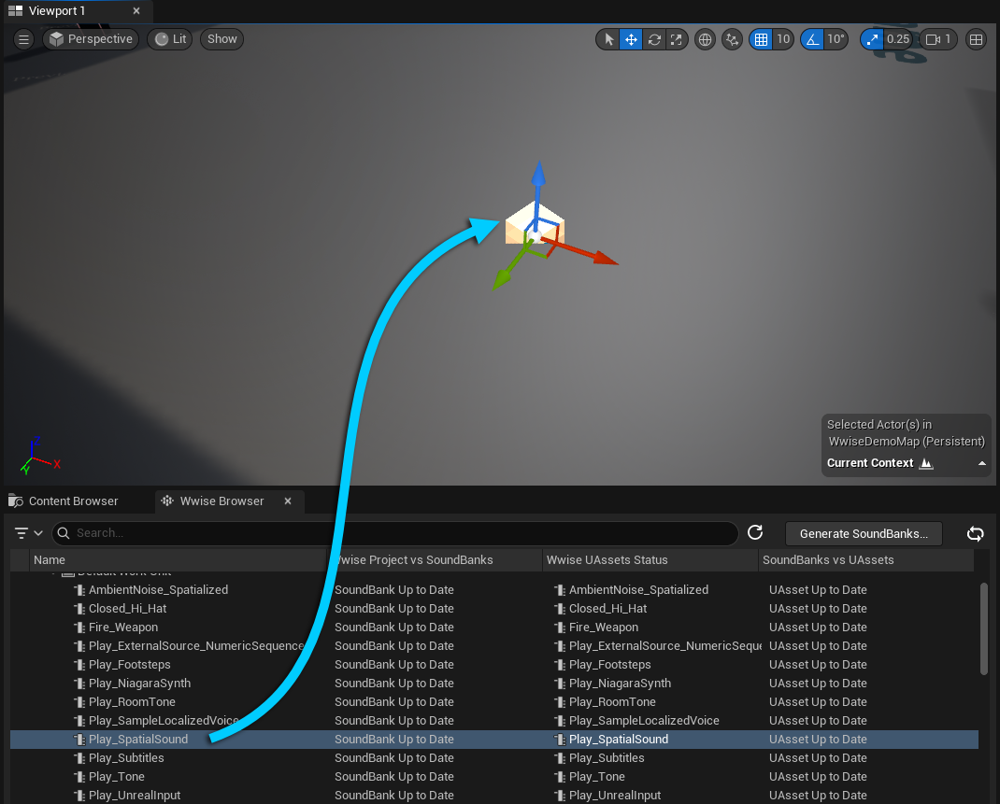
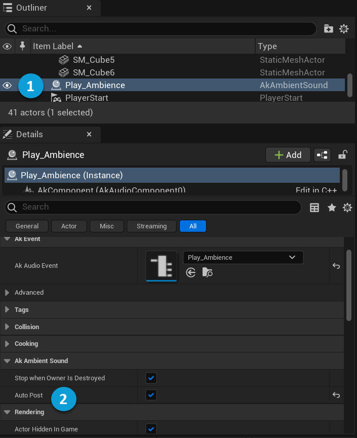
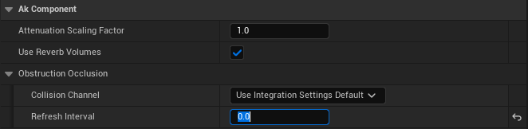

# Adding Ambient Sound to a Level

|  |
| --- |
| Wwise Unreal Integration Documentation |

Adding Ambient Sound to a Level

This tutorial explains how to add an AkAmbientSound asset to an Unreal level to play a looping ambient sound from Wwise.

**To prepare for this tutorial:**

1. Integrate Wwise into your Unreal project, as described in [Integrating Wwise into an Unreal Project](https://www.audiokinetic.com/library/wwise_launcher/?source=InstallGuide&id=integrating_wwise_into_an_unreal_project).
2. Add a looping ambient sound to the Wwise project, and clear the **Hold Emitter Position and Orientation** option in the sound's Positioning properties. Refer to [Managing Media Files in Your Project](https://www.audiokinetic.com/library/edge/?source=Help&id=managing_media_files_in_project) for more information about adding sounds to Wwise.
3. Create a Wwise Event that plays the sound. Refer to [Creating Events](https://www.audiokinetic.com/library/edge/?source=Help&id=creating_events) for more information.
4. Ensure that the Unreal project references the correct SoundBanks folder:
   1. In Unreal, click **Edit** > **Project Settings**. The Project Settings dialog opens.
   2. Scroll to the Wwise section and click **Integration Settings**.
   3. Under Installation, click the ellipses next to Generated Sound Banks Folder. A file explorer opens.
   4. Browse to the Wwise Project's `GeneratedSoundBanks` folder and click **Select Folder**.
5. Ensure that the Wwise Browser is accessible and populated with Wwise project data. If it is not, save your Wwise project or click **Refresh** Button in the Wwise Browser. For more information, refer to [Managing Assets with the Wwise Browser](https://www.audiokinetic.com/library/edge/?source=UE4&id=features_editor_wwise_browser.html).

# Posting a Wwise Event

An easy way to add sounds from Wwise to Unreal is by adding an AkAmbientSound asset to a level. In this case, the AkAmbientSound asset is the emitter, so if you are using Spatial Audio, objects in the level can obstruct the sound. The sound also stops playing when the character exits the level.

**To add an ambient sound:**

1. Open your project in the Unreal Editor.
2. In the menu bar, click **Build** > **Generate SoundBanks**, then click **Generate**. The SoundBanks are generated.
3. Click **Window** > **Wwise Browser**.
4. From the Wwise Browser, drag the Event that plays the ambient sound into the Level Editor. An AkAmbientSound Actor is created in the level, and a `uasset` of the Event is created in the **Default Asset Creation Path**.

   
5. Select the newly created AkAmbientSound (1), and in the Details panel, select **Auto Post** (2).

   

   When you press **Play** in the Unreal Editor, you can now hear the ambient sound.

## Disabling Occlusion

At this point, you can hear the ambient sound as you move around the level. However, if you move the character behind an obstacle in the level, the sound fades out because of occlusion, which is enabled by default. You can disable occlusion, which might be desirable for sounds like ambience or music.

**To disable occlusion:**

1. Select the AkAmbientSound Actor in the level.

   
2. In the Details panel, under Ak Component > Occlusion, set the Occlusion Refresh Interval to 0.

   

   You can now hear the ambient sound anywhere in the level.