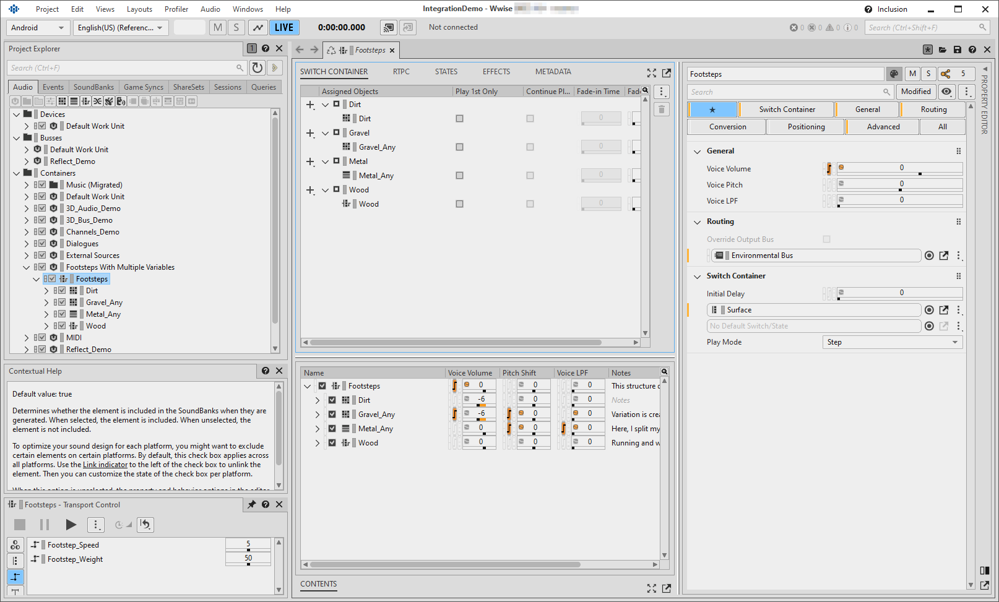
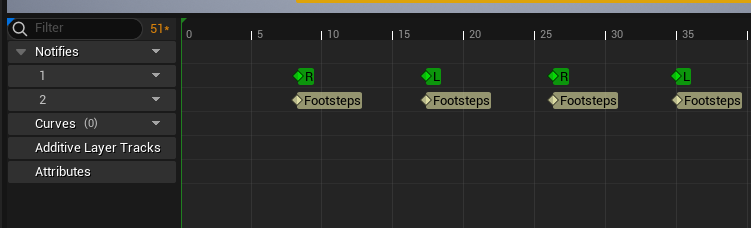
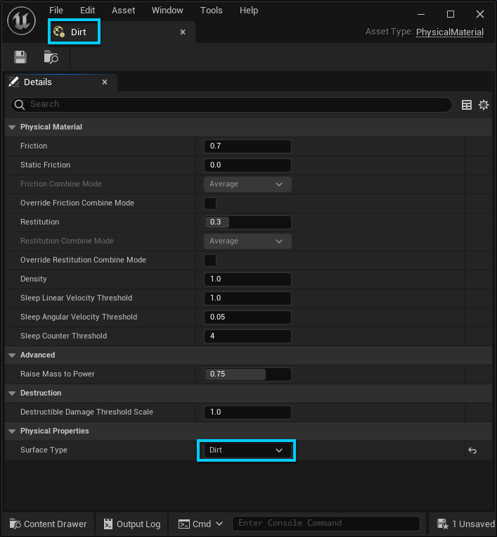
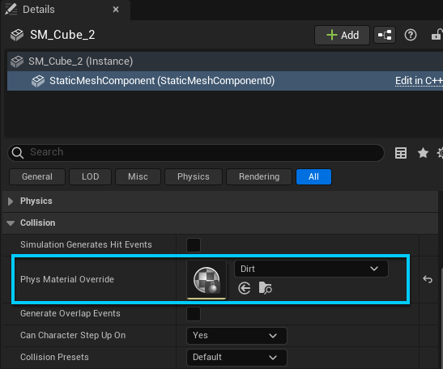
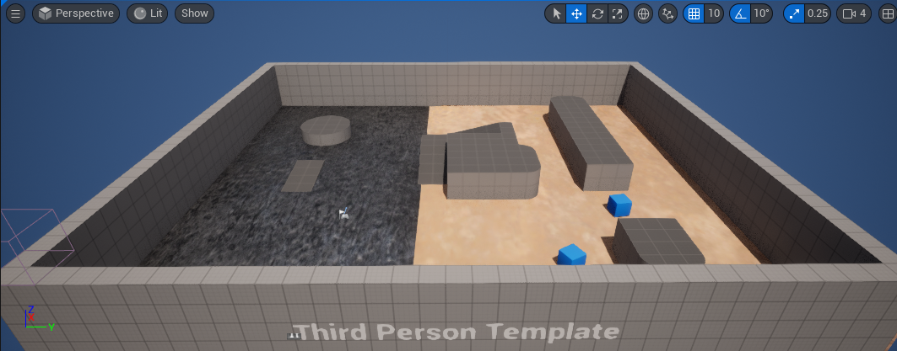
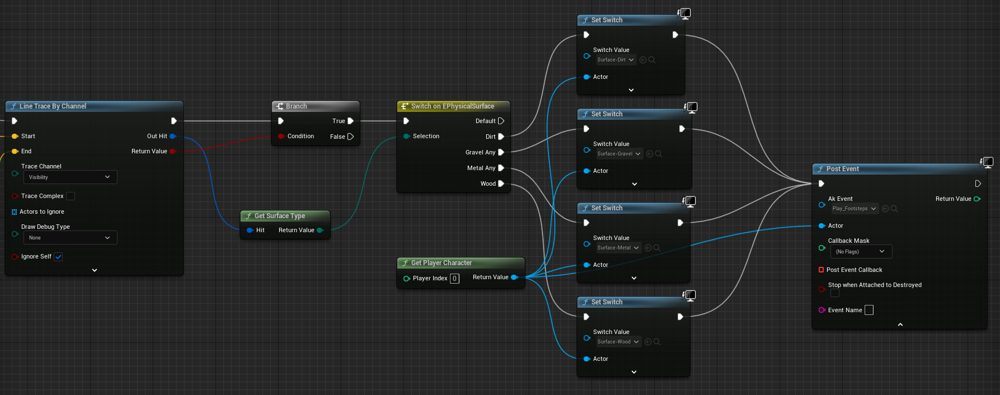
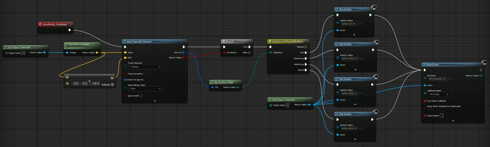

# 整合脚步声

|  |
| --- |
| Wwise Unreal Integration Documentation |

整合脚步声

A common task in game production is posting footstep sounds. This tutorial uses footsteps as a practical demonstration of how to post sounds from a specific moment in animation. You can use the same approach for other sounds and animations, such as doors opening and closing. In addition, the tutorial demonstrates how to use Unreal Surface Types in combination with Wwise Switch Containers to change the sound of footsteps when the player character moves from one type of surface to another.

This tutorial uses the ThirdPersonCharacter project template, which includes a Mannequin (playable character controller) with input controls and animations. The following sections explain how to integrate footstep sounds by adding Animation Notifications to an animation of the character running. A Blueprint receives the notifications and posts the sound.

The footstep implementation in this tutorial uses Unreal's Physics system extensively. For more information, see [Physics](https://dev.epicgames.com/documentation/en-us/unreal-engine/physics-in-unreal-engine).

Before you proceed, create or obtain some footstep sounds for at least two different types of surface (such as dirt, gravel, or grass). You must also do some preparatory work in your Wwise project.

**To prepare for this tutorial:**

1. In Wwise Authoring, create a Switch Group called "Surface" and add Switches for each surface type you plan to use. You need at least two surface types.
2. In the Containers hierarchy, create a Switch Container called "Footsteps" and add sounds or Containers that correspond to different surface types.
3. Assign the Surface Switch Group to the Footsteps Container, set a default Switch value, and assign the appropriate footstep Objects to their corresponding Switches. The following image shows a sample configuration:

   
4. Create an Event called "Play\_Footsteps" to play the Footsteps Switch Container.
5. Generate SoundBanks in Unreal or Wwise Authoring.

|  |  |
| --- | --- |
|  | **TIP：** The Wwise Integration Demo project contains a Footsteps container with sounds for multiple surfaces. |

# Adding Footstep Anim Notifies

To play footstep sounds that are synchronized with the player character's movements in the game, you must use Anim Notifies. The following procedure explains how to add Anim Notifies to character animation states in Unreal, at the precise moment when the character's foot touches the ground. You can then update the character Blueprint to post Wwise Events based on the Anim Notifies.

**To add Anim Notifies for footsteps:**

1. In the Unreal Content Browser, go to **Content** > **Characters** > **Mannequins** > **Animations** > **Quinn** and double-click **MF\_Run\_Fwd**. The [Animation Sequence Editor](https://dev.epicgames.com/documentation/en-us/unreal-engine/animation-sequence-editor-in-unreal-engine) opens.
2. Click the Skeletal Mesh button in the upper right of the window. The SK\_Mannequin Skeletal Mesh opens.
3. In the Animation Notifies panel in the lower right, right-click, then click **New Notify** and type **Footsteps** in the text field.
4. Return to the Animation Sequence Editor, and in the Asset Editor next to Notifies, click **Track** > **Add Notify Track**. A new numbered track is added to the Animation timeline.
5. In the timeline, align the Playhead with the first R in the top track, which is the moment the right foot touches the ground.

   
6. In the timeline, right-click in the new track and click **Add Notify** > **Skeleton Notifies** > **Footsteps**.
7. Copy the Footsteps Anim Notify and paste it so that each of the other R and L notifies has a corresponding Footsteps Anim Notify.

   

# Preparing Surfaces in Unreal

To test footstep sounds on different surfaces, your level must contain at least two different sections of floor, to which you can assign different Physical Materials. You can then associate Switches with the different surfaces so that the footstep sounds change when the character moves from one surface to another. Use surfaces and materials that correspond to the sounds in your Wwise Switch Container.

This approach uses Unreal Static Meshes and Physical Materials. For more information, refer to [Physical Materials](https://dev.epicgames.com/documentation/en-us/unreal-engine/physical-materials-in-unreal-engine) and [Static Meshes](https://dev.epicgames.com/documentation/en-us/unreal-engine/static-meshes).

**To add a second floor surface to the level:**

1. Click **Edit** > **Project Settings**. The Project Settings dialog opens.
2. In the Engine section, click **Physics**.
3. In the Physical Surface section, add separate Surface Type names for each surface in your Wwise project's Switch Container (for example, Dirt, Gravel, Metal, and Wood), then close the Project Settings dialog.
4. In the Level Editor, duplicate the floor object (SM\_Cube) and scale the two objects so that each copy occupies half of the floor area in the level.
5. In the Content Browser, select a folder and click **Add** > **Physics** > **Physical Material**, and in the dialog select **PhysicalMaterial** and click **Select**. A Physical Material asset is added to the folder.
6. Change the name of the material to something that corresponds to one of the Surface Types you added in the Project Settings. Create additional Physical Materials for the remaining surface types.
7. Double-click one of the new Physical Materials and in the Details Panel, under Physical Properties, select the corresponding Surface Type.

   
8. In the Level Editor, select one of the floor objects and in the Details panel, click **StaticMeshComponent** to view the mesh properties.
9. In the Collision section, set the **Phys Material Override** to the desired Physical Material.

   
10. In the Materials section select a Material that resembles the desired Surface Type. Repeat for the second floor object. The following image shows an example of a level with a floor divided into metal and dirt sections.

    

# Using Surface Switches

After you add Footstep Notifies to the character animation and configure the different surfaces in the level, the final step is to configure the Mannequin Blueprint to determine which surface is beneath the player, route that information to the correct Set Switch function, and finally post the Event to Wwise, which then plays the appropriate footstep sound.

This procedure uses the same MF\_Run\_Fwd animation sequence from [Adding Footstep Anim Notifies](gs_footstep_sounds.html#gs_anim_notification).

**To set a Surface Switch:**

1. Open the MF\_Run\_Fwd animation in the Animation Sequence Editor.
2. In the upper right, click the Blueprint icon. The ABP\_Manny Blueprint opens.
3. Configure the first part of the Blueprint with a Line Trace By Channel function to detect the player character's footsteps, as shown in the following image.

   
4. Configure the second part of the Blueprint to detect whether the player is on a valid surface type and if so, to route the signal to the correct Set Switch function and then post the Wwise Play\_Footsteps Event to play the correct sound.

   

   Here is a diagram of the entire Blueprint:

   
5. Click **Compile**.
6. In the Level Editor, click **Play** and move your character over the different surfaces. The sound of the footsteps changes accordingly.