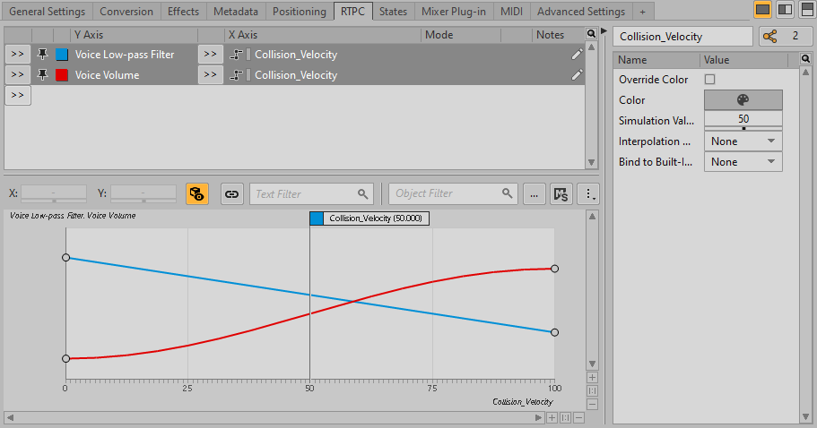
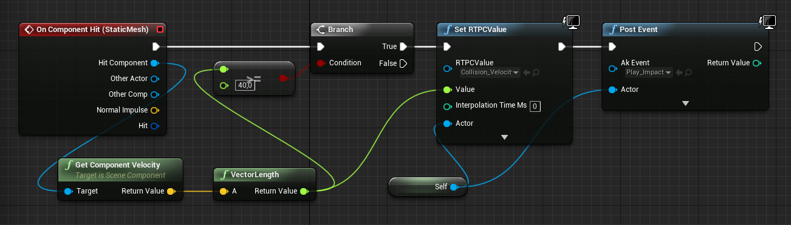
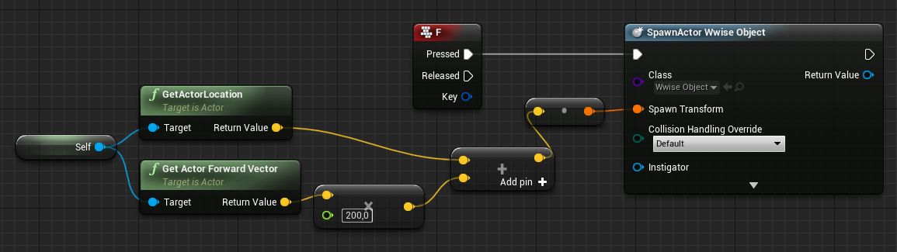

# Adding Sounds to Physical Impacts

|  |
| --- |
| Wwise Unreal Integration Documentation |

Adding Sounds to Physical Impacts

The previous tutorials described how to play music when the game starts and from a specific time in the animation. This tutorial explains how to use Unreal's Physics system to detect collisions between objects and post Wwise Events to play sounds upon impact. It also demonstrates how to use RTPCs to set minimum velocity thresholds to ensure that impact sounds don't play whenever there is minor contact between objects. Finally, it includes a system for instantiating objects in the game to test the impact sound system.

**To prepare for this tutorial:**

1. Obtain a short sound to use for a physical impact and import the sound into Wwise.
2. Create a Game Parameter called "Collision\_Velocity".
3. Add Voice Low-pass Filter and Voice Volume RTPCs associated with the Collision\_Velocity Game Parameter, with curves as shown in the following image:

   
4. Create an Event called "Play\_Impact" that plays the sound.
5. Generate SoundBanks in Unreal or Wwise Authoring.

# Playing Sounds when Objects Collide

**To play a sound when objects collide:**

1. In the Level Editor, select one of the blue boxes.
2. In the Details panel, click the Blueprint icon. The Create Blueprint From Selection dialog opens.
3. Select **New Subclass**, change the Blueprint Name to WwiseObject, and click **Select**. The Blueprint opens.
4. In the Components panel, select the Static Mesh Component.
5. In the Details panel, ensure that the following options are selected:
   - Physics > **Simulate Physics**
   - Collision > **Simulation Generates Hit Events**
6. In the Components panel, right-click **Static Mesh Component**, then click **Add Event** > **Add OnComponentHit**. The Event Graph opens and the On Component Hit Event is added.
7. Configure the Blueprint as shown in the following diagram.

   

   This Blueprint does several things:

   - It detects when the object collides with another object.
   - It sets the value of the Collision\_Velocity RTPC based on the Vector Length of the Component Velocity, and ensures that the value exceeds a minimum threshold of 40, which ensures that minor contacts do not cause impact sounds.
   - It posts the Event to Wwise with the RTPC value, so that Wwise plays the impact sound at the appropriate volume.
8. Click **Compile** and close the Blueprint.
9. Open the BP\_ThirdPersonCharacter Blueprint.
10. In the Event Graph, add a system that spawns Actors from the Wwise Object class when you press **F** in the game, as demonstrated in the following image.

    
11. Click **Compile** and close the Blueprint.
12. In the Level Editor, click **Play** and then press **F** to create a block. When you run into it, the impact sound plays.

参见
:   - [From Audio File to in-game Audio in Unreal](https://www.youtube.com/watch?v=8kDl8w0TwJ8) (video)