# Reverb Parameter Estimation

|  |
| --- |
| Wwise Unreal Integration Documentation |

Reverb Parameter Estimation

在使用与 `UPrimitiveComponent` 绑定的 [AkLateReverbComponent](pg_features_objects_components.html#features_aklatereverbcomponent) 时，可告知 Wwise Unreal 集成依据 `UPrimitiveComponent` 的大小和形状来自动指派混响 **Aux Bus** 。

同样地，Wwise Unreal 集成还可使用 `UPrimitiveComponent` 来估算特定混响参数，并通过 [Driving Reverb RTPCs](features_editor_reverb_estimation.html#features_editor_reverb_estimation_rtpcs) 加以调节。本教程将阐述如何自动指派 Aux Bus 并使用全局混响 RTPC 估算混响参数。

|  |  |
| --- | --- |
|  | **注記：**  - UPrimitiveComponent is a generic Unreal Component that has size and shape. There are many Component types that are based on UPrimitiveComponent, including collision Components, brush Components and mesh Components. See [UPrimitiveComponent](https://dev.epicgames.com/documentation/en-us/unreal-engine/API/Runtime/Engine/Components/UPrimitiveComponent) for more information. - Although Reverb Parameter Estimation is a feature of the [AkLateReverbComponent](pg_features_objects_components.html#features_aklatereverbcomponent), the [AkSpatialAudioVolume](pg_features_spatialaudio.html#features_objects_akspatialaudiovolume) contains an [AkLateReverbComponent](pg_features_objects_components.html#features_aklatereverbcomponent), so it can also make use of the feature. - The [Spatial Audio 教程准备工作](sa_setup.html) must be completed prior to starting this tutorial. |

# 自动指派 Aux Bus

It is possible to automatically associate an Aux Bus with a Spatial Audio Room. You can set up a Reverb Assignment Table in the [Integration Settings](using_initialsetup.html#initialsetup_gamesettings), which maps different Decay values to different Aux Buses.

The Decay value of a Room is the estimation of its T60 decay (see [EstimateT60Decay](https://www.audiokinetic.com/library/edge/?source=SDK&id=namespace_a_k_1_1_spatial_audio_1_1_reverb_estimation_aec6a508d25d6da739457f1eb6f0aac53.html#aec6a508d25d6da739457f1eb6f0aac53)), which is the time (in seconds) required for the sound reverberation in a physical environment to decay by 60 dB.

The following exercise demonstrates how to use the the Reverb Assignment Table to automatically determine which Aux Busses to use for each Room.

Reverb Assignment section the Integration Settings

Before you configure the Decay keys in the table, observe the estimated Decay values for the existing reverbs in the level.

1. Open the SpatialAudioTutorialMap.
2. In the World Outliner, select the Interior\_SmallRoom `AkSpatialAudioVolume`. Selecting **Auto Assign Aux Bus** sets the **Aux Bus** to the Default Reverb Aux Bus specified in the Project Settings because the Reverb Assignment Table is not yet set up.
3. 在 Interior\_SmallRoom 所对应的 Details 面板中，启用 **Auto Assign Aux Bus**。
4. 针对 "Interior\_LargeRoom" `AkSpatialAudioVolume` 重复步骤 2 和 3。

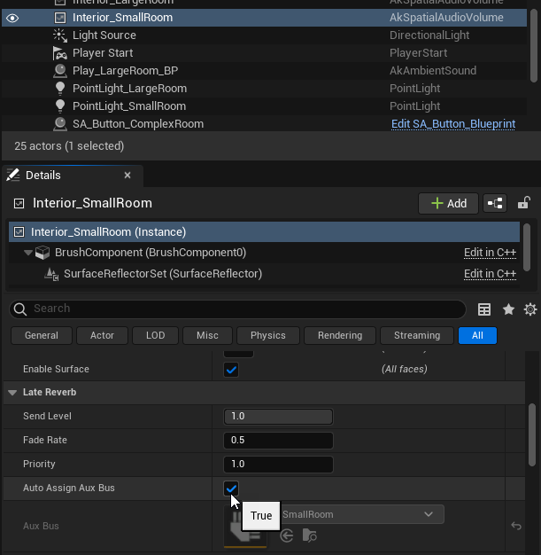

针对 Interior\_SmallRoom 和 Interior\_LargeRoom 启用 Auto Assign Aux Bus

Some text information is displayed above each `AkSpatialAudioVolume` in the viewport when they are selected. Details 面板的 Reverb Parameter Estimation 中也会显示此信息。

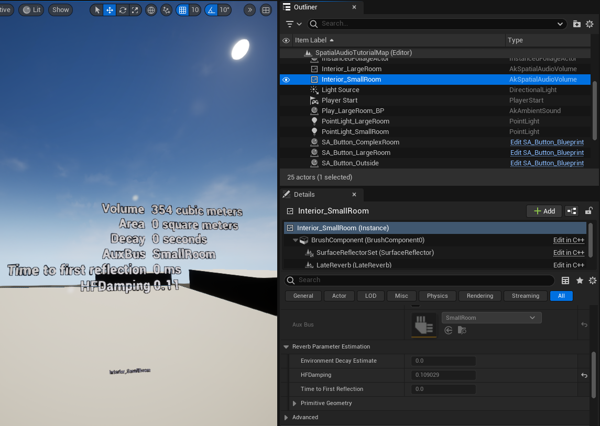

1. In Unreal, click **Edit** > **Project Settings**, then scroll to the Wwise section and click **Integration Settings**.
2. Expand the Reverb Assignment Map section.

   

   Reverb Assignment section the Integration Settings
3. Open the Reverb Assignment Table asset.
4. In the toolbar, click **Add**.
5. Set the Decay value of the new row to 1.0 and set the Aux Bus to SmallRoom.
6. Add another row with a Decay value of 2.0 and set the Aux Bus to LargeRoom.

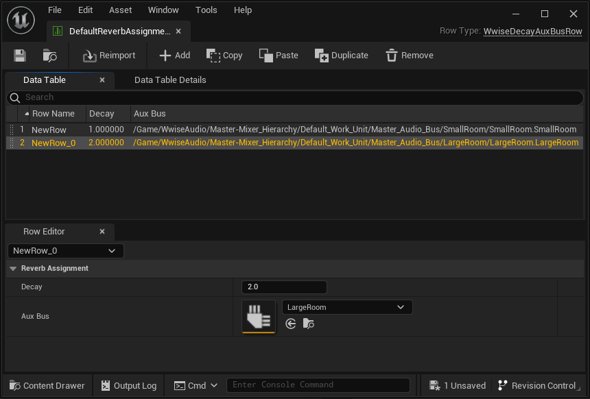

Any Room with a Decay value between 0.0 and 1.0 sends to the SmallRoom Aux Bus and any Room with a Decay value between 1.0 and 2.0 sends to the LargeRoom Aux Bus. Decay values above 2.0 sends to the Default Reverb Aux Bus.

这时返回关卡，可看到为 Interior\_SmallRoom 和 Interior\_LargeRoom 指派了相应的 **Aux Bus** 值。

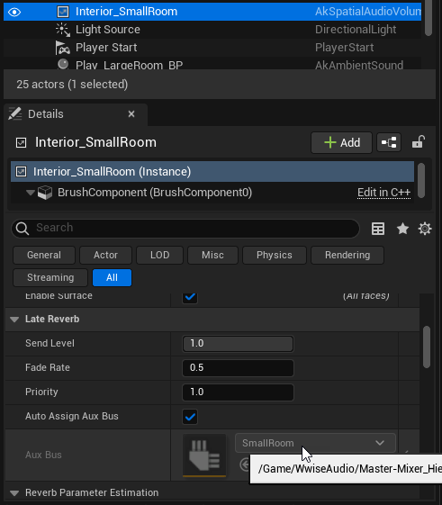

# 全局混响 RTPC

除自动指派 Aux Bus 外，还可在 Wwise 中通过全局混响 RTPC 来自动设置混响效果器的某些参数。我们可以采用这种方式设置三项参数：Decay、Predelay 和 HFDamping。您可以在 Integration Settings 中设置由哪些 RTPC 控制这些参数。

The HFDamping, or high frequency damping, value is an estimation of how much high frequencies are dampened compared to low frequencies. See [EstimateHFDamping](https://www.audiokinetic.com/library/edge/?source=SDK&id=namespace_a_k_1_1_spatial_audio_1_1_reverb_estimation_a2be1de76cd8b9ddf95217f06b02ebad6.html#a2be1de76cd8b9ddf95217f06b02ebad6) for more information.

The PreDelay value is an estimation of the time in milliseconds for the first reflection to reach the listener, assuming both listener and emitter are in the center of the environment. See [EstimateTimeToFirstReflection](https://www.audiokinetic.com/library/edge/?source=SDK&id=namespace_a_k_1_1_spatial_audio_1_1_reverb_estimation_a58a735c2257525485f8be06920e19b82.html#a58a735c2257525485f8be06920e19b82).

## 设置 RTPC

为了使用全局混响 RTPC，我们需要在 Wwise 工程中添加三个 RTPC。

1. 打开 Wwise 工程。
2. Click **Layouts > Designer**.
3. 在 Project Explorer 中，单击 Game Syncs 选项卡。
4. Add three new Game Parameters called Decay, PreDelay and HFDamping.
5. Set the Min, Max, and Default values of the three new Game Parameters as follows:
   - **Decay**:
     - Min: 0
     - Max: 10
     - Default: 0
   - **PreDelay**:
     - Min: 0
     - Max: 1000
     - Default: 0
   - **HFDamping**:
     - Min: -1
     - Max: 1
     - Default: 0
6. In the Project Explorer, open the Audio tab.
7. Under the Busses hierarchy, double-click SmallRoom. The SmallRoom Aux Bus Object Tab opens.
8. On the Effects tab, at the right of the RoomVerb Effect row, click **Edit**.
9. In the Effect Editor, open the RTPC tab.
10. Add Reverb entries for **Decay Time**, **Pre Delay** and **HF Damping**.
11. In the X Axis column, add Game Parameters for each entry as follows:
    - **Decay Time**: **Decay**
    - **Pre delay**: **PreDelay**
    - **HF Damping**: **HFDamping**
12. 选中 Decay 映射，并在曲线上添加控制点。
13. 将控制点的 X 和 Y 值全部设为 0.2。

    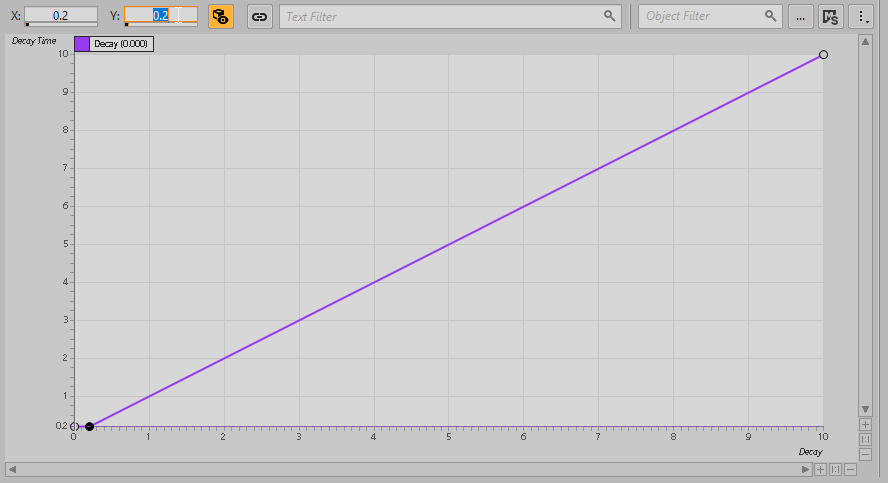
14. 选中 HFDamping 映射，并在曲线上添加控制点。
15. 将 X 值设为 0.0，并将 Y 值设为 1.0。

    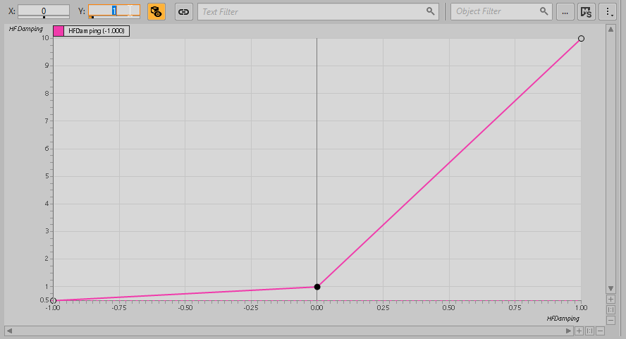
16. 选中列表中的所有映射。

    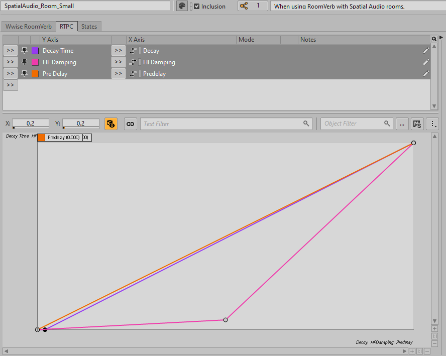
17. 右键单击其中一个映射并选择 **Copy**。
18. 在 Property Editor 中打开 "LargeRoom" Aux Bus。
19. On the Effects tab, at the right of the RoomVerb Effect row, click **Edit**.
20. In the Effect Editor, open the RTPC tab.
21. 右键单击空白 RTPC 列表并选择 **Paste**。Three RTPCs now control reverb parameters in our Wwise project. In the Unreal project, these RTPCs function as the Global Reverb RTPCs.
22. In Unreal, open the Wwise Integration Settings.
23. Under Reverb Assignment, expand the RTPCs subsection.
24. Assign each new RTPC to the corresponding Global Reverb RTPC

    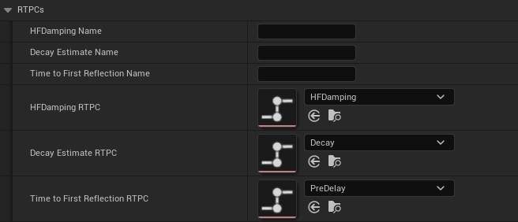

    The Three New RTPCs Assigned to the Global Reverb RTPCs

接下来可远程连接到 Wwise，并进入 Play In Editor 模式。If you observe the RTPC curves in Wwise while triggering the sounds in the small room and the large room, you can see how the reverb parameters change.

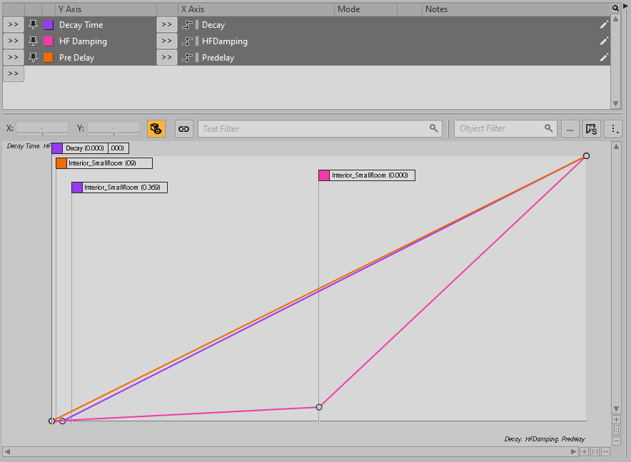

## 将一条混响 Aux Bus 用于不同的 Room 类型

With Global Reverb RTPCs, you can use one reverb effect for an entire level and drive the parameters dynamically for the different rooms in the level.

1. 在 Wwise 工程中，创建新的 Aux Bus 并命名为 DynamicReverb。
2. Add a RoomVerb Effect to this Aux Bus, using the Default Effect preset.

   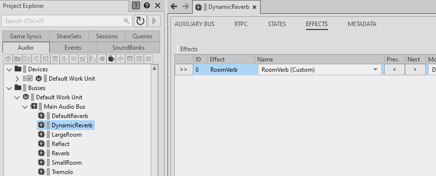

   创建新的 'DynamicReverb' Aux Bus 并为其添加 'Wwise RoomVerb' Effect
3. 将 RTPC 映射从 "SmallRoom" Aux Bus 的混响效果器复制并粘贴到 "DynamicReverb" Aux Bus 的混响效果器。
4. In the Unreal project, clear all entries in the Reverb Assignment Table (described in [自动指派 Aux Bus](sa_reverbestimation.html#sa_reverbestimation_1)).
5. 将 **Default Reverb Aux Bus** 设为刚才创建的 "DynamicReverb" Aux Bus。

Now, if you remote connect and Play In Editor, both the Interior\_SmallRoom and Interior\_LargeRoom use the DynamicReverb Aux Bus, but the parameters are automatically adjusted for each room through the Global Reverb RTPCs.

## 结合自定义 Blueprint 类来使用混响估算

The following procedure demonstrates the single Aux Bus workflow through the use of a custom Blueprint Class that represents a single room. For demonstration purposes, the room is a simple cube with walls that the player can walk through. In this exercise, you will create a double-sided material (so that you can see the interior of the room) and then create the Blueprint Class.

1. 在 Content Browser 中，转到 WwiseAssets/SpatialAudioDemo 文件夹。
2. 右键单击 **SpatialAudioDemoMeshMaterial** 并选择 **Duplicate**。

   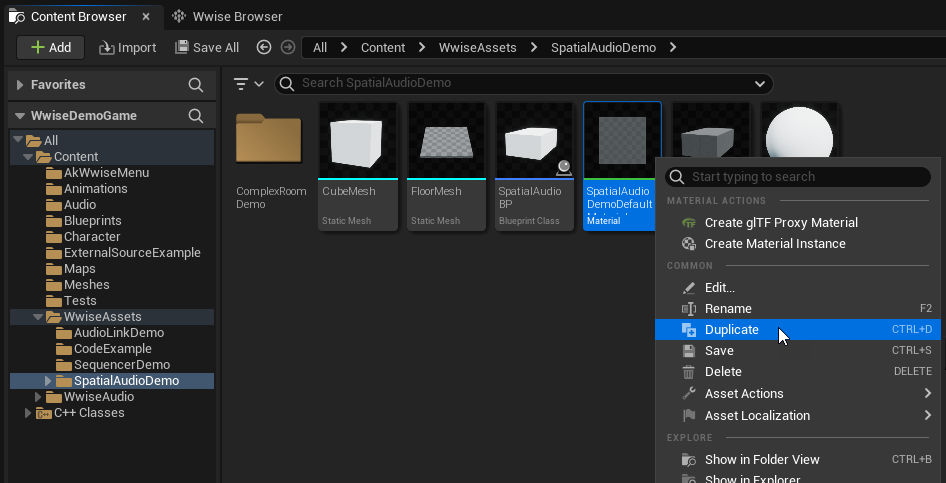
3. Name the new Material Instance "SpatialAudioDoubleSidedMaterial".
4. 打开新的 Material Instance。
5. In the Details panel under Material, select **Two Sided**.
6. 保存 Material Instance。
7. 在 Content Browser 中，转到 Blueprints 文件夹。
8. 在文件夹中右键单击并选择 **Blueprint Class**。

   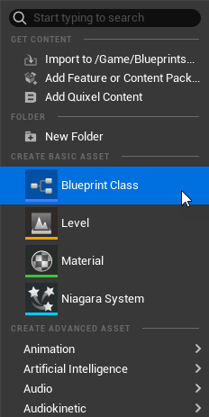
9. 选择将 **Actor** 作为 Parent Class。
10. Name the new Blueprint "BPRoom".
11. Open the new BPRoom Blueprint Class.
12. On the Components panel, click **Add** and select the Cube component.
13. Select the new Cube component and in the Details panel, under **Materials**, set **Element 0** to **SpatialAudioDoubleSidedMaterial**.

    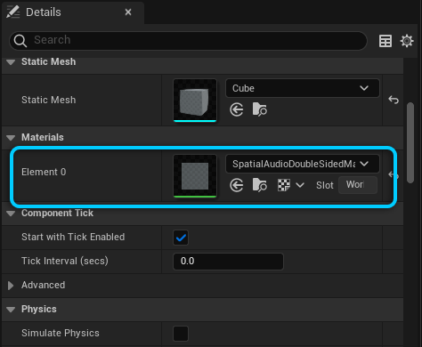
14. In the Components panel, select the Cube Component and add a Box Collision Component under it.
15. Select the Box Collision Component and add the following Components under it:
    - Ak Room
    - Ak Late Reverb
    - Ak Geometry Ensure that the Component hierarchy in your Blueprint Class looks like this:

      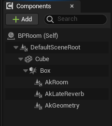
16. 选中 **AkGeometry** 组件。
17. In the Details panel, under Geometry, ensure that the **Mesh Type** is set to Simple Collision.
18. In the Surface Overrides section, set the **AkAcousticTexture** to Concrete.

    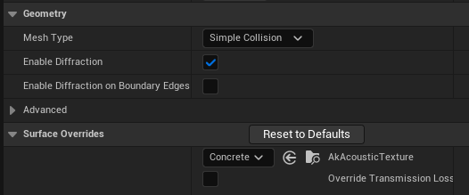
19. In the Components panel, select the **Cube** Component.
20. Add a Point Light Component, which illuminates the room when the player walks inside it.

    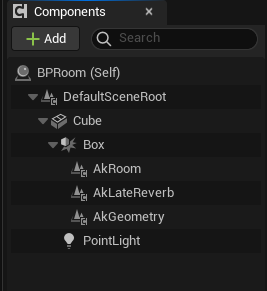
21. 选中 **Cube** 组件。
22. In the Details panel under Collision, set the **Collision Presets** to NoCollision.
23. 选中 **Box** 组件。
24. In the Details panel under Collision, set the **Collision Presets** to NoCollision. The player can now walk through the walls of the room.
25. 编译并保存 Blueprint。

Before you can test the new room Blueprint, add a sound to play when you change between the rooms.

1. 从 Content Browser 中的 Blueprints 文件夹打开 **MyCharacter** Blueprint。
2. 在 Components 面板中，选中 Capsule 组件。
3. Add an **Ak** Component and name it "SpatialSound".

   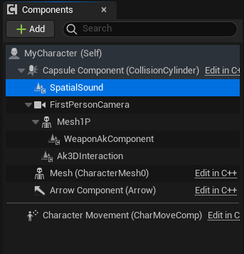

   将 Ak 组件添加到 'MyCharacter' Blueprint
4. 选中 SpatialSound 组件。
5. In the Details panel, set the **Ak Audio Event** to Play\_SpatialSound.
6. 打开 "MyCharacter" Blueprint 所对应的 Event Graph。
7. Locate the **Event BeginPlay** node in the lower right of the Event Graph.
8. Drag from the last **Set Switch** node and select **Post Associated Ak Event (SpatialSound)**.

   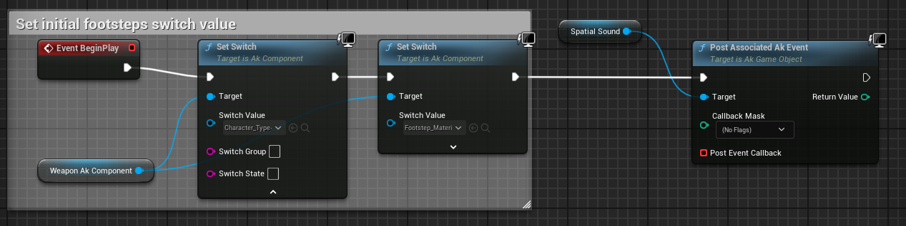

You can now place some rooms in your level.

1. Drag several instances of the BPRoom Blueprint into the level.
2. 将这些 Room 设为不同的大小。
3. Change the Acoustic Texture on the **AkGeometry** Component in each of the rooms:
   1. 选择关卡中的 Room。
   2. 在 Details 面板中，选中 **AkGeometry** 组件。
   3. Change the **AkAcousticTexture** to a different value such as Brick, Carpet, or something else. Do this for all BPRoom instances in the level.

      

接下来可远程连接到 Wwise，并进入 Play In Editor 模式。The spatial sound is triggered immediately. As you walk into the different rooms, the appropriate reverb parameters are applied to the sound.

## HFDamping 计算和 Acoustic Texture

When estimating the HFDamping value, the `AkLateReverbComponent` uses the `AkGeometryComponent` to identify its Acoustic Textures. In the previous section, an `AkLateReverbComponent` and an `AkGeometryComponent` were attached to the same `UPrimitiveComponent` parent (the Box Component). With this configuration, when the `AkLateReverbComponent` has a sibling `AkGeometryComponent`, it automatically uses that sibling `AkGeometryComponent` to calculate the HFDamping. However, if the `AkGeometryComponent` has a different parent, you must explicitly associate the `AkGeometryComponent` with the `AkLateReverbComponent` through the AssociateAkTextureSetComponent function. This section demonstrates how to do so.

1. 打开 "BPRoom" Blueprint。
2. In the Components panel, drag the **AkGeometry** Component on top of the **Cube** Component. The **AkGeometry** Component is now attached to the **Cube** Component instead of the **Box** Component.
3. 选中 **AkGeometry** 组件。
4. In the Details panel, under Geometry, set the **Mesh Type** to Static Mesh.
5. In the Surface Overrides section, set the **AkAcousticTexture** to Concrete.

   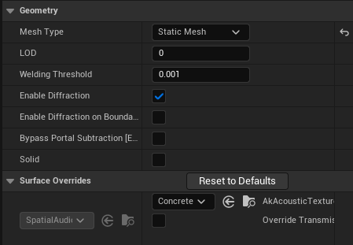
6. 打开 Blueprint 所对应的 Event Graph。
7. Drag a node from the execution pin of the **Even BeginPlay** node and select **Associate Ak Texture Set Component (AkLateReverb)**.
8. Drag the **AkGeometry** Component from the Components panel and release it on top of the Texture Set Component pin.

   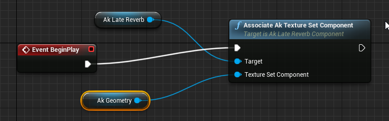

You can now remote connect to Wwise and Play In Editor to test whether the HFDamping value is updated correctly. With this configuration, you can have a Static Mesh with multiple materials, and an attached `AkGeometryComponent` that maps those materials to Acoustic Textures. You can then associate this `AkGeometryComponent` with an `AkLateReverbComponent` to make the textures drive the HFDamping value.