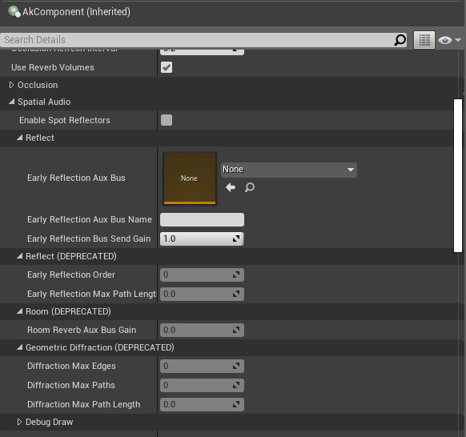

# 重要迁移说明 2019.2.0.7216.1583

|  |
| --- |
| Wwise Unreal Integration Documentation |

重要迁移说明 2019.2.0.7216.1583

# 在 Wwise Unreal 集成中迁移 Spatial Audio 功能

因为可直接在 Wwise 设计工具中配置 Spatial Audio 设置，所以弃用了 AkComponent 中的一些 Spatial Audio 参数。

- \*\*Early Reflection Order\*\*：此参数现在为全局设置，可在初始化设置中找到。
- \*\*Early Reflection Max Path Length\*\*：此参数已被弃用。现在需要针对此 GameObject 发出的声音为 Attenuation Max Distance 执行相同的设置。
- \*\*Room Reverb Aux Bus Gain\*\*：此参数已被弃用。现在需要在设计工具内的 Sound Property Editor 中为 Game-Defined Auxiliary Sends Volume 执行相同的设置。
- \*\*Diffraction Max Edges、Diffraction Max Paths 和 Diffraction Max Path Length\*\*：这些参数已被弃用。现在只需在 Sound Property Editor 的 Positioning 选项卡中直接选中 Enable Diffraction 复选框即可。

a

Blueprint 函数 **UseEarlyReflections** 已被弃用。您可以将其彻底移除，转而在设计工具端设置相应的参数。