#### Unreal Project Default

### Unreal Engine

### Wwise

### 平台

### 开发环境设置

## 文档

## 平台要求

|  |
| --- |
| Wwise Unreal Integration Documentation |

平台要求

# Unreal Engine

Unreal Wwise 插件的每个版本都是针对特定 Unreal Engine 版本专门构建的。因此，请务必使用对应支持的 Unreal Engine 版本（详见 [版本说明 2025.1](releasenotes.html) 章节）。

## Unreal Project Default

Wwise Unreal 集成不支持纯 Blueprint 型 Unreal 工程，因为 Wwise Integration 插件完全用 C++ 编写且必须进行编译。因此，在创建工程的过程中必须选择 **C++** Project Default。若不小心创建了纯 Blueprint 型工程或要使用现有纯 Blueprint 型工程，则可通过向其添加 C++ 类来将其转换为 C++ 工程。

有关 Unreal 工程创建和 Project Default 的详细信息，请参阅[创建新的工程](https://dev.epicgames.com/documentation/en-us/unreal-engine/creating-a-new-project-in-unreal-engine)。

# Wwise

此插件基于 Wwise 2025.1.4 build 9062。允许使用其他版本的 Wwise SDK，但可能需要修改插件代码。

# 平台

此插件在 Windows、Mac、Linux、Xbox One、Xbox Series X、Playstation 4、Playstation 5、Nintendo Switch、Android、iOS 和 tvOS 上均进行过测试。此次发布包含了对 LinuxArm64 的初步支持。倘若使用其他目标平台，则可能需要实施相应修改。

为了便于跨平台开发，请先安装 Windows 和 Mac Wwise SDK，再安装 Unreal Wwise 插件。

# 开发环境设置

参阅 Unreal Engine 文档：

- [下载 Unreal Engine 源代码](https://dev.epicgames.com/documentation/en-us/unreal-engine/downloading-unreal-engine-source-code)
- [设置 Visual Studio](https://dev.epicgames.com/documentation/en-us/unreal-engine/setting-up-visual-studio-development-environment-for-cplusplus-projects-in-unreal-engine)
- [从源代码构建 Unreal Engine](https://dev.epicgames.com/documentation/en-us/unreal-engine/building-unreal-engine-from-source)

## 安装

|  |
| --- |
| Wwise Unreal Integration Documentation |

安装

在继续之前，请先查看 [平台要求](requirements.html) 页面，确保已安装支持的 Unreal Engine 和 Wwise 版本。

此 UE 集成包仅包含与 Wwise 插件相关的文件，并不包含整套 Unreal Engine 源代码和 Wwise SDK。

若要将工程从较早版本迁移到 Wwise 2024.1，请参阅 [将工程升级到Wwise 2024.1](pg_important_migration_notes_2024_1_0.html) 章节。

有关如何结合版本控制系统使用 Wwise 工程的详细说明，请参阅[结合版本控制系统使用 Wwise](https://www.audiokinetic.com/library/edge/?source=Help&id=using_wwise_with_source_control_system)。 如需了解对于大型和小型开发团队建议采用怎样的系统配置（包括版本控制相关建议），请参阅 [Understanding Development Workflows](ue_dev_workflows.html) 章节。

# 安装步骤

用户可选择将 Wwise Unreal 集成安装为 [游戏插件](installation.html#install_game_plugin)或 [引擎插件](installation.html#install_engine_plugin)。

|  |  |
| --- | --- |
|  | **注記：** 如需详细了解引擎插件和游戏插件（有时称为“已安装插件”）之间的差异，请参阅[插件](https://dev.epicgames.com/documentation/en-us/unreal-engine/plugins-in-unreal-engine)。 |

## 将 Wwise Unreal 集成安装为游戏插件

我们可以通过 Audiokinetic Launcher 将 Wwise Unreal 插件安装为游戏插件。参见 Launcher 文档中的[将 Wwise 集成到 Unreal 工程中](https://www.audiokinetic.com/library/wwise_launcher/?source=InstallGuide&id=integrating_wwise_into_an_unreal_project)章节。

用户可使用离线集成文件来集成 Wwise。参见 Launcher 文档中的[使用离线文件安装 Unity/Unreal Integration](https://www.audiokinetic.com/library/wwise_launcher/?source=InstallGuide&id=using_offline_files_to_install_unity_or_unreal_integrations) 章节。

如需了解对 Wwise 工程的更改，请参阅 [对 Wwise 工程的更改](install_changes_wproj.html) 章节。

## 管理 Wwise 插件

Wwise 提供有各种各样的插件，不过要正确安装才能用在 Wwise Unreal 集成中。我们可以通过 Audiokinetic Launcher 来管理 Wwise 插件。有关如何管理 Wwise 插件的详细信息，请参阅 Launcher 文档中的[将插件添加到 Unity/Unreal Integration](https://www.audiokinetic.com/library/wwise_launcher/?source=InstallGuide&id=unity_unreal_integrations_plugins) 章节。

|  |  |
| --- | --- |
|  | **注記：** 若在使用 Wwise Unreal 集成时 Wwise 安装包内缺少插件，则将显示以下错误： `LogAkAudio: Error: Could not find plugin dynamic library` 。 |

## 将 Wwise Unreal 集成安装为引擎插件

|  |  |
| --- | --- |
|  | **注意：**  - Installing the Wwise plug-in for Unreal as an engine plug-in is intended for expert users only. - If you want to install Wwise as an engine plug-in but do not have access to the Unreal source code, ensure that your Unreal installation is up to date with the latest patch of the version you are using. If you use any other version, the Unreal Engine code must be recompiled. |

若要处理多个 Unreal 工程且其都会使用 Wwise，最好将 Wwise Unreal 集成安装为引擎插件。

1. 下载 Wwise Unreal Engine 集成包：
   1. 打开 Audiokinetic Launcher 并选中 Unreal Engine 页面。
   2. 在 **Download** 列表中，选择 **Wwise Integration to use as an engine plugin**。这时会打开 Download Wwise Unreal 集成 Engine Plug-in 页面。  
        

      
   3. 选择以所需 Wwise 版本号为开头的 **Integration version**。
   4. 选择与已安装版本对应的 **Unreal Engine Version**。
   5. 指定所需 **Download Directory**。Launcher 会使用 `C:\Users\<username>\Documents\Wwise Unreal Engine Integration Engine Plug-in` 自动填写此字段。若文件夹已存在，将自动覆盖其内容。
   6. 单击 **Download**。这时 Unreal 页面会在工程列表上方显示 OFFLINE FILE DOWNLOADS 以及进度条、Unreal Engine Integration 插件版本和目录路径。请等待完成下载再继续。
2. 将 Wwise 集成包和 SDK 文件复制到 Unreal Engine `Plugins` 文件夹：
   1. 在 `Wwise Unreal Engine integration` 文件夹内，将可看到 `Wwise`、`WwiseNiagara` 和 `WwiseSoundEngine` 文件夹。将这些文件夹复制到现有 `Plugins` 文件夹 (`…\<UE installation directory>\Engine\Plugins`)。
   2. 在 `…\<UE installation directory>\Engine\Plugins\WwiseSoundEngine` 文件夹内，创建 `ThirdParty` 文件夹。
   3. 在打包过程中，Unreal Editor 可能需要重新构建 Wwise UE integration。为此，必须将多个文件夹从 Wwise SDK 安装文件夹复制到 `WwiseSoundEngine\ThirdParty` 插件文件夹。打开以下文件夹：
      - 源： `C:\Program Files (x86)\Audiokinetic\Wwise 2025.1.4.9062\SDK\`
      - 目标： `...\Plugins\WwiseSoundEngine\ThirdParty\`
   4. 将以下文件夹从源文件夹复制到目标文件夹：
      - `include`
      - `x64_*`
      - `Mac`
   5. 若您的项目将被部署在其他平台上，而这些平台在`SDK`源文件夹中有一个对应的文件夹，则须同时将这些文件夹（包含平台的库）复制到 `ThirdParty` 文件夹。
3. 启用插件并链接 Unreal 和 Wwise 工程：
   1. 在 Unreal Editor 中，打开工程。
   2. 在工具栏中，依次单击 **Edit** > **Plugins**。
   3. In the dialog box that opens, navigate to the **Built-in** > **Audio** page.
   4. 在 **Wwise Unreal Engine integration** 下选中复选框来启用插件。**Wwise Low-Level SoundEngine** 也是必需的，不过不用手动选择，因为它是集成插件的先决条件。
   5. 在必要时选择附加的 Wwise 插件（如 **Wwise Niagara Integration**）。
   6. 在工具栏中，依次单击 **Edit** > **Project Settings**。
   7. 依次转到 **Wwise** > **Integration Settings** 页面。
   8. 在 **Installation** 分区中指定 **Wwise Project Path**，然后关闭对话框。

如需了解对 Wwise 工程的更改，请参阅 [对 Wwise 工程的更改](install_changes_wproj.html) 章节。#### 将 Wwise Unreal 集成安装为游戏插件

#### 管理 Wwise 插件

#### 将 Wwise Unreal 集成安装为引擎插件

##### 移除的 Blueprint 节点

##### Removed Blueprint Functions

##### Removed or Modified Sequencer Section Properties

#### 对 Unreal 打包功能的改进

#### 弃用

###### Using Naming Conventions for Asset Creation

##### Setup for Game Developers

##### Setup for Audio Integrators

##### Setup for Technical Audio Designers

##### Setup for Third-Party Interactive Audio Designers

##### Setup for Servers

#### Development Workflows for Large Teams

#### Development Workflows for Small Teams

### 安装步骤

### 将工程升级到Wwise 2024.1

|  |
| --- |
| Wwise Unreal Integration Documentation |

将工程升级到Wwise 2024.1

# 对 Unreal 打包功能的改进

Wwise 2024.1 的第一个 Beta 版本引入了用来将 Wwise 素材打包为 Bulk Data 的选项。在此之后，我们对这一新功能进行了多次优化和改进。若从早期 Beta 版本开始就一直使用新的打包选项，请转到 [Packaging Wwise Assets as Bulk Data](using_features_package_as_bulk_data.html) 查看更新后的文档。

# 弃用

已在 2023.1.0 Unreal Integration 中弃用并在 2024.1.0 Unreal Integration 中移除以下函数、Blueprint 节点和属性。

## 移除的 Blueprint 节点

- **SetSwitch**：移除了 **SwitchGroup** 和 **SwitchState** 参数。
- **SetState**：移除了 **SwitchGroup** 和 **SwitchState** 参数。
- **SetRTPCValue**：移除了 **RTPC** 参数。
- **GetRTPCValue**：移除了 **RTPC** 参数。
- **ResetRTPCValue**：移除了 **RTPC** 参数。
- **PostTrigger**：移除了 **Trigger** 参数。
- **SpawnAkComponentAtLocation**：移除了 **EventName** 参数。
- **GetAkComponent**：此节点已被弃用并替换为 GetOrCreateAkComponent。后者不接受 AkComponent 的位置。因为 AkComponent 源自于 SceneComponent，所以仍可使用 GetChildrenComponents 节点通过位置查找所绑定的 AkComponent。

## Removed Blueprint Functions

The following Blueprint functions have been removed:

- **Call WAAPI**
- **Register WAAPI Connection Lost Callback**
- **Register WAAPI Project Loaded Callback**
- **Subscribe To WAAPI**
- **Unsubscribe**

## Removed or Modified Sequencer Section Properties

- **EventName**：从 AkAudioEvent Section 中移除了 **EventName** 文本参数。改为在 **Event** 参数中使用 [UAkAudioEvent](pg_features_objects_assets.html#features_objects_classes_UAkAudioEvent) 素材。
- **RTPCName**：从 AkAudioRTPC Section 中移除了 **RTPCName** 文本参数。改为在 **GameParameter** 参数中使用 [UAkRtpc](pg_features_objects_assets.html#features_objects_classes_UAkRtpc) 参数素材。
- **RTPC**：在 AkAudioRTPC Section 中将 **RTPC** 参数重命名为了 **Game Parameter**。

### Understanding Development Workflows

|  |
| --- |
| Wwise Unreal Integration Documentation |

Understanding Development Workflows

Game development projects vary greatly in complexity, size, and team composition. Depending on the size of the development studio and the nature of the project, sound design and integration might be a specialized task with its own team of internal sound designers, it might be outsourced to a third party that specializes in sound and music, or it might be divided among a small development team responsible for all aspects of game development.

In different development scenarios, the development workflow changes accordingly. Some roles might use Wwise exclusively and no other development tools, others might use Unreal exclusively, while others might use both tools. The development workflow affects some aspects of the Wwise Unreal 集成 because certain integration features require an active connection between Unreal and Wwise through WAAPI.

# Development Workflows for Large Teams

Large development teams usually divide work among specialists such as sound designers, game developers, and audio integrators. Depending on the structure of the team, some contributors might work with Unreal and Wwise, while others might only use one of the two. The following sections contain suggested configurations for different development roles.

## Setup for Game Developers

Many game development roles do not need to work with Wwise: 2D and 3D artists, gameplay developers, UI/UX specialists, and so on. For these users, Wwise Authoring is not required but we recommend that the appropriate team add the `GeneratedSoundBanks` folder to your source control system. Specifically, we strongly recommend that you add the following file extensions to source control:

- `*.json`
- `*.bnk`
- `*.wem` In order for developers to run the Integration code and have sound, they only need to do two things:
- Install the Wwise plug-in.
- Be able to access the `GeneratedSoundBanks` folder for the Editor platform (Windows or Mac). You can change the `GeneratedSoundBanks` path in Unreal in the Project Settings under the Wwise Integration Settings, and in Wwise Authoring in the [SoundBank Settings](https://www.audiokinetic.com/library/edge/?source=Help&id=soundbank_settings_soundbanks_tab).

## Setup for Audio Integrators

The recommended setup for audio integrators is almost the same as the one for game developers, although in this case a Wwise Authoring installation can be beneficial. Audio integrators can use the WAAPI connection between Wwise Authoring and Unreal to streamline asset integration, although this is not a requirement.

The principal advantage of installing both Wwise and Unreal is that this setup supports dynamic asset creation and modification of the Wwise project through the integration: you can create or fix Events and names in Wwise Authoring or in Unreal through the Wwise Browser.

### Using Naming Conventions for Asset Creation

Audio integrators must sometimes ensure that assets follow naming conventions. The setup described in the previous section facilitates predictable asset naming in two ways:

- You can first create assets in Wwise according to the desired naming convention, which ensures Events with stable GUIDs and correct Event IDs. In Unreal, you can then use the Wwise Browser to drag the newly created Events into folders in the Content Browser.
- Alternatively, you can create assets together with the [synchronization option](features_editor_auto_sync.html). This approach requires both Wwise Authoring and Unreal to be open at the same time.

## Setup for Technical Audio Designers

Technical audio designers typically work in both Wwise and Unreal. Therefore, in an optimal setup, both Wwise Authoring and Unreal are open at the same time and a WAAPI connection is maintained between the two. If you enable the WAAPI asset synchronization option, any Wwise Events you create in the Wwise project are automatically created in the Unreal project as well. These assets are created in a default folder hierarchy, but you can move them if required.

If SoundBanks are generated by a server or if designers need to experiment, you can temporarily override the `GeneratedSoundBanks` folder location through a user setting. You can do this in Unreal (through the project's Wwise User Preferences) and in Wwise Authoring (in the SoundBank Generation user preferences). Ensure that both point to the same folder location.

## Setup for Third-Party Interactive Audio Designers

Third-party audio designers often work exclusively in Wwise, so the only things they need are Wwise Authoring and the Wwise project. If the designers prefer not to use Wwise Soundcaster, then obviously they need Unreal as well.

## Setup for Servers

For large projects, it can be useful to have a dedicated server for SoundBanks. The SoundBank generation commandlet (see [Generating SoundBanks with the GenerateSoundBanks Commandlet](using_features_generatecommandlet.html)) can run on this server on a schedule, for example every night, and push the generated SoundBanks to a location under source control. Other developers can then work with latest SoundBanks in Unreal without the need to generate the banks themselves. In large projects, SoundBank generation can be time-consuming and there might be multiple contributors who work on different parts of the game audio (music, speech, sound effects, and so on) so automation can make the process more efficient than manual SoundBank generation.

However, some users might need to generate SoundBanks themselves to experiment or test during the course of development. In this case, you can maintain the server-based setup but use user overrides to generate SoundBanks locally. Refer to [Overriding Generated SoundBanks Directories for Local Users](using_soundbanks_override.html) for more information.

# Development Workflows for Small Teams

Small teams develop their products holistically, without a variety of specialists who work on different aspects of the game (such as audio). In this scenario, we recommend that all users start with the same generic configuration: use the same pre-installed Unreal Engine and the same version of Wwise Authoring. It might be necessary for the developers to generate SoundBanks every time they retrieve the project from source control, although this process is much faster for small projects than for large ones.

### 对 Wwise 工程的更改

|  |
| --- |
| Wwise Unreal Integration Documentation |

对 Wwise 工程的更改

在集成 Wwise 后首次打开 Unreal 工程时，若之前做了不同的设定，则 Wwise 工程中的某些设置会发生变化。

在打开 SoundBank Settings (**Project > Project Settings > SoundBanks**) 时，可以看到启用了以下设置：

- Copy Loose/Streamed Media
- Remove Unused Generated Files
- Generate Per Bank Metadata File（有可能同时启用 Generate All Banks Metadata File）
- Generate JSON Metadata
- Include in Metadata：
  - Object GUID
  - Object Path
  - Max Attenuation（强烈推荐）
  - Estimated Duration（强烈推荐）

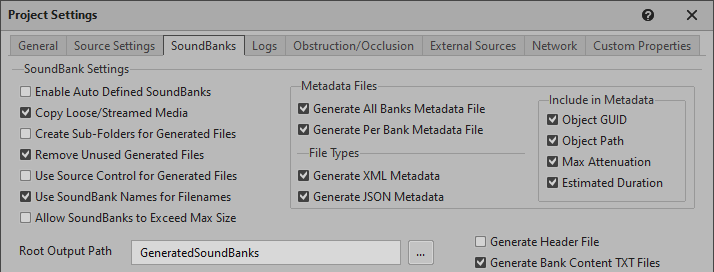

在打开 **Project > Project Settings > Logs** 时，可以看到禁用了以下设置：

- Media is duplicated in several SoundBanks
- Media not found in any SoundBank

#### Integrating custom Wwise plug-ins

### 预处理器定义

### 从源代码构建 Wwise Unreal 集成

### Unreal 和 Wwise SoundEngine 配置

### Windows 上的 Unreal 和 Wwise SoundEngine 配置

## 构建插件

|  |
| --- |
| Wwise Unreal Integration Documentation |

构建插件

`WwiseSoundEngine.Build.cs` 文件（位于 `…\Plugins\Wwise\Source\WwiseSoundEngine\WwiseSoundEngine.Build.cs`）负责针对每个支持的平台为插件设置构建参数。此文件专门：

- 指定要链接哪些静态库；
- 指定要在运行时加载哪些动态库；
- 定义用于控制各种集成功能的预处理器宏。

# 预处理器定义

`WwiseSoundEngine.Build.cs` 中加入了以下预处理器定义：

- `WWISE_CONFIGURATION_DIR`   
  此设置用于指定 Wwise 构建配置 – AkSoundEngine 库所在的相应子文件夹。
- `WWISE_DSP_DIR`   
  此设置用于指定 Wwise 构建配置 – 插件库（静态库和动态库）所在的相应子文件夹。
- `AK_SUPPORT_OPUS`   
  此设置用于声明 Wwise Opus 库可供使用。
- `AK_SUPPORT_WAAPI`   
  此设置用于声明 Wwise Authoring API 库可供使用。
- `AK_UNREAL_MAX_CONCURRENT_IO`   
  此设置用于指定允许发生的最大并发读取和写入数。

# 从源代码构建 Wwise Unreal 集成

对于以下平台，将把 `ThirdParty` 内对应 `bin` 文件夹中的所有 Wwise 插件打包到最终可执行文件中：

- Android
- iOS
- tvOS
- Switch

对于 Android，有个 UPL 文件位于 `…\Plugins\Wwise\Source\WwiseSoundEngine_{WWISE_MAJOR}_{WWISE_MINOR}\Wwise_APL.xml`，用来声明将把所有共享库打包到最终可执行文件中以构建库的基础架构。

对于 iOS 和 tvOS，会在 `…\Plugins\Wwise\Source\WwiseSoundEngine\Public\Generated\AkiOSPlugins.h` 头文件内处理插件注册。此文件在 SoundBank 生成期间生成并包含在 `…\Plugins\Wwise\Source\WwiseSoundEngine_{WWISE_MAJOR}_{WWISE_MINOR}\Private\Wwise\API_{WWISE_MAJOR}_{WWISE_MINOR}\WwiseSoundEngineAPI_{WWISE_MAJOR}_{WWISE_MINOR}.cpp` 内。

对于 Switch，会在 `…\Plugins\Wwise\Source\WwiseSoundEngine\Public\Generated\AkSwitchPlugins.h` 头文件内处理插件注册。此文件在 SoundBank 生成期间生成并包含在 `…\Plugins\Wwise\Source\WwiseSoundEngine_{WWISE_MAJOR}_{WWISE_MINOR}\Private\Wwise\API_{WWISE_MAJOR}_{WWISE_MINOR}\WwiseSoundEngineAPI_{WWISE_MAJOR}_{WWISE_MINOR}.cpp` 内。

For Switch 2, plug-in registration is handled within the `…\Plugins\Wwise\Source\WwiseSoundEngine\Public\Generated\AkSwitch2Plugins.h` header. 此文件在 SoundBank 生成期间生成并包含在 `…\Plugins\Wwise\Source\WwiseSoundEngine_{WWISE_MAJOR}_{WWISE_MINOR}\Private\Wwise\API_{WWISE_MAJOR}_{WWISE_MINOR}\WwiseSoundEngineAPI_{WWISE_MAJOR}_{WWISE_MINOR}.cpp` 内。

The plug-in registration header is not generated during a BuildCookRun operation. Before you run a BuildCookRun operation, do one of the following:

- If the plug-in registration header already exists, commit it to source control for build machine usage.
- Add a prebuild step to the `[ProjectName].Target.cs` file that opens and closes the editor. For example: `"[EngineInstallDir]\Engine\Binaries\Win64\UnrealEditor-Cmd.exe" "[ProjectPath]\[ProjectName].uproject" -ExecCmds="Automation Quit" -unattended -NullRHI`

|  |  |
| --- | --- |
|  | **注記：** To reduce the size of the shipped executable, users are encouraged to remove unused shared libraries from the `bin` folder within `…\Plugins\WwiseSoundEngine\ThirdParty`. |

对于以下平台，将把共享动态库添加到所生成 `…\Binaries\<UEPlatform>\<TargetName>.target` 文件中的运行时依赖项列表。

- Linux
- Mac
- PS4
- PS5
- Windows（用于插件）
- XboxOne
- XboxSeriesX

在正确执行 [安装](installation.html) (安装) 章节中列出的安装步骤之后，可按照与 Unreal Engine 相同的方式来重构 Wwise Unreal 集成。 有关此操作的详细说明，请参阅[设置制作管线](https://dev.epicgames.com/documentation/en-us/unreal-engine/setting-up-your-production-pipeline-in-unreal-engine)。

有关插件及源代码的详细信息，请参阅[插件中的代码](https://dev.epicgames.com/documentation/en-us/unreal-engine/plugins-in-unreal-engine#codeinplugins)。

## Integrating custom Wwise plug-ins

If you have developed your own custom Wwise plug-in, the standard procedure applies for the platforms that do not support shared libraries (iOS, tvOS, and Switch). For all other platforms, compile your plug-in as a dynamic library and put it in the following directory:

`..\Plugins\WwiseSoundEngine\ThirdParty\[PLATFORM]\[CONFIGURATION]\bin`

# Unreal 和 Wwise SoundEngine 配置

在 Unreal 中，设有以下配置状态：Debug、DebugGame、Development、Test 和 Shipping（详见[编译配置参考](https://dev.epicgames.com/documentation/en-us/unreal-engine/build-configurations-reference-for-unreal-engine)）。

在 Wwise SoundEngine 中，提供以下构建配置：Debug、Profile 和 Release（详见[构建配置参考](https://www.audiokinetic.com/library/edge/?source=SDK&id=goingfurther_builds.html)）。

对于所有平台，Wwise 和 Unreal 构建配置存在以下关联：

- Unreal Debug 和 DebugGame 配置状态与 Wwise SoundEngine Debug 配置对应。
- Unreal Development 配置状态与 Wwise SoundEngine Profile 配置对应。
- Unreal Test 和 Shipping 配置状态与 Wwise SoundEngine Release 配置对应。

# Windows 上的 Unreal 和 Wwise SoundEngine 配置

在 Windows 上，SDK 为 Debug、Profile 和 Release 版本的声音引擎提供动态和静态版本的 C 运行时库。静态库存放在名称中包含 `(StaticCRT)` 的文件夹中。

Wwise Unreal 集成 使用 StaticCRT AkSoundEngine 库（若不可用，则改用动态版本的 AkSoundEngine 库）

不过，对于 Wwise 动态库，在完全采用 `bDebugBuildsActuallyUseDebugCRT` 设置构建 Unreal 工程时只能使用 Debug 构建配置。有关相应构建设置的详细信息，请参阅 [编译配置参考](https://dev.epicgames.com/documentation/en-us/unreal-engine/build-configurations-reference-for-unreal-engine) 。

WAAPI 的 AkAutobahn 库使用了与 Unreal 不兼容的 C++ 设置。所以只要使用该库，就会改用 Profile 版本的动态 DLL。

## 使用集成包

#### 创建集成的工程

#### 在 Wwise 中创建环境声

#### 配置 Unreal 的 Project Settings

#### 从 Wwise Browser 添加素材

#### 通过 Level Blueprint 播放

#### 播放声音

### 快速入门

|  |
| --- |
| Wwise Unreal Integration Documentation |

快速入门

您可以参照本指南中的说明来将 Wwise 快速集成到 Unreal 工程中。其中介绍了构建一个正常运行的工程都要执行哪些基本步骤。在完成后，可查阅 Wwise Unreal 集成文档的其余部分，来详细了解集成包的用法及特定方面的信息。

# 创建集成的工程

首先，创建 Wwise 和 Unreal 工程并通过 Launcher 予以集成：

1. 创建 Wwise 工程（如 Wwise Help 中的[创建新的工程](https://www.audiokinetic.com/library/edge/?source=Help&id=managing_projects#creating_new_project)章节所述）。
2. 创建 Unreal **C++** 工程（如 Unreal Engine 5 文档中的[创建新的工程](https://dev.epicgames.com/documentation/unreal-engine/creating-a-new-project-in-unreal-engine)章节所述）。
3. 通过 Audiokinetic Launcher 将 Wwise 集成到 Unreal 工程中（参见 Audiokinetic Launcher 文档中的[将 Wwise 集成到 Unreal 工程中](https://www.audiokinetic.com/library/wwise_launcher/?source=InstallGuide&id=integrating_wwise_into_an_unreal_project)章节）。

参见
:   - [对 Wwise 工程的更改](install_changes_wproj.html)

# 在 Wwise 中创建环境声

要播放关卡中的声音 Event，最简单的方法是使用 "AkAmbient" Actor。藉此，可按照规则（通常是关卡的实例化）播放声音。在 Unreal 中设置环境声之前，集成的 Wwise 工程必须包含相应的声音以及用来播放声音的 Event。为此，请确保有支持的音频文件类型（参见[支持哪些媒体文件？](https://www.audiokinetic.com/library/edge/?source=Help&id=what_media_files_are_supported)）。

对此，建议使用 Auto-defined SoundBank 而非 User-defined SoundBank。有关详细信息，请参阅 [Understanding Auto-Defined and User-Defined SoundBanks](unreal_using_soundbanks_concepts.html) 章节。

**在 Wwise 中准备环境声：**

1. 将音频文件导入为 SFX 对象（如[导入用于 SFX 的媒体文件](https://www.audiokinetic.com/library/edge/?source=Help&id=importing_media_files_for_sfx)中所述）。
2. 创建 Event 并为其添加 Play 动作（如[创建 Event](https://www.audiokinetic.com/library/edge/?source=Help&id=creating_events) 中所述）。
3. 启用 Auto-defined SoundBank（如 [Auto-defined SoundBank](https://www.audiokinetic.com/library/edge/?source=Help&id=auto_defining_soundbank) 中所述）。
4. 生成 SoundBank（如[为工程生成 SoundBank](https://www.audiokinetic.com/en/library/edge/?source=Help&id=generating_soundbanks_for_project) 中所述）。

# 配置 Unreal 的 Project Settings

您必须设置 Unreal 中 Project Settings 下的多项设置才能在 Unreal 中访问 Wwise SoundBank 并使用 Wwise Browser 查看 Wwise 对象。另外，还要选择 Unreal 音频通路选项以便通过 Wwise 声音引擎输出音频。

**配置所需的 Unreal 设置：**

1. 在 Unreal Editor 中，依次单击 **File > Project Settings**。
2. 在 Wwise - Integration Settings 分区，将 **Root Output Path** 设为 Wwise 工程中指定的 Root Output Path（通常为工程的 `GeneratedSoundBanks` 文件夹）。有关 Wwise 设置的详细信息，请参阅 [SoundBanks 选项卡](https://www.audiokinetic.com/library/edge/?source=Help&id=project_settings_soundbanks_tab)。

   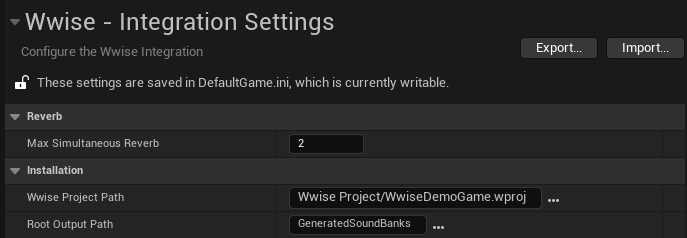
3. 将 Unreal Audio Routing 选项设为 **Route through AudioLink** 或 **Enable Wwise SoundEngine only**。有关音频通路选项的详细信息，请参阅 [Combining Unreal and Wwise Audio with AudioLink](using_audio_link.html) 章节。
4. 关闭 Project Settings 窗口，然后依次单击 **Window > Wwise Browser**。
5. Wwise Browser 中会显示来自 Wwise 工程的对象：

   

   Wwise Browser 右上角设有 **Generate SoundBanks** 按钮。此按钮等同于 Wwise 设计工具中的 **Generate All**。您可以单击该按钮来通过 Unreal Editor 生成 Wwise SoundBank。有关 Wwise Browser 的详细信息，请参阅 [Managing Assets with the Wwise Browser](features_editor_wwise_browser.html) 章节。

# 从 Wwise Browser 添加素材

在生成 SoundBank 后，会在 Wwise Browser 中的 Events 文件夹下显示在 Wwise 中创建的 Event。

**将 Wwise Event 添加到 Unreal 关卡：**

- 执行以下操作之一：
  - 将 Event 从 Wwise Browser 拖到 Content Browser 中，然后再拖到关卡中。
  - 将 Event 从 Wwise Browser 拖到关卡中。若直接将 Event 添加到关卡中，则会在 Default Asset Creation Path 下创建对应的 Unreal 素材（参见 [Integration Settings](using_initialsetup.html#initialsetup_gamesettings) 章节）。

在将 Wwise 对象添加到 Unreal 时，会自动创建对应的 `AkComponent`。`AkComponent` 用作 Wwise 游戏对象的代理。有关详细信息，请参阅 [AkComponent](pg_features_objects_components.html#features_akcomponent) 章节。

# 通过 Level Blueprint 播放

在 Unreal 中，所添加的 Wwise Event 将作为 AkAmbientSound 显示在关卡中。要确保在整个关卡中播放声音，必须更新 Level Blueprint。有关 Blueprint 的详细信息，请参阅 [Blueprint 可视化脚本](https://dev.epicgames.com/documentation/unreal-engine/blueprints-visual-scripting-in-unreal-engine)。

**通过 Level Blueprint 播放环境声：**

1. 打开 Level Blueprint。
2. 添加 Event BeginPlay 节点并与 Post Event 节点相连。
3. 将 "AkAmbientSound" Actor 从 Outliner 拖到 Blueprint 中并与 Post Even 节点相连。下图展示了要做的配置：

   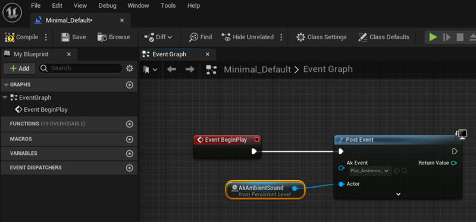

# 播放声音

工程有可能已经包含声音（取决于所用 Unreal 工程的类型）。要确认是否成功添加了环境声，请从关卡中移除所有其他声音。

在 Editor 中，单击 **Play**。这时会发送 Event 并可听到自己添加的声音。

### Project Settings

|  |
| --- |
| Wwise Unreal Integration Documentation |

Project Settings

所有与 Wwise Integration 相关的设置都会显示在 Unreal Project Settings (**Edit > Project Settings**) 中的 Wwise 分区下。您可以将数据从某一平台设置结构复制粘贴到另一平台设置结构，即便两个结构不完全相同。Unreal 会复制匹配的数据并忽略其余数据。

# Platform Initialization Settings

此分区包含 Unreal Engine 安装包中可用的所有受支持的 Wwise 平台的初始化设置。在编辑器中对设置所作的修改只有在重新启动编辑器后才会生效；不过，若使用 Standalone 游戏模式，则将按照当前设置初始化新的 SoundEngine 实例。

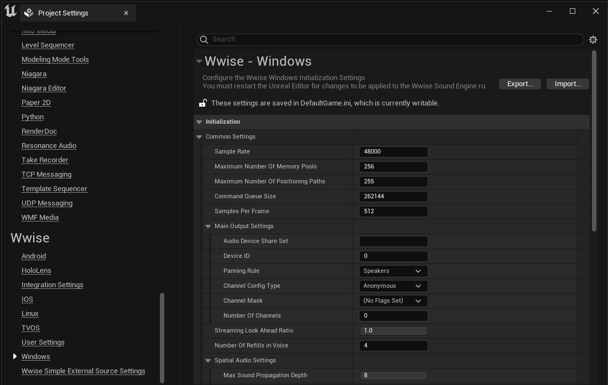

## Common Settings

- **Sample Rate**   
  此项表示采样率 (Hz)。默认值为 48000。对于较低的音频品质，使用 24000。支持任何合理有效的采样率。不过，若将采样率设得非常低，声音引擎可能会无法正常运行。
- **Maximum Number of Memory Pools**   
  此项表示最多有多少个内存池。每个加载的 Bank 都需要一个内存池。
- **Maximum Number of Positioning Paths**   
  此项表示最多有多少条自动化路径可供对声音进行定位。
- **Command Queue Size**   
  此项表示 Command Queue 的大小。
- **Samples Per Frame**   
  此项表示每个音频帧的样本数（256、512、1024、2048）。
- **Streaming Look Ahead Ratio**   
  此项表示所有流传输预读启发式算法值的倍数。
- **Number Of Refills in Voice**   
  此项表示声部缓冲区中的重填缓冲区数。对于双缓冲，设为 2。默认值为 4。

### Main Output Settings

- **Audio Device ShareSet**   
  此项表示所要使用的自定义音频设备的名称。在 Wwise 工程的 Audio Device ShareSet 分区中定义自定义音频设备。若将此项保留为空，则通过默认音频设备正常输出。
- **Device ID**   
  此项表示特定于设备的标识符。在使用多个相同类型的设备时使用。若仅使用一个设备，请将该设置保留为 0（默认）。
- **Panning Rule**   
  此项表示要针对输出到立体声总线的信号应用哪种 3D 声像摆位。在 Speakers 模式下，使用前置扬声器的角度。在 Headphones 模式下，将扬声器角度替换为两个间隔 180 度的虚拟话筒之间的 Constant Power 声像摆位。
- **Channel Config Type**   
  该代码通过 uChannelMask 完成对声道的识别。Anonymous：声道掩码 == 0。Standard：必须通过 `AkSpeakerConfigs` 中定义的标准来识别声道。Ambisonic：声道掩码 == 0。声道遵从标准 Ambisonics 阶数。
- **Channel Mask**   
  该位域的声道标识符取决于 `AkChannelConfigType`（最大可设为 20）。
- **Number of Channels**   
  此项表示声道数。通过声道掩码得出，或者直接设为匿名。

### Spatial Audio Settings

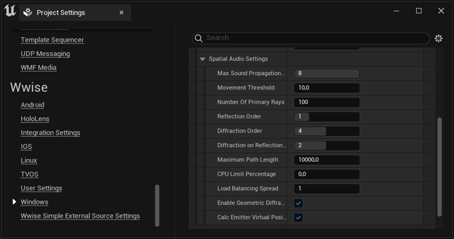

- **Max Sound Propagation Depth**   
  此项表示声音最多可穿过多少个 Portal。
- **Movement Threshold**   
  Amount that an emitter or listener has to move to trigger a recalculation of reflections and diffraction. 在设为较大数值时可以减轻 CPU 负荷，不过精度会有所下降。
- **Number Of Primary Rays**   
  此项表示随机射线投射中使用的初级射线数。
- **Reflection Order**   
  此项表示最高反射阶数 (1 ~ 4)。
- **Max Diffraction Paths**   
  Limit the maximum number of diffraction paths computed per emitter, excluding the direct/transmission path. The acoustics engine searches for up to 'Max Diffraction Paths' paths and stops searching when this limit is reached. Setting a low number for uMaxDiffractionPaths (1-4) uses fewer CPU resources, but is more likely to cause discontinuities in the resulting audio. This can occur, for example, when a more prominent path is discovered, displacing a less prominent one. Conversely, a larger number (8 or more) produces higher quality output but requires more CPU resources. The recommended range is 2-8.
- **Max Global Reflection Paths [Experimental]**   
  Set a global reflection path limit among all sound emitters with early reflections enabled. Potential reflection paths, discovered by raycasting, are first sorted according to a heuristic to determine which paths are the most prominent. Afterwards, the full reflection path calculation is only performed on the most prominent 'Max Reflection Paths'. Limiting the total number of reflection path calculations can significantly reduce CPU usage. Recommended range: 10-50. Set to 0 to disable the limit. In this case, the number of paths computed is unbounded and depends on how many are discovered by raycasting.
- **Diffraction Order**   
  此项表示最高衍射阶数（衍射路径当中的弯曲次数）。在衍射阶数较高时，可容纳更加复杂的几何构造，代价是 CPU 用量更高。必须在几何构造上启用衍射才能查找衍射路径。若设为 0，则在所有几何构造上禁用衍射。此参数可限制从听者位置投射以扫描环境的衍射射线的递归深度，以及用于查找发声体和听者之间路径的衍射搜索的深度。To optimize CPU usage, set it to the maximum number of edges you expect the obstructing geometry to traverse.
- **Max Emitter Room Aux Sends**   
  The maximum number of game-defined auxiliary sends that can originate from a single emitter. An emitter can send to its own Room and to all adjacent Rooms if the emitter and listener are in the same Room. If a limit is set, the most prominent sends are kept, based on spread to the adjacent portal from the emitter's perspective. Set to 1 to only allow emitters to send directly to their current Room, and to the Room a listener is transitioning to if inside a portal. Set to 0 to disable the limit. The default value is 3.
- **Diffraction on Reflections Order**   
  此项表示反射路径每一端最多可有多少个衍射点。借助对反射的衍射，可在听者或发声体进出反射的阴影区时将反射平滑地淡入和淡出。When greater than zero, diffraction rays are sent from the listener to search for reflections around one or more corners from the listener. 必须在几何构造上启用衍射才能查找衍射的反射。若设为 0，则禁用对衍射的反射。
- **Max Diffraction Angle Degrees**   
  The largest possible diffraction value, in degrees, beyond which paths are not computed and are inaudible. Must be greater than zero. Default value: 180 degrees. A large value (for example, 360 degrees) allows paths to propagate further around corners and obstacles, but takes more CPU time to compute. A gain is applied to each diffraction path to taper the volume of the path to zero as the diffraction angle approaches fMaxDiffractionAngleDegrees, and appears in the Voice Inspector as 'Propagation Path Gain'. This tapering gain is applied in addition to the diffraction curves, and prevents paths from popping in or out suddenly when the maximum diffraction angle is exceeded. In Wwise Authoring, the horizontal axis of a diffraction curve in the attenuation editor is defined over the range 0-100%, corresponding to angles 0-180 degrees. If fMaxDiffractionAngleDegrees is greater than 180 degrees, diffraction coefficients over 100% are clamped and the curve is evaluated at the rightmost point.
- **Maximum Path Length**   
  此项表示反射/衍射路径的最大长度。
- **CPU Limit Percentage**   
  The maximum amount of computation time allocated for Spatial Audio, as a percentage (0-100) of the current audio frame. When the value is greater than 0, Spatial Audio dynamically adapts the load-balancing spread value between 1 and the specified uLoadBalancingSpread based on current CPU usage and the specified CPU limit. Set to 0 to disable the dynamic load-balancing spread computation.
- **Load Balancing Spread**   
  The number of uLoadBalancingSpread frames over which to spread Spatial Audio task computation. The minimum value is 1, which indicates no load balancing. When a CPU limit is active, this value determines the upper limit of the dynamic load balancing spread, and is not a fixed value.
- **Smoothing Constant (ms) [Experimental]**   
  Enable parameter smoothing on the diffraction paths generated by the Acoustics Engine. Set 'Smoothing Constant (ms)' to a value greater than 0 to define the time constant (in milliseconds) for parameter smoothing. The time constant of an exponential moving average is the amount of time for the smoothed response of a unit step function to reach 1 - 1/e ~= 63.2% of the original signal. A large value (eg. 500-1000 ms) results in less variance but introduces lag, which is a good choice when using conservative values for uNumberOfPrimaryRays (eg. 5-10), uMaxDiffractionPaths (eg. 1-3) or fMovementThreshold ( > 1m ), in order to reduce overall CPU cost. A small value (eg. 10-100 ms) results in greater accuracy and faster convergence of rendering parameters. Set to 0 to disable path smoothing.
- **Adjacent Room Bleed**   
  A global scaling factor that manipulates reverb send values, affecting the proportion of audio sent to adjacent rooms versus the proportion sent to the emitter's current room. This global factor is multiplied by the per-portal AkPortalParams::AdjacentRoomBleed value. Valid range: (0.0 - infinity).   

  |  |  |
  | --- | --- |
  |  | **注記：** Values approaching 0 may result in abrupt portal transitions. |

  When calculating reverb send amounts, each portal's aperture is multiplied by this factor, altering its perceived size:
  - 1.0 (Default): Maintain portals at their true geometric size.
  - > 1.0: Increases the perceived size of all portals, allowing more bleed into adjacent rooms.
  - < 1.0: Decreases the perceived size of all portals, reducing bleed into adjacent rooms.
- **Enable Geometric Diffraction and Transmission**   
  Enables the computation of geometric diffraction and transmission paths for all sources that have the **Enable Diffraction and Transmission** box selected in the Positioning tab of the Wwise Property Editor. 该标记会启用围绕（衍射）和穿过（透射）几何构造的声音路径。通过将 **Enable Geometric Diffraction and Transmission** 设为 false，可确保仅将几何构造用于计算反射。为了实施衍射计算，必须在几何构造上启用衍射边缘。If **Enable Geometric Diffraction and Transmission** is false but a sound has "Enable Diffraction and Transmission" selected in the positioning tab of Wwise Authoring, the sound only diffracts through portals but passes through geometry as if it were not there. 若游戏本身执行声障计算，但仍将几何构造传给 Spatial Audio 来执行反射计算，请禁用此设置。
- **Calc Emitter Virtual Position**   
  在设为 true 时，Wwise Spatial Audio 会计算在 Portal 两侧或几何构造周围发生衍射的发声体的视位置或虚声源位置，然后将该位置发送到声音引擎。
- **Transmission Operation**   
  The operation used to determine transmission loss on direct paths. Default value is Max.
- **Clustering Min Points**   
  Minimum number of emitters in a cluster. Default value is 2. Values less than 2 disable the clustering.
- **Clustering Max Distance**   
  Max distance between emitters to be considered as neighbors. This distance is specified for the reference distance defined by fClusteringDeadZoneDistance. Default value is 500.0.
- **Clustering Dead Zone Distance**   
  Defines a dead zone around the listener where no emitters are clusters. Default value is 1000.0.

## Communication Settings

- **Initialize System Comms**   
  此项表示是否对通信系统进行初始化。有些主机对通信系统的初始化有严格要求。仅在游戏在声音引擎初始化之前已经使用套接字时设为 false。
- **Pool Size**   
  此项表示通信池的大小。
- **Discovery Broadcast Port**   
  Wwise 设计工具通过该端口来广播 Game Discovery 请求以检测网络上运行的游戏。默认值为 24024。不可设为 0。
- **Command Port**   
  此项表示命令声道端口。若设为 0，则请求访问动态/临时端口。
- **Network Name**   
  使用该名称在 Wwise 设计工具内识别此游戏。若保留为空，则使用 `FApp::GetProjectName()`。

## Advanced Settings

- **Use Head Mounted Display Audio Device**   
  在工程当中涉及具有音频功能的头显时启用此项。
- **Max System Audio Objects**   
  此项表示最多预留多少个 System Audio Object。其他处理无法使用这些 System Audio Object。默认值为 128。
- **Enable Multi Core Rendering**   
  在设为 true 时，将 SoundEngine 处理任务分散到 Unreal Engine Task Graph 上。若更改此设置，则须重新启动 Editor。
- **Max Num Job Workers**   
  The maximum number of workers that the Sound Engine can request at any time. 若更改此设置，则须重新启动 Editor。
- **Job Worker Max Execution Time Usec**   
  此项表示为 Sound Engine 处理任务分配的最长时间（毫秒）。若更改此设置，则须重新启动 Editor。
- **IO Memory Size**   
  此项表示 I/O 内存池的大小（自动流）。该值会被向下舍入为 `uGranulrity` 的倍数，然后直接传给 `AK::MemoryMgr::CreatePool()`。
- **IO Granularity**   
  此项表示 I/O 请求粒度（通常设为每个请求的字节数）。
- **Target Auto Stream Buffer Length**   
  此项表示目标自动流缓冲区长度（毫秒）。在流达到缓冲区限值时，除非调度程序空闲，否则只针对 I/O 进行安排。
- **Use Stream Cache**   
  若设为 true，则设备尝试重复使用已经从磁盘进行流传输的 I/O 缓冲区。这在对短的循环声音进行流传输时特别有用。不过，在分配内存时 CPU 用量会有小幅增加，StreamManager 内存池中的内存用量略高。
- **Maximum Pinned Bytes in Cache**   
  此项表示可使用 `AK::SoundEngine::PinEventInStreamCache()` 或 `AK::IAkStreamMgr::PinFileInCache()` 锁定的最大字节数。
- **Enable Game Sync Preparation**   
  若设为 true，则启用 `AK::SoundEngine::PrepareGameSync`。
- **Continuous Playback Look Ahead**   
  此项表示在开始播放后续声音前 Continuous 容器将新声部实例化时设定的预读时间量。此预读时间量允许执行 I/O 处理。对于采用 Trigger Rate 或 Sample-accurate 过渡的 Continuous 容器，可藉此有效降低播放延迟。
- **Monitor Queue Pool Size**   
  此项表示监控队列内存池的大小。Release 版本中会忽略此参数。
- **Maximum Hardware Timeoput Ms**   
  此项表示要在硬件设备触发音频中断前等待多长时间（毫秒）。若在这段时间之后没有中断，声音引擎会恢复为无声模式并继续运行，直到硬件最终再次做出响应。
- **Debug Out Of Range Check Enabled**   
  此项为调试设置，其允许检查处理代码中是否存在超出范围的浮点值和 NaN 浮点值。一般情况下不要启用，因为该设置会占用大量 CPU。若在管线的多个点发现无效值，则会在日志中输出错误消息。
- **Debug Out Of Range Limit**   
  此项为调试设置。其仅在 Debug Out Of Range Check Enabled 为 true 时使用。该项定义样本可具有的最大数值。正常的音频必须控制在 +1/-1 之内。若将该限值设为大于 1 的值，则允许暂时或在短时间内偏离范围。默认值为 16。

# Integration Settings

**Reverb**

- **Max Simultaneous Reverb Volumes**   
  此项表示最多可有多少个 Ak Reverb Volume 同时影响声音。若将该值设为零，则禁用游戏中的所有 Ak Reverb Volume。注意，此设置并不会影响同时带有 Ak Room Component 的 Actor 上绑定的 Ak Late Reverb Component。

**Installation**

- **Wwise Project Path**   
  此项表示 UE 游戏所用 Wwise 工程的存储位置。Wwise 集成包需要使用此路径来创建游戏所需的 Wwise 资源（使用 Unreal Content Browser 或 Build 菜单内的 **Generate SoundBanks** 功能）。该路径与 Unreal 工程的目录相关（与 Unreal Engine 中指定的 `FPaths::ProjectDir()` 相同）。
- **Root Output Path**   
  The location of the folder that contains the Wwise project metadata, specifically the `ProjectInfo.json` file. This file contains the locations of the generated SoundBanks, which are required to play sound in the game. The path is relative to the Unreal project's content directory, as given by `FPaths::ProjectContentDir()`.

  |  |  |
  | --- | --- |
  |  | **注記：** 若要使用 External Source，则须将针对此路径所作的更改反映到 Wwise 工程内的 External Sources 设置中。 |

**Cooking**

- **Wwise Staging Directory**   
  在烘焙过程中暂存文件时将 .bnk 和 .wem 文件复制到该目录。
- **Package as Bulk Data**   
  Determines whether to package Wwise assets into Unreal UAssets during cooking instead of packaging them as individual files, as described in [Packaging Wwise Assets as Bulk Data](using_features_package_as_bulk_data.html).

**Obstruction Occlusion**

- **Default Collision Channel**   
  The default collision channel used for audio obstruction and occlusion calculations.

**Fit to Geometry**

- **Default Fit to Geometry Collision Channel**   
  此项表示在将 Ak Acoustic Portal 和 Ak Spatial Audio Volume 与周围几何构造贴合时使用的默认 Collision Channel 值。

**Reverb Assignment** (Refer to [Automatically Assigning a Reverb Aux Bus](features_editor_reverb_estimation.html#features_editor_reverb_estimation_aux_bus_map) for more information)

- **Default Surface Absorption**   
  The default surface absorption value to use when estimating environment Decay value. It is used for the decay estimations of environments without Acoustic Texture information. 默认值为 0.5。
- **Default Reverb Aux Bus**   
  The default Auxiliary Bus to choose for Automatic Reverb Assignment. Automatic Reverb Assignment can be enabled on Late Reverb components. When their Decay values exceed the highest Decay value in the Reverb Assignment Table, or if the table is empty or nonexistant, the default Auxiliary Bus is chosen. This Auxiliary Bus must have a reverb effect.
- **Reverb Assignment Table**   
  A table that associates Auxiliary Busses with Reverb Decay values. If Automatic Reverb Assignment is enabled on a Late Reverb component, its Decay value is compared to the table's Decay values. The chosen Auxiliary Bus is the one associated with the closest and highest Decay value in the table. If the given Decay value exceeds the highest Decay value in the table, or if the table is empty or nonexistant, the Default Reverb Aux Bus is chosen.   
  Rows must be of type FWwiseDecayAuxBusRow.
  - **Row Name** A unique name for the row.
  - **Decay** The number of seconds it takes for the sound reverberation in an environment to decay by 60 dB. Decay values are represented with floating point numbers. We recommend that consecutive Decay values differ by at least 0.01 to ensure the correct Auxiliary Bus is chosen for a given Decay value.
  - **Aux Bus** The Auxiliary Bus in Wwise Authoring that has a reverb effect to associate with the Decay value of the same row.
- **RTPCs**
  - **HFDamping Name**   
    （原有工作流程）该 RTPC 名称用于设置环境产生的高频阻尼估值。若已设置数值，则使用 "HFDamping" RTPC 值覆盖。
  - **Decay Estimate Name**   
    （原有工作流程）该 RTPC 名称用于估算声压级降低 60 dB 所需的时间。若已设置数值，则使用 "Decay Estimate" RTPC 值覆盖。
  - **Time to First Reflection Name**   
    （原有工作流程）该 RTPC 名称用于设置一阶反射声到达听者位置预计所需的时间。若已设置数值，则使用 "Time to First Reflection" RTPC 值覆盖。
  - **HFDamping RTPC**   
    该 RTPC 用于设置环境产生的高频阻尼估值。
  - **Decay Estimate RTPC**   
    该 RTPC 用于估算声压级降低 60 dB 所需的时间。
  - **Time to First Reflection RTPC**   
    该 RTPC 用于设置一阶反射声到达听者位置预计所需的时间。

**Initialization**

- **Init Bank**   
  The unique Init Bank for the Wwise project, which contains the basic information necessary to properly set up the Sound Engine.
- **Unreal Audio Routing**   
  Audio routing options that determine whether to use Unreal or Wwise audio exclusively, the two together, or to route Unreal audio through AudioLink. For more information, refer to [Selecting Audio Routing Options](using_audio_link.html#using_audio_link_enabling).
- **Wwise Sound Engine Enabled**   
  Indicates whether the Wwise Sound Engine is enabled, depending on the selected audio routing option.
- **Wwise Audio Link Enabled**   
  Indicates whether the Wwise AudioLink is enabled, depending on the selected audio routing option.
- **Default Listener Scaling Factor**   
  The default value of the scaling factor when a default listener is created.
- **Suspend Audio During Focus Loss**   
  Determines whether to suspend audio during loss of focus of the editor or game.
- **Render During Focus Loss**   
  Determines whether to continue rendering audio while audio is suspended during focus loss. Only applicable if **Suspend Audio During Focus Loss** is enabled.

**Localization**

- **Unreal Culture to Wwise Culture**   
  此项用于从 Unreal Culture 代码映射到 Wwise Language。这样可以直接通过 Unreal Culture 代码来调用 **Set Current Audio Culture**。有关详细信息，请参阅 [Localizing Audio Assets](using_features_localization.html) 章节。

**Asset Creation**

- **Default Asset Creation Path**   
  The path in which to create assets dragged from the Wwise Browser.

**Geometry Surface Properties**

- **Verify and Update**   
  Verify each row of the Geometry Surface Properties Table below and remove rows with an invalid Physical Material.
- **Default Acoustic Texture**   
  The default Acoustic Texture set on a surface of a Spatial Audio Volume actor when Fit to Geometry is used and no geometry is hit. The default value is None, which indicates a completely reflective surface.
- **Default Transmission Loss**   
  The default Transmission Loss value set on a surface of a Spatial Audio Volume actor when Fit to Geometry is used and no geometry is hit. The valid range is between 0 and 1. The default value is 0, which indicates that sound can pass through the surface without any loss. A surface with 0 transmission loss is considered transparent. It disables any reflections and does not use the Acoustic Texture.
- **Geometry Surface Properties Table**   
  The table that associates Geometry Surface Properties (Acoustic Texture and Transmission Loss) with Physical Materials. This table is used to retrieve the Geometry Surface Properties according to the Static Mesh's Physical Materials when using the [AkGeometryComponent](pg_features_spatialaudio.html#features_objects_akgeometrycomponent) or when using [Fit to Geometry](sa_fittogeometry.html) with the [AkSpatialAudioVolume](pg_features_spatialaudio.html#features_objects_akspatialaudiovolume).   
  Rows must be of type FWwiseGeometrySurfacePropertiesRow. We recommend that you do not add or remove rows. Rows are updated when Physical Material assets are added to or removed from the project. Rows are also updated when an Acoustic Texture with a name similar to a Physical Material is added to the project.
  - **Row Name** The asset path to a Physical Material in the current project.
  - **Acoustic Texture** The Acoustic Texture to associate with the Physical Material of the same row. Acoustic Textures consist of a group of absorption values representing the percentage by which sound within a relative frequency range is dampened after a reflection.
  - **Transmission Loss** The value by which to filter a sound modeling transmission through geometry.

# User Settings

**Installation**

- **Wwise Windows Installation Path**   
  The location of Wwise Authoring on your Windows development machine. This option will need to be updated when a new version of Wwise Authoring is required by the integration changes.
- **Wwise Mac Installation Path**   
  The location of Wwise Authoring on your Mac development machine. You must update this value when integration changes require you to install a new version of Wwise Authoring.

|  |  |
| --- | --- |
|  | **注記：** If these installation paths are not correctly set, Unreal cannot generate the Wwise SoundBanks required for the game. |

- **Root Output Path User Override**   
  The location of the folder that contains the Wwise project metadata, as determined by a user override in the Wwise User SoundBank Settings. The folder includes the `ProjectInfo.json` file, which contains the paths to the generated SoundBanks.

**WAAPI**

- **WAAPI IP Address**   
  此项表示用于连接到 [Wwise Authoring API (WAAPI)](using_features_waapi.html) 的 IP Address。
- **WAAPI Port**   
  此项表示用于连接到 WAAPI 的 Port。
- **Auto Connect to WAAPI**   
  此项允许通过 WAAPI 将 Unreal Editor 自动连接到 Wwise。
- **Auto Sync Selection**   
  Whether to synchronize the selection between the Wwise Browser and the Wwise Project Explorer.

**Error Message Translator**

- **XML Translator Timeout**   
  此项表示分配给 XML 文件阅读器来搜索 ID 的最长时间（毫秒）。若设为 0，则将其禁用。
- **Waapi Translator Timeout**   
  此项表示分配给通过 WAAPI 连接来搜索 ID 的最长时间（毫秒）。若设为 0，则将其禁用。

Error Translator 用于在有相应信息时将错误消息中的数字 ID 转换为用户可读的名称。您可以通过 `SoundBanksInfo.xml` 或 WAAPI 来实现这一操作。 若 SoundBank 文件旁边有 `SoundBanksInfo.xml` 文件（可选），通过 XML 来实现会更快一些。 WAAPI 的优势在于可直接从 Wwise 实例读取最新信息。不过网络通信速度可能会很慢，因为其在默认情况下是禁用的。

**Assets Reload**

- **Ask for Wwise Assets Reload**   
  此项用于打开相应通知。在 Unreal Editor 中操作时，用户必须先接受该通知再重新加载 Wwise Asset Data。

**Viewports**

- **Visualize Rooms and Portals**   
  此项用于在 Viewport 中直观地呈现 Rooms 和 Portal。须在 Viewport 中启用实时设置。
- **Show Reverb Info**   
  When enabled, information about `AkReverbComponents` is displayed in viewports, above the component's UPrimitiveComponent parent. 须在 Viewport 中启用实时设置。

# Wwise Simple External Source Manager Settings

- **Media Info Table**   
  此表格包含用于在工程中加载各个 External Source 媒体所需的全部信息。此表格中的所有文件都将打包到构建好的工程中。
- **External Source Default Media**   
  该可选表格用于定义 MediaInfoTable 中的默认媒体条目以便在加载 External Source 时一并加载。
- **External Source Staging Directory**   
  此项表示在烘焙工程时要将 External Source 媒体暂存到哪个位置。从该位置加载构建好的工程中包含的 External Source 媒体。

# 初始化 SoundEngine

SoundEngine 初始化步骤在 `FAkSoundEngineInitialization::Initialize()` 方法中执行。在此方法中，会通过 Wwise Initialization Settings 内针对每个平台设定的数值来配置内存、流播放、IO、声音引擎、平台、音乐引擎和通信设置。

有关 SoundEngine 初始化的详细信息，请参阅 Wwise SDK 文档中的“[初始化声音引擎的不同模块](https://www.audiokinetic.com/library/?source=SDK&id=workingwithsdks__initialization.html)”章节。###### Main Output Settings

###### Spatial Audio Settings

##### Common Settings

##### Communication Settings

##### Advanced Settings

##### 连接到 WAAPI

##### 通过 C++ 使用 WAAPI

#### Platform Initialization Settings

#### Integration Settings

#### User Settings

#### Wwise Simple External Source Manager Settings

#### 初始化 SoundEngine

#### Wwise Authoring API (WAAPI)

|  |
| --- |
| Wwise Unreal Integration Documentation |

Wwise Authoring API (WAAPI)

Wwise Authoring API 可用于与 Wwise 设计工具进行通信。在同时运行 Unreal 和 Wwise 设计工具并将 Unreal 连接到 WAAPI 的情况下，WAAPI 允许 Unreal Integration 在会话期间获取和修改 Wwise 工程的相关信息。

有关 WAAPI 及其功能的详细信息，请参阅 <https://www.audiokinetic.com/library/edge/?source=SDK&id=waapi.html>。

|  |  |
| --- | --- |
|  | **注記：** WAAPI is only available on Windows and Mac in the Editor. |

# 连接到 WAAPI

After you integrate Wwise into your Unreal project, you must update an Unreal configuration setting to connect to WAAPI.

在 Unreal 工程中启用 WAAPI：

1. 在 Unreal Editor 中打开工程，并在 Wwise 设计工具中打开对应的 Wwise 工程。
2. 在 Unreal 中，依次单击 **Edit > Project Settings**。这时会打开 Unreal Project Settings 对话框。
3. 在左侧面板中，滚动到 Wwise 分区，然后单击 **User Settings**。
4. 选择 **Auto Connect to WAAPI**。WAAPI features such as inside the Wwise Browser are now enabled.

为了确保能够运行支持 WAAPI 的功能，Wwise 设计工具中打开的 Wwise 工程必须与 **Integration Settings** 中的 **Wwise Project Path** 所定义的工程匹配。

Integration Settings

您可以在 Wwise User Settings 中配置用来连接到 WAAPI 的 IP 地址和端口。

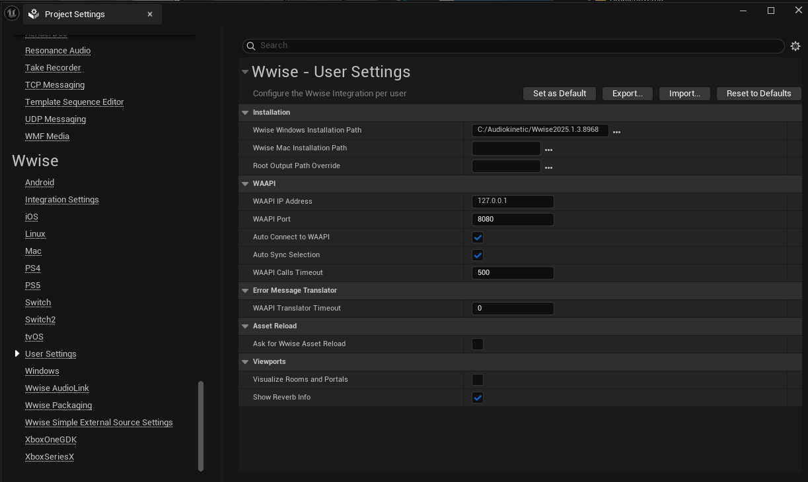

User Settings

# 通过 C++ 使用 WAAPI

AkAudio 模块自带用于 [WAAPI C++ SampleClient](https://www.audiokinetic.com/library/edge/?source=SDK&id=waa__cpp__sample.html) 的 Unreal 封装类。

为了确保能够正常使用，您必须先按照 [Unreal Engine C++ 工程](using_cpp.html) 中所列步骤将 AkAudio 模块作为依赖项添加到游戏中。在完成此操作之后，便可使用 `FAkWaapiClient` 类。

You can also use the low-level WwiseAuthoring module bundled in the WwiseSoundEngine plug-in. This module is Editor-specific.

##### WwiseSoundEngine Plug-in

##### AkAudio 模块

#### 链接模块

#### 覆盖 Wwise Unreal 集成

#### 利用 C++ 创建 AkComponent

#### 在 Unreal 工程中使用 Wwise API

#### Packaging Requirements

### Unreal Engine C++ 工程

|  |
| --- |
| Wwise Unreal Integration Documentation |

Unreal Engine C++ 工程

# 链接模块

The Wwise Unreal Integration is separated into multiple modules and multiple plug-ins. 为了在 C++ 工程内使用 Wwise 的功能，必须在工程的构建文件 (`.Build.cs`) 内链接这些模块。您可以通过从构建文件中移除模块来将其禁用。

在以下示例中，工程包含以下 public 模块：Core、CoreUOBject、Engine、InputCore、AkAudio 和 WwiseSoundEngine。其中，`AkAudio` 和 `WwiseSoundEngine` 为 Wwise 模块。

public class MyModule : ModuleRules

{

public MyModule(ReadOnlyTargetRules Target) : base(Target)

{

PublicDependencyModuleNames.AddRange(new string[] { "Core", "CoreUObject", "Engine", "InputCore", "AkAudio", "WwiseSoundEngine" });

// 其他设置

}

}

在本例中，可使用 `WwiseSoundEngine` 和 `AkAudio` 模块的功能。模块可包含在 `PublicDependencyModulesNames` 或 `PrivateDependencyModulesNames` 中。For more information about modules, see [Unreal Engine Modules](https://dev.epicgames.com/documentation/en-us/unreal-engine/unreal-engine-modules).

For more information about Wwise plug-ins and modules, see [Understanding the Wwise Unreal Integration Plug-ins](goingfurther_plugins.html).

# 覆盖 Wwise Unreal 集成

Integration 中的模块（除了 `WwiseSoundEngine`、`AudiokineticTools` 和 `AkAudio`）可通过继承来进行扩展。这些模块的大部分功能都可由开发者根据工程自身需要进行覆盖并修改相应行为。若要覆盖模块，请创建一个新的模块并确保其继承所要覆盖的模块。然后，覆盖所需函数。为了使用新建的模块，请确保将其包含在游戏的 `Build.cs` 中，并添加到 `DefaultEngine.ini`（如下所示）：

[Audio]

WwiseFileHandlerModuleName=WwiseSimpleExternalSource

The [WwiseSimpleExternalSource module](using_features_simpleexternalsourcemanager.html) is an example of overriding a module. 确切来说，它覆盖了 `WwiseFileHandler` 模块以便通过 Data Table 来处理外部源。

# 利用 C++ 创建 AkComponent

在利用 C++ 创建新的 `AkComponent` 时，必须将其关联到父组件。有了 `AkComponent`，API 才能正常运行。以下章节举例展示了如何添加 `AkComponent`。

# 在 Unreal 工程中使用 Wwise API

现在可以通过 Wwise Unreal 集成来使用 Wwise API。您可以通过 `WwiseSoundEngine` 或 `AkAudio` 模块调用大部分函数。

## WwiseSoundEngine Plug-in

The `WwiseSoundEngine` plug-in and module provides low-level access to most SoundEngine API operations. 借助 `WwiseSoundEngine` 模块，可直接、安全地访问 API 函数（如以下示例所示）：

#include "AkAudioEvent.h"

#include "AkComponent.h"

#include "Wwise/API/WwiseSoundEngineAPI.h"

void PostEventSoundEngine(UAkAudioEvent\* Event, AActor\* GameObject)

{

if (auto\* SoundEngine = IWwiseSoundEngineAPI::Get())

{

if(Event && GameObject)

{

TArray<UAkComponent\*> Array;

GameObject->GetComponents<UAkComponent>(Array);

//The Actor doesn't have an AkComponent attached. 若要通过此 Actor 来发出声音，就需要此组件。

if (Array.Num() == 0)

{

//PostEvent doesn't load the event. The Event needs to be loaded beforehand.

if (!Event->IsLoaded())

{

Event->LoadData();

}

auto\* AkAudioComponent = NewObject<UAkComponent>(GameObject);

AkAudioComponent->SetupAttachment(GameObject->GetDefaultAttachComponent());

Array.Add(AkAudioComponent);

AkAudioComponent->RegisterComponent();

}

SoundEngine->PostEvent(Event->GetWwiseShortID(), Array[0]->GetAkGameObjectID());

}

}

}

此代码会在给定 Actor 上发送 Event。您必须在 Actor 上添加 `UAkComponent` 以通过 Wwise 予以注册。同时还要加载 Event，因为 `WwiseSoundEngine` 模块中不会自动加载 Event。

|  |  |
| --- | --- |
|  | **注記：** You must use the WwiseSoundEngine module's `IWwiseSoundEngineAPI` interface for all `AK::SoundEngine` calls. See [WwiseSoundEngine 模块](module_soundengine.html) for more information. |

## AkAudio 模块

`AkAudio` 根模块适用于大部分面向用户的 Integration 功能。它可以完成 `WwiseSoundEngine` 模块可使用 Unreal 组件执行的大部分操作。它包含用于 Integration 所用素材类型和组件的类。作为直接调用 SoundEngine 的替代方法，AkAudioDevice 提供了很多辅助函数来封装常用的 WwiseSoundEngine API。这些辅助函数还会检查是否已加载使用 API 所需的资源并提供更多日志信息。

就像前面的例子一样，以下代码也会在给定 Actor 上发送 Event。同时，还会绑定 `AkComponent` 并加载 Event：

#include "AkAudio.h"

void PostEvent(UAkAudioEvent\* Event, AActor\* GameObject)

{

if (FAkAudioDevice::Get())

{

FAkAudioDevice::Get()->PostAkAudioEventOnActor(Event, GameObject);

}

}

您可以在 `WwiseDemoGame/WwiseCodeExample` 下的 WwiseDemoGame 中找到更多代码示例，并在 `WwiseDemoCodeExampleMap` 中做各种尝试。

# Packaging Requirements

When you package your Unreal project, the assets are "tree-shaken." In other words, Unreal assets that represent Wwise objects are automatically included if they are referenced either by another packaged asset or by a packaged map. If they are, any associated SoundBanks and media files are copied into the built package. Any Wwise Unreal assets that do not satisfy one of these conditions are not included.

This packaging approach is efficient, but in certain cases some Wwise Unreal assets might be improperly excluded, which can cause errors. The following scenarios can cause this type of problem:

- The project uses Wwise Unreal assets that are not directly referenced by packaged maps.
- The project uses Events that are posted by string or from code.

If one of these scenarios applies to your project, you must therefore ensure that either the asset is directly referenced by a map, or ensure that the required assets are manually loaded. To manually add assets, add the containing directory to the project's **Additional Asset Directories to Cook** in the Project Settings. See the [Project](https://dev.epicgames.com/documentation/en-us/unreal-engine/project-section-of-the-unreal-engine-project-settings) section of the Unreal Project Settings documentation for more information.

### 使用 Wwise Demo Game

|  |
| --- |
| Wwise Unreal Integration Documentation |

使用 Wwise Demo Game

您可以通过 Audiokinetic Launcher 下载 Wwise Demo Game（包含 Wwise Unreal 集成）。游戏的地图提供有多个演示环节。藉此，可测试各种集成功能。

为了构建演示游戏，您必须安装 Wwise SDK 并修改示例游戏中的 Wwise 集成包。Refer to [Installing Wwise and Component Packages](https://www.audiokinetic.com/library/wwise_launcher/?source=InstallGuide&id=installing_wwise_and_its_components) and [Upgrading or Modifying an Integration Package](https://www.audiokinetic.com/library/wwise_launcher/?source=InstallGuide&id=upgrade_or_modify_wwise_integration) for more information.

**下载 Wwise Demo Game：**

1. In the Audiokinetic Launcher, select the Unreal Engine page.
2. From the **Download** list, click **Demo Game** > **<IntegrationVersion>**.

   

   这时将打开文件资源管理器窗口。
3. 转到要在其中保存 Unreal 工程的文件夹并单击 **Select**。这时会安装所集成的 Unreal 工程。

# 生成 SoundBank

1. 在 Unreal Editor 中打开 WwiseDemoGame。
2. 在工具栏中，转到 **Build** 下，然后从 **Audiokinetic** 类别选择 **Generate SoundBanks...**。
3. 选择全部所需平台和语言，然后单击 **OK**。

在生成 SoundBank 后，会对与 GeneratedSoundBanks 文件夹关联的 Wwise 工程进行重新解析，并重新加载工程中的 Wwise 素材。

# 地图内容

## AkEvent Animation Notify

您可以使用 Animation Notify 将 AkEvent 发送到 SoundEngine。FPP\_Fire 动画中演示了其使用方法。

## Ambient Demo

此地图区域演示了如何使用 [AkAmbientSound](pg_features_objects_actors.html#features_akambientsound) Actor。关卡中的 `AmbientNoise_Spatialized` 环境声发声体由 Level Blueprint 中的 **Start All Ambient Sounds** 节点启动。为了便于找到该 Actor，在游戏当中会将衰减球体绘制成黄色。此发声体所用的 Event 包含在 `AmbientBank` SoundBank 中。

此外，该区域还有助于演示声笼功能。通过让玩家角色走到靠近环境声的墙壁后方（确保待在黄色区域内）或球体中的大箱子后方，可以听到声音上应用的声笼效果。为声音启用声笼的设置位于 Blueprint 关卡的 Ambient Sound handling（红色）部分中。

## AudioLink Demo

This section of the map demonstrates how to route Unreal Audio through Wwise using Unreal's AudioLink tool.

The button triggers the `Template1rst_WeaponFire02` Unreal Audio file, which uses an Unreal Sound Attenuation with AudioLink enabled. A Wwise AudioLink Settings asset is linked to the Sound Attenuation to override the default AudioLink settings. You can confirm that the sound is correctly routed through Wwise by profiling the editor with Wwise. A voice called `UnrealInput` is displayed in the Voices Graph each time the AudioLink Demo button is pressed. Triggering it multiple times generates just as many voices in the Profiler, which demonstrates AudioLink's granular control over audio.

For more information on using AudioLink in your Unreal project, see [Combining Unreal and Wwise Audio with AudioLink](using_audio_link.html).

## Sequencer Demo

此地图区域演示了如何使用 WwiseDemoSequence 资源中的 Event Track 和 RTPC Track。在 Sequencer Editor 中打开关卡序列后，可以看到 Event Track 在播放 Cube 上的鼓声，而 RTPC Track 在驱动 `DrumKitModulation` 游戏参数。

## 封装到 Spatial Audio Tutorial Map

在 Sequencer 旁边，有个隐藏的 Box Trigger。您可以使用它来传送到 Spatial Audio Tutorial Map。这样方便测试地图过渡。

## RTPC Demo

此地图区域演示了如何使用 Level Blueprint 中（绿色评论部分中）指向 Actor 的 **Set RTPCValue** 节点。鼠标滚轮（或游戏手柄方向键的向上和向下按钮，或在触摸屏上双指滑动）与作为 "Velocity" Game Parameter 的变量绑定，可控制 Wwise 工程中 `VelocityLoop` 声音的音高。

Level Blueprint 的 Create RTPC button Event dispatchers 环节还演示了如何使用 **Post Event** 节点为 Actor 发送 Event。

## Reverb Demo

此地图区域演示了如何使用 `AkReverbVolume` 。在球形洞穴内，可使用 `AkReverbVolume` 为武器声添加 Reverb Effect。注意，可将发出声音的 Actor 设为忽略 Use Reverb Volumes 功能。为此，可在 `MyCharacter` Blueprint 中的 `WeaponAkComponent` 上取消选中 Use Reverb Volumes。

## Switch Demo

此地图区域演示了如何使用 Blueprint 设置 Switch（Blueprint 关卡的 Switch Logic 环节）。您可以使用 Button（参见 Button 前方墙壁的相关说明）将 Event 发送到 SoundEngine。通过按下键盘上的 L 或 H（游戏手柄方向键的向左和向右按钮、触摸屏上的三指和四指敲击）更改 Switch 值。

## Subtitle Demo

此地图区域演示了如何在 Blueprint 中使用事件回调以及如何使用 Wwise 素材中的用户数据。

Event 播放的声音文件中包含 WAV 标记。通过注册与 Event 关联的 Marker 回调，可更新 Button 前方墙壁上的字幕。为此，我们在 Level Blueprint 中将 `Callback mask` 输入引脚设成了 `Marker` 。然后，将 `PostEventCallback` 输入引脚关联到了名为 `HandleSubtitles` 的自定义 Blueprint Event。

实际的字幕存储在 `/Game/WwiseAssets/SubtitleTable.uasset` 下的 DataTable 素材中。随后可在 SubtitleEvent 属性中的用户数据处设置此 `SubtitleTable` 。

在 `HandleSubtitles` Event 中，我们使用 [Get Ak Audio Type User Data](features_blueprint.html#blueprint_getAkAudioTypeUserData) 检索用户数据素材。然后使用 `MarkerCallback` 的 `Identifier` 字段作为表格中的索引来访问相应的字幕，之后再将该文本应用于墙壁上的 TextRenderActor。

有关如何在 Blueprint 中使用回调的详细信息，请参阅 [在 Blueprint 中使用回调](features_blueprintcallback.html) 章节。

## External Sources Demo

此地图区域演示了如何在 Blueprint 中使用 External Source。

Level Blueprint 包含 `CurrentExternalSourceArray` 变量。它包含预填的 `AkExternalSourceInfo` 结构。在发送 Event 时，会顺序播放 `CurrentExternalSourceArray` 变量中包含的三个文件。

有关如何使用 External Source 的详细信息，请参阅 [使用 External Source](using_features_ext_src.html) 章节。

## Localized Voice Demo

此地图区域演示了如何在 Blueprint 中使用本地化语音。

根据 Wwise 工程中的配置，由 Event 播放本地化语音。使用向左按钮播放 English 台词，使用向右按钮播放 French 台词。

有关如何使用本地化的详细信息，请参阅 [Localizing Audio Assets](using_features_localization.html) 章节。

## Sub level Demo

此地图区域演示了在拆分 Switch Container Media 时会对 Streaming Level 产生怎样的影响。

此演示游戏中的开场地图仅使用 “Footstep\_Material” Switch Container 中的 “Metal” Switch 值。在连接 Wwise Profiler 时，会显示针对此容器加载的媒体只有 Metal 媒体文件。在按下 Sub Level Demo 上的按钮时，会加载同时使用 “Wood” 和 “Grass” Switch 值的 Streaming Level。在 Wwise Profiler 中，则会加载与这些 Switch 值关联的媒体。再次按下按钮将卸载关卡以及 Grass 和 Wood 媒体文件。

有关如何拆分 Switch Container Media 的详细信息，请参阅 [Optimizing Memory Usage with Reference-Loaded Switch Containers](using_features_reference_load_switch_container.html) 章节。

## Niagara Demo

This section of the map demonstrates the use of Niagara with the Wwise Integration.

To spawn a Niagara System, interact with the button (see the instructions on the wall in front of the button).

To change the type of Niagara System, do one of the following:

- On the keyboard, press L or H.
- On a gamepad, press the D-Pad left or right.
- On a touchscreen, tap the screen three or four times.

For more information on using Niagara with the Wwise Integration, see [使用 Wwise Unreal Niagara Integration](using_features_niagara.html).##### AkEvent Animation Notify

##### Ambient Demo

##### AudioLink Demo

##### Sequencer Demo

##### 封装到 Spatial Audio Tutorial Map

##### RTPC Demo

##### Reverb Demo

##### Switch Demo

##### Subtitle Demo

##### External Sources Demo

##### Localized Voice Demo

##### Sub level Demo

##### Niagara Demo

#### 生成 SoundBank

#### 地图内容

#### Wwise Unreal 素材

|  |
| --- |
| Wwise Unreal Integration Documentation |

Wwise Unreal 素材

### 目录

- [Wwise Unreal 素材](#features_objects_wwise_assets)
  - [AkGameObject](#features_objects_classes_akgameobject)
- [WwiseObjectInfo 结构](#features_objects_classes_assetinfo)
  - [FWwiseObjectInfo](#features_objects_classes_FWwiseObjectInfo)
  - [FWwiseEventInfo](#features_objects_classes_FWwiseEventInfo)
  - [FWwiseGroupValueInfo](#features_objects_classes_FWwiseGroupValueInfo)
- [为 Wwise 素材烘焙和加载的数据](#features_objects_classes_cookeddata)
- [Wwise Unreal 素材类型](#features_objects_classes_asset_types)
  - [UAkAudioType](#features_objects_classes_UAkAudioType)
  - [UAkAudioEvent](#features_objects_classes_UAkAudioEvent)
  - [UAkInitBank](#features_objects_classes_UAkInitBank)
  - [UAkAuxBus](#features_objects_classes_UAkAuxBus)
  - [UAkEffectShareSet](#features_objects_classes_UAkEffectShareSet)
  - [UAkGroupValue](#features_objects_classes_UAkGroupValue)
  - [UAkStateValue](#features_objects_classes_UAkStateValue)
  - [UAkSwitchValue](#features_objects_classes_UAkSwitchValue)
  - [UAkRtpc](#features_objects_classes_UAkRtpc)
  - [UAkTrigger](#features_objects_classes_UAkTrigger)
  - [UAkAcousticTexture](#features_objects_classes_UAkAcousticTexture)
  - [UAkAudioDeviceShareSet](#features_objects_classes_UAkAudioDeviceShareSet)
  - [弃用的素材和数据类型](#features_objects_classes_deprecated)
- [在 Unreal 中查看素材之间的关系](#using_features_ref_viewer)

# Wwise Unreal 素材

Unreal Integration 需要用户创建代表 Wwise 工程中对应对象的素材。You can create these assets through [Using the Drag-and-Drop Feature](features_editor_wwise_browser.html#features_editor_dnd) drag-and-drop from the Wwise Browser, or from the right-click menu in the Content Browser. 通过拖放创建的素材自动包含将其与其代表的 Wwise 对象关联所需的信息（GUID、ShortID、Name）。在通过 Content Browser 创建素材时，必须手动添加这些信息。无论采用哪种方式，随后都可对素材进行编辑来指向新的或不同的 Wwise 对象。如需详细了解使用这些素材类型的 Blueprint 函数，请参阅 [Blueprint 函数](features_blueprint.html) 章节。

|  |  |
| --- | --- |
|  | **注記：** 在地图或 Blueprint 中直接引用素材时，会将素材所需的全部 Wwise 资源（.bnk 和 .wem 文件）自动打包到游戏中。不过，若选择仅通过代码来加载这些素材，则须确保对其进行正确打包。 |

下表列出了具有对应 Unreal 素材类的 Wwise 对象类型。

Wwise Unreal 对象

| Wwise 对象类型 | Unreal 素材类 | 描述 |
| Acoustic Texture | [UAkAcousticTexture](pg_features_objects_assets.html#features_objects_classes_UAkAcousticTexture) | 用于 ShortId 的封装器，可将 ShortId 标识给 SoundEngine。 |
| RTPC | [UAkRtpc](pg_features_objects_assets.html#features_objects_classes_UAkRtpc) |
| Trigger | [UAkTrigger](pg_features_objects_assets.html#features_objects_classes_UAkTrigger) |
| Audio Device ShareSet | [UAkAudioDeviceShareSet](pg_features_objects_assets.html#features_objects_classes_UAkAudioDeviceShareSet) |
| Auxiliary Bus | [UAkAuxBus](pg_features_objects_assets.html#features_objects_classes_UAkAuxBus) | Contains the ShortId and also ensures that the required media and SoundBank resources are loaded into memory and packaged in the built game. |
| Event | [UAkAudioEvent](pg_features_objects_assets.html#features_objects_classes_UAkAudioEvent) |
| Effect ShareSet | [UAkEffectShareSet](pg_features_objects_assets.html#features_objects_classes_UAkEffectShareSet) | 用于 ShortId 的封装器，确保在游戏内动态设置 Effect ShareSet。确保将所需的媒体和 SoundBank 资源加载到内存中并打包到构建好的游戏中。 |
| Init Bank | [UAkInitBank](pg_features_objects_assets.html#features_objects_classes_UAkInitBank) | 确保将 Init Bank 文件打包到游戏中并在其他 SoundBank 之前予以加载。 |
| State Value | [UAkStateValue](pg_features_objects_assets.html#features_objects_classes_UAkStateValue) | 用于自身 ShortId 及父组 ShortId 的封装器。确保 [UAkAudioEvent](pg_features_objects_assets.html#features_objects_classes_UAkAudioEvent) 素材中的 [FWwiseEventInfo](pg_features_objects_assets.html#features_objects_classes_FWwiseEventInfo) 结构的高级设置 **SwitchContainerLoading::LoadOnReference** 能够正常运行。若启用，在加载和卸载这些 Switch Group 值素材时，会动态加载 Switch Container 媒体资源。有关详细信息，请参阅 [Optimizing Memory Usage with Reference-Loaded Switch Containers](using_features_reference_load_switch_container.html) 章节。 |
| Switch Value | [UAkSwitchValue](pg_features_objects_assets.html#features_objects_classes_UAkSwitchValue) |

## AkGameObject

The AkGameObject acts as a bridge between Unreal game objects and Wwise objects, and is required for Unreal game objects that send data to Wwise. You can use the AkGameObject to play Events, track the position of sound objects in Unreal, and use it for game syncs such as Switches, RTPCs, and environmental values.

AkGameObject is also the base class for Wwise components such as [AkComponent](pg_features_objects_components.html#features_akcomponent) and [AkRoomComponent](pg_features_spatialaudio.html#features_objects_akroomcomponent).

# WwiseObjectInfo 结构

Wwise Unreal 素材包含 FWwiseObjectInfo 信息结构，其指向 Wwise 工程中的唯一对象。有些素材类使用带有附加字段的子类。这些字段会影响相应的行为（比如如何准备数据以供加载）。在保存素材时，会在素材中将此结构序列化；在烘焙并用于打包好的构建版本时，会弃用相应的数据。在烘焙过程中，会将该结构传给 WwiseResourceCooker 以便获取已烘焙数据。这些数据在打包好的素材中序列化。有关 CookedData 结构的详细信息，请参阅 [为 Wwise 素材烘焙和加载的数据](pg_features_objects_assets.html#features_objects_classes_cookeddata) 章节。

## FWwiseObjectInfo

基础信息结构。在加载并烘焙编辑器中的素材时会使用此结构来查询 WwiseDatabase，以便获取 CookedData 结构并藉此将素材所需的全部资源（.bnk 和 .wem 文件）加载到内存中。

属性：

- **WwiseGuid**：该 GUID 用于识别 Wwise 工程中的此素材。
- **WwiseShortId**：该 32 位整数用于代表 Wwise SoundEngine 中的素材。
- **WwiseName**：该字符串代表 Wwise 工程中的素材的名称。它不需要跟对应 Unreal 素材的名称匹配。不过，偶尔会出现在素材被序列化时 WwiseObjectInfo 中的所有标识字段全部为空的情况。这时，会更新 **WwiseName** 字段并使之与 Unreal 素材的名称匹配。
- **HardCodedSoundBankShortId**：该 32 位整数用于识别必须将素材加载为依赖项的 SoundBank。比如，若有个 Event 被包含在了多个 SoundBank 中，则可指定要将哪个 SoundBank 打包并随素材一起加载。若未设置该字段，则一起加载包含 Wwise 对象的所有 SoundBank。

|  |  |
| --- | --- |
|  | **注記：** **HardCodedSoundBankShortId** 属性只会影响 [UAkAudioEvent](pg_features_objects_assets.html#features_objects_classes_UAkAudioEvent) 、[UAkAuxBus](pg_features_objects_assets.html#features_objects_classes_UAkAuxBus) 和 [UAkEffectShareSet](pg_features_objects_assets.html#features_objects_classes_UAkEffectShareSet) 素材，因为只有这些素材需要 SoundBank 资源。 |

在 Wwise Database 中执行搜索时会按照以下顺序设定字段的优先级：WwiseGuid -> WwiseShortId -> WwiseName（由高到低）。比如，若 WwiseGuid 无效，则使用 WwiseShortId 来搜索对象。

若在 Unreal 素材检视器中修改了 WwiseObjectInfo 中用于识别 Wwise 对象的 WwiseShortId、WwiseGuid 或 WwiseName 属性，则会搜索 Wwise Project Database 并查找与新属性的值匹配的对象并相应地更新其他两个字段。

FWwiseObjectInfo 的子类包含用于正确加载数据的附加信息。若在检视器中对 WwiseObjectInfo 的属性或子类的字段实施更改，还会重新加载素材的 Wwise 资源。

## FWwiseEventInfo

UAkAudioEvent 素材所用的 [FWwiseObjectInfo](pg_features_objects_assets.html#features_objects_classes_FWwiseObjectInfo) 的子类。FWwiseEventInfo 包含方便用户自定义 Event 素材加载和销毁行为的附加选项。

附加属性：

- **SwitchContainerLoading**：若设为 AlwaysLoad，则随 Event 一起加载其所用的全部 Switch Container 媒体；若设为 LoadOnReference，则仅在将 Switch 或 Switch Group 值加载到内存中时加载这些媒体。有关详细信息，请参阅 [Optimizing Memory Usage with Reference-Loaded Switch Containers](using_features_reference_load_switch_container.html) 章节。
- **DestroyOptions**：若设为 StopEventOnDestroy，则在销毁 Event 时停止播放 Event；若设为 WaitForEventEnd，则等待 Event 停止播放。

## FWwiseGroupValueInfo

Switch Value 和 State Value 素材所用的 [FWwiseObjectInfo](pg_features_objects_assets.html#features_objects_classes_FWwiseObjectInfo) 的子类。除此之外，FWwiseGroupValueInfo 还包含 State Group 或 Switch Group 的 ShortId。

附加属性：

- **GroupShortId**：该 32 位整数用于识别包含素材的 Group。

# 为 Wwise 素材烘焙和加载的数据

Wwise 素材包含相应的 CookedData 结构。该结构用于加载其所需的资源（.bnk 和 .wem 文件），并监控其对其他 Wwise 对象的依赖关系（比如，对于播放 Switch Container 的 Event，使用哪些 Switch）。WwiseResourceCooker 模块提供函数来接收 [FWwiseObjectInfo](pg_features_objects_assets.html#features_objects_classes_FWwiseObjectInfo) 结构并为该 Wwise 对象返回 CookedData 结构。另外，还提供函数来获取 [FWwiseObjectInfo](pg_features_objects_assets.html#features_objects_classes_FWwiseObjectInfo) 结构并暂存所需资源以供打包。

在编辑器中执行操作时，只会临时使用 CookedData 结构，而不会将其序列化为素材。这样可以避免更改数据或更改 Wwise 对象之间的关系，以免不必要地将对应的 Unreal 素材设为未同步状态。在打包过程中，会在打包好的素材中将 CookedData 序列化并弃用 Wwise Info 结构。

WwiseResourceLoader 模块负责将素材所需的资源加载到内存中。它提供函数来接收 CookedData 结构并通过调用 WwiseFileHandler 模块中的方法来管理实际资源的加载。然后，返回对 Loaded 结构的引用。

|  |  |
| --- | --- |
|  | **注記：** [UAkRtpc](pg_features_objects_assets.html#features_objects_classes_UAkRtpc), [UAkTrigger](pg_features_objects_assets.html#features_objects_classes_UAkTrigger), [UAkAcousticTexture](pg_features_objects_assets.html#features_objects_classes_UAkAcousticTexture), and [UAkAudioDeviceShareSet](pg_features_objects_assets.html#features_objects_classes_UAkAudioDeviceShareSet) assets do not need to load additional resources. 它们不与 WwiseResourceLoader 交互，其 CookedData 结构仅包含对应的 ShortId。 |

# Wwise Unreal 素材类型

## UAkAudioType

针对所有 Unreal Wwise 素材的基类。

属性：

- **AutoLoad**：决定是否随 Unreal 素材一起自动加载 Wwise 数据（Bank 和媒体）。
- **UserData**：此项为用户数据数组。可存储 Wwise Integration 相关自定义功能的信息。比如，可使用 UserData 来存储旁白事件的字幕数据。

Blueprint 函数：

- **LoadData**：加载素材所需的资源（.bnk 和 .wem 文件）。在禁用 **AutoLoad** 时使用此函数来手动加载 Wwise 资源。多次调用该函数并不会造成安全问题，但可能会导致不必要地重新加载资源。
- **UnloadData**：卸载素材所需的资源（.bnk 和 .wem 文件）。若其他加载的素材也需要相应资源，则会等到卸载这些素材再卸载资源。

## UAkAudioEvent

Event 所用的 [UAkAudioType](pg_features_objects_assets.html#features_objects_classes_UAkAudioType) 的子类。

属性：

- **MaxAttenuationRadius**：最大衰减半径。
- **IsInfinite**：指示是否无限循环 Event 所播放的声音。
- **MinimumDuration**：Event 所播放声音的最小时长的估值。
- **MaximumDuration**：Event 所播放声音的最大时长的估值。
- **EventInfo**：此 [FWwiseEventInfo](pg_features_objects_assets.html#features_objects_classes_FWwiseEventInfo) 会填充编辑器中的 EventCookedData 属性。
- **EventCookedData**：临时使用的 FWwiseLocalizedEventCookedData。其包含由语言到语言特定 FWwiseEventCookedData 的映射关系。

|  |  |
| --- | --- |
|  | **注記：** 在编辑器中加载 AkAudioEvent 素材时填充 **EventCookedData**、**MaxAttenuationRadius**、**IsInfinite**、**MinimumDuration** 和 **MaximumDuration** 属性，并在烘焙时将其序列化为素材。Integration 使用 **MaxAttenuationRadius** 在组件观察器中显示附加信息，并使用其他三项属性在 Timeline Track 中显示 Event。 |

Unreal Content Browser 上下文菜单选项：

- **Play Event**：发送 Event。
- **Stop Event**：停止当前播放的所有 Event。

## UAkInitBank

Init Bank 所用的 [UAkAudioType](pg_features_objects_assets.html#features_objects_classes_UAkAudioType) 的子类。

- **InitBankCookedData**：临时使用的 FWwiseInitBankCookedData。

|  |  |
| --- | --- |
|  | **注記：** [UAkAudioType](pg_features_objects_assets.html#features_objects_classes_UAkAudioType) 的 **Autoload** 属性不会影响此素材类型。 |

## UAkAuxBus

[UAkAudioType](pg_features_objects_assets.html#features_objects_classes_UAkAudioType) Auxiliary Bus 的子类。

- **AuxBusInfo**：此 [FWwiseObjectInfo](pg_features_objects_assets.html#features_objects_classes_FWwiseObjectInfo) 会填充编辑器中的 AuxBusCookedData 属性。
- **AuxBusCookedData**：临时使用的 FWwiseLocalizedAuxBusCookedData。其包含由语言到语言特定 FWwiseAuxBusCookedData 的映射关系。

## UAkEffectShareSet

Effect ShareSet 所用的 [UAkAudioType](pg_features_objects_assets.html#features_objects_classes_UAkAudioType) 的子类。

- **ShareSetInfo**：此 [FWwiseObjectInfo](pg_features_objects_assets.html#features_objects_classes_FWwiseObjectInfo) 会填充编辑器中的 AuxBusCookedData 属性。
- **ShareSetCookedData**：临时使用的 FWwiseLocalizedShareSetCookedData。其包含由语言到语言特定 FWwiseShareSetCookedData 的映射关系。

## UAkGroupValue

[UAkAudioType](pg_features_objects_assets.html#features_objects_classes_UAkAudioType) 的子类和 [UAkStateValue](pg_features_objects_assets.html#features_objects_classes_UAkStateValue) 和 [UAkSwitchValue](pg_features_objects_assets.html#features_objects_classes_UAkSwitchValue) 的基类。

- **GroupValueInfo**：此 [FWwiseGroupValueInfo](pg_features_objects_assets.html#features_objects_classes_FWwiseGroupValueInfo) 会填充编辑器中的 GroupValueCookedData 属性。
- **GroupValueCookedData**：临时使用的 FWwiseGroupValueCookedData。

## UAkStateValue

State 值所用的 [UAkGroupValue](pg_features_objects_assets.html#features_objects_classes_UAkGroupValue) 的子类。

## UAkSwitchValue

Switch 值所用的 [UAkGroupValue](pg_features_objects_assets.html#features_objects_classes_UAkGroupValue) 的子类。

## UAkRtpc

RTPC / Game Parameter 所用的 [UAkAudioType](pg_features_objects_assets.html#features_objects_classes_UAkAudioType) 的子类。

- **RtpcInfo**：此 [FWwiseObjectInfo](pg_features_objects_assets.html#features_objects_classes_FWwiseObjectInfo) 会填充编辑器中的 GameParameterCookedData 属性。
- **GameParameterCookedData**：临时使用的 FWwiseGameParameterCookedData。

|  |  |
| --- | --- |
|  | **注記：** [UAkAudioType](pg_features_objects_assets.html#features_objects_classes_UAkAudioType) 的 **Autoload** 属性及 **LoadData** 和 **UnloadData** Blueprint 不会影响此素材类型。 |

## UAkTrigger

Music Trigger 所用的 [UAkAudioType](pg_features_objects_assets.html#features_objects_classes_UAkAudioType) 的子类。

- **TriggerInfo**：此 [FWwiseObjectInfo](pg_features_objects_assets.html#features_objects_classes_FWwiseObjectInfo) 会填充编辑器中的 TriggerCookedData 属性。
- **TriggerCookedData**：临时使用的 FWwiseTriggerCookedData。

|  |  |
| --- | --- |
|  | **注記：** [UAkAudioType](pg_features_objects_assets.html#features_objects_classes_UAkAudioType) 的 **Autoload** 属性及 **LoadData** 和 **UnloadData** Blueprint 不会影响此素材类型。 |

## UAkAcousticTexture

Subclass of [UAkAudioType](pg_features_objects_assets.html#features_objects_classes_UAkAudioType) to represent a Wwise Acoustic Texture. Acoustic Textures can be applied to a [AkSurfaceReflectorSetComponent](pg_features_spatialaudio.html#features_objects_aksurfacereflectorset)'s polygons or to a [AkSpotReflector](pg_features_spatialaudio.html#features_akspotreflector). They can also be associated with Unreal Physical Materials through the Geometry Surface Properties Table in the [Integration Settings](using_initialsetup.html#initialsetup_gamesettings).

- **AcousticTextureCookedData**：临时使用的 FWwiseAcousticTextureCookedData。
- **Edit Color**：此 Editor 专有属性用于定义所要使用的颜色，以便为指派有 `AkAcousticTexture` 的 [AkSurfaceReflectorSetComponent](pg_features_spatialaudio.html#features_objects_aksurfacereflectorset) 多边形着色。Edit Color 将从 Wwise 工程中的 Acoustic Texture 自动提取。若有活跃的 WAAPI 连接，则会将 Wwise 中针对 Acoustic Texture 颜色所作的更改立即应用于 `AkAcousticTexture` Edit Color。
- **AcousticTextureInfo**: [FWwiseObjectInfo](pg_features_objects_assets.html#features_objects_classes_FWwiseObjectInfo) that fills in the AcousticTextureCookedData property when in the editor.

|  |  |
| --- | --- |
|  | **注記：** [UAkAudioType](pg_features_objects_assets.html#features_objects_classes_UAkAudioType) 的 **Autoload** 属性及 **LoadData** 和 **UnloadData** Blueprint 不会影响此素材类型。 |

## UAkAudioDeviceShareSet

Subclass of [UAkAudioType](pg_features_objects_assets.html#features_objects_classes_UAkAudioType) for Audio Device.

- **AudioDeviceShareSetInfo**: [FWwiseObjectInfo](pg_features_objects_assets.html#features_objects_classes_FWwiseObjectInfo) that fills in the AudioDeviceShareSetCookedData property when in the editor.
- **AudioDeviceShareSetCookedData**: Transient FWwiseAudioDeviceShareSetCookedData.

|  |  |
| --- | --- |
|  | **注記：** [UAkAudioType](pg_features_objects_assets.html#features_objects_classes_UAkAudioType) 的 **Autoload** 属性及 **LoadData** 和 **UnloadData** Blueprint 不会影响此素材类型。 |

## 弃用的素材和数据类型

以下类和结构现在已经被弃用，其仅用于从早先工程实施迁移：

- UAkAssetData
- UAkAssetPlatformData
- UAkAudioBank
- UAkExternalMediaAsset
- UAkFolder
- UAkLocalizedMediaAsset
- UAkMediaAsset
- UAkMediaAssetData

# 在 Unreal 中查看素材之间的关系

现在通过 Unreal 引用维护 Event 和媒体之间的关系。因此，您可以使用 Unreal Reference Viewer 来查看素材之间的关系（如下图所示）。

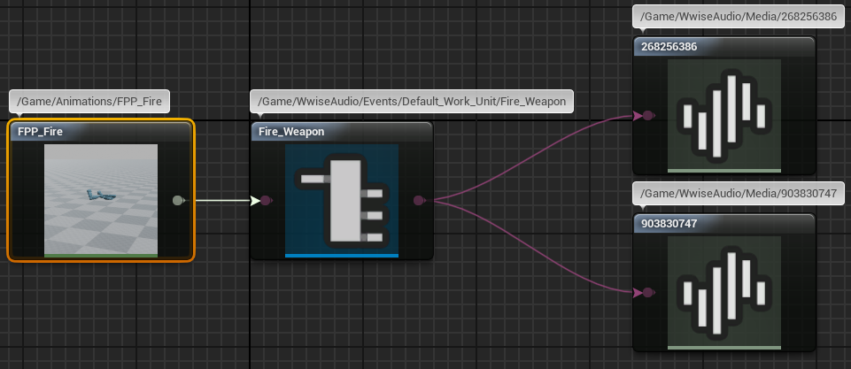

For more information about the Unreal Reference Viewer, refer to [Reference Viewer](https://dev.epicgames.com/documentation/en-us/unreal-engine/reference-viewer-in-unreal-engine).###### AkGameObject

###### FWwiseObjectInfo

###### FWwiseEventInfo

###### FWwiseGroupValueInfo

###### UAkAudioType

###### UAkAudioEvent

###### UAkInitBank

###### UAkAuxBus

###### UAkEffectShareSet

###### UAkGroupValue

###### UAkStateValue

###### UAkSwitchValue

###### UAkRtpc

###### UAkTrigger

###### UAkAcousticTexture

###### UAkAudioDeviceShareSet

###### 弃用的素材和数据类型

##### Wwise Unreal 素材

##### WwiseObjectInfo 结构

##### 为 Wwise 素材烘焙和加载的数据

##### Wwise Unreal 素材类型

##### 在 Unreal 中查看素材之间的关系

##### AkAmbientSound

##### AkReverbVolume

#### Wwise Unreal Actor

|  |
| --- |
| Wwise Unreal Integration Documentation |

Wwise Unreal Actor

### 目录

- [AkAmbientSound](#features_akambientsound)
- [AkReverbVolume](#features_akreverbvolume)

# AkAmbientSound

`AkAmbientSound` 是一个 `AActor` 类，其使用方式与 Unreal Audio 系统配套提供的 `AAmbientSound` 对象相同。您可以通过其自有对象 Blueprint 函数或使用 Start All Ambient Sounds 和 Stop All Ambient Sounds 全局辅助函数来控制其播放行为。同时，`AkAmbientSound` 还包含 [AkComponent](pg_features_objects_components.html#features_akcomponent) （具有自己的属性）。

属性：

- **Stop When Owner Is Destroyed**：在销毁 AkAmbientSound 时自动停止 Event。
- **Auto Post**：在 BeginPlay 时自动发送关联的 [UAkAudioEvent](pg_features_objects_assets.html#features_objects_classes_UAkAudioEvent) 。

Blueprint 函数：

- **Start All Ambient Sounds**：开始播放所有环境声。
- **Start Ambient Sound**：开始播放所选环境声。
- **Stop All Ambient Sounds**：停止播放所有环境声。
- **Stop Ambient Sound**：停止播放所选环境声。

# AkReverbVolume

`AkReverbVolume` 是一个 `AVolume` 类，其使用方式与 Unreal Audio 系统配套提供的 `AReverbVolume` 对象相同。它可以通过 Editor 中的任何 `Brush` 生成。通过 [AkLateReverbComponent](pg_features_objects_components.html#features_aklatereverbcomponent) 来获得混响效果。

#### Wwise Unreal 组件

|  |
| --- |
| Wwise Unreal Integration Documentation |

Wwise Unreal 组件

### 目录

- [AkLateReverbComponent](#features_aklatereverbcomponent)
- [AkComponent](#features_akcomponent)
- [AkAudioInputComponent](#features_akaudioinputcomponent)

# AkLateReverbComponent

You can add this component to any `UPrimitiveComponent` to create a reverb area from that Primitive Component. 若要获得混响效果，可将 Wwise Auxiliary Bus 指派给组件，并把所有进入此 Volume 的 `AkComponent` 发送到关联的 Wwise Auxiliary Bus。若 Volume 之间存在重叠，则使用 `Priority` 属性来决定将目标 `AkComponent` 发送到哪条 Auxiliary Bus。在进入/离开 `AkReverbVolume` 时，会向 Auxiliary Bus 的电平应用即时淡入/淡出效果。若 Actor 上绑定有活跃的 Ak Late Reverb 组件，而且还带有 [AkRoomComponent](pg_features_spatialaudio.html#features_objects_akroomcomponent) ，则将禁用 Late Reverb 组件，并由 [AkRoomComponent](pg_features_spatialaudio.html#features_objects_akroomcomponent) 处理混响，同时使用 Spatial Audio 引擎来渲染效果。

有关混响参数的信息会显示在绑定有 Ak Late Reverb 组件的对象上。您可以在 Wwise Integration Settings 中的 Viewports - Show Reverb Info 下或通过 Unreal Level Editor Viewport 菜单来启用或禁用该文本信息。

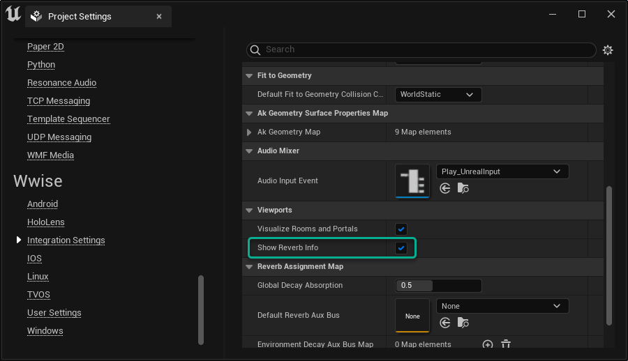

在 Level Editor Viewport 菜单中显示混响信息

属性：

- **Enable Late Reverb**：启用或禁用此组件。
- **Send Level**：与 Wwise Auxiliary Bus 关联的最大发送电平。
- **Fade Rate**：进入/离开当前 Late Reverb 组件时的 Send Level 淡入/淡出速率（单位为百分比每秒）。比如，若值为 0.2，则淡变时间为 5 秒。
- **Priority**：Late Reverb 组件的应用顺序。若 Volume 之间存在重叠，则仅选择优先级最高的 Late Reverb 组件（可在 Unreal Editor Project Settings 的 **Wwise > Integration Settings** 下配置同时可有多少个 Late Reverb 组件）。若两个或多个重叠的 Late Reverb 组件拥有相同的优先级，则无法预测会先应用哪个 Late Reverb 组件。
- **Auto Assign Aux Bus**：依据体积和表面积来估算父级 Primitive 组件产生的混响衰减时间，以此来自动为此 Late Reverb 组件指派 Aux Bus。此衰减值用于通过 Integration Settings 中的 [Automatically Assigning a Reverb Aux Bus](features_editor_reverb_estimation.html#features_editor_reverb_estimation_aux_bus_map) 来选择 Aux Bus。该项默认设为启用状态。
- **Aux Bus**：指派给此 Volume 的 [UAkAuxBus](pg_features_objects_assets.html#features_objects_classes_UAkAuxBus) 。在 Wwise 工程中，此 Aux Bus 会启用游戏定义的辅助发送。若要结合 [AkRoomComponent](pg_features_spatialaudio.html#features_objects_akroomcomponent) 和 [AkPortalComponent](pg_features_spatialaudio.html#features_objects_akportalcomponent) 使用 Late Reverb，则还须针对 Positioning 启用 **Listener Relative Routing** 并指派 3D Spatialization。
- **Environment Decay Estimate**：混响环境的 T60 估值（声压级降低 60 dB 所需的时间），基于与 Late Reverb 绑定的 Primitive 组件。此 T60 值可用于通过 Integration Settings 中的 [Automatically Assigning a Reverb Aux Bus](features_editor_reverb_estimation.html#features_editor_reverb_estimation_aux_bus_map) 来自动指派 Aux Bus，并驱动 "Decay Estimate" RTPC（Integration Settings 中的 [Driving Reverb RTPCs](features_editor_reverb_estimation.html#features_editor_reverb_estimation_rtpcs) ）。
- **HFDamping**：环境产生的高频阻尼估值，基于关联的 [AkGeometryComponent](pg_features_spatialaudio.html#features_objects_akgeometrycomponent) 或 [AkSurfaceReflectorSetComponent](pg_features_spatialaudio.html#features_objects_aksurfacereflectorset) （如所属 Actor 为 Volume）。要想估算 HFDamping，必须通过 AssociateAkTextureSetComponent 函数将 Geometry 组件与此 Reverb 组件关联。若该 Late Reverb 组件包含同级 Geometry 组件或 Surface Reflector Set 组件，则会自动与之进行关联，而无需调用 AssociateAkTextureSetComponent 函数。若使用 AssociateAkTextureSetComponent，则 HFDamping 值只有在播放时才是准确的。若值等于 0.0，则表示所有频率的阻尼相同。若值大于 0.0，则表示高频的阻尼大于低频。若值小于 0.0，则表示低频的阻尼大于高频。此值可用于驱动 "HFDamping" RTPC（Integration Settings 中的 [Driving Reverb RTPCs](features_editor_reverb_estimation.html#features_editor_reverb_estimation_rtpcs) ）。Average absorption values are calculated using each of the textures in the collection, weighted by their corresponding surface area.
- **Time to First Reflection**：一阶反射声到达听者位置预计所需的时间，基于与 Late Reverb 绑定的 Primitive 组件。其估算基于放在父级 Primitive 组件中央的发声体和听者。此值可用于驱动 "Time To First Reflection" RTPC（Integration Settings 中的 [Driving Reverb RTPCs](features_editor_reverb_estimation.html#features_editor_reverb_estimation_rtpcs) ）。

Blueprint 函数：

- **Associate Ak Texture Set Component**：设置组件（[AkGeometryComponent](pg_features_spatialaudio.html#features_objects_akgeometrycomponent) 或 [AkSurfaceReflectorSetComponent](pg_features_spatialaudio.html#features_objects_aksurfacereflectorset) ）以用于估算 HFDamping。比如，在 Blueprint 所含 Static Mesh 组件带有 [AkGeometryComponent](pg_features_spatialaudio.html#features_objects_akgeometrycomponent) 子组件的情况下，可通过在 BeginPlay 时调用该函数来将所述 [AkGeometryComponent](pg_features_spatialaudio.html#features_objects_akgeometrycomponent) 与此 Late Reverb 组件关联。若该 Late Reverb 组件包含同级 [AkGeometryComponent](pg_features_spatialaudio.html#features_objects_akgeometrycomponent) 或 [AkSurfaceReflectorSetComponent](pg_features_spatialaudio.html#features_objects_aksurfacereflectorset) ，则会自动与之进行关联，而无需调用此函数。

|  |  |
| --- | --- |
|  | **注記：**  - Ak Late Reverb 组件必须与组件层级结构中的 `UPrimitiveComponent` 绑定。若 Ak Late Reverb 组件没有 `UPrimitiveComponent` 父对象，则日志中将显示错误，组件也会不起作用。 - 在自定义 Blueprint 类中使用 `AkLateReverbComponent` 时，建议将 Simple Collision 组件用作父对象（如 `BoxCollision` 、`SphereCollision` 或 `CapsuleCollision` 组件）。有关详细信息，请参阅 [Spatial Audio Blueprint 组件](sa_components.html) 章节。 - 只有 Late Reverb 组件包含同级 [AkRoomComponent](pg_features_spatialaudio.html#features_objects_akroomcomponent) （即 [AkRoomComponent](pg_features_spatialaudio.html#features_objects_akroomcomponent) 共用同一 Primitive 父组件），才能结合 Integration Settings 中的 [Driving Reverb RTPCs](features_editor_reverb_estimation.html#features_editor_reverb_estimation_rtpcs) 使用 Environment Decay Estimate、HFDamping 和 Time to First Reflection 值。这些 RTPC 值设在 Room ID 上。 - 在 Level Editor 中设置 Ak Late Reverb 组件时，强烈建议在 Viewport Options 中启用 **Realtime**。若禁用 Realtime，则在调节 Actor 时或在 Wwise 工程中更改 Acoustic Texture 参数时将不会更新 Reverb Parameter Estimation 值。 |

# AkComponent

The `AkComponent` acts as a proxy for a `GameObject`, and registers and unregisters its associated `AkGameObjectID` at the appropriate time.

If you look at the Unreal Integration C++ files, you can see that `UAkComponent` offers many of the same functions that receive an `AkGameObjectID` as `AK::SoundEngine`, and that `UAkGameObject` has a `GetAkGameObjectID()` function that returns a casted `this` pointer.

If you are adding functionality to an `AkAudioDevice`, for example, you can use `GetAkGameObjectID()` to obtain the `AkGameObjectID` that you need for any of the SoundEngine functions.

属性：

- **Attenuation Scaling Factor**：若 Ambient Sound 使用 Wwise 中的衰减，则可使用此属性来修改该环境声的衰减计算结果，以便模拟具有更大或更小传播区域的声音。
- **Use Reverb Volumes**：决定组件是否会受 `AAkReverbVolumes` 影响。
- Obstruction Occlusion
  - **Collision Channel**: The object collision channel to use when doing line of sight traces for obstruction/occlusion calculations. When set to 'Use Integration Settings Default', the value is taken from the DefaultOcclusionCollisionChannel in the Wwise [Integration Settings](using_initialsetup.html#initialsetup_gamesettings).
  - **Refresh Interval**: Set the time interval between obstruction/occlusion checks (direct line of sight between the listener and this game object). Obstruction is used if Spatial Audio Rooms are present in the map. Otherwise, occlusion is used. Set to 0 to disable obstruction/occlusion on this component. The obstruction/occlusion value is directly applied with [AK::SoundEngine::SetObjectObstructionAndOcclusion](https://www.audiokinetic.com/library/edge/?source=SDK&id=namespace_a_k_1_1_sound_engine_a1b3e18a25b405e55ba82de9b70cd11ba.html). When using Spatial Audio, obstruction checks are also done between portals in the same room and this game object. Only use this feature if you plan to obstruct this game object with geometry that is neither [AkSurfaceReflectorSetComponent](pg_features_spatialaudio.html#features_objects_aksurfacereflectorset) nor [AkGeometryComponent](pg_features_spatialaudio.html#features_objects_akgeometrycomponent). If not, we recommend that you disable obstruction/occlusion checks and exclusively use Spatial Audio Geometric Diffraction and Transmission.
- Spatial Audio
  - **Enable Spot Reflectors**：针对此 `AkComponent` 在 [AkSpotReflector](pg_features_spatialaudio.html#features_akspotreflector) 上启用反射。
  - Radial Emitter
    - **Outer Radius**：将字段设为所需外径大小。将把指定的数值直接发送到 Spatial Audio [AK:SpatialAudio::SetGameObjectRadius()](https://www.audiokinetic.com/library/edge/?source=SDK&id=namespace_a_k_1_1_spatial_audio_a8c2e8f50769b6ae29dcbcb636e9c33f2.html) 调用而不进行任何转换。在选中 Actor 时，将围绕该游戏对象所在位置绘制黄色球体框线以直观地反映数值大小。
    - **Inner Radius**：将字段设为所需内径大小。该值须小于或等于外径大小。将把指定的数值直接发送到 Spatial Audio [AK:SpatialAudio::SetGameObjectRadius()](https://www.audiokinetic.com/library/edge/?source=SDK&id=namespace_a_k_1_1_spatial_audio_a8c2e8f50769b6ae29dcbcb636e9c33f2.html) 调用而不进行任何转换。在选中 Actor 时，将围绕该游戏对象所在位置绘制黄色球体框线以直观地反映数值大小。
  - Reflect
    - **Early Reflection Aux Bus**：为当前游戏对象设置早期反射辅助总线。该组件会依据所选辅助总线调用 [AK::SpatialAudio::SetEarlyReflectionsAuxSend()](https://www.audiokinetic.com/library/edge/?source=SDK&id=namespace_a_k_1_1_spatial_audio_af9357c33f3ea4f9551b0e169ded73c15.html)。辅助总线参数将被应用到未在设计工具中指定早期反射辅助总线的游戏对象声音。针对各个声音指定的早期反射辅助总线参数在优先级上高于此处传递的值。
    - **Early Reflection Bus Send Gain**：为当前游戏对象设置早期反射发送音量。该组件会依据所指定的音量值调用 [AK:SpatialAudio::SetEarlyReflectionsVolume()](https://www.audiokinetic.com/library/edge/?source=SDK&id=namespace_a_k_1_1_spatial_audio_a691784b217ba9ccd30e6513dedb924e6.html)。该值将连同设计工具中指定的早期反射音量一并应用到游戏对象播放的所有声音。有效值为 [0, 1]。若设为 0，则针对此游戏对象禁用所有反射处理。
  - **Debug Draw** 选项：使用这些选项来直观地呈现 Spatial Audio 引擎所执行的射线投射以及投射射线所碰到的三角形。在需要调试 Spatial Audio 引擎时，这种直观呈现会很有用。每次仅可针对一个组件执行此操作。
- AkEvent
  - **Ak Audio Event**：在指示开始播放 [AkAmbientSound](pg_features_objects_actors.html#features_akambientsound) 对象时发送的 [UAkAudioEvent](pg_features_objects_assets.html#features_objects_classes_UAkAudioEvent) 。若要使用 Spatial Audio 功能，则 Event 的音效需启用游戏定义的辅助发送。

参见
:   - [AkComponent Blueprint 函数](features_blueprintcomponent.html)
    - [利用 C++ 创建 AkComponent](using_cpp.html#akcomponent_cpp).
    - [Obstruction and Occlusion SDK Documentation](https://www.audiokinetic.com/library/edge/?source=SDK&id=soundengine_obsocc.html)
    - [Radial Emitters SDK Documentation](https://www.audiokinetic.com/library/edge/?source=SDK&id=spatial_audio_radial_emitters.html)
    - [Reflect Wwise Help](https://www.audiokinetic.com/library/edge/?source=Help&id=wwise_reflect_plug_in_effect)

# AkAudioInputComponent

`AkAudioInputComponent` 由 `AkComponent` 派生，代表音频输入实例。

Blueprint 函数：

- **Post Associated Audio Input Event**：开始播放指定的 Event，并注册对应的回调。##### AkLateReverbComponent

##### AkComponent

##### AkAudioInputComponent

#### Wwise Spatial Audio 对象

|  |
| --- |
| Wwise Unreal Integration Documentation |

Wwise Spatial Audio 对象

# AkSpotReflector

您可以使用 Spot Reflector Actor 来在 3D 空间中放置全指向 Spot Reflector（反射点）。Spot Reflector 适合放在半径较大的远距离对象上（如远处的大山）。

您可以使用多个选项来控制 Spot Reflector 行为。

对于启用了 **Enable Spot Reflectors** 的 [AkComponent](pg_features_objects_components.html#features_akcomponent) ，Spot Reflector 会反射其发出的全部声音。

若要确保 Spot Reflector 仅反射来自同一 Spatial Audio Room 的声音，请启用 **Same Room Only**。In this case, an [AkComponent](pg_features_objects_components.html#features_akcomponent) feeds a Spot Reflector if they are both outside Rooms or if they are both in the same Room. 您可以通过绑定有 [AkRoomComponent](pg_features_spatialaudio.html#features_objects_akroomcomponent) 的 Volume 创建 Room。

To override the Room that contains the Spot Reflector, enable **Enable Room Override** and assign a Room to **Room Override**. If you do not set a **Room Override**, the Spot Reflector is virtually placed outside Rooms.

`AkSpotReflector` 会在 BeginPlay 时通过 Spatial Audio API 调用 `AK::SpatialAudio::AddImageSource()` 。

属性：

- **Aux Bus**：带有 `AkReflect` 插件（用于早期反射 DSP）的 [UAkAuxBus](pg_features_objects_assets.html#features_objects_classes_UAkAuxBus) 。此辅助总线会启用游戏定义的辅助发送，同时启用 Listener Relative Routing，但会将 3D Spatialization 设为 **None**。
- **Acoustic Texture**: [UAkAcousticTexture](pg_features_objects_assets.html#features_objects_classes_UAkAcousticTexture) that filters sounds reflected by the image source.
- **Distance Scaling Factor**：镜像声源距离缩放系数。此数值用于根据听者所在位置调节 `sourcePosition` 矢量，进而缩放距离并保持朝向。
- **Level**：针对声源设置的游戏控制的线性电平。

# AkSurfaceReflectorSetComponent

此组件跟 [AkGeometryComponent](pg_features_spatialaudio.html#features_objects_akgeometrycomponent) 一样，但必须绑定到 AVolume Actor 上。在 BeginPlay 时，会将 Volume 启用的所有多边形发送到 Spatial Audio 引擎。

在使用 [AkSurfaceReflectorSetComponent](pg_features_spatialaudio.html#features_objects_aksurfacereflectorset) 时，确保将视口设为 **Realtime** 以正确更新相应的模型。

在 Viewport Options 中启用 Realtime

属性：

- **Enable Surface Reflector Set**：启用此组件。
- **Acoustic Surfaces**：使用这些控件来编辑与 Volume 上一个或多个表面关联的属性。在默认情况下，会将针对这些属性所作的更改应用于所选 Actor 上的所有表面。
  - **Enable Edit Surfaces/Disable Edit Surfaces**: When enabled, the Unreal Editor switches to Brush Editing mode and hides all non-selected actors in the level. 在 Edit Surfaces 模式下，可单独选中 Volume 上的一个或多个表面。这时会将针对 Acoustic Surfaces 属性所作的更改应用于选中的所有表面。各项属性之后括号中的文本会指示当前在编辑多少个表面。 In Brush Editing mode, you can change AkSpatialAudioVolume objects from rectangles into other shapes. For more information on Brush Editing, see [Geometry Brush Actors](https://dev.epicgames.com/documentation/en-us/unreal-engine/geometry-brush-actors-in-unreal-engine).
  - **AkAcousticTexture**: The [UAkAcousticTexture](pg_features_objects_assets.html#features_objects_classes_UAkAcousticTexture) associated with the selected faces. 系统会根据该 Acoustic Texture 所对应的 Edit Color 为这些表面着色，同时在 Game Viewport 中的表面上显示 Acoustic Texture 的名称。对于完全反射的表面，请将该项设为 None，以确保不会额外应用任何 Acoustic Texture 滤波器。
  - **Transmission Loss**：指示有多少声音穿透了表面。有效范围为 0.0 - 1.0。若值为 0.0，则表示声音全部穿透了表面。若值为 1.0，则表示声音被表面完全阻挡。
  - **Enable Surface**：指示是否将所选表面发送到 Spatial Audio 引擎。对于被禁用的表面，不会显示任何 Acoustic Texture 名称或 Transmission Loss 值。
- **Geometry Settings**：
  - **Enable Diffraction**：针对此 Geometry 启用几何衍射。
  - **Enable Diffraction on Boundary Edges**：针对此 Geometry 在边界边缘启用几何衍射。其中，Boundary Edge 代表仅连有一个三角形的边缘。边界边缘可能有用也可能没用（取决于几何构造的具体形状），因此最好减少所要处理的衍射边缘总数。
  - **Bypass Portal Subtraction**: Prevents Portal bounding boxes from being subtracted from this geometry.
  - **Solid**: Applies transmission loss once for each time a transmission path enters and exits its volume, using the max transmission loss between each hit surface. A non-solid geometry instance is one where each surface is infinitely thin, applying transmission loss at each surface. This option has no effect if the Transmission Operation is set to Max.
  - **Associated Room**: (Deprecated) Associate this AkSurfaceReflectorSetComponent with a Room. This property is deprecated and will be removed in a future version. We recommend not using it by leaving it set to **None**. Associating an AkSurfaceReflectorSetComponent with a particular Room limits the scope in which the geometry is accessible. 这样可以缩小反射和衍射计算中执行的射线投射的搜索范围。在设为 None 时，会将该几何构造的范围设为全局。Note if one or more geometry sets are associated with a Room, that Room can no longer access geometry that is in the global scope.

参见
:   - [AkSurfaceReflectorSetComponent Blueprint 函数](features_blueprint_spatialaudio.html#features_blueprint_spatialaudio_surfacereflectorset)
    - [Spatial Audio Geometry SDK 文档](https://www.audiokinetic.com/library/edge/?source=SDK&id=spatial_audio_apigeometry.html)
    - [Reflect 文档](https://www.audiokinetic.com/library/edge/?source=Help&id=wwise_reflect_plug_in_effect)

# AkRoomComponent

您可以将此组件添加到任何 `UPrimitiveComponent` 以将 Spatial Audio Room 注册到 Wwise 声音引擎。Room 有两个作用：

- 实现带有朝向的混响效果。Room 内游戏对象所应用的所有 Auxiliary Bus 朝向均与 Volume 的前向矢量相同。
- 在与 [AkAcousticPortal](pg_features_spatialaudio.html#features_objects_akacousticportal) 或 [AkPortalComponent](pg_features_spatialaudio.html#features_objects_akportalcomponent) 结合使用时，可通过 Portal 将湿声信号从某一 Room 输出到另一 Room。

无论对于哪种情况，都必须针对 Auxiliary Bus 启用 **Listener Relative Routing**，以便在 Positioning 选项卡中指定 3D Spatialization 并指派 Attenuation。

To specify the Auxiliary Bus and other late reverb properties, add a sibling [AkLateReverbComponent](pg_features_objects_components.html#features_aklatereverbcomponent).

属性：

- **Enable Room**：启用此组件。
- **Is Dynamic**: Enables runtime changes to the Portal connections for this Room based on the Room's movement. When the value for this property is set, bWantsOnUpdateTransform is also set to the same value. For worlds that contain many Portals, enabling this property can be computationally expensive. When this option is disabled, the Room's Portal connections might still change if dynamic Portals are moved (that is, Portals with Is Dynamic enabled).
- **Priority**: Determines the order in which the Rooms are applied. If Rooms overlap, the one with the highest priority is selected. If two or more overlapping Rooms have the same priority, it is not possible to predict which Room will be selected.
- **Transmission Loss**: Sets the transmission loss value on the direct sound emitted in the Room when the listener is in another Room. Think of this value as 'thickness', because it relates to how much sound energy is transmitted through the Room's walls. The valid range is 0.0f-1.0f. If the Room has a parent or sibling [AkGeometryComponent](pg_features_spatialaudio.html#features_objects_akgeometrycomponent) or [AkSurfaceReflectorSetComponent](pg_features_spatialaudio.html#features_objects_aksurfacereflectorset), the transmission loss of these component surfaces is used, unless they are set to 0.
- **Ak Event**
  - **Aux Send Level**: Send level for sounds that are posted to the Room. 有效范围：(0.f-1.f)。若值为 0，则禁用辅助发送。
  - **Auto Post**: Automatically post the audio event posted to the Room on BeginPlay.
  - **Ak Audio Event**: The event to post to the Room game oject.
- **Reverb Zone**
  - **Enable Reverb Zone**: Sets this Room as a Reverb Zone. A Reverb Zone models a region that has a distinct reverb effect or ambience but does not require Portals to connect to neighboring Rooms. Use Reverb Zones instead of standard Rooms whenever there are no obvious walls, or generally when there is more negative space than positive space at the interface between the two regions.
  - **Parent Room Actor**: Establishes a parent-child relationship between two Rooms and allows for sound propagation between them as if they were the same Room, without the need for a connecting Portal. 父级 Room 可具有多个 Reverb Zone，但 Reverb Zone 只能有一个父对象。The Reverb Zone and its parent are both Rooms, and as such, must be specified using Enable Room. The automatically created 'outdoors' Room is commonly used as a parent Room for Reverb Zones, because they often model open spaces. When set to None (the default value), the Reverb Zone is automatically attached to the 'outdoors' Room.
  - **Parent Room Name**: The name of the Parent Room of this Reverb Zone. If the Parent Room Actor is None, or if the Parent Room Actor is not valid, the 'outdoors' Room is chosen and printed here.
  - **Transition Region Width**: Width of the transition region between the Reverb Zone and its parent. The transition region acts the same way as Portal depth, but is centered around the Reverb Zone geometry (see [AkPortalComponent](pg_features_spatialaudio.html#features_objects_akportalcomponent) for more details about the Portal depth). It only applies where surface transmission loss is set to 0. 该值必须为正值。负值将被视作 0。

|  |  |
| --- | --- |
|  | **注記：**  - Ak Room 组件必须与组件层级结构中的 `UPrimitiveComponent` 绑定。若 Ak Room 组件没有 `UPrimitiveComponent` 父对象，则日志中将显示错误，组件也会不起作用。 - 在更新 Wwise 时，Ak Room 组件使用其父对象 (`UPrimitiveComponent`) 的位置和边界。所有直接应用于 Ak Room 组件的变换、旋转或缩放都将不起作用。 - In order to avoid repeating expensive computations, dynamic Rooms wait until they have stopped moving for .1 seconds before processing the change in position. This involves updating the Room index and re-evaluating Portal connectivity in Unreal, and sending updated Room parameters to the Spatial Audio engine. Therefore, a continuously moving AkRoomComponent behaves as if it were stationary. - 在自定义 Blueprint 类中使用 `AkRoomComponent` 时，建议将 Simple Collision 组件用作父对象（如 `BoxCollision` 、`SphereCollision` 或 `CapsuleCollision` ）。有关详细信息，请参阅 [Spatial Audio Blueprint 组件](sa_components.html) 章节。 |

参见
:   - [AkRoomComponent Blueprint 函数](features_blueprint_spatialaudio.html#features_blueprint_spatialaudio_room)
    - [Room 和 Portal SDK 文档](https://www.audiokinetic.com/library/edge/?source=SDK&id=using_rooms_and_portals.html)

# FAkOutdoorsRoomParameters

When a game object is not within a [AkRoomComponent](pg_features_spatialaudio.html#features_objects_akroomcomponent), it is assigned to the Outdoors Room, which is automatically created. You do not have to add the Outdoors Room to the scene, but you can customize it with global Blueprint functions. See [Outdoors Room Blueprint Functions](features_blueprint_spatialaudio.html#features_blueprint_spatial_audio_outdoorsroom) for more information.

属性：

- **ReverbAuxBus**: Wwise Auxiliary Bus associated with the Outdoors Room. Default is null.
- **ReverbLevel**: Maximum send level to the Wwise Auxiliary Bus associated with the Outdoors Room. Valid range is 0.0f-1.0f. Default value is 1.
- **TransmissionLoss**: The transmission loss value in Wwise, on emitters in the Outdoors Room, when no audio paths to the listener are found via sound propagation in Wwise Spatial Audio. Valid range 0.0f-1.0f. Default value is 0.
- **AuxSendLevel**: Send level for sounds that are posted in the Outdoors Room. Valid range is 0.f-1.f. 若值为 0，则禁用辅助发送。Default value is 0.

# AkPortalComponent

您可以将此组件添加到任何 `UPrimitiveComponent` 以将 Spatial Audio Portal 注册到 Wwise 声音引擎。此组件允许某个绑定有 [AkRoomComponent](pg_features_spatialaudio.html#features_objects_akroomcomponent) 的 Actor（如 [AkSpatialAudioVolume](pg_features_spatialaudio.html#features_objects_akspatialaudiovolume) ）内所含的声音渗透到其他绑定有 [AkRoomComponent](pg_features_spatialaudio.html#features_objects_akroomcomponent) 的 Actor。在初始化时，会检测这些与 Portal 重叠的 Actor。Both panned and 3D-spatialized sounds can be routed through Portals. Portals have a front and a back Room. They must have at least one Room connected, the front Room must be different than the back Room, and the front and back Rooms cannot have a parent-child relationship (see [AkReverbZone](pg_features_spatialaudio.html#features_objects_akreverbzone) for more information). The depth of a Portal determines the crossfade distance for both reverb sends and spread transition between the front and back Rooms. A deeper Portal (along its local X-axis) results in a longer crossfade distance when an `AkComponent` transitions through the Portal.

If you are using built-in game parameters to drive RTPCs, any obstruction and occlusion values set on the Portal do not affect the RTPC values. This behavior is intentional and occurs because RTPCs only provide one value per game object, but a single game object can have multiple paths through different Portals, each with different obstruction and occlusion values.

You can view Rooms and Portals in the Viewport to adjust their positions, and to visualize Portal-Room connections. 您可以在 Wwise Integration Settings 中的 **Viewports - Visualize Rooms and Portals** 下启用或禁用该设置。另外，还可直接通过 Unreal Level Editor Viewport 菜单来切换该设置。

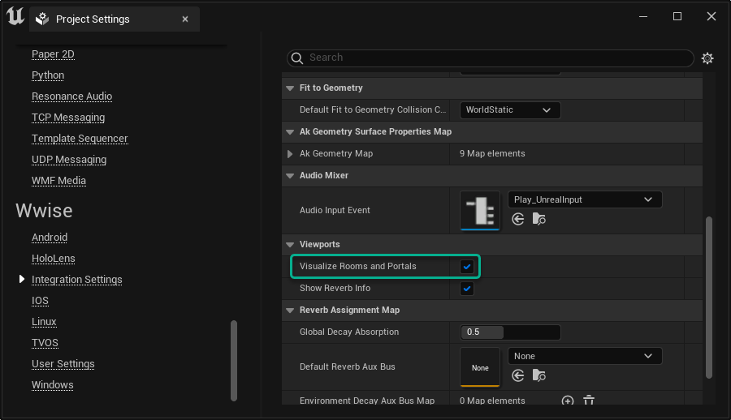

在 Level Editor Viewport 菜单中直观地显示 Room 和 Portal

属性：

- **Is Dynamic**: Enables runtime changes to the Room connections for this Portal based on the Portal's movement. When the value for this property is set, bWantsOnUpdateTransform is also set to its value. For worlds that contain many Rooms, enabling this property can be computationally expensive. When this option is disabled, the Portal's Room connections might still change if dynamic Rooms are moved (that is, Rooms with Is Dynamic enabled).
- **Initial State**: Initially enables or disables the Portal. When the Portal is enabled, emitters positioned in the AkRoomComponent in front of and behind the Portal emit through it.
- **Initial Occlusion**: The initial occlusion value applied to the Portal. When the occlusion value is set to 0, the Portal is not occluded, and when it is set to 1, the Portal is completely occluded. The occlusion value is directly applied to the Portal with [AK::SpatialAudio::SetPortalObstructionAndOcclusion](https://www.audiokinetic.com/library/edge/?source=SDK&id=namespace_a_k_1_1_spatial_audio_aaf04c21b13be01b9f66cd77618423110.html). Portal occlusion can be used to modulate sound in response to a door opening or closing.
- **Obstruction Refresh Interval**: Set the time interval between obstruction checks (direct line of sight between game objects or other Portals and this Portal). 若设为 0，则禁用声障检查。Only use this feature if you plan to obstruct this Portal with geometry that is neither [AkSurfaceReflectorSetComponent](pg_features_spatialaudio.html#features_objects_aksurfacereflectorset) nor [AkGeometryComponent](pg_features_spatialaudio.html#features_objects_akgeometrycomponent). If not, we recommend that you disable obstruction checks and exclusively use Spatial Audio Geometric Diffraction and Transmission.
- **Obstruction Collision Channel**: The object collision channel that creates the collision of the obstruction ray-casts between game objects and this Portal with the desired geometry.

|  |  |
| --- | --- |
|  | **注記：**  - AkPortalComponent 必须与组件层级结构中的 `UPrimitiveComponent` 绑定。若 AkPortalComponent 没有 `UPrimitiveComponent` 父对象，则日志中将显示错误，组件也会不起作用。 - When a Portal is selected, the names of its connected Rooms are displayed on each side. - 在更新 Wwise 时，AkPortalComponent 使用其父对象 (`UPrimitiveComponent`) 的位置和边界。所有直接应用于 AkPortalComponent 的变换、旋转或缩放都将不起作用。 - 若向自定义 Blueprint 类添加了多个 AkPortalComponent，则在 Level Editor 中移动该类的实例时 Unreal Editor 可能会陷入无响应状态。为避免出现这一问题，可按照以下所述在 Class Settings 中禁用 **Run Construction Script on Drag**：   1. 在 Blueprint Editor 中打开自定义 Blueprint 类。   2. 单击 **Class Settings**。   3. 在 Details 面板的 Blueprint Options 下，禁用 **Run Construction Script on Drag**。 |

参见
:   - [AkPortalComponent Blueprint 函数](features_blueprint_spatialaudio.html#features_blueprint_spatialaudio_portal)
    - [Room 和 Portal SDK 文档](https://www.audiokinetic.com/library/edge/?source=SDK&id=using_rooms_and_portals.html)

# AkSpatialAudioVolume

我们在集成包中添加了一个 AkSpatialAudio Volume。它由一个简单的 Volume 构成，并绑定了 [AkSurfaceReflectorSetComponent](pg_features_spatialaudio.html#features_objects_aksurfacereflectorset) 、[AkRoomComponent](pg_features_spatialaudio.html#features_objects_akroomcomponent) 和 [AkLateReverbComponent](pg_features_objects_components.html#features_aklatereverbcomponent) 。

# AkAcousticPortal

该 Actor 可直接在游戏环境中生成，其绑定有 [AkPortalComponent](pg_features_spatialaudio.html#features_objects_akportalcomponent) 。

# AkGeometryComponent

此组件跟 [AkSurfaceReflectorSetComponent](pg_features_spatialaudio.html#features_objects_aksurfacereflectorset) 一样，只不过它不能直接绑定到 Brush 而是必须添加到 StaticMeshComponent。`AkGeometryComponent` 会将其 Mesh 转换为 Spatial Audio Geometry。它可以通过 Static Mesh 和 Simple Collision Mesh 来进行转换。对于 Simple Collision，Sphere Primitive 和 Capsule Primitive 近似于 Bounding Box Mesh。

在调试游戏时，可在 Wwise 设计工具内的 Game Object 3D Viewer 中查看 Spatial Audio Geometry。利用 `AkGeometryComponent` ，可以发送更加复杂的形状。不过，这样可能会阻止 Game Object 3D Viewer 显示几何构造。为了对游戏发送的附加数据进行补偿，请确保在 [Platform Initialization Settings](using_initialsetup.html#initialsetup_inifiles) 中恰当设置 Monitor Queue Pool Size。

无论选择哪种 Mesh Type，都将通过 Mesh 的 Physical Material 得出 Acoustic Texture 和透射损失值。Use the Geometry Surface Properties Table in the [Integration Settings](using_initialsetup.html#initialsetup_gamesettings) to associate Physical Materials with [UAkAcousticTexture](pg_features_objects_assets.html#features_objects_classes_UAkAcousticTexture) and transmission loss values.

- 在选用 Static Mesh 时，将通过 Static Mesh 所用每种 Material 的 Physical Material 得出 Surface Properties。
- 在选用 Simple Collision 时，将通过 Simple Collision Physical Material 得出 Surface Properties。

注意，在 Unreal 中，若未选择任何 Physical Material（设为 None），则使用 DefaultPhysicalMaterial。Associate Geometry Surface Properties to the DefaultPhysicalMaterial for meshes that do not have assigned Physical Materials.

属性：

- Geometry
  - **Mesh Type**：决定是要通过 Static Mesh 还是 Simple Collision Mesh 转换几何构造。
  - **LOD**（细节层次）：若在 **Mesh Type** 列表中选择 **Static Mesh**，则可利用此参数来选择将 LOD 用作 Spatial Audio Geometry。
  - **Welding Threshold**：若在 **Mesh Type** 列表中选择 **Static Mesh**，则可利用此参数来选择按 Unreal 单位计量两个要融为一体的顶点之间的局部距离。只要两个顶点之间的距离小于此阈值，就会将其视为同一顶点并为其指派相同的位置。增大此阈值会减少三角形之间的间隙数量，使得网格更加连续、声音泄漏更少，同时也会删除因太小而无关紧要的三角形。此外，增大此阈值还有利于 Spatial Audio 借助寻边算法找出更多有效的衍射边缘。
  - **Enable Diffraction**：针对此 Geometry 启用几何衍射。
  - **Enable Diffraction on Boundary Edges**：针对此 Geometry 在边界边缘启用几何衍射。
  - **Bypass Portal Subtraction**: Prevents Portal bounding boxes from being subtracted from this geometry.
  - **Solid**: Applies transmission loss once for each time a transmission path enters and exits its volume, using the max transmission loss between each hit surface. A non-solid geometry instance is one where each surface is infinitely thin, applying transmission loss at each surface. This option has no effect if the Transmission Operation is set to Max.
  - Surface Overrides
    - **AkAcousticTexture**: Overrides the [UAkAcousticTexture](pg_features_objects_assets.html#features_objects_classes_UAkAcousticTexture) that is automatically chosen based on the physical material of the mesh. 若在 **Mesh Type** 中选择 **Static Mesh**，则可单独覆盖每种 Material 的 Acoustic Texture。
    - **Override Transmission Loss**: Overrides the transmission loss value.
    - **Transmission Loss**：覆盖要依据 Mesh 的 Physical Material 自动选择的透射值。若在 **Mesh Type** 中选择 **Static Mesh**，则可单独覆盖每种 Material 的透射损失值。有效范围为 0.0 - 1.0。若值为 0.0，则表示声音全部穿透了表面。若值为 1.0，则表示声音被表面完全阻挡。
  - Advanced
    - **Associated Room**: (Deprecated) Associate this AkGeometryComponent with a Room. This property is deprecated and will be removed in a future version. We recommend not using it by leaving it set to **None**. Associating an AkGeometryComponent with a particular Room limits the scope in which the geometry is accessible. 这样可以缩小反射和衍射计算中执行的射线投射的搜索范围。在设为 None 时，会将该几何构造的范围设为全局。Note if one or more geometry sets are associated with a room, that room can no longer access geometry that is in the global scope.

|  |  |
| --- | --- |
|  | **注記：** 在 Unreal 内的 Blueprint Editor 中添加 AkGeometryComponent 时，若将 **Mesh Type** 设为 **Static Mesh**，则不会自动填充 Acoustic Texture 数组。因为 Blueprint Editor 中的 Component Details 面板只会显示模板组件实例的详细信息，而这些实例跟 Blueprint 中的其他组件并无关联。 |

参见
:   - [Unreal Spatial Audio 教程](spatialaudio.html)
    - [AkGeometry Blueprint 函数](features_blueprint_spatialaudio.html#features_blueprint_spatialaudio_geometry)
    - [Spatial Audio Geometry SDK 文档](https://www.audiokinetic.com/library/edge/?source=SDK&id=spatial_audio_apigeometry.html)
    - [Reflect 文档](https://www.audiokinetic.com/library/edge/?source=Help&id=wwise_reflect_plug_in_effect)

# AkReverbZone

A Reverb Zone is useful in situations where two or more acoustic environments are not easily modeled as closed Rooms connected by Portals. Possible uses for Reverb Zones include: a covered area with no walls, a forested area within an outdoor space, or any situation where multiple reverb effects are desired within a common space. Reverb Zones have many advantages compared to standard Game-Defined Auxiliary Sends (that is compared to the [AkLateReverbComponent](pg_features_objects_components.html#features_aklatereverbcomponent) or the [AkReverbVolume](pg_features_objects_actors.html#features_akreverbvolume)). They are part of the wet path, and form reverb chains with other Rooms; they are spatialized according to their 3D extent; they are also subject to other acoustic phenomena simulated in Wwise Spatial Audio, such as diffraction and transmission.

The AkReverbZone Actor is the same as an [AkSpatialAudioVolume](pg_features_spatialaudio.html#features_objects_akspatialaudiovolume) Actor, but with different default values optimized for Reverb Zones.

- The [AkRoomComponent](pg_features_spatialaudio.html#features_objects_akroomcomponent) has **Enable Reverb Zone** set to True and its **Transmission Loss** value set to 0.
- The [AkSurfaceReflectorSetComponent](pg_features_spatialaudio.html#features_objects_aksurfacereflectorset) component is disabled. This allows sound to pass through all of the volume's surfaces and for the transition region to be applied to all of them.

The Room's transmission loss value can be set to something other than 0. In this case, it is applied to all sounds emitted by the Room itself (for example, Room tones or ambience) and to the wet path (the chain of Room Auxiliary Busses) of sounds crossing the Room boundary.

Another kind of transmission loss is the geometric transmission loss that can be set on the Room's surfaces. The geometric transmission loss value is applied to the direct path of sounds crossing these surfaces, in other words the transmission path. When the [AkSurfaceReflectorSetComponent](pg_features_spatialaudio.html#features_objects_aksurfacereflectorset) component is disabled, the geometry is sent to Spatial Audio to define the shape of the room, but is not used for reflection and diffraction. Defining a room shape with geometry makes it possible to enable only certain surfaces, in which case, their transmission loss values are set to 1. It is possible to enable the [AkSurfaceReflectorSetComponent](pg_features_spatialaudio.html#features_objects_aksurfacereflectorset) to set surfaces with different acoustic textures and transmission loss values. Surfaces with a transmission loss value between 0 and 1, or, in other words, semi-transparent surfaces, do not let diffraction and reflection paths pass through. Only direct transmission paths pass through such surfaces. The final effective geometric transmission loss value is the maximum transmission loss value of all the different surfaces a sound path passes through.

参见
:   - [AkRoomComponent](pg_features_spatialaudio.html#features_objects_akroomcomponent)
    - [AkPortalComponent](pg_features_spatialaudio.html#features_objects_akportalcomponent)
    - [AkRoomComponent Blueprint 函数](features_blueprint_spatialaudio.html#features_blueprint_spatialaudio_room)##### AkSpotReflector

##### AkSurfaceReflectorSetComponent

##### AkRoomComponent

##### FAkOutdoorsRoomParameters

##### AkPortalComponent

##### AkSpatialAudioVolume

##### AkAcousticPortal

##### AkGeometryComponent

##### AkReverbZone

###### FWwiseTreeItem

##### Slate 小组件

#### WAAPI 小组件

|  |
| --- |
| Wwise Unreal Integration Documentation |

WAAPI 小组件

# Slate 小组件

## FWwiseTreeItem

该结构包含用来表示 Wwise 条目的所有属性。

属性：

- **DisplayName**：条目的名称。
- **FolderPath**：Wwise 中树条目的路径（包括名称）。
- **ItemType**：条目的类型。
- **ItemId**：条目的 ID。

##### Post and Wait for End of Event

##### Post and Wait for End Of Event Async

##### Post Event

##### Post Event Async

##### Execute Action on Event

##### Post Trigger

##### Set Attenuation Scaling Factor

##### Set Obstruction Occlusion Refresh Interval

##### Set Switch

##### Set Output Bus Volume

##### Stop Actor

##### Use Reverb Volumes

#### Add Output

#### Cancel Event Callback

#### Get Ak Audio Type User Data

#### (Deprecated) Get Ak Component

#### Get or Create Ak Component (replaces Get Ak Component)

#### Get Ak Media Asset User Data

#### Get RTPC Value

#### Get Speaker Angles

#### Is Editor

#### Is Game

#### Post Event At Location

#### Post Event At Location Async

#### Remove Output

#### 重置 RTPC 值

#### Set Bus Config

#### Set Multiple Channel Emitter Positions

#### Set Multiple Positions

#### Set Multiple Speaker Emitter Positions

#### Set Panning Rule

#### Set RTPC Value

#### Set Speaker Angles

#### Set State

#### Spawn Ak Component at Location

#### Stop All

#### Set Current Audio Culture

#### Set Current Audio Culture Async

#### 其他 Blueprint 函数

#### Actor Blueprint 函数

|  |
| --- |
| Wwise Unreal Integration Documentation |

Actor Blueprint 函数

这些 Blueprint 函数指向 Actor 的根组件。若 Actor 的根组件没有绑定 [AkComponent](pg_features_objects_components.html#features_akcomponent) ，则将创建一个。

# Post and Wait for End of Event

该 Blueprint 隐藏节点会发送该 Actor 的根组件绑定和控制的 Wwise Event，并在 Event 结束后继续执行流程图的后续节点。

# Post and Wait for End Of Event Async

该 Blueprint 隐藏节点会发送该 Actor 的根组件绑定和控制的 Wwise Event，并在 Event 结束后继续执行流程图的后续节点。异步版本会等到加载媒体之后再发送 Event。

# Post Event

发送给定 Actor 的根组件绑定和控制的 Wwise Event。

# Post Event Async

发送给定 Actor 的根组件绑定和控制的 Wwise Event。异步版本会等到加载媒体之后再发送 Event。

# Execute Action on Event

针对给定 Actor 的根组件绑定和控制的 Event 执行 Action。您可以指定淡变时间和插值曲线类型。另外，还可使用播放 ID（Post Event 蓝图返回的值）来针对特定实例执行 Action。

# Post Trigger

将 Trigger 发送给 Wwise，并指向给定 Actor 的根组件。

# Set Attenuation Scaling Factor

设置衰减比例系数，以便针对游戏对象修改衰减计算结果，从而模拟具有更大或更小传播区域的声音。

# Set Obstruction Occlusion Refresh Interval

Sets the time interval at which the [AkComponent](pg_features_objects_components.html#features_akcomponent) attached to the root component performs obstruction/occlusion calculations. Set to 0 to turn off obstruction/occlusion on the component.

# Set Switch

针对给定 Switch Group 设置活跃 Switch，并指向给定 Actor 的根组件。

# Set Output Bus Volume

设置给定游戏对象的直达声输出总线音量。Bus Volume 的取值范围为 0.0f ~ 1.0f。

# Stop Actor

针对给定 Actor 停止播放所有声音。

# Use Reverb Volumes

设置根组件绑定的 [AkComponent](pg_features_objects_components.html#features_akcomponent) 是否受 [AkReverbVolume](pg_features_objects_actors.html#features_akreverbvolume) 影响。

#### Spatial Audio 对象 Blueprint 函数

|  |
| --- |
| Wwise Unreal Integration Documentation |

Spatial Audio 对象 Blueprint 函数

# AkGeometry Blueprint 函数

- **ConvertMesh**：将父级 Mesh 转换为 Spatial Audio Geometry 可用的 `FAkGeometryData` 结构。在将 Mesh Type 设为 Static Mesh 时，使用父级 Mesh 的索引和顶点。在将 Mesh Type 设为 Simple Collision 时，把父对象的 BodySetup 转换为 `FAkGeometryData` 。若 Simple Collision 由 Box Primitive、Sphere Primitive 或 Capsule Primitive 构成，则使用各个 Primitive 的 Bounding Box。若 Simple Collision 包含 Convex Hull Primitive，则使用 Simple Collision 的索引和顶点。
- **RemoveGeometry**：通过调用 [AK:SpatialAudio::RemoveGeometry()](https://www.audiokinetic.com/library/edge/?source=SDK&id=namespace_a_k_1_1_spatial_audio_ae450803c582e5e6e2f8906cfdd384a25.html) 来移除 Spatial Audio 中的几何构造。
- **UpdateGeometry**：将 `FAkGeometryData` 组件发送到 Spatial Audio。

# AkLateReverbComponent Blueprint 函数

- **AssociateAkTextureSetComponent**：设置组件以用于估算 HFDamping。比如，在 Blueprint 所含 Static Mesh 组件带有 AkGeometry 子组件的情况下，可通过在 BeginPlay 时调用该函数来将所述 AkGeometry 组件与此 Late Reverb 组件关联。若该 Late Reverb 组件包含同级 Geometry 组件或 Surface Reflector Set 组件，则会自动与之进行关联，而无需调用此函数。

# AkRoomComponent Blueprint 函数

-**SetAttenuationScalingFactor**: Sets the attenuation scaling factor, which modifies the attenuation computations on the game object to simulate sounds with a larger or smaller area of effect.

- **GetPrimitiveParent**：返回与此 Ak Room 组件绑定的 `UPrimitiveComponent` 。
- **SetReverbZone**: Establishes a parent-child relationship between this [AkRoomComponent](pg_features_spatialaudio.html#features_objects_akroomcomponent) and a parent [AkRoomComponent](pg_features_spatialaudio.html#features_objects_akroomcomponent) and allows for sound propagation between them as if they were the same Room, without the need for a connecting [AkPortalComponent](pg_features_spatialaudio.html#features_objects_akportalcomponent). Setting a Room as a Reverb Zone is useful in situations where two or more acoustic environments are not easily modeled as closed Rooms connected by Portals. Possible uses for Reverb Zones include: a covered area with no walls, a forested area within an outdoor space, or any situation where multiple reverb effects are desired within a common space. Reverb Zones have many advantages compared to standard Game-Defined Auxiliary Sends (that is compared to the [AkLateReverbComponent](pg_features_objects_components.html#features_aklatereverbcomponent) or the [AkReverbVolume](pg_features_objects_actors.html#features_akreverbvolume)). They are part of the wet path, and form reverb chains with other Rooms; they are spatialized according to their 3D extent; they are also subject to other acoustic phenomena simulated in Wwise Spatial Audio, such as diffraction and transmission. 父级 Room 可具有多个 Reverb Zone，但 Reverb Zone 只能有一个父对象。If a Room is already assigned to a parent Room, it is first removed from the old parent (exactly as if RemoveReverbZone were called), and is then assigned to the new parent Room. A Reverb Zone can be the parent of another Reverb Zone. A Room cannot be its own parent. The automatically created 'Outdoors' Room is commonly used as a parent Room for Reverb Zones, because they often model open spaces. A Reverb Zone needs to be a Room component with an associated geometry. This function also sets a transition region between the Reverb Zone and its parent. The transition region acts the same way as Portal depth, but is centered around the Reverb Zone geometry (see [AkPortalComponent](pg_features_spatialaudio.html#features_objects_akportalcomponent) for more details about the Portal depth). Transition regions are only added on surfaces where transmission loss is set to 0.
- **RemoveReverbZone**: Removes this Reverb Zone from its parent. Sound can no longer propagate between the two Rooms, unless they are explicitly connected with a Portal.
- **SetGeometryComponent**: Sets the geometry component to use to send the geometry of the room to Wwise. For example, in a Blueprint that has a static mesh component with an AkGeometry child component, this function can be called in BeginPlay to associate that AkGeometry component with this room component. If this room component has a sibling geometry component (or surface reflector set component), they are automatically associated and there is no need to call this function.

# AkPortalComponent Blueprint 函数

您可以针对 [AkPortalComponent](pg_features_spatialaudio.html#features_objects_akportalcomponent) 对象执行多个 Wwise 函数。在 Ak Portal Component 类别中可以找到这些函数。

- **EnablePortal**: Enables the portal. Emitters positioned in the [AkRoomComponent](pg_features_spatialaudio.html#features_objects_akroomcomponent) in front of and behind the portal emit through it.
- **DisablePortal**: Disables the portal. Emitters positioned in the AkRoomComponent in front of and behind the portal do not emit through it.
- **GetCurrentState**: Returns an `AkAcousticPortalState`, which represents the current state of the portal (Enabled or Disabled).
- **GetPortalOcclusion**: Returns a floating point number between 0 and 1 that represents the occlusion value applied to the portal. A value of 0 indicates that the portal is not occluded and a value of 1 indicates that it is completely occluded.
- **SetPortalOcclusion**: Sets a new portal occlusion value. A value of 0 indicates that the portal is not occluded and a value of 1 indicates that it is completely occluded. The occlusion value is applied to the portal with [AK::SpatialAudio::SetPortalObstructionAndOcclusion](https://www.audiokinetic.com/library/edge/?source=SDK&id=namespace_a_k_1_1_spatial_audio_aaf04c21b13be01b9f66cd77618423110.html). Portal occlusion can be used to modulate sound in response to a door opening or closing.
- **GetPrimitiveParent**：返回与此 Ak Portal 组件绑定的 `UPrimitiveComponent` 。
- **PortalPlacementValid**：若 Portal 位置和朝向有效，则返回 true。Portals have a front and a back Room. They must have at least one connected Room, the front Room must be different than the back Room, and the Rooms cannot be a Reverb Zone and its parent. 有关详细信息，请参阅 [AkPortalComponent](pg_features_spatialaudio.html#features_objects_akportalcomponent) 和 [AkRoomComponent](pg_features_spatialaudio.html#features_objects_akroomcomponent) 章节。

# AkSurfaceReflectorSetComponent Blueprint 函数

- **SendSurfaceReflectorSet**：通过调用 [AK:SpatialAudio::SetGeometry()](https://www.audiokinetic.com/library/edge/?source=SDK&id=namespace_a_k_1_1_spatial_audio_a0cada36fab682ebb3005a79dd05a5640.html) 来将 Brush 的索引和顶点转换为 Spatial Audio Geometry 数据并发送到 Spatial Audio。
- **RemoveSurfaceReflectorSet**：通过调用 [AK:SpatialAudio::RemoveGeometry()](https://www.audiokinetic.com/library/edge/?source=SDK&id=namespace_a_k_1_1_spatial_audio_ae450803c582e5e6e2f8906cfdd384a25.html) 来移除 Spatial Audio 中的几何构造。
- **UpdateSurfaceReflectorSet**：通过调用 `SendSurfaceReflectorSet` 来将新的 Brush 转换结果发送到 Spatial Audio。

# Outdoors Room Blueprint Functions

When using the Spatial Audio Rooms and Portal feature, a default Room is automatically created to place game objects that are currently not in a Room. This Room is typically used for outdoors and is therefore nicknamed the Outdoors Room.

Because the Outdoors Room is automatically created, you do not have to add it to a scene, but you can customize it with the following global Blueprint functions:

- **GetCurrentOutdoorsRoomParameters**: Returns a [FAkOutdoorsRoomParameters](pg_features_spatialaudio.html#features_objects_akoutdoorsroomparameters) structure containing the current Outdoors Room parameters.
- **SetOutdoorsRoomParameters**: Sets the parameters of the Outdoors Room by sending a [FAkOutdoorsRoomParameters](pg_features_spatialaudio.html#features_objects_akoutdoorsroomparameters) structure as a parameter.
- **ResetOutdoorsRoomParams**: Resets the Outdoors Room parameters to their default values. See the [FAkOutdoorsRoomParameters](pg_features_spatialaudio.html#features_objects_akoutdoorsroomparameters) properties for more information.
- **PostEventOutdoors**: Posts an Event on the Outdoors Room.
- **StopOutdoors**: Stops all sounds for the Outdoors Room.

参见
:   - [Wwise Spatial Audio 对象](pg_features_spatialaudio.html)
    - [Unreal Spatial Audio 教程](spatialaudio.html)##### AkGeometry Blueprint 函数

##### AkLateReverbComponent Blueprint 函数

##### AkRoomComponent Blueprint 函数

##### AkPortalComponent Blueprint 函数

##### AkSurfaceReflectorSetComponent Blueprint 函数

##### Outdoors Room Blueprint Functions

##### Start All Ambient Sounds

##### Start Ambient Sound

##### Stop All Ambient Sounds

##### Stop Ambient Sound

##### Get Attenuation Radius

##### Post Ak Event

##### Post Ak Event Async

##### Post Ak Event and Wait for End

##### Post Ak Event and Wait for End Async

##### Post Associated Ak Event

##### Post Associated Ak Event Async

##### Post Associated Ak Event and Wait for End

##### Post Associated Ak Event and Wait for End Async

##### Post Trigger

##### Set Listeners

##### Get Collision Channel

##### Set Output Bus Volume

##### Get RTPC Value

##### Set RTPC Value

##### Set Stop when Owner Destroyed

##### Set Switch

##### Stop

##### Use Reverb Volumes

##### Set GameObject Radius

##### Post Associated Audio Input Event

##### Clear Banks

##### Init Bank 函数

##### 已移除和已弃用的函数

##### Start Output Capture

##### Add Output Capture Marker

##### Stop Output Capture

##### Start Profiler Capture

##### Stop Profiler Capture

#### AkAmbientSound Blueprint 函数

|  |
| --- |
| Wwise Unreal Integration Documentation |

AkAmbientSound Blueprint 函数

您可以针对 [AkAmbientSound](pg_features_objects_actors.html#features_akambientsound) Actor 执行多个 Wwise 函数。在 Ambient Sound 类别中可以找到这些函数。

# Start All Ambient Sounds

开始播放地图中存在的所有 [AkAmbientSound](pg_features_objects_actors.html#features_akambientsound) 。

# Start Ambient Sound

开始播放 [AkAmbientSound](pg_features_objects_actors.html#features_akambientsound) 。

# Stop All Ambient Sounds

停止播放地图中存在的所有 [AkAmbientSound](pg_features_objects_actors.html#features_akambientsound) 。

# Stop Ambient Sound

停止播放 [AkAmbientSound](pg_features_objects_actors.html#features_akambientsound) 。

#### AkComponent Blueprint 函数

|  |
| --- |
| Wwise Unreal Integration Documentation |

AkComponent Blueprint 函数

您可以针对 [AkComponent](pg_features_objects_components.html#features_akcomponent) 场景组件执行多个 Wwise 函数。在 Ak Component 类别中可以找到这些函数。

# Get Attenuation Radius

返回此 [AkComponent](pg_features_objects_components.html#features_akcomponent) 的有效衰减半径 (ScalingFactor \* MaxAttenuation)。

# Post Ak Event

发送 Wwise 中指定的 [UAkAudioEvent](pg_features_objects_assets.html#features_objects_classes_UAkAudioEvent) 。

# Post Ak Event Async

发送 Wwise 中指定的 [UAkAudioEvent](pg_features_objects_assets.html#features_objects_classes_UAkAudioEvent) 。异步版本会等到加载媒体之后再发送 Event。

# Post Ak Event and Wait for End

该 Blueprint 隐藏节点会发送 Wwise 中指定的 [UAkAudioEvent](pg_features_objects_assets.html#features_objects_classes_UAkAudioEvent) ，并在 Event 结束后继续执行流程图的后续节点。

# Post Ak Event and Wait for End Async

该 Blueprint 隐藏节点会发送 Wwise 中指定的 [UAkAudioEvent](pg_features_objects_assets.html#features_objects_classes_UAkAudioEvent) ，并在 Event 结束后继续执行流程图的后续节点。异步版本会等到加载媒体之后再发送 Event。

# Post Associated Ak Event

发送 Wwise 中此 [AkComponent](pg_features_objects_components.html#features_akcomponent) 的内部 [UAkAudioEvent](pg_features_objects_assets.html#features_objects_classes_UAkAudioEvent) 。

# Post Associated Ak Event Async

发送 Wwise 中此 [AkComponent](pg_features_objects_components.html#features_akcomponent) 的内部 [UAkAudioEvent](pg_features_objects_assets.html#features_objects_classes_UAkAudioEvent) 。异步版本会等到加载媒体之后再发送 Event。

# Post Associated Ak Event and Wait for End

该 Blueprint 隐藏节点会发送 Wwise 中此 [AkComponent](pg_features_objects_components.html#features_akcomponent) 的内部 [UAkAudioEvent](pg_features_objects_assets.html#features_objects_classes_UAkAudioEvent) ，并在 Event 结束后继续执行流程图的后续节点。

# Post Associated Ak Event and Wait for End Async

该 Blueprint 隐藏节点会发送 Wwise 中此 [AkComponent](pg_features_objects_components.html#features_akcomponent) 的内部 [UAkAudioEvent](pg_features_objects_assets.html#features_objects_classes_UAkAudioEvent) ，并在 Event 结束后继续执行流程图的后续节点。异步版本会等到加载媒体之后再发送 Event。

# Post Trigger

针对关联 [AkComponent](pg_features_objects_components.html#features_akcomponent) 发送 Trigger。

# Set Listeners

针对 [AkComponent](pg_features_objects_components.html#features_akcomponent) 设置听者。

# Get Collision Channel

Gets the collision channel used when doing line of sight traces for obstruction/occlusion calculations.

# Set Output Bus Volume

设置给定游戏对象的直达声输出总线音量。Bus Volume 的取值范围为 0.0f ~ 1.0f。

# Get RTPC Value

针对关联 [AkComponent](pg_features_objects_components.html#features_akcomponent) 获取 Game Parameter 值。

# Set RTPC Value

针对关联 [AkComponent](pg_features_objects_components.html#features_akcomponent) 设置 Game Parameter 值。

# Set Stop when Owner Destroyed

针对相应 [AkComponent](pg_features_objects_components.html#features_akcomponent) 设置 StopWhenOwnerDestroyed 值。

# Set Switch

针对关联 [AkComponent](pg_features_objects_components.html#features_akcomponent) 将 Switch Group 设为给定 Switch。

# Stop

停止播放与 [AkComponent](pg_features_objects_components.html#features_akcomponent) 关联的 [UAkAudioEvent](pg_features_objects_assets.html#features_objects_classes_UAkAudioEvent) 。

# Use Reverb Volumes

设置 [AkComponent](pg_features_objects_components.html#features_akcomponent) 是否受 [AkReverbVolume](pg_features_objects_actors.html#features_akreverbvolume) 影响。

# Set GameObject Radius

通过调用 [AK:SpatialAudio::SetGameObjectRadius()](https://www.audiokinetic.com/library/edge/?source=SDK&id=namespace_a_k_1_1_spatial_audio_a8c2e8f50769b6ae29dcbcb636e9c33f2.html) 来设置游戏对象的内外半径并将其发送到 Spatial Audio。

#### AkAudioInputComponent Blueprint 函数

|  |
| --- |
| Wwise Unreal Integration Documentation |

AkAudioInputComponent Blueprint 函数

您可以针对 [AkAudioInputComponent](pg_features_objects_components.html#features_akaudioinputcomponent) 场景组件执行多个 Wwise 函数。在 Ak Audio Input Component 类别中可以找到这些函数。

# Post Associated Audio Input Event

发送 Wwise 中此 [AkAudioInputComponent](pg_features_objects_components.html#features_akaudioinputcomponent) 的内部 [UAkAudioEvent](pg_features_objects_assets.html#features_objects_classes_UAkAudioEvent) ，并注册相应的回调。

#### SoundBank Blueprint 函数

|  |
| --- |
| Wwise Unreal Integration Documentation |

SoundBank Blueprint 函数

2022.1 中弃用了大部分 SoundBank 处理函数。有关详细信息，请参阅 [将工程升级到 Wwise 2022.1](pg_important_migration_notes_2022_1_0.html) 章节。

# Clear Banks

针对加载的所有 Wwise 素材卸载 Wwise 资源（Bank 和媒体）。

# Init Bank 函数

您可以使用以下函数来管理 Init Bank：

- **Load Init Bank**
- **Unload Init Bank**

# 已移除和已弃用的函数

自 2022.1 起，不再提供以下 Blueprint 函数。若要针对 Wwise 素材手动加载和卸载 Bank 和媒体资源，请使用 [Wwise Unreal 素材](pg_features_objects_assets.html) 中所述的 **LoadData** 和 **UnloadData** Blueprint 函数。

- **Load Bank**
- **Load Bank Async**
- **Unload Bank**
- **Unload Bank Async**

#### Debug Blueprint 函数

|  |
| --- |
| Wwise Unreal Integration Documentation |

Debug Blueprint 函数

这些 Blueprint 函数用于帮助调试游戏。

# Start Output Capture

开始 Wwise 音频输出捕获。输出文件跟 SoundBank 在同一文件夹内。

# Add Output Capture Marker

在音频输出捕获文件中添加文本标记。

# Stop Output Capture

停止 Wwise 音频输出捕获。输出文件跟 SoundBank 在同一文件夹内。

# Start Profiler Capture

开始 Wwise Profiler 捕获。输出文件跟 SoundBank 在同一文件夹内。

# Stop Profiler Capture

停止 Wwise Profiler 捕获。输出文件跟 SoundBank 在同一文件夹内。

#### 在 Blueprint 中使用回调

###### 使用 Event 回调

###### 订阅多种回调类型

###### 使用 MIDI 回调

##### Event 回调

|  |
| --- |
| Wwise Unreal Integration Documentation |

在 Blueprint 中使用回调

Blueprint 中暴露了 Event 回调。它们通过自定义 Event 实现。

# Event 回调

C++ 声音引擎 API 中暴露的大多数回调也会暴露给 Blueprint。如需详细了解各种回调类型的作用，请参阅 [SDK 文档](https://www.audiokinetic.com/library/edge/?source=SDK&id=_ak_callback_8h_a948c083ff18dc4c8dfe1d32cb0eb6732.html)。

|  |  |
| --- | --- |
|  | **注記：** 因为 Blueprint 流程图需要在游戏线程上执行，所以对于要求修改 `AkCallbackInfo` 结构（如 `AK_SpeakerVolumeMatrix` ）的回调，无法将其暴露给 Blueprint。请使用 C++ 代码来实现。 |

## 使用 Event 回调

在订阅 Event 回调之前，需要先在 `Callback Mask` 输入引脚下拉菜单中予以选择。然后，便可通过自定义 Blueprint Event，在回调函数中实现所要执行的 Blueprint 流程图。

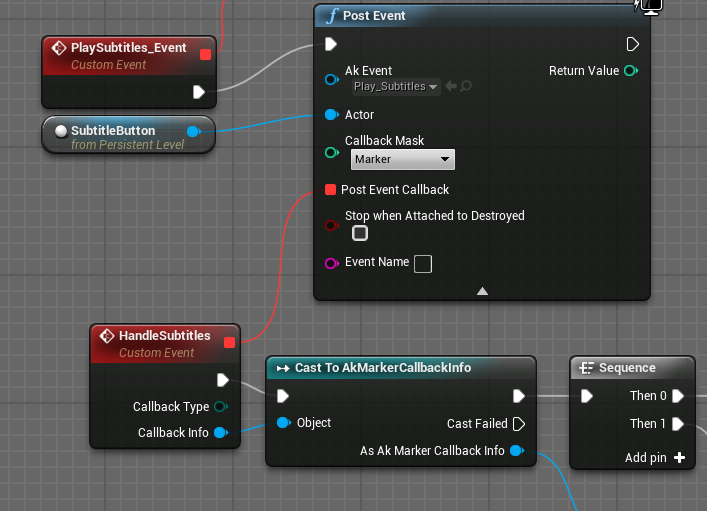

## 订阅多种回调类型

若要订阅多种回调类型，请在 `Callback Mask` 输入引脚下拉菜单中选择多个值。

接着，在 Custom Event 流程图中，便可针对 `Callback Type` 变量使用 Switch，来确定当前回调类型。然后，将 `Callback Info` 类转换为合适的类型。

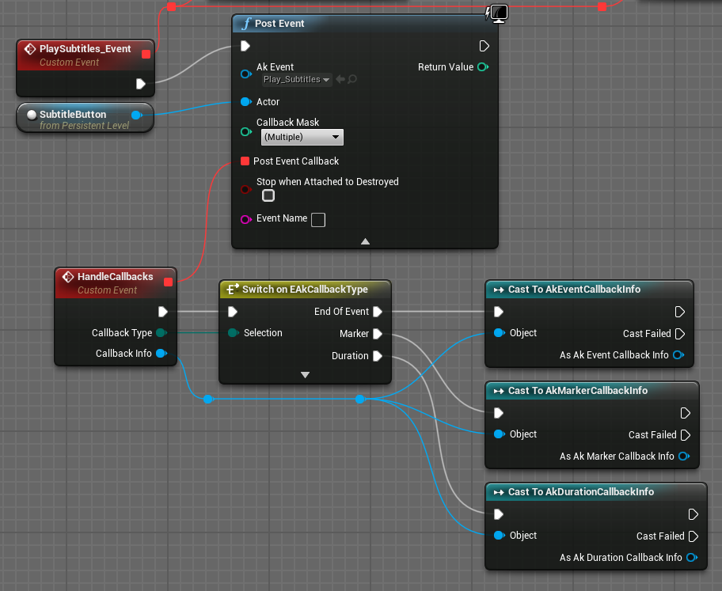

## 使用 MIDI 回调

MIDI Event 回调信息类会依据当前 MIDI Event 类型转译成不同的内容。为了简化 MIDI 回调信息的解析，提供了 Blueprint 宏 `SwitchOnMidiType` 。它会自动解析回调信息对象，并触发正确的执行引脚：

|  |  |
| --- | --- |
|  | **注記：** MIDI Callback Info 类的 `Chan` 成员指向 MIDI 声道。取值范围为 1 ~ 16。 |

### 使用 Wwise Unreal 对象

|  |
| --- |
| Wwise Unreal Integration Documentation |

使用 Wwise Unreal 对象

Wwise Unreal 集成提供各种可在 Unreal Editor 中使用的对象。有关不同对象的详细信息，请参阅以下主题：

[Wwise Unreal 素材](pg_features_objects_assets.html)   
[Wwise Unreal Actor](pg_features_objects_actors.html)   
[Wwise Unreal 组件](pg_features_objects_components.html)   
[Wwise Spatial Audio 对象](pg_features_spatialaudio.html)   
[WAAPI 小组件](pg_features_objects__w_a_a_p_i.html)

### Blueprint 函数

|  |
| --- |
| Wwise Unreal Integration Documentation |

Blueprint 函数

一些 Wwise 的全局函数是对脚本开放的，其中大部分会对参数进行换算并将其传给对应的 Wwise API。Audiokinetic 类别中提供以下函数。

# Add Output

Adds an output to the sound engine. Use this to add controller-attached headphones, controller speakers, motion devices, and so on. For more information, refer to [AddOutput](https://www.audiokinetic.com/library/edge/?source=SDK&id=namespace_a_k_1_1_sound_engine_a15ab79f954a307902f529d8ccde8ad48.html).

# Cancel Event Callback

取消提供给 `PostEvent` 的回调事件。在执行此节点后，将不再调用 Blueprint Event。

# Get Ak Audio Type User Data

从给定素材返回指定类型的用户数据。

# (Deprecated) Get Ak Component

获取给定组件绑定和控制的 [AkComponent](pg_features_objects_components.html#features_akcomponent) 。如需详细了解 `AkComponent` 上可用的方法，请参阅 [AkComponent Blueprint 函数](features_blueprintcomponent.html) 章节。

# Get or Create Ak Component (replaces Get Ak Component)

获取给定组件绑定和控制的 [AkComponent](pg_features_objects_components.html#features_akcomponent) 。如需详细了解 `AkComponent` 上可用的方法，请参阅 [AkComponent Blueprint 函数](features_blueprintcomponent.html) 章节。

# Get Ak Media Asset User Data

从给定媒体素材返回指定类型的用户数据。

# Get RTPC Value

获取 Game Parameter 的值，可以选择指向给定 Actor 的根组件。

# Get Speaker Angles

获取指定设备的扬声器角度。有关详细信息，请参阅 [GetSpeakerAngles](https://www.audiokinetic.com/library/edge/?source=SDK&id=namespace_a_k_1_1_sound_engine_a02ad46cabd64c04e8be198bfdc44be6b.html)。

# Is Editor

若正在运行的应用程序为 Editor，则返回 true，否则返回 false。

# Is Game

若可从 WorldContextObject 参数获取 World 且其 WorldType 为 Game、GamePreview 或 Play-In-Editor，则返回 true，否则返回 false。

# Post Event At Location

在指定位置发送 Wwise Event。这是一个针对没有对应 [AkComponent](pg_features_objects_components.html#features_akcomponent) 的临时 Wwise Game Object 创建的一次性声音。

# Post Event At Location Async

在指定位置发送 Wwise Event。异步版本会等到加载媒体之后再发送 Event。这是一个针对没有对应 [AkComponent](pg_features_objects_components.html#features_akcomponent) 的临时 Wwise Game Object 创建的一次性声音。

# Remove Output

Removes one output added through `AK::SoundEngine::AddOutput`. If a listener was associated with the device, we recommend that you unregister the listener before you call RemoveOutput so that Game Object/Listener routing is properly updated according to your game scenario. For more information, refer to [RemoveOutput](https://www.audiokinetic.com/library/edge/?source=SDK&id=namespace_a_k_1_1_sound_engine_a0932ed2a3669258ecc3bbe6448314020.html).

# 重置 RTPC 值

将 Game Parameter 的值重置为 Wwise 工程中指定的默认值；可设为全局作用域或游戏对象作用域，还可选择指向给定 Actor 的根组件。若未指定 Actor 或将其保留为空，则设置全局 Game Parameter 值。若未提供 `RTPCValue` ，则使用 RTPC 参数。否则，予以忽略。

# Set Bus Config

为指定总线强制设置声道配置。有关详细信息，请参阅 [SetBusConfig](https://www.audiokinetic.com/library/edge/?source=SDK&id=namespace_a_k_1_1_sound_engine_aa4da48bc7fe7adc10f42272f62fd33fe.html)。

# Set Multiple Channel Emitter Positions

为单个游戏对象设置多个位置，并允许灵活指派输入声道。

参数：

- `GameObjectAkComponent`：要设置位置的游戏对象的 AkComponent。
- `ChannelMasks`：一组要应用于各个位置的声道掩码。
- `Positions`：要应用的一组 Transform。
- `MultiPositionType`：Position Type。

# Set Multiple Positions

为单个游戏对象设置多个位置。不过，只需占用一个声部的资源就可模拟多个声源。您可以使用此函数来模拟墙壁开口、区域声音或在同一区域发出相同声音的多个对象。调用只有一个位置的 `SetMultiplePositions()` 跟调用 `SetPosition()` 是一样的。

参数：

- `GameObjectAkComponent`：要设置位置的游戏对象的 AkComponent。
- `Positions`：要应用的一组 Transform。
- `MultiPositionType`：Position Type。For more information on the different position types, refer to [MultiPositionType](https://www.audiokinetic.com/library/edge/?source=SDK&id=namespace_a_k_1_1_sound_engine_a363d76a23339510f845da6bda4b95580.html).

# Set Multiple Speaker Emitter Positions

为单个游戏对象设置多个位置，并允许灵活指派输入扬声器。

参数：

- `GameObjectAkComponent`：要设置位置的游戏对象的 AkComponent。
- `SpeakerMasks`：一组要应用于各个位置的扬声器掩码。
- `Positions`：要应用的一组 Transform。
- `MultiPositionType`：Position Type。

# Set Panning Rule

为指定输出设置声像摆位规则。您可以在初始化声音引擎后随时进行更改。有关详细信息，请参阅 [SetPanningRule](https://www.audiokinetic.com/library/edge/?source=SDK&id=namespace_a_k_1_1_sound_engine_a3e61f70b39d53dd7b8350f2696d9c59e.html)。

# Set RTPC Value

设置 Game Parameter 的值，可以选择指向给定 Actor 的根组件。若未指定 Actor 或将其保留为空，则设置全局 Game Parameter 值。

# Set Speaker Angles

为指定设备设置扬声器角度。For more information, refer to [SetSpeakerAngles](https://www.audiokinetic.com/library/edge/?source=SDK&id=namespace_a_k_1_1_sound_engine_afaf319902f00bbf38fbff9129086d912.html).

# Set State

针对给定 State Group 设置活跃 State。

# Spawn Ak Component at Location

在指定位置创建新的 AkComponent。在默认情况下，会在对应的 Event 播放结束后自动销毁该组件。

参数：

- `Auto Post`：控制是否在创建组件时立即发送 Event。默认值为 `false`。
- `Auto Destroy`：控制是否在针对此组件发送的第一个 Event 结束时销毁组件。默认值为 `true`。

您可以使用此 Blueprint 节点来针对一次性声音设置 Switch。为此，可禁用 `Auto Post`，并针对生成的 Ak Component 设置 Switch，然后发送 Event（如下图所示）。

# Stop All

停止播放当前播放的所有声音。

# Set Current Audio Culture

有关详细信息，请参阅 [Localizing Audio Assets](using_features_localization.html) 章节。

# Set Current Audio Culture Async

有关详细信息，请参阅 [Localizing Audio Assets](using_features_localization.html) 章节。

# 其他 Blueprint 函数

子类别中还提供其他一些函数：

- [Actor Blueprint 函数](features_blueprintactor.html)
- [Spatial Audio 对象 Blueprint 函数](features_blueprint_spatialaudio.html)
- [AkAmbientSound Blueprint 函数](features_blueprintambientsound.html)
- [AkComponent Blueprint 函数](features_blueprintcomponent.html)
- [AkAudioInputComponent Blueprint 函数](features_blueprintinputcomponent.html)
- [SoundBank Blueprint 函数](features_blueprintsoundbanks.html)
- [Debug Blueprint 函数](features_blueprintdebug.html)
- [在 Blueprint 中使用回调](features_blueprintcallback.html)

### Managing SoundBanks

###### Reference-Loaded Switch Containers

##### Using Auto-Defined SoundBanks

##### Using User-Defined SoundBanks

##### Taking a Hybrid Approach

##### Posting Events

#### Understanding Auto-Defined and User-Defined SoundBanks

|  |
| --- |
| Wwise Unreal Integration Documentation |

Understanding Auto-Defined and User-Defined SoundBanks

Your SoundBank management strategy has significant implications for your Wwise Unreal 集成 project. Your approach affects memory usage, file packaging, file size, and the way in which SoundBanks are loaded. There are three basic strategies: use auto-defined SoundBanks, use user-defined SoundBanks, or take a hybrid approach with auto-defined SoundBanks for some audio assets and user-defined SoundBanks for others.

The preferred strategy is to use auto-defined SoundBanks, which is the simplest and most efficient approach: auto-defined SoundBanks ensure that only the required assets are loaded in memory, and they require the least amount of manipulation in Wwise Authoring. In contrast, user-defined SoundBanks require manual asset management, which can be time-consuming and is more prone to error than using auto-defined SoundBanks.

User-defined SoundBanks were part of the Legacy workflow in Wwise Unreal 集成 versions 21.1, 19.2, 19.1 and earlier. Auto-defined SoundBanks were introduced in Wwise 22.1 although the Event-Based Packaging model, which was the default in Wwise 19.2 and 21.1, shared some characteristics with auto-defined SoundBanks.

# Using Auto-Defined SoundBanks

Auto-defined SoundBanks are created automatically when you enable the corresponding option in your Wwise Project Settings. They automate some of the manual tasks related to SoundBank management but function differently than user-defined SoundBanks. They possess several important characteristics:

- A separate SoundBank is created for each Event.
- Each SoundBank contains only the Event and structure information, while media is stored outside of the SoundBank. Therefore, if multiple Events require the same media asset, it is generated on disk once and loaded once.
- File sizes are generally smaller than those associated with user-defined SoundBanks. Auto-defined SoundBanks rely on Unreal to map dependencies and load the necessary audio. An Unreal component can link to a specific Event and load only the files required for playback. In contrast to user-defined SoundBanks, auto-defined SoundBanks provide much more granularity.

You can enable auto-defined SoundBanks in Wwise Authoring. For details, refer to [Automatically Defining SoundBanks](https://www.audiokinetic.com/library/edge/?source=Help&id=auto_defining_soundbank).

## Reference-Loaded Switch Containers

In addition to the memory optimization that auto-defined SoundBanks provide, you can use them in combination with reference-loaded Switch Containers to further optimize memory usage. The Wwise Unreal 集成 can determine which assets in a Switch Container are used in the current map, and only loads the media assets when required. For example, you might have a footstep Event that uses different surface types, but only certain types of surface are used in different maps (sand in desert maps but not city maps, leafy surfaces in forest maps but not desert maps, and so on). For more information about this type of Switch Container, refer to [Optimizing Memory Usage with Reference-Loaded Switch Containers](using_features_reference_load_switch_container.html).

# Using User-Defined SoundBanks

With user-defined SoundBanks, you create the SoundBanks yourself and decide what to include in them. User-defined SoundBanks give you direct control over SoundBank content, although this degree of control requires planning, time, and effort to manage. As with any manual process, it is open to user error.

User-defined SoundBanks possess several important characteristics:

- They include Events as well as all associated audio assets.
- They are loaded with the corresponding Unreal levels and are available for any of the Events they contain.
- The entire SoundBank is loaded, even if only a single Event out of hundreds in the bank is required. The SoundBank is only loaded once, though.
- Loading time might be shorter than auto-defined SoundBanks because only a single SoundBank is loaded, instead of separate SoundBanks for every Event. Conversely, the larger size of the single SoundBank might require a longer time to load. File sizes are also generally larger.

For instructions on how to create user-defined SoundBanks, refer to [Creating a SoundBank](https://www.audiokinetic.com/library/edge/?source=Help&id=creating_soundbank). The [Performance Optimization](https://www.audiokinetic.com/learning/learn-wwise/wwise-performance-optimization) learning materials also describe in detail how to optimize user-defined SoundBanks.

# Taking a Hybrid Approach

If desired, you can take a hybrid approach to SoundBank management: use both user-defined and auto-defined SoundBanks. With this method, you can optimize your project's use of SoundBanks. There is no ideal hybrid approach, but here are some possible use cases:

- Use a user-defined SoundBank for all small user interface sounds, additional user-defined SoundBanks for the core atmosphere of every level, and auto-defined SoundBanks for all other Events. In this way, the short and repetitive UI interactions are loaded only once, level music is loaded only as required, and Event assets are loaded dynamically.
- Put most sounds and Events in a user-defined SoundBank, and use several optimized Switch Container Event SoundBanks for complex asset hierarchies such as music or banter.
- Isolate debugging Events in auto-defined SoundBanks so that you can remove them from the packaged game.
- Store Events and their associated media in different user-defined SoundBanks (the [Integration Demo Sample](https://www.audiokinetic.com/library/edge/?source=SDK&id=soundengine_integration_samplecode.html) contains an example of this). You could implement a highly complex user-defined SoundBank inclusion pattern and use a custom strategy to load Switch Containers. For example, you could use a media-centric SoundBank for different surface types (such as grass, wood, and metal), and put the Event in a separate SoundBank.

|  |  |
| --- | --- |
|  | **警告：** There are many possible ways to manage and generate SoundBanks in Wwise Authoring, but be aware of the potential risks when you are working with the Wwise Unreal 集成. If your desired pattern is very complex, it might not be supported and could cause asset duplication, missing assets, or even cause the Integration to malfunction. |

# Posting Events

In order to post Events, you must use UAkAudioEvents to do so regardless of the type of SoundBank that you use. UAkAudioEvent is a lightweight structure that contains only the essential information required to load SoundBanks and Media, and process and package the Event.

#### Memory Usage Considerations

###### Viewing Stats in the Viewport

###### Viewing Stats in the Session Frontend

##### Media Loading and Unloading

##### Wwise and Unreal Memory Allocations

##### Wwise Memory Stats

|  |
| --- |
| Wwise Unreal Integration Documentation |

Memory Usage Considerations

Memory management is an important part of working with the Wwise Unreal 集成. For background on memory management in Wwise, refer to [Optimizing Memory Allocation](https://www.audiokinetic.com/library/edge/?source=SDK&id=goingfurther_optimizingmempools.html) and [Tips to Reduce Memory Usage](https://www.audiokinetic.com/library/edge/?source=SDK&id=goingfurther_optimizingmempools_reducing_memory.html).

Memory usage in the Wwise Unreal 集成 is strongly affected by the type of SoundBank your project uses:

- With auto-defined SoundBanks, much of the memory management is automatic: each Event has its own SoundBank, which is loaded when the Event occurs, but media assets are stored outside of the bank. Individual SoundBank memory usage is therefore kept to a minimum; however, if many Events occur at the same time, memory usage can spike.
- With user-defined SoundBanks, you have granular control over memory. However, because the SoundBank contains Events as well as associated media assets, and the entire SoundBank must be loaded even if only a single Event is required, memory usage can be inefficient without manual optimization. It is your responsibility to optimize your SoundBank memory, which can add a significant amount of time and effort to your project. The [Performance Optimization](https://www.audiokinetic.com/learning/learn-wwise/wwise-performance-optimization) learning materials contain several strategies and tips about memory management in projects with user-defined SoundBanks.

For more information about the differences between auto-defined and user-defined SoundBanks, refer to [Managing SoundBanks](using_soundbanks.html).

# Media Loading and Unloading

As described in the previous section, Wwise media Assets are loaded in memory when the SoundBanks that reference or contain them are loaded. The media is unloaded when both of the following conditions are met:

- All Unreal assets that reference the media are destroyed.
- The Wwise sound engine no longer needs the media.

In certain situations, the Wwise sound engine might still need a media asset after its associated Unreal assets are destroyed. For example, there might be a reverb tail that continues for several frames after the sound stops.

# Wwise and Unreal Memory Allocations

In integrated projects, some items are loaded in Wwise memory and others are loaded in Unreal. Because memory usage is divided between Wwise and Unreal, you have to monitor memory in each program to obtain a complete picture of memory usage. In Wwise, you can use the Advanced Profiler to view memory allocated by Wwise (see [Advanced Profiler](https://www.audiokinetic.com/library/edge/?source=Help&id=game_profiler_advanced_profiler)). In Unreal, use the [Wwise Memory Stats](using_soundbanks_memory.html#using_soundbanks_memory_stats) to monitor memory allocated by Unreal.

Each item's memory location is passed to Wwise through either the [LoadBankMemoryView](https://www.audiokinetic.com/library/edge/?source=SDK&id=namespace_a_k_1_1_sound_engine_a4de50fa493c71964d8d27ba660a87cbb.html) or [LoadBankMemoryCopy](https://www.audiokinetic.com/library/edge/?source=SDK&id=namespace_a_k_1_1_sound_engine_a30fbe890a910aa75e4ae9457b46e822a.html) function. `LoadBankMemoryView` is not shown in Wwise, but `LoadBankMemoryCopy` is.

The function that is used and the memory location both vary depending on how your Events and media are structured:

- SoundBanks that contains Events as well as media use `LoadBankMemoryView`.
- SoundBanks that contains Events, structures, but no media use `LoadBankMemoryCopy`.

# Wwise Memory Stats

The Wwise Unreal 集成 enables several options in Unreal Stats that monitor Wwise memory usage, including several items in the **WwiseMemory** category. You can view the stats as an overlay in the editor or through the Session Frontend. For more information about Unreal Stats, see [Stat Commands](https://dev.epicgames.com/documentation/en-us/unreal-engine/stat-commands-in-unreal-engine).

The following Wwise memory statistics are available, which you can view in different places in Unreal:

- **SoundEngine Reserved**: The total amount of memory reserved by Wwise's memory manager. It is used exclusively by Wwise.
- **ExtSrc**: Memory allocated for External sources that are loaded, not streamed.
- **ExtSrc Prefetch**: Memory allocated for external sources' prefetch when they are configured for zero latency.
- **ExtSrc Device**: Memory allocated for external sources on certain platforms for hardware-accelerated operations.
- **Media**: Memory allocated to load media.
- **Media Prefetch**: Memory allocated for prefetch media of zero-latency streaming sounds.
- **Media Device**: Memory allocated for media on certain platforms for hardware-accelerated operations.
- **SoundBank Mapped**: Memory allocated for mapped files, only relevant in the editor or on iOS.
- **SoundBank**: Memory allocated for SoundBanks. For auto-defined SoundBanks, which do not contain media, memory consumption is only loaded briefly and then transferred to Wwise. However, some memory usage might appear here for user-defined SoundBanks that contain media.
- **SoundBank Device**: Memory allocated for SoundBanks that contain media that require device-allocated memory on certain platforms for hardware-accelerated operations.

## Viewing Stats in the Viewport

Through the Unreal Stats, you can view Wwise memory usage information in the Unreal Editor's level viewport.

**To view Wwise memory usage:**

1. Open the Unreal project in the Unreal Editor.
2. In the viewport, open the menu in the upper left and select **Stat** > **Wwise** > **WwiseMemory**. The Unreal memory monitor opens in the viewport and displays Wwise memory usage statistics.

   

## Viewing Stats in the Session Frontend

The Unreal Session Frontend includes a Profiler, in which you can view the Wwise memory Stats. For more information about the Session Frontend, see [Unreal Frontend](https://dev.epicgames.com/documentation/en-us/unreal-engine/using-the-unreal-frontend-tool).

**To view Stats in the Session Frontend:**

1. Open the Unreal project in the Unreal Editor.
2. Open **Tools** > **Session Frontend**, and open the **Profiler**.
3. Enable **Data Capture** and **Data Preview**. You can select any of the WwiseMemory Stats:

   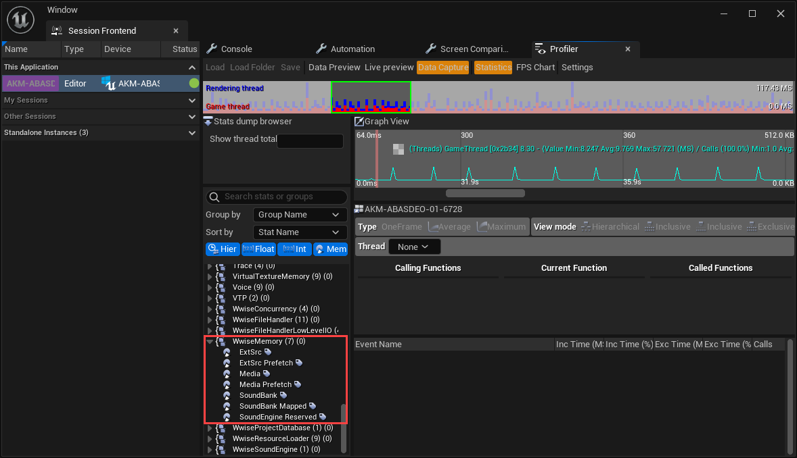

#### 生成 SoundBank

###### 通过 WwiseConsole 生成 SoundBank

###### 通过 WAAPI 生成 SoundBank

###### SoundBank Generation Watcher

##### SoundBank Generation 详情

##### Triggering Generated SoundBanks Parsing

##### 素材重新加载选项

|  |
| --- |
| Wwise Unreal Integration Documentation |

生成 SoundBank

There are several ways to generate the Wwise SoundBanks: from [Wwise Authoring](https://www.audiokinetic.com/library/edge/?source=Help&id=generating_soundbanks_for_project), from the Unreal Editor, or through a [commandlet](using_features_generatecommandlet.html). This section explains how to generate SoundBanks in Unreal.

After you generate SoundBanks, you can access Events and other Wwise Objects through the Wwise Browser (see [Managing Assets with the Wwise Browser](features_editor_wwise_browser.html)), Blueprints, and so on.

**To generate SoundBanks in Unreal:**

1. Do one of the following:

   - From the menu bar, click **Build** > **Generate SoundBanks**.
   - In the upper-right corner of the Wwise Browser, click **Generate SoundBanks**

     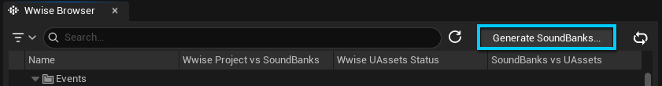

   The Generate SoundBanks dialog opens.

   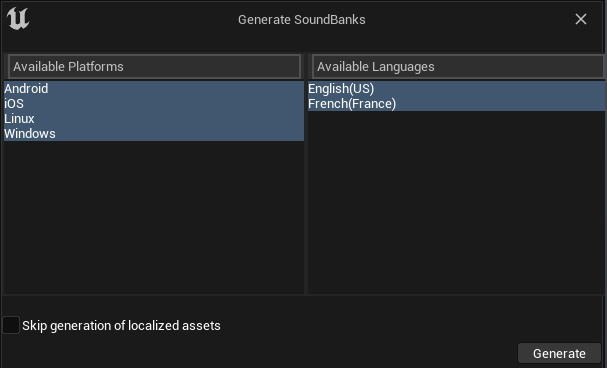

   The dialog lists the platforms and languages that the Wwise project supports.
2. Select the desired platforms and languages. If you do not select any platforms or languages, all items in the respective list will be generated.
3. (Optional) To reduce soundbank generation time, select **Skip generation of localized assets**.
4. Click **Generate**. The SoundBanks are generated.

# SoundBank Generation 详情

## 通过 WwiseConsole 生成 SoundBank

在禁用 WAAPI 或没有打开 Wwise 设计工具时，可通过 WwiseConsole 来在 GeneratedSoundBanks 文件夹中生成 SoundBank。

## 通过 WAAPI 生成 SoundBank

在连接 WAAPI 时，会通过 WAAPI 直接把要生成 SoundBank 的命令发送到 Wwise 设计工具，但仍会在磁盘上的 GeneratedSoundBanks 文件夹中生成 SoundBank。

## SoundBank Generation Watcher

When the Unreal Editor is open, a directory watcher monitors changes in the GeneratedSoundBanks folder. Changes to files in this folder trigger a countdown timer that appears in a temporary window in the lower-right corner of the screen. Any subsequent changes reset the timer.

When the timer expires, the JSON metadata in the GeneratedSoundBanks folder is parsed, which updates the integration's internal database of the Wwise project.

After the project is parsed, all currently loaded Wwise assets are reloaded to properly apply changes in project data.

# Triggering Generated SoundBanks Parsing

If you do not manually generate SoundBanks, any operation that synchronizes the GeneratedSoundBanks folder contents causes the directory watcher to trigger the parsing process.

The following operations parse the project metadata from the GeneratedSoundBanks folder:

- Opening the Unreal Editor.
- Clicking **Refresh** in the Wwise Browser.
- Clicking **Refresh Project Database** in the Build menu.
- Changing the **Generated SoundBanks Folder** setting in the Unreal project's Wwise Integration Settings.
- Changing the **Generated SoundBanks Folder User Override** in the Unreal project's Wwise User Settings.
- Changing any of the files in the GeneratedSoundBanks folder.

# 素材重新加载选项

To avoid reloading in-memory assets every time you change the contents of the GeneratedSoundBanks folder, you can select an option in the Unreal Project Wwise User Settings to enable a prompt before assets are reloaded. When this setting is enabled, Wwise assets can only be reloaded with explicit user input except during the initialization of the Wwise Project Database when the Unreal editor is opened.

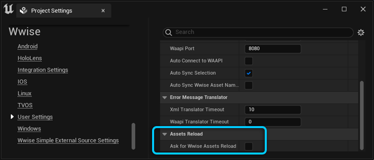

This is the prompt that appears in the bottom right corner of the screen:

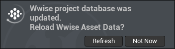

After 10 seconds, if you do not click either option, the "Not Now" option is automatically selected.

#### Generating SoundBanks with the GenerateSoundBanks Commandlet

|  |
| --- |
| Wwise Unreal Integration Documentation |

Generating SoundBanks with the GenerateSoundBanks Commandlet

The Wwise Unreal plug-in includes a Commandlet you can use to generate SoundBanks and submit them to source control from the command line.

|  |  |
| --- | --- |
|  | **注記：** The GenerateSoundBanks Commandlet is now deprecated. You can use the Wwise Console to generate SoundBanks instead. See [Generating all the SoundBanks](https://www.audiokinetic.com/library/edge/?source=SDK&id=ak_wwise_cli_generatesoundbank_example_generating_all_the_soundbanks.html) for more information. |

Commandlet 用法：

<UnrealEditor-cmd.exe> <path\_to\_uproject> -run=GenerateSoundBanks [-platforms=listOfPlatforms] [-languages=listOfLanguages] [-wwiseConsolePath=pathToWwiseConsole]

The Commandlet has the following parameters:

- **platforms**: (Optional) Comma-separated list of platforms for which to generate SoundBanks, as specified in the Wwise project. If not specified, SoundBanks are generated for all platforms.
- **languages**: (Optional) Comma-separated list of Languages for which to generate SoundBanks, as specified in the Wwise project. 若未指定，则将针对所有语言生成 SoundBank。
- **wwiseConsolePath**: (Optional) Full path to the Wwise command-line tool, used to generate the SoundBanks. If not specified, the path from the Wwise settings is used.
- **help**：（可选）输出此帮助消息。此项会马上终止 Commandlet。

使用示例：

C:\UE\_5.0\Engine\Binaries\Win64\UnrealEditor-Cmd.exe C:\MyProjects\Demo\WwiseDemoGame.uproject -run=GenerateSoundBanks -platforms=Windows,Mac

|  |  |
| --- | --- |
|  | **注記：** If you have problems because the Development Editor is not built or available yet, you can skip the plug-in activation by setting the environment variable `SKIP_PLUGIN_ACTIVATION` to `true`. |

#### Overriding Generated SoundBanks Directories for Local Users

|  |
| --- |
| Wwise Unreal Integration Documentation |

Overriding Generated SoundBanks Directories for Local Users

Some organizations generate and store their SoundBanks on dedicated servers under source control. This approach can be efficient with large projects or teams, in which different contributors work on different aspects of audio. If the SoundBanks are generated automatically on a schedule, for example with the SoundBank generation commandlet ([Generating SoundBanks with the GenerateSoundBanks Commandlet](using_features_generatecommandlet.html)), the changes are reconciled and the SoundBanks are available for other developers to use. However, some team members might need to generate SoundBanks locally to experiment or test changes in Unreal. In this case, you can override the project settings to generate and store SoundBanks in custom locations outside of source control.

Before you change anything, it is important to understand how Wwise stores the SoundBank path information, and also how Unreal accesses that information.

Wwise records SoundBank path locations in a ProjectInfo.json metadata file, which is created when you first generate SoundBanks for a project and is located at the Wwise project's Root Output Path. The default Root Output Path is in following directory:

`[WwiseProjectName]\GeneratedSoundBanks`

SoundBanks, by default, are generated in subdirectories of the same folder, divided by platform:

`[WwiseProjectName]\GeneratedSoundBanks\[Platform]`

The ProjectInfo.json file itself contains a list of paths to the generated SoundBanks for each platform. In the Unreal Project Settings, the Generated Sound Banks Path actually points to the Root Output Path, which contains the ProjectInfo.json file, and *not* the paths that contain the actual generated SoundBanks. This is an important thing to remember when you want to override paths, for the following reasons:

- For the Wwise Unreal 集成 to function correctly, the Unreal Generated Sound Banks Path *must* be the same as the Wwise Root Output Path.
- If your Wwise SoundBank paths and the Root Output Path are both under source control, you have to override both.
- If you use a user override for the Root Output Path, you must also set a user override in Unreal to match the Wwise override.

Essentially, Unreal requires access to the ProjectInfo.json file to determine where the SoundBanks are. It does not have any direct knowledge of the SoundBank folder paths.

**To override the SoundBanks directory:**

1. In Wwise, click **Layouts** > **SoundBank**. The SoundBank Layout opens.
2. In the upper right of the SoundBank Manager, click the **gear icon** > **User SoundBank Settings**. The User SoundBank Settings dialog opens.
3. Select **Override Project SoundBank Settings** and **Override Project SoundBank Paths**. The various SoundBank settings are activated.

   |  |  |
   | --- | --- |
   |  | **警告：** If **Enable Auto-Defined SoundBanks** is selected in the regular project settings, it is cleared when you select **Override Project SoundBank Settings**. You must select it in the override settings as well to ensure that SoundBanks can be generated successfully. |
4. Click the ellipses next to **Root Output Path** and in the file explorer, browse to the desired local directory and click **Select Folder**. Ensure that the location is not under source control.
5. Click the ellipses next to a SoundBank Folder and in the file explorer, browse to the desired local directory and click **Select Folder**. Ensure that the location is not under source control. Repeat for each platform for which you want to generate SoundBanks locally.
6. Click **OK**, then generate SoundBanks. The SoundBanks are created in the folders you specified, and the ProjectInfo.json file is created in the Root Output Path you specified.
7. In Unreal, click **Edit** > **Project Settings**. The Project Settings dialog opens.
8. Scroll to the Wwise section and click **User Settings**. The Wwise - User Setting page opens.
9. Click the ellipses next to **Root Output Path Override**. In the file explorer, browse to the same Root Output Path directory you specified as a user override in Wwise.  
     
   You can now modify the Wwise project and generate SoundBanks as required, without any effect on the shared project SoundBanks.

#### 刷新 Project Database

|  |
| --- |
| Wwise Unreal Integration Documentation |

刷新 Project Database

Click **Build > Refresh Project Database** to parse the Wwise Project in your GeneratedSoundBanks folder, and then reload the loaded Wwise assets in your project.

Refer to [Triggering Generated SoundBanks Parsing](using_features_generate.html#using_features_generate_sync) for other ways to refresh your assets.

#### Working with DLC in Wwise Authoring

#### Loading Events and Switch Containers

#### Packaging DLC

|  |
| --- |
| Wwise Unreal Integration Documentation |

Managing SoundBanks

The Wwise Unreal 集成 includes several options for SoundBank management, which are described in the following sections.

- [Understanding Auto-Defined and User-Defined SoundBanks](unreal_using_soundbanks_concepts.html)   
  Explains the differences between user-defined and auto-defined SoundBanks.
- [Memory Usage Considerations](using_soundbanks_memory.html)   
  Explains how to monitor Wwise memory usage in Unreal.
- [生成 SoundBank](using_features_generate.html)   
  Explains how to generate SoundBanks from Wwise Authoring or the Unreal Editor.
- [Generating SoundBanks with the GenerateSoundBanks Commandlet](using_features_generatecommandlet.html)   
  Explains how to generate SoundBanks with the commandlet.
- [Overriding Generated SoundBanks Directories for Local Users](using_soundbanks_override.html)   
  Explains how to override generated SoundBank directories.
- [刷新 Project Database](using_features_project_db_refresh.html)   
  Explains how to refresh Wwise assets by parsing SoundBank data.

### Developing DLC with the Wwise Unreal Integration

|  |
| --- |
| Wwise Unreal Integration Documentation |

Developing DLC with the Wwise Unreal Integration

This section lists several important requirements and recommendations to remember if you plan to release downloadable content (DLC) for your game.

# Working with DLC in Wwise Authoring

When working on DLC in Wwise Authoring, you can add new DLC-specific sound structures and Wwise assets, or add child elements to existing structures such as Switch Containers, Music Playlist Containers, and so on. Depending on the type of object you modify, you must then either repackage the affected SoundBanks or add new SoundBanks. For details and examples of SoundBank management for DLC in Wwise Authoring, see [DLC considerations and limitations](https://www.audiokinetic.com/library/edge/?source=Help&id=dlc_considerations_and_limitations).

Additionally, when working with media files in your project, ensure that there are no conflicts between DLC and base game asset ShortIDs. For more information, see [Short IDs in action](https://www.audiokinetic.com/library/edge/?source=Help&id=managing_media_asset_ids#shortids_in_action).

# Loading Events and Switch Containers

If you are using a customized `WwiseResourceLoader` module, you can manage Event and Switch Container loading to ensure that DLC-specific sounds are only loaded for DLC-specific maps, even if those sounds are part of a Switch Container that the base game also uses. See the Events and Switch Container section on the [WwiseResourceLoader 模块](module_resourceloader.html) page for more information.

# Packaging DLC

You must ensure that DLC-specific assets are packaged with the rest of the Unreal DLC game assets so they can be delivered appropriately as add-ons. We recommend that you use the **Package as Bulk Data** Unreal project setting, which packages Wwise assets with their corresponding Unreal UAssets. This option is required for Unreal's Cook On the Fly option to work. You can also use Wwise Asset Libraries to further distinguish DLC-specific assets, although this is not required.

For more information about bulk data and asset libraries, see [Packaging Wwise Assets as Bulk Data](using_features_package_as_bulk_data.html).

### Packaging Wwise Assets as Bulk Data

|  |
| --- |
| Wwise Unreal Integration Documentation |

Packaging Wwise Assets as Bulk Data

The Wwise Unreal Integration includes configuration options that control file packaging behavior during Unreal's cooking process. By default, Wwise assets are packaged as "bulk data" during cooking, which means that the assets are packaged within Unreal UAssets when possible. If desired, you can clear the relevant configuration option to package files individually.

There are several reasons to package assets as bulk data:

- It reduces the number of files to package. For example, instead of packaging three different files for Fire\_Weapon (Fire\_Weapon.uasset, FireWeapon.bnk, and 903830747.wem), they are all packaged into the UAsset directly because they are referenced in the Fire\_Weapon Unreal asset exclusively.
- Performance is improved. Instead of opening and reading multiple files, only one file is read and processed sequentially. The effect on performance can be dramatic. For example, if a single Event prefetches thousands of streamed and resident assets that are not packaged as bulk data, each file must be opened, read, and closed individually.
- You can use the **Multi-Process Cooking (experimental)** and **Iterative Cooking** options as long as all the assets are properly packaged as bulk data, either directly in the requested UAsset or through Wwise Asset Libraries.
- Modular Gameplay, Asset Chunking, DLCs, and optional contents are fully supported. Although you can package a game with individual files with these Unreal options or goals, bulk data streamlines the packaging operation. The Wwise files are included in the main package, so the developer does not have to move them.
- The IO Store and Zen Store (experimental) are natively supported.

There are also several reasons to package files as individual additional files instead of as bulk data:

- When packaged as bulk data, some object duplication can occur. If two Unreal UObjects define the same Event, the data is duplicated.
- Unreal bulk data requires additional memory and storage resources. Although minimal, you must account for the additional resources (up to 500 bytes per asset).
- The files are embedded inside the UAsset. File replacement and updates are less granular, because a single change in one Wwise asset results in an update of the UAsset, including all the Wwise assets. User-modifiable assets are also less accessible.
- Unused assets might be packaged. Instead of automatic Unreal asset tree-shaking, you would have to manually manage Wwise Asset Libraries to minimize duplication.

# File Packaging Behavior

When you package files as bulk data, Wwise assets used in a single location in the Wwise project are packaged inside the Unreal UAssets that reference them. Typically, these are streamed audio files and files generated through the Wwise Auto-Defined SoundBanks.

The final destination of multi-reference assets depends on the file packaging configuration. In this context, a *multi-reference asset* is a Wwise asset that is referenced by multiple Events *in Wwise*, even if only some of those Events are used in Unreal. If two Wwise Events, such as Play\_Banter and Play\_Banter\_Test, use the same Wwise assets but there is only an Unreal UAsset for Play\_Banter, the packaging system still considers all the Wwise assets to be multi-reference.

All multi-reference assets are packaged as Additional files and after the files are cooked, they appear in the Wwise Staging Directory defined in the Wwise Integration settings. For example, a User-Defined SoundBank called DrumKit.bnk that contains multiple assets used in different Wwise Events would be packaged as an Additional file.

**To change packaging behavior:**

1. In Unreal, select **Edit** > **Project Settings**.
2. Scroll to the Wwise section and click **Wwise Packaging**. By default, **Package as Bulk Data** is selected. These default options support Multi-Process Cooking, Iterative Cooking, Modular Gameplay, and Asset Chunking.
3. To disable bulk data packaging, clear **Package as Bulk Data**.

|  |  |
| --- | --- |
|  | **注記：** If you want to temporarily disable bulk data packaging without changing configuration settings, you can pass the `-DisableWwiseBulkData` argument to the Cook commandlet. With this argument, the game is packaged using loose files, so you can generate SoundBanks directly in a packaged game. |

# Using Wwise Asset Libraries

The Wwise Asset Libraries are groups that are equivalent to Wwise SoundBanks. However, they are defined inside the Unreal project itself. You can use them to package all the Wwise files (if the Asset Library filter is empty), only the Multi-Reference assets (using the WwiseAssetLibraryFilterMultiReference), particular languages, or other criteria. You can create and configure as many Wwise Asset Libraries as required.

**To create a Wwise Asset Library:**

1. Do one of the following:
   - In the Unreal Content Browser:
     - Right-click and select **Wwise** > **WwiseAssetLibrary**.
   - On the Wwise Packaging settings page:
     1. Next to **Libraries use for cooking Wwise UAssets as Bulk Data**, click **+**. An empty element is added to the list.
     2. Open the empty element's dropdown and select **Wwise Asset Library**, then name and save the library.
2. Double-click the new Asset Library.
3. Configure your content filters as desired. The following example shows a "Footsteps" Wwise Asset Library that filters all Wwise assets that contain the text "Footstep\*" (the asterisk is a wildcard operator), or in other words the various footstep sounds used throughout the Unreal project.

   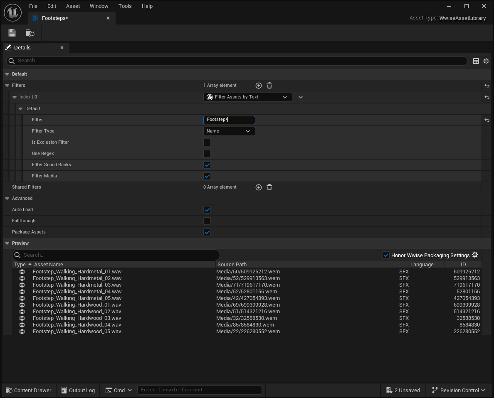

## Ordering and Priority

The **Libraries used for cooking Wwise UAssets as BulkData** list is ordered. The first library in the list overrides all items below it, the second library overrides the items below it, and so on. You can therefore create and arrange your libraries in such a way as to package more granular content first by placing the associated libraries at the top of the list, then gradually expanding the scope of the libraries.

The following example Demonstrates a series of Wwise Asset Libraries.

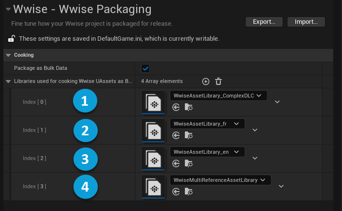

|  |  |
| --- | --- |
| **1** | WwiseAssetLibrary\_ComplexDLC, which contains certain DLC-specific content. |
| **2** | WwiseAssetLibrary\_fr, which contains exclusive French language assets. |
| **3** | WwiseAssetLibrary\_en, which contains exclusive English language assets. |
| **4** | WwiseMultiReferenceAssetLibrary, which contains all multi-reference assets that were not included in any of the previous libraries. |

In this case, some Wwise assets might be multi-reference and also tagged as French. If those assets match the filters configured in WwiseAssetLibrary\_fr, they are included in it instead of in the WwiseMultiReferenceAssetLibrary, because WwiseAssetLibrary\_fr is higher in the list and therefore takes precedence.

|  |  |
| --- | --- |
|  | **注記：** Every packaged Asset Library contains individual Bulk Data for every asset it loads. They are loaded on project startup, which means that there is a slight delay to startup timing, as well as a slight increase in memory usage. However, the effect is minimal. For example, in debug, 10 000 assets might cost 10000\*500 bytes of memory, or 5 megabytes of RAM.  Asset Libraries are not less efficient than individual file access. However, they are much less efficient and out of order than inline asset packaging. It is always faster to access cooked Wwise files inline to the Wwise Event (or other AkAudioType UAsset) to which it relates. Test thoroughly to see if there are any performance issues at load time. |

|  |  |
| --- | --- |
|  | **警告：** Leaks might occur if your packaged game includes unused assets such as media and SoundBanks that are only used for testing during development. Ensure that you create filters to exclude such assets from Asset Libraries. |

# Previewing Wwise Asset Library contents

After you create the Wwise Asset Libraries you need, you can preview the contents before you cook the files.

**To preview Wwise Asset Library contents:**

- On the Wwise Packaging settings page, double-click a Wwise Asset Library. The Preview section displays the predicted contents of the library according to the specified filters. However, note that the **Apply Wwise Packaging Settings** option must be selected in order to view the actual contents, because some files that might satisfy the current filter might already be included in another library that takes precedence. For example, the following preview shows the contents of the WwiseAssetLibrary\_play1 library, which has a filter to select all files that begin with the text "Play":

  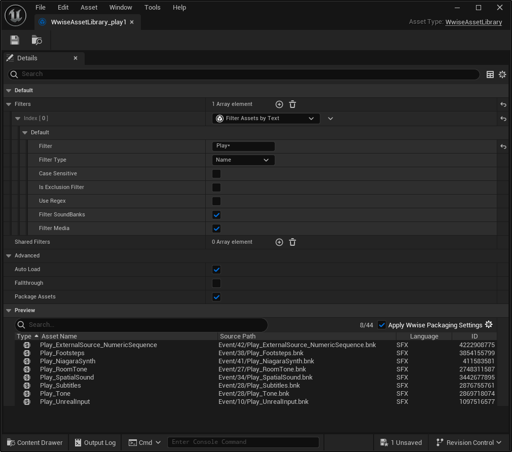

  If the **Apply Wwise Packaging Settings** is cleared, the list expands to include additional files that match the filter:

  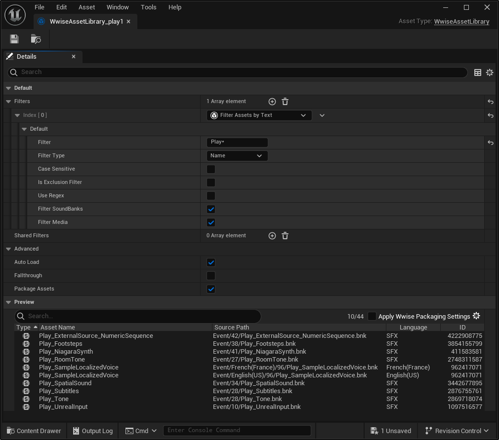

  However, it is important to remember that **the contents of the library do not change**. Clearing the option only shows you all of the possible files, even the ones that would be packaged in other libraries that take precedence. It can nonetheless help you evaluate your library configuration.##### Ordering and Priority

#### File Packaging Behavior

#### Using Wwise Asset Libraries

#### Previewing Wwise Asset Library contents

##### Synchronizing from Wwise to Unreal

#### Managing Wwise and Unreal Assets

|  |
| --- |
| Wwise Unreal Integration Documentation |

Managing Wwise and Unreal Assets

When Wwise and Unreal projects are integrated, all Wwise-specific Unreal assets have IDs, which reference corresponding objects in the Wwise project. You can create assets in the Content Browser, or use the [Wwise Browser](features_editor_wwise_browser.html).

To enable a connection to the Wwise project through WAAPI, refer to [Wwise Authoring API (WAAPI)](using_features_waapi.html).

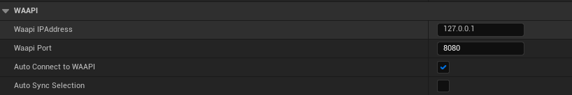

# Synchronizing from Wwise to Unreal

When you generate SoundBanks in Wwise while the Unreal Editor is open, Unreal parses the content of the generated SoundBanks and updates the contents of the [Wwise Browser](features_editor_wwise_browser.html). In addition, any assets that are currently loaded in Unreal are then reloaded, and include the changes made in the Wwise project.

As shown in the following image, the associated Unreal and Wwise Assets can have different names. The association between the two is determined by the GUID, ShortID, and Asset Name properties. Therefore, you can rename Unreal assets without affecting the Wwise objects they reference.

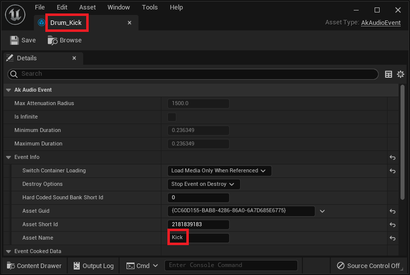

#### Managing Assets with the Wwise Browser

|  |
| --- |
| Wwise Unreal Integration Documentation |

Managing Assets with the Wwise Browser

You can use the Wwise Browser to access objects from your Wwise project in Unreal. To access the Wwise Browser, click **Window** > **Wwise Browser**.

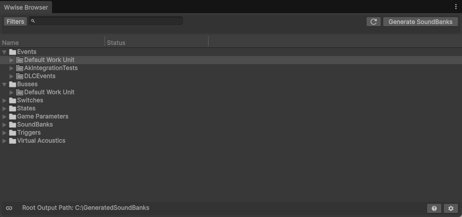

The Wwise Browser includes a variety of features, some of which require a connection to the Wwise Authoring API (WAAPI), and others that do not. For more information about WAAPI features, refer to [Using Waapi Features](features_editor_wwise_browser.html#features_editor_waapi_picker).

The Wwise Browser's contents are refreshed automatically after you regenerate SoundBanks. To manually refresh the list, click the **Refresh** button.

You can use the Wwise Browser to:

- Locate files on disk.
- [Importing Wwise Assets](features_editor_wwise_browser.html#browser_importing_assets) Import Wwise Assets
- [Using the Drag-and-Drop Feature](features_editor_wwise_browser.html#features_editor_dnd) Drag Assets into Unreal Blueprint nodes or object components and properties.

# Using Waapi Features

Certain Wwise Browser features require the Wwise Authoring API (WAAPI). To enable these features, you must:

- Enable the Wwise Authoring API. Refer to [Wwise Authoring API (WAAPI)](using_features_waapi.html) for instructions.
- Open the Wwise project in Wwise Authoring.

The Wwise Browser is populated in real time with data from the Wwise Authoring tool. Any changes you make to object names or IDs in Wwise are reflected in the Wwise Browser.

After WAAPI is enabled, you can use the Wwise Browser to:

- Preview sounds.
- Toggle item selection sync between Wwise and Unreal.

## Previewing Sounds

You can use the Wwise Browser to preview sounds from your Wwise project in the Unreal Editor before you generate SoundBanks.

To preview a sound in the Wwise Browser, do one of the following:

- Select an Event or a Property Container and press the **Space bar**.
- Right-click the Event or Property Container and then click **Play/Stop**.

To stop a sound, do one of the following:

- Press **Space bar**.
- Right-click any element and click **Stop All**.

## Finding Work Units on Disk

You can use the Wwise Browser to open the folder in your file system that contains the Work Unit associated with an object.

To show the Work Unit location on disk:

- Right-click the element in the Wwise Browser, then click **Show in Folder**.

# Using the Drag-and-Drop Feature

You can drag Events, Auxiliary Busses, Acoustic Textures, States, Switches, Game Parameters (RTPCs), and Triggers from the Wwise Browser into the Unreal Content Browser to create corresponding [UAkAudioEvent](pg_features_objects_assets.html#features_objects_classes_UAkAudioEvent), [UAkAuxBus](pg_features_objects_assets.html#features_objects_classes_UAkAuxBus), [UAkAcousticTexture](pg_features_objects_assets.html#features_objects_classes_UAkAcousticTexture), [UAkStateValue](pg_features_objects_assets.html#features_objects_classes_UAkStateValue), [UAkSwitchValue](pg_features_objects_assets.html#features_objects_classes_UAkSwitchValue), [UAkRtpc](pg_features_objects_assets.html#features_objects_classes_UAkRtpc), [UAkTrigger](pg_features_objects_assets.html#features_objects_classes_UAkTrigger) assets.

To drag Wwise Assets into Unreal:

1. Open the Content Browser folder in which you want to create the asset.
2. In the Wwise Browser, select the Wwise object you want to use.
3. Drag the Wwise object into the Content Browser. A corresponding Unreal object is created.

In addition to individual items, you can drag any container (Work Unit, Folder, Switch/State Group) into the Content Browser to recreate the hierarchy as it exists in Wwise Authoring.

In addition, you can drag objects into:

- Parameters to Blueprint nodes.

  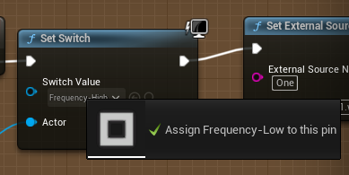
- Object components or properties.

  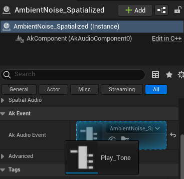

|  |  |
| --- | --- |
|  | **注記：** If you drop an object anywhere other than the Content Browser, the asset is created in the folder specified by the [Default Asset Creation Path](features_editor_wwise_browser.html#default_asset_creation_path_setting). |

## Setting the Default Asset Creation Path

You can specify a default asset creation path. Assets that are automatically created from Wwise objects (for example, by dropping an object from the Wwise Browser onto a Blueprint) are created in this folder.

|  |  |
| --- | --- |
|  | **注記：** We recommend that you retain the default `/Game/` part of the asset creation path. If you remove it, assets are created under the Plugins folder, which might cause confusion. |

To set the default asset creation path:

1. In the Unreal menu bar, click **Edit** > **Project Settings**. The Project Settings dialog opens.
2. On the Wwise - Integration Settings page, scroll to the Asset Creation section and type or paste the desired **Default Asset Creation Path**:

# Importing Wwise Assets

You can import Wwise Assets into your Unreal project from the Wwise Browser.

To import a Wwise Asset:

1. In the Wwise Browser, right-click the Asset you want to import and in the contextual menu, click **Import Selected Assets**. A file browser opens.
2. Browse to the desired location and click **Select Folder**. The Asset is imported to the folder.

# Wwise Browser Columns

The Wwise Browser is separated into four columns, which are described in the following sections.

## Name Column

The Name column recreates the hierarchy of the project as it exists in the SoundBanks and displays the name of the Wwise Items. It prioritises the name found in the Generated SoundBanks over the name in Wwise if the names are different.

## Wwise Project vs SoundBank Column

The Wwise Project vs SoundBank Column compares the Wwise Project to the Generated SoundBanks and provides information about the differences between the two. For this column to work properly, the Wwise Browser musbe [connected to Waapi](features_editor_wwise_browser.html#features_editor_waapi_picker).

- **New in Wwise**: The Wwise Project has the information but the SoundBanks do not. Generating the SoundBanks creates the item in the SoundBanks and changes this column to **SoundBank Up to Date**.
- **Deleted in Wwise**: The SoundBanks have the item information but Wwise does not. Generating the SoundBanks removes the item from the Wwise Browser or, if a UAsset of the item exists, changes the column to **Not in Wwise or SoundBank**.
- **Renamed in Wwise**: The Wwise Project and the SoundBanks have the same item but with different names. Generating the SoundBanks renames the item inside the SoundBanks to match the name in Wwise.
- **Not in Wwise or SoundBank**: A UAsset uses an item that does not exist in Wwise or the SoundBanks. Avoid using this UAsset in your game.
- **Moved in Wwise**: The item exists in both Wwise and the SoundBank, but in a different location in each. Generating the SoundBanks moves the item to the same location it is in Wwise and changes this column to **SoundBank Up to Date**. Items with this label are shown where they are according to the SoundBanks in the Wwise Browser.
- **SoundBank Up to Date**: The name and ID of the item are the same in the Wwise Project and in the SoundBanks.

## Unreal Assets Column

The Unreal Assets Column provides information about the Wwise assets inside the Unreal project. If the Wwise item does not have a matching UAsset, this column is empty. If only one UAsset exists for the item, the Column shows the name of the UAsset. If there are multiple UAssets for the item, then “Multiple UAssets” followed by the number of UAssets is displayed. To see all the items, right-click on the item and click **Show in Content Browser**.

## SoundBank vs UAsset Column

The SoundBank vs UAsset Column compares the Generated SoundBanks to the assets in the Unreal project.

- **UAsset Missing**: The item exists in the SoundBanks but there are no UAssets associated with it. This means that the item is not used in your game.
- **Not in SoundBank or Unreal**: The item exists only in Wwise. Generating the SoundBanks changes this item to **UAsset Missing**.
- **UAsset Orphaned**: This UAsset has no item associated with it. Using it in your game will throw warnings.
- **Renamed in SoundBank**: The item exists and there is a single UAsset associated with it but the name of the item and the UAsset are different.
- **Multiple UAssets**: The item exists and there are multiple UAssets associated with it.
- **UAsset Needs Update**: There is one UAsset associated with the item but its information is not up to date with the SoundBanks.
- **UAsset Up to Date**: There is one UAsset associated with the item and its information is up to date with the SoundBanks.

## Orphaned UAssets Folder

If the Unreal project references Wwise assets that you then delete from your Wwise project, they are listed in the Orphaned UAssets folder, which appears at the end of the folder list:

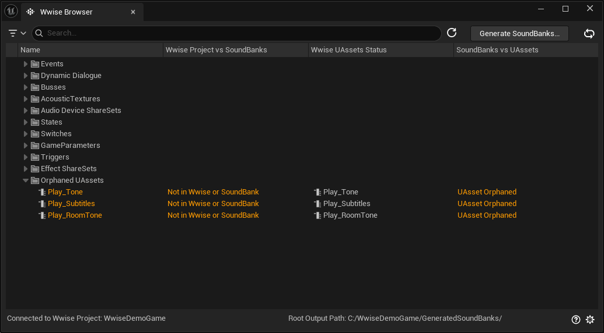

It is not possible to remove these UAssets with the Wwise Browser's reconciliation function. Instead, you must delete them manually. For more information on reconciliation, refer to [Reconciling Wwise UAssets](features_editor_reconcile.html).

# Filtering

You can filter Wwise objects to reduce the number of objects displayed in the Browser. There are three categories of filtering: SoundBank Status, UAsset Status, and Types. The SoundBank Status filters on the “Wwise Project vs SoundBanks” column, The UAsset Status filters on the **SoundBanks vs UAssets** column and Types filters on the Wwise item type. When you select a filter, all Wwise objects that do not satisfy the condition are filtered out of the Wwise Browser.

For an item to remain in the Wwise Browser, it must satisfy the conditions of all three categories. 例如：

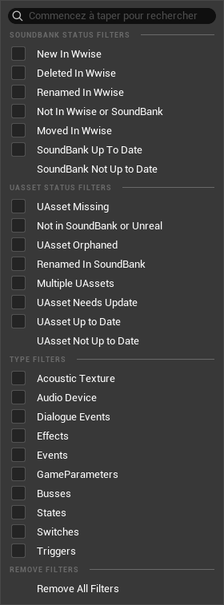

In this case, the Wwise objects must be Events or Switches that are UAsset Orphaned or Not in SoundBank or UAsset and Renamed in Wwise or New in Wwise.

There is also a filter bar in which you can type Wwise object names to search for those objects.

# Reconciling

It is possible to [Reconcile UAssets](features_editor_reconcile.html#reconcile_browser) with the Wwise Browser.###### Previewing Sounds

###### Finding Work Units on Disk

###### Setting the Default Asset Creation Path

###### Name Column

###### Wwise Project vs SoundBank Column

###### Unreal Assets Column

###### SoundBank vs UAsset Column

###### Orphaned UAssets Folder

##### Using Waapi Features

##### Using the Drag-and-Drop Feature

##### Importing Wwise Assets

##### Wwise Browser Columns

##### Filtering

##### Reconciling

##### Using the Wwise Browser

##### Using WwiseReconcileCommandlet

##### Customizing the Reconcile module

#### Reconciling Wwise UAssets

|  |
| --- |
| Wwise Unreal Integration Documentation |

Reconciling Wwise UAssets

When you use Wwise assets in an integrated Unreal project, corresponding UAssets are created in Unreal based on the most recently generated Wwise SoundBanks. However, if you or another team member continues to work on the Wwise project, the original files might be renamed, deleted, or moved. If the SoundBanks are then regenerated, there might be discrepancies between the contents of the SoundBanks and the UAssets in Unreal.

If that happens, you can reconcile the SoundBanks and UAssets through the Wwise Browser or with a commandlet.

Reconciling UAssets can do four things:

- Create: Creates a UAsset for an item in the generated SoundBanks. The Asset is created in the Default Asset Creation Path (refer to [Setting the Default Asset Creation Path](features_editor_wwise_browser.html#default_asset_creation_path_setting) for more information) in the same directory structure as the one in the Generated SoundBanks. The directory structure details are contained in the `ProjectInfo.json` metadata file, which is located in the Root Output Path (refer to [Integration Settings](using_initialsetup.html#initialsetup_gamesettings) for details). The directory structure mimics the structure of the Wwise project directory. If the path is too long, the UAsset is not created and you must import it manually.
- Update: Updates the information of the UAsset to match the information of the item in the GeneratedSoundBanks.
- Rename: Renames the UAsset to match the name of the item in the SoundBanks.
- Delete: Removes the UAsset because there is no item associated with it in the Generated SoundBanks. The item is not deleted if it is referenced in the Unreal project, but instead appears in the Orphaned UAssets folder in the Wwise Browser (refer to [Orphaned UAssets Folder](features_editor_wwise_browser.html#features_browser_OrphanedUAssetFolder)). You must delete this type of UAsset manually.

|  |  |
| --- | --- |
|  | **注記：** "Move" operations are not supported by default. If you want to use them, you must create a custom Reconcile module. See [Customizing the Reconcile module](features_editor_reconcile.html#customize_reconcile). |

# Using the Wwise Browser

The Wwise Browser contains several columns that display information about the state of assets in the Wwise Project, the generated SoundBanks, and in Unreal:

- Wwise Project vs SoundBanks: If the Wwise project is open and WAAPI is connected, this column indicates any discrepancies between the items in Wwise and in the Generated SoundBanks.
- Wwise UE Asset Status: Shows how many UAssets for this item exist.
- SoundBanks vs UAssets: Indicates any discrepancies between the UAssets and the SoundBank contents. If you see that there are discrepancies that require reconciliation, you can reconcile assets directly through the Wwise Browser.

|  |  |
| --- | --- |
|  | **注記：** Ensure that you generate SoundBanks before you reconcile assets. The Wwise Browser displays asset status based on the most recently generated SoundBanks, so if you have not generated SoundBanks in some time, the information might not be accurate. |

**To reconcile UAssets:**

1. In the Wwise Browser, select the assets you want to reconcile. You can select a folder to reconcile all of its contents.
2. Do one of the following:

   - In the upper right, click **Reconcile Selected**.

   

   - Right-click, then click **Reconcile Selected Assets**.

   A window opens, and lists all of the assets that require reconciliation and the operations that will be performed. Assets that are already up to date do not appear.
3. Click **Reconcile Unreal Assets**. The assets are reconciled.

# Using WwiseReconcileCommandlet

The Wwise Unreal plug-in includes a Commandlet you can use to reconcile all UAssets. To make sure the Assets are properly reconciled, we recommend that you run the [GenerateSoundBanks commandlet](using_features_generatecommandlet.html) before the WwiseReconcileCommandlet.

**Commandlet usage:**

<UnrealEditor-cmd.exe> <path\_to\_uproject> -run=WwiseReconcileCommandlet -modes=listOfOperation

The Commandlet has the following parameters:

- `modes`: Comma-separated list of operations performed on the asset. The operations can be any of the following:
  - `create`: Create Unreal assets from the Generated SoundBanks.
  - `update`: Update existing Unreal assets. This updates the asset name as well as its metadata.
  - `delete`: Delete Unreal assets that no longer exist in the Generated SoundBanks.
  - `all`: Fully reconcile Unreal assets.
- `dryrun`: A dryrun displays changes required for the assets and logs them as errors. This parameter prevents the Reconcile Operations.

Example:

C:\UE\_5.0\Engine\Binaries\Win64\UnrealEditor-Cmd.exe C:\MyProjects\Demo\WwiseDemoGame.uproject -run=WwiseReconcileCommandlet -modes=create,update

|  |  |
| --- | --- |
|  | **警告：** After updating Wwise to a new version, we recommend that you execute a regular Reconcile command before running a dryrun. |

# Customizing the Reconcile module

You can customize the behavior of the Reconcile module. For example, you can change the way it determines the asset creation path, or add `move` reconciliation operations to the Wwise Browser and commandlet. The module provides a highly extensible base class, which has a default implementation that developers can override.

To implement a custom Wwise Reconcile module, you must first create a new Unreal module. The module must contain at least the following two classes:

- A class that inherits `IWwiseReconcile`, which handles the responsibilities of the Reconcile module.
  - You can also use `FWwiseReconcileImpl` as a parent class because it is extendable.
- A class that implements `FWwiseReconcileModule`, which overrides `InstantiateReconcile` in order to return an instance of the first class.

You must enable the custom Reconcile module implementation before you can use it. 若要启用，请将以下代码行添加到 Unreal 工程中的 `DefaultEngine.ini` 文件：

[Audio]

WwiseReconcileModuleName=NameOfTheClassThatImplementsFWwiseReconcileModule

#### Working with Reverb

##### Automatically Assigning a Reverb Aux Bus

##### Decay estimation

##### Driving Reverb RTPCs

|  |
| --- |
| Wwise Unreal Integration Documentation |

Working with Reverb

With the Wwise Unreal 集成, the [AkLateReverbComponent](pg_features_objects_components.html#features_aklatereverbcomponent) can automatically assign Reverb Aux Busses and drive reverb parameter RTPCs based on the shape and materials of the geometry to which it is attached.

|  |  |
| --- | --- |
|  | **TIP：** See the [Reverb Parameter Estimation](sa_reverbestimation.html) tutorial for example usage of these features. |

# Automatically Assigning a Reverb Aux Bus

Enable the **Auto Assign Aux Bus** property on an [AkLateReverbComponent](pg_features_objects_components.html#features_aklatereverbcomponent) to automatically assign a Reverb Aux Bus to it through the Reverb Assignment Table. This table, located in the project's Wwise Integration Settings, maps Decay values to Aux Bus assets.

Reverb Assignment in the Wwise Integration settings

Based on the geometry associated with the [AkLateReverbComponent](pg_features_objects_components.html#features_aklatereverbcomponent), a Decay estimate is calculated and compared with the Decay values in the table. The automatically assigned bus corresponds to the smallest Decay value in the table that is greater than or equal to the Decay estimate. If the Decay estimate is greater than the maximum Decay value in the table, it is assigned the Default Reverb Aux Bus that is specified in the Wwise Integration Settings.

Example of a simple Reverb Assignment Table with three Aux Busses

For example, based on the table above, if the estimated decay value for a [AkLateReverbComponent](pg_features_objects_components.html#features_aklatereverbcomponent) is 1.3 (seconds), the "MediumRoom" asset is assigned to the component's **Aux Bus** field. If it is 3, the "DefaultReverb" Aux bus asset is assigned instead.

# Decay estimation

The estimated Decay time is the time in seconds for the sound pressure to drop by 60dB. It is calculated using an absorption value that depends on the Acoustic Texture information provided by an associated [AkGeometryComponent](pg_features_spatialaudio.html#features_objects_akgeometrycomponent) or [AkSurfaceReflectorSetComponent](pg_features_spatialaudio.html#features_objects_aksurfacereflectorset). If there is no Acoustic Texture information, the Default Surface Absorption value (also found in the Wwise Integration Settings) is used instead.

The Default Surface Absorption setting

# Driving Reverb RTPCs

When correctly configured, the [AkLateReverbComponent](pg_features_objects_components.html#features_aklatereverbcomponent) automatically estimates reverb parameters and sets them through RTPCs on the reverb Aux Bus. The estimated parameters are the **T60 Decay time**, **High-Frequency Damping** (HFDamping), and **Time To First Reflection**. For more details about these reverb parameters, see the [AkLateReverbComponent](pg_features_objects_components.html#features_aklatereverbcomponent) properties.

The reverb parameter RTPCs are specified in the Wwise Integration settings, either by selecting an RTPC asset or the RTPC name. The RTPC asset fields take precedence over the name fields, and if both fields are empty, no RTPC is set.

Reverb estimation RTPC Assignment in the Wwise Integration settings

|  |  |
| --- | --- |
|  | **注記：**  - In order to set reverb RTPCs, the [AkLateReverbComponent](pg_features_objects_components.html#features_aklatereverbcomponent) must have a sibling [AkRoomComponent](pg_features_spatialaudio.html#features_objects_akroomcomponent) (a [AkRoomComponent](pg_features_spatialaudio.html#features_objects_akroomcomponent) that shares the same Primitive parent component). - The **High-Frequency Damping** is calculated if the [AkLateReverbComponent](pg_features_objects_components.html#features_aklatereverbcomponent) has a sibling [AkGeometryComponent](pg_features_spatialaudio.html#features_objects_akgeometrycomponent) (or [AkSurfaceReflectorSetComponent](pg_features_spatialaudio.html#features_objects_aksurfacereflectorset) if the parent Actor is a Volume). Alternatively, the **AssociateAkTextureSetComponent** blueprint function on the [AkLateReverbComponent](pg_features_objects_components.html#features_aklatereverbcomponent) can be used to associate a non-sibling component and enable this calculation. - The RTPC values are set on the Room's Game Object in the sound engine. |

#### Visualizing Radii

|  |
| --- |
| Wwise Unreal Integration Documentation |

Visualizing Radii

When you select an [AkAmbientSound](pg_features_objects_actors.html#features_akambientsound), the relevant asset radii are drawn. If you modify the assets in Wwise Authoring while a WAAPI connection is enabled, the radii are updated in real time.

To update an asset radius:

1. In the Unreal Actor Browser, select an [AkAmbientSound](pg_features_objects_actors.html#features_akambientsound).
2. In Wwise Authoring, change any object associated with the Event assigned to the [AkAmbientSound](pg_features_objects_actors.html#features_akambientsound).
3. 若未启用 WAAPI，请重新生成 SoundBank。
4. Select the [AkAmbientSound](pg_features_objects_actors.html#features_akambientsound) again. The size of the corresponding sphere in the Unreal Editor changes at the same time.

若未启用 WAAPI，将从生成的 SoundBank 获取 **Max Attenuation**。 In your Wwise Project Settings, under the SoundBanks tab, ensure that **Generate Per Bank Metadata File**, **Generate JSON Metadata**, and **Max Attenuation** are selected. The next time you generate SoundBanks in the Unreal Editor, the Max Attenuation information is added to all `UAkAudioEvents`, and the attenuation spheres are visible in your level viewport.

#### Using the Editor Listener

|  |
| --- |
| Wwise Unreal Integration Documentation |

Using the Editor Listener

A single listener is activated in edit mode. You can use it to, for example, properly preview Level Sequences that contain positioned audio. 此听者的位置取决于聚焦视口的 Camera 位置。Click between multiple viewports to "jump" from one position to another.

The listener is also used in the Animation Editor viewport, where you can accurately preview 3D-spatialized sounds while you work on animations.

Note that when you start a Play in Editor (PIE) session, the Editor listener is deactivated, and the traditional listener on the Camera is enabled. When you leave a PIE session to start a Simulate in Editor (SIE) session, both the Editor listener and the Camera listener are active at the same time. When you switch back to PIE mode, the Editor listener is disabled again.

#### Testing with Multiple Play In Editor and Wwise Instances

|  |
| --- |
| Wwise Unreal Integration Documentation |

Testing with Multiple Play In Editor and Wwise Instances

If you are testing multiplayer audio in Unreal, you can run separate Play in Editor (PIE) sessions with a separate Wwise instance for each session. 对此，可使用 Unreal 中的多人游戏选项来实现。If you disable **Run Under One Process** in the [Play In Editor Multiplayer Options](https://dev.epicgames.com/documentation/en-us/unreal-engine/play-in-editor-multiplayer-options-in-unreal-engine), each PIE instance uses an independent instance of Wwise. Be aware that this approach consumes more system resources and might affect performance.

You can profile the different sessions in Wwise (see [Profiling](https://www.audiokinetic.com/library/edge/?source=Help&id=profiling)). Each PIE session appears in the list of game systems to which the profiler can connect, as described in [Connecting to a Local/Remote Game System](https://www.audiokinetic.com/library/edge/?source=Help&id=connecting_to_local_remote_pc_or_game_console). However, it is not possible to know in advance which session corresponds to a specific player.

#### Mapping Unreal Cultures to Wwise Languages

#### Changing Languages with Blueprints

#### Changing Languages with the API

#### Packaging Localized Assets

### Using the Integration in the Unreal Editor

|  |
| --- |
| Wwise Unreal Integration Documentation |

Using the Integration in the Unreal Editor

The Wwise Unreal 集成 adds various options to the Unreal Editor. You can use the additional options to perform important tasks, which are described in the following sections:

- [Managing Wwise and Unreal Assets](features_editor_auto_sync.html). When you update Assets in Wwise Authoring, corresponding Unreal Assets are automatically updated. If a WAAPI connection is enabled, any deletions or name changes through the Wwise Browser in Unreal are also applied to the Wwise project.
- [Managing Assets with the Wwise Browser](features_editor_wwise_browser.html). The Wwise Browser is a viewer that you can use to drag Wwise objects into Unreal, preview sounds, rename objects, and delete objects. Changes you make in Unreal also apply to the Wwise project.
- [Reconciling Wwise UAssets](features_editor_reconcile.html). Use the Wwise Browser or a Commandlet to update the UAssets of your project with your changes in the Wwise project.
- [Working with Reverb](features_editor_reverb_estimation.html). Use the `AkLateReverbComponent` to assign aux busses and drive global reverb RTPCs.
- [Visualizing Radii](features_editor_radius.html). When you update `AkAmbientSound` assets in Wwise Authoring, you can see the radii change in Unreal.
- [Using the Editor Listener](features_editor_listener.html). Use the Editor Listener to preview positioned audio and 3D-spatialized sounds.
- [Testing with Multiple Play In Editor and Wwise Instances](features_editor_multiplayer.html). Run multiple Play In Editor sessions with separate Wwise instances.

### Triggering Wwise Events in Animation Sequences

|  |
| --- |
| Wwise Unreal Integration Documentation |

Triggering Wwise Events in Animation Sequences

You can use an Animation Notify to trigger Wwise Events in Animation Sequences.

An AkComponent must be attached to the animated mesh component. If you use the Animation Notify on a mesh component that does not have an attached AkComponent, an AkComponent is created with default values for all `UPROPERTIES`, and it is not possible to modify them. If you want to modify the notify's behaviour, we recommend that you create a copy in your project and modify the copy.

The Blueprint for the Animation Notify is located here: `…/Plugins/Wwise/Content/AnimNotify_AkEvent.uasset`

To add an Animation Notify:

1. In the Unreal Content Browser, open an Animation Sequence asset.
2. Right-click the **Notifies** track in the Animation Sequence Editor and click **Add notify** > **AkEvent** or **AkEventByName**.  
   The animation notification has the following properties:
   - **Event** or **Event Name**: The [UAkAudioEvent](pg_features_objects_assets.html#features_objects_classes_UAkAudioEvent) to post.
   - **Attach Name**: The name of the socket that emits the [UAkAudioEvent](pg_features_objects_assets.html#features_objects_classes_UAkAudioEvent). If not defined, the animation owner emits the AkAudioEvent.
   - **Follow**: Determines whether the Event follows the mesh or is posted at a specific location.

For more information on the Animation Sequence Editor in Unreal, refer to [Animation Sequence Editor](https://dev.epicgames.com/documentation/en-us/unreal-engine/animation-sequence-editor-in-unreal-engine).

### Localizing Audio Assets

|  |
| --- |
| Wwise Unreal Integration Documentation |

Localizing Audio Assets

You can use Wwise Unreal 集成 features to map Unreal Cultures to Wwise languages and ensure that your corresponding Unreal and Wwise projects support the same set of languages for asset localization. After the mapping is complete, you can change languages with certain Blueprint nodes or through the C++ AkAudioDevice API.

# Mapping Unreal Cultures to Wwise Languages

For Unreal Cultures, you can use any [ISO-639-1 language code](https://en.wikipedia.org/wiki/List_of_ISO_639-1_codes) and, optionally, an [ISO 3166 country code](https://en.wikipedia.org/wiki/List_of_ISO_3166_country_codes) (fr-CA, en-GB, and so on). For the Wwise Language, you can use any of the languages in your Wwise project. For more information on localization in Wwise, refer to [Localizing Your Project](https://www.audiokinetic.com/library/edge/?source=Help&id=localizing_project).

**To map an Unreal Culture to a Wwise language:**

1. From the Unreal menu bar, click **Edit** > **Project Settings**.
2. In the Wwise section, click **Integration Settings**. The Localization section includes the mapping of Unreal Cultures to Wwise languages:  

   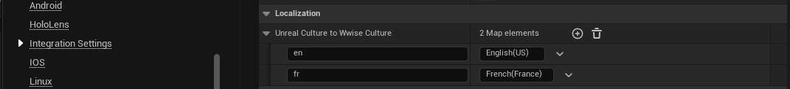
3. Click **Add Element** (+). A new row is added to the list.
4. In the text box on the left, type a valid Unreal Culture and in the text box on the right, type a corresponding Wwise language.

|  |  |
| --- | --- |
|  | **注記：** The Wwise language must match the specified language in the Wwise project exactly (capitalization, spacing, and any special characters such as parentheses). |

# Changing Languages with Blueprints

After you map the Unreal Cultures to the Wwise languages, you can use Blueprint nodes to change audio languages and cultures in Unreal. Two Blueprint nodes are available:

- **Set Current Audio Culture**   

  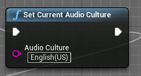
- **Set Current Audio Culture Async**   

  

# Changing Languages with the API

You can change the audio language or culture directly from code in the C++ AkAudioDevice API `FAkAudioDevice::Get()->SetCurrentAudioCulture()`. You can pass either a Wwise language or an Unreal Culture to the C++ function or Blueprint node.

When `SetCurrentAudioCulture()` is called:

1. The string passed to the function determines the Wwise language to set.
2. The Integration calls `FWwiseResourceLoader::SetLanguage` with the `EWwiseReloadLanguage::Immediate` parameter.
3. Integration 使用新的语言调用 `IWwiseStreamMgrAPI::SetCurrentLanguage`。

The asynchronous variant immediately calls `IWwiseStreamMgrAPI::SetCurrentLanguage`, and `FWwiseResourceLoader::SetLanguage` (which does the heavy lifting of reloading Wwise resources) is called in an asynchronous task. 在完成 `FWwiseResourceLoader::SetLanguage` 后，会触发 **Completed** Blueprint Event。

Advanced users might want to use different values of `EWwiseReloadLanguage`. If this is the case, we recommend that you avoid using the supplied Blueprints and the AkAudioDevice API and to call the `FWwiseResourceLoader::SetLanguage` and `IWwiseStreamMgrAPI::SetCurrentLanguage` functions directly.

The three possible states of `EWwiseReloadLanguage` are:

- **EWwiseReloadLanguage::Immediate**
  - 将加载 Event 资源时所用的 FWwiseResourceLoader 中的 CurrentLanguage 变量设为新的语言。
  - The resources of all Soundbanks, ShareSets, Aux Busses, and Events that were loaded in the previous language are reloaded.
- **EWwiseReloadLanguage::Safe**
  - Does the same things as **Immediate**, but also calls `IWwiseSoundEngineAPI::StopAll()` to stop all playing sounds before resources are reloaded.
- **EWwiseReloadLanguage::Manual**
  - Only the CurrentLanguage variable in the FWwiseResourceLoader is changed to the new language.
  - The user is responsible for unloading and reloading the Wwise resources that require the language change.

|  |  |
| --- | --- |
|  | **注記：** Due to limitations in the Wwise Sound Engine, we recommend that you change languages when no localized sounds are playing. If an event is playing, the Sound Engine does not unload the bank that contains it. A loaded bank cannot be replaced by a new bank with the same name, even if it is in a different language. The bank must be unloaded first. |

# Packaging Localized Assets

在烘焙本地化的 Wwise 素材时，会随素材一起打包各个语言的资源（.bnk 和 .wem 文件）。Refer to [烘焙和打包](using_knownissues.html#knownissues_packaging) on the [已知问题](using_knownissues.html) page.

### Using Dynamic Dialogue in Unreal

|  |
| --- |
| Wwise Unreal Integration Documentation |

Using Dynamic Dialogue in Unreal

The Wwise Unreal Integration includes a dynamic dialogue system, which sound designers can use to manage dynamic audio. Although the system and its associated components refer to "dialogue," it supports any type of dynamic audio: voices, sound effects, music, and so on.

The dynamic dialogue system consists of a set of rules in a tree-like structure that determine which audio clip to play at any given time in a game. For example, you can use dynamic dialogue to manage the speech of play-by-play announcers in a sports game. Similarly, you can use dynamic dialogue to determine the sound of a player's footsteps based on the terrain, the player's footwear, and so on.

The dynamic dialogue system is composed of two systems:

- **Dialogue Events**, which contain decision-tree structures that resolve to audio nodes.
- **Dynamic Sequences**, which open into regular game objects (AkComponents) that contain sequential playlists of resolved audio nodes.

The *audio nodes* that these systems use are any objects in the Containers Hierarchy that can be played in a regular Event, such as sound effects, voices, and containers. Each audio node has an ID value calculated from its name.

For more information about dynamic dialogue in Wwise, see [Managing dynamic dialogue](https://www.audiokinetic.com/library/edge/?source=Help&id=managing_dynamic_dialogue).

# Dialogue Events

Dialogue Events consist of paths of Switch and State Groups that resolve into an assigned object in one of two ways: through the provision of Switch and State values, or through a default path.

The sound engine uses this decision tree to determine which assigned object to use in any situation in the game. In practical terms, dynamic dialogues are similar to Switch Containers with manual purposeful resolving, or game-controlled Music Switch Containers.

## Packaging and importing Dialogue Events

Dialogue Events must be packaged in user-defined SoundBanks ([Understanding Auto-Defined and User-Defined SoundBanks](unreal_using_soundbanks_concepts.html)). After you generate SoundBanks, you can then import the Dialogue Event through the Wwise Browser, like any other type of Event ([Managing Assets with the Wwise Browser](features_editor_wwise_browser.html)).

After you import Dialogue Events, you can preview them. However, the preview only plays the default path because resolving the Events requires arguments.

## Resolving Dialogue Events

The path arguments for Dialogue Events are composed of Switch and State Groups. For example, in a *Footstep* Dialogue Event, the first argument could be terrain. Depending on the Switch value, the object assigned to play is different: a grass surface plays a different sound than concrete. You could then add a second argument for footwear material, and provide different results for leather or metal footwear.

As a best practice, use different Switch Groups for different arguments. For example, the *Footstep* Event could include a *FootwearCondition* Group with values for *New* and *Broken*. You can also create Boolean Groups with true and false values for multiple arguments. If no Switch Groups are reused, you can provide unordered Resolve arguments, which provide all the arguments in any order. If the arguments are ordered, they must all be populated.

The Resolve operation is performed on assets and not on game objects, so no global parameters or object parameters are used. You must explicitly add every required argument to the Resolve operation. Avoid retrieving the current values from the sound engine because the retrieval delay might take a long time, which could cause discrepancies with the stored values if the queue is not processed by the time the values are retrieved. In such a scenario, use a Switch Container instead.

After an audio node is obtained, you can add it to a Dynamic Sequence Playlist for eventual playback. Any Switch, State, or game parameter used in the audio node is resolved according to the game object context, in a manner similar to AkAudioEvents posted into game objects.

### Audio node limitations

When working with audio nodes, be aware of the following limitations:

- You can hard-code audio node values in Unreal. However, you must use your own processes because no audio node information exists in the SoundBank metadata. Because this is an advanced option with limited testing, you must extend the basic implementation yourself.
- In Unreal, Wwise audio nodes are considered unbreakable structures. Audio nodes do not support the AkAudioEvent code that allows Switch Containers to be split according to individual Switch and State Groups. Therefore, if a Dialogue Event is forked in multiple audio nodes with optional Switch Containers, it cannot be split again.
- Exported Dialogue Event metadata does not contain any media usage information. All media from the SoundBank used in the Dialogue Event is primed for reading, which also means that you cannot use auto-defined SoundBanks.
- Exported Dialogue Event metadata does not contain any External Source information. Unreal does not support External Sources.

# Dynamic Sequences

A Dynamic Sequence is a playlist of audio nodes bound to a game object. It is similar to a game-controlled music playlist container, or to a sequence container.

Although you can Dynamic Sequences for any audio system, two common uses are for a character's mouth, and off-screen voice overs. In each case, typically the usage is to open a game object's Dynamic Sequence, add resolved audio nodes to its internal playlist, then use transport commands to start playing the Dynamic Sequence.

By default, the Dynamic Sequence is stored inside the game object. However, if a new instance is requested, it is owned by the game code.

## Playlist classes

The Dynamic Sequence is a container object that binds the game object to a dynamic playlist that is modified by the sound engine whenever an item is played. The integration code synchronizes Unreal objects with sound engine objects. To read or write to a playlist, you must first modify it, which enables access. When you are finished, you must then commit the playlist as soon as possible.

In the integration, the playlist is composed of playlist items that contain resolved audio nodes, as well as supplemental parameters (playback delays, fade curves and delays, and custom object arrays).

## Transport operations

You can play and stop the Dynamic Sequence's processing of the playlist, and can seek, pause, or resume audio playback.

As long as the Dynamic Sequence is playing, the Unreal object and the playlist items and their audio nodes remain alive in memory.

# Playback flows

In order to play a Dialogue Event that includes all steps, perform the following operations:

1. Create a `UAkGroupValue` arguments array.
2. Resolve the Dialogue Event onto an audio node with `UAkDialogueEvent::Resolve*Arguments`.
3. Create a playlist item using the Dialogue Event's audio node with `UAkDynamicSequenceBlueprintFunctionLibrary::CreateDynamicSequencePlaylistItemFromAudioNode`.
4. Open a Dynamic Sequence on a game object with `UAkGameObject::OpenDynamicSequence`.
5. Modify the playlist of the Dynamic Sequence with `UAkDynamicSequence::ModifyPlaylist`.
6. Create an array of playlist items containing the playlist item.
7. (Optional) Retrieve the current playlist and merge both with `UAkDynamicSequencePlaylist::GetItems`.
8. Set the playlist array in the Dynamic Sequence's playlist with `UAkDynamicSequencePlaylist::SetItems`.
9. Commit the playlist into the Dynamic Sequence with `UAkDynamicSequencePlaylist::Commit`.
10. Play the Dynamic Sequence with `UAkDynamicSequence::Play`.

You can post a Dialogue Event directly into a game object with `UAkGameObject::PostAkDialogueEvent`. The following operations are performed automatically:

1. A `groupvalue` arguments array is created in most cases. If no parameters are provided, the fallback path is used.
2. The Dialogue Event is resolved onto an audio node.
3. A playlist item is created from the Dialogue Event's audio node with default values, no fade, no delay, and no custom data.
4. The default Dynamic Sequence of the game object is opened with default parameters.
5. The Dynamic Sequence playlist is modified.
6. The playlist item is added to the end of the playlist.
7. The playlist array is set into the Dynamic Sequence's playlist.
8. The playlist is committed into the Dynamic Sequence.
9. Depending on the **Play immediately** parameter, the Dynamic Sequence might be played.

Each sequence of steps above has multiple helper functions that simplify advanced workflows. Because the convenience functions use these helper functions, we recommend that you follow the C++ code to see the details of the process. These steps are all available through Blueprint calls as well.

For example, `UAkDynamicSequenceBlueprintFunctionLibrary::CreateDynamicSequencePlaylistItemFromDialogueEvent` resolves the Dialogue Event and creates a playlist item. `UAkDynamicSequencePlaylist::AddAndCommit` simplifies the process of appending a single item into the Dynamic Sequence's playlist, and committing the playlist.###### Audio node limitations

##### Packaging and importing Dialogue Events

##### Resolving Dialogue Events

##### Playlist classes

##### Transport operations

#### Dialogue Events

#### Dynamic Sequences

#### Playback flows

### 使用 External Source

|  |
| --- |
| Wwise Unreal Integration Documentation |

使用 External Source

External Sources are a type of source that developers can associate with Wwise sound objects to provide sound data at runtime. You can use External Sources to load media dynamically, especially if there are many different media files associated with an Event, such as multiple lines of dialogue.

You can use the External Source Manager to implement your own system that determines which media to load, as well as when and how to load it. The External Source Manager provides a highly extensible base class that contains a basic implementation to track states of External Sources and their media, but you must extend it to define the actual loading behavior.

In the Wwise Unreal Integration, the External Source system consists of three parts:

- The External Source Manager, which contains interfaces necessary for calling operations.
- The External Source Manager Implementation, which provides low-level media management operations that respond to PostEvent calls. These operations identify which media to load, and indicate when to unload and load media.
- The Simple External Source Manager, a sample extension that supports basic External Source management and acts as a reference for developers. It provides the data that the implementation layer uses. For more information, see [使用 Wwise Simple External Source Manager](using_features_simpleexternalsourcemanager.html).

# Setting up External Sources in Wwise Authoring

To use External Sources, you must first set the generation path in Wwise Authoring, in the External Sources tab in the Project Settings dialog. See [Specifying the Input/Output Locations for External Sources](https://www.audiokinetic.com/library/edge/?source=Help&id=specifying_input_output_locations_for_external_sources) for more information.

# 了解 External Source

External Source 是个空的容器。The game has to fill it in and inform the sound engine about its contents.

An External Source uses a Cookie as an identifier, similar to a ShortId. 若要获取 Cookie，请对在源的 Contents Editor 中为 External Source 插件指定的名称进行哈希处理。See [Contents Editor: Wwise External Source](https://www.audiokinetic.com/library/edge/?source=Help&id=contents_editor_wwise_external_source_plug_in) for more information.

When an Event that uses External Sources is posted to the sound engine, an array of [AkExternalSourceInfo](https://www.audiokinetic.com/library/edge/?source=SDK&id=struct_ak_external_source_info.html) structures that identify the media to use for each Cookie must be passed with it. This media can be in memory or streamed, and the game must ensure that these resources are ready when the Event is posted.

For more information about External Sources, see the following topics:

- [Wwise External Source 概述](https://www.audiokinetic.com/library/edge/?source=Help&id=wwise_external_source_plug_in_overview)
- [Contents Editor：Wwise External Source](https://www.audiokinetic.com/library/edge/?source=Help&id=contents_editor_wwise_external_source_plug_in)
- [AkExternalSourceInfo 结构参考](https://www.audiokinetic.com/library/edge/?source=SDK&id=struct_ak_external_source_info.html)
- [Integrating External Sources](https://www.audiokinetic.com/library/edge/?source=SDK&id=integrating_external_sources.html)

# 了解 Wwise External Source Manager

External Source 具有以下几个显著特性：

- 多个 Event 可使用同一 External Source。
- Multiple External Sources can use the same media.
- External Source 所用的媒体不在 SoundBank 中定义，并且可随时由游戏逻辑进行更改。

To manage the relationship between Events, External Sources, and media, the External Source Manager:

- tracks the state of External Sources used by loaded Events.
- provides `AkExternalSourceInfo` structures for calls to `PostEvent`.
- tracks the state of loaded media used by External Sources.
- tracks the mapping between loaded External Sources and media.
- triggers the loading and unloading of media used by External Sources.
- packages the media files used by External Sources in the game.

# 实现 Wwise External Source Manager

The default implementation of the Wwise External Source Manager attempts to answer `PostEvent` calls (`PrepareExternalSourceInfos`, `BindPlayingIdToExternalSources`, and `OnEndOfEvent`) as quickly as possible. It requests `PrepareExternalSourceInfos` in order to "use" the specified media until `OnEndOfEvent` indicates that the playing media is no longer needed. The Simple External Source Manager provides the cookies that identify the media to load. You can override the default implementation if desired.

To implement a custom Wwise External Source Manager, you must first create an Unreal module. 该模块至少要包含两个类：

- 一个继承 `FWwiseExternalSourceManager`，负责履行上节中所列的职责。
  - `FWwiseExternalSourceManager` 包含定义 External Source 所需的纯虚拟接口。在特殊情况下，工程可将此定义为其继承点，并完全控制 External Source 管线。
  - `FWwiseExternalSourceManagerImpl` 具有在运行时加载和卸载 External Source 所用媒体所需的各种函数。它包含由 External Source Cookie 到媒体 ID 的映射，可处理 I/O 操作并追踪媒体的生命周期。通过继承该类，可简化自定义追踪操作和打包的实现。`FWwiseExternalSourceManagerImpl` 类可自行处理复杂的 I/O 详细信息。
  - 您也可以将 `FWwiseSimpleExtSrcModule` 用作父类，因为它是可扩展的。
- 一个实现 `FWwiseFileHandlerModule`，负责覆盖 `InstantiateExternalSourceManager` 以返回第一个类的实例。

在此之后，若要启用模块，可将 `WwiseFileHandlerModuleName` 设为 `DefaultEngine.ini` 文件的 `[Audio]` 部分中的新模块的名称。有关详细信息，请参阅 [启用 Simple External Source Manager](using_features_simpleexternalsourcemanager.html#using_features_simpleexternalsourcemanager_enabling) 章节。

Wwise External Source Manager 是 `WwiseFileHandler` 模块中的接口。When Wwise Event assets that use External Sources are loaded, the `WwiseResourceLoader` module passes the External Source information in the Event's `CookedData` (see [Wwise Unreal 素材](pg_features_objects_assets.html)) to the `WwiseFileHandler`, which then delegates resource loading to the Wwise External Source Manager Implementation. Subsequent behavior depends on the implementation.

## Tracking External Source states

在默认实现中，External Source Manager 会创建 [FWwiseExternalSourceState](using_features_ext_src.html#using_features_ext_src_states_FWwiseExternalSourceState) 结构以供追踪 External Source。基于具体的实现和可用信息，会加载媒体或准备进行流传输。同样，在加载 Event 素材时，会告知 External Source Manager 并相应地更新 External Source 的状态。此行为履行 External Source Manager 的第一项职责（追踪 External Source 的状态），其在以下函数中实现：

- **PrepareExternalSourceInfos**：该公共方法会根据请求的 External Source 选择并检索所要播放的媒体列表，并准备所需的 `AkExternalSourceInfo` 以便播放 External Source。
- **LoadExternalSource**：该公共方法会在管理器的执行队列中准备对 `LoadExternalSourceImpl` 的调用。
- **UnloadExternalSource**：该公共方法会在管理器的执行队列中准备对 `UnloadExternalSourceImpl` 的调用。
- **LoadExternalSourceImpl**：该虚方法负责创建或更新被追踪 External Source 的状态。随后，调用 `LoadExternalSourceMedia`。
- **UnloadExternalSourceImpl**：该虚方法负责移除或更新被追踪 External Source 的状态。If the External Source State must be removed, `UnloadExternalSourceMedia` is called.

The default implementation answers `PostEvent` calls (`Prepare`, `Bind`) as quickly as possible.

## Providing information to PostEvent calls

第二项职责（填充 AkExternalSourceInfo 结构）由 `PrepareExternalSourceInfos` 履行。对此，将返回 `PostEvent` External Source 参数。它会检索 `CookieToMedia` 中的数据，使用该信息来定义不同的文件状态，并提供所需的 `AkExternalSourceInfo` 以便发送 Event。若要使用更为复杂的选择算法，可将其覆盖。

在 Wwise Simple External Source Manager 扩展中，有个固定的 `MediaInfo` DataTable，其用于识别工程中的所有 External Source 媒体及相关元数据。您可以采用更为高级的系统来动态更新已知媒体列表。因为有很多不同的方式来实现此类系统，所以所有操作都可以虚拟化。您可以创建相应的代码来让 Random Container 更改每一 PostEvent，或者根据外部状态（如语言变化）来更改结构。

## Loading and unloading media

The `FWwiseExternalSourceManagerImpl` class tracks known External Source media and the information necessary to load them. 这种状态追踪通过 `ExternalSourceStatesById` 映射在内部完成。

在实现前面所说的系统和结构后，建议实现以下虚函数：

- **LoadExternalSourceMedia**：查找 External Source 所用的媒体并予以加载或准备进行流传输。建议使用从 `FWwiseFileHandlerBase` 继承的方法来追踪媒体加载状态，并使用 [FWwiseExternalSourceFileState](using_features_ext_src.html#using_features_ext_src_states_FWwiseExternalSourceFileState) 结构来管理媒体资源。
- **UnloadExternalSourceMedia**：查找 External Source 所用的媒体并卸载与之对应的资源。
- **SetExternalSourceMediaById**：设置通过名称识别的 External Source 的媒体 ID。
- **SetExternalSourceMediaByName**：设置通过名称识别的 External Source 的媒体名称。
- **SetExternalSourceMediaWithIds**：设置通过 Cookie 识别的 External Source 的媒体 ID。

`SetExternalSourceMedia` 函数假定各个 External Source 媒体具有唯一的 ID。对于 `SetExternalSourceMediaByName`，则可通过名称来检索媒体 ID。建议将 Wwise Simple External Source Manager 作为这些函数的参考，因为实现很可能仅在如何存储、更新和检索由 External Source 到媒体的映射上有所不同。记住，External Source 和媒体文件之间映射关系的动态变化可能会导致资源被加载和卸载。

The current implementation treats these as blocking functions, which potentially run through the game thread. 不过，这并不是必需的。

|  |  |
| --- | --- |
|  | **警告：** Forcibly unloading External Source media while it is playing causes the sound engine to crash. The [FWwiseExternalSourceFileState](using_features_ext_src.html#using_features_ext_src_states_FWwiseExternalSourceFileState) can handle this automatically through the `BindPlayingIdToExternalSources` and `OnEndOfEvent` methods to increment and decrement their play counts. |

After you implement the desired functions, the most complex part of External Source manager development is complete. 倘若一切正常，可通过加载 Event 素材或采用系统对 External Source 的准备方式，来将 External Source 所用的媒体加载到内存中或准备进行流传输。

## Packaging External Source media

最后，必须对 External Source 媒体进行打包。简单来说，可在 Unreal 工程中生成 External Source 媒体，并将其保存到被设为始终烘焙的目录。To implement more complex packaging logic, override the External Source Manager's **Cook** method, which the Wwise Resource Cooker calls for each External Source contained in cooked Wwise Assets.

The following functions, which you can override, are also available:

- **BindPlayingIdToExternalSources**：覆盖该函数来在发送使用 External Source 的 Event 时更新管理器的内部状态。
- **OnEndOfEvent**：覆盖该函数来在停止播放使用 External Source 的 Event 时更新管理器的内部状态。
- **SetGranularity**：设置流媒体的预取数据块的粒度（要读取的最小字节数）。

# Wwise External Source Manager Blueprint

在默认情况下，会在 WwiseExternalSourceStatics 中暴露三个 Blueprint 函数。

- **SetExternalSourceMediaById**
- **SetExternalSourceMediaByName**
- **SetExternalSourceMediaWithIds**

These functions call the corresponding functions defined in the Simple External Source Manager extension. 有关详细信息，请参阅 [External Source Manager Blueprint 函数](using_features_simpleexternalsourcemanager.html#using_features_simpleexternalsourcemanager_blueprints) 章节。

# External Source Manager 所用的 State 结构

## FWwiseExternalSourceState

默认在 `WwiseExternalSourceManagerImpl` 中使用该结构来获取所加载 External Source 的引用计数。

## FWwiseExternalSourceFileState

Wwise Simple External Source Manager 使用该结构来处理媒体资源。状态可追踪引用计数以及其当前是否正在播放。Unloading External Source media while it is playing causes the sound engine to crash. 您可以通过两个子类来处理加载到内存中或进行流传输的媒体。

- **FWwiseInMemoryExternalSourceFileState**
  - 将 Media Data 加载到内存中以用于创建 [AkExternalSourceInfo](https://www.audiokinetic.com/library/edge/?source=SDK&id=struct_ak_external_source_info.html) 结构并传给 SoundEngine。
- **FWwiseStreamedExternalSourceFileState**
  - FileState 通过 External Source Manager 的 `FWwiseFileHandlerBase` 基类对自身进行注册。在将要对媒体进行流传输的请求传给 External Source Manager 时，会检索注册的 FileState 并由其处理后续 I/O 请求。##### Tracking External Source states

##### Providing information to PostEvent calls

##### Loading and unloading media

##### Packaging External Source media

##### FWwiseExternalSourceState

##### FWwiseExternalSourceFileState

#### Setting up External Sources in Wwise Authoring

#### 了解 External Source

#### 了解 Wwise External Source Manager

#### 实现 Wwise External Source Manager

#### Wwise External Source Manager Blueprint

#### External Source Manager 所用的 State 结构

#### 使用 Wwise Simple External Source Manager

|  |
| --- |
| Wwise Unreal Integration Documentation |

使用 Wwise Simple External Source Manager

External Sources and their media are decoupled by default. You must map External Source Cookies, which are equivalent to ShortIDs, to the media to play. External Source media can be generated alongside SoundBanks and streaming media, but you must also track the media files and their metadata.

借助 Simple External Source Manager，可追踪 External Source 媒体并将其映射到 External Source。It uses Data Tables (`.csv` files) that describe the External Source media to use in the game as well as an API and Blueprint functions to assign media to External Sources.

The Simple External Source Manager supports the External Source Manager Implementation in the following ways:

- Provides cookies
- Provides the default cookie table
- Provides the media list table
- Supports the functions that set IDs

A usage example of this submodule is available in the Wwise Demo Game (see [使用 Wwise Demo Game](using_samplegame.html)).

# 启用 Simple External Source Manager

在默认情况下，会禁用 Simple External Source Manager 模块。若要启用，请将以下代码行添加到 Unreal 工程中的 `DefaultEngine.ini` 文件：

[Audio]

WwiseFileHandlerModuleName=WwiseSimpleExternalSource

此代码会使用模块来覆盖 `WwiseFileHandlerModule`。该模块使用 Wwise Simple External Source Manager 子模块加载 External Source。

# 设置

在 Wwise Simple External Source Manager Settings 中，有两个 Data Table 和一个 Directory要设置。

- **Media Info Table**：包含加载媒体文件所需的元数据。
- **External Source Default Media**（可选）：定义 External Source 和 Media Info Table 中的媒体之间的初始映射关系。您可以通过本文档后续章节所述的 API 或 Blueprint 函数来更新或添加此映射关系。
- **External Source Staging Directory**：指定要将 External Source 媒体文件复制到哪个位置（相对于打包好的游戏中的 Game 文件夹）。

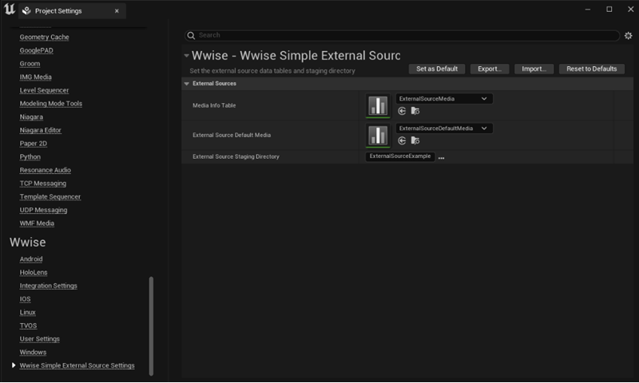

## Media Info Table

Media Info Table 中的条目具有以下属性：

- **Name**：必须与 **ExternalSourceMediaInfoId** 匹配。用于在表格中实施查询。
- **ExternalSourceMediaInfoId**：用于在管理器中追踪媒体的唯一 ID。
- **MediaName**：用于在磁盘上查找文件的文件名称（带有扩展名）。同时由管理器在按名称设置媒体的情况下查找媒体 ID。
- **CodecID**：用于对媒体数据进行解码的 ID。参见 `AkGameplayTypes.h` 中的 `AkCodecId` 枚举值。
- **bIsStreamed**：决定是对媒体进行流传输还是将其加载到内存中。
- **bUseDeviceMemory**：决定是否使用设备专用内存。仅适用于内存中的媒体。
- **MemoryAlignment**：所要使用的内存对齐方式。仅适用于内存中的媒体。
- **PrefetchSize**：所要预取的数据量（以字节为单位）。仅适用于流媒体。

## External Source Default Media

Default Media Table 中的条目具有以下属性：

- **Name**：必须与 `ExternalSourceCookie` 匹配。用于在表格中实施查询。
- **ExternalSourceCookie**：External Source 的唯一 ID（可在 Wwise 设计工具或 SoundBank 元数据中找到）。
- **ExternalSourceName**：用于日志记录。
- **MediaInfoId**：必须与 **Media Info Table** 中的 `ExternalSourceMediaInfoId` 匹配。
- **MediaName**：用于日志记录。

# Understanding the Simple External Source Manager

在将 Simple External Source Manager 实例化时，其会读取 [Media Info Table](using_features_simpleexternalsourcemanager.html#using_features_simpleexternalsourcemanager_mediainfotable) 并填充相应的媒体元数据列表。同时，还会填充由媒体名称到媒体 ID 的映射以用于 [External Source Manager Blueprint 函数](using_features_simpleexternalsourcemanager.html#using_features_simpleexternalsourcemanager_blueprints) 。

Next, the [External Source Default Media](using_features_simpleexternalsourcemanager.html#using_features_simpleexternalsourcemanager_externalsourcedefaultmedia) is read, and External Source Cookie/media ID pairs are added to a map. This optional Data Table sets default media for External Sources to use in the game. 藉此，可减少 Blueprint 和函数对 `SetExternalSourceMedia` 方法的调用次数：若已经定义默认媒体，则只需将这些方法用于 External Source 来动态更改其媒体。

在 External Source Manager 加载 External Source（通常由加载的 `AkAudioEvent` 触发）时，将创建 State 结构以追踪引用 External Source 的素材数量并检查该映射。If a media pairing exists in the map, a state structure for the media is created or updated. Depending on the information read from the [Media Info Table](using_features_simpleexternalsourcemanager.html#using_features_simpleexternalsourcemanager_mediainfotable), the media is either loaded into memory from disk or, if it is streamed, the created state is registered to handle incoming streaming requests from the sound engine.

If an External Source Cookie/media ID pair is set during gameplay (for example, by the [External Source Manager Blueprint 函数](using_features_simpleexternalsourcemanager.html#using_features_simpleexternalsourcemanager_blueprints)), and if the External Source is already loaded, the media is loaded immediately. If the External Source is already mapped to a different media, the reference count of that media is decremented. 若引用计数为 0，则在停止播放后将其卸载。

All `PostEvent` calls that pass through the AkAudioDevice, including `PostEvent` calls from the Integration's Blueprint functions, call the External Source Manager's `PrepareExternalSourceInfos` method. 该方法会选择要在传递的 External Source Cookie 上发送的媒体。在操作成功或失败后，会调用 `BindPlayingIdToExternalSources` 方法，以将所有选定媒体与所发送 Event 的 Playing ID 绑定。同样，在 Event 完成播放时，会调用 `OnEndOfEvent` 方法。藉此，告知 External Source Manager 该 Playing ID 已不再使用相应媒体。

最后，`Cook` 方法支持对 External Source 媒体进行打包。在对使用 External Source 的 Event 进行打包时，会针对每个 External Source 调用 `Cook` 方法。在调用此方法时，Simple External Source Manager 会将所有媒体文件暂存到其 [Media Info Table](using_features_simpleexternalsourcemanager.html#using_features_simpleexternalsourcemanager_mediainfotable) 中以供打包。此操作只需执行一次，在此之后会设置标记。后续再调用 `Cook` 将不再执行任何操作。

|  |  |
| --- | --- |
|  | **注記：** 若直接通过 WwiseSoundEngine API 来随 External Source 一起发送 Event，请确保在适当时机实现 External Source Manager 的 `PrepareExternalSourceInfos`、`BindPlayingIdToExternalSources` 和 `OnEndOfEvent`。Otherwise, if you switch the media an External Source uses while it is playing, the previous media might be unloaded prematurely, which could cause the sound engine to crash. 在较低层级，您也可以覆盖 I/O Hook 并自行管理文件。 |

section using\_features\_simpleexternalsourcemanager\_updating 更新 Data Table

在修改磁盘上的 Data Table 并打开 Unreal Editor 时，会对其内容进行重新解析。在此之后，将卸载并重新加载所加载的全部 Wwise Event 素材。这种粗暴的方法可确保正确更新 External Source Manager 的状态。而且，实现起来也最为简单。

# External Source Manager Blueprint 函数

To update the mapping between External Sources and media, use one of the Blueprint functions to set External Source media.

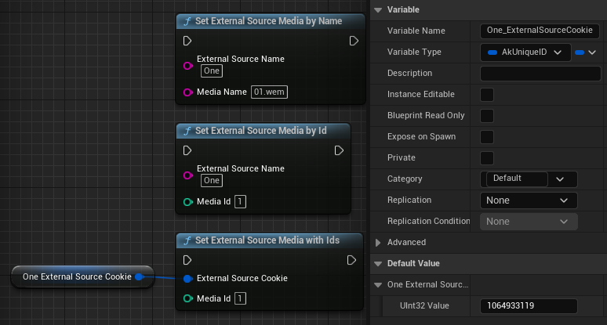

您可以根据个人偏好使用以下三个 Blueprint 函数来按名称或 ID 指定媒体：

- **SetExternalSourceMediaById**：使用 External Source 名称指定 External Source，并使用 `MediaID` 指定媒体。
- **SetExternalSourceMediaByName**：使用 External Source 名称指定 External Source，并使用 [Media Info Table](using_features_simpleexternalsourcemanager.html#using_features_simpleexternalsourcemanager_mediainfotable) 中的 `MediaName` 指定媒体。
- **SetExternalSourceMediaWithIds**：使用 External Source `Cookie` 指定 External Source，并使用 `MediaID` 指定媒体。

When you set an External Source media with strings, the `Cookie` is determined by a hash of the name string. 通过查询解析 **Media Info Table** 时填充的映射中的媒体名称检索 `MediaID`。

|  |  |
| --- | --- |
|  | **注記：** Blueprint 仅可使用有符号短整数。为了规避这一限制，我们使用了 `FAkUniqueID` 变量来设置 External Source Cookie 值。 |

# Using the External Source Manager API

开发者可采用两种方式来通过代码设置 External Source：调用前面章节中所述的 Blueprint 函数，或者检索 External Source Manager 实例并直接调用其方法。Wwise Simple External Source Manager 中的大多数方法都是虚拟的，因此开发者可在新的模块中对此管理器进行扩展以使用自己的数据结构和逻辑来追踪媒体并与 External Source 配对。

# Limitations

Simple External Source Manager 设计的主要限制是 [Media Info Table](using_features_simpleexternalsourcemanager.html#using_features_simpleexternalsourcemanager_mediainfotable) 对跨平台游戏来说不够灵活。不同的平台使用不同的编解码器对媒体进行解码，但 Media Info Table 的结构无法提供相应支持。其中一种潜在解决方案是在对管理器进行扩展时创建特定于平台的 Media Info Table 并根据构建目标对正确的 Media Info Table 进行打包。

When streaming, External Sources have more limitations than internally packaged media. Zero latency is not possible with External Sources, and the prefetched data is only provided to the sound engine when it is requested for playback. There is a playback delay between the initial PostEvent and the actual sample processing, which would occur with any media that do not have zero latency.###### Media Info Table

###### External Source Default Media

##### 启用 Simple External Source Manager

##### 设置

##### Understanding the Simple External Source Manager

##### External Source Manager Blueprint 函数

##### Using the External Source Manager API

##### Limitations

#### Enabling Reference-Loaded Switch Container Media

#### 技术细节

### Optimizing Memory Usage with Reference-Loaded Switch Containers

|  |
| --- |
| Wwise Unreal Integration Documentation |

Optimizing Memory Usage with Reference-Loaded Switch Containers

|  |  |
| --- | --- |
|  | **注記：** Before version 2022.1 of the Wwise Unreal 集成, this feature was called the "Split Switch Container Media". |

By default, when Wwise Event assets are loaded, all resources they might use (SoundBanks and media) are loaded with them. In deep, nested switch container hierarchies, a large number of media resources can be loaded, and the amount of memory required to load these resources increases accordingly. You can use reference-loaded switch containers on a per-event basis to optimize memory usage: when enabled, resources are only loaded if they are referenced, based on Switch or State values.

If the media in your Switch Container is streamed, which is common for large music files, this feature improves performance because the files are only opened for streaming when necessary. Memory usage is also reduced if the media has a prefetch chunk.

This feature is only available for certain Events that use Switch Containers. It provides the most benefits for Events used in several different contexts, and that only use a subset of the container's Switch values in each context.

例如：

- 主角的脚步声 Event 可能包含较深的层级结构，其取决于多个 Switch（如鞋子类型、地面材质和天气状况）。However, most maps only contain a subset of materials or weather conditions. Similarly, the character typically only wears one type of footwear at a time, so loading sounds for all other footwear types are unnecessary.
- Different branches of a dynamic music system based on Switch Containers could depend on Switches or States that are only used in specific maps.

The following image shows a Footstep Event dependency tree:

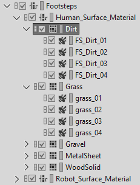

If the active level references the Human\_Surface\_Material Switch and only references the Material\_Dirt Switch Value (through a SetSwitch node in the Level Blueprint, for example), only the FS\_Dirt\_[01-04] media files are loaded into memory. When a sublevel that references Material\_Grass is loaded, grass\_[01-04] media files are automatically loaded with the Switch.

|  |  |
| --- | --- |
|  | **警告：** When this option is enabled, Switch or State values are loaded in memory to determine which media to load. Be cautious in the following cases:   - **Setting State or Switch Values with strings**. You must ensure that the corresponding Switch or State value asset is loaded, for example by using the [Load Asset](https://dev.epicgames.com/documentation/en-us/unreal-engine/BlueprintAPI/EditorScripting/Asset_1/LoadAsset) Blueprint Node. - **Setting State or Switch Values from C++**. You must ensure that the corresponding Switch or State Value asset is loaded, for example by using Unreal Engine [Asynchronous Asset Loading](https://dev.epicgames.com/documentation/en-us/unreal-engine/asynchronous-asset-loading). - **Using RTPC-Controlled Switch Containers**. This type of container causes inconsistencies when loading media. Avoid using this option if you are using RTPC-Controlled Switch Containers.   In addition, be careful when loading and setting Switches or States in submaps or menus. When those levels are unloaded, the Switch or State Value assets will probably be unloaded as well if they are not referenced in the persistent level, which causes their associated media to be unloaded. 若 Switch Value 或 State Value 仍然设在场景中的 GameObject 上，很可能会产生不符合预期的行为。 |

# Enabling Reference-Loaded Switch Container Media

每个 [UAkAudioEvent](pg_features_objects_assets.html#features_objects_classes_UAkAudioEvent) 都包含 [FWwiseEventInfo](pg_features_objects_assets.html#features_objects_classes_FWwiseEventInfo) 结构，以此识别其所代表的 Wwise Event。The WwiseEventInfo structure also contains the SwitchContainerLoading field, which can enable reference-loaded Switch Container media.

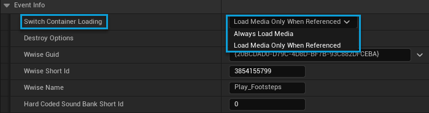

.

When set to **AlwaysLoad**, the default mode for all Events, all media resources are loaded with the Event. When set to **LoadOnReference**, only the referenced media resources are loaded with the Event.

# 技术细节

When this option is activated and a Wwise Event asset is cooked by the WwiseResourceCooker, its cooked data contains a set of SwitchContainerLeaves. 这些 Leaf 是由一系列不同的 Switch Value 或 State Value 到所要加载的媒体和 SoundBank 的扁平映射。As seen in the previous example, the FS\_Dirt\_[01-04] media are only needed if the Human\_Surface\_Material and Material\_Dirt Switches Values are loaded as well. This is represented by a SwitchContainerLeaf with a "key" formed by the pair of Human\_Surface\_Material and Material\_Dirt switches and a payload of FS\_Dirt\_[01-04] media to load. 在通过 WwiseResourceLoader 加载 Wwise Event 时，会将与之对应的一组 SwitchContainerLeaf 添加到 WwiseResourceLoader 针对各个已知 Switch Value 和 State Value 追踪的 Leaf 列表中。When Switch and State Values are loaded (or unloaded) by the WwiseResourceLoader, it checks its list of known SwitchContainerLeaves associated with that value to see if any media need to be loaded (or unloaded).

|  |  |
| --- | --- |
|  | **注記：** 只有在通过 WwiseResourceLoader 加载 Event、Switch 和 State 素材时，才会对媒体依赖关系进行评估。Setting and unsetting Switches or States in the Sound Engine does not cause media to be loaded or unloaded. |

When a Default Value is set on a Switch Container, the resources that only depend on Default Values are always loaded. The same behavior applies to the Generic Path that can be set in Music Hierarchy Switch Containers. In these cases, resources such as SoundBanks and Media are not put in SwitchContainerLeaves. Instead, they are always loaded with with Events that use those Switch Containers.

This system is easiest to work with when you use Blueprints and Wwise assets to post Events and set Switch and State Values. In this case, the assets are loaded in memory with the level so the WwiseResourceLoader does not miss any information. To optimize memory usage even more, you can also disable the **AutoLoad** property exposed by [UAkAudioType](pg_features_objects_assets.html#features_objects_classes_UAkAudioType), available in all Wwise assets. 在禁用此选项时，必须调用各个素材的 **LoadData** 和 **UnloadData**（可在 Blueprint 中找到）方法以便 WwiseResourceLoader 予以加载和卸载。

最后，在尝试利用字符串在声音引擎中发送 Event 或设置 Switch 和 State 时，游戏设计师需要确保 WwiseResourceLoader 已经加载必要的资源。This likely requires the relevant Event, Switch Value, and State Value assets to be manually loaded (or referenced in maps or Blueprints). However, it is possible to build Switch or State Value CookedData programmatically, and then load and unload them in the WwiseResourceLoader instead of assets.

### Using the Level Sequencer

|  |
| --- |
| Wwise Unreal Integration Documentation |

Using the Level Sequencer

The Unreal Engine's Sequence Editor is a cinematic editing tool. You can use it to add Tracks that modify certain Actor properties in a level.

Refer to the following topics for background information on the Sequencer:

- For instructions on how to create a Level Sequence, refer to [Sequencer Overview](https://dev.epicgames.com/documentation/en-us/unreal-engine/unreal-engine-sequencer-movie-tool-overview).
- For instructions on how to add Tracks to a Level Sequence, refer to the Adding Tracks section on the [Tracks](https://dev.epicgames.com/documentation/en-us/unreal-engine/sequencer-track-list-in-unreal-engine) page.

# Setting up Your Wwise Project

To ensure that Event lengths are properly represented in the AkAudioEvent Tracks, you must configure the Wwise project to estimate the duration of its audio Events and generate JSON metadata.

**To set up your Wwise project:**

1. Open the project in Wwise Authoring.
2. From the menu bar, click **Project > Project Settings**. The Project Settings dialog opens.
3. On the SoundBanks tab, enable the following options:
   - **Estimated Duration**
   - **Generate JSON Metadata**

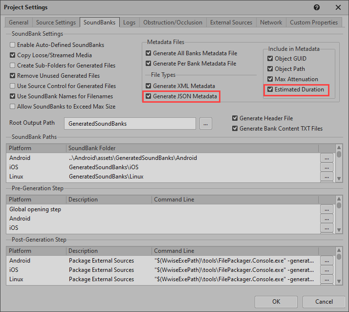

AkAudioEvent Track 所需的 Project Settings 配置

# Using Wwise Level Sequencer Tracks

The Wwise Integration adds two Tracks to the Sequencer:

- **WwiseGameParameter**, which sets Game Parameter values.
- **AkAudioEvent**, which posts Wwise Events.

You can add both of these Tracks as Master Tracks or associate them with Actors. When associated with Actors, they perform Wwise-related functions on the `UAkComponent` attached to the Actor. When created as Master Tracks, the **WwiseGameParameter** Track sets global Game Parameter values, and the **AkAudioEvent** Track posts Events on a dummy game object.

For **WwiseGameParameter** Tracks, you can modify Game Parameter curves with the built-in curve editor. To add key frames, place the cursor in the desired location and click **Add New Key** on the right side of the listed Track.

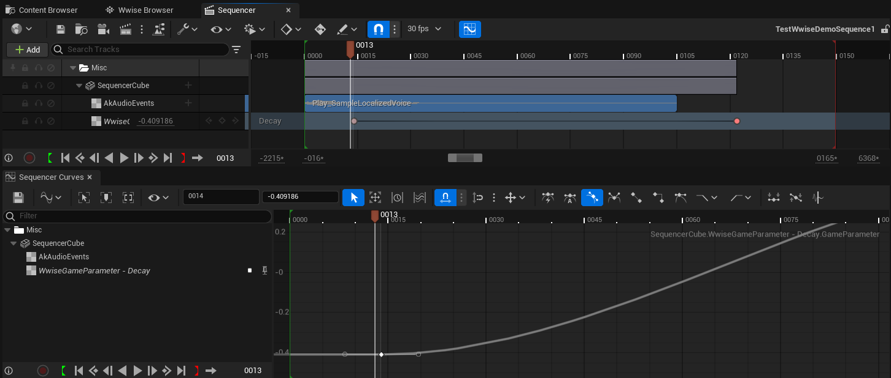

A Wwise Game Parameter track in the Curve Editor view

|  |  |
| --- | --- |
|  | **注記：** The values in this curve represent the Game Parameters sent to Wwise through SetRTPC. They are not the values in the [RTPC graph](https://www.audiokinetic.com/en/library/edge/?source=Help&id=mapping_values_in_rtpc_graph) itself, but are instead the input to the RTPC graph as defined in your Wwise project. |

For **AkAudioEvent** Tracks, you can add [`AkAudioEvent`](pg_features_objects_assets.html#features_objects_classes_UAkAudioEvent)  sections. To do so, place the cursor at the desired location and click **AkAudioEvent** on the right side of the listed Track. Alternatively, you can drag [`AkAudioEvent`](pg_features_objects_assets.html#features_objects_classes_UAkAudioEvent)  assets from the Content Browser directly onto an **AkAudioEvent** Track.

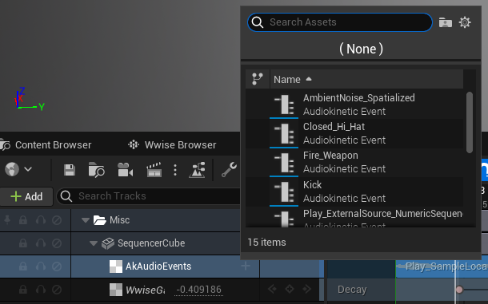

将AkAudioEvent Section 添加到 AkAudioEvent Track

# Displaying Waveforms for Wwise Events

Unreal Integration 使用 Wwise Authoring API (WAAPI) 扩展 Sequencer 功能。For more information about WAAPI and its use in the Unreal integration, refer to [Wwise Authoring API (WAAPI)](using_features_waapi.html). When Unreal is connected to the Wwise Authoring tool through WAAPI, AkAudioEvent sections can display waveforms for Wwise events. When Wwise Authoring is not open, or the Unreal integration is not connected to WAAPI, the AkAudioEvent sections only display the Event name.

## Viewing AkAudioEvent Section Waveforms

**AkAudioEvent** Section 针对包含 Audio Source 的 Event 显示音频波形。The waveform in an **AkAudioEvent** section shows the audio data for the longest Audio Source contained in the Wwise Event. In the following example, a Wwise Event called "Play\_Sound" contains three Audio Sources: "Layer\_1", "Layer\_2", and "Layer\_3".

示例 – Wwise Event 包含三个 Audio Source

If an **AkAudioEvent** section is added and its Event property is set to "Play\_Sound", then the longest of the three Audio Sources is displayed within the section. Note that the waveform might be followed by empty space if the Wwise Event lasts longer than the longest Audio Source that it contains. In this example, because the "Play\_Sound" Event has two delayed play actions (for "Layer\_2" and "Layer\_3"), it lasts longer than the "Layer\_1" audio source that it contains. 波形后面的空白区指示了 SoundBank 生成期间计算得出的 Wwise Event 的最大预计时长（参见 [Setting up Your Wwise Project](using_features_sequencer.html#wwise_project_setup) 章节）。

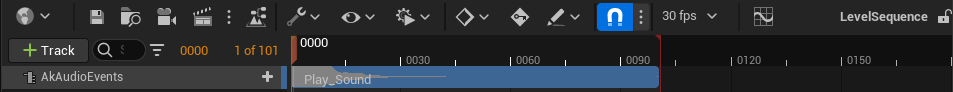

示例 – Sequencer 中的 AkAudioEvent Section

If the length of the **AkAudioEvent** section exceeds the maximum estimated duration of the Wwise Event, the section contains either a flat white line or repeating diagonal lines. 白色直线表示禁用了 **Retrigger** 属性。斜线组表示启用了 **Retrigger** 属性。The **Retrigger** property determines whether Wwise events are retriggered in the Sequencer after they finish (refer to [AkAudioEvent Section 属性](using_features_sequencer.html#wwise_level_sequencer_event_section_properties)).

Sequencer 中有两个 **AkAudioEvent** Section 。Retrigger is enabled in the 'Retrigger' section and disabled in the 'No\_Retrigger' section.

## Fixing "Out of Sync" Waveforms

If you change the content of an Event in the Wwise Project, for example by changing the source file of its corresponding SFX or voice, and those changes are not reflected in the generated SoundBanks, any **AkAudioEvent** sections for that event are marked as "out of sync". The waveform is displayed in red, and an asterisk is appended to the name of the AkAudioEvent section. Warnings are also printed to the output log when Events are triggered from "out of sync" sections.

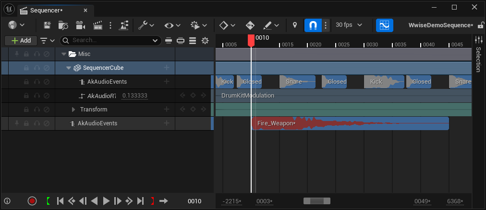

示例 – Out of Sync AkAudioEvent Section

To ensure that **AkAudioEvent** sections remain synchronized with the Wwise project, there are options to save the project and regenerate SoundBanks directly from the Sequencer. To synchronise all of the sections in an **AkAudioEvent** track, open the track's context menu (right click) and click **Save Wwise project and refresh all sections** (see [AkAudioEvent Track 上下文菜单选项](using_features_sequencer.html#wwise_level_sequencer_event_track_context_menu)).

# Scrubbing Tracks

The Sequencer integration supports scrubbing forwards and backwards over **AkAudioEvent** tracks. Drag the Sequencer playhead over **AkAudioEvent** sections to hear scrub snippets. To change the length of these scrub snippets, right-click the **AkAudioEvent** section and in the context menu, click **Scrub Tail Length Ms**. Refer to [AkAudioEvent Section 属性](using_features_sequencer.html#wwise_level_sequencer_event_section_properties) for more details.

# AkAudioEvent Track 上下文菜单选项

From the **AkAudioEvent** track, right-click to open a context menu that includes the following Audiokinetic-specific option:

- **Save Wwise project and refresh all sections**: Saves the Wwise project in Wwise Authoring and regenerates SoundBanks for all AkAudioEvent sections in the Sequencer track. The section waveforms are then updated.

# AkAudioEvent Section 上下文菜单选项

From the **AkAudioEvent** section on the track, right-click to open a context menu that includes the following Audiokinetic-specific option:

- **Match section length to Wwise event length**: Matches the length of the section in the Sequencer track to the duration of the Wwise Event.

## AkAudioEvent Section 属性

The property list in the context menu includes the following Wwise-specific section properties:

- **Ak Audio Event**：针对所选 Section 列出 AkAudioEvent 的以下可编辑属性：
  - **Event:** Audiokinetic Event. Open this list to create a new Audiokinetic Event, or drag in an existing event from the Content Browser or from the [Wwise Browser](features_editor_wwise_browser.html)
  - **Retrigger Event**: When enabled, the Wwise event in the Section is retriggered when the Sequence plays beyond the end of the event. Disabled by default.
  - **Scrub Tail Length Ms**: Sets the duration in milliseconds of the scrub snippets that are played when scrubbing over the sequence. Default is 100ms.
  - **Max Source Duration**：显示 Wwise Event 中所含的最长 Audio Source 的时长（只读）。
  - **Stop at Section End**: Clear this box to keep the Event playing when the end of the section is reached. 该项默认设为启用状态。

# Known Issues and Limitations

In general, we recommend that you use very simple AkAudioEvent sections in the Level Sequencer, such as a simple Play action on a Sound SFX. Avoid more complex Wwise Events such as those that contain delayed actions, Seek actions, or which reference Random Containers, Sequence Containers, and other non-deterministic objects. If you do use such Events, divide them into simpler events for optimal use in the Level Sequencer.

Scrubbing and playing from cursor does not work as expected on Events with delayed actions or that contain infinitely looping sounds.

## Play In Editor 限制

If a level sequence is played from the Sequencer editor window while Unreal is running in Play in Editor (PIE) mode, any AkAudioEvent tracks that are associated with game objects do not trigger events. To hear AkAudioEvent tracks that are bound to game objects, you must trigger the level sequence from the Game World.

## Replication Limitations

**AkAudioEvent** and **WwiseGameParameter** tracks are triggered only on the server and are not replicated to clients.##### Viewing AkAudioEvent Section Waveforms

##### Fixing &quot;Out of Sync&quot; Waveforms

##### AkAudioEvent Section 属性

##### Play In Editor 限制

##### Replication Limitations

#### Setting up Your Wwise Project

#### Using Wwise Level Sequencer Tracks

#### Displaying Waveforms for Wwise Events

#### Scrubbing Tracks

#### AkAudioEvent Track 上下文菜单选项

#### AkAudioEvent Section 上下文菜单选项

#### Known Issues and Limitations

### 使用 Wwise Unreal Niagara Integration

|  |
| --- |
| Wwise Unreal Integration Documentation |

使用 Wwise Unreal Niagara Integration

### 目录

- [激活插件](#using_features_niagara_activating_plugin)
- [Niagara Wwise Event Data Interface](#using_features_niagara_datainterface)
- [Niagara 模块](#using_features_niagara_datainterface_modules)
  - [Post Wwise Event at Location](#using_features_niagara_datainterface_modules_post_at_location)
  - [Post Wwise Persistent Event](#using_features_niagara_datainterface_modules_post_persistent_event)
  - [Update Wwise Persistent Event Position](#using_features_niagara_datainterface_modules_update_position)
  - [Update Wwise Persistent Event Rotation](#using_features_niagara_datainterface_modules_update_rotation)
  - [Set Wwise Persistent Event Game Parameter](#using_features_niagara_datainterface_modules_set_gp)
  - [Stop Wwise Persistent Event](#using_features_niagara_datainterface_modules_stop)
  - [Pause Wwise Persistent Event](#using_features_niagara_datainterface_modules_pause)
- [有关限制活跃 Event 的技巧](#using_features_niagara_concurrency)
- [将粒子数据导出到 Blueprint](#using_features_niagara_export_particle_data)
- [Wwise Niagara 示例](#using_features_niagara_samples)
- [在旧的 Unreal 版本中使用 Wwise Niagara 模块](#using_features_UE4)
  - [Post Wwise Event at Location](#using_features_UE4_post_at_location)
  - [Post Persistent Wwise Event](#using_features_UE4_post_persistent_event)
  - [Update Persistent Event Position](#using_features_UE4_update_position)
  - [Update Persistent Event Rotation](#using_features_UE4_update_rotation)
  - [Set Persistent Event Game Parameter](#using_features_UE4_set_gp)
  - [Stop Persistent Wwise Event](#using_features_UE4_stop)
  - [Pause Persistent Wwise Event](#using_features_UE4_pause)

您可以使用 Unreal 的 Niagara VFX 系统并参照其可视化编程范例来构建复杂的特效系统。For additional information about the Niagara system, refer to the [Niagara Overview](https://dev.epicgames.com/documentation/en-us/unreal-engine/overview-of-niagara-effects-for-unreal-engine).

Wwise Unreal 集成 提供有必要的代码和 Niagara 模块以便在 Niagara 系统内发送和更新 Wwise Event。

# 激活插件

该插件可作为 Engine 或 Game 插件来安装。它会随 Wwise Unreal Engine Integration 插件一起自动安装。 在安装插件后，可在 Unreal Editor 中将其激活。若要激活，请依次选择 **Edit > Plugins**，然后选择 **Wwise Niagara Integration**。

# Niagara Wwise Event Data Interface

Unreal 集成 包含用于 Wwise Event 的 Niagara Data Interface。藉此，可在 Niagara 系统中引用 Wwise Event 和 Game Parameter 素材。此 Data Interface 仅与 Niagara CPU 模拟兼容。您可以使用其来发送一次性和持续性 Event 并在模拟过程中予以控制。对于持续性 Event，数据接口会追踪内部的 Audio Handle，并以此来将粒子或发射器实例映射到所发送的 Event。

|  |  |
| --- | --- |
|  | **注記：** 若要在 GPU 模拟中使用 Wwise Event，则可使用 Export Particle Data 模块（如 [将粒子数据导出到 Blueprint](using_features_niagara.html#using_features_niagara_export_particle_data) 中所述）。 |

**参数：**

- **Event to Post**（*必选*）：所要发送的 AkAudioEvent 素材。
- **Max Posts Per Tick**（*默认：10*）：设置每个时钟周期最多发送多少个 Event。若有更多的粒子尝试在给定时钟周期内播放声音，在达到限值前会一直播放声音，其余的将被弃用。
- **Stop when Component is Destroyed**（*默认：True*）：在 Niagara 组件被销毁（粒子消亡或系统停止或销毁）时停止 Event。在组件被销毁时，循环声音必然会停止。
- **Only Active During Gameplay**（*默认：False*）：仅在游戏过程中处理声音；在打开的 Viewport 中使用 Realtime Rendering 时不处理。在预览窗口中操作而不想听到声音的情况下，该功能会非常有用。
- **Game Parameters**：在 Set Wwise Persistent Event Game Parameter 模块中通过索引来更新的一组 Game Parameter。

# Niagara 模块

Niagara Wwise Event Data Interface 提供各种函数以便发送 Event 并更新其播放和 GameObject 参数。这些函数可在 Niagara 模块中使用，但不可直接用在 Niagara 发射器堆栈中。集成包内包含一组基础 Niagara 模块，其可将这些函数暴露给 Niagara 堆栈。

|  |  |
| --- | --- |
|  | **注記：** 这些模块包含在插件内。因此，在将新的模块添加到脚本时，必须选择 *Plugins* 筛选器以便将其显示在 *Add new Module* 选择框中。 |

## Post Wwise Event at Location

**参数：**

- **Post Event Condition**（*默认：True*）：必须满足该布尔条件才能发送 Event。
- **Position**（*默认：System/Emitter/Particle Position*）：所发送 Event 的空间位置。
- **Rotation**（*默认：0*）：所发送 Event 的空间旋转。
- **Wwise Event Data**（*必选*）： [Niagara Wwise Event Data Interface](using_features_niagara.html#using_features_niagara_datainterface) 。
- **Position Coordinate Space**（*默认：Simulation*）：Position 坐标所用的坐标系。在设为 Simulation 时，与 Emitter 设置保持一致（这时会将 World 坐标发送到 Wwise）；在设为 Local 时，使用相对于发射器的位置；在设为 World 时，使用 World 坐标系。

**行为：**

此模块用于发送一次性 Event（在粒子或发射器的生命周期内无需进行管理）。 它会在给定位置的临时 GameObject 上以既定朝向发送 Event。

|  |  |
| --- | --- |
|  | **注記：** 无法通过这种方式来发送无限时长的 Event，因为必须调用 StopAll() 才能停止此类 Event。 |

|  |  |
| --- | --- |
|  | **警告：** 在短时间内通过粒子系统发送大量 Wwise Event 可能会导致声音引擎过载。务必限制系统每帧可发送的 Event 数量或在 Wwise 工程中[设置 Playback Limit](https://www.audiokinetic.com/library/edge/?source=Help&id=limiting_object_playback_instances)。 |

## Post Wwise Persistent Event

**参数：**

- **Post Event Condition**（*默认：True*）：必须满足该布尔条件才能发送 Event。
- **Position**（*默认：System/Emitter/Particle position*）：所发送 Event 的空间位置。
- **Rotation**（*默认：0*）：所发送 Event 的空间旋转。
- **Wwise Event Data**（*必选*）： [Niagara Wwise Event Data Interface](using_features_niagara.html#using_features_niagara_datainterface) 。其会在更新时引用持续性 Event。
- **Position Coordinate Space**（*默认：Simulation*）：Position 坐标所用的坐标系。在设为 Simulation 时，与 Emitter 设置保持一致（这时会将 World 坐标正确发送到 Wwise）；在设为 Local 时，使用相对于发射器的位置；在设为 World 时，使用 World 坐标系。

**行为：** 在给定位置按照既定旋转设置创建 AkComponent 并针对该组件发送所提供的 Event。在更新循环过程中，由模块保持所发送的给定 Event 的 AkComponent 处于活跃状态。这样可确保在粒子消亡或被剔除时销毁 AkComponent 而不会泄漏内存。 若未在 Update 脚本（System、Emitter、Particle）中更新模块，则销毁 AKComponent。在这种情况下，会在发送后播放一帧的音频并立即终止。 系统会根据 Niagara Wwise Event Data Interface 上的 **Stop when Component is Destroyed** 设置来决定是否在销毁组件时停止所发送的 Event。

若在 Niagara 系统的 **Update** 阶段放置此模块，则在满足 Post Event Condition 时每个实例（发射器或粒子）仅发送一次 Event，同时保持 AkComponent 处于活跃状态。若在 Update 阶段使用了其他持续性 Event 模块，则其会保持 AkComponent 处于活跃状态。这时可在发射器堆栈的 **Spawn** 阶段放置 Post Persistent Event 模块。

|  |  |
| --- | --- |
|  | **注記：** 在使用 Persistent Event 时，必须在处理同一持续性 Event 的模块中为 Wwise Event Data 参数使用相同的属性。在使用相同的属性时，可在其他模块中使用与各个粒子关联的实例数据。该属性可处于 User、System 或 Emitter 层级。 |

您可以使用以下模块来控制持续性 Event 的播放、在 AkComponent 的 GameObject 上设置 Game Parameter、更新 AkComponent 的位置和朝向、在 Sound Engine 内更新 GameObject。

## Update Wwise Persistent Event Position

**参数：**

- **Position**（*默认：System/Emitter/Particle Position*）：所发送 Event 的空间位置。
- **Wwise Event Data**（*必选*）：对 Post Wwise Persistent Event 中设置的 Event Data 的引用。
- **Position Coordinate Space**（*默认：Simulation*）：Position 坐标所用的坐标系。在设为 Simulation 时，与 Emitter 设置保持一致（这时会将 World 坐标发送到 Wwise）；在设为 Local 时，使用相对于发射器的位置；在设为 World 时，使用 World 坐标系。

**行为：**

设置 AkComponent 的位置。

## Update Wwise Persistent Event Rotation

**参数：**

- **Rotation**（*默认：0*）：所发送 Event 的空间旋转。
- **Wwise Event Data**（*必选*）：Niagara Wwise Event Data Interface。

**行为：**

设置 AkComponent 的旋转。

## Set Wwise Persistent Event Game Parameter

**参数：**

- **Game Parameter Index**（*默认：0*）：Wwise Event Data 的 "Game Parameters" 数组中的 Game Parameter 的索引。
- **Game Parameter Value**（*默认：0*）：所需的 Game Parameter 值。
- **Wwise Event Data**（*必选*）：对 Wwise Event Data Interface 的引用。

**行为：**

在 AkComponent 的 GameObject 上设置 Game Parameter 值。

## Stop Wwise Persistent Event

**参数：**

- **Stop Condition**（*默认：True*）：若为 true，则停止播放 Event。
- **Wwise Event Data**（*必选*）：对 Wwise Event Data Interface 的引用。

## Pause Wwise Persistent Event

**参数：**

- **Pause Condition**（*默认：True*）：若为 true，则暂停播放 Event。若为 false，则继续播放。
- **Wwise Event Data**（*必选*）：对 Wwise Event Data Interface 的引用。

# 有关限制活跃 Event 的技巧

在设计用于发送 Wwise Event 的 Niagara 系统时密切监控 Wwise Profiler。在生成的粒子数量过多时使用 **Max Posts per Tick** 参数来对 SoundEngine 的负荷加以限制；不过，若音频 Event 足够长，仍有可能产生大量同时播放的声部。使用 [Wwise 工程中为对象设置的 Playback Limit](https://www.audiokinetic.com/library/edge/?source=Help&id=limiting_object_playback_instances)  来对粒子系统可以生成的声部数做硬性限制。

# 将粒子数据导出到 Blueprint

Export Particle Data 模块提供另一种将 Niagara 系统连接到 Wwise Sound Engine 的解决方案。此模块可将任意粒子数据导出到 Blueprint 并以此实现 Receive Particle Data 接口。在此之后，便可使用 Blueprint 中暴露的各种 Wwise Integration 功能。在默认情况下，Export Particle Data 模块会导出两个矢量和一个浮点值。藉此，可传递有关各个粒子的信息（如 Position、Velocity、Persistent ID 或 Age）。

# Wwise Niagara 示例

Wwise Integration Unreal Gyms 工程提供示例 Niagara 系统用以演示如何使用前述 Niagara Wwise Event Data 接口和模块，并提供 Niagara 系统和 Blueprint Actor 用以演示如何结合 CPU 和 GPU 粒子系统使用 Export Particle Data。

这些示例会发送遵循粒子轨迹的持续性 Event、在这些 Event 上设置 Game Parameter 并在粒子碰撞时发送一次性 Event。

|  |  |
| --- | --- |
|  | **注記：** The sample GPU particle system requires the Generate Mesh Distance Fields setting to be enabled. See [Mesh Distance Fields Properties](https://dev.epicgames.com/documentation/en-us/unreal-engine/mesh-distance-fields-properties-in-unreal-engine). |

# 在旧的 Unreal 版本中使用 Wwise Niagara 模块

所提供的 Niagara 模块与 Unreal 5.X 及更高版本兼容。若使用 Unreal 4，则仍可使用所提供的 Wwise Niagara 功能，但必须重新创建相关的 Niagara 模块。

为此，可创建 FX > Niagara Module Script 类型的素材。

## Post Wwise Event at Location

## Post Persistent Wwise Event

## Update Persistent Event Position

## Update Persistent Event Rotation

## Set Persistent Event Game Parameter

## Stop Persistent Wwise Event

## Pause Persistent Wwise Event

##### Post Wwise Event at Location

##### Post Wwise Persistent Event

##### Update Wwise Persistent Event Position

##### Update Wwise Persistent Event Rotation

##### Set Wwise Persistent Event Game Parameter

##### Stop Wwise Persistent Event

##### Pause Wwise Persistent Event

##### Post Wwise Event at Location

##### Post Persistent Wwise Event

##### Update Persistent Event Position

##### Update Persistent Event Rotation

##### Set Persistent Event Game Parameter

##### Stop Persistent Wwise Event

##### Pause Persistent Wwise Event

#### 激活插件

#### Niagara Wwise Event Data Interface

#### Niagara 模块

#### 有关限制活跃 Event 的技巧

#### 将粒子数据导出到 Blueprint

#### Wwise Niagara 示例

#### 在旧的 Unreal 版本中使用 Wwise Niagara 模块

### Providing Audio Input to Wwise

|  |
| --- |
| Wwise Unreal Integration Documentation |

Providing Audio Input to Wwise

The Unreal integration provides audio input to Wwise through the Wwise [Audio Input Source Plug-in](https://www.audiokinetic.com/library/edge/?source=SDK&id=referencematerial__audioinput.html). In order to provide audio input to Wwise, classes must inherit from `AkAudioInputComponent`.

# AkAudioInputComponent

`AkAudioInputComponent` 由 [AkComponent](pg_features_objects_components.html#features_akcomponent) 派生。It is a specialized `AkComponent` that you can use to provide audio input to Wwise. To do so, you must implement two key functions:

/\* 音频回调。此回调将由 Wwise 声音引擎连续调用，并用于为声音引擎提供音频采样。

\*/

virtual bool FillSamplesBuffer(uint32 NumChannels, uint32 NumSamples, float\*\* BufferToFill);

/\* 此回调用于为 Wwise 声音引擎提供所需音频格式。\*/

virtual void GetChannelConfig(AkAudioFormat& AudioFormat);

`AkAudioInputComponent` also has one Blueprint function, **Post Associated Audio Input Event**, which posts the component's AkAudioEvent to Wwise along with the associated AudioSamples callback and AudioFormat callback, using this component as the game object source.

# Customizing Audio Input Behavior

You can write custom classes that derive from `AkAudioInputComponent` in order to implement custom audio input behavior. The following `UAkVoiceInputComponent.h` and `UAkVoiceInputComponent.cpp` examples show a class that takes microphone input and pipes it to the Wwise Sound Engine.

Before you can use these files in a C++ Unreal project, you must perform some initial setup. First, add the AkAudio and the Unreal Voice modules to the `PublicDependencyModuleNames` in the project's `Build.cs` file. 例如：

public class MyModule : ModuleRules

{

public MyModule(ReadOnlyTargetRules Target) : base(Target)

{

PublicDependencyModuleNames.AddRange(new string[] { "Core", "CoreUObject", "Engine", "InputCore", "AkAudio", "Voice" });

// 其他设置

}

}

Next, add the following lines to the `DefaultEngine.ini` file:

[Voice]

bEnabled=true

After these setup steps are complete, add the desired custom behavior. In the following example, a class takes microphone input and sends it to Wwise.

|  |  |
| --- | --- |
|  | **注記：** The sample code in this section is not intended for use in shipped games. It is only a short example of how to implement custom behavior. |

Here is an example of a customized `AkVoiceInputComponent.h` file:

#pragma once

#include "CoreMinimal.h"

#include "AkAudioInputComponent.h"

#include "Voice.h"

#include "AkVoiceInputComponent.generated.h"

/\*

\*/

UCLASS(ClassGroup = Audiokinetic, BlueprintType, hidecategories = (Transform, Rendering, Mobility, LOD, Component, Activation), meta = (BlueprintSpawnableComponent))

class WWISEDEMOGAME\_API UAkVoiceInputComponent : public UAkAudioInputComponent

{

GENERATED\_BODY()

UAkVoiceInputComponent(const class FObjectInitializer& ObjectInitializer);

virtual void TickComponent(float DeltaTime, enum ELevelTick TickType, FActorComponentTickFunction \*ThisTickFunction) override;

protected:

/\* 此函数会在 Wwise 声音引擎中注销此组件所属的 GameObject 后调用。\*/

virtual void PostUnregisterGameObject() override;

/\* 音频回调。此回调将由 Wwise 声音引擎连续调用，并用于为声音引擎提供音频采样。\*/

virtual bool FillSamplesBuffer(uint32 NumChannels, uint32 NumSamples, float\*\* BufferToFill) override;

/\* 此回调用于为 Wwise 声音引擎提供所需音频格式。\*/

virtual void GetChannelConfig(AkAudioFormat& AudioFormat) override;

/\* Unreal IVoiceCapture，用于获取话筒输入。\*/

TSharedPtr<IVoiceCapture> VoiceCapture;

/\* 此数组会在每次 Voice Capture 传入新的缓冲数据时重置和重写。\*/

TArray<uint8> IncomingRawVoiceData;

/\* 此数组会存管 Voice Capture 之前收集的所有音频数据。

在处理可用话筒数据时写入，在向 Wwise 引擎发送数据时读取并缩减。

建议不要缩减音频回调中的缓冲数据。请勿将此代码行用在发售的游戏中！\*/

TArray<uint8> CollectedRawVoiceData;

/\* 此标记用于阻止将话筒数据写入正被读取的已收集数据缓冲区。\*/

FThreadSafeBool bIsReadingVoiceData = false;

};

Here is an example of a customized `AkVoiceInputComponent.cpp` file:

#include "AkVoiceInputComponent.h"

UAkVoiceInputComponent::UAkVoiceInputComponent(const class FObjectInitializer& ObjectInitializer) :

UAkAudioInputComponent(ObjectInitializer)

{

CollectedRawVoiceData.Reset();

VoiceCapture = FVoiceModule::Get().CreateVoiceCapture();

}

void UAkVoiceInputComponent::TickComponent(float DeltaTime, enum ELevelTick TickType, FActorComponentTickFunction \*ThisTickFunction)

{

Super::TickComponent(DeltaTime, TickType, ThisTickFunction);

if (!VoiceCapture.IsValid())

{

return;

}

uint32 NumAvailableVoiceCaptureBytes = 0;

EVoiceCaptureState::Type CaptureState = VoiceCapture->GetCaptureState(NumAvailableVoiceCaptureBytes);

/\* IVoiceCapture 会在每次 Tick 时更新其 EVoiceCaptureState。

我们可以在两次 Tick 之间通过该状态来辨别是否真的有要收集的新数据。\*/

if (CaptureState == EVoiceCaptureState::Ok && NumAvailableVoiceCaptureBytes > 0)

{

uint32 NumVoiceCaptureBytesReturned = 0;

IncomingRawVoiceData.Reset((int32)NumAvailableVoiceCaptureBytes);

IncomingRawVoiceData.AddDefaulted(NumAvailableVoiceCaptureBytes);

uint64 SampleCounter = 0;

VoiceCapture->GetVoiceData(IncomingRawVoiceData.GetData(), NumAvailableVoiceCaptureBytes, NumVoiceCaptureBytesReturned, SampleCounter);

if (NumVoiceCaptureBytesReturned > 0)

{

/\* 在从收集的数据缓冲区读取数据时加以调节 \*/

while (bIsReadingVoiceData) {}

CollectedRawVoiceData.Append(IncomingRawVoiceData);

}

}

}

bool UAkVoiceInputComponent::FillSamplesBuffer(uint32 NumChannels, uint32 NumSamples, float\*\* BufferToFill)

{

if (!VoiceCapture.IsValid())

{

return false;

}

const uint8 NumBytesPerSample = 2;

const uint32 NumRequiredBytesPerChannel = NumSamples \* NumBytesPerSample;

const uint32 NumRequiredBytes = NumRequiredBytesPerChannel \* NumChannels;

int16 VoiceSample = 0;

uint32 RawChannelIndex = 0;

uint32 RawSampleIndex = 0;

bIsReadingVoiceData = true;

const int32 NumSamplesAvailable = CollectedRawVoiceData.Num() / NumBytesPerSample;

const uint32 BufferSlack = (uint32)FMath::Max(0, (int32)(NumSamples \* NumChannels) - NumSamplesAvailable);

for (uint32 c = 0; c < NumChannels; ++c)

{

RawChannelIndex = c \* NumRequiredBytesPerChannel;

for (uint32 s = 0; s < NumSamples; ++s)

{

if (s >= (NumSamples - BufferSlack) / NumChannels)

{

/\* 若 Wwise 引擎认为从 Voice Capture 收到的数据不足，则使用零来填补缺失采样。\*/

BufferToFill[c][s] = 0.0f;

}

else

{

/\* 将传入的话筒音频数据转换为带符号浮点数。\*/

uint32 RawSampleDataMSBIndex = s \* 2 + 1;

uint32 RawSampleDataLSBIndex = s \* 2;

VoiceSample = (CollectedRawVoiceData[RawSampleDataMSBIndex] << 8) | CollectedRawVoiceData[RawSampleDataLSBIndex];

BufferToFill[c][s] = VoiceSample / (float)INT16\_MAX;

}

}

}

const int32 NumBytesRead = (NumSamples - BufferSlack) \* NumBytesPerSample;

/\* 注意：建议不要缩减音频回调中的缓冲数据。请勿将此代码行用在发售的游戏中！\*/

CollectedRawVoiceData.RemoveAt(0, NumBytesRead);

bIsReadingVoiceData = false;

return true;

}

void UAkVoiceInputComponent::GetChannelConfig(AkAudioFormat& AudioFormat)

{

const int sampleRate = 16000;

AudioFormat.uSampleRate = sampleRate;

AudioFormat.channelConfig.SetStandard(AK\_SPEAKER\_SETUP\_MONO);

if (VoiceCapture.IsValid())

{

/\* 发送空白设备名称以使用默认设备。\*/

if (!VoiceCapture->Init(FString(""), AudioFormat.uSampleRate, AudioFormat.channelConfig.uNumChannels))

{

UE\_LOG(LogTemp, Error, TEXT("Failed to initialize device for voice input!"));

return;

}

VoiceCapture->Start();

}

}

void UAkVoiceInputComponent::PostUnregisterGameObject()

{

Super::PostUnregisterGameObject();

if (VoiceCapture.IsValid())

{

VoiceCapture->Stop();

VoiceCapture->Shutdown();

}

}

After you add the class to an Unreal project, you can create a custom Blueprint class that has an `AkVoiceInputComponent`, and can call the **Post Associated Audio Input Event** Blueprint function (from base class `AkAudioInputComponent`) to start sending microphone data to Wwise. The following image shows part of the Blueprint for a custom Blueprint class, based on `Actor`, that has an `AkVoiceInputComponent` called `AkVoiceInput`.

#### AkAudioInputComponent

#### Customizing Audio Input Behavior

### Combining Unreal and Wwise Audio with AudioLink

|  |
| --- |
| Wwise Unreal Integration Documentation |

Combining Unreal and Wwise Audio with AudioLink

Starting with version 5.1, Unreal includes a tool called [AudioLink](https://dev.epicgames.com/documentation/en-us/unreal-engine/audiolink). When you are developing audio for Unreal games, you can use Wwise or Unreal exclusively or, through AudioLink, use both systems together. This flexibility gives users the ability to create some sounds in Unreal during game development, but also use Wwise for advanced audio effects such as Spatial Audio.

In the context of the Wwise Unreal 集成, AudioLink can help two types of user:

- Wwise users who want to route Unreal Audio through Wwise.
- Unreal users who want to add Wwise features to their projects but also want to keep any Unreal audio work they have already completed.

In addition, after you enable AudioLink and configure your Unreal and Wwise projects appropriately, you can then listen to audio in Unreal and monitor the audio with the Wwise Profiler simultaneously.

# Selecting Audio Routing Options

There are several options for audio routing available in the Unreal Project Settings.

**To select an audio routing option:**

1. In Unreal, click **Edit** > **Project Settings**. The Project Settings dialog opens.
2. In the Wwise section, click **Integration Settings**. The Initialization section contains several audio routing options:  

   

   The Unreal Audio Routing menu contains the following options:
   - **Default**: Supports custom configurations and projects that were migrated from integration versions lower than 2022.1. If you select this option, you can manually select or clear the three checkboxes that follow. However, there are no limits on your selections or any automatic verification, so it is your responsibility to test your audio and ensure that your custom routing configuration works properly.
   - **Both Wwise and Unreal audio**: Use the Unreal audio system and the Wwise SoundEngine concurrently.  

     |  |  |
     | --- | --- |
     |  | **注記：** This option might not be compatible with all platforms. |
   - **Route through AudioLink**: Use AudioLink to route all Unreal audio sources to Wwise SoundEngine inputs. This option requires Unreal 5.1 or higher.
   - **Enable Wwise SoundEngine only**: Use Wwise for audio and disable the Unreal audio system.
   - **Enable Unreal Audio only**: Use Unreal Audio and disable the Wwise SoundEngine.

     |  |  |
     | --- | --- |
     |  | **注記：** After you select an option, do not change it. If you do, any existing AudioLink components will stop working. |
3. Select the desired audio routing option. For AudioLink, select **Route through AudioLink**.

# Setting Samples Per Frame and Callback Buffer Frame Sizes

After you enable AudioLink, some additional manual configuration might be required to ensure smooth audio playback during gameplay. You must ensure that platform-specific samples per frame values in Unreal correspond to callback buffer frame sizes in the Wwise project `.ini` files. Depending on your project settings and version of Wwise, you might not have to change anything but we recommend that you confirm that you follow the procedure anyway to confirm that the values are the same.

**To match the Unreal values with the Wwise configuration files:**

1. In Unreal, click **Edit** > **Project Settings**. The Project Settings dialog opens.
2. In the Wwise section, select a platform. The Wwise - {Platform} page opens.
3. Under Initialization > Common Settings, note the value of the Samples Per Frame setting:

   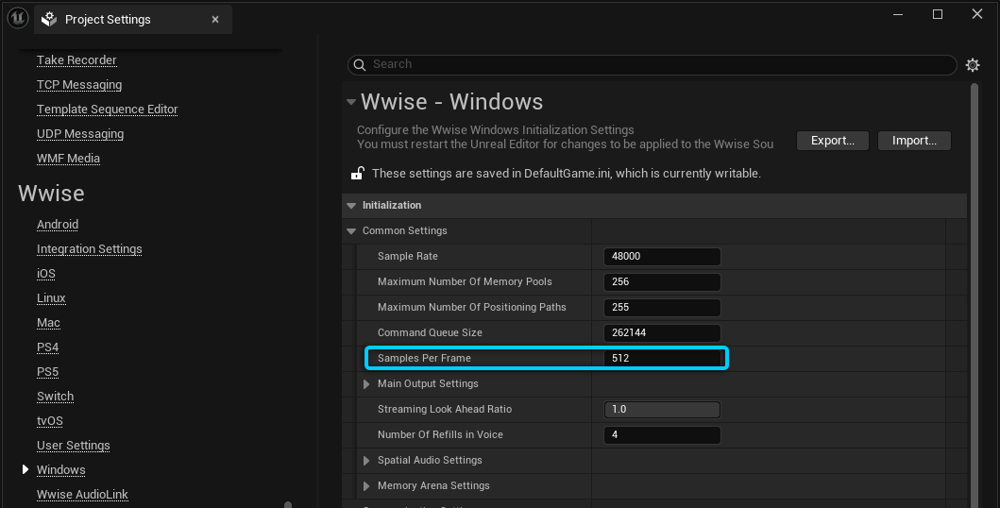
4. In Windows, navigate to the Unreal project directory and open the following files:
   - `..\{ProjectDirectory}\Config\DefaultEngine.ini`
   - `..\{ProjectDirectory}\Config\{Platform}\{Platform}Engine.ini` (if you have set platform-specific values)
5. Note the value of the `AudioCallbackBufferFrameSize` setting.
6. If the values in the `.ini` files are different than the values of the Samples Per Frame setting in Unreal, adjust one or the other as required to ensure that they match.
7. Repeat the preceding steps for all platforms in your project.

# Setting Default AudioLink Properties

AudioLink configuration settings determine its default behavior when enabled. The integration uses these default values unless there is an override asset associated with a particular Event (as described in [Overriding Default AudioLink Properties](using_audio_link.html#using_audio_link_override)).

Before you begin the following procedure, set up an [Audio Input Source Plug-in](https://www.audiokinetic.com/library/edge/?source=SDK&id=referencematerial_audioinput.html) in Wwise and create a Wwise "Play" Event that uses a Sound SFX with Audio Input as the source. This Event is required to ensure that the audio routing works correctly.

**To set default AudioLink properties:**

1. In Wwise, set up an [Audio Input Source Plug-in](https://www.audiokinetic.com/library/edge/?source=SDK&id=referencematerial_audioinput.html).
2. Create a Wwise "Play" Event that uses a Sound SFX with Audio Input as the source, then generate SoundBanks.
3. In Unreal, click **Edit** > **Project Settings**. The Project Settings dialog opens.
4. In the Wwise section, click **Wwise AudioLink**.
5. Set the following properties:
   - **Start Event**: Select the Wwise "Play" Event you created earlier.
   - **Should Clear Buffer on Receipt**: When selected, the receiving code clears the buffer after it is read so that Unreal doesn't render it. This setting only applies when both renderers are running simultaneously. 该项默认设为启用状态。
   - **Producer to Consumer Buffer Ratio**: The ratio of the producer to consumer buffer size. The default value is 2.0, which means that the producer buffer is twice as large as the consumer buffer.
   - **Initial Silence Fill Ratio**: The ratio of the initial buffer to fill with silence before consumption, which can prevent starvation at the cost of extra latency. The default value is 1.0.

# Overriding Default AudioLink Properties

You can create separate AudioLink assets for individual Wwise Events, which override the default settings.

**To override default AudioLink properties:**

1. In Wwise, create a "Play" Events with Audio Input as the source.
2. In the Unreal Content Browser, click **Add** > **Sounds** > **AudioLink** > **Wwise AudioLink Settings**. A Wwise AudioLink Settings asset is added to the Content Browser.
3. In the asset Details, set the Start Event to the newly created Wwise Event, and change any other property values as required.  

   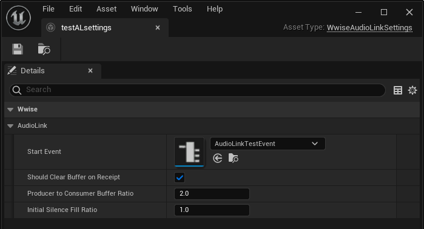

   You can now associate the custom settings with different audio assets.

# Connecting Unreal Audio to Wwise Audio Inputs

As with many aspects of the integration and Wwise in general, there are different ways to achieve the desired results. For example, you can create separate AudioLink assets for individual Wwise Events, which you can then use in Blueprints to play sounds and music as required.

**To use AudioLink on an audio asset:**

1. In the Unreal Content Browser, create an audio asset such as an Attenuation or Submix.
2. Edit the asset. The location of the AudioLink properties varies depending on the type of asset. The following image shows the AudioLink properties for an Attenuation asset:

   
3. To enable AudioLink, select **Send to AudioLink**. The asset now routes audio through AudioLink with the default AudioLink settings.
4. (Optional) To use custom AudioLink settings, use the options next to **AudioLink Settings Override** to select the desired Wwise AudioLink Settings asset.

   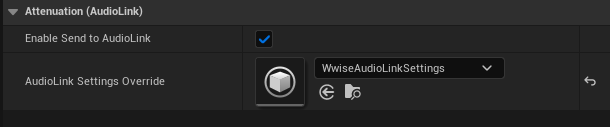

   The audio asset now uses custom AudioLink settings.
5. Add the audio asset to a Blueprint.

At this point, you can connect multiple Events to the same Blueprint or to others, and test the audio in Wwise through the Wwise Profiler (see [Profiling](https://www.audiokinetic.com/library/edge/?source=Help&id=profiling)).

There are other ways to work with AudioLink. Refer to the [Adventures With AudioLink](https://blog.audiokinetic.com/adventures-with-audiolink/) blog post for some more examples.#### Selecting Audio Routing Options

#### Setting Samples Per Frame and Callback Buffer Frame Sizes

#### Setting Default AudioLink Properties

#### Overriding Default AudioLink Properties

#### Connecting Unreal Audio to Wwise Audio Inputs

#### Logging

#### Stats

#### GeneratedSoundBanks Folder

#### 在烘焙或通过 Unreal Editor 生成 Bank 时会将其生成到哪里？

#### 为什么在 Unreal 中生成 SoundBank 时创建的 Bank 比在 Wwise 中生成 SoundBank 时多？

#### 我能使用 Wwise SoundEngine 调试库来调试代码吗？

#### 为什么在运行打包好的游戏时没有播放所有的声音？

#### 为什么我会收到关于几何构造 &quot;not watertight&quot; 的错误？

### Debugging Tips

|  |
| --- |
| Wwise Unreal Integration Documentation |

Debugging Tips

This topic contains tips and recommendations to help you debug your Wwise Unreal Integration projects.

# Logging

Integration 中的每个模块都有独立的详细级别。Log, Warning, and Error messages appear when something is wrong in most cases. If an error occurs, you can find which module produced the error and set the verbosity of that module's logs to **Verbose** or **VeryVerbose** to better understand why the error occurred. For example, **Verbose** or **VeryVerbose** can be helpful to diagnose asset loading and packaging problems.

您可以在 `DefaultEngine.ini` 文件的 `Core.Log` 部分更改各个模块的详细级别。A special logging category called `LogWwiseHints` is enabled by default across all modules, which warns about using deprecated functions and other bad habits.

以下为可能的详细级别：

- **Fatal**: Causes a crash when program execution cannot or should not continue, such as if required plug-in modules are not loaded.
- **Error**：在音频无法正常运行时阻止对游戏进行打包。
- **Warning**：指示非关键功能可能具有无法预测的行为。在必要时，还可阻止打包。
- **Display**：记录有关模块初始化的信息并提供 Commandlet 信息。
- **Log**：记录各种重要操作。
- **Verbose**：记录模块执行的所有操作。
- **VeryVerbose**：记录模块执行的每一步操作。

在以下示例中，可看到与各个模块关联的详细级别：

[Core.Log]

LogAkAudio=Verbose

LogAudiokineticTools=Log

LogWwiseAudioLink=Verbose

LogWwiseConcurrency=Verbose

LogWwiseFileHandler=Verbose

LogWwiseHints=Warning

LogWwiseResourceLoader=Warning

LogWwiseResourceCooker=Log

LogWwiseProjectDatabase=Log

LogWwiseSimpleExtSrc=Error

For more information about setting log verbosity and verbosity levels, see [Logging in Unreal](https://dev.epicgames.com/documentation/unreal-engine/logging-in-unreal-engine) and [ELogVerbosity::Type](https://dev.epicgames.com/documentation/unreal-engine/API/Runtime/Core/ELogVerbosity__Type).

# Stats

If you have issues with memory usage and performance, you can use the Stats in the low-level Wwise constructs to troubleshoot. Use the Unreal Frontend to start a profiling session, or use the Stats menu to enable real-time visualization of the available statistics. For example, the WwiseFileHandler stats have information about all currently loaded assets.

The Integration includes the following Stats:

- **AkAudioDevice**：记录有关 Post Event Async 调用的信息。
- **AkSoundBankGenerationSource**：记录与 SoundBank 生成相关的 WAAPI 调用。
- **WwiseConcurrency**: Logs information about memory used to manage multi-threading.
- **WwiseFileHandler**：记录有关所加载媒体、SoundBank 和外部源的信息。
- **WwiseFileHandlerLowLevelIO**：记录有关流播放声音的信息。
- **WwiseMemory**: Logs information about memory usage.
- **WwiseObstructionOcclusion**: Logs information about obstruction and occlusion calculations.
- **WwiseProjectDatabase**: Logs information about memory used by the WwiseProjectDatabase module.
- **WwiseResourceLoader**：记录有关被引用 AkType 的信息。
- **WwiseSoundEngine**：记录有关 API 调用的信息。

若要访问这些信息，请在 Unreal 的 Viewport Options 中选择感兴趣的 Stats。

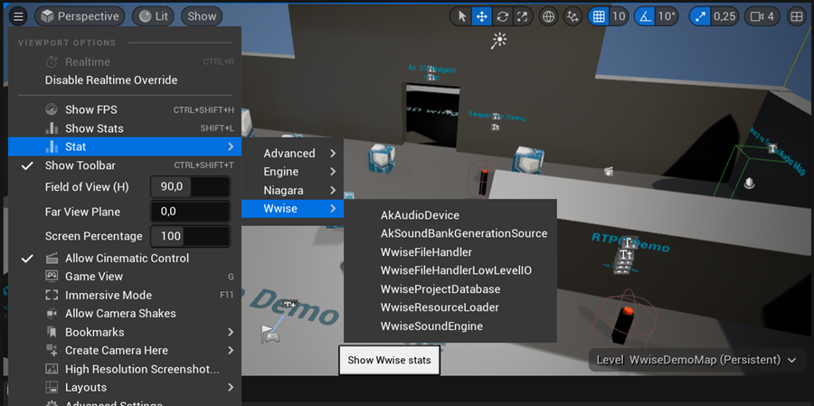

For more information about Stats, see [Stat Commands](https://dev.epicgames.com/documentation/unreal-engine/stat-commands-in-unreal-engine).

# GeneratedSoundBanks Folder

GeneratedSoundBanks 文件夹的路径通常与工程根目录相对。When using the editor with the `-Game` option, you might need to set the working directory to the same folder as the root that contains your `.uproject` file.

### 常见问题解答

|  |
| --- |
| Wwise Unreal Integration Documentation |

常见问题解答

# 在烘焙或通过 Unreal Editor 生成 Bank 时会将其生成到哪里？

在默认情况下，会将其生成到以下位置：

UE/[GameName]/Content/WwiseAudio/[Platform]

有些包含语言素材的 Bank 可能会生成到特定于语言的文件夹中。

# 为什么在 Unreal 中生成 SoundBank 时创建的 Bank 比在 Wwise 中生成 SoundBank 时多？

在导入 SoundBank 定义文件时，Unreal 可能会要求 Wwise 生成 Wwise 工程中没有的 Bank。若希望将 Unreal 生成的 Bank 保存到 Wwise 工程中，请在导入 SoundBank 定义文件时添加命令行参数 `-Save` 。

# 我能使用 Wwise SoundEngine 调试库来调试代码吗？

是。您可以在 Unreal 中使用 Debug 或 DebugGame 构建配置状态（其使用 Wwise SoundEngine 调试库）。有关详细信息，请参阅 [Unreal 和 Wwise SoundEngine 配置](building.html#building_configurations) 章节。

# 为什么在运行打包好的游戏时没有播放所有的声音？

若收到错误消息（比如 `Event ID not found: <id>`），则表示可能因为 Tree Shaking 而未将 Wwise Unreal 素材包含在数据包中。有关详细信息，请参阅 [Packaging Requirements](using_cpp.html#packaging_tree_shaking) 章节。

# 为什么我会收到关于几何构造 "not watertight" 的错误？

若使用 Spatial Audio Room，则可能遇到以下错误：[AK::SpatialAudio::SetGeometryInstance or AK::SpatialAudio::SetRoom: Geometry instances which are not watertight cannot be used for the definition of a room](https://www.audiokinetic.com/library/edge/?source=Help&id=ErrorCode_GeometryNotWatertight)。若 Room 的几何构造存在开口，则将出现此错误，即便开口小到无法立刻显现在 Unreal Editor 中。

严密 (Watertight) 的几何构造不包含任何开口。Spatial Audio Room 必须是严密的，否则无法正常运作。

若要解决此问题，请尝试以下解决方案：

- 在 Unreal Editor 中仔细查看几何构造有没有小的开口或间隙（尤其是在使用 Unreal 的 [Geometry Brush](https://dev.epicgames.com/documentation/unreal-engine/geometry-brush-actors-in-unreal-engine) 创建了受影响的 Room 时）。
- 在 Spatial Audio 对象上查找边界边缘（仅连有一个三角形的边缘）来看看都有哪些区域包含开口。在 Unreal Editor 中，确保针对受影响的 Spatial Audio 对象（AkGeometryComponent 或 AkSurfaceReflectorCSetComponent）选中 **Enable Diffraction on Boundary Edges** 并在 Editor 中查看对象。边界边缘表示为对象上的蓝线。

有关 Room 几何构造的详细信息，请参阅 [Room 几何包含关系检测](https://www.audiokinetic.com/library/edge/?source=SDK&id=spatial_audio_apigeometry_rc.html)章节。

#### 前提要求

#### Required Unreal Knowledge

##### Disabling Occlusion

#### Posting a Wwise Event

### 为教程做准备

|  |
| --- |
| Wwise Unreal Integration Documentation |

为教程做准备

These tutorials require the default installations of Wwise and Unreal 5. Although there are no tutorial-specific supplementary materials available, the Integration Demo Wwise sample project contains a variety of sounds and music that you can use for most of the examples. The Integration Demo is included with the Wwise SDK, which you can add to your installation through the Audiokinetic Launcher. For details, see [Integration Demo Sample](https://www.audiokinetic.com/library/edge/?source=SDK&id=soundengine_integration_samplecode.html).

# 前提要求

Before you begin the tutorials, review the following prerequisites and ensure that all necessary setup is complete:

- In Unreal, create a project with the Third Person game template, with a **C++** Project Default. The Wwise Unreal Integration does not support Blueprint-only projects because the Wwise Integration plug-in is fully written in C++ and must be compiled. 若不小心创建了纯 Blueprint 型工程或要使用现有纯 Blueprint 型工程，则可通过向其添加 C++ 类来将其转换为 C++ 工程。For more information on Unreal projects, see [Creating a New Project](https://dev.epicgames.com/documentation/en-us/unreal-engine/creating-a-new-project-in-unreal-engine) and [Third Person Template](https://dev.epicgames.com/documentation/en-us/unreal-engine/third-person-template-in-unreal-engine).
- Install the Wwise Unreal plug-in as described in [安装](installation.html) and [构建插件](building.html).
- Enable Auto-Defined SoundBanks in your Wwise project. See [Automatically Defining SoundBanks](https://www.audiokinetic.com/library/edge/?source=Help&id=auto_defining_soundbank) for more information.

# Required Unreal Knowledge

Before you begin to integrate audio in Unreal, we strongly recommend that you have a working knowledge of Unreal 5 game development. Review the following sections in the Unreal documentation in particular:

- [Level Editor](https://dev.epicgames.com/documentation/en-us/unreal-engine/level-editor-in-unreal-engine): The Level Editor is the initial layout that appears when you open Unreal. You use it to manage your assets: place sounds in the level, create new sounds, and so on. It is also the view from which you open other views, such as the Blueprint Editor.
- [Actors and Geometry](https://dev.epicgames.com/documentation/en-us/unreal-engine/actors-and-geometry-in-unreal-engine), [Components](https://dev.epicgames.com/documentation/en-us/unreal-engine/components-in-unreal-engine), and [Blueprints Visual Scripting Overview](https://dev.epicgames.com/documentation/en-us/unreal-engine/overview-of-blueprints-visual-scripting-in-unreal-engine): In Unreal, every object in your level is an Actor. There are different types of Actor, and Actors can have components that define what they do. For example, an Actor can have a Mesh that you can use as a Trigger to define areas in which a certain ambience plays. You can use Blueprints to design systems, and add them to Actors as well. Within these systems, you can reference your Actor’s components so that, for example, an ambience starts to play when something enters your Trigger area.

|  |  |
| --- | --- |
|  | **TIP：** When you generate SoundBanks, a notification appears and plays a sound. Depending on the level of your own sound integration, the sound might be quite loud, but you can disable it. To do so, go to **Edit** > **Editor Preferences**. Under Level Editor, click **Miscellaneous** and clear **Enable Editor Sounds**. |

### Adding Ambient Sound to a Level

|  |
| --- |
| Wwise Unreal Integration Documentation |

Adding Ambient Sound to a Level

This tutorial explains how to add an AkAmbientSound asset to an Unreal level to play a looping ambient sound from Wwise.

**To prepare for this tutorial:**

1. Integrate Wwise into your Unreal project, as described in [Integrating Wwise into an Unreal Project](https://www.audiokinetic.com/library/wwise_launcher/?source=InstallGuide&id=integrating_wwise_into_an_unreal_project).
2. Add a looping ambient sound to the Wwise project, and clear the **Hold Emitter Position and Orientation** option in the sound's Positioning properties. Refer to [Managing Media Files in Your Project](https://www.audiokinetic.com/library/edge/?source=Help&id=managing_media_files_in_project) for more information about adding sounds to Wwise.
3. Create a Wwise Event that plays the sound. Refer to [Creating Events](https://www.audiokinetic.com/library/edge/?source=Help&id=creating_events) for more information.
4. Ensure that the Unreal project references the correct SoundBanks folder:
   1. In Unreal, click **Edit** > **Project Settings**. The Project Settings dialog opens.
   2. Scroll to the Wwise section and click **Integration Settings**.
   3. Under Installation, click the ellipses next to Generated Sound Banks Folder. A file explorer opens.
   4. Browse to the Wwise Project's `GeneratedSoundBanks` folder and click **Select Folder**.
5. Ensure that the Wwise Browser is accessible and populated with Wwise project data. If it is not, save your Wwise project or click **Refresh** Button in the Wwise Browser. For more information, refer to [Managing Assets with the Wwise Browser](https://www.audiokinetic.com/library/edge/?source=UE4&id=features_editor_wwise_browser.html).

# Posting a Wwise Event

An easy way to add sounds from Wwise to Unreal is by adding an AkAmbientSound asset to a level. In this case, the AkAmbientSound asset is the emitter, so if you are using Spatial Audio, objects in the level can obstruct the sound. The sound also stops playing when the character exits the level.

**To add an ambient sound:**

1. Open your project in the Unreal Editor.
2. In the menu bar, click **Build** > **Generate SoundBanks**, then click **Generate**. The SoundBanks are generated.
3. Click **Window** > **Wwise Browser**.
4. From the Wwise Browser, drag the Event that plays the ambient sound into the Level Editor. An AkAmbientSound Actor is created in the level, and a `uasset` of the Event is created in the **Default Asset Creation Path**.

   
5. Select the newly created AkAmbientSound (1), and in the Details panel, select **Auto Post** (2).

   

   When you press **Play** in the Unreal Editor, you can now hear the ambient sound.

## Disabling Occlusion

At this point, you can hear the ambient sound as you move around the level. However, if you move the character behind an obstacle in the level, the sound fades out because of occlusion, which is enabled by default. You can disable occlusion, which might be desirable for sounds like ambience or music.

**To disable occlusion:**

1. Select the AkAmbientSound Actor in the level.

   
2. In the Details panel, under Ak Component > Occlusion, set the Occlusion Refresh Interval to 0.

   

   You can now hear the ambient sound anywhere in the level.

### 通过 Blueprint 播放音乐

#### Posting an Event

#### Using AkComponents

#### Controlling Music with States

|  |
| --- |
| Wwise Unreal Integration Documentation |

通过 Blueprint 播放音乐

This tutorial explains how to use Unreal Blueprints to play music from an integrated Wwise project. A Blueprint is suitable for music, which might play for the entire duration of the game across different levels.

**To prepare for this tutorial:**

1. In Wwise Authoring, create a Music Playlist Container.
2. Add a Music Segment that loops indefinitely. The following image shows the Container configuration:

   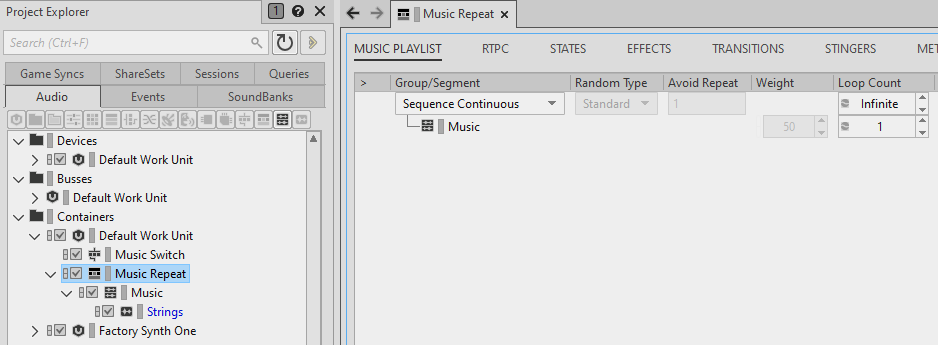
3. Create an Event that plays the Music Segment. This tutorial uses an example called Play\_Music.
4. Generate SoundBanks in either Wwise or Unreal.
5. In the Unreal Editor, drag the music Event from the Wwise Picker into the Level Editor. Just as in [Adding Ambient Sound to a Level](gs_silence_to_sound.html), the Event is added and a `uasset` is created.
6. Select the Event and in the Details panel, select the Auto Post option.

# Posting an Event

In this part of the tutorial, you will add sounds to the ThirdPersonExampleMap level. The level already contains various Actors such as Lights, Meshes, and a character.

|  |  |
| --- | --- |
|  | **注記：** If you have multiple scenes, you can create a Persistent Level so that the music survives when a different map is loaded. See [Managing Multiple Levels](https://dev.epicgames.com/documentation/en-us/unreal-engine/managing-multiple-levels-in-unreal-engine) for more information. |

This tutorial uses the Blueprint of the playable character, which is available by default in the ThirdPersonCharacter content. To play, or "post", a Wwise Event, you have to do three things:

1. Call the Unreal Event when you begin to play.
2. Connect it to the function that plays the Wwise Event.
3. Specify which Actor plays the Event.

The following procedure explains this process in detail.

**To post an event:**

1. In the Content Browser, go to **ThirdPerson** > **Blueprints** and double-click **BP\_ThirdPersonCharacter**. The BP\_ThirdPersonCharacter Blueprint opens. The Event Graph tab contains three disabled nodes.
2. Drag a pin from the BeginPlay node, search for the **Post Event** Audiokinetic function and click it.

   

   The Post Event function requires a reference to an Actor to place the Wwise Event.
3. Drag a pin from the Actor Object Reference, search for the **Get a reference to self** Variable and click it.

   
4. In the **Post Event** function, select the Play\_Music Ak Event.

   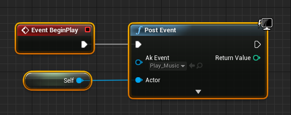
5. Click **Compile** and then in the Level Editor, click **Play**. The music plays.

# Using AkComponents

The Blueprint environment is ideal for controlling Actor behavior. However, to efficiently manage and position Actors in levels, you can expose some Blueprint controls in the Details panel and work primarily in the Level Editor instead. To do this, you can add an AkComponent to the Actor, which you can then use to offset the position of the sound from the Level Editor.

**To use an AkComponent:**

1. In the Blueprint Editor, on the Components tab, click **Add**, then search for the **Ak** Audiokinetic component and click it.
2. In the Event Graph, delete the **Post Event** function and the reference to **Self**.
3. Drag the Ak component into the Blueprint, then drag a pin from the component, search for **Post Ak Event** and click it.

   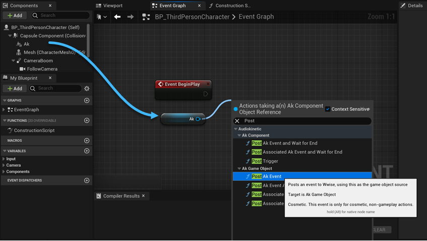
4. Connect **BeginPlay** to the **Post Ak Event**.

   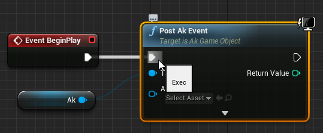

   You can now retrieve the Wwise Event selected in the AkComponent.
5. Drag a pin from the AkEvent Object Reference, find and select a **Get Ak Audio Event** and connect it to the Ak component.

   
6. Click **Compile**.
7. In the Components panel, select **Ak**, then in the Details panel, expand the Ak Event section. It is currently empty.
8. Drag the music Event from the Wwise Picker into the empty Ak Audio Event area.

   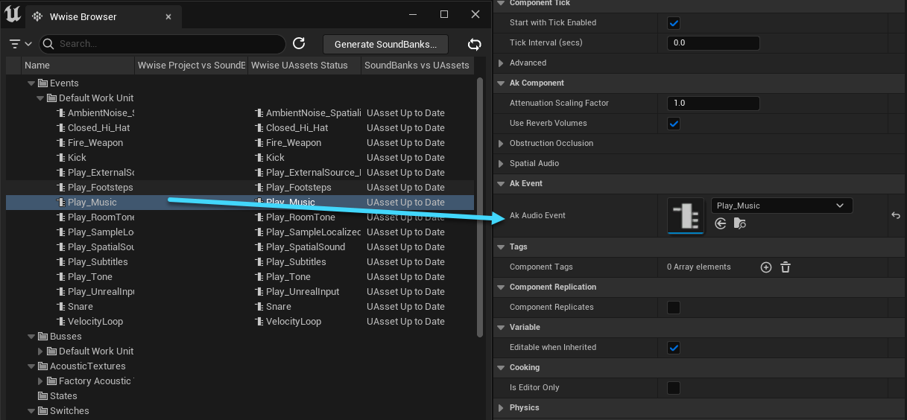

   You can now change the Event without opening the Blueprint, and you can offset the position of the sound relative to the Actor to which it is attached.

# Controlling Music with States

In most cases, you want interactive music in your game to adapt to gameplay conditions and provide variety. This tutorial demonstrates a common implementation strategy, which is to use States to control music.

Before you start, you must create a new music system in Wwise that consists of two distinct types of music: in this case, selection of calm music and a selection of intense music.

Create a Music Switch Container that can switch between "Repeat Calm" and "Repeat Intense" Music Playlists based on a “Music” State, as shown in the following image.

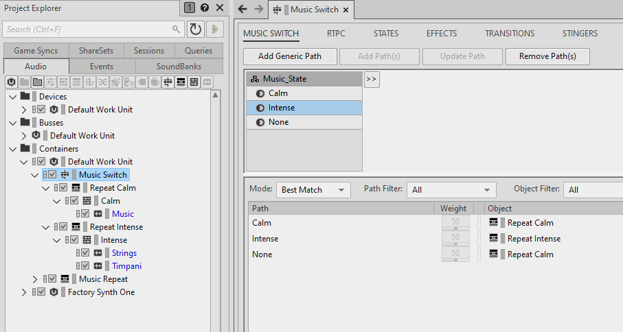

In the example, there are three States: Calm, Intense, and None. With this setup, you can set States from the game to change the music during runtime. You can also choose which State to set when the game starts.

A common approach, which this tutorial uses, is to set States when the player enters a certain area, defined by a Trigger. You create a Trigger Box and use a Blueprint system to set the State when the player crosses the boundaries of the box.

Ensure that you complete the steps in [Using AkComponents](gs_music_from_blueprint.html#gs_akcomponent) before you proceed.

**To control music with States:**

1. In the Blueprint Editor, drag a **SetState** Audiokinetic function from **BeginPlay**.

   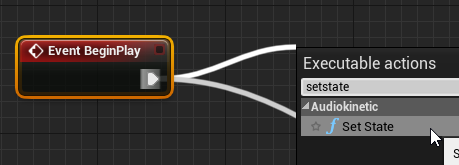
2. 将 Initial State 设为 **Music-Calm**。

   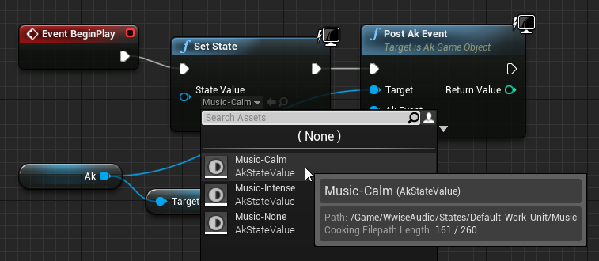

   The initial state is now set up.
3. 将 Box Trigger 拖到 Level 中。

   
4. 增大 Box Trigger 的尺寸。

   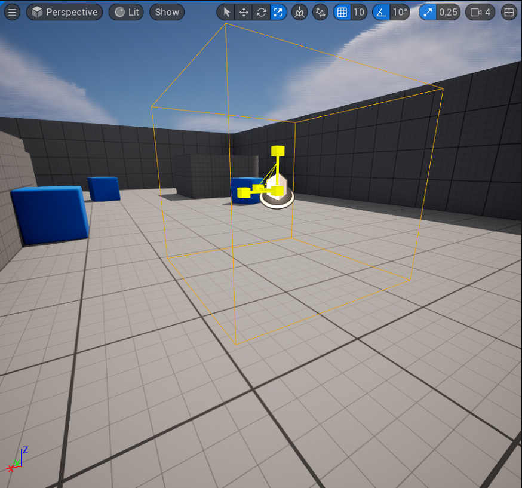
5. In the Details view, click the button with the three boxes (1), then **New Subclass** (2), type a Blueprint name (3), and then click **Select** (4), as shown in the following image.

   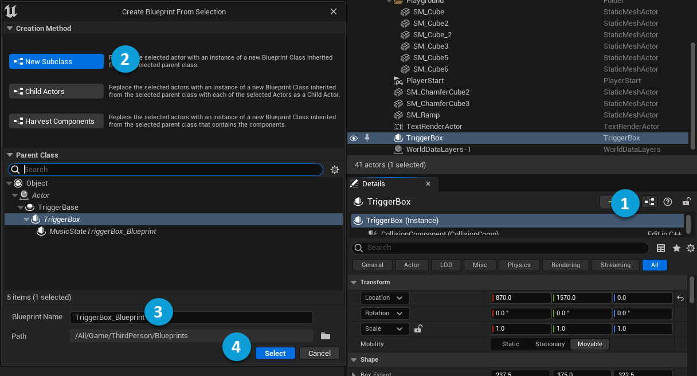

   The Blueprint is created, and contains an ActorBeginOverlap Event, which you can use to detect when something enters the Trigger Box.
6. 从 **ActorBeginOverlap** 向外拖动连线，接着赋值给 **ThirdPersonCharacter**，然后将 Exec 连到 Set State 函数。

   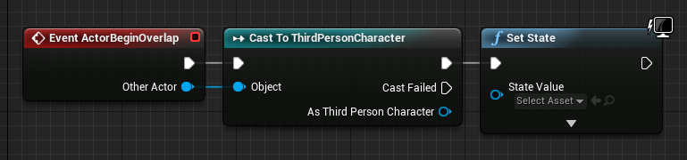

   To ensure that you can use the Trigger Box for multiple states, you must create a Variable that is accessible outside the Blueprint.
7. Drag from the State Value and click **Promote to variable**.

   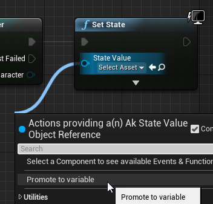

   There is now a variable under **My Blueprint** > **Variables** on the left.
8. Rename the variable to “MusicState” and click the eye icon.

   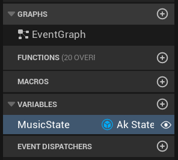

   The variable is now public (accessible outside the Blueprint).
9. Click **Compile**, and close the Blueprint.
10. Select the Trigger, then in the Details view select a State under **Default** > **Music State**.

    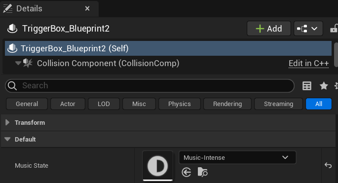
11. In the level, walk into the new Trigger with the ThirdPersonCharacter and wait for the music to change.

    

    You can now duplicate the trigger, reuse it somewhere else and set a different state without affecting the original trigger.

|  |  |
| --- | --- |
|  | **注記：** If your Music Switch Container's Transition is set to **Exit Cue**, you might have to wait to hear the music change. |

### 整合脚步声

#### Adding Footstep Anim Notifies

#### Preparing Surfaces in Unreal

#### Using Surface Switches

|  |
| --- |
| Wwise Unreal Integration Documentation |

整合脚步声

A common task in game production is posting footstep sounds. This tutorial uses footsteps as a practical demonstration of how to post sounds from a specific moment in animation. You can use the same approach for other sounds and animations, such as doors opening and closing. In addition, the tutorial demonstrates how to use Unreal Surface Types in combination with Wwise Switch Containers to change the sound of footsteps when the player character moves from one type of surface to another.

This tutorial uses the ThirdPersonCharacter project template, which includes a Mannequin (playable character controller) with input controls and animations. The following sections explain how to integrate footstep sounds by adding Animation Notifications to an animation of the character running. A Blueprint receives the notifications and posts the sound.

The footstep implementation in this tutorial uses Unreal's Physics system extensively. For more information, see [Physics](https://dev.epicgames.com/documentation/en-us/unreal-engine/physics-in-unreal-engine).

Before you proceed, create or obtain some footstep sounds for at least two different types of surface (such as dirt, gravel, or grass). You must also do some preparatory work in your Wwise project.

**To prepare for this tutorial:**

1. In Wwise Authoring, create a Switch Group called "Surface" and add Switches for each surface type you plan to use. You need at least two surface types.
2. In the Containers hierarchy, create a Switch Container called "Footsteps" and add sounds or Containers that correspond to different surface types.
3. Assign the Surface Switch Group to the Footsteps Container, set a default Switch value, and assign the appropriate footstep Objects to their corresponding Switches. The following image shows a sample configuration:

   
4. Create an Event called "Play\_Footsteps" to play the Footsteps Switch Container.
5. Generate SoundBanks in Unreal or Wwise Authoring.

|  |  |
| --- | --- |
|  | **TIP：** The Wwise Integration Demo project contains a Footsteps container with sounds for multiple surfaces. |

# Adding Footstep Anim Notifies

To play footstep sounds that are synchronized with the player character's movements in the game, you must use Anim Notifies. The following procedure explains how to add Anim Notifies to character animation states in Unreal, at the precise moment when the character's foot touches the ground. You can then update the character Blueprint to post Wwise Events based on the Anim Notifies.

**To add Anim Notifies for footsteps:**

1. In the Unreal Content Browser, go to **Content** > **Characters** > **Mannequins** > **Animations** > **Quinn** and double-click **MF\_Run\_Fwd**. The [Animation Sequence Editor](https://dev.epicgames.com/documentation/en-us/unreal-engine/animation-sequence-editor-in-unreal-engine) opens.
2. Click the Skeletal Mesh button in the upper right of the window. The SK\_Mannequin Skeletal Mesh opens.
3. In the Animation Notifies panel in the lower right, right-click, then click **New Notify** and type **Footsteps** in the text field.
4. Return to the Animation Sequence Editor, and in the Asset Editor next to Notifies, click **Track** > **Add Notify Track**. A new numbered track is added to the Animation timeline.
5. In the timeline, align the Playhead with the first R in the top track, which is the moment the right foot touches the ground.

   
6. In the timeline, right-click in the new track and click **Add Notify** > **Skeleton Notifies** > **Footsteps**.
7. Copy the Footsteps Anim Notify and paste it so that each of the other R and L notifies has a corresponding Footsteps Anim Notify.

   

# Preparing Surfaces in Unreal

To test footstep sounds on different surfaces, your level must contain at least two different sections of floor, to which you can assign different Physical Materials. You can then associate Switches with the different surfaces so that the footstep sounds change when the character moves from one surface to another. Use surfaces and materials that correspond to the sounds in your Wwise Switch Container.

This approach uses Unreal Static Meshes and Physical Materials. For more information, refer to [Physical Materials](https://dev.epicgames.com/documentation/en-us/unreal-engine/physical-materials-in-unreal-engine) and [Static Meshes](https://dev.epicgames.com/documentation/en-us/unreal-engine/static-meshes).

**To add a second floor surface to the level:**

1. Click **Edit** > **Project Settings**. The Project Settings dialog opens.
2. In the Engine section, click **Physics**.
3. In the Physical Surface section, add separate Surface Type names for each surface in your Wwise project's Switch Container (for example, Dirt, Gravel, Metal, and Wood), then close the Project Settings dialog.
4. In the Level Editor, duplicate the floor object (SM\_Cube) and scale the two objects so that each copy occupies half of the floor area in the level.
5. In the Content Browser, select a folder and click **Add** > **Physics** > **Physical Material**, and in the dialog select **PhysicalMaterial** and click **Select**. A Physical Material asset is added to the folder.
6. Change the name of the material to something that corresponds to one of the Surface Types you added in the Project Settings. Create additional Physical Materials for the remaining surface types.
7. Double-click one of the new Physical Materials and in the Details Panel, under Physical Properties, select the corresponding Surface Type.

   
8. In the Level Editor, select one of the floor objects and in the Details panel, click **StaticMeshComponent** to view the mesh properties.
9. In the Collision section, set the **Phys Material Override** to the desired Physical Material.

   
10. In the Materials section select a Material that resembles the desired Surface Type. Repeat for the second floor object. The following image shows an example of a level with a floor divided into metal and dirt sections.

    

# Using Surface Switches

After you add Footstep Notifies to the character animation and configure the different surfaces in the level, the final step is to configure the Mannequin Blueprint to determine which surface is beneath the player, route that information to the correct Set Switch function, and finally post the Event to Wwise, which then plays the appropriate footstep sound.

This procedure uses the same MF\_Run\_Fwd animation sequence from [Adding Footstep Anim Notifies](gs_footstep_sounds.html#gs_anim_notification).

**To set a Surface Switch:**

1. Open the MF\_Run\_Fwd animation in the Animation Sequence Editor.
2. In the upper right, click the Blueprint icon. The ABP\_Manny Blueprint opens.
3. Configure the first part of the Blueprint with a Line Trace By Channel function to detect the player character's footsteps, as shown in the following image.

   
4. Configure the second part of the Blueprint to detect whether the player is on a valid surface type and if so, to route the signal to the correct Set Switch function and then post the Wwise Play\_Footsteps Event to play the correct sound.

   

   Here is a diagram of the entire Blueprint:

   
5. Click **Compile**.
6. In the Level Editor, click **Play** and move your character over the different surfaces. The sound of the footsteps changes accordingly.

### Adding Sounds to Physical Impacts

#### Playing Sounds when Objects Collide

#### Distance Probes and Ak Reverb Volumes

|  |
| --- |
| Wwise Unreal Integration Documentation |

Adding Sounds to Physical Impacts

The previous tutorials described how to play music when the game starts and from a specific time in the animation. This tutorial explains how to use Unreal's Physics system to detect collisions between objects and post Wwise Events to play sounds upon impact. It also demonstrates how to use RTPCs to set minimum velocity thresholds to ensure that impact sounds don't play whenever there is minor contact between objects. Finally, it includes a system for instantiating objects in the game to test the impact sound system.

**To prepare for this tutorial:**

1. Obtain a short sound to use for a physical impact and import the sound into Wwise.
2. Create a Game Parameter called "Collision\_Velocity".
3. Add Voice Low-pass Filter and Voice Volume RTPCs associated with the Collision\_Velocity Game Parameter, with curves as shown in the following image:

   
4. Create an Event called "Play\_Impact" that plays the sound.
5. Generate SoundBanks in Unreal or Wwise Authoring.

# Playing Sounds when Objects Collide

**To play a sound when objects collide:**

1. In the Level Editor, select one of the blue boxes.
2. In the Details panel, click the Blueprint icon. The Create Blueprint From Selection dialog opens.
3. Select **New Subclass**, change the Blueprint Name to WwiseObject, and click **Select**. The Blueprint opens.
4. In the Components panel, select the Static Mesh Component.
5. In the Details panel, ensure that the following options are selected:
   - Physics > **Simulate Physics**
   - Collision > **Simulation Generates Hit Events**
6. In the Components panel, right-click **Static Mesh Component**, then click **Add Event** > **Add OnComponentHit**. The Event Graph opens and the On Component Hit Event is added.
7. Configure the Blueprint as shown in the following diagram.

   

   This Blueprint does several things:

   - It detects when the object collides with another object.
   - It sets the value of the Collision\_Velocity RTPC based on the Vector Length of the Component Velocity, and ensures that the value exceeds a minimum threshold of 40, which ensures that minor contacts do not cause impact sounds.
   - It posts the Event to Wwise with the RTPC value, so that Wwise plays the impact sound at the appropriate volume.
8. Click **Compile** and close the Blueprint.
9. Open the BP\_ThirdPersonCharacter Blueprint.
10. In the Event Graph, add a system that spawns Actors from the Wwise Object class when you press **F** in the game, as demonstrated in the following image.

    
11. Click **Compile** and close the Blueprint.
12. In the Level Editor, click **Play** and then press **F** to create a block. When you run into it, the impact sound plays.

参见
:   - [From Audio File to in-game Audio in Unreal](https://www.youtube.com/watch?v=8kDl8w0TwJ8) (video)

### Using Distance Probes to Customize Listeners in Third-Person Games

|  |
| --- |
| Wwise Unreal Integration Documentation |

Using Distance Probes to Customize Listeners in Third-Person Games

Before you begin this tutorial, refer to [Working with Listeners in Third-Person Perspective Games](https://www.audiokinetic.com/library/edge/?source=SDK&id=soundengine_listeners.html#third_person_perspective) for a general introduction to Distance Probe usage in Wwise.

This tutorial demonstrates how to use a Blueprint to assign a Distance Probe in Wwise. The example uses the Third Person project template, and the ThirdPersonCharacter Actor is used for the Distance Probe. The exact steps might vary depending on your project.

**To use a Blueprint to assign a Distance Probe:**

1. In the Content Browser, go to **Content** > **ThirdPerson** > **Blueprints** and double-click **BP\_ThirdPersonCharacter**. The Blueprint opens.
2. On the Event Graph, right-click an empty area and add a **BeginPlay** Event.
3. Right-click to add a second node, **Set Distance Probe**, and connect it to **Event BeginPlay**.
4. Drag a pin from the **Listener** input parameter of **Set Distance Probe**, and add a **Get Player Camera Manager** node.

   |  |  |
   | --- | --- |
   |  | **注記：** Wwise Unreal 集成会将 Game Object 自动注册为默认听者并绑定到 "PlayerCameraManager" Actor。 |
5. Drag a connection from the **Distance Probe** input parameter, and add a **Get a reference to self** variable. In this context, **Self** refers to the **ThirdPersonCharacter** Actor.

   
6. Use Wwise Authoring to connect to the game and confirm that the Distance Probe is set up correctly. 有关详细信息，请参阅[对 Distance Probe 实施性能分析](https://www.audiokinetic.com/library/edge/?source=SDK&id=soundengine_listeners.html#profiling_distance_probe)章节。

# Distance Probes and Ak Reverb Volumes

In the Wwise Unreal Integration, Distance Probes interact with AkReverbVolumes, which are actors that have Late Reverb components (see [AkReverbVolume](pg_features_objects_actors.html#features_akreverbvolume)).

When a game object changes position, it checks for late reverb components, then calls [AK::SoundEngine::SetGameObjectAuxSendValues()](https://www.audiokinetic.com/library/edge/?source=SDK&id=namespace_a_k_1_1_sound_engine_af960fca0239e219b9d08c2659fe9e5d4.html) with the corresponding aux bus. If the Distance Probe is a game object that emits sound, and the game object is in the AkReverbVolume actor, the sound is sent to the aux bus of the AkReverbVolume. If the camera is a game object that emits sound, it sends to that aux bus if it is inside the AkReverbVolume.

### Using Wwise Motion in Unreal

|  |
| --- |
| Wwise Unreal Integration Documentation |

Using Wwise Motion in Unreal

This tutorial demonstrates how to add a vibration effect to a controller through the Motion plug-in.

Before you begin this tutorial:

- Install the Motion plug-in through the Wwise Launcher.
- Learn about Motion integration. Refer to [Integrating Wwise Motion](https://www.audiokinetic.com/en/library/edge/?source=SDK&id=integrating_elements_motion.html) for details.
- Add a Motion Bus to the Wwise Project. See <a href="https://www.audiokinetic.com/library/edge/?source=Help&id=add\_motion\_bus\_project.html" target="\_blank>Adding a Motion Bus to a Wwise Project.

# Adding a Motion Bus to the Wwise Project

First, add a new bus to your Wwise project and associate the Motion plug-in with it.

**To add a Motion bus:**

1. In Wwise Authoring, open the Busses hierarchy and create a new Audio bus under the Default Work Unit and call it "Motion Bus".
2. Select the new bus and change the Audio Device to a Wwise Motion Audio Device. By default, it is called "Wwise\_Motion".
3. In the Containers hierarchy, create a Sound SFX called "MotionSFX" and change its Output Bus to "Motion Bus".
4. Add a Motion Source as its Source.
5. (Optional) Do one or both of the following in the Motion Source Editor:
   - Change the Actuator Configuration of the Motion plug-in to something that matches the targeted controller device.
   - Unlink the Actuator Configuration, depending on the platform. This example targets Windows with a Generic 1-Channel configuration.
6. Play the MotionSFX to verify that the controller vibrates.
7. Create a new Event called “Play\_Motion” that plays the Sound “MotionSFX”.
8. Generate SoundBanks and save the Wwise project.

# Integrating Motion into the Game

To transmit the Motion signal to the gamepad, you need to call AddOutput in Unreal with the corresponding Audio Device. You can do this either with a Blueprint or in C++. You can use various engine events to determine when to call AddOutput:

- Call it on the PlayerController when it is possessed by a pawn (that is, when a real player starts controlling it), but the Gamepad must be connected first.
- React to an event when a gamepad is connected through the OnInputDeviceConnectionChange callback.
- React to platform-specific callbacks when new gamepad controllers are plugged in.

First, however, you must create assets for the Event and the Audio Device.

**To create Motion assets in Unreal:**

1. Open the Wwise Browser, and click **Reconcile**. 
2. Regenerate your SoundBanks.

## Using Blueprints

Before you proceed with this section of the tutorial, ensure that a gamepad is connected. The example also targets an XInput controller type (Xbox controller).

**To add vibration through Blueprint:**

1. Open your GameMode Blueprint Class, find the Player Controller Class and click **+** to create a new Blueprint. You can also click on the Toolbar Blueprint button, then in the GameMode click **Edit [GameMode]** > **PlayerController** > **Create, derive from PlayerController**.
2. Open the PlayerController Blueprint and in the Event Graph, right-click to add the OnPossess event. Add the AddOutput function and connect the Exec pin to OnPossess.
3. Drag the “In Settings” pin to create a Make AkOutputSettings node.
4. In the AkOutputSettings box, select “Wwise\_Motion” for the Audio Device ShareSet pin. The Id Device pin refers to the DeviceID, which varies by platform. For Windows, it is an index from 0 to 3 in the order of the connection of the gamepad. Set it to 0 to select the first available gamepad connected.   
   Unreal cannot retrieve the DeviceID as described in the [Game setup table](https://www.audiokinetic.com/en/library/edge/?source=SDK&id=integrating_elements_motion.html#motion_application_setup). For other platforms, you must write C++ code to retrieve the proper ID.  
   You can now post Play\_Motion with a Post Event function to make the gamepad vibrate.

To stop the gamepad from vibrating, you can use the RemoveOutput function using the return value of the AddOutput function as the parameter.

## Using C++

You can use C++ to add vibration effects to controllers. C++ is more flexible than Blueprints. In particular, it is easier to select something other than the first controller for the DeviceID.

As in the Blueprint section, this example targets Windows and uses an XInput controller.

**To add vibration through C++:**

1. In Unreal, click **Tools** > **New C++ Class**. The Add C++ Class dialog opens.
2. Select **Player Controller** as the parent class and click **Next**.
3. Name the controller and click **Create Class**. The new class opens in your development environment.
4. In the `[UnrealProjectName].Build.cs` file, add “WwiseSoundEngine” to the list of PublicDependencyModuleNames. You need this to call Wwise SDK functions.
5. Copy the following code into the `[PlayerControllerClassName].h` file:

   // Copyright Audiokinetic 2022

   #pragma once

   #include "CoreMinimal.h"

   #include "GameFramework/PlayerController.h"

   #include "MyPlayerController.generated.h"

   UCLASS()

   class WWISEDEMOGAME\_API AMyPlayerController : public APlayerController

   {

   GENERATED\_BODY()

   private:

   virtual void AddMotionOutput();

   protected:

   virtual void OnPossess(APawn\* InPawn) override;

   };
6. Copy the following code into the `[PlayerControllerClassName].cpp` file:

   // Copyright Audiokinetic 2022

   #include "MyPlayerController.h"

   #include "Engine/LocalPlayer.h"

   #include "Wwise/API/WwiseSoundEngineAPI.h"

   void AMyPlayerController::AddMotionOutput()

   {

   // Because a PlayerController can be instantiated on Server, we want to add Motion only to the Local Player Controller.

   if (IsLocalController())

   {

   int32 index = GetInputIndex();

   auto\* SoundEngine = IWwiseSoundEngineAPI::Get();

   if (index != INVALID\_CONTROLLERID && LIKELY(SoundEngine))

   {

   AkOutputSettings outputSettings("Wwise\_Motion", index);

   SoundEngine->AddOutput(outputSettings);

   }

   }

   }

   void AMyPlayerController::OnPossess(APawn\* InPawn)

   {

   Super::OnPossess(InPawn);

   AddMotionOutput();

   }

   As in the Blueprint, this code calls AddOutput when the PlayerController possesses a Pawn. The AddMotionOutput function starts by querying whether the current PlayerController is local. Then, the SoundEngine's API is used to call Wwise functions directly. GetInputIndex returns the Gamepad index as defined by Unreal. For an XInput device on Windows, this corresponds to a range of 0 to 3, so it matches Wwise expectations.
7. Compile and start Unreal Editor. In the Toolbar Blueprint menu, go to GameMode > PlayerController > Select PlayerController Class, and select the new C++ class.  
   You can post Play\_Motion with a Post Event function to make the gamepad vibrate.

|  |  |
| --- | --- |
|  | **注記：**  - For DualSense on Windows, as stated in the [Integrating Wwise Motion](https://www.audiokinetic.com/en/library/edge/?source=SDK&id=integrating_elements_motion.html#wwise_motion_libscepad) documentation, you must link to the static library of libScePad for PC Games. In UE5, DualSense is supported through the use of the WinDualShock plug-in, which links to libScePad, and so you must use the ScePad function from this library. - The Wwise Unreal Integration links to Motion Dynamically, so you must use the AKMOTIONSINK\_DYNAMIC\_LINK\_SCEPAD\_FUNCTIONS macro in Unreal. |

# Additional Platform-Specific Information

This section includes extra setup information for different platforms.

On Windows, you can use the following code to differentiate between an XInput controller and DualSense or DualShock:

#if defined(PLATFORM\_WINDOWS) && PLATFORM\_WINDOWS

static FString XInputControllerIdentifier = TEXT("XInputController");

static FString DualShock4InputControllerIdentifier = TEXT("DualShock4");

static FString DualSenseInputControllerIdentifier = TEXT("DualSense");

const FInputDeviceScope\* InputScope = FInputDeviceScope::GetCurrent();

if (InputScope)

{

if (InputScope->HardwareDeviceIdentifier == XInputControllerIdentifier)

{

// XInput controller, fetch 0 to 3.

}

else if ((InputScope->HardwareDeviceIdentifier == DualShock4InputControllerIdentifier) || (InputScope->HardwareDeviceIdentifier == DualSenseInputControllerIdentifier))

{

// DualSense or DualShock controller, fetch with ScePadOpen or ScePadGetHandle.

}

#endif##### Using Blueprints

##### Using C++

#### Adding a Motion Bus to the Wwise Project

#### Integrating Motion into the Game

#### Additional Platform-Specific Information

##### 创建新的工程

##### Wwise 工程准备工作

##### Unreal 工程准备工作

##### 验证所作设置

##### Wwise 工程

##### Unreal 工程

##### 验证所作设置

#### Spatial Audio 教程准备工作

|  |
| --- |
| Wwise Unreal Integration Documentation |

Spatial Audio 教程准备工作

|  |  |
| --- | --- |
|  | **注記：** 作为 Unreal Demo Game 的一部分，Audiokinetic Launcher 中专门提供了一个包含各项教程所需参数的地图。该地图名为 SpatialAudioTutorialMap。若要使用该地图，则可跳过以下章节。 |

# 创建新的工程

按照以下步骤来构建相应的工作环境。

1. 通过 Epic Launcher 启动 Unreal。
   1. 新建一个空白的 C++ Unreal 工程（没有初学者内容）。
   2. 关闭 Unreal。
2. 启动 Audiokinetic Launcher。
   1. 安装 Wwise。
   2. 选中 Unreal Engine 选项卡。
   3. 点击 **Integrate Wwise into Project** 按钮。
   4. 点击 **Open in Wwise** 按钮来启动 Wwise。
   5. 点击 **Open in Unreal** 按钮来启动 Unreal。

# Wwise 工程准备工作

对于本教程，您需要创建 Sound SFX 和用于播放声音的 Event。

1. In the Wwise project, create a new Sound SFX in the Default Work Unit of the Containers hierarchy and import a sound.
   1. 确保在 General Settings 选项卡中启用 **Use game-defined auxiliary sends**。

      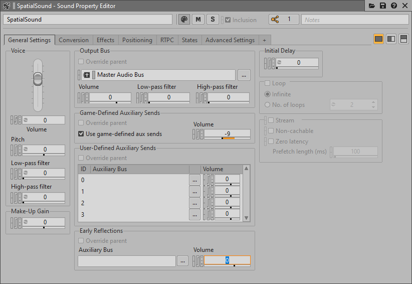
   2. 在 Positioning 选项卡中：

      1. 启用 **Listener Relative Routing**。
      2. 将 3D Spatialization 设为 **Position + Orientation**。
      3. 添加 Attenuation 并将 Max distance 设为 5000。
      4. 启用 **Diffraction and Transmission**。

      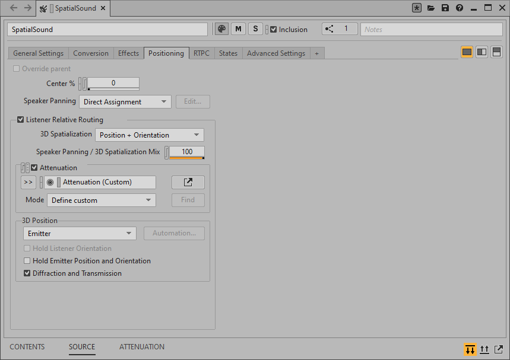
2. Right-click on the Sound SFX within the Containers hierarchy, then select **New Event** > **Play**.

   
3. 打开 Project Settings。
   1. 在 SoundBanks 选项卡中，确保启用 **Enable Auto-Defined SoudBanks**。

      
4. 保存工程。
5. 生成 SoundBank。

# Unreal 工程准备工作

1. 根据需要灵活地创建地面、由两个房间组成的建筑以及外部障碍物。在 SpatialAudioTutorialMap 中，我们为建筑使用了自定义 Mesh，并为外部障碍物使用了 Basic Cube Static Mesh 组件。
2. 在场景中放置发声体：
   1. Drag the Event created in the previous section from the Wwise Browser to the Content Browser.

      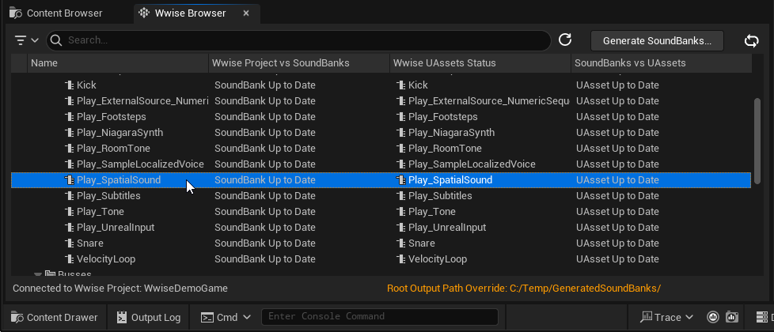
   2. 将 Event 拖到场景中来创建新的 `AkAmbientSound` Actor。
      1. 将其中一个放在外部，然后在每个 Room 中各放一个。
      2. For all `AkAmbientSound` actors, make sure to set **Refresh Interval** to 0.

         

以下为 Spatial Audio Tutorial Map 的截图。

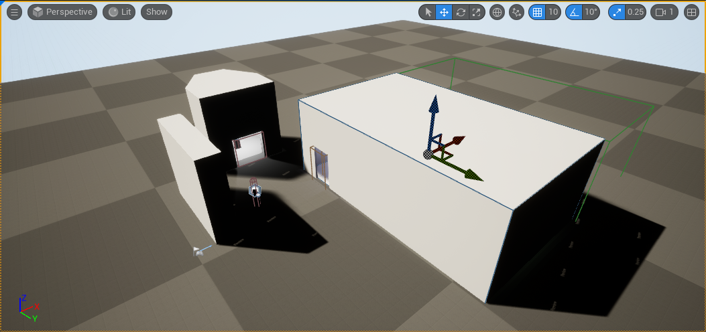

1. 从 Blueprints 菜单打开 Level Blueprint。
   1. 通过用户输入来触发 Event。
      1. 将新建的 AkAmbientSound 从 World Outliner 拖到 Blueprint 中。
      2. 从 AkAmbientSound 节点查找 Post Associated Ak Event 函数。
      3. 右键单击 Blueprint 背景，然后搜索 Left Mouse Button。
      4. 将 Pressed 输出引脚连接到 "Post Associated Ak Event" Exec。
   2. 针对所有 AkAmbientSound 条目重复同样的步骤。

      
   3. 保存并关闭 Level Blueprint。

# 验证所作设置

1. 启动场景。现在按下相应的 Button，应会听到 3D 空间化声音。
2. 连接 Wwise 设计工具，然后打开 Profiler 布局（快捷键 F6）。

   1. 在外面播放声音时，应会看到与以下相似的 Voices Graph。

   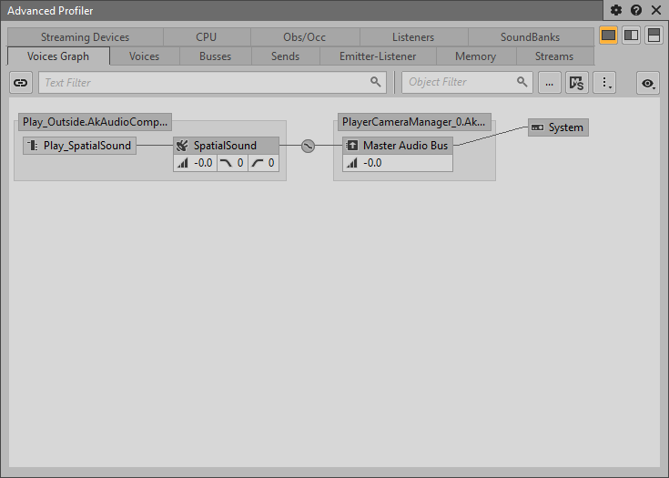

#### Reflect

|  |
| --- |
| Wwise Unreal Integration Documentation |

Reflect

This tutorial demonstrates how to use Spatial Audio geometry to send reflective surfaces to the Reflect plug-in, which simulates the early reflection implied by the propagation of sound in an acoustic environment.

**To prepare for this tutorial:**

1. Obtain a license for the Reflect plug-in. See [Reflect Plug-in](https://www.audiokinetic.com/wwise/plugins/reflect/) for licensing options.
2. Complete the steps in [Spatial Audio 教程准备工作](sa_setup.html).

# Wwise 工程

1. 为了访问出厂 Acoustic Texture 以及早期反射 Auxiliary Bus 预设，您需要导入 Factory Acoustic Texture 和 Reflect Factory Asset。
   1. 依次转到 Project > Import Factory Assets...。
   2. 选中 Reflect 和 Acoustic Texture 并按下 Import。
2. 使用出厂预设创建早期反射 Auxiliary Bus：
   1. In the Busses hierarchy, right-click on the Main Audio Bus
   2. 依次转到 New Child > Presets，并选择 **Simplified Early Reflection Auxiliary Bus**

      1. 在 Effects 选项卡中双击效果器，然后将 Speed of Sound 设为 34,500

      
3. 选中 [Wwise 工程准备工作](sa_setup.html#sa_setup_2) 中创建的声音，并转到 Sound SFX Sound Property Editor。

   1. 在 General Settings 选项卡中，在 Early Reflections 下添加刚才创建并应用了 Reflect 效果器的 Auxiliary Bus。

   
4. 保存工程并生成 SoundBank。

# Unreal 工程

在工程中，我们想让建筑物、地面和障碍物反射声音。实现方式有两种：[AkSpatialAudioVolume](pg_features_spatialaudio.html#features_objects_akspatialaudiovolume) 和 [AkGeometryComponent](pg_features_spatialaudio.html#features_objects_akgeometrycomponent) 。

`AkGeometryComponent` 可添加到 Static Mesh Actor。它会将 Static Mesh Geometry 自动发送到 Spatial Audio。另外，还可配置为发送 Simple Collision Mesh。对于足够复杂且绑定有 `AkGeometryComponent` 的 Static Mesh，有时会生成过于复杂的几何构造。这样的话计算时间可能会很长，而且基于射线的声学模拟技术（比如 Wwise Spatial Audio 中所用的技术）通常会假设几何元素（表面和边缘）远远大于声源的波长。比方说，空气中 1000 Hz 的声音具有 34 cm 的波长。在这种情况下，与其直接使用 Static Mesh，不如使用 `AkSpatialAudioVolume` 来在 Mesh 周围（在其作为障碍物反射和阻挡声音时）或在 Mesh 之内（在其作为内墙时）创建简单形状。

1. 在教程地图中，障碍物是一个 Basic Static Mesh。我们可以轻松向其添加 `AkGeometryComponent`。

   1. Click on the actor and click on **Add+**. 选择 Ak Geometry。
   2. In the Geometry section, set the Mesh Type to Simple Collision.

   
2. 针对地面重复同样的步骤。
3. 在 SpatialAudioTutorialMap 中，建筑物由自定义 Mesh 构成。虽然形状比较简单可以使用 AkGeometryComponent，不过在本教程中我们还是选择使用 `AkSpatialAudioVolume`。
   1. 将三个 `AkSpatialAudioVolumes` 拖放到场景中。
      1. 在建筑物附近设置其中一个来用于外墙。因为此 Volume 被放在了 Mesh 的外围，所以必须手动实施变换。
      2. 在每个 Room 之内各设一个来用于内墙。我们使用 **Fit To Geometry** 来放置两个 Room。
         1. 在各个 AkSpatialAudioVolume 所对应的 Details 面板中启用 **Fit To Geometry**。
         2. 若对最初获得的形状不满意，可使用 Transform 小组件将 AkSpatialAudioVolume 变换到新的位置。注意，在变换 `AkSpatialAudioVolume` 时，会显示黄色预览框线。在获得满意的形状后，松开鼠标按钮。这时 AkSpatialAudioVolume 会对齐到所需位置。
         3. 有关如何使用 **Fit To Geometry** 放置 AkSpatialAudioVolumes 的详细信息，请参阅 [Fit to Geometry](sa_fittogeometry.html) 章节。
      3. 确保三个 `AkSpatialAudioVolumes` 全部启用 **Enable Surface Reflectors**。

         - Leave **Enable Room** and **Enable Late Reverb** cleared. They are discussed in [Room 和 Portal](sa_roomsandportals.html).

         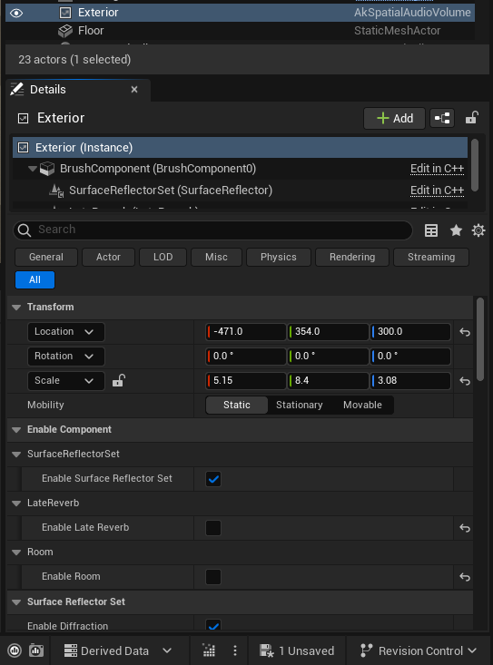

# 验证所作设置

1. 启动场景并连接到 Wwise 设计工具。
   1. 在 Advanced Profiler 的 Voices Graph 视图中，应会看到应用了 Reflect 效果器的新辅助发送。
      1. 在玩家的初始位置，播放置于外部的声音。

         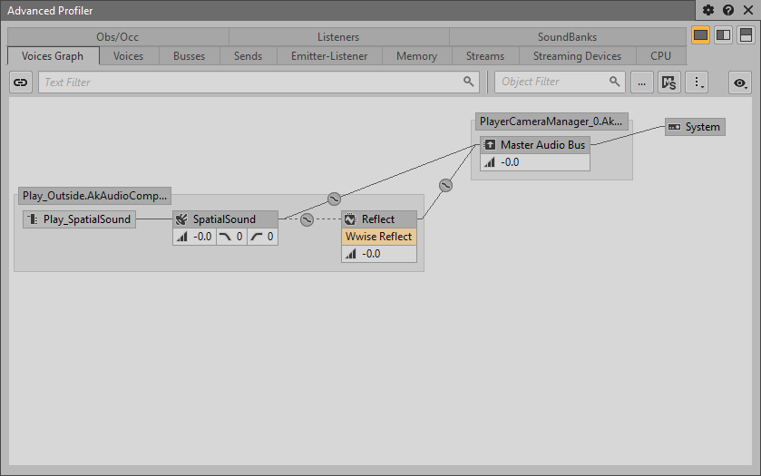

         |  |  |
         | --- | --- |
         |  | **注記：** 若在播放 Room 内的声音时玩家处在房外，则不会看到任何 Reflect 发送。另外，声音会基于透射应用衰减。这是因为我们在建筑物和每个 Room 附近创建的 AkSpatialAudioVolume 是封闭的。您可以通过修改 Brush 对象或使用 Spatial Audio Portal（参见 [Room 和 Portal](sa_roomsandportals.html) 章节）来为其创建开口。 |
      2. 在继续执行下一步之前，打开 Profiler Settings 视图并确保启用 **Spatial Audio**。
   2. 转到 Game Object Profiler 布局（快捷键 F12）。

      1. 在 Game Object 3D Viewer 中，应会看到不同的反射表面。
      2. 在播放声音时，将绘制早期反射射线以显示声音的传入路径。

         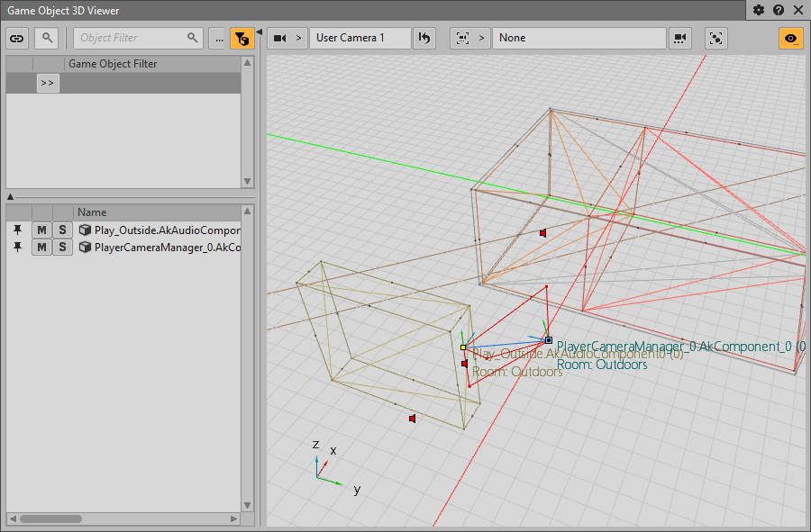
      3. 若无法看到射线，请确保在 Game Object 3D Viewer Settings 中启用 **Show Reflection Paths**。

      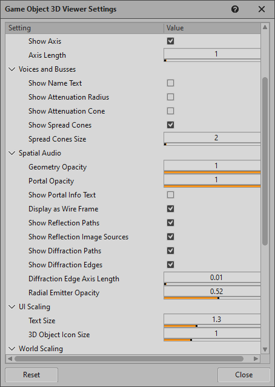

|  |  |
| --- | --- |
|  | **注記：** 若无法在 Game Object 3D Viewer 中看到任何几何构造，则可能需要调大 Monitor Queue Pool Size。该设置位于 [Platform Initialization Settings](using_initialsetup.html#initialsetup_inifiles) 中。 |

参见
:   - [Reflect 文档](https://www.audiokinetic.com/library/edge/?source=Help&id=wwise_reflect_plug_in_effect)
    - [使用 Geometry API 模拟早期反射](https://www.audiokinetic.com/library/edge/?source=SDK&id=spatial_audio_apigeometry_er.html)

#### Room 和 Portal

|  |
| --- |
| Wwise Unreal Integration Documentation |

Room 和 Portal

在现实声学环境中，封闭空间内的声音会穿透墙壁，还会通过房门和窗户等开口传到外面。Spatial Audio 可利用上层几何抽象概念（即 Room 和 Portal）来模拟这种效果。

|  |  |
| --- | --- |
|  | **注記：** 在开始学习本教程前，请务必先完成 [Spatial Audio 教程准备工作](sa_setup.html) 。 |

# Wwise 工程

1. 在 Wwise 工程中，为每个 Room 创建新的 Auxiliary Bus。
   1. 右键单击相应对象来添加子 Auxiliary Bus
   2. 依次转到 New Child > Presets，然后选择 **Room Auxiliary Bus**

      1. 在 Effects 选项卡中，可调节 RoomVerb 效果器。

      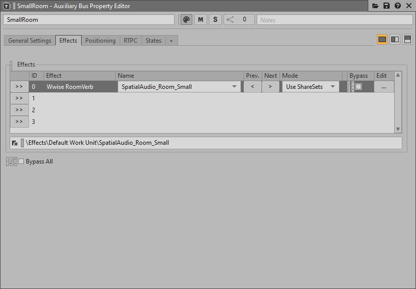
2. 保存工程并生成 SoundBank。

# Unreal 工程

1. In Unreal, drag and drop the new Auxiliary Busses from the Wwise Browser to the Content Browser.
2. 针对建筑的每个 Room 拖放两个 [AkSpatialAudioVolume](pg_features_spatialaudio.html#features_objects_akspatialaudiovolume) 对象（如尚未在另一教程中执行该操作）。我们使用 **Fit To Geometry** 来放置两个 Room。
   1. 在各个 `AkSpatialAudioVolume` 所对应的 Details 面板中启用 **Fit To Geometry**。
   2. 若对最初获得的形状不满意，可使用 Transform 小组件将 `AkSpatialAudioVolume` 变换到新的位置。注意，在变换 AkSpatialAudioVolume 时，会显示黄色预览框线。在获得满意的形状后，松开鼠标按钮。这时 AkSpatialAudioVolume 会对齐到所需位置。
   3. 有关如何使用 **Fit To Geometry** 放置 `AkSpatialAudioVolumes` 的详细信息，请参阅 [Fit to Geometry](sa_fittogeometry.html) 章节。
      1. 确保针对两个 `AkSpatialAudioVolume` 对象启用 **Enable Room** 和 **Enable Late Reverb**。
         1. 若未学习 [Reflect](sa_reflect.html) 教程，请将 **Enable Surface Reflectors** 保持设为禁用状态。
         2. 在 Late Reverb 分区中取消选中 **Auto Assign Aux Bus**，并将新导入的 Auxiliary Bus 从 Content Browser 拖放到 Aux Bus 参数。

            |  |  |
            | --- | --- |
            |  | **注記：** 有关 **Auto Assign Aux Bus** 的信息，请参阅 [Reverb Parameter Estimation](sa_reverbestimation.html) 章节。 |
3. 添加两个 [AkAcousticPortal](pg_features_spatialaudio.html#features_objects_akacousticportal) 对象。

   1. 将其放在建筑物的开口附近。
      1. 为便于放置 AkAcousticPortal，请在 Details 面板中启用 **Fit To Geometry** 复选框。
      2. 在启用 **Fit To Geometry** 时，Integration 会利用周围的几何构造来查找合理的 Portal 放置位置。在使用 Transform 小组件将 `AkAcousticPortal` 拖到相应开口附近时，会显示黄色预览框线。在找到满意的放置位置后，松开鼠标按钮。这时 AkAcousticPortal 会对齐到所需位置。
      3. 有关如何使用 **Fit To Geometry** 放置 `AkAcousticPortals` 的详细信息，请参阅 [Fit to Geometry](sa_fittogeometry.html) 章节。
      4. 在将 `AkAcousticPortal` 放在各个门廊内之后，使用 Scale 小组件来调节各个 Portal 的深度，以获得想要的交叉淡变距离。在 `AkComponent` 穿过 Portal 时，Portal 越深（沿局部 X 轴），交叉淡变距离越长。这对混响发送和散布过渡来说都是适用的。
   2. Select the portals and set their **Initial State** to Enabled in the **Ak Portal Component** section. In the **Obstruction Occlusion** section, set the **Initial Occlusion** and **Obstruction Refresh Interval** to 0.0.

   

|  |  |
| --- | --- |
|  | **注記：** An `AkAcousticPortal` must be oriented in a way that the rooms to which it connects are positioned on its local Y axis. 为了便于识别，在选中 Portal 时其周围会显示黄色条带。黄线用来分隔前后区域。If the rooms overlap, the room with the highest priority is chosen. When working with rooms and portals in the level editor, be sure to set the viewport to **Realtime** so that the portal visualisations are updated correctly as you move portals. |

# 验证所作设置

1. 启动场景并待在起点位置。在针对 Room 内的发声体播放 Event 时，应当能够听到相应的声音。
2. 连接 Wwise 设计工具并转到 Game Object Profiler 布局（快捷键 F12）。在 Game Object 3D Viewer 中，应会看到：

   1. 以灰色框线表示的 Portal 模型（如 AkSpatialAudioVolume 未启用 Surface Reflector）。
   2. 以绿色框线表示的 Portal 模型。
   3. 声音在 Portal 边缘衍射时的传播路径及关联衍射值（依据弯曲角度在各个边缘予以显示）。
   4. 声音穿透 Room 墙壁时的传播路径及关联透射损失值。

      |  |  |
      | --- | --- |
      |  | **注記：** 您可以通过更改 [AkRoomComponent](pg_features_spatialaudio.html#features_objects_akroomcomponent) 中 Room 的透射损失参数来设置此透射损失值。 |
   5. 声音衍射和透射路径的散布声锥（如设有散布曲线）。

   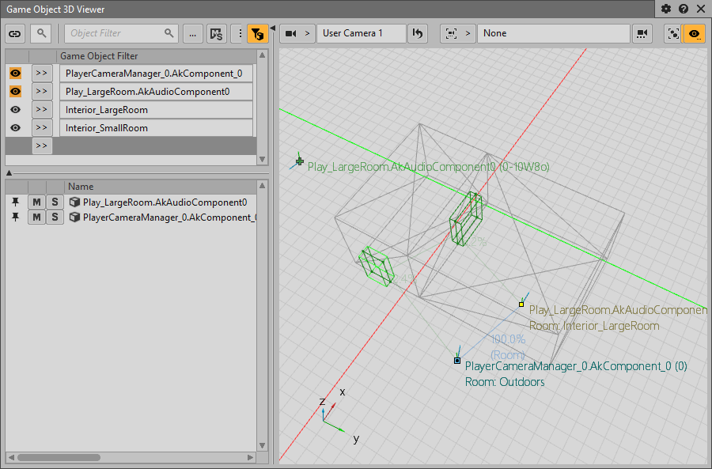

|  |  |
| --- | --- |
|  | **注記：** 这时 Diffraction 和 Transmission Loss 会使用声音的 Attenuation ShareSet 中的 Diffraction 和 Transmission 曲线对声音实施衰减。When these curves are set to **Use Project Diffraction/Transmission**, they use the curves in the Environmental Curves tab of the Project Settings in the Authoring application. |

# Portal 和 Reverb

通过 Portal 传播的声音可进行混响处理并输出到听者当前所在 Room。以下步骤阐述了如何予以配置。

1. 在 Wwise 工程中：
   1. 找到 Room Reverb 所用 Auxiliary Bus。我们希望将发出声音的 Room 的混响效果馈送到其他 Room 的混响效果中。

      1. 在 Auxiliary Bus Property Editor 的 General Settings 选项卡中，确保启用 Use game-defined auxiliary sends。

      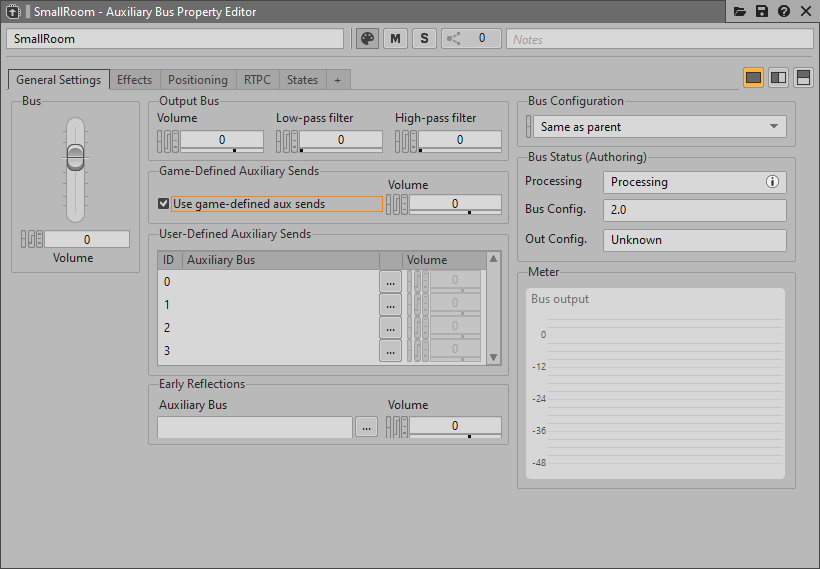
2. 生成 SoundBank，然后启动场景并连接到 Wwise 设计工具。
3. 在启用了辅助发送的 Room 中播放声音，然后转到相连的 Room。

   1. 您应会看到声音信号的湿声部分还会馈送听者所在 Room 的混响效果。

   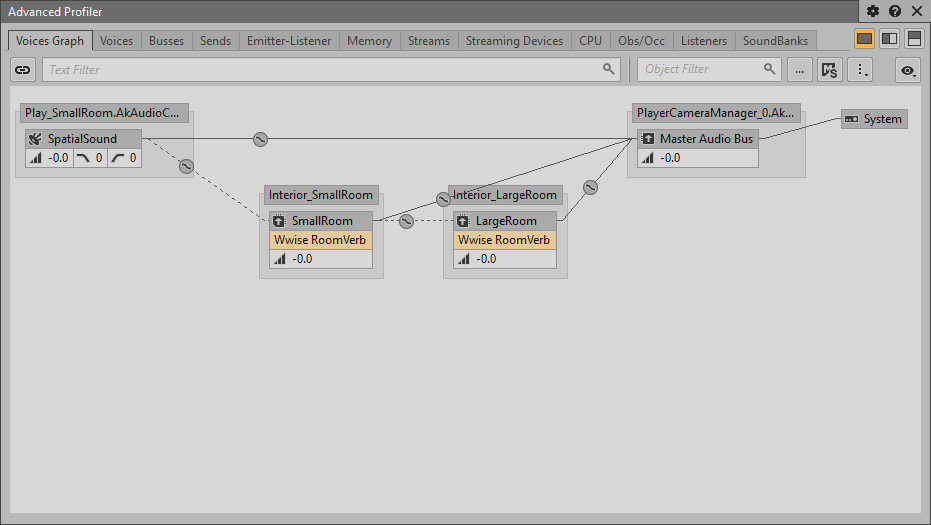

# Room Tone

有时，Room 内会有像空调嗡嗡声这样的特定环境声。为了重现这种效果，您可以针对 Spatial Audio Room 游戏对象发送 Event。在听者和发声体处在同一 Room 时，声音会被定位在听者所在位置。在听者和发声体处在不同 Room 时，听者会通过连通的 Portal 和墙壁听到房间底噪 (Room Tone)。

1. 在 Wwise 工程中：
   1. 创建新的 Sound SFX 并用于房间底噪。
      1. 若要将声音发送到混响效果器，则在 General Settings 选项卡中启用 **Use game-defined aux sends**。
      2. 在 Positioning 选项卡中：
         1. 为距离衰减、衍射和透射曲线添加衰减。
         2. 启用 **Diffraction and Transmission**。
   2. 右键单击 Sound SFX，然后依次选择 **New Event** > **Play**，来创建带有房间底噪的 Play Event。
   3. 保存工程并生成 SoundBank。
2. 在 Unreal 中：
   1. Drag the Event created in the previous section from the Wwise Browser to the Content Browser.
   2. 在其中一个 Room 对应的 Ak Event 分区下，将此 Event 添加到 Ak Audio Event 参数。

      1. 调节 Aux Send Level 来将部分声音馈送到该 Room 的混响效果中。
      2. 您可以通过选中 Auto Post 方框来在 BeginPlay 时发送房间底噪 Event，也可调用常用的 Blueprint 函数来针对游戏对象发送 Event。

      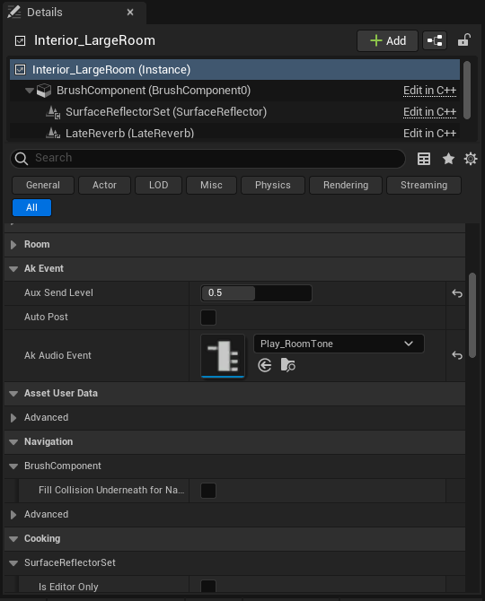
   3. 在 Spatial Audio Tutorial Map 中，我们在 Level Blueprint 中使用了 Blueprint 函数来激活和停用房间底噪。

      1. 在 World Outliner 中选中带有房间底噪的 AkSpatialAudioVolume 时，右键单击 Level Blueprint 来创建引用对象。
      2. 从引用对象拖动连线，并搜索 Post Associated Ak Event。
      3. 按照相同方式搜索 Stop 函数。
      4. 添加按键作为输入节点。

      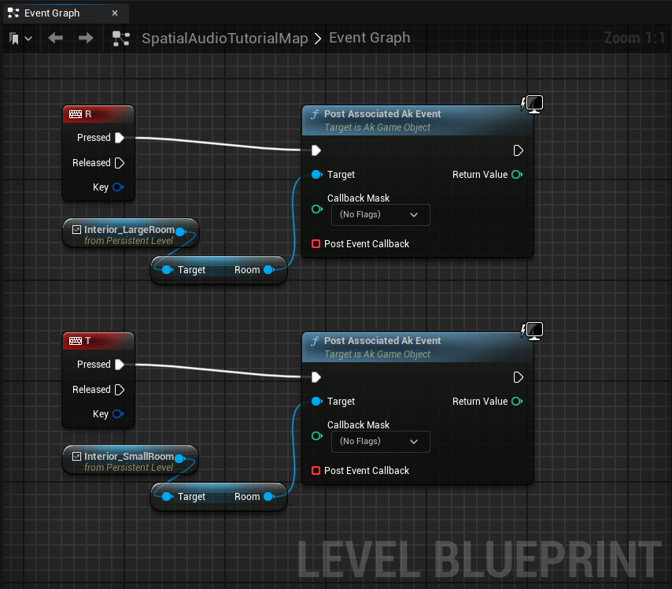
3. 启动场景并连接到 Wwise 设计工具。
4. 转到带有房间底噪的 Room，并按下按键来触发房间底噪。确认可以听到声音。

   1. 在 Advanced Profiler 视图中，应会看到当前触发的 Event。

   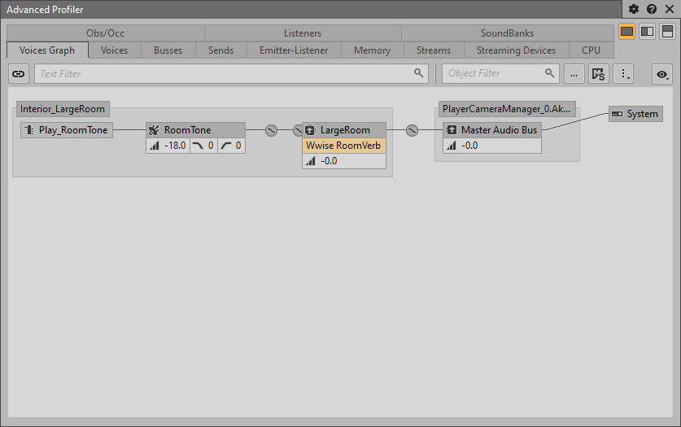

   在播放房间底噪时查看 Advanced Profiler 视图

   1. 在 3D Game Object Viewer 中，可一边来回移动听者，一边察看 Room 游戏对象。

      1. 若听者和发声体处在同一 Room，则 Room 会在听者所在位置播放声音。您会看到 Room 游戏对象跟随“听者”游戏对象。
      2. 若听者和发声体处在不同 Room，则：
         1. 将 Room 游戏对象定位在 Portal 位置（来指示衍射声音的位置），并在其与“听者”游戏对象之间绘制路径。
         2. 将 Room 游戏对象定位在直达路径上的 Room 边界来指示透射声音的位置。
         3. 针对所有这些位置绘制散布声锥。

      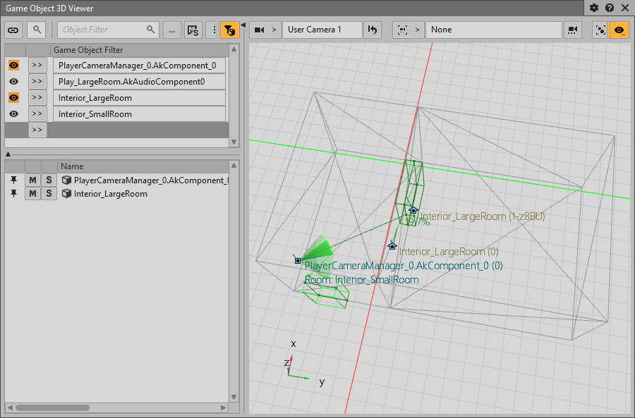

参见
:   - [Spatial Audio Room 和 Portal 文档](https://www.audiokinetic.com/library/edge/?source=SDK&id=using_rooms_and_portals.html)##### Wwise 工程

##### Unreal 工程

##### 验证所作设置

##### Portal 和 Reverb

##### Room Tone

##### Occlusion and Spatial Audio

#### 衍射

|  |
| --- |
| Wwise Unreal Integration Documentation |

衍射

在发声体和听者之间的视线被障碍物阻挡时，Spatial Audio 会围绕该物体创建衍射路径并对行为进行逼真的模拟。Depending on the angle of the path around an edge, the sound will be attenuated.

|  |  |
| --- | --- |
|  | **注記：** 在开始学习本教程前，请务必先完成 [Spatial Audio 教程准备工作](sa_setup.html) 。最重要的是，必须完成以下两项操作。  - 在 Wwise 中，选中要衍射的声音并转到与之对应的 Positioning 选项卡，然后启用 **Diffraction and Transmission**。 - In Unreal, set the **Refresh Interval** of `AkAmbientSound` to 0. This tutorial only uses the Spatial Audio diffraction and transmission loss system. |

按照以下步骤来在地图中设置 Spatial Audio 衍射。

1. 在 Unreal 中执行以下操作（如尚未执行）：
   1. 在建筑周围添加 [AkSpatialAudioVolume](pg_features_spatialaudio.html#features_objects_akspatialaudiovolume) 对象。
      1. 确保启用 **Enable Surface Reflectors**。
      2. 在 Geometry Settings 分区中，确保启用 **Diffraction**。
   2. 将 [AkGeometryComponent](pg_features_spatialaudio.html#features_objects_akgeometrycomponent) 组件添加到外部障碍物 Static Mesh。
      1. 在 Geometry 分区的 Diffraction 下，确保启用 **Diffraction**。
2. 播放声音并连接到 Wwise。
   1. 您应当能够在启用了衍射的几何构造上看到衍射边缘，并在播放启用了衍射的声音且发声体和听者之间有障碍物阻挡时看到衍射路径。

在 Demo Game 内提供的 SpatialAudioTutorialMap 中，可看到播放 Outside 发声体时由外部障碍物生成的衍射路径。

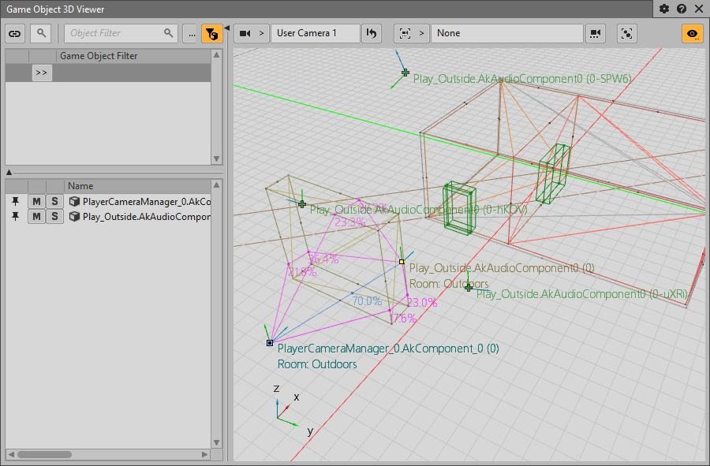

这时 Diffraction 会使用声音的 Attenuation ShareSet 中的 Diffraction 曲线对声音实施衰减。When the curves are set to **Use Project Diffraction**, they use the Diffraction curves in the Environmental Curves tab of the Project Settings in the Authoring application.

参见
:   - [Spatial Audio 衍射](https://www.audiokinetic.com/library/edge/?source=SDK&id=spatial_audio_concepts.html#spatial_audio_concepts_diffraction)
    - [使用 Geometry API 模拟衍射](https://www.audiokinetic.com/library/edge/?source=SDK&id=spatial_audio_apigeometry_diffract.html)

#### Occlusion

|  |
| --- |
| Wwise Unreal Integration Documentation |

Occlusion

`AkOcclusionObstructionService::SetOcclusionObstruction()` 中暴露了基本的声障设置。You can use this service with or without Spatial Audio Rooms. This section describes how the service works without Spatial Audio, and the following [Occlusion and Spatial Audio](using_features_occlusion.html#using_features_occlusion_spatialaudio) section describes how it works with Spatial Audio.

您可以使用 Blueprint Editor 中的 **Set Occlusion Refresh Interval** 函数来针对 Actor 启用声障。另外，还可调节 UAkComponent 的设置。若将刷新间隔设为 0，将禁用声障。

To determine whether a listener is occluded from a source, a simple line of sight check is sufficient. Use the line trace channel set in the AkComponent's properties (`CollisionChannel`). If the line of sight is blocked, the occlusion level calculation starts. This calculation maps the hit point on the obstacle to its bounding box and creates twelve points around the obstacle. Do additional line of sight checks to see if these secondary paths are also blocked. The occlusion sent to the SoundEngine is modulated by the number of secondary paths that are blocked.

A temporal fade method is also available for smooth transitions between occlusion levels. To change the fade speed, change the `OCCLUSION_FADE_RATE` constant.

# Occlusion and Spatial Audio

When using Spatial Audio Rooms, obstruction is set instead of occlusion. In parallel, sources perform simple line of sight checks with [AkPortalComponent](pg_features_spatialaudio.html#features_objects_akportalcomponent) in the same Room. These portals need to have a non-zero **Obstruction Refresh Interval** property. The portals also perform simple line-of-sight checks with other portals with a non-zero **Obstruction Refresh Interval** property.

参见
:   - [Get Collision Channel](features_blueprintcomponent.html#features_blueprintcomponent_setocclusion)
    - [AkComponent](pg_features_objects_components.html#features_akcomponent)
    - [Obstruction and Occlusion with Game-defined Auxiliary Sends](https://www.audiokinetic.com/library/edge/?source=SDK&id=soundengine_obsocc.html)

#### 透射

|  |
| --- |
| Wwise Unreal Integration Documentation |

透射

在发声体和听者之间存在障碍物时，可能会有部分声音透射到障碍物的另一侧。Spatial Audio 可通过在声音的直达路径上应用滤波来模拟这一现象。透射损失值 (0 ~ 1) 可作用于 [AkSurfaceReflectorSetComponent](pg_features_spatialaudio.html#features_objects_aksurfacereflectorset) 、 [AkGeometryComponent](pg_features_spatialaudio.html#features_objects_akgeometrycomponent) 或 [AkRoomComponent](pg_features_spatialaudio.html#features_objects_akroomcomponent) 组件。该值稍后会被发送到 Wwise，进而根据声音的 Attenuation ShareSet 的透射曲线应用关联的滤波器。一般来说，值为 1.0 时表示声音被损耗殆尽，值为 0.0 时表示声音可无损穿透几何构造。

|  |  |
| --- | --- |
|  | **注記：** 在开始学习本教程前，请务必先完成 [Spatial Audio 教程准备工作](sa_setup.html) 。最重要的是，必须完成以下两项操作。  - 在 Wwise 中，选中要衍射的声音并转到与之对应的 Positioning 选项卡，然后启用 **Diffraction and Transmission**。 - In Unreal, set the **Refresh Interval** of `AkAmbientSound` to 0. This tutorial only uses the Spatial Audio diffraction system. |

当声音在从发声体到听者的路径上遇到上述组件时，其透射损失值等于相应组件的最大透射损失值。给定透射损失值可能取自几何构造或 Room。

1. 在 [AkSpatialAudioVolume](pg_features_spatialaudio.html#features_objects_akspatialaudiovolume) Actor 上：
   1. 若启用 Surface Reflector，则可将透射损失值关联到每个 Acoustic Surface。

      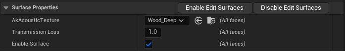
   2. 若启用 Room，则可将透射损失值关联到 Room 的墙壁。

      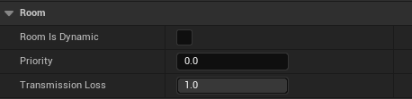
2. On an [AkGeometryComponent](pg_features_spatialaudio.html#features_objects_akgeometrycomponent), a transmission loss value can be overriden in the Acoustic Properties Override section.
   - Here is the collision mesh override:

     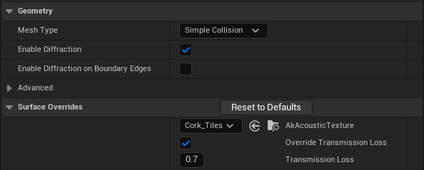
   - You can also override each material of the static mesh:

     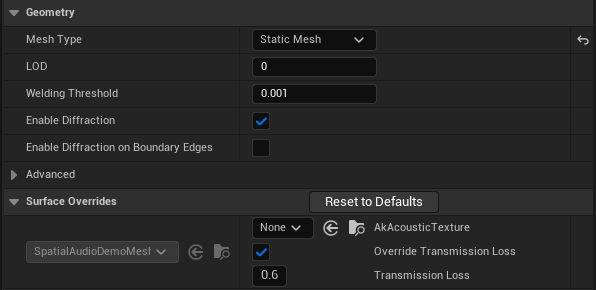
   - You can also set the transmission loss value for each Physical Material in the Geometry Surface Properties Table, which you can access through the [Integration Settings](using_initialsetup.html#initialsetup_gamesettings).

     

这时 Transmission Loss 会使用声音的 Attenuation ShareSet 中的 Transmission 曲线对声音实施衰减。When the curves are set to **Use Project Transmission**, they use the Transmission curves in the Environmental Curves tab of the Project Settings in the Authoring application.

参见
:   - [Spatial Audio 透射](https://www.audiokinetic.com/library/edge/?source=SDK&id=spatial_audio_concepts.html#spatial_audio_concepts_transmission)
    - [Room 和 Portal 透射](https://www.audiokinetic.com/library/edge/?source=SDK&id=spatial_audio_roomsportals_apioverview.html#spatial_audio_roomsportals_modelingsoundpropagationfromotherrooms_transmission)

#### Spatial Audio Blueprint 组件

|  |
| --- |
| Wwise Unreal Integration Documentation |

Spatial Audio Blueprint 组件

目前为止，所有东西都是通过使用预构建 Actor 或向各个 Actor 实例添加组件在关卡中直接构建的。其实，我们也可以使用各种 Spatial Audio 组件来构建 Blueprint Actor，然后在整个关卡中根据需要进行复制。在本节中，我们将使用 Blueprint 类来构建 [Unreal 工程准备工作](sa_setup.html#sa_setup_3) 章节所述结构的副本，以便在游戏世界中轻松添加或生成 Actor。

|  |  |
| --- | --- |
|  | **注記：** 在开始学习本教程前，请务必先完成 [Spatial Audio 教程准备工作](sa_setup.html) 。 |

# 设置 Blueprint 类

`AkLateReverbComponent` 和 `AkRoomComponent` 需要借助几何包含关系检测来确认给定游戏对象位置是否在父级 `PrimitiveComponent` 之内。该测试使用 Simple Collision。因此，您需要使用包含 Simple Collision 的父级 `PrimitiveComponent` 。比如，您可以使用 Box Collision、Sphere Collision 或 Capsule Collision 组件。若 `PrimitiveComponent` 不含任何 Simple Collision，则几何包含关系检测将直接使用组件边界。这样可能会不太精确。

It is also possible to add simple collision to a mesh asset in Unreal (see [Setting Up Collisions With Static Meshes](https://dev.epicgames.com/documentation/en-us/unreal-engine/setting-up-collisions-with-static-meshes-in-unreal-engine)). However, for complex meshes, such as those with doorways and openings, it is sometimes necessary to 'use complex collision as simple' in the collision settings for the mesh (see [Simple versus Complex Collision](https://dev.epicgames.com/documentation/en-us/unreal-engine/simple-versus-complex-collision-in-unreal-engine)). 比如，若想允许角色通过门廊进入 Room，同时还要与墙壁发生碰撞，便可能需要使用此设置。在使用此设置时，`AkLateReverbComponent` 和 `AkRoomComponent` 的几何包含关系检测会失败。因为这时会忽略 Simple Collision，转而使用 Mesh 的整个 Trimesh。`AkLateReverbComponent` 和 `AkRoomComponent` 所用的 Simple Collision 检测并不支持 Trimesh。为此，在使用 `AkLateReverbComponent` 和 `AkRoomComponent` 时，建议在 Blueprint 类中配置为将 Simple Collision 组件用作父对象。比如，Simple Collision 组件可以是 Box、Sphere 或 Capsule。若为 Room 或建筑特意设有 Mesh，则可将 Simple Collision 组件作为子组件添加到 Mesh。

|  |  |
| --- | --- |
|  | **注記：**  - It is possible to combine complex collision with simple collision by using two versions of the mesh. 如需了解如何实现这一点，请参阅 [将 Simple Collision 和 Complex Collision 结合起来](sa_components.html#sa_components_6) 章节。 - We will use assets from the Unreal Demo Game available from the Wwise Launcher. 若要在工程中使用这些素材，请下载 Unreal Demo Game 并转到资源管理器，然后在 `$<YourWwiseProjectsFolder>/WwiseDemoGame/Content` 下找到想要的素材。然后，将所需素材复制粘贴到在处理工程的 Content 文件夹。 |

1. 在 Content Browser 中，右键单击并选择 **Blueprint Class**。
2. 选择将 **Actor** 作为基类，并将新类命名为 SpatialAudioBP。
3. 双击 **SpatialAudioBP** 来打开类，然后单击 Viewport 选项卡。
4. 确保选中根组件，然后依次单击 **Add Component** > **Static Mesh**。
5. 单击刚添加的 Static Mesh 组件，然后在 Details 面板中选择 Mesh。

   - 在本例中，选择 [Unreal 工程准备工作](sa_setup.html#sa_setup_3) 章节中所用的 SpatialAudioDemoMesh。
   - 若使用 SpatialAudioDemoMesh，则需在 Materials 分区中选择 **SpatialAudioDemoMeshMaterial**。

   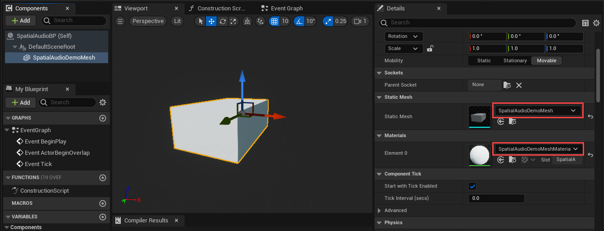

   设置 Static Mesh 组件的 Mesh 和 Material

   |  |  |
   | --- | --- |
   |  | **注記：** 只有 Convex Mesh 支持将 Room 自动指派给 Portal。Concave meshes (for example, L-shaped rooms) do not produce accurate portal room intersection. |
6. Add a Box Collision component for each of the individual rooms and doorways in the mesh. Name them BoxRoomLarge, BoxRoomSmall, BoxPortalInner, and BoxPortalOuter.

# 重新定位 Box Collision 组件

此时，所有 Box Collision 组件均被放在了同一位置（相互层叠）。下面我们来重新定位、缩放并旋转这些组件以使其与 Room 和门廊对齐。最简单的方法就是使用 Orthographic 视图（以下步骤是针对 SpatialAudioDemoMesh 的，不过其他 Mesh 所执行的步骤与之类似）。

|  |  |
| --- | --- |
|  | **注記：** 在本教程中将 Room 和 Portal 与 Mesh 对齐时，不必担心其是否完全对齐或居于正中。只需确保大致覆盖相应区域即可。在设计实际环境时，可使用 Details 面板的 Transform 分区来输入确切数值。 |

1. 在 Viewport 选项卡中，单击 **Perspective** 并将视图改为 **Top**。

   - 现在看到的是使用线框渲染的俯视图。

   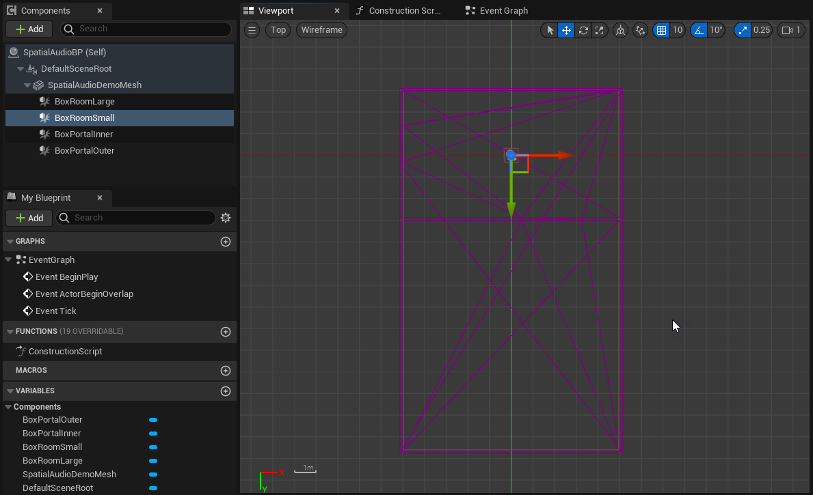

   Orthographic Top View
2. 选中 **BoxRoomLarge** 并沿 Y 轴下移，直到 Mesh 内 Large Room 的中间。
3. 沿 X 和 Y 轴缩放 **BoxRoomLarge**，直到其大小与 Large Room 的尺寸一致（您可以通过按下 R 或在 Viewport 选项卡中选择 Scale 小组件来切换到缩放界面）。

   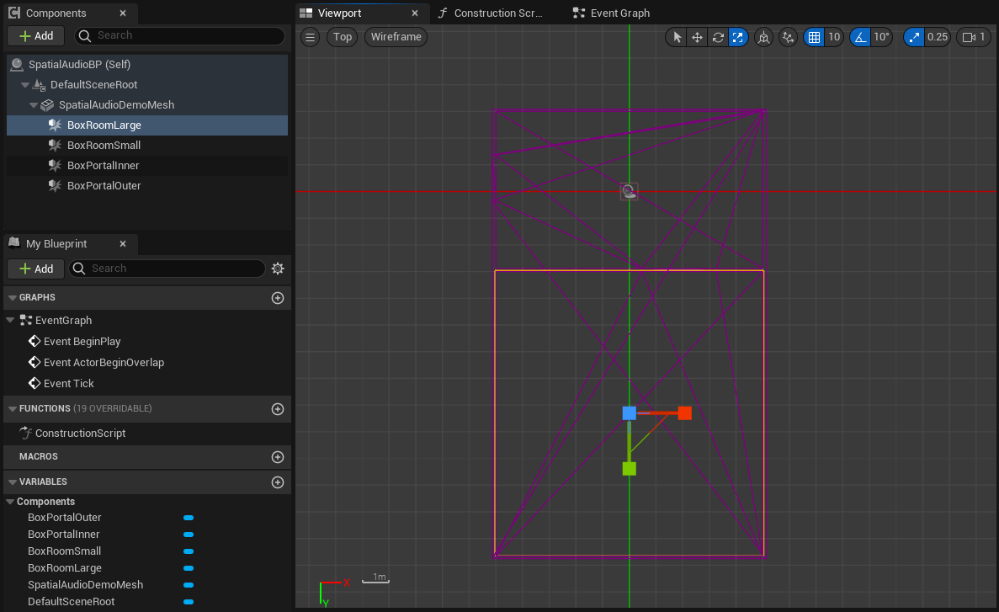

   Position and Scale Large Room on X and Y Axes
4. 选中 **BoxRoomSmall** 并沿 X 和 Y 轴缩放，直到其大小与 Small Room 的尺寸一致。

   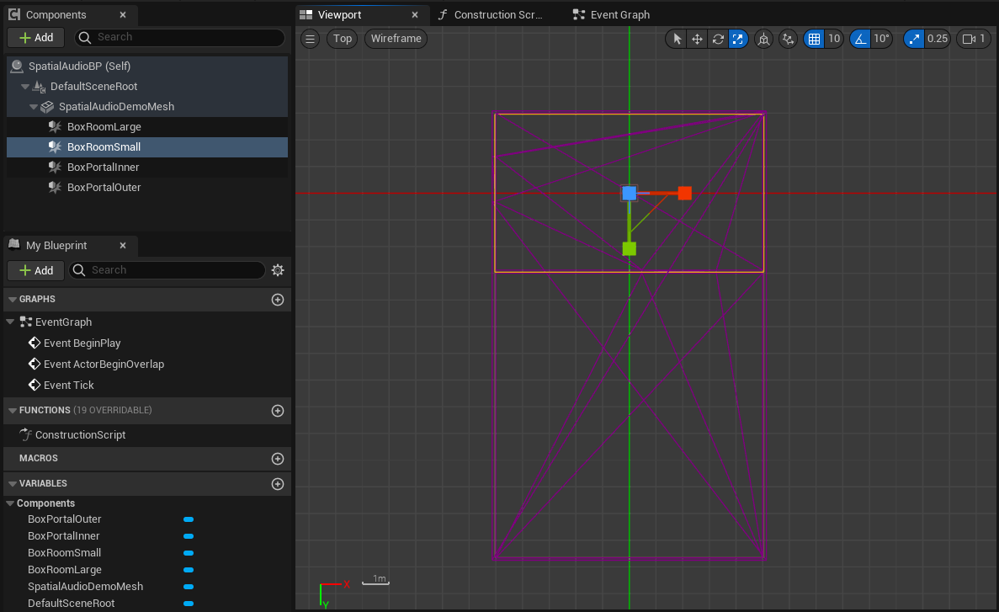

   Position and Scale Rooms on X and Y Axes
5. 选中 **BoxPortalInner** 并沿线框放大，直至在 Mesh 上看到内侧门廊的边界。

   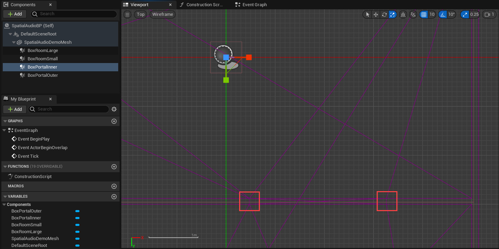

   在 Wireframe Mesh 上定位门廊的边界
6. 将 **BoxPortalInner** 移到门廊的中间，然后沿 X 轴缩放，直到其覆盖门廊的边界。

   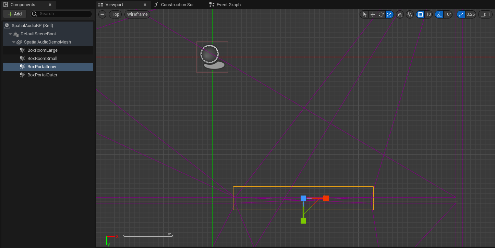

   Position and Scale Inner Portal Box to Cover the Doorway
7. 选中并旋转 **BoxPortalOuter**，以使其局部 Y 维度指向门廊外面。

   |  |  |
   | --- | --- |
   |  | **注記：** 这样做很有必要。因为 Portal 有 Front Room 和 Back Room，而其通过检测 Portal 的 Y 维度上的最近相交 Room 来自动指派。对于 BoxPortalOuter，局部坐标空间的后部将与 Mesh 中的 Small Room 连通，而前部不与任何 Room 连通。 |
8. 围绕 Z 轴将 **BoxPortalOuter** 旋转 90 度。为此，可转到 Details 面板的 Transform 分区，并在 Z 轴 **Rotation** 文本框中键入 90。

   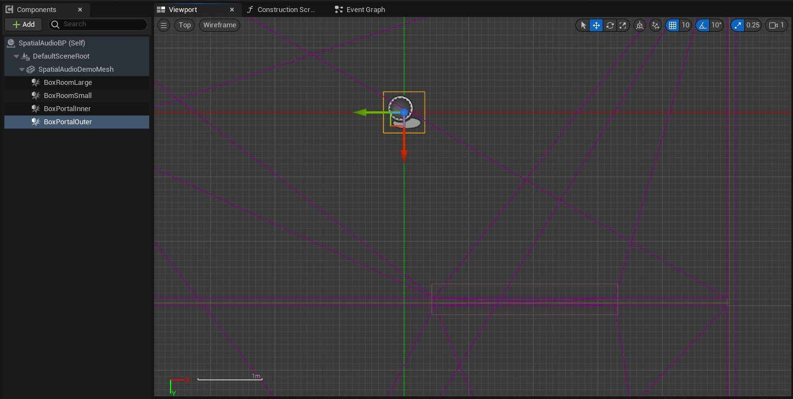

   旋转 Outer Portal Box 以使其局部 Y 轴指向房门外面
9. 往外侧门廊方向移动 **BoxPortalOuter**，并通过缩放来使其覆盖房门的边界。
10. 在 Top 视图下，确保所有 Room 和 Portal 与 Mesh 对齐（如下所示）。

    

    Rooms and Portals Correctly Aligned in Top View
11. 现在需要沿 Z 轴重新定位并缩放 Box Collision 组件。在 Viewport 选项卡中，单击 **Top** 并将视图改为 **Back**。
12. 选中 **BoxRoomLarge** 和 **BoxRoomSmall**，然后沿 Z 轴缩放以使其与 Room 的尺寸一致。

    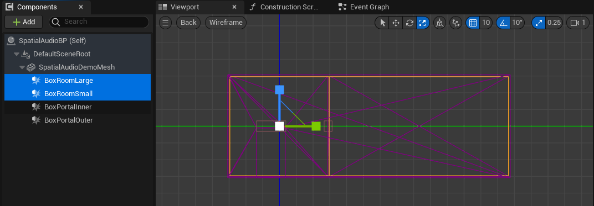

    Scale Room Boxes on Z-Axis
13. 选中 **BoxPortalOuter** 和 **BoxPortalInner** 并将其向下移到门廊中央，然后沿 Z 轴进行缩放以使其与房门的尺寸一致。

    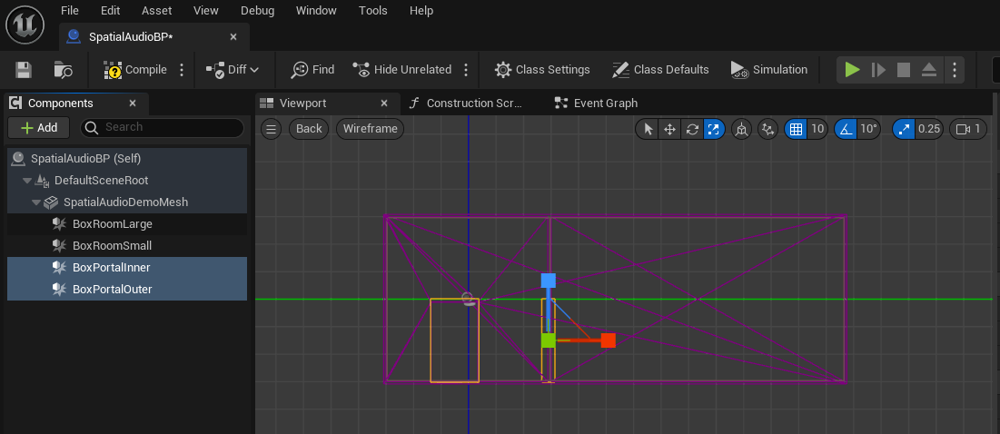

    Position and Scale Portal Boxes on Z-Axis

# 设置 Room 和 Portal

下面我们来将 AkRoom 组件添加到 Room，并将 AkPortal 组件添加到 Portal。

1. 逐一选择各个 Box Collision 组件，然后选择 **Add Component**。
2. 针对每个 Box Collision 组件创建 Room 或 Portal 组件（视情况而定），并为其设置与父对象相似的名称。结果应如下图所示：

   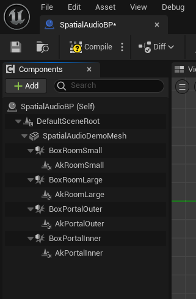

   Add AkRoom Components to the Room Boxes and AkPortal Components to the Portal Boxes

   |  |  |
   | --- | --- |
   |  | **注記：** 确保将组件添加到正确的父对象。比如，在将 AkRoomLarge 添加到 Large Room 时，确保在单击 **Add Component** 前选中 **BoxRoomLarge**。  AkRoomComponent 和 AkPortalComponent 为通用组件，可添加到任何 Primitive 组件。有关详细信息，请参阅 [AkRoomComponent](pg_features_spatialaudio.html#features_objects_akroomcomponent) 和 [AkPortalComponent](pg_features_spatialaudio.html#features_objects_akportalcomponent) 章节。 |
3. To confirm that the portals have valid placement, select the **Visualize Rooms and Portals** option in the Wwise User Settings.

   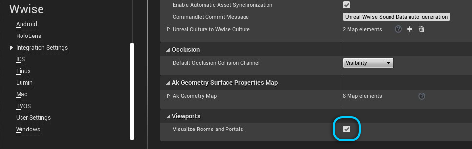

   Visualize Rooms and Portals option in the Wwise User Settings
4. 现在在连通的 Room 和 Portal 之间绘制了框线。若 Portal 的放置无效，则将其显示为红色。

   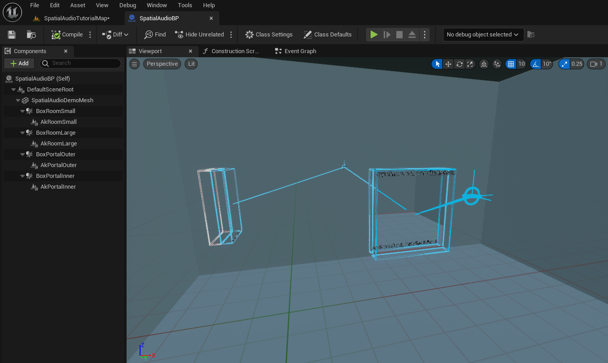

   Portal Room Connections Visualized in the Viewport

   |  |  |
   | --- | --- |
   |  | **注記：** 若 Portal 不与任何 Room 连通或同一 Room 与两端连通，则将 Portal 的放置视为无效。有关详细信息，请参阅 [AkPortalComponent](pg_features_spatialaudio.html#features_objects_akportalcomponent) 章节。 |
5. Clear **Visualize Rooms and Portals** in the Wwise User Settings.

# 添加 Geometry 和 Late Reverb

最后还要将 AkGeometry 和 AkLateReverb 组件添加到 Blueprint 类。

1. 将 AkGeometry 组件添加到 Static Mesh 组件。
2. Select the AkGeometry component and in the Details panel, under Geometry, set the Mesh Type to **Static Mesh**.
3. 将 AkLateReverb 组件添加到 "BoxRoomLarge" Box Collision 组件。

   

   AkGeometry and AkLateReverb Added to the Blueprint Class
4. Select the **AkLateReverb** component.
5. In the Details panel, set the Aux Bus to **LargeRoom**.

# 验证所作设置

Blueprint 类现在可供使用了。我们可以将类的实例拖到游戏世界中。

1. 将 **SpatialAudioBP** 的实例从 Content Browser 拖到 Spatial Audio Demo 地图中。
2. 将其放在现有建筑旁边。

   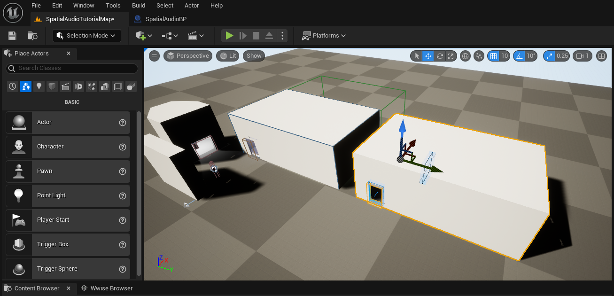

   An instance of the Blueprint Class Added to the World
3. 远程连接到 Wwise，并进入 Play In Editor 模式。
4. 单击鼠标来播放 Outside 声音。
5. 在 Wwise 的 Game Object Profiler 布局中，确认已正确注册新 Blueprint 类的几何构造，并可从该几何构造正常反射射线。
6. 确认在新的 Blueprint 结构中射线正确穿过 Portal。

   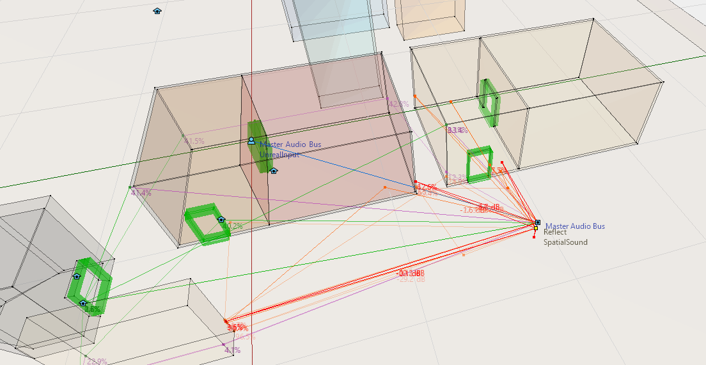

   Spatial Audio Paths Correctly Interacting with the New Blueprint Class Instance
7. 若要测试 Late Reverb 组件，则须添加声音并将其定位在 SpatialAudioBP 实例中的 Large Room 内。右键单击并复制游戏世界中的现有 **Play\_Outside** AkAmbientSound Actor。
8. 将复制项重命名为 Play\_LargeRoom\_BP（您也可以在 World Outliner 中将 **Play\_LargeRoom\_BP** 拖到 **Button\_Outside** 之上，来将 Play\_LargeRoom\_BP 与 Button\_Outside 解绑）。
9. Move **Play\_LargeRoom\_BP** inside the large room of the SpatialAudioBP instance.
10. Open the Level Blueprint and add logic to play the Play\_LargeRoom\_BP sound when the B key is pressed (see [Unreal 工程准备工作](sa_setup.html#sa_setup_3)).

    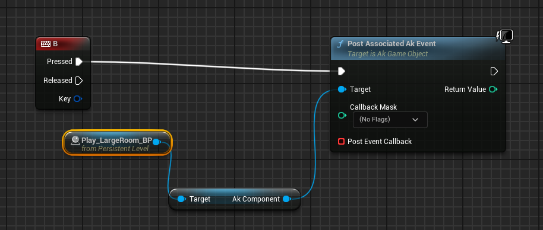

    Logic in the Level Blueprint to Play the New Sound Using the B Key
11. 编译并保存 Level Blueprint。
12. Play the level in the editor.
13. Press **B** to play the new sound.
14. 走进 SpatialAudioBP 建筑中的 Large Room。You can hear the reverb applied to the sound.

# 将 Simple Collision 和 Complex Collision 结合起来

本节将展示如何将 Simple Collision 和 Complex Collision 结合用于相同的 Mesh，以便使用 Simple Collision 执行 Spatial Audio 几何包含关系检测，并使用 Complex Collision 执行 Unreal 查询。

|  |  |
| --- | --- |
|  | **注記：** 本节基于 WwiseDemoGame 工程中的 SpatialAudioTutorialMap 和 ComplexRoomDemo 目录下的素材。您可以通过 Audiokinetic Launcher 下载安装该工程。然后，使用预制 Mesh 素材和自定义 Blueprint 类将 Simple Collision 和 Complex Collision 结合起来。 |

For complex meshes, such as those with doorways and openings, it is sometimes necessary to 'use complex collision as simple' in the collision settings for the mesh (refer to [Simple versus Complex Collision](https://dev.epicgames.com/documentation/en-us/unreal-engine/simple-versus-complex-collision-in-unreal-engine)). 比如，若想允许角色通过门廊进入 Room，同时还要与墙壁发生碰撞，便可能需要使用此设置。When this setting is used, the containment tests for `AkLateReverbComponent` and `AkRoomComponent` fail because the simple collision is ignored and the mesh's full trimesh is used. `AkLateReverbComponent` 和 `AkRoomComponent` 所用的 Simple Collision 检测并不支持 Trimesh。

One solution to this problem is to create two duplicates of the same mesh asset, using simple collision for one, and complex collision for the other. In the SpatialAudioTutorialMap, there is a complex room structure that demonstrates this technique.

To begin, test the complex room structure by playing in editor and walking around the building:

1. Open the SpatialAudioTutorialMap in Unreal.
2. Click **Play in Editor**.
3. Press **C** to trigger the sound in the non-box-shaped building.

   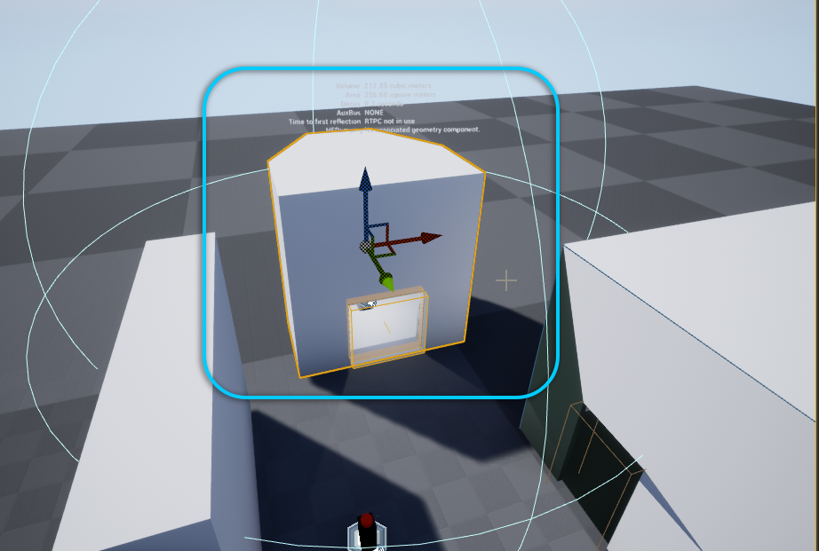

   SpatialAudioTutorialMap 中的 Non-Box-Shaped Room

   Walk around the exterior of the building. The sound is occluded.

The rest of this tutorial demonstrates how the building structure is configured to handle simple collision for Wwise Spatial Audio containment tests, as well as complex collision for Unreal physics containment tests.

1. In the context browser, browse to WwiseAssets/SpatialAudioDemo/ComplexRoomDemo.

   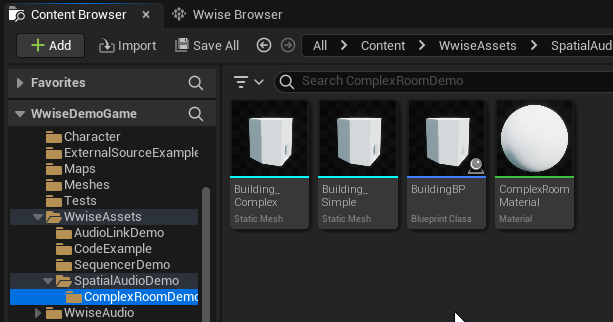

   SpatialAudioTutorialMap 中的 ComplexRoomDemo 素材

   This folder contains two Static Mesh assets: Building\_Complex and Building\_Simple.
2. Open each of these assets and scroll to the collision settings in the Details Panel.

   Notice that they have different values for their respective Collision Complexity properties.

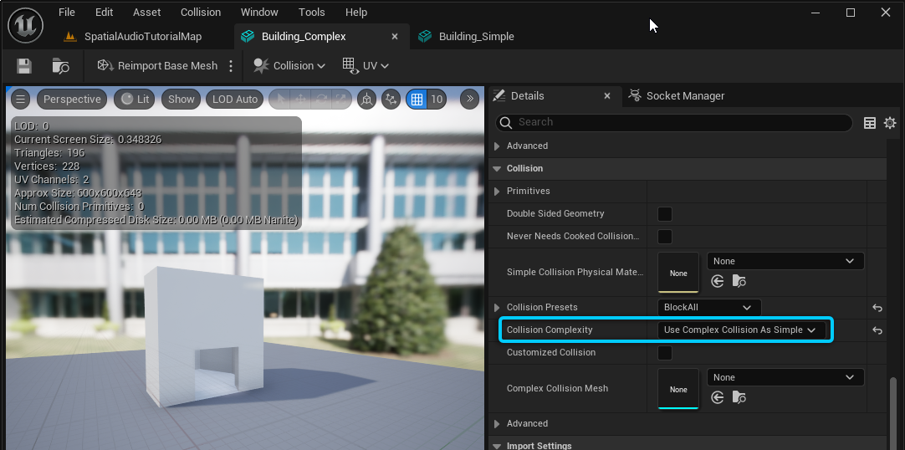

Building\_Complex

Mesh 素材

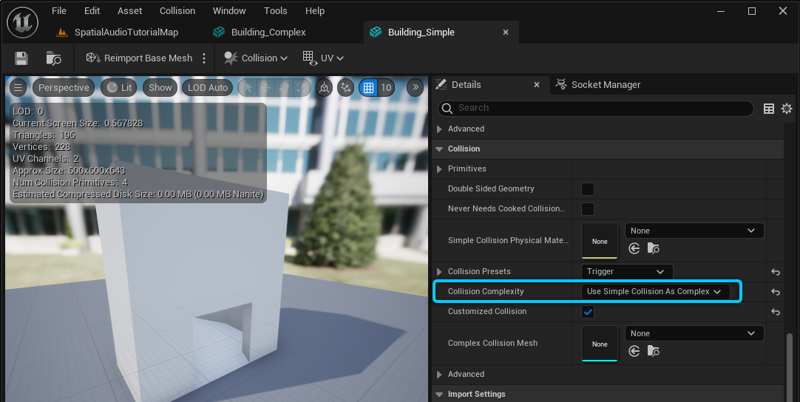

Building\_Simple

Mesh 素材

Building\_Complex 将 Collision Complexity 设为了 Use Complex Collision As Simple，表示 Unreal 不会为此 Mesh 生成简化几何构造，而是使用整个 Trimesh。这样角色才能穿过门廊开口。 Building\_Simple 将 Collision Complexity 设为了 Use Simple Collision As Complex，表示 Unreal 会生成简化几何构造并忽略 Trimesh。这样 Spatial Audio 才能执行几何包含关系检测来确认 Room 的几何包含关系。

|  |  |
| --- | --- |
|  | **注記：** 当然，也可将 Collision Complexity 设为 Simple And Complex。不过，这样的话 Unreal 会使用简化几何构造来执行碰撞查询。在这种情况下，角色无法穿过门廊开口。相反，可以使用两个完全相同的 Mesh。一个具有复杂几何构造，一个具有简单几何构造。 |

接下来，在自定义 Blueprint 类内将两个 Mesh 结合起来。

- 打开 "BuildingBP" Blueprint。

此 Blueprint 使用了两个相互层叠的 Static Mesh 组件。

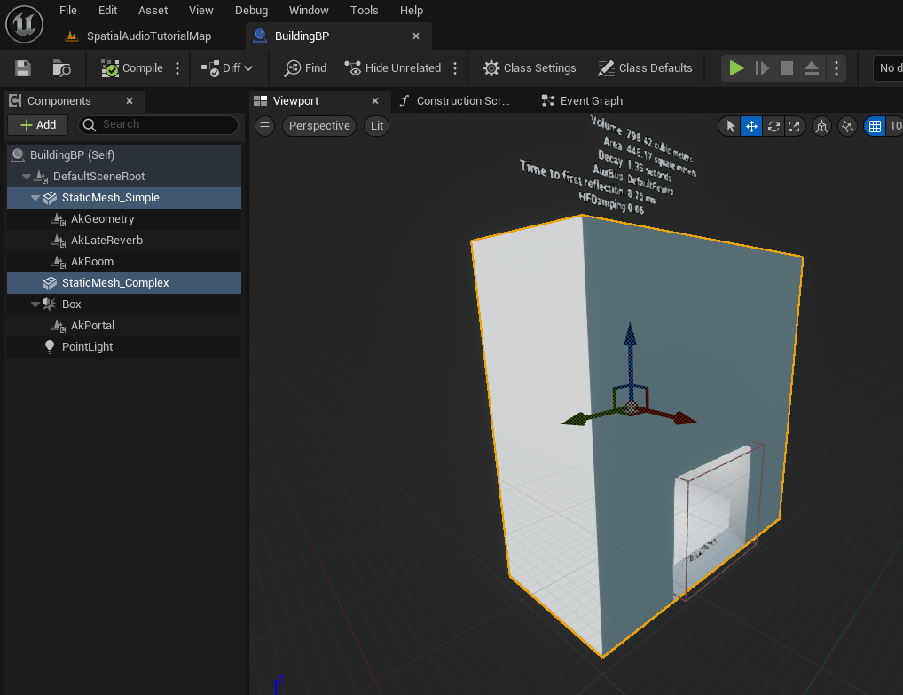

BuildingBP

Blueprint 中的两个 Static Mesh 组件

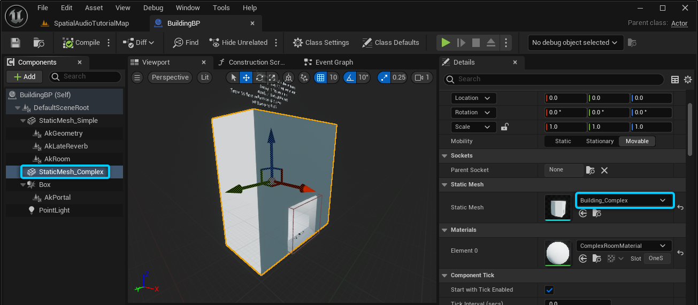

对于 StaticMesh\_Complex 组件，使用了 "Building\_Complex" Mesh

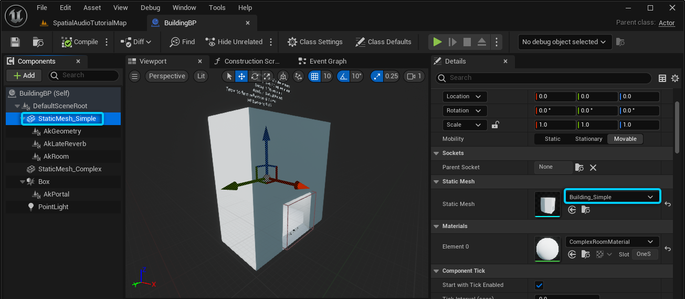

对于 StaticMesh\_Simple 组件，使用了 "Building\_Simple" Mesh

StaticMesh\_Simple 的 Rendering 设置

对于 StaticMesh\_Simple 组件，在 Rendering 分区中禁用了 Visible 并启用了 Hidden in Game。这是因为此 Mesh 仅用于简化几何构造，以便可以针对 Spatial Audio 执行几何包含关系检测。

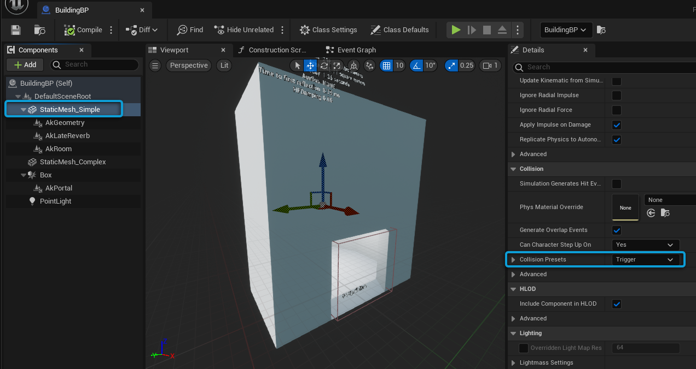

StaticMesh\_Simple 的 Collision Presets 设置

另外，对于 StaticMesh\_Simple 组件，将 Collision Presets 属性设为了 Trigger。该简化几何构造会在门廊开口位置形成一道障碍。通过使用 "Trigger" Collision Presets，可确保角色和其他游戏对象可自由穿过简化几何构造。

StaticMesh\_Simple 组件绑定有 AkRoom 组件和 AkLateReverb 组件。这样的话，会将 "Building\_Simple" Mesh 的 Simple Collision 用于对 Room 实施几何包含关系检测。

为了允许声音在 BuildingBP 的 Mesh 上反射和衍射，需要将 AkGeometry 组件添加到其中一个 Static Mesh 组件。In this solution, because we are also using [Reverb Parameter Estimation](sa_reverbestimation.html), it is best to add it to the StaticMesh\_Simple component. AkLateReverb 组件使用同级 AkGeometry 组件的 Acoustic Texture 计算 HF Damping。通过将 AkGeometry 组件设为 Static Mesh，可将整个复杂几何构造而非其 Simple Collision Mesh 发送到 Spatial Audio。

最后，使用绑定有 AkPortal 组件的 Box Collision 组件来将声学 Portal 添加到门廊。

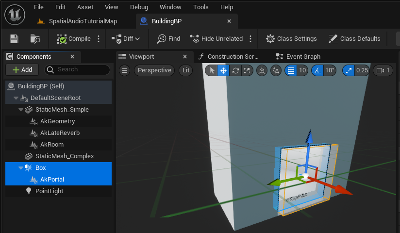

BuildingBP

Blueprint 中的 Portal

另外，为了能够看到建筑的内部，还添加了 Point Light。

|  |  |
| --- | --- |
|  | **注記：**  - When sending geometry to Wwise, there is a limitation that each edge can have no more than two triangles connected. Remember this when designing meshes to use with Spatial Audio. - When using the Game Object Profiler in Wwise, Room Extents will always be visualized as green cuboids, regardless of the geometry assigned to the room. - Adding simple collision to meshes in Unreal will only work correctly when the mesh is convex. 对于更为复杂的 Mesh 结构，最好使用 Simple Collision 几何构造来模拟 Mesh。您可以在 Static Mesh 编辑器的 Collision 菜单中将 Simple Collision Primitive 添加到 Mesh。 将 Collision Primitive 添加到 Mesh 素材 Refer to [Setting Up Collisions With Static Meshes](https://dev.epicgames.com/documentation/en-us/unreal-engine/setting-up-collisions-with-static-meshes-in-unreal-engine) for further information. |##### 设置 Blueprint 类

##### 重新定位 Box Collision 组件

##### 设置 Room 和 Portal

##### 添加 Geometry 和 Late Reverb

##### 验证所作设置

##### 将 Simple Collision 和 Complex Collision 结合起来

#### Reverb Parameter Estimation

|  |
| --- |
| Wwise Unreal Integration Documentation |

Reverb Parameter Estimation

在使用与 `UPrimitiveComponent` 绑定的 [AkLateReverbComponent](pg_features_objects_components.html#features_aklatereverbcomponent) 时，可告知 Wwise Unreal 集成依据 `UPrimitiveComponent` 的大小和形状来自动指派混响 **Aux Bus** 。

同样地，Wwise Unreal 集成还可使用 `UPrimitiveComponent` 来估算特定混响参数，并通过 [Driving Reverb RTPCs](features_editor_reverb_estimation.html#features_editor_reverb_estimation_rtpcs) 加以调节。本教程将阐述如何自动指派 Aux Bus 并使用全局混响 RTPC 估算混响参数。

|  |  |
| --- | --- |
|  | **注記：**  - UPrimitiveComponent is a generic Unreal Component that has size and shape. There are many Component types that are based on UPrimitiveComponent, including collision Components, brush Components and mesh Components. See [UPrimitiveComponent](https://dev.epicgames.com/documentation/en-us/unreal-engine/API/Runtime/Engine/Components/UPrimitiveComponent) for more information. - Although Reverb Parameter Estimation is a feature of the [AkLateReverbComponent](pg_features_objects_components.html#features_aklatereverbcomponent), the [AkSpatialAudioVolume](pg_features_spatialaudio.html#features_objects_akspatialaudiovolume) contains an [AkLateReverbComponent](pg_features_objects_components.html#features_aklatereverbcomponent), so it can also make use of the feature. - The [Spatial Audio 教程准备工作](sa_setup.html) must be completed prior to starting this tutorial. |

# 自动指派 Aux Bus

It is possible to automatically associate an Aux Bus with a Spatial Audio Room. You can set up a Reverb Assignment Table in the [Integration Settings](using_initialsetup.html#initialsetup_gamesettings), which maps different Decay values to different Aux Buses.

The Decay value of a Room is the estimation of its T60 decay (see [EstimateT60Decay](https://www.audiokinetic.com/library/edge/?source=SDK&id=namespace_a_k_1_1_spatial_audio_1_1_reverb_estimation_aec6a508d25d6da739457f1eb6f0aac53.html#aec6a508d25d6da739457f1eb6f0aac53)), which is the time (in seconds) required for the sound reverberation in a physical environment to decay by 60 dB.

The following exercise demonstrates how to use the the Reverb Assignment Table to automatically determine which Aux Busses to use for each Room.

Reverb Assignment section the Integration Settings

Before you configure the Decay keys in the table, observe the estimated Decay values for the existing reverbs in the level.

1. Open the SpatialAudioTutorialMap.
2. In the World Outliner, select the Interior\_SmallRoom `AkSpatialAudioVolume`. Selecting **Auto Assign Aux Bus** sets the **Aux Bus** to the Default Reverb Aux Bus specified in the Project Settings because the Reverb Assignment Table is not yet set up.
3. 在 Interior\_SmallRoom 所对应的 Details 面板中，启用 **Auto Assign Aux Bus**。
4. 针对 "Interior\_LargeRoom" `AkSpatialAudioVolume` 重复步骤 2 和 3。

针对 Interior\_SmallRoom 和 Interior\_LargeRoom 启用 Auto Assign Aux Bus

Some text information is displayed above each `AkSpatialAudioVolume` in the viewport when they are selected. Details 面板的 Reverb Parameter Estimation 中也会显示此信息。

1. In Unreal, click **Edit** > **Project Settings**, then scroll to the Wwise section and click **Integration Settings**.
2. Expand the Reverb Assignment Map section.

   

   Reverb Assignment section the Integration Settings
3. Open the Reverb Assignment Table asset.
4. In the toolbar, click **Add**.
5. Set the Decay value of the new row to 1.0 and set the Aux Bus to SmallRoom.
6. Add another row with a Decay value of 2.0 and set the Aux Bus to LargeRoom.

Any Room with a Decay value between 0.0 and 1.0 sends to the SmallRoom Aux Bus and any Room with a Decay value between 1.0 and 2.0 sends to the LargeRoom Aux Bus. Decay values above 2.0 sends to the Default Reverb Aux Bus.

这时返回关卡，可看到为 Interior\_SmallRoom 和 Interior\_LargeRoom 指派了相应的 **Aux Bus** 值。

# 全局混响 RTPC

除自动指派 Aux Bus 外，还可在 Wwise 中通过全局混响 RTPC 来自动设置混响效果器的某些参数。我们可以采用这种方式设置三项参数：Decay、Predelay 和 HFDamping。您可以在 Integration Settings 中设置由哪些 RTPC 控制这些参数。

The HFDamping, or high frequency damping, value is an estimation of how much high frequencies are dampened compared to low frequencies. See [EstimateHFDamping](https://www.audiokinetic.com/library/edge/?source=SDK&id=namespace_a_k_1_1_spatial_audio_1_1_reverb_estimation_a2be1de76cd8b9ddf95217f06b02ebad6.html#a2be1de76cd8b9ddf95217f06b02ebad6) for more information.

The PreDelay value is an estimation of the time in milliseconds for the first reflection to reach the listener, assuming both listener and emitter are in the center of the environment. See [EstimateTimeToFirstReflection](https://www.audiokinetic.com/library/edge/?source=SDK&id=namespace_a_k_1_1_spatial_audio_1_1_reverb_estimation_a58a735c2257525485f8be06920e19b82.html#a58a735c2257525485f8be06920e19b82).

## 设置 RTPC

为了使用全局混响 RTPC，我们需要在 Wwise 工程中添加三个 RTPC。

1. 打开 Wwise 工程。
2. Click **Layouts > Designer**.
3. 在 Project Explorer 中，单击 Game Syncs 选项卡。
4. Add three new Game Parameters called Decay, PreDelay and HFDamping.
5. Set the Min, Max, and Default values of the three new Game Parameters as follows:
   - **Decay**:
     - Min: 0
     - Max: 10
     - Default: 0
   - **PreDelay**:
     - Min: 0
     - Max: 1000
     - Default: 0
   - **HFDamping**:
     - Min: -1
     - Max: 1
     - Default: 0
6. In the Project Explorer, open the Audio tab.
7. Under the Busses hierarchy, double-click SmallRoom. The SmallRoom Aux Bus Object Tab opens.
8. On the Effects tab, at the right of the RoomVerb Effect row, click **Edit**.
9. In the Effect Editor, open the RTPC tab.
10. Add Reverb entries for **Decay Time**, **Pre Delay** and **HF Damping**.
11. In the X Axis column, add Game Parameters for each entry as follows:
    - **Decay Time**: **Decay**
    - **Pre delay**: **PreDelay**
    - **HF Damping**: **HFDamping**
12. 选中 Decay 映射，并在曲线上添加控制点。
13. 将控制点的 X 和 Y 值全部设为 0.2。

    
14. 选中 HFDamping 映射，并在曲线上添加控制点。
15. 将 X 值设为 0.0，并将 Y 值设为 1.0。

    
16. 选中列表中的所有映射。

    
17. 右键单击其中一个映射并选择 **Copy**。
18. 在 Property Editor 中打开 "LargeRoom" Aux Bus。
19. On the Effects tab, at the right of the RoomVerb Effect row, click **Edit**.
20. In the Effect Editor, open the RTPC tab.
21. 右键单击空白 RTPC 列表并选择 **Paste**。Three RTPCs now control reverb parameters in our Wwise project. In the Unreal project, these RTPCs function as the Global Reverb RTPCs.
22. In Unreal, open the Wwise Integration Settings.
23. Under Reverb Assignment, expand the RTPCs subsection.
24. Assign each new RTPC to the corresponding Global Reverb RTPC

    

    The Three New RTPCs Assigned to the Global Reverb RTPCs

接下来可远程连接到 Wwise，并进入 Play In Editor 模式。If you observe the RTPC curves in Wwise while triggering the sounds in the small room and the large room, you can see how the reverb parameters change.

## 将一条混响 Aux Bus 用于不同的 Room 类型

With Global Reverb RTPCs, you can use one reverb effect for an entire level and drive the parameters dynamically for the different rooms in the level.

1. 在 Wwise 工程中，创建新的 Aux Bus 并命名为 DynamicReverb。
2. Add a RoomVerb Effect to this Aux Bus, using the Default Effect preset.

   

   创建新的 'DynamicReverb' Aux Bus 并为其添加 'Wwise RoomVerb' Effect
3. 将 RTPC 映射从 "SmallRoom" Aux Bus 的混响效果器复制并粘贴到 "DynamicReverb" Aux Bus 的混响效果器。
4. In the Unreal project, clear all entries in the Reverb Assignment Table (described in [自动指派 Aux Bus](sa_reverbestimation.html#sa_reverbestimation_1)).
5. 将 **Default Reverb Aux Bus** 设为刚才创建的 "DynamicReverb" Aux Bus。

Now, if you remote connect and Play In Editor, both the Interior\_SmallRoom and Interior\_LargeRoom use the DynamicReverb Aux Bus, but the parameters are automatically adjusted for each room through the Global Reverb RTPCs.

## 结合自定义 Blueprint 类来使用混响估算

The following procedure demonstrates the single Aux Bus workflow through the use of a custom Blueprint Class that represents a single room. For demonstration purposes, the room is a simple cube with walls that the player can walk through. In this exercise, you will create a double-sided material (so that you can see the interior of the room) and then create the Blueprint Class.

1. 在 Content Browser 中，转到 WwiseAssets/SpatialAudioDemo 文件夹。
2. 右键单击 **SpatialAudioDemoMeshMaterial** 并选择 **Duplicate**。

   
3. Name the new Material Instance "SpatialAudioDoubleSidedMaterial".
4. 打开新的 Material Instance。
5. In the Details panel under Material, select **Two Sided**.
6. 保存 Material Instance。
7. 在 Content Browser 中，转到 Blueprints 文件夹。
8. 在文件夹中右键单击并选择 **Blueprint Class**。

   
9. 选择将 **Actor** 作为 Parent Class。
10. Name the new Blueprint "BPRoom".
11. Open the new BPRoom Blueprint Class.
12. On the Components panel, click **Add** and select the Cube component.
13. Select the new Cube component and in the Details panel, under **Materials**, set **Element 0** to **SpatialAudioDoubleSidedMaterial**.

    
14. In the Components panel, select the Cube Component and add a Box Collision Component under it.
15. Select the Box Collision Component and add the following Components under it:
    - Ak Room
    - Ak Late Reverb
    - Ak Geometry Ensure that the Component hierarchy in your Blueprint Class looks like this:

      
16. 选中 **AkGeometry** 组件。
17. In the Details panel, under Geometry, ensure that the **Mesh Type** is set to Simple Collision.
18. In the Surface Overrides section, set the **AkAcousticTexture** to Concrete.

    
19. In the Components panel, select the **Cube** Component.
20. Add a Point Light Component, which illuminates the room when the player walks inside it.

    
21. 选中 **Cube** 组件。
22. In the Details panel under Collision, set the **Collision Presets** to NoCollision.
23. 选中 **Box** 组件。
24. In the Details panel under Collision, set the **Collision Presets** to NoCollision. The player can now walk through the walls of the room.
25. 编译并保存 Blueprint。

Before you can test the new room Blueprint, add a sound to play when you change between the rooms.

1. 从 Content Browser 中的 Blueprints 文件夹打开 **MyCharacter** Blueprint。
2. 在 Components 面板中，选中 Capsule 组件。
3. Add an **Ak** Component and name it "SpatialSound".

   

   将 Ak 组件添加到 'MyCharacter' Blueprint
4. 选中 SpatialSound 组件。
5. In the Details panel, set the **Ak Audio Event** to Play\_SpatialSound.
6. 打开 "MyCharacter" Blueprint 所对应的 Event Graph。
7. Locate the **Event BeginPlay** node in the lower right of the Event Graph.
8. Drag from the last **Set Switch** node and select **Post Associated Ak Event (SpatialSound)**.

   

You can now place some rooms in your level.

1. Drag several instances of the BPRoom Blueprint into the level.
2. 将这些 Room 设为不同的大小。
3. Change the Acoustic Texture on the **AkGeometry** Component in each of the rooms:
   1. 选择关卡中的 Room。
   2. 在 Details 面板中，选中 **AkGeometry** 组件。
   3. Change the **AkAcousticTexture** to a different value such as Brick, Carpet, or something else. Do this for all BPRoom instances in the level.

      

接下来可远程连接到 Wwise，并进入 Play In Editor 模式。The spatial sound is triggered immediately. As you walk into the different rooms, the appropriate reverb parameters are applied to the sound.

## HFDamping 计算和 Acoustic Texture

When estimating the HFDamping value, the `AkLateReverbComponent` uses the `AkGeometryComponent` to identify its Acoustic Textures. In the previous section, an `AkLateReverbComponent` and an `AkGeometryComponent` were attached to the same `UPrimitiveComponent` parent (the Box Component). With this configuration, when the `AkLateReverbComponent` has a sibling `AkGeometryComponent`, it automatically uses that sibling `AkGeometryComponent` to calculate the HFDamping. However, if the `AkGeometryComponent` has a different parent, you must explicitly associate the `AkGeometryComponent` with the `AkLateReverbComponent` through the AssociateAkTextureSetComponent function. This section demonstrates how to do so.

1. 打开 "BPRoom" Blueprint。
2. In the Components panel, drag the **AkGeometry** Component on top of the **Cube** Component. The **AkGeometry** Component is now attached to the **Cube** Component instead of the **Box** Component.
3. 选中 **AkGeometry** 组件。
4. In the Details panel, under Geometry, set the **Mesh Type** to Static Mesh.
5. In the Surface Overrides section, set the **AkAcousticTexture** to Concrete.

   
6. 打开 Blueprint 所对应的 Event Graph。
7. Drag a node from the execution pin of the **Even BeginPlay** node and select **Associate Ak Texture Set Component (AkLateReverb)**.
8. Drag the **AkGeometry** Component from the Components panel and release it on top of the Texture Set Component pin.

   

You can now remote connect to Wwise and Play In Editor to test whether the HFDamping value is updated correctly. With this configuration, you can have a Static Mesh with multiple materials, and an attached `AkGeometryComponent` that maps those materials to Acoustic Textures. You can then associate this `AkGeometryComponent` with an `AkLateReverbComponent` to make the textures drive the HFDamping value.###### 设置 RTPC

###### 将一条混响 Aux Bus 用于不同的 Room 类型

###### 结合自定义 Blueprint 类来使用混响估算

###### HFDamping 计算和 Acoustic Texture

##### 自动指派 Aux Bus

##### 全局混响 RTPC

#### Fit to Geometry

|  |
| --- |
| Wwise Unreal Integration Documentation |

Fit to Geometry

To facilitate quick and accurate placement of AkAcousticPortal and AkSpatialAudioVolume actors, the Wwise Unreal integration is able to detect surrounding static mesh geometry in a scene and determine the appropriate size and location of the portals and volumes within the scene. 用户可将 Fit to Geometry 用于各种常见的房间、窗户和地板形状。This section gives an overview of how to use Fit To Geometry for AkAcousticPortal and AkSpatialAudioVolume actors.

|  |  |
| --- | --- |
|  | **注記：**  - The [Spatial Audio 教程准备工作](sa_setup.html) must be completed prior to starting this tutorial. - For Fit To Geometry to function correctly, **Realtime** must be enabled in the viewport options. |

# Fit To Geometry 前提要求

The Fit To Geometry feature uses the Unreal Engine to perform ray traces, and the rays must be able to be blocked by the surrounding static mesh geometry. By default, the Fit to Geometry collision channels of AkAcousticPortals and AkSpatialAudioVolumes are set to the Integration Default value. Before using the Fit to Geometry feature:

- Select the desired default Fit to Geometry collision channel inside the [Integration Settings](using_initialsetup.html#initialsetup_gamesettings).
- Set the collision preset of the static mesh surrounding future AkAcousticPortals and AkSpatialAudioVolumes to Block the Fit to Geometry collision channel.
- If desired, individual AkAcousticPortal and AkSpatialAudioVolume actors can override the default collision channel and choose a different one. This setting is found in the Details panel for both AkAcousticPortal and AkSpatialAudioVolume actors.
- If automatic Surface Property assignment is desired on AkSpatialAudioVolumes, set up the Geometry Surface Properties Table in the [Integration Settings](using_initialsetup.html#initialsetup_gamesettings). 有关详细信息，请参阅 [Automatically Assigning Surface Properties to AkSpatialAudioVolumes](sa_fittogeometry.html#sa_fittogeometry_3) 章节。

|  |  |
| --- | --- |
|  | **注記：** Fit To Geometry 功能仅可用于 Level Editor 视口内的 "AkAcousticPortal" 和 "AkSpatialAudioVolume" Actor。其既不可用在 Blueprint Editor 视口内，也不可用在构成上述 Actor 的各个组件（AkPortalComponent、AkSurfaceReflectorSet、AkRoomComponent 和 AkLateReverb）上。 |

# 使用 Fit To Geometry 放置 AkSpatialAudioVolume

- 最初会在 AkSpatialAudioVolume 所对应的 Details 面板中启用相应选项后执行 Fit To Geometry 操作。随后，每次使用 Transform 小组件将 Volume 变换到新的位置都会执行 Fit To Geometry 操作。
- 在拖动 Transform 小组件时，会显示黄色预览框线以指示 AkSpatialAudioVolume 与游戏世界中特定位置的贴合状况。您可以拖动 Volume 直至达到想要的贴合效果，然后松开鼠标来更新 AkSpatialAudioVolume 的 Brush Volume。注意，在执行 Fit To Geometry 操作后，"AkSpatialAudioVolume" Actor 的变换保持不变，而只修改子级 Brush 组件。
- Fit To Geometry 操作通过追踪从 Actor 的原点以球状形式向外散发的若干条射线来探测墙壁。这些射线的碰撞点会显示为绿色（忽略碰撞时显示为红色）。It can be useful to take note of where the rays hit to make sense of the resulting shape, to make sure that the correct collision channel is being used, and lastly, to make sure the correct properties are assigned to the resulting surfaces.
- 支持的形状共有三种；可在 AkSpatialAudioVolume 的 Details 面板中选择形状类型。
  1. **Oriented Box** – 朝向任意的箱形 Room。系统会在 Fit To Geometry 操作过程中自动确定箱体的朝向。同时，通过查找能将所有绿色碰撞点涵盖在内的最小箱体（按容量计）来计算形状。
  2. **Aligned Box** – 朝向固定的箱形 Room。箱体的朝向由用户指定。您可以使用 Transform 小组件旋转 "AkSpatialAudioVolume" Actor 来更改其朝向。Aligned Box 适合用于调节 Volume 以使其与可能包含多个障碍物的箱形区域相称（若使用 Oriented Box 形状，则无法精确对齐），或者调节箱体以使其与墙壁之间或窄道之内的室外区域相称。
     - 在有些情况下（比如所有碰撞点位于同一平面），一组给定的追踪射线会生成体积为零的 AkSpatialAudioVolume。这时将把箱体的框线显示为红色，并且不会更新形状。同时，在屏幕左下方显示错误消息。若要解决此问题，请将 AkSpatialAudioVolume 移到新的位置并重试。
  3. **Convex Polyhedron** – 完全封闭的凸多面体形 Room。这种形状最为复杂，放置时容易产生偏差。不过，在调节 Volume 以使其与不含平行墙壁的 Room 或非箱形 Room 相称时会比较省力。注意，Room 必须为凸形且完全封闭。也就是说，其不能包含带有开口的墙壁、天花板等等。
     - 在有些情况下，无法从来自特定位置的追踪射线找到封闭的凸形形状。这时会将形状的框线显示为红色，并且不会更新形状。同时，在屏幕左下方显示错误消息。若要解决此问题，请将 AkSpatialAudioVolume 移到新的位置并重试。
- 可使用 AkSpatialAudioVolume 所对应 Details 面板中的滑杆来过滤射线投射碰撞点。
  - 这些射线在内部按长度排序。由滑杆决定当中最短碰撞射线所占的百分比。
    - 比如，若将滑杆设为 0.75，则使用 75% 的最短射线来应用放置操作，而忽略 25% 的最长射线。
  - 留下的碰撞射线显示为绿色，滤掉的碰撞射线显示为红色。
  - 在有部分射线通过窗户或房门逸出而使得其碰撞点产生错误结果时，可通过过滤碰撞点很好地加以解决。
  - 在使用 Aligned Box 形状时，碰撞点过滤功能最为有用。因为在减少碰撞射线时不会导致朝向定位错误（Aligned Box 的朝向是固定的），而且任何形状都可应用射线过滤。

# Automatically Assigning Surface Properties to AkSpatialAudioVolumes

- Surface Properties (that is Acoustic textures and Transmission Loss values) are automatically assigned to the surfaces of the AkSpatialAudioVolume based on the collision results of the ray traces performed by Fit To Geometry, and the acoustic material mapping defined in the Geometry Surface Properties Table chosen in the [Integration Settings](using_initialsetup.html#initialsetup_gamesettings).
  - Since the result of a ray trace in the Unreal Engine yields a physical material, the table maps each physical material to surface properties.
  - 一般会将一条以上的碰撞射线投射到所生成的 AkSpatialAudioVolume 表面上，而且每条碰撞射线都可能会返回一种不同的 Physical Material。The physical material with the most hits is chosen.
  - It is possible that some rays will hit undesirable surfaces that are not representative of the properties of the resulting AkSpatialAudioVolume surface. For example, a drywall surface may have a wooden trim in some areas, but using 'drywall' for the acoustic texture representation makes more sense than 'wood' for the wall as a whole. 在大部分情况下，都有足够的碰撞点可供指派给表面积较大的 Acoustic Texture。If not, try translating the AkSpatialAudioVolume slightly so that the hit points move slightly, or if desired results are still not achieved, the acoustic texture can be manually assigned in the Details panel for the AkSurfaceReflectorSet component.
- It is necessary to create the desired mapping between physical materials and surface properties in the Geometry Surface Properties Table before using Fit To Geometry on an AkSpatialAudioVolume. If you change the material mapping after fitting an AkSpatialAudioVolume, its properties are not updated.

# 使用 Fit To Geometry 放置 AkAcousticPortal

- 跟 AkSpatialAudioVolume 一样，最初会在 AkAcousticPortal 所对应的 Details 面板中启用相应选项后执行 Fit To Geometry 操作。随后，每次使用 Transform 小组件将该 Actor 变换到新的位置都会执行 Fit To Geometry 操作。
- 在拖动 Transform 小组件时，会显示黄色预览框线以指示 AkAcousticPortal 与游戏世界中特定位置的贴合状况。您可以拖动 Actor 直至达到想要的贴合效果，然后松开鼠标来更新 AkAcousticPortal。
- Fit To Geometry 操作通过追踪从 Actor 的原点以球状形式向外散发的若干条射线来探测窗户和门廊。在找到潜在的窗户或门廊时，会沿着表面法线方向发射二次射线，来检测窗户或门框的另一端。
- 只有在开口具有明显边框且垂面朝内时才能检测到 Portal。

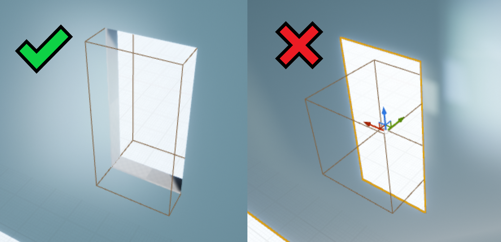

在左侧示例中，AkAcousticPortal 可检测到开口；在右侧示例中，无法检测到开口，因为 Mesh 太薄了。

- 使用 Details 面板内的 **Detection Radius** 属性来限制所检测开口的大小。通常来说，该值要大于所要检测的开口大小，同时又小于整个 Room 的尺寸。
  - 对于大部分采用厘米作为单位且窗户和房门开口大小适中的 Unreal 工程，500 的默认值即可满足需要。当然，您也可以根据具体情况来调节该值以贴合 Static Mesh 的尺寸。
  - 若 **Detection Radius** 小于开口大小，则将无法找到 Portal。
  - 若 **Detection Radius** 太大，则可能会检测到宽度跨越整个 Room 的错误 Portal。
- Portal 不能带有与 Fit To Geometry 追踪射线碰撞的实体房门或窗户（由 **Collision Channel** 属性决定）。否则，将无法检测到开口。若开口带有窗户或房门，请使用不同的碰撞设定，或按下 H 来隐藏窗户/房门，以便忽略 Mesh。

# Fit To Geometry 使用技巧

- 要想在关卡中快速填充 "AkAcousticPortal" 和 "AkSpatialAudioVolume" Actor，一般只需在相应 Actor 上启用 Fit To Geometry，然后在按住 Alt 的同时拖动 Actor 的 Translation 小组件，以此复制 Actor 并将其放置到关卡中的新位置。
- 若某些 Static Mesh Actor（如家具、道具、灯具等）妨碍了 Fit To Geometry 所执行的射线追踪并导致产生错误的结果，可通过按下 H 来隐藏这些 Actor，以便 Fit To Geometry 射线追踪将之忽略。##### Fit To Geometry 前提要求

##### 使用 Fit To Geometry 放置 AkSpatialAudioVolume

##### Automatically Assigning Surface Properties to AkSpatialAudioVolumes

##### 使用 Fit To Geometry 放置 AkAcousticPortal

##### Fit To Geometry 使用技巧

###### WwiseHelper as an Engine Plug-In

##### WwiseHelper Build Object

###### 基于文件名的 Location Resolver

##### File State

##### 声音引擎的 I/O Hook 和 File Location Resolver

##### SoundBank Manager 和 Media Manager

##### External Source Manager

#### Wwise Plug-in

#### WwiseNiagara Plug-in

#### WwiseSoundEngine Plug-in

#### Wwise Module

|  |
| --- |
| Wwise Unreal Integration Documentation |

Wwise Module

The Wwise module is a simple module that contains links to all of the other permanent modules. It is therefore easy to add a reference to the Wwise module in the project's Build.cs file, instead of references to each of the other modules.

The Wwise module also contains the compiled code of the optional modules and handles their initialization as well. For example, the AudioLink Runtime module is actually compiled and embedded within the Wwise module. Because of this module structure, the Wwise plug-in and its optional modules can be properly embedded as an Engine plug-in.

# WwiseHelper Build Object

To add module dependencies, we recommend that you set them up individually in the project's module if possible. It is possible to add direct access to one of Wwise plug-in's related modules, but doing so adds complexity and potential difficulty during upgrades, for example.

Instead of adding dependencies individually, we recommend that the project's module call:

`WwiseHelper.AddDependencies(this, Target);`

This call adds all dependencies from the other modules.

## WwiseHelper as an Engine Plug-In

It is not possible to include the WwiseHelper when it is part of the Engine plug-in. However, because it is a standalone file, you can copy it to the final project along with the other Build.cs files and use its contents. It is your responsibility to update its contents whenever a new version of the Wwise plug-in is released.

#### WwiseFileHandler 模块

|  |
| --- |
| Wwise Unreal Integration Documentation |

WwiseFileHandler 模块

The WwiseFileHandler module prepares and handles all External Sources, media, and SoundBank files. 该模块可预先加载、加载并以流方式传输文件，但其本身不会检查相关文件中有无依赖项。

每个文件都作为单独对象进行处理并且只会打开一次。对文件的使用通过 [File State](module_filehandler.html#filehandler_filestates) 单独追踪。在将 File State 提供给以下所述三个管理器之一后，可选择将对应文件提供给 [声音引擎的 I/O Hook 和 File Location Resolver](module_filehandler.html#filehandler_resolver) 。

WwiseFileHandler 需要 [WwiseResourceLoader](module_resourceloader.html) 先将文件及其选项一起注册为 *File State*。之后，声音引擎的 File Location Resolver 才可访问该文件。

因为元数据存储在 GeneratedSoundBanks 文件夹中并与素材一起作为打包信息进行烘焙，所以 [WwiseResourceLoader 模块](module_resourceloader.html) 可以决定需要哪些资源，之后再由 WwiseFileHandler 在加载可能需要它的资源之前提供所有 File State。

# File State

File State 会向 WwiseFileHandler 模块声明一个*已知文件*。借助 Load 和 Unload 操作，将文件提供给 WwiseFileHandler。藉此，确定其是否已经加载并需要计算引用计数。只要有用户使用文件，其 File State 就会保持活跃状态。

每项与 File State 相关的新操作都在其各自的 Execution Queue 中运行。队列中的操作按照次序异步执行。鉴于 File State 的异步特性，每个 File State 都有两个层面：公共的异步方法和受保护的同步方法。每个公共方法只不过是一个用于将操作推送到 Execution Queue 中的封装器。

主要状态有三种：Closed、Opened 和 Loaded。各个状态的定义有些随意，不过可以粗略定义如下：

- **Closed**：可安全删除文件。除少量内存外，其没有任何系统在使用的资源。
- **Opened**：已完成对文件操作的定义。文件已打开并可能在内存中部分或全部读取。对于流媒体，表示已打开文件并缓存了所需数量的预加载数据。对于内存中的媒体，表示已打开、完整读取并关闭文件；可用指针为其 **Opened** 状态。
- **Loaded**：已完成对声音引擎操作的定义。要么声音引擎获知该文件存在，要么向声音引擎提供了该文件。比如，对于流媒体，向 I/O Hook 提供了文件以便读取其内容。对于内存中加载的媒体文件，表示已通过 SetMedia 操作将其数据发送到声音引擎。同样，对于 SoundBank，表示已通过 LoadBank 方法类对其数据进行处理。

除此之外，还有表示向某一主要 File State 过渡的中间 File State。

由于操作是异步的并且可能需要很长时间，所以有时会有多项操作等待加载同一文件。在这种情况下，只有一项操作会被继续执行。在返回状态前，所有其余操作会等待该操作完成。比如，有个包含 12 个不同 Event 的 User-Defined SoundBank。这 12 个 Event 可能会同时请求加载同一 SoundBank。在这种情况下，只有加载了该 SoundBank，才会继续处理这些 Event。

对于耗时较长的音频操作，在 Unloading 时要特别注意。比如，对于包含较长混响尾音的 AK Convolution Reverb 文件，完成回响后才能将其卸载。又如，对于不间断的循环媒体，可能永远不会停止播放。这些操作可能会在很长时间内保持某种过渡状态。

另外，在处理混响尾音的同时，可能会发出对同一文件的请求。比如，在为新的地图收集资源时，该地图恰好在请求访问同一媒体。这时并不会卡在 Unloading 状态，而会将状态更改为 Reloading，并在第一时间取消卸载操作，然后将状态恢复为 Loaded。

# 声音引擎的 I/O Hook 和 File Location Resolver

声音引擎的 I/O Hook 和 File Location Resolver 负责在生命周期内协同处理流媒体素材。首先，File Location Resolver 会请求 WwiseFileHandler 打开文件。在打开后，I/O Hook 会请求 WwiseFileHandler 根据需要完成对已打开文件的异步 Read 请求。

在通过 Resolver 打开文件时，涉及以下操作：

1. 根据传递的 Short ID 查找 File State 映射。
2. 请求 File State 确认新的流传输请求。这时可能会更改其状态（取决于 File State 算法）。
3. 将结果返回给声音引擎。

在一般的游戏中，不到一毫秒就可完成所有这些操作，但是照样可能会被认为耗时比较长。不过，因为 File State 已被打开并可马上使用，所以可能并不需要额外的系统 I/O 操作。

在打开文件以供流传输后，会专门通过另一 Execution Queue 处理 I/O Hook 的异步 Read 操作。该队列旨在高效、及时地加以处理，确保以最优方式批量处理 Read 操作。除此之外，它还提供对流媒体的 Close 操作，确保在完成所有待处理 Read 操作后再执行 Close 操作。

跟所有的声音引擎回调一样，这些操作会在 Unreal 以外的线程中调用。它们具有不同的 Unreal 线程本地数据，堆栈大小不一样，优先级也可能不同。很多 Unreal 操作会因此而失败（比如 Stats 收集）。

## 基于文件名的 Location Resolver

Location Resolver 中的大部分 Open 操作都是基于各个映射中存储的 Short ID 执行的。

Integration 并不支持基于文件的路径名称来打开文件。Integration 只会基于 Short ID 打开文件。不过，也存在声音引擎可以基于文件的路径名称打开文件的情况。比如，有些算法（如 XML Error Translator）请求获取 "SoundBanks.xml" 文件。或者，在声音引擎写入文件的时候。这样做通常是为了在 Profile 和 Debug 版本中生成日志。

# SoundBank Manager 和 Media Manager

SoundBank Manager 提供 LoadSoundBank 和 UnloadSoundBank 操作，Media Manager 则提供 LoadMedia 和 UnloadMedia 操作。这两个管理器会追踪都创建了哪些 File State，并在请求获取 File State 以进行流传输时将信息发送给 Location Resolver。

两者通过相同的 Execution Queue 模式异步运行。因为 File State 的创建过程相对来说比较高效，所以在同时执行多项操作时通常很少有延迟。不过，可能需要更多时间来执行回调。因为文件必须处于适合使用的状态，包括声音引擎的加载或卸载。

# External Source Manager

The External Source Manager (refer to [使用 External Source](using_features_ext_src.html)) manages File States for External Sources. It is designed to be overridden by a user-developed module that implements a data model to track External Source media dependencies. The Wwise Simple External Source Manager is an example that uses Data Tables (.csv files) to map the External Sources to their corresponding media.

The manager provides a supplemental, editor-only operation for cooking that the user can override to properly stage External Source files. With this approach, users don't have to override the [WwiseResourceCooker 模块](module_resourcecooker.html) only to support their External Source Manager implementations.

Because the posted Events must include the External Sources they use when they are posted, the Integration automatically queries the External Source Manager for this information at the appropriate time. 有关详细信息，请参阅 [使用 Wwise Simple External Source Manager](using_features_simpleexternalsourcemanager.html) 章节。

#### WwiseProcessing Module

##### Global Callbacks

##### Event 和 Switch Container 资源

##### 更改语言

##### 访问信息：WwiseProjectDatabase 和 WwiseDataStructure

|  |
| --- |
| Wwise Unreal Integration Documentation |

WwiseProcessing Module

# Global Callbacks

The Integration includes a Global Callbacks singleton feature, which games and tools can use to leverage the Sound Engine’s `AkGlobalCallback`. For a description of the callbacks, see [AkGlobalCallbackLocation](https://www.audiokinetic.com/library/edge/?source=SDK&id=_ak_callback_8h_ae7a5e30e1402c7cf90d1b47420911676.html) in the Wwise SDK documentation. Each callback has several functions, each of which has its own uses. None of the functions is ideal in all scenarios.

The following functions are available for each callback:

- **<Location>Async**: The least expensive method, in which the callback is executed as soon as a Task Graph thread is available. You must ensure that the callback follows the best practices for multithreaded code.
- **<Location>Sync**: The fastest, most reactive method, but also the riskiest. It executes the callback in the sound engine threads, which can cause slowdowns and audio glitches. In addition, the limitations of threads created outside of the Unreal thread pools can affect performance. They don’t have the same Unreal thread-local data, stack sizes are different, and priority might be different. Use this option with caution.
- **<Location>Game**: The recommended method for user interface tasks, in which the callback must be executed on the Game Thread.

#### WwiseResourceLoader 模块

|  |
| --- |
| Wwise Unreal Integration Documentation |

WwiseResourceLoader 模块

WwiseResourceLoader 模块在 [WwiseFileHandler 模块](module_filehandler.html) 的上一层级，负责处理 Wwise 工程素材及其依赖项。跟 WwiseFileHandler 一样，WwiseResourceLoader 执行的两项主要操作也是加载和卸载各种资源。不过，WwiseResourceLoader 会针对所有素材类型执行这些操作。

比如，Aux Bus 可以与一个 SoundBank 关联。不过，也有可能依赖于与别的 SoundBank 关联的另一 Aux Bus。而且，其也可与各个效果器插件所需的媒体文件关联。在加载所有这些 SoundBank 和媒体文件之后，才能使用 Aux Bus。在 WwiseResourceLoader 收到加载 Aux Bus 的请求时，WwiseFileHandler 会加载所有这些资源。

# Event 和 Switch Container 资源

Event 是要加载的最复杂的 Wwise 对象，也是执行各种 Wwise 操作的基础。Wwise Event 可包含各种其他类型的 Wwise 对象。它可能需要准备外部源并加载多个必要的 SoundBank 和媒体文件。另外，还可能将所有这些依赖项嵌套在 Switch Container 层级结构内。此外，AkAudioEvent 素材还设有 [LoadOnReference](module_resourcecooker.html#switchloadinginevents) 选项。其仅在地图中当前加载了关联的 Switch 和 State 时加载 Switch Container 资源。在默认情况下，会禁用此优化选项。不过，在使用较大的 Switch Container 层级结构时启用可以节省内存。

比如，对于使用依赖于地面材质 Switch 的 Switch Container 的 *Play Footsteps* Event，只会为当前所加载地图中的 Switch 加载声音。此外，可能存在多个 Switch Container 分层。比如，仅通过 DLC 提供的高品质版本，或动态选择的条件（如鞋子种类、角色的重量或速度）。基于这些条件，可设置非常复杂的 Switch Container 层级结构。藉此，可在给定时间选择是否加载所有这些内容。

在 Integration 中，可借助 Switch Container Leaf 来管理这些条件。其中每个 Leaf 代表一组潜在条件（Switch 和 State）和满足条件时所须加载的关联 SoundBank、媒体及外部源。

虽然 Group Value（如 Switch 和 State）可以作为素材包含在工程中并打包到部署的游戏中，但仍可通过直接调用声音引擎中暴露的方法来以编程方式加以设置。在这种情况下，在使用 LoadOnReference 选项时，必须在设置 Group Value 前将相应信息发送到 WwiseResourceLoader 以便其准备加载潜在文件。比如，在代码将整个应用程序设为 High Quality 时，需要告知 WwiseResourceLoader 视为已经设置 Group Value。即便在烘焙之后，也可以编程方式为 Switch、State 和 Game Parameter 结构提供这些数据。

参见
:   - [Optimizing Memory Usage with Reference-Loaded Switch Containers](using_features_reference_load_switch_container.html)

# 更改语言

若应用程序的语言发生变化，WwiseResourceLoader 会重新加载本地化素材。在这个耗时的过程中，会卸载所有本地化的 SoundBank 和媒体，然后加载与新语言对应的资源。在此操作当中，会暂时无法使用受影响的素材，发送的话会导致发生错误。

#### WwiseProjectDatabase 模块

|  |
| --- |
| Wwise Unreal Integration Documentation |

WwiseProjectDatabase 模块

WwiseProjectDatabase 模块可用于未烘焙的工程（包括用在 Editor 中）。此模块提供基于内存的数据库视图，方便查看 Wwise 工程所生成 SoundBank 的当前状态。It uses the [Wwise Project Database Sample](https://www.audiokinetic.com/en/library/edge/?source=SDK&id=soundengine_project_database_samplecode.html) with its own Adapter Types: The Unreal Adapters.

# 访问信息：WwiseProjectDatabase 和 WwiseDataStructure

WwiseProjectDatabase 模块会通过其访问方法来处理查询。比如，您可以请求获取所有已知 SoundBank，也可请求获取特定的 SoundBank。数据本身保存在其 DataStructure 成员中。

通常，WwiseProjectDatabase 中一次只会加载一个平台以供烘焙和打包；不过，在必要时可以加载不止一个平台。

|  |  |
| --- | --- |
|  | **注記：** 在 Mac 上使用 Unreal Editor 处理工程时，只有 Mac 平台是必须加载的。 |

#### WwiseResourceCooker 模块

###### 默认实例化和平台实例化

###### Package as Bulk Data

###### ExportDebugNameRule

###### LoadOnReference

##### 为 Wwise 对象准备已烘焙数据

##### 从烘焙 Wwise 资源到暂存

##### 烘焙选项

|  |
| --- |
| Wwise Unreal Integration Documentation |

WwiseResourceCooker 模块

WwiseResourceCooker 模块提供以下功能：

- 针对 [WwiseResourceLoader 模块](module_resourceloader.html) 将 WwiseObjectInfo 结构转换为已烘焙结构。
- 将所请求对象的文件从 GeneratedSoundBanks 复制到打包过程所用的 Staging 目录。

参见
:   - [Content Cooking](https://dev.epicgames.com/documentation/en-us/unreal-engine/cooking-content-in-unreal-engine) (Unreal Engine documentation)

# 为 Wwise 对象准备已烘焙数据

WwiseResourceCooker 由用于识别特定 Wwise 对象的 WwiseObjectInfo 结构开始，从与该 Wwise 对象相关的 Project Database 收集各种信息，并返回已烘焙并包含该信息的数据结构。

对于 SoundBank 或媒体文件，操作起来比较简单。因为这些都是最基本的，其各自代表不同的文件。外部源相对也比较简单。不过，它们通常由用户定义，所以复杂性不得而知。也就是说，默认生成的已烘焙数据仅将 Cookie 作为非调试信息。

有些已烘焙数据仅包含 Short ID。就跟包含 Cookie 的外部源一样，Trigger、Game Parameter (RTPC) 和 Acoustic Texture 的已烘焙数据中只需要 Short ID 信息。同样，Switch 和 State 只需要其所属分组的标识符及其所代表的值。

其他对象（如 Auxiliary Bus 和 Effect ShareSet）可能会稍微复杂一些。最复杂的是 Event。其可能包含多个所需媒体、SoundBank、外部源、Aux Bus 和多个可选 Switch Container 元素。

## 默认实例化和平台实例化

WwiseResourceCooker 模块包含 Editor 和未烘焙工程中使用的默认实例化。此实例化用于 Play in Editor 模式，可在 Editor 中加载 Wwise 素材时根据需要提供已烘焙数据。此数据类似于已烘焙并在打包好的游戏中的 Wwise 素材中序列化的数据。唯一的区别在于 Editor 的已烘焙数据直接使用 GeneratedSoundBanks 文件夹中的资源文件（.bnk 和 .wem）。与之相比，已烘焙并打包的数据使用随游戏一起打包的资源文件。

在打包时，通常会生成外部烘焙过程，其只负责烘焙特定的平台。比如，在 Mac 电脑上会将默认实例化用于 Mac 平台。这时可以将 Android WwiseResourceCooker 实例化来打包 Android 游戏。

由于为平台加载 Project Database 可能会很耗时，所以只会针对各个烘焙过程加载所需的平台。通常，这意味着只会在 Project Database 中加载一个平台。不过，若同一过程在烘焙多个平台，或直接在编辑器过程内烘焙，则可能会加载多个平台。

# 从烘焙 Wwise 资源到暂存

基于已烘焙并在内部缓存的数据，将所有必要文件从 GeneratedSoundBanks 复制到 Staging 目录。媒体和 SoundBank 代表单个文件。外部源由用户定义，因为 Cookie 不代表文件。其他对象代表一个以上的文件。比如，Init Bank 从技术层面来说是 SoundBank。它也可能需要外部媒体文件。因此，在烘焙 Init Bank 时还会复制其媒体文件。

# 烘焙选项

以下烘焙选项可用于打包好的游戏。

## Package as Bulk Data

A **Package as bulk data** is available in the Unreal Project Settings dialog in the Wwise - Integration Settings section. This setting determines how Wwise assets are packaged during cooking.

If the setting is selected, the packaging process changes in the following ways:

- Wwise data files used in a single location in the Wwise project are packaged inside the assets that reference them. For example, if an Unreal asset called FootstepsAudioEvent references a Wwise auto-defined SoundBank Event called Play\_Footsteps, then when it is packaged the SoundBank and the associated Wwise Media are bundled inside the Footsteps AudioEvent UAsset as Unreal Bulk Data.
- Wwise External Sources and shared files are not packaged inside the Unreal assets. For example, if an Unreal object called PlaySnareAudioEvent references a Play\_Snare Event inside a user-defined SoundBank called DrumKit, then the DrumKit is packaged as individually copied files.
- This setting enables the **Libraries used for cooking Wwise UAssets as BulkData** option, through which you can define a prioritized order of Wwise Asset Libraries that are used to package shared Wwise files or specific files.
- When enabled, you can also use the Unreal **Multi-Process Cooking** or **Iterative Cooking** option. Due to engine limitations, these options only function fully when Wwise assets are packaged as bulk data.

If the setting is not selected:

- Wwise data files are individually copied as additional files alongside the other assets. They can be packaged as Pak files, but are not packaged in the IO Store.
- Incremental cooking is unreliable. Every additional file that Unreal doesn't handle directly (such as .uasset and .umap files) are copied and never cleaned up. You can, however, delete all the .wem and .bnk files before the cooking or packaging process begins.
- Multi-process cooking is unreliable. If a shared asset is cooked by two different processes, the latter will fail. There is no workaround.

参见
:   - [Packaging Wwise Assets as Bulk Data](using_features_package_as_bulk_data.html)

## ExportDebugNameRule

在 Editor 中针对默认实例进行烘焙时，每个已烘焙素材都有一个调试名称。该名称中包含完整的 Wwise Object Path。藉此，可在调试时轻松识别素材。

在对打包好的游戏进行烘焙时，ExportDebugNameRule 会确定是填充各个素材的调试名称字段还是将其保留为空。通过将这些字段保留为空，可减小文件的大小并方便实施逆向工程；不过也增加了调试的难度，因为只能使用素材的 Short ID 来识别已烘焙数据中的对应 Wwise 对象。

## LoadOnReference

您可以在 AkAudioEvent 素材上启用 LoadOnReference 选项。若启用该选项，会根据当前加载的 Switch 和 State 仅加载所需的 SoundBank 和媒体。在加载和卸载 Switch 或 State 时，会反过来动态地加载和卸载关联的资源。若禁用该选项，在加载包含 Switch Container 的 Event 时，会加载这些 Switch Container 使用的所有 SoundBank 和媒体。

在启用此选项时，烘焙过程会为 Event 准备已烘焙数据，以便为这种动态加载资源的方式提供支持。在禁用该选项时，已烘焙数据会随 Event 一起加载所有资源。

您可以根据需要为各个素材分别启用此选项。

|  |  |
| --- | --- |
|  | **注記：** 启用此选项会增加很多麻烦。为此，需要对功能有清楚的了解，尤其是在工程以编程方式设置 Switch 和 State 的时候。在大部分情况下，该选项带来的优化并不足以抵消这些缺点。 |

参见
:   - [Optimizing Memory Usage with Reference-Loaded Switch Containers](using_features_reference_load_switch_container.html)

#### WwiseSoundEngine 模块

##### 静态声音引擎桥接

##### Null SoundEngine

|  |
| --- |
| Wwise Unreal Integration Documentation |

WwiseSoundEngine 模块

# 静态声音引擎桥接

WwiseSoundEngine 模块包含 Wwise 声音引擎 API 接口以及各种捆绑插件。

Wwise 声音引擎中的大部分函数都在尽可能低的层级实施桥接。为了调用 Wwise 声音引擎 API，必须通过桥接来调用这些函数：

auto\* SoundEngine = IWwiseSoundEngineAPI::Get();

if (UNLIKELY(!SoundEngine)) return;

|  |  |
| --- | --- |
|  | **注意：** 不要直接使用任何 `AK::` 或 `ak::` 函数，否则可能会导致链接器错误、不稳定或发生崩溃。 |

在 Wwise 2022.1 之前，需要在 `AkAudio` 模块内从 `AkAudioDevice` 执行所有 `AK::SoundEngine` 调用。现在不必再这样做了，但原有方法仍可使用。在有些情况下，原有方法可能更好用。因为其为用户代码提供了更多功能，包括由 Unreal 类转换为 Wwise 原生类型，以及通过 Blueprint 执行各种操作。

There are multiple optional modules, specifically WwiseSoundEngine followed by the Wwise version (such as WwiseSoundEngine\_2024\_1), which contains the code that bridges the WwiseSoundEngine interface and the actual Wwise Sound Engine API.

# Null SoundEngine

The Wwise Integration for Unreal connects the Wwise SoundEngine to the Unreal Engine. There are valid reasons to disable the SoundEngine at build time:

- **Executing a server**: The Wwise Integration for Unreal is client-specific. Avoid running a Wwise SoundEngine on a server.
- **Executing a program**: Unreal programs perform various tasks, such as building, packaging, or cooking. Unreal Frontend and Insights are examples of programs with user interfaces. The Wwise SoundEngine is meant to be used exclusively for what Unreal defines as Games, and the Editor.
- **Building for an unsupported platform or platform version**: The Wwise SoundEngine includes optimized binaries for many modern platforms, but the binary files might not be installed for a particular platform. There might also be a different platform SDK version installed and selected than the ones used to build the Wwise SoundEngine.

It is therefore impossible to link the actual Wwise SoundEngine to the final executable. In these cases, the build scripts use the null SoundEngine. The null SoundEngine is an empty implementor that sits on top of the SoundEngine abstraction provided in the WwiseSoundEngine bridging module. Most functions return **AK\_NotImplemented** without any side effects.

Because the bridge requires the Wwise SoundEngine type definitions to be accurate for the platform, the **ThirdParty/include** folder must contain an interface for the platform, even if it is not activated in the current context. It is therefore impossible to guarantee that a build for an unsupported platform will work, even with the null SoundEngine.

There are also valid reasons to disable the SoundEngine at runtime:

- **Using the null SoundEngine** from build time.
- **Disabling audio**: Multiple options allow a game or the editor to run without sound.
- **Running a commandlet**: Editor commandlet operations complete without displaying a user interface. These are specialized programs built inside the Unreal Editor itself.
- **Error in initialization**: If the Wwise SoundEngine fails to initialize, or if the SoundBanks were never Generated for the project.

Typically, the Wwise SoundEngine is disabled when the Wwise SoundEngine is linked inside the final executable package. Some of the issues can be fixed without restarting the Editor. Runtime issues do not use the null SoundEngine unless specified.

The logic for a supported target is executed during Unreal's project generation step in **WwiseUEPlatform.IsWwiseTargetSupported**. You can determine whether the null SoundEngine is used in UBT's logs: The "Wwise SoundEngine is disabled: Using the null SoundEngine instead." log will be displayed along with the reason. This message appears multiple times when building the Wwise SoundEngine as an Engine plug-in. The message is informative, not an error.

To help with debugging, a similar message is also repeated at runtime in the logs during the Wwise plug-in initialization: "Wwise SoundEngine is disabled: Using the null SoundEngine."

### Unreal Spatial Audio 教程

|  |
| --- |
| Wwise Unreal Integration Documentation |

Unreal Spatial Audio 教程

以下教程将展示 Wwise Unreal 集成中所含的各种 Spatial Audio 功能。第一项教程主要是为了帮助您准备工程。接下来的每项教程会分别介绍一种不同的 Spatial Audio 功能。这些章节之间并不相干，您可以根据需要自由查阅。

|  |  |
| --- | --- |
|  | **注記：** 在章节中使用 Reflect 插件生成 SoundBank 时，必须获取相应的授权。 |

- [Spatial Audio 教程准备工作](sa_setup.html)   
  Spatial Audio 教程准备工作。
- [Reflect](sa_reflect.html)   
  简要介绍 Reflect 插件。
- [Room 和 Portal](sa_roomsandportals.html)   
  简要介绍 Spatial Audio 中的 Room 和 Portal。
- [衍射](sa_diffraction.html)   
  使用衍射。
- [Occlusion](using_features_occlusion.html)   
  Using occlusion.
- [透射](sa_transmission.html)   
  使用透射。
- [Spatial Audio Blueprint 组件](sa_components.html)   
  使用 Spatial Audio 组件创建自定义 Blueprint 类。
- [Reverb Parameter Estimation](sa_reverbestimation.html)   
  自动估算混响参数。
- [Fit to Geometry](sa_fittogeometry.html)   
  自动调节 Spatial Audio Portal 和 Volume 以使其与关卡的几何构造相称。

参见
:   - [Wwise Spatial Audio 对象](pg_features_spatialaudio.html)
    - [Spatial Audio 对象 Blueprint 函数](features_blueprint_spatialaudio.html)
    - [Spatial Audio SDK 文档](https://www.audiokinetic.com/library/edge/?source=SDK&id=spatial_audio.html)

### Understanding the Wwise Unreal Integration Plug-ins

|  |
| --- |
| Wwise Unreal Integration Documentation |

Understanding the Wwise Unreal Integration Plug-ins

The Wwise Unreal Integration is divided into multiple plug-ins, each with its own subset of modules.

You can add a `Wwise<Name>ModuleName` configuration to the Audio section of the Engine settings file, which overrides the default behavior of most modules. See [覆盖 Wwise Unreal 集成](using_cpp.html#overriding_integration_cpp) for more information.

You can use the following modules to customize the Wwise Unreal Integration for your workflow.

# Wwise Plug-in

The Wwise Plug-in contains the traditional Wwise Unreal Integration, a managed integration that provides users with a suggested workflow.

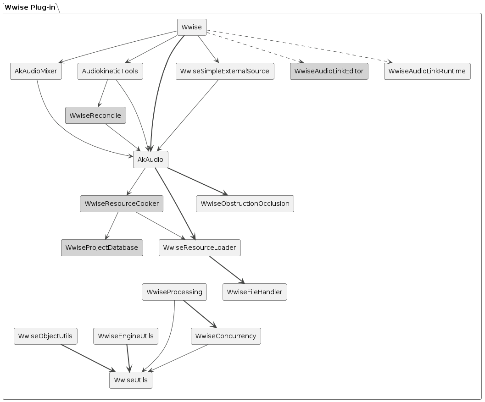

- AkAudio 模块  
  该根模块适用于大部分面向用户的 Integration 功能。
- [Wwise Module](module_wwise.html)   
  A simple module that links to all of the other optional modules.
- Concurrency Module   
  Low-level constructs allowing operations to be properly threaded.
- [WwiseFileHandler 模块](module_filehandler.html)   
  Provides the Wwise sound engine with the media, SoundBanks, and external sources it needs, and handles requests from the Wwise Location Resolver and I/O Hook.
- ObstructionOcclusion Module   
  Provides the Obstruction and Occlusion algorithms. See [Occlusion](using_features_occlusion.html) for details.
- [WwiseProcessing Module](module_processing.html)   
  Provides asynchronous processing of runtime objects. This is currently limited to Global Callbacks.
- [WwiseResourceLoader 模块](module_resourceloader.html)   
  At a high level, handles all Wwise object types and interfaces with the [WwiseFileHandler 模块](module_filehandler.html) to load and unload the files associated with these Wwise objects.
- Utils Modules (EngineUtils, ObjectUtils, Utils)   
  Provides basic utilities and helpers for features such as cross-engine version support and test suites.

**未烘焙的工程和编辑器模块：**

- AudiokineticTools Module   
  Contains Editor-specific AkAudio module features.
- [WwiseProjectDatabase 模块](module_projectdatabase.html)   
  该模块提供基于内存的数据库视图来显示 Wwise 工程所生成 SoundBank 的当前状态。
- Reconcile Module   
  Provides tools to reconcile Unreal project assets with Wwise project assets.
- [WwiseResourceCooker 模块](module_resourcecooker.html)   
  Converts Wwise Object Info structures to Cooked structures for the WwiseResourceLoader and copies a requested object’s files from the GeneratedSoundBanks directory to the Staging directory of the packaging process.

**可选模块：**

- AudioLink Modules   
  Allows a project to pipe the audio part of each Unreal component into a Wwise project's input component. See [Combining Unreal and Wwise Audio with AudioLink](using_audio_link.html) for more information.
- [WwiseSimpleExternalSourceManager 模块](using_features_simpleexternalsourcemanager.html)   
  A minimal External Source Manager implementation used for internal testing as well as in certain projects, such as the Wwise Demo Game.

# WwiseNiagara Plug-in

The WwiseNiagara plug-in contains a unique module, WwiseNiagara. When enabled alongside Unreal's Niagara plug-in, it allows a simple usage of Wwise audio components inside a Niagara particle emitter. See [使用 Wwise Unreal Niagara Integration](using_features_niagara.html) for more information.

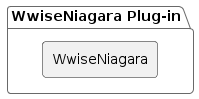

# WwiseSoundEngine Plug-in

The WwiseSoundEngine plug-in is lowest-level part of the Wwise SoundEngine, and is used by the Wwise plug-in. It contains the bridge to the Wwise libraries, and has no automated features. It can be useful for projects that require custom Unreal integrations.

The plug-in adds several Unreal Build Tool (UBT) features: the ThirdParty folder is parsed, and bridges to older compatible versions are automatically provided. Plug-in directories and platform support are also determined.

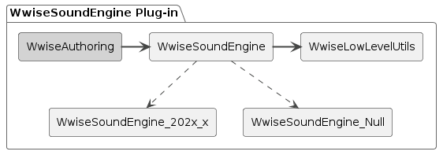

- Authoring Module   
  On platforms and configurations that support WAAPI (Wwise Authoring API), this enables connections to Wwise Authoring through a network socket. No Unreal-aware client is provided. This is an Editor-specific module. See [Wwise Authoring API (WAAPI)](using_features_waapi.html) for more information.
- LowLevelUtils Module   
  Low-level utilities and helpers that provide features such as version determination and Unreal statistic reporting.
- [WwiseSoundEngine 模块](module_soundengine.html)   
  At the lowest level, provides the bridge between the Wwise SoundEngine libraries and the Unreal project. The current WwiseSoundEngine version of the plug-in provides the current version of the API, with backward compatibility when possible.

**可选模块：**

- WwiseSoundEngine Versioned Modules   
  Provides the bridges to previous versions of the Wwise SoundEngine, allowing for backward compatibility. See [静态声音引擎桥接](module_soundengine.html#soundengine_bridging) for more information.
- WwiseSoundEngine\_Null Module   
  Provides a bridge to a "null" SoundEngine, where the SoundEngine is ignored. This is used for some Unreal build configurations, such as program and server configurations. See [Null SoundEngine](module_soundengine.html#soundengine_null) for more information.

#### 新增功能

#### 行为改进

#### 漏洞修复

#### 社区报告的漏洞修复

#### 新增功能

#### API 改进

#### 行为改进

#### 其他改进

#### 漏洞修复

#### 社区报告的漏洞修复

### 版本说明 2025.1.4

|  |
| --- |
| Wwise Unreal Integration Documentation |

版本说明 2025.1.4

此 Integration 的各个版本分别与特定的 Unreal Engine 版本对应。此文档列出了 Integration 2025.1.4 版本中所作的改进。

**兼容性：**

- Wwise SDK：2025.1.4
- Unreal：此 Integration 支持并针对 Unreal Engine 5.5、5.6 和 5.7 编译，并且针对 Unreal Engine 5.7 进行了测试。

|  |  |
| --- | --- |
|  | **注記：** 此 Integration 版本不支持实验性的 Unreal Engine 功能。 |

有关早期版本的信息，请参阅 [过往版本的发行说明](previousreleases.html) 章节。

- [新增功能](releasenotes_2025_1_4.html#generic_feature_changes_2025_1_4)
- [行为改进](releasenotes_2025_1_4.html#generic_behavior_changes_2025_1_4)
- [漏洞修复](releasenotes_2025_1_4.html#generic_bugs_2025_1_4)
- [社区报告的漏洞修复](releasenotes_2025_1_4.html#generic_community_bugs_2025_1_4)

# 新增功能

- **WG-80205** 在 Reconcile 窗口中添加了 **Force delete referenced assets** 选项以省去手动操作的麻烦。
- **WG-80403** 为 Wwise Browser 中的 Expand All 和 Collapse All 按钮添加了自定义图标。

# 行为改进

- **WG-80204** 现在会将未使用的 Trigger 标记为 Unused Trigger 而非 New in Wwise。

# 漏洞修复

- **WG-73482** 已修复：在执行调和操作时可能会删除只在磁盘上引用的 UAsset。
- **WG-74931** 已修复：Sequencer 选项卡中不显示图标。
- **WG-80064** 已修复：对于未包含在 SoundBank 中的对象，可能会在 Wwise Browser 中显示重复的条目。
- **WG-80364** 已修复：在未设置 AudioLink Start Event 时，`WwiseAudioLinkSourcePushed` 发生崩溃。
- **WG-80392** 已修复：Wwise Browser 中的 Work Unit 明明是空的却显示展开箭头。
- **WG-80653** 已修复：因为 `FWwiseFileState::ProcessLaterOpQueue` 发生崩溃。
- **WG-80655** 已修复：在大量使用时卸载并重新加载素材可能会导致 ResourceLoader 和 FileState 发生崩溃或停止响应。
- **WG-81342** 已修复：在实时编辑新的 Event 时，Unreal Editor 发生崩溃。

# 社区报告的漏洞修复

- **WG-79689** 已修复： `AkGameplayStatics` 、 `AkGameplayTypes` 和 `AkDialogueEvent` 中还在使用裸指针 UPROPERTY。
- **WG-80112** 已修复：Unreal Editor 启动时会在版本控制系统中签出平台配置文件。
- **WG-80150** 已修复：Wwise 素材库的迭代时间很长。
- **WG-80449** 已修复：在调用 `HasSimpleCollisionGeometry()` 时会复制几何构造中的所有形状。
- **WG-80466** 已修复： `g_pAssertHook` 导致服务器构建失败。
- **WG-80787** 已修复：在同一 Event 同时播放多个声音时发生内存泄漏。
- **WG-80817** 已修复：将缺失的文件打包为批量数据会导致打包好的游戏发生崩溃。
- **WG-81129** 已修复：每次启动 Editor 都会修改 `DefaultEngine.ini` 。

### 版本说明 2025.1.3

|  |
| --- |
| Wwise Unreal Integration Documentation |

版本说明 2025.1.3

此 Integration 的各个版本分别与特定的 Unreal Engine 版本对应。此文档列出了 Integration 2025.1.3 版本中所作的改进。

**兼容性：**

- Wwise SDK：2025.1.3
- Unreal：此 Integration 支持并针对 Unreal Engine 5.5、5.6 和 5.7 编译，并且针对 Unreal Engine 5.7 进行了测试。

|  |  |
| --- | --- |
|  | **注記：** 此 Integration 版本不支持实验性的 Unreal Engine 功能。 |

有关早期版本的信息，请参阅 [过往版本的发行说明](previousreleases.html) 章节。

- [新增功能](releasenotes_2025_1_3.html#generic_feature_changes_2025_1_3)
- [API 改进](releasenotes_2025_1_3.html#generic_api_changes_2025_1_3)
- [行为改进](releasenotes_2025_1_3.html#generic_behavior_changes_2025_1_3)
- [其他改进](releasenotes_2025_1_3.html#generic_misc_2025_1_3)
- [漏洞修复](releasenotes_2025_1_3.html#generic_bugs_2025_1_3)
- [社区报告的漏洞修复](releasenotes_2025_1_3.html#generic_community_bugs_2025_1_3)

# 新增功能

- **WG-70600** 现在会在将鼠标悬停在 Wwise Browser 中的“设置”图标之上时显示 Wwise SoundEngine 和 Wwise Unreal Integration 版本。
- **WG-72432** 现在可在 Reconcile 窗口中双击对象来打开 Unreal Content Browser 并转到对应 UAsset 所在位置。在需要手动删除 UAsset 时，若无其他调和操作可用，则 **Reconcile** 按钮不可用。
- **WG-74870** 添加了 **Suspend Audio During Focus Loss** 和 **Render During Focus Loss** 音频初始化设置以便确定在无法聚焦时音频是否暂停。
- **WG-76512** 添加了相应键盘快捷方式以便生成所有 SoundBank (Ctrl+Alt+F7)、为当前平台生成 SoundBank (Ctrl+Shift+F7)、调和 (Shift+R)。
- **WG-79872** 在 Wwise Browser 和快捷菜单中添加了 **Collapse All** 和 **Expand All** 按钮。
- **WG-79876** 添加了对 Unreal Engine 5.7 的支持。

# API 改进

- **WG-73689** 将有些 RTPC 实例重命名为了 GameParameter。
- **WG-79595** 向 AkSoundEvent 添加了 "SeekOnEvent" Blueprint。
- **WG-80163** 针对 Wwise 2025.1 SDK 改进添加了桥接支持。
- **WG-80378** 添加了相应工具以便在将异步 Bank 操作加入队列后调用 `ProcessBanks`。

# 行为改进

- **WG-45196** 现在停止 Play in Editor 会话会将所有全局 RTPC 重置为默认值。
- **WG-65680** 在 Wwise Browser 的 Event 快捷菜单中将 "WwiseBrowser" 重命名为了 "Playback"。
- **WG-66190** 在 Wwise Browser 中将 "AcousticTextures" 文件夹重命名为了 "Virtual Acoustics"。
- **WG-74935** 在 Wwise Browser 中，现在会将未使用的效果器标记为 Unused 而非 New in Wwise。
- **WG-75940** Wwise Browser 快捷菜单中不再显示不适用于选定条目的选项。
- **WG-76650** 更改了 Wwise Browser 中根条目的顺序。
- **WG-76812** 对所有提到 WAAPI Picker 的地方进行了修改，统一了 Wwise Unreal 用户设置中的名称和描述。
- **WG-77437** 在 Wwise Browser 中将 "Orphaned" 文件夹重命名为了 "Found only in Unreal"。
- **WG-78203** 现在会在 **Connect to WAAPI** 设为 false 时隐藏 WAAPI 设置。
- **WG-79477** 在 Post Event 节点的 Callback Mask 部分将 "MIDIEvent" 重命名为了 "MIDI Event"。
- **WG-79492** 不再默认创建 WwiseMultiReferenceAssetLibrary。

# 其他改进

- **WG-75456** 将 "AnimNotify\_AkEvent" Blueprint 转换为了 C++。
- **WG-76524** 对 Wwise Browser 中的名称进行了更新以与 Wwise 中新的层级结构名称保持一致。
- **WG-80637** 为了跟 Wwise 2025.1 中的新层级结构名称保持一致对 Unreal 素材的名称进行了更新。

# 漏洞修复

- **WG-72254** 已修复：Wwise Browser 中显示空的 Work Unit。
- **WG-73681** 已修复：将 Initialization Settings 名称中包含的 RTPC 替换为了 Game Parameter。
- **WG-74363** 已修复：在 Audiolink Settings 的 Start Event 无效时发生崩溃。
- **WG-74815** 已修复：在放大时无法正确调整 AkSpotReflector 图标的大小。
- **WG-75194** 已修复：在 Wwise Browser 中双击 Audio\_Device 时不会跳转到对应的 UAsset。
- **WG-77408** 已修复：在 Wwise Browser 中按住 F5 时只刷新浏览器一次。
- **WG-78851** 已修复：Aux Bus 显示 Deleted in Wwise。
- **WG-78954** 已修复：重复销毁失败的 `TryUnsetMedia` 操作会引发崩溃。
- **WG-79548** 已修复：在右键单击 Content Browser 时不显示图标预览。
- **WG-79600** 已修复：Blueprint 中显示 Last 枚举值。
- **WG-79760** 已修复：Unreal 5.6 中找不到 **Visualize Rooms And Portals** 和 **Show Reverb Info** 复选框。
- **WG-79899** 已修复：(Acoustics) Reverb Zone Auto Parent 对 Room 的启用或禁用没有反应。
- **WG-79975** 已修复：StopWhenOwnerDestroyed 无法停止已卸载的 Sub Level 中的 Event。
- **WG-79976** 已修复：在预览无效的 Wwise Event Asset 时发生崩溃。
- **WG-80214** 已修复：禁用 WAAPI 可能会引发崩溃。
- **WG-80287** 已修复：在启用 **Auto Connect To WAAPI** 设置时 Editor 时不时发生崩溃。
- **WG-80338** 已修复：在 Term 全局回调期间没有卸载媒体。并且，在 SoundEngine 终止后仍将 Bank 保留在 SoundEngine 中。

# 社区报告的漏洞修复

- **WG-77531** 已修复：(WAAPI) 在启动 Unreal Editor 时，即便取消选中 **Auto Connect to WAAPI**，WAAPI 客户端也会发生崩溃。
- **WG-79041** 已修复：WwiseFileState 中的布尔日志条件有误。
- **WG-79498** 已修复：Unreal Engine 5.6 及更高版本将素材库标记为隐藏的依赖项。
- **WG-80074** 已修复：在 Integration Settings 中选中 **Enable Wwise SoundEngine Only** 时无法执行 Post Wwise Persistent Event 操作。
- **WG-80085** 已修复：在关闭 Unreal Editor 时产生过多日志消息。

### 版本说明 2025.1.2 Beta 3

#### 新增功能

#### API 改进

#### 漏洞修复

#### 社区报告的漏洞修复

#### 文档改进

#### 新增功能

#### 其他改进

#### 漏洞修复

#### 社区报告的漏洞修复

#### 文档改进

#### 新增功能

#### API 改进

#### 性能改进

|  |
| --- |
| Wwise Unreal Integration Documentation |

版本说明 2025.1.2 Beta 3

此 Integration 的各个版本分别与特定的 Unreal Engine 版本对应。此文档列出了 Integration 2025.1.2 版本中所作的改进。

**兼容性：**

- Wwise SDK：2025.1.2
- Unreal：此 Integration 支持并针对 Unreal Engine 5.4、5.5 和 5.6 编译，同时针对 Unreal Engine 5.6 进行了测试。

|  |  |
| --- | --- |
|  | **注記：** 此 Integration 版本不支持实验性的 Unreal Engine 功能。 |

有关早期版本的信息，请参阅 [过往版本的发行说明](previousreleases.html) 章节。

- [新增功能](releasenotes_2025_1_2.html#generic_feature_changes_2025_1_2)
- [API 改进](releasenotes_2025_1_2.html#generic_api_changes_2025_1_2)
- [漏洞修复](releasenotes_2025_1_2.html#generic_bugs_2025_1_2)
- [社区报告的漏洞修复](releasenotes_2025_1_2.html#generic_community_bugs_2025_1_2)
- [文档改进](releasenotes_2025_1_2.html#generic_documentation_improvements_2025_1_2)

# 新增功能

- **WG-75067** Wwise Browser 会使用 ak\_wwise\_core\_object\_structureChanged 来接收工程结构更改。
- **WG-75076** Wwise Browser 会使用 ak\_wwise\_core\_object\_structureChanged 来接收工程结构更改。

# API 改进

- **WG-75748** 添加了 FAkDynamicSequenceTransition 来替换 TransitionDurationMS 和 FadeCurve。
- **WG-75851** 将 UAkDynamicSequence 的 "PostDialogueEvent" 重命名为了 "PostDialogueEventInPlaylist"。
- **WG-77913** 对 `build.cs` 文件进行了重构以便将通用代码放在公共文件中。

# 漏洞修复

- **WG-69386** 已修复：(Acoustics) Fit to Geometry 对采用非默认 Brush 大小的 Portal 不起作用。
- **WG-70779** 已修复：(Acoustics) 未按预期更新 AkReverbZone 父级 Room 名称。
- **WG-75191** 将 Wwise Browser 的 "Master Mixer Hierarchy" Filter 重命名为了 "Busses"。
- **WG-77519** 已修复：Wwise Browser 中会显示 Audio Node。
- **WG-77532** 已修复：在修改 AudioNode 时生成了过多的日志。
- **WG-78467** 已修复：(Acoustics) Fit to Geometry 对自定义碰撞通道不起作用。
- **WG-79414** 已修复：默认启用编组功能。

# 社区报告的漏洞修复

- **WG-77810** 已修复：(Acoustics) AkRoomComponent 有时会在注册 Room 游戏对象前尝试发送其 Auto Post AkEvent。
- **WG-79283** 已修复：在 Unreal 5.5 中重新加载 Media Info Table 或 Default Media Table 时触发断言。
- **WG-79354** 已修复：Callback Switch 缺少 MIDI Event。
- **WG-79637** 已修复：在关闭游戏时流播放发生崩溃。

# 文档改进

- **WG-78824** 添加了有关 Spatial Audio Outdoors Room 的信息。
- **WG-79666** 添加了更多有关 Acoustic Texture 的细节。
- **WG-79668** 澄清了 AkRoomComponent 和 AkLateReverbComponent 文档相关描述。

### Release Notes 2025.1.1 Beta 2

|  |
| --- |
| Wwise Unreal Integration Documentation |

Release Notes 2025.1.1 Beta 2

此 Integration 的各个版本分别与特定的 Unreal Engine 版本对应。此文档列出了 Integration 2025.1.1 版本中所作的改进。

**兼容性：**

- Wwise SDK：2025.1.1
- Unreal：此 Integration 支持并针对 Unreal Engine 5.4、5.5 和 5.6 编译，同时针对 Unreal Engine 5.6 进行了测试。

|  |  |
| --- | --- |
|  | **注記：** 此 Integration 版本不支持实验性的 Unreal Engine 功能。 |

有关早期版本的信息，请参阅 [过往版本的发行说明](previousreleases.html) 章节。

- [新增功能](releasenotes_2025_1_1.html#generic_feature_changes_2025_1_1)
- [其他改进](releasenotes_2025_1_1.html#generic_misc_2025_1_1)
- [漏洞修复](releasenotes_2025_1_1.html#generic_bugs_2025_1_1)
- [社区报告的漏洞修复](releasenotes_2025_1_1.html#generic_community_bugs_2025_1_1)
- [文档改进](releasenotes_2025_1_1.html#generic_documentation_improvements_2025_1_1)

# 新增功能

- **WG-78502** 添加了对 Unreal Engine 5.6 的支持。

# 其他改进

- **WG-78366** 降低了 AssetLibrary 日志的严重性。

# 漏洞修复

- **WG-79093** 已修复：在退出时，AudioType Resources 有时出现卡顿或发生崩溃。

# 社区报告的漏洞修复

- **WG-76672** 已修复：在 Unreal Niagara Module 中调用 `ConditionalBeingDestroy` 时可能会发生崩溃。
- **WG-77138** 已修复：在将所有参数保留设为默认值并启用 AutoPost 时， `FAkAudioDevice::SpawnAkComponentAtLocation` 导致检查失败。
- **WG-77589** 已修复：Wwise Simple External Source Manager 因 Data Table 无效而发生崩溃。
- **WG-77912** 已修复：在卸载相应模块后才卸载 SoundEngine，导致在执行回调和流播放时发生崩溃。
- **WG-77946** 已修复：在为 `ExecutionQueue` 和 `DeferredQueue` 使用 `TQueue` 时可能会发生崩溃。
- **WG-78708** 已修复：由于 `FWwiseAssetLibraryProcessor::FilterLibraryAssets` 比较复杂，导致在 Unreal 中使用 Wwise Asset Library 时出现性能问题。

# 文档改进

- **WG-77640** 现在建议使用 AudioLink 而非 AkAudioMixer。
- **WG-79087** 在 Unreal Project Settings 页面添加了之前缺失的 Spatial Audio 设置。

### Release Notes 2025.1.0 Beta 1

|  |
| --- |
| Wwise Unreal Integration Documentation |

Release Notes 2025.1.0 Beta 1

此 Integration 的各个版本分别与特定的 Unreal Engine 版本对应。此文档列出了 Integration 2025.1.0 版本中所作的改进。

**兼容性：**

- Wwise SDK：2025.1.0
- Unreal：此 Integration 支持并针对 Unreal Engine 5.4、5.5 和 5.6 编译，同时针对 Unreal Engine 5.6 进行了测试。

|  |  |
| --- | --- |
|  | **注記：** 此 Integration 版本不支持实验性的 Unreal Engine 功能。 |

有关早期版本的信息，请参阅 [过往版本的发行说明](previousreleases.html) 章节。

- [新增功能](releasenotes_2025_1_0.html#generic_feature_changes_2025_1_0)
- [API 改进](releasenotes_2025_1_0.html#generic_api_changes_2025_1_0)
- [性能改进](releasenotes_2025_1_0.html#generic_perf_changes_2025_1_0)

# 新增功能

- **WG-64937** 为很多 AkAudio 函数添加了性能分析功能。
- **WG-68203** (Spatial Audio) 向 Unreal AkRoomComponent 添加了 Auto Parent 属性。在启用时，Reverb Zone 会按照 Room Priority 自动选择父级 Room。
- **WG-75593** Auto-Defined SoundBank 现在包含预取媒体。其不再单独进行打包。

# API 改进

- **WG-74615** 添加了 Dialogue Event 和 Dynamic Sequence API 桥接。

# 性能改进

- **WG-77849** 提升了 Unreal Insights 中 SCOPED\_WWISE\_NAMED\_EVENT 的性能。

|  |
| --- |
| Wwise Unreal Integration Documentation |

使用集成包

- [快速入门](ue_quickstart.html)   
  举例说明使用集成包的基本流程。
- [Project Settings](using_initialsetup.html)   
  阐述如何在使用集成包构建 Unreal 后配置 Wwise 设置。
- [Unreal Engine C++ 工程](using_cpp.html)   
  简要阐述如何使用 C++ 工程。
- [使用 Wwise Demo Game](using_samplegame.html)   
  简要介绍 UnrealWwiseDemo 游戏，并展示各项集成功能。
- [使用 Wwise Unreal 对象](features_objects.html)   
  阐释集成包中包含的各种 Wwise Unreal 对象。
- [Blueprint 函数](features_blueprint.html)   
  可视化脚本中支持的 Blueprint 函数。
- [Managing SoundBanks](using_soundbanks.html)   
  阐述如何生成 SoundBank。
- [Developing DLC with the Wwise Unreal Integration](using__d_l_c.html)   
  Recommendations and requirements for DLC development.
- [Packaging Wwise Assets as Bulk Data](using_features_package_as_bulk_data.html)   
  将 Wwise Assets打包成批量数据。
- [Using the Integration in the Unreal Editor](features_editor.html)   
  阐述如何使用 Unreal Editor 中可用的 Integration 功能。
- [Triggering Wwise Events in Animation Sequences](using_features_anim.html)   
  针对 Event 的 Animation Notify。
- [Localizing Audio Assets](using_features_localization.html)   
  如何实现音频本地化。
- [Using Dynamic Dialogue in Unreal](using_features_dynamic_dialogue.html)   
  How to use Dynamic Dialogues.
- [使用 External Source](using_features_ext_src.html)   
  如何使用 External Source。
- [Optimizing Memory Usage with Reference-Loaded Switch Containers](using_features_reference_load_switch_container.html)   
  如何在使用 Switch Container 时确保只在内存中加载相关媒体以优化内存用量。
- [Using the Level Sequencer](using_features_sequencer.html)   
  针对 Event 和 RTPC 的 Sequencer Track。
- [使用 Wwise Unreal Niagara Integration](using_features_niagara.html)   
  了解 Niagara 对 Event 和 RTPC 的支持。
- [Providing Audio Input to Wwise](using_features_audioinput.html)   
  向 Wwise 提供音频输入。
- [Combining Unreal and Wwise Audio with AudioLink](using_audio_link.html)   
  阐述如何通过 Wwise 及 AudioLink 输出 Unreal 对象。
- [Debugging Tips](unreal_debug.html)   
  了解有关如何调试集成的工程的技巧。
- [常见问题解答](using_faq.html)   
  列出对各种常见问题的解答。

## Introductory 教程

|  |
| --- |
| Wwise Unreal Integration Documentation |

Introductory 教程

以下教程展示了如何整合音乐、播放动画中的声音、播放实体对象发出的声音、播放对象碰撞时发出的声音、在第三人称游戏中自定义听者。这些教程适合所有学习将 Wwise 整合到 Unreal 工程中的新手。建议按照顺序逐步学习各项教程。

- [为教程做准备](gs_preparation.html)
- [Adding Ambient Sound to a Level](gs_silence_to_sound.html)
- [通过 Blueprint 播放音乐](gs_music_from_blueprint.html)
- [整合脚步声](gs_footstep_sounds.html)
- [Adding Sounds to Physical Impacts](gs_physical_objects.html)
- [Using Distance Probes to Customize Listeners in Third-Person Games](gs_distance_probe.html)
- [Using Wwise Motion in Unreal](gs_motion_in_ue.html)

## 深入探索

|  |
| --- |
| Wwise Unreal Integration Documentation |

深入探索

首先，可将 Wwise 集成到 Unreal 工程中。除此之外，还可对集成包实施优化，来最大限度地提升性能和效率。

以下章节阐述了如何充分利用 Wwise Unreal 集成。

- [Unreal Spatial Audio 教程](spatialaudio.html)
- [Understanding the Wwise Unreal Integration Plug-ins](goingfurther_plugins.html)

## 版本说明 2025.1

|  |
| --- |
| Wwise Unreal Integration Documentation |

版本说明 2025.1

此页面会列出与 Wwise 2025.1 大版本相关的新增功能和迁移说明以及各个小版本（包括 Beta 版本）的版本说明。

- [版本说明 2025.1.4](releasenotes_2025_1_4.html)
- [版本说明 2025.1.3](releasenotes_2025_1_3.html)
- [版本说明 2025.1.2 Beta 3](releasenotes_2025_1_2.html)
- [Release Notes 2025.1.1 Beta 2](releasenotes_2025_1_1.html)
- [Release Notes 2025.1.0 Beta 1](releasenotes_2025_1_0.html)

## 过往版本的发行说明

|  |
| --- |
| Wwise Unreal Integration Documentation |

过往版本的发行说明

以下页面包含先前版本中对 Integration 所作改进的相关信息。

- [Release Notes 2024.1](releasenotes_2024_1.html)
- [Release Notes 2023.1](releasenotes_2023_1.html)
- [版本说明 2022.1.17](releasenotes_2022_1_17.html)
- [版本说明 2022.1.16](releasenotes_2022_1_16.html)
- [版本说明 2022.1.15](releasenotes_2022_1_15.html)
- [版本说明 2022.1.14.8476.3040](releasenotes_2022_1_14_3040.html)
- [版本说明 2022.1.13.8454.2987](releasenotes_2022_1_13_2987.html)
- [版本说明 2022.1.12.8435.2951](releasenotes_2022_1_12_2951.html)
- [版本说明 2022.1.11.8414.2920](releasenotes_2022_1_11_2920.html)
- [版本说明 2022.1.10.8393.2898](releasenotes_2022_1_10_2898.html)
- [版本说明 2022.1.9.8365.2862](releasenotes_2022_1_9_2862.html)
- [版本说明 2022.1.8.8316.2811](releasenotes_2022_1_8_2811.html)
- [版本说明 2022.1.7.8290.2779](releasenotes_2022_1_7_2779.html)
- [版本说明 2022.1.6.8263.2748](releasenotes_2022_1_6_2748.html)
- [版本说明 2022.1.5.8242.2714](releasenotes_2022_1_5_2714.html)
- [版本说明 2022.1.4.8200.2650](releasenotes_2022_1_4_2650.html)
- [版本说明 2022.1.3.8179.2621](releasenotes_2022_1_3_2621.html)
- [版本说明 2022.1.2.8150.2588](releasenotes_2022_1_2_2588.html)
- [版本说明 2022.1.1.8100.2529](releasenotes_2022_1_1_2529.html)
- [版本说明 2022.1.0.8070.2495](releasenotes_2022_1_0_2495.html)
- [版本说明 2021.1.14.8108.2656](releasenotes_2021_1_14_2656.html)
- [版本说明 2021.1.13.8036.2580](releasenotes_2021_1_13_2580.html)
- [版本说明 2021.1.12.7973.2505](releasenotes_2021_1_12_2505.html)
- [版本说明 2021.1.11.7933.2437](releasenotes_2021_1_11_2437.html)
- [版本说明 2021.1.10.7883.2350](releasenotes_2021_1_10_2350.html)
- [版本说明 2021.1.9.7847.2311](releasenotes_2021_1_9_2311.html)
- [版本说明 2021.1.8.7831.2285](releasenotes_2021_1_8_2285.html)
- [版本说明 2021.1.7.7796.2228](releasenotes_2021_1_7_2228.html)
- [版本说明 2021.1.6.7774.2201](releasenotes_2021_1_6_2201.html)
- [版本说明 2021.1.5.7749.2171](releasenotes_2021_1_5_2171.html)
- [版本说明 2021.1.4.7707.2130](releasenotes_2021_1_4_2130.html)
- [版本说明 2021.1.3.7665.2079](releasenotes_2021_1_3_2079.html)
- [版本说明 2021.1.2.7629.2025](releasenotes_2021_1_2_2025.html)
- [版本说明 2021.1.1.7601.1995](releasenotes_2021_1_1_1995.html)
- [版本说明 2021.1.0.7575.1956](releasenotes_2021_1_0_1956.html)
- [版本说明 2019.2.15.7667.2164](releasenotes_2019_2_15_2164.html)
- [版本说明 2019.2.14.7616.2082](releasenotes_2019_2_14_2082.html)
- [版本说明 2019.2.13.7577.2037](releasenotes_2019_2_13_2037.html)
- [版本说明 2019.2.12.7544.1988](releasenotes_2019_2_12_1988.html)
- [版本说明 2019.2.11.7512.1949](releasenotes_2019_2_11_1949.html)
- [版本说明 2019.2.10.7490.1917](releasenotes_2019_2_10_1917.html)
- [版本说明 2019.2.9.7459.1876](releasenotes_2019_2_9_1876.html)
- [版本说明 2019.2.8.7432.1840](releasenotes_2019_2_8_1840.html)
- [版本说明 2019.2.7.7402.1803](releasenotes_2019_2_7_1803.html)
- [版本说明 2019.2.6.7381.1779](releasenotes_2019_2_6_1779.html)
- [版本说明 2019.2.5.7349.1747](releasenotes_2019_2_5_1747.html)
- [版本说明 2019.2.4.7329.1721](releasenotes_2019_2_4_1721.html)
- [版本说明 2019.2.3.7304.1690](releasenotes_2019_2_3_1690.html)
- [版本说明 2019.2.2.7275.1661](releasenotes_2019_2_2_1661.html)
- [版本说明 2019.2.1.7250.1621](releasenotes_2019_2_1_1621.html)
- [版本说明 2019.2.0.7216.1583](releasenotes_2019_2_0_1583.html)
- [版本说明 2019.1.11.7296.1702](releasenotes_2019_1_11_1702.html)
- [版本说明 2019.1.10.7250.1643](releasenotes_2019_1_10_1643.html)
- [版本说明 2019.1.9.7221.1609](releasenotes_2019_1_9_1609.html)
- [版本说明 2019.1.8.7173.1554](releasenotes_2019_1_8_1554.html)
- [版本说明 2019.1.7.7135.1513](releasenotes_2019_1_7_1513.html)
- [版本说明 2019.1.6.7110.1478](releasenotes_2019_1_6_1478.html)
- [版本说明 2019.1.5.7093.1459](releasenotes_2019_1_5_1459.html)
- [版本说明 2019.1.4.7065.1430](releasenotes_2019_1_4_1430.html)
- [版本说明 2019.1.3.7048.1409](releasenotes_2019_1_3_1409.html)
- [版本说明 2019.1.2.7018.1378](releasenotes_2019_1_2_1378.html)
- [版本说明 2019.1.1.6977.1336](releasenotes_2019_1_0_1336.html)
- [版本说明 2019.1.0.6947.1305](releasenotes_2019_1_0_1305.html)
- [版本说明 2019.1.0.6947.1299](releasenotes_2019_1_0_1299.html)
- [Release Notes 2018.1.7.6880.1266](releasenotes_2018_1_7_1266.html)
- [Release Notes 2018.1.6.6858.1242](releasenotes_2018_1_6_1242.html)
- [Release Notes 2018.1.5.6835.1218](releasenotes_2018_1_5_1218.html)
- [Release Notes 2018.1.4.6807.1189](releasenotes_2018_1_4_1189.html)
- [Release Notes 2018.1.3.6784.1177](releasenotes_2018_1_3_1177.html)
- [Release Notes 2018.1.3.6784.1153](releasenotes_2018_1_3_1153.html)
- [Release Notes 2018.1.2.6762.1124](releasenotes_2018_1_2_1124.html)
- [Release Notes 2018.1.1.6727.1082](releasenotes_2018_1_1_1082.html)
- [Release Notes 2018.1.0.6714.1065](releasenotes_2018_1_0_1065.html)
- [Release Notes 2017.2.9.6726.1089](releasenotes_2017_2_9_1089.html)
- [Release Notes 2017.2.8.6698.1053](releasenotes_2017_2_8_1053.html)
- [Release Notes 2017.2.7.6667.1010](releasenotes_2017_2_7_1010.html)
- [Release Notes 2017.2.6.6636.979](releasenotes_2017_2_6_979.html)
- [Release Notes 2017.2.5.6619.962](releasenotes_2017_2_5_962.html)
- [Release Notes 2017.2.4.6590.933](releasenotes_2017_2_4_933.html)
- [Release Notes 2017.2.3.6575.917](releasenotes_2017_2_3_917.html)
- [Release Notes 2017.2.2.6553.895](releasenotes_2017_2_2_895.html)
- [Release Notes 2017.2.1.6524.866](releasenotes_2017_2_1_866.html)
- [Release Notes 2017.2.0.6500.836](releasenotes_2017_2_0_836.html)
- [Release Notes 2017.1.9.6501.856](releasenotes_2017_1_9_856.html)
- [Release Notes 2017.1.8.6488.843](releasenotes_2017_1_8_843.html)
- [Release Notes 2017.1.7.6467.822](releasenotes_2017_1_7_822.html)
- [Release Notes 2017.1.6.6446.801](releasenotes_2017_1_6_801.html)
- [Release Notes 2017.1.5.6429.783](releasenotes_2017_1_5_783.html)
- [Release Notes 2017.1.4.6407.760](releasenotes_2017_1_4_760.html)
- [Release Notes 2017.1.3.6377.732](releasenotes_2017_1_3_732.html)
- [Release Notes 2017.1.3.6377.715](releasenotes_2017_1_3_715.html)
- [Release Notes 2017.1.2.6361.696](releasenotes_2017_1_2_696.html)
- [Release Notes 2017.1.1.6340.673](releasenotes_2017_1_1_673.html)
- [Release Notes 2017.1.0.6302.628](releasenotes_2017_1_0_628.html)
- [Release Notes 2016.2.6.6153.513](releasenotes_2016_2_6_513.html)
- [Release Notes 2016.2.5.6121.484](releasenotes_2016_2_5_484.html)
- [Release Notes 2016.2.5.6121.471](releasenotes_2016_2_5_471.html)
- [Release Notes 2016.2.4.6098.451](releasenotes_2016_2_4_451.html)
- [Release Notes 2016.2.3.6077.435](releasenotes_2016_2_3_435.html)
- [Release Notes 2016.2.3.6077.422](releasenotes_2016_2_3_422.html)
- [Release Notes 2016.2.2.6022.371](releasenotes_2016_2_2_371.html)
- [Release Notes 2016.2.2.6022.359](releasenotes_2016_2_2.html)
- [Release Notes 2016.2.1.5995.317](releasenotes_2016_2_1.html)
- [Release Notes 2016.2.0.5972.301](releasenotes_2016_2_0.html)
- [Release Notes 2016.2.0.5972.274](releasenotes_2016_2.html)
- [Release Notes 2016.1.6](releasenotes_2016_1_6.html)
- [Release Notes 2016.1.5](releasenotes_2016_1_5.html)
- [Release Notes 2016.1.4](releasenotes_2016_1_4.html)
- [Release Notes 2016.1.3](releasenotes_2016_1_3.html)
- [Release Notes 2016.1.2](releasenotes_2016_1_2.html)
- [Release Notes 2016.1.1](releasenotes_2016_1_1.html)
- [Release Notes 2016.1.0 (Update to UE4.12)](releasenotes_2016_1__u_e412.html)
- [Release Notes 2016.1.0](releasenotes_2016_1.html)
- [Release Notes 2015.1.7](releasenotes_2015_1_7.html)
- [Unreal Engine 4.11 - Wwise 2015.1.6](releasenotes__u_e4_11.html)
- [Unreal Engine 4.10 - Wwise 2015.1.4](releasenotes__u_e4_10.html)
- [Unreal Engine 4.9 - Wwise 2015.1.2](releasenotes__u_e4_9.html)
- [Unreal Engine 4.8 - Wwise 2015.1.0](releasenotes__u_e4_8_15.html)
- [Unreal Engine 4.8 - Wwise 2014.1.5](releasenotes__u_e4_8.html)
- [Unreal Engine 4.7 - Wwise 2014.1.3](releasenotes__u_e4_7.html)
- [Unreal Engine 4.6 - Wwise 2014.1.1](releasenotes__u_e4_6.html)
- [Unreal Engine 4.5 - Wwise 2014.1](releasenotes__u_e4_5.html)
- [August 2014 - Wwise v2014.1](releasenotes_august2014_141.html)
- [August 2014 - Wwise v2013.2.9](releasenotes_august2014.html)
- [July 2014 - Wwise v2013.2.9](releasenotes_july2014.html)
- [June 2014 - Wwise v2013.2.8](releasenotes_june2014.html)
- [April 2014 - Wwise v2013.2.7](releasenotes_april2014.html)
- [March 2014 - Wwise v2013.2.6](releasenotes_march2014.html)
- [January 2014 - Wwise v2013.2.5](releasenotes_january2014.html)
- [December 2013 - Wwise v2013.2.4](releasenotes_december2013.html)
- [October 2013 - Wwise v2013.2.1](releasenotes_october2013.html)
- [September 2013 - Wwise v2013.2.1](releasenotes_september2013.html)
- [August 2013 - Wwise v2013.2](releasenotes_august2013.html)
- [July 2013 - Wwise v2013.1.1](releasenotes_july2013.html)
- [June 2013 - Wwise v2013.1.1](releasenotes_june2013.html)
- [May 2013 - Wwise v2013.1.1](releasenotes_may2013.html)
- [March 2013 - Wwise v2013.1](releasenotes_march2013.html)###### 移除的 Blueprint 节点

###### Removed Blueprint Functions

###### Removed or Modified Sequencer Section Properties

##### 对 Unreal 打包功能的改进

##### 弃用

##### 新增功能

##### 行为改进

##### 漏洞修复

##### 社区报告的漏洞修复

##### API 改进

##### 行为改进

##### 漏洞修复

##### 社区报告的漏洞修复

##### 文档改进

##### 漏洞修复

##### 社区报告的漏洞修复

#### 将工程升级到Wwise 2024.1

#### Release Notes 2024.1.9

|  |
| --- |
| Wwise Unreal Integration Documentation |

Release Notes 2024.1.9

此 Integration 的各个版本分别与特定的 Unreal Engine 版本对应。This document lists the changes in the 2024.1.9 release of the integration.

**兼容性：**

- Wwise SDK: 2024.1.9
- Unreal：此 Integration 支持并针对 Unreal Engine 5.5、5.6 和 5.7 编译，并且针对 Unreal Engine 5.7 进行了测试。

|  |  |
| --- | --- |
|  | **注記：** 此 Integration 版本不支持实验性的 Unreal Engine 功能。 |

有关早期版本的信息，请参阅 [过往版本的发行说明](previousreleases.html) 章节。

- [新增功能](releasenotes_2024_1_9.html#generic_feature_changes_2024_1_9)
- [行为改进](releasenotes_2024_1_9.html#generic_behavior_changes_2024_1_9)
- [漏洞修复](releasenotes_2024_1_9.html#generic_bugs_2024_1_9)
- [社区报告的漏洞修复](releasenotes_2024_1_9.html#generic_community_bugs_2024_1_9)

# 新增功能

- **WG-70600** 现在会在将鼠标悬停在 Wwise Browser 中的“设置”图标之上时显示 Wwise SoundEngine 和 Wwise Unreal Integration 版本。
- **WG-72432** 现在可在 Reconcile 窗口中双击对象来打开 Unreal Content Browser 并转到对应 UAsset 所在位置。在需要手动删除 UAsset 时，若无其他调和操作可用，则 **Reconcile** 按钮不可用。
- **WG-79876** 添加了对 Unreal Engine 5.7 的支持。

# 行为改进

- **WG-65680** 在 Wwise Browser 的 Event 快捷菜单中将 "WwiseBrowser" 重命名为了 "Playback"。
- **WG-66190** 在 Wwise Browser 中将 "AcousticTextures" 文件夹重命名为了 "Virtual Acoustics"。
- **WG-75940** Wwise Browser 快捷菜单中不再显示不适用于选定条目的选项。
- **WG-76812** 对所有提到 WAAPI Picker 的地方进行了修改，统一了 Wwise Unreal 用户设置中的名称和描述。
- **WG-77437** 在 Wwise Browser 中将 "Orphaned" 文件夹重命名为了 "Found only in Unreal"。
- **WG-79477** 在 Post Event 节点的 Callback Mask 部分将 "MIDIEvent" 重命名为了 "MIDI Event"。
- **WG-79492** 不再默认创建 WwiseMultiReferenceAssetLibrary。

# 漏洞修复

- **WG-74363** 已修复：当 Audiolink 设置中的开始事件无效时会导致崩溃
- **WG-74815** 已修复：在放大时无法正确调整 AkSpotReflector 图标的大小。
- **WG-75194** 已修复：在 Wwise Browser 中双击 Audio\_Device 时不会跳转到对应的 UAsset。
- **WG-76407** 已修复：(WAAPI) 在通过 WAAPI 取消订阅时无法正确停止正在播放的 Event。
- **WG-79760** 已修复：Unreal 5.6 中找不到 **Visualize Rooms And Portals** 和 **Show Reverb Info** 复选框。
- **WG-79975** 已修复：StopWhenOwnerDestroyed 无法停止已卸载的 Sub Level 中的 Event。
- **WG-79976** 已修复：在预览无效的 Wwise Event Asset 时发生崩溃。
- **WG-80214** 已修复：禁用 WAAPI 可能会引发崩溃。
- **WG-80287** 已修复：在启用 **Auto Connect To WAAPI** 设置时 Editor 时不时发生崩溃。

# 社区报告的漏洞修复

- **WG-77531** 已修复：(WAAPI) 在启动 Unreal Editor 时，即便取消选中 **Auto Connect to WAAPI**，WAAPI 客户端也会发生崩溃。
- **WG-79498** 已修复：Unreal Engine 5.6 及更高版本将素材库标记为隐藏的依赖项。

#### 版本说明 2024.1.8

|  |
| --- |
| Wwise Unreal Integration Documentation |

版本说明 2024.1.8

此 Integration 的各个版本分别与特定的 Unreal Engine 版本对应。此文档列出了 Integration 2024.1.8 版本中所作的改进。

**兼容性：**

- Wwise SDK：2024.1.8
- Unreal：此 Integration 支持并针对 Unreal Engine 5.4、5.5 和 5.6 编译，同时针对 Unreal Engine 5.6 进行了测试。

|  |  |
| --- | --- |
|  | **注記：** 此 Integration 版本不支持实验性的 Unreal Engine 功能。 |

有关早期版本的信息，请参阅 [过往版本的发行说明](previousreleases.html) 章节。

- [API 改进](releasenotes_2024_1_8.html#generic_api_changes_2024_1_8)
- [行为改进](releasenotes_2024_1_8.html#generic_behavior_changes_2024_1_8)
- [漏洞修复](releasenotes_2024_1_8.html#generic_bugs_2024_1_8)
- [社区报告的漏洞修复](releasenotes_2024_1_8.html#generic_community_bugs_2024_1_8)
- [文档改进](releasenotes_2024_1_8.html#generic_documentation_improvements_2024_1_8)

# API 改进

- **WG-77913** 对 `build.cs` 文件进行了重构以便将通用代码放在公共文件中。

# 行为改进

- **WG-79376** 从 Unreal 中的 Integration Settings 移除了 **Default** Audio Routing 选项。

# 漏洞修复

- **WG-69386** 已修复：(Acoustics) Fit to Geometry 对采用非默认 Brush 大小的 Portal 不起作用。
- **WG-70779** 已修复：(Acoustics) 未按预期更新 AkReverbZone 父级 Room 名称。
- **WG-78467** 已修复：(Acoustics) Fit to Geometry 对自定义碰撞通道不起作用。

# 社区报告的漏洞修复

- **WG-76170** 已修复：在 Wwise UAsset 上选择 **Diff against Depot** 时发生崩溃。
- **WG-76442** 已修复：打包当中包含了不应被打包的文件。
- **WG-76672** 已修复：在 Unreal Niagara Module 中调用 `ConditionalBeingDestroy` 时可能会发生崩溃。
- **WG-77810** 已修复：(Acoustics) AkRoomComponent 有时会在注册 Room 游戏对象前尝试发送其 Auto Post AkEvent。
- **WG-79283** 已修复：在 Unreal 5.5 中重新加载 Media Info Table 或 Default Media Table 时触发断言。
- **WG-79354** 已修复：Callback Switch 缺少 MIDI Event。
- **WG-79423** 已修复：DefaultGeometrySurfacePropertiesTable 出现烘焙不确定问题。
- **WG-79424** 已修复：Wwise 素材库有时会在烘焙过程中被垃圾回收机制清除。
- **WG-79637** 已修复：在关闭游戏时流播放发生崩溃。

# 文档改进

- **WG-78824** 添加了有关 Spatial Audio Outdoors Room 的信息。
- **WG-79087** 在 Unreal Project Settings 页面添加了之前缺失的 Spatial Audio 设置。
- **WG-79666** 添加了更多有关 Acoustic Texture 的细节。
- **WG-79668** 澄清了 AkRoomComponent 和 AkLateReverbComponent 文档相关描述。

#### 版本说明 2024.1.7

|  |
| --- |
| Wwise Unreal Integration Documentation |

版本说明 2024.1.7

此 Integration 的各个版本分别与特定的 Unreal Engine 版本对应。此文档列出了 Integration 2024.1.7 版本中所作的改进。

**兼容性：**

- Wwise SDK：2024.1.7
- Unreal：此 Integration 支持并针对 Unreal Engine 5.4、5.5 和 5.6 编译，同时针对 Unreal Engine 5.6 进行了测试。

|  |  |
| --- | --- |
|  | **注記：** 此 Integration 版本不支持实验性的 Unreal Engine 功能。 |

有关早期版本的信息，请参阅 [过往版本的发行说明](previousreleases.html) 章节。

- [漏洞修复](releasenotes_2024_1_7.html#generic_bugs_2024_1_7)
- [社区报告的漏洞修复](releasenotes_2024_1_7.html#generic_community_bugs_2024_1_7)

# 漏洞修复

- **WG-79093** 已修复：在退出时，AudioType Resources 有时出现卡顿或发生崩溃。

# 社区报告的漏洞修复

- **WG-77138** 已修复：在将所有参数保留设为默认值并启用 AutoPost 时，FAkAudioDevice::SpawnAkComponentAtLocation 导致检查失败。
- **WG-77416** 已修复：在将 Auto Post 设为 true 时，房间底噪被触发不止一次。
- **WG-77912** 已修复：在卸载相应模块后才卸载 SoundEngine，导致在执行回调和流播放时发生崩溃。
- **WG-77946** 已修复：在将 TQueue 用于 ExecutionQueue 和 DeferredQueue 时可能会引发崩溃。
- **WG-78708** 已修复：由于 FWwiseAssetLibraryProcessor::FilterLibraryAssets 比较复杂，导致在 Unreal 中使用 Wwise Asset Library 时出现性能问题。

#### 版本说明 2024.1.6

##### 新增功能

##### 其他改进

##### 社区报告的漏洞修复

##### 文档改进

##### 新增功能

##### 其他改进

##### 漏洞修复

##### 社区报告的漏洞修复

##### 漏洞修复

##### 社区报告的漏洞修复

##### 新增功能

##### 漏洞修复

##### 社区报告的漏洞修复

|  |
| --- |
| Wwise Unreal Integration Documentation |

版本说明 2024.1.6

此 Integration 的各个版本分别与特定的 Unreal Engine 版本对应。此文档列出了 Integration 2024.1.6 版本中所作的改进。

**兼容性：**

- Wwise SDK: 2024.1.6
- Unreal：此 Integration 支持并针对 Unreal Engine 5.4、5.5 和 5.6 编译，同时针对 Unreal Engine 5.6 进行了测试。

|  |  |
| --- | --- |
|  | **注記：** 此 Integration 版本不支持实验性的 Unreal Engine 功能。 |

有关早期版本的信息，请参阅 [过往版本的发行说明](previousreleases.html) 章节。

- [新增功能](releasenotes_2024_1_6.html#generic_feature_changes_2024_1_6)
- [其他改进](releasenotes_2024_1_6.html#generic_misc_2024_1_6)
- [社区报告的漏洞修复](releasenotes_2024_1_6.html#generic_community_bugs_2024_1_6)
- [文档改进](releasenotes_2024_1_6.html#generic_documentation_improvements_2024_1_6)

# 新增功能

- **WG-78502** 添加了对 Unreal Engine 5.6 的支持。

# 其他改进

- **WG-78366** 降低了 AssetLibrary 日志的严重性。

# 社区报告的漏洞修复

- **WG-77295** 已修复：那些在将 Spatial Audio 添加到关卡之前创建的 "AkAmbientSound" Actor 仅使用声笼。
- **WG-77589** 已修复：Wwise Simple External Source Manager 因 Data Table 无效而发生崩溃。

# 文档改进

- **WG-77640** 现在建议使用 AudioLink 而非 AkAudioMixer。
- **WG-78441** 对 [Generating SoundBanks with the GenerateSoundBanks Commandlet](using_features_generatecommandlet.html) 进行了更新，介绍了 Commandlet（现已弃用）的替代方案。
- **WG-78498** 在 [Debugging Tips](unreal_debug.html) 中明确了要在哪设置日志级别。

#### 版本说明 2024.1.5

|  |
| --- |
| Wwise Unreal Integration Documentation |

版本说明 2024.1.5

此 Integration 的各个版本分别与特定的 Unreal Engine 版本对应。此文档列出了 Integration 2024.1.5 版本中所作的改进。

**兼容性：**

- Wwise SDK：2024.1.5
- Unreal：此 Integration 支持并针对 Unreal Engine 5.3、5.4 和 5.5 编译，同时针对 Unreal Engine 5.5 进行了测试。

|  |  |
| --- | --- |
|  | **注記：** 此 Integration 版本不支持实验性的 Unreal Engine 功能。 |

有关早期版本的信息，请参阅 [过往版本的发行说明](previousreleases.html) 章节。

- [新增功能](releasenotes_2024_1_5.html#generic_feature_changes_2024_1_5)
- [其他改进](releasenotes_2024_1_5.html#generic_misc_2024_1_5)
- [漏洞修复](releasenotes_2024_1_5.html#generic_bugs_2024_1_5)
- [社区报告的漏洞修复](releasenotes_2024_1_5.html#generic_community_bugs_2024_1_5)

# 新增功能

- **WG-77840** 添加了对使用 Frameworks 的动态共享库的支持。

# 其他改进

- **WG-77102** 将烘焙和打包日志中的 "(Sw.C)" 重命名为了 "Switch Container"。

# 漏洞修复

- **WG-77392** 已修复：无法正确加载带 "OtherBank" 标记的媒体。

# 社区报告的漏洞修复

- **WG-75208** 已修复：在启动时会自动修改 Wwise 工程设置。
- **WG-75372** 已修复：在使用 Bulk Data 烘焙和打包多种语言的媒体时出现问题。
- **WG-76000** 已修复：在使用 `-stompmalloc` 命令时关闭 Unreal 会导致其发生崩溃。
- **WG-76787** 已修复：WwiseAssetLibraries 无法根据 Modular Gameplay 中的素材进行筛选。
- **WG-76802** 已修复：没有为空的 Asset Libraries 生成足够的日志消息。
- **WG-77641** 已修复：`FAkOutputSettings` 的 `idDevice` 为 int32 类型，跟 Wwise SDK 定义的 uint32 不匹配。
- **WG-77675** 已修复：在关卡变化时触发回调，这时卸载并重新加载素材可能会引发崩溃。
- **WG-77793** 已修复：在未选中 **Package as Bulk Data** 时没有对零散文件进行烘焙。

#### 版本说明 2024.1.4

|  |
| --- |
| Wwise Unreal Integration Documentation |

版本说明 2024.1.4

此 Integration 的各个版本分别与特定的 Unreal Engine 版本对应。此文档列出了 Integration 2024.1.4 版本中所作的改进。

**兼容性：**

- Wwise SDK：2024.1.4
- Unreal：此 Integration 支持并针对 Unreal Engine 5.3、5.4 和 5.5 编译，同时针对 Unreal Engine 5.5 进行了测试。

|  |  |
| --- | --- |
|  | **注記：** 此 Integration 版本不支持实验性的 Unreal Engine 功能。 |

有关早期版本的信息，请参阅 [过往版本的发行说明](previousreleases.html) 章节。

- [漏洞修复](releasenotes_2024_1_4.html#generic_bugs_2024_1_4)
- [社区报告的漏洞修复](releasenotes_2024_1_4.html#generic_community_bugs_2024_1_4)

# 漏洞修复

- **WG-76881** 已修复：移动平台上的默认声道配置有误。

# 社区报告的漏洞修复

- **WG-75976** 已修复：(Spatial Audio) 在使用 World Partition 时， `UAkRoomComponent` 的 `ConnectedPortals` 变量无法反映当前状态。
- **WG-76250** 已修复：无法在 Editor 中发送引用插件的 Event。
- **WG-76476** 已修复：无法发送所含媒体被另一 SoundBank 引用的 Event。
- **WG-76782** 已修复：在烘焙 Wwise 素材时没有生成足够的日志消息。
- **WG-76785** 已修复：在启用 **Package as Bulk Data** 烘焙选项时会将用在多个 Event 中的文件存储为 Additional 文件。
- **WG-76960** 已修复：无法将 **Shared Filters** 保存到 Wwise 素材库中。
- **WG-76961** 已修复：Assets Libraries 中的 **Package Assets** 高级选项不起作用。

#### 版本说明 2024.1.3

|  |
| --- |
| Wwise Unreal Integration Documentation |

版本说明 2024.1.3

此 Integration 的各个版本分别与特定的 Unreal Engine 版本对应。以下是 Integration 2024.1.3 版本中所作的更改（除升级到新的 Unreal 版本外）。

|  |  |
| --- | --- |
|  | **注記：**  - 此 Integration 针对 Unreal Engine 5.3、5.4 和 5.5 编译，同时针对 Unreal Engine 5.5 进行了测试。 - 此 Integration 版本不支持实验性的 Unreal Engine 功能。 |

有关早期版本的信息，请参阅 [过往版本的发行说明](previousreleases.html) 章节。

- [新增功能](releasenotes_2024_1_3.html#generic_feature_changes_2024_1_3)
- [漏洞修复](releasenotes_2024_1_3.html#generic_bugs_2024_1_3)
- [社区报告的漏洞修复](releasenotes_2024_1_3.html#generic_community_bugs_2024_1_3)

# 新增功能

- **WG-75949** 在 User Settings 中添加了 WAAPI Call Timeout 设置。

# 漏洞修复

- **WG-76353** 已修复：在 Editor 中播放时无法启用 **Visualize Rooms and Portals** 和 **Show Reverb Info** User Settings。
- **WG-76417** 已修复：只要不将 **Unreal Audio Routing** 设为 **Default** 或 **Route through AudioLink**，Unreal Editor 就会在重新启动时发生崩溃。

# 社区报告的漏洞修复

- **WG-75627** 已修复：在打包成批量数据时，Auto-Defined SoundBank 流播放预取循环声音触发断言。这导致存储的所有预取媒体部分出现重复。
- **WG-76209** 已修复：`FWwisePackagedFile::DeallocateMemory` 导致内存泄漏。
- **WG-76419** 已修复：对于使用 "Wwise Persistent Events" 的 Niagara 系统，在负荷过重的情况下可能会发生崩溃。
- **WG-76500** 已修复：在采用 Debug 配置时，服务器构建失败。
- **WG-76666** 已修复：无法覆盖 Reconcile 的 Move 操作。

#### 版本说明 2024.1.2

##### API 改进

##### 其他改进

##### 漏洞修复

##### 社区报告的漏洞修复

##### 新增功能

##### 性能改进

##### 其他改进

##### 漏洞修复

##### 社区报告的漏洞修复

|  |
| --- |
| Wwise Unreal Integration Documentation |

版本说明 2024.1.2

此 Integration 的各个版本分别与特定的 Unreal Engine 版本对应。以下是 Integration 2024.1.2 版本中所作的更改（除升级到新的 Unreal 版本外）。

|  |  |
| --- | --- |
|  | **注記：** 此 Integration 版本不支持实验性的 Unreal Engine 功能。 |

|  |  |
| --- | --- |
|  | **注記：**  - 此 Integration 针对 Unreal Engine 5.3、5.4 和 5.5 编译，同时针对 Unreal Engine 5.5 进行了测试。 |

有关早期版本的信息，请参阅 [过往版本的发行说明](previousreleases.html) 章节。

- [API 改进](releasenotes_2024_1_2.html#generic_api_changes_2024_1_2)
- [其他改进](releasenotes_2024_1_2.html#generic_misc_2024_1_2)
- [漏洞修复](releasenotes_2024_1_2.html#generic_bugs_2024_1_2)
- [社区报告的漏洞修复](releasenotes_2024_1_2.html#generic_community_bugs_2024_1_2)

# API 改进

- **WG-75675** 添加了 Dialogue Event 和 Dynamic Sequence API 桥接。

# 其他改进

- **WG-75943** 在工具提示中添加了更多有关如何通过 Wwise Browser 播放 Event 的细节。

# 漏洞修复

- **WG-72027** 已修复：AudioLink 无法在 Linux 上运行。
- **WG-73078** 已修复：在使用 GME 时，对 Switch 的构建失败。
- **WG-75046** 已修复：在粒子被销毁后依然播放持续性的 Niagara 声音。
- **WG-75196** 已修复：无法在 Wwise Browser 中筛选 Audio Device 和 Audio Bus。
- **WG-75398** 已修复：(Spatial Audio) 在移开连接的 Blueprint Room 时无法正确更新 Portal。
- **WG-75547** 已修复：Asset Library 详细信息视图中的素材总数不正确。
- **WG-75899** 已修复：在使用未知插件时无法检查 `StaticPluginWriter`。

# 社区报告的漏洞修复

- **WG-74058** 已修复：(Spatial Audio) 在将视口设为 **Game View** 后仍然显示 Spatial Audio Actor 的调试文本。
- **WG-75576** 已修复：`FWwiseMetadataRootFile::LoadFile` 未指示在加载哪个文件。
- **WG-76006** 已修复：(Spatial Audio) 在 UE 5.5 中，未对齐的 Room 存在 Portal 放置问题。

#### 版本说明 2024.1.1

|  |
| --- |
| Wwise Unreal Integration Documentation |

版本说明 2024.1.1

此 Integration 的各个版本分别与特定的 Unreal Engine 版本对应。以下是 Integration 2024.1.1 版本中所作的更改（除升级到新的 Unreal 版本外）。

|  |  |
| --- | --- |
|  | **注記：** 此 Integration 版本不支持实验性的 Unreal Engine 功能。 |

|  |  |
| --- | --- |
|  | **注記：**  - 此 Integration 针对 Unreal Engine 5.3、5.4 和 5.5 编译，同时针对 Unreal Engine 5.5 进行了测试。 |

有关早期版本的信息，请参阅 [过往版本的发行说明](previousreleases.html) 章节。

- [新增功能](releasenotes_2024_1_1.html#generic_feature_changes_2024_1_1)
- [性能改进](releasenotes_2024_1_1.html#generic_perf_changes_2024_1_1)
- [其他改进](releasenotes_2024_1_1.html#generic_misc_2024_1_1)
- [漏洞修复](releasenotes_2024_1_1.html#generic_bugs_2024_1_1)
- [社区报告的漏洞修复](releasenotes_2024_1_1.html#generic_community_bugs_2024_1_1)

# 新增功能

- **WG-75148** 添加了对 Unreal Engine 5.5 的正式支持。

# 性能改进

- **WG-74873** 在等待卸载 SoundBank 时，AkAudio 不再阻塞 `UAkAudioType::FinishDestroy()`。

# 其他改进

- **WG-74791** 移除了从 UE 4.26 到 UE 5.1 的定义和代码。
- **WG-74792** 现在在常规 Unreal 模块中定义 AudioLink。

# 漏洞修复

- **WG-74508** 已修复：(Spatial Audio) 在改为具有较少表面的 Brush 后在 SurfaceReflectorSetComponent 上打开表面编辑器时发生崩溃。
- **WG-74678** 已修复：在操控 Ak Late Reverb 组件后退出 Unreal 时发生崩溃。
- **WG-75262** 已修复：在 SoundBank 中缺少某些元数据属性时启动会发生崩溃。

# 社区报告的漏洞修复

- **WG-70942** 已修复：若未设置 GeometrySurfacePropertiesTable 或 ReverbAssignmentTable，AkSettings 会在 Unreal 工程中加载不相关的 DataTable。
- **WG-73027** 已修复：在多边形被拆分为多个 BSP 节点的情况下无法选择 AkSurfaceReflectorSet 组件上的各个 Brush 表面。
- **WG-73333** 已修复：即便正确放置了 Portal，Unreal Editor 中也会显示其被禁用。
- **WG-74537** 已修复：在停止 Audio Input 时，有时会出现随机的噪音。
- **WG-74692** 已修复：在通过 Wwise 设计工具生成 SoundBank 时可能会发生崩溃。
- **WG-75281** 已修复：将 Asset Libraries 中打包的媒体复制为了附加的 WEM 文件，导致 Multiprocess Cooking 无法使用。

#### 版本说明 2024.1.0

##### 新增功能

##### API 改进

##### 行为改进

##### 性能改进

##### 其他改进

##### 漏洞修复

##### 社区报告的漏洞修复

##### Beta 版发布以来社区报告的漏洞修复

|  |
| --- |
| Wwise Unreal Integration Documentation |

版本说明 2024.1.0

此 Integration 的各个版本分别与特定的 Unreal Engine 版本对应。以下是 Integration 2024.1.0 版本中所作的更改（除升级到新的 Unreal 版本外）。

|  |  |
| --- | --- |
|  | **注記：** 此 Integration 版本不支持实验性的 Unreal Engine 功能。 |

|  |  |
| --- | --- |
|  | **注記：**  - 此 Integration 针对 Unreal Engine 5.3 和 5.4 编译，并且针对 Unreal Engine 5.4 进行了测试。 |

有关早期版本的信息，请参阅 [过往版本的发行说明](previousreleases.html) 章节。

- [新增功能](releasenotes_2024_1_0.html#generic_feature_changes_2024_1)
- [API 改进](releasenotes_2024_1_0.html#generic_api_changes_2024_1)
- [行为改进](releasenotes_2024_1_0.html#generic_behavior_changes_2024_1)
- [性能改进](releasenotes_2024_1_0.html#generic_perf_changes_2024_1)
- [其他改进](releasenotes_2024_1_0.html#generic_misc_2024_1)
- [漏洞修复](releasenotes_2024_1_0.html#generic_bugs_2024_1)
- [社区报告的漏洞修复](releasenotes_2024_1_0.html#generic_community_bugs_2024_1)
- [Beta 版发布以来社区报告的漏洞修复](releasenotes_2024_1_0.html#generic_post_beta_bugs_2024_1)

# 新增功能

- **WG-66934** 现在可在将所有素材文件处理成批量数据并将其余文件打包到 Wwise 素材库中的时候实施多进程烘焙。
- **WG-68872** 现在在 iOS 上暴露了 RouteSharingPolicy。
- **WG-68911** 现在可将独有的 SoundBank 和媒体直接序列化为相应的 Uasset。
- **WG-69353** 添加了相应选项以便通过批量数据而非附加文件来打包 Wwise 素材。
- **WG-72034** 为了方便控制 Wwise SDK 中新增的 AkMemoryArena，对内存管理的配置设置进行了更新。现在每个分配区都有单独的内存预留限值。另外，还可控制 Memory Arena 如何分配和预留内存。
- **WG-72901** 现在所有 Wwise 平台都会显示在 Unreal Project Settings 中。
- **WG-73430** 添加了对 LinuxArm64 的初步支持。

# API 改进

- **WG-69420** 将 `AkPlatformInitialisationSettingsBase` 重命名为了 `AkPlatformInitializationSettingsBase`。
- **WG-69789** Blueprint 函数不再包含 FName 参数。
- **WG-71251** 添加了 WwiseSoundEngine 插件。这样即便没有托管工具也可使用 Wwise SoundEngine。
- **WG-71280** 现在默认将 "Post And Wait for End Of Event" Blueprint 节点参数 "Stop when Attached to Destroyed" 设为 true。
- **WG-71808** 将 WAAPI 迁移到了 WwiseSoundEngine 插件的 WwiseAuthoring 模块。现在仅供 Editor 使用。
- **WG-72977** 从 Sequencer Section 属性中移除了 EventName 和 RTPCName 参数。
- **WG-73010** 在 Sequencer Integration 中将 `AkAudioRTPC` 的实例重命名为了 `WwiseGameParameter`。

# 行为改进

- **WG-61048** 现在默认启用 WAAPI 连接。
- **WG-71241** 统一了 WwiseSoundEngine 的 Unreal Insights 和 Unreal Stat 命名规范。
- **WG-74274** 将与打包相关的集成设置移到了与之对应的分区。
- **WG-74463** 对 Wwise 素材库的排序和优先级进行了更改。现在，列表中的第一个元素具有最高优先级，最后一个元素具有最低优先级。

# 性能改进

- **WG-71239** 禁用了多余的 Wwise SoundEngine BankMgr 线程。

# 其他改进

- **WG-71143** 弃用了 "GenerateSoundBanks" Commandlet。请改用 `WwiseConsole.exe`。
- **WG-72466** 添加了对 Unreal Engine 5.5 的初步支持。
- **WG-73888** 基于 Unreal 图标更新了 Wwise Integration。
- **WG-73889** (Spatial Audio) 对 Spatial Audio Actor 图标进行了更新。
- **WG-73890** 对 AkComponent 和 Spot Reflector 图标进行了更新。现在 AkAmbient 使用组件图标。
- **WG-74454** 降低了模块初始化时 Display 日志的详细级别。

# 漏洞修复

- **WG-61759** 已修复：即便没有调用 `SpatialAudio::SetRoom()`，`UAkRoomComponent::IsRegisteredWithWwise` 也可能为 true。
- **WG-62058** 已修复：有些平台专用头文件在 `WwiseSoundEngine` 文件夹中公开提供。
- **WG-69900** 已修复：(Spatial Audio) Room 没有衰减比例系数。
- **WG-70946** 已修复："Post Event" Blueprint 中显示 "Last" Callback。
- **WG-73670** 已修复：在无法正确初始化 AudioLink 时，进入和退出 Play in Editor 的速度很慢。
- **WG-74452** 已修复：没有根据 Unreal Current Culture 对 Wwise Language 进行初始化。
- **WG-74607** 已修复：在 Editor 中播放时更改任何属性都会停止播放声音。

# 社区报告的漏洞修复

- **WG-55113** 已修复： `EWwiseItemType::Type` 是一个 UENUM。
- **WG-69877** 已修复：`StopWhenOwnerDestroyed` 变量的默认值不一致。
- **WG-73530** 已修复：无法采用 **Multi-Process Cooking** 选项实施服务器构建。
- **WG-74523** 已修复：在 PackagedFile 在同一线程上请求取消时删除 FileCache 会引发崩溃。然后，UE5 建议在游戏线程上删除。
- **WG-74575** 已修复：对于重命名的 Sound Voice Event，Wwise Browser 中显示 "UAsset Missing"。

# Beta 版发布以来社区报告的漏洞修复

- **WG-72869** 已修复："Cook" Commandlet 中没有用来绕开 Bulk Data 打包的命令行选项。

###### Integration Settings

###### Reverb Estimation 服务

###### 连续射线投射

###### 严密的几何构造

###### 移除的函数

###### 移除的 Blueprint 节点

###### 移除的属性

##### Spatial Audio

##### 弃用

#### 将工程升级到 Wwise 2023.1

|  |
| --- |
| Wwise Unreal Integration Documentation |

将工程升级到 Wwise 2023.1

# Spatial Audio

## Integration Settings

在 23.1 之前，Spatial Audio 使用 Integration Settings 存储查询表。然后，将其保存在 DefaultGame.ini 文件中。用户或工程中的素材更改可能会修改部分查询表，而这往往会导致 DefaultGame.ini 文件处于未同步状态。 **AcousticTextureParamsMap** 此数组之前存储工程中所有 Acoustic Texture 的吸收值。现已从 DefaultGame.ini 中移除并将其设为专用。 **AkGeometryMap** 此数组之前将工程的 Physical Material 与 Acoustic Texture 和 Transmission Loss 值关联。现已将其替换为行类型为 FWwiseGeometrySurfacePropertiesRow 的 Data Table 素材。在更新至 23.1 时，会创建新的素材并将 AkGeometryMap 的内容移到其中。新的素材会与 Integration Settings 的 Geometry Surface Properties Table 属性关联。为了移除无效的行，还添加了新的 "Verify and Update" 按钮。 **EnvironmentDecayAuxBusMap** 此数组之前将 Reverb Decay 值与 Reverb Auxiliary Bus 关联。现已将其替换为行类型为 FWwiseDecayAuxBusRow 的 Data Table 素材。在更新至 23.1 时，会创建新的素材并将 EnvironmentDecayAuxBusMap 的内容移到其中。新的素材会与 Integration Settings 的 Reverb Assignment Table 属性关联。

## Reverb Estimation 服务

在 23.1 之前，Unreal 中的 Reverb Estimation 服务使用 Project Settings 中定义的 Default Surface Absorption 值估算 Room 的衰减。现在使用 Room 的 Acoustic Texture 吸收值估算所述衰减。对于指定了 Acoustic Texture 的 Room，衰减值可能会有变化。若未为 Room 指定 Acoustic Texture，则使用 Default Surface Absorption 值。

## 连续射线投射

Spatial Audio 会使用射线追踪引擎来高效地估算反射和衍射路径。在之前的 Wwise 版本中，在发声体或听者的移动超出预定阈值（参见 Movement Threshold Spatial Audio Setting）时，会投射一定数量的射线，并重新计算反射和衍射路径。射线投射和重新计算会增加该帧的负荷，进而导致 CPU 用量达到峰值。在 Wwise 2023.1 中，会在每一帧连续投射射线，直到触发重新计算。藉此，可将射线投射的负荷分摊到多个帧，从而避免 CPU 用量达到峰值。 为此，将 **Number Of Primary Rays** Spatial Audio Setting 的**默认值**由 100 降到了 35。在迁移后，务必重新估算工程的最佳初级射线数。

## 严密的几何构造

在 23.1 中，我们引入了一些新的 Spatial Audio 功能。它们要求 Room 的几何构造是严密的。这样方便计算几何包含关系以及与过渡区的距离。也就是说，几何构造中不能有开口；每个边缘要刚好连接两个三角形。在将 Room 发送到 Spatial Audio 时，会对 Room 的几何构造进行搜索来查找边界边缘。只要找到边界边缘，就说明几何构造是不严密的。这时会显示错误消息。 若 Room 处在 Reverb Zone 中，其几何构造必须是严密的。若遇到错误消息，请查找开口和边界边缘来修复几何构造。对此，可使用 Transmission Loss 值为 0 的表面来覆盖开口。若没有明显的开口，请查找边缘或表面重叠造成的边界边缘。 注意，若依赖 Spatial Audio 执行 Room 几何包含关系检测，也要确保几何构造是严密的。不过，Unreal 集成 并不默认使用此功能。在任何其他情况下，都可忽略错误消息。

# 弃用

已在 2022.1.0 Unreal 集成 中弃用并在 2023.1.0 Unreal 集成 中移除以下函数、Blueprint 节点和属性：

## 移除的函数

- **FAkAudioInputManager**：
  - **PostAudioInputEvent**：移除了 **EventName** 参数。
- **UAkComponent**：
  - **PostAkEvent**：移除了 **EventName** 参数。
  - **PostAkEventAndWaitForEnd**：移除了 **EventName** 参数。
  - **PostAkEventByIdWithCallback**：改用 **PostAkEvent**。
  - **PostAkEventByNameWithDelegate**：改用 **PostAkEvent**。
  - **PostAssociatedAkEventAndWaitForEndAsync**：改用 **PostAkEventAndWaitForEnd**。
  - **UseEarlyReflections**
- **UAkGameObject**：
  - **PostAkEvent**：移除了 **EventName** 参数。
  - **PostAkEventAsyncByEvent**：改用 **PostAkEvent**。
  - **PostAkEventByNameWithDelegate**：改用 **PostAkEvent**。
  - **GetRTPCValue**
- **FAkAudioDevice**：
  - **PostAkAudioEventOnActor**：改用 **UAkAudioEvent::PostOnActor**。
  - **PostAkAudioEventOnComponent**：改用 **UAkAudioEvent::PostOnComponent**。
  - **PostEventOnActor**：改用 **UAkAudioEvent::PostOnActor**。
  - **PostEventOnGameObjectID**：改用 **UAkAudioEvent::PostOnGameObjectID**。
  - **PostEventOnActorWithLatentAction**：改用 **UAkAudioEvent::PostOnActor**。
  - **PostEventOnComponentWithLatentAction**：改用 **UAkAudioEvent::PostOnComponent**。
  - **PostEventOnAkComponent**：改用 **UAkAudioEvent::PostOnComponent**。
  - **PostEventOnAkGameObject**：改用 **UAkAudioEvent::PostOnAkGameObject**。
  - **PostAkAudioEventAtLocation**：改用 **UAkAudioEvent::PostAtLocation**。
  - **PostAkAudioEventAtLocationAsync**：改用 **UAkAudioEvent::PostAtLocation**。
  - **PostAkAudioEventOnActorAsync**：改用 **UAkAudioEvent::PostOnActor**。
  - **PostAkAudioEventOnAkGameObjectAsync**：改用 **UAkAudioEvent::PostOnAkGameObject**。
  - **PostAkAudioEventWithLatentActionOnActorAsync**：改用 **UAkAudioEvent::PostOnActor**。
  - **PostAkAudioEventWithLatentActionOnAkComponentAsync**：改用 **UAkAudioEvent::PostOnComponent**。
  - **ExecuteActionOnEvent**：改用 **UAkAudioEvent::ExecuteAction**。
  - **ExecuteActionOnPlayingID**：改用 **UAkAudioEvent::ExecuteAction**。

## 移除的 Blueprint 节点

- **PostAndWaitForEndOfEventAsync**：改用 **PostAndWaitForEndOfEvent** 或 **UAkAudioEvent::PostOnActorAndWait**。
- **PostEventByName**：改用 **PostEvent** 或 **UAkAudioEvent::PostOnActor**。
- **PostEventAtLocationByName**：改用 **UAkAudioEvent::PostAtLocation**。
- **PostEventAtLocation**：移除了 **EventName** 参数。
- **ExecuteActionOnEvent**：改用 **UAkAudioEvent::ExecuteAction**。
- **UseEarlyReflections**
- **ClearBanks**
- **LoadBankByName**
- **UnloadBankByName**

## 移除的属性

- **UAkComponent**：
  - **EarlyReflectionOrder**
  - **EarlyReflectionMaxPathLength**
  - **roomReverbAuxBusGain**
  - **diffractionMaxEdges**
  - **diffractionMaxPaths**
  - **diffractionMaxPathLength**
- **UAkGameObject**：
  - **EventName**

#### 版本说明 2023.1.17

##### 新增功能

##### 行为改进

##### 漏洞修复

##### 社区报告的漏洞修复

##### 行为改进

##### 漏洞修复

##### 社区报告的漏洞修复

##### 文档改进

##### 漏洞修复

##### 社区报告的漏洞修复

##### 新增功能

##### 社区报告的漏洞修复

##### 文档改进

|  |
| --- |
| Wwise Unreal Integration Documentation |

版本说明 2023.1.17

此 Integration 的各个版本分别与特定的 Unreal Engine 版本对应。此文档列出了 Integration 2023.1.17 版本中所作的改进。

**兼容性：**

- Wwise SDK：2023.1.17
- Unreal：此 Integration 支持并针对 Unreal Engine 5.5、5.6 和 5.7 编译，并且针对 Unreal Engine 5.7 进行了测试。

|  |  |
| --- | --- |
|  | **注記：** 此 Integration 版本不支持实验性的 Unreal Engine 功能。 |

有关早期版本的信息，请参阅 [过往版本的发行说明](previousreleases.html) 章节。

- [新增功能](releasenotes_2023_1_17.html#generic_feature_changes_2023_1_17)
- [行为改进](releasenotes_2023_1_17.html#generic_behavior_changes_2023_1_17)
- [漏洞修复](releasenotes_2023_1_17.html#generic_bugs_2023_1_17)
- [社区报告的漏洞修复](releasenotes_2023_1_17.html#generic_community_bugs_2023_1_17)

# 新增功能

- **WG-70600** 现在会在将鼠标悬停在 Wwise Browser 中的“设置”图标之上时显示 Wwise SoundEngine 和 Wwise Unreal Integration 版本。
- **WG-72432** 现在可在 Reconcile 窗口中双击对象来打开 Unreal Content Browser 并转到对应 UAsset 所在位置。在需要手动删除 UAsset 时，若无其他调和操作可用，则 **Reconcile** 按钮不可用。
- **WG-79876** 添加了对 Unreal Engine 5.7 的支持。

# 行为改进

- **WG-65680** 在 Wwise Browser 的 Event 快捷菜单中将 "WwiseBrowser" 重命名为了 "Playback"。
- **WG-66190** 在 Wwise Browser 中将 "AcousticTextures" 文件夹重命名为了 "Virtual Acoustics"。
- **WG-75940** Wwise Browser 快捷菜单中不再显示不适用于选定条目的选项。
- **WG-76812** 对所有提到 WAAPI Picker 的地方进行了修改，统一了 Wwise Unreal 用户设置中的名称和描述。
- **WG-77437** 在 Wwise Browser 中将 "Orphaned" 文件夹重命名为了 "Found only in Unreal"。

# 漏洞修复

- **WG-74363** 已修复：当 Audiolink 设置中的开始事件无效时会导致崩溃
- **WG-74815** 已修复：在放大时无法正确调整 AkSpotReflector 图标的大小。
- **WG-75194** 已修复：在 Wwise Browser 中双击 Audio\_Device 时不会跳转到对应的 UAsset。
- **WG-76407** 已修复：(WAAPI) 在通过 WAAPI 取消订阅时无法正确停止正在播放的 Event。
- **WG-79760** 已修复：Unreal 5.6 中找不到 **Visualize Rooms And Portals** 和 **Show Reverb Info** 复选框。
- **WG-79975** 已修复：StopWhenOwnerDestroyed 无法停止已卸载的 Sub Level 中的 Event。
- **WG-79976** 已修复：在预览无效的 Wwise Event Asset 时发生崩溃。
- **WG-80214** 已修复：禁用 WAAPI 可能会引发崩溃。
- **WG-80287** 已修复：在启用 **Auto Connect To WAAPI** 设置时 Editor 时不时发生崩溃。

# 社区报告的漏洞修复

- **WG-77531** 已修复：(WAAPI) 在启动 Unreal Editor 时，即便取消选中 **Auto Connect to WAAPI**，WAAPI 客户端也会发生崩溃。

#### 版本说明 2023.1.16

|  |
| --- |
| Wwise Unreal Integration Documentation |

版本说明 2023.1.16

此 Integration 的各个版本分别与特定的 Unreal Engine 版本对应。此文档列出了 Integration 2023.1.16 版本中所作的改进。

**兼容性：**

- Wwise SDK：2023.1.16
- Unreal：此 Integration 支持并针对 Unreal Engine 5.4、5.5 和 5.6 编译，同时针对 Unreal Engine 5.6 进行了测试。

|  |  |
| --- | --- |
|  | **注記：** 此 Integration 版本不支持实验性的 Unreal Engine 功能。 |

有关早期版本的信息，请参阅 [过往版本的发行说明](previousreleases.html) 章节。

- [行为改进](releasenotes_2023_1_16.html#generic_behavior_changes_2023_1_16)
- [漏洞修复](releasenotes_2023_1_16.html#generic_bugs_2023_1_16)
- [社区报告的漏洞修复](releasenotes_2023_1_16.html#generic_community_bugs_2023_1_16)
- [文档改进](releasenotes_2023_1_16.html#generic_documentation_improvements_2023_1_16)

# 行为改进

- **WG-79376** 从 Unreal 中的 Integration Settings 移除了 **Default** Audio Routing 选项。

# 漏洞修复

- **WG-69386** 已修复：(Acoustics) Fit to Geometry 对采用非默认 Brush 大小的 Portal 不起作用。
- **WG-70779** 已修复：(Acoustics) 未按预期更新 AkReverbZone 父级 Room 名称。
- **WG-78467** 已修复：(Acoustics) Fit to Geometry 对自定义碰撞通道不起作用。

# 社区报告的漏洞修复

- **WG-76672** 已修复：在 Unreal Niagara Module 中调用 `ConditionalBeingDestroy` 时可能会发生崩溃。
- **WG-79283** 已修复：在 Unreal 5.5 中重新加载 Media Info Table 或 Default Media Table 时触发断言。
- **WG-79423** 已修复：DefaultGeometrySurfacePropertiesTable 出现烘焙不确定问题。
- **WG-79424** 已修复：Wwise 素材库有时会在烘焙过程中被垃圾回收机制清除。
- **WG-79637** 已修复：在关闭游戏时流播放发生崩溃。

# 文档改进

- **WG-78824** 添加了有关 Spatial Audio Outdoors Room 的信息。
- **WG-79666** 添加了更多有关 Acoustic Texture 的细节。
- **WG-79668** 澄清了 AkRoomComponent 和 AkLateReverbComponent 文档相关描述。

#### 版本说明 2023.1.15

|  |
| --- |
| Wwise Unreal Integration Documentation |

版本说明 2023.1.15

此 Integration 的各个版本分别与特定的 Unreal Engine 版本对应。此文档列出了 Integration 2023.1.15 版本中所作的改进。

**兼容性：**

- Wwise SDK：2023.1.15
- Unreal：此 Integration 支持并针对 Unreal Engine 5.4、5.5 和 5.6 编译，同时针对 Unreal Engine 5.6 进行了测试。

|  |  |
| --- | --- |
|  | **注記：** 此 Integration 版本不支持实验性的 Unreal Engine 功能。 |

有关早期版本的信息，请参阅 [过往版本的发行说明](previousreleases.html) 章节。

- [漏洞修复](releasenotes_2023_1_15.html#generic_bugs_2023_1_15)
- [社区报告的漏洞修复](releasenotes_2023_1_15.html#generic_community_bugs_2023_1_15)

# 漏洞修复

- **WG-79093** 已修复：在退出时，AudioType Resources 有时出现卡顿或发生崩溃。

# 社区报告的漏洞修复

- **WG-77138** 已修复：在将所有参数保留设为默认值并启用 AutoPost 时，FAkAudioDevice::SpawnAkComponentAtLocation 导致检查失败。
- **WG-77912** 已修复：在卸载相应模块后才卸载 SoundEngine，导致在执行回调和流播放时发生崩溃。
- **WG-77946** 已修复：在将 TQueue 用于 ExecutionQueue 和 DeferredQueue 时可能会引发崩溃。

#### 版本说明 2023.1.14

|  |
| --- |
| Wwise Unreal Integration Documentation |

版本说明 2023.1.14

此 Integration 的各个版本分别与特定的 Unreal Engine 版本对应。此文档列出了 Integration 2023.1.14 版本中所作的改进。

**兼容性：**

- Wwise SDK: 2023.1.14
- Unreal：此 Integration 支持并针对 Unreal Engine 5.4、5.5 和 5.6 编译，同时针对 Unreal Engine 5.6 进行了测试。

|  |  |
| --- | --- |
|  | **注記：** 此 Integration 版本不支持实验性的 Unreal Engine 功能。 |

有关早期版本的信息，请参阅 [过往版本的发行说明](previousreleases.html) 章节。

- [新增功能](releasenotes_2023_1_14.html#generic_feature_changes_2023_1_14)
- [社区报告的漏洞修复](releasenotes_2023_1_14.html#generic_community_bugs_2023_1_14)
- [文档改进](releasenotes_2023_1_14.html#generic_documentation_improvements_2023_1_14)

# 新增功能

- **WG-78502** 添加了对 Unreal Engine 5.6 的支持。

# 社区报告的漏洞修复

- **WG-77589** 已修复：Wwise Simple External Source Manager 因 Data Table 无效而发生崩溃。

# 文档改进

- **WG-77640** 现在建议使用 AudioLink 而非 AkAudioMixer。
- **WG-78498** 在 [Debugging Tips](unreal_debug.html) 中明确了要在哪设置日志级别。

#### 版本说明 2023.1.13

##### 新增功能

##### 漏洞修复

##### 社区报告的漏洞修复

##### 漏洞修复

##### 社区报告的漏洞修复

##### New Features

##### Bug Fixes

##### Fixes for Community-Reported Bugs

##### API 改进

##### 其他改进

##### 漏洞修复

##### 社区报告的漏洞修复

|  |
| --- |
| Wwise Unreal Integration Documentation |

版本说明 2023.1.13

此 Integration 的各个版本分别与特定的 Unreal Engine 版本对应。此文档列出了 Integration 2023.1.13 版本中所作的改进。

**兼容性：**

- Wwise SDK：2023.1.13
- Unreal：此 Integration 支持并针对 Unreal Engine 5.3、5.4 和 5.5 编译，同时针对 Unreal Engine 5.5 进行了测试。

|  |  |
| --- | --- |
|  | **注記：** 此 Integration 版本不支持实验性的 Unreal Engine 功能。 |

有关早期版本的信息，请参阅 [过往版本的发行说明](previousreleases.html) 章节。

- [新增功能](releasenotes_2023_1_13.html#generic_feature_changes_2023_1_13)
- [漏洞修复](releasenotes_2023_1_13.html#generic_bugs_2023_1_13)
- [社区报告的漏洞修复](releasenotes_2023_1_13.html#generic_community_bugs_2023_1_13)

# 新增功能

- **WG-77840** 添加了对使用 Frameworks 的动态共享库的支持。

# 漏洞修复

- **WG-77392** 已修复：无法正确加载带 "OtherBank" 标记的媒体。
- **WG-77577** 已修复：在打包过程中无法更改 SandboxRootPath，导致在对包含多个 SandboxRootPath 的工程进行打包时出现问题。

# 社区报告的漏洞修复

- **WG-75208** 已修复：在启动时会自动修改 Wwise 工程设置。
- **WG-76000** 已修复：在使用 `-stompmalloc` 命令时关闭 Unreal 会导致其发生崩溃。
- **WG-77641** 已修复：`FAkOutputSettings` 的 `idDevice` 为 int32 类型，跟 Wwise SDK 定义的 uint32 不匹配。
- **WG-77675** 已修复：在关卡变化时触发回调，这时卸载并重新加载素材可能会引发崩溃。

#### 版本说明 2023.1.12

|  |
| --- |
| Wwise Unreal Integration Documentation |

版本说明 2023.1.12

此 Integration 的各个版本分别与特定的 Unreal Engine 版本对应。此文档列出了 Integration 2023.1.12 版本中所作的改进。

**兼容性：**

- Wwise SDK：2023.1.12
- Unreal：此 Integration 支持并针对 Unreal Engine 5.3、5.4 和 5.5 编译，同时针对 Unreal Engine 5.5 进行了测试。

|  |  |
| --- | --- |
|  | **注記：** 此 Integration 版本不支持实验性的 Unreal Engine 功能。 |

有关早期版本的信息，请参阅 [过往版本的发行说明](previousreleases.html) 章节。

- [漏洞修复](releasenotes_2023_1_12.html#generic_bugs_2023_1_12)
- [社区报告的漏洞修复](releasenotes_2023_1_12.html#generic_community_bugs_2023_1_12)

# 漏洞修复

- **WG-76881** 已修复：移动平台上的默认声道配置有误。

# 社区报告的漏洞修复

- **WG-77023** 已修复：在 Xbox 平台上使用 XMA 时可能会发生崩溃。现在会在 `ApuHeapSettings.FillInitializationStructure` 之前调用 `AdvancedSettings.FillInitializationStructure`。

#### Release Notes 2023.1.11

|  |
| --- |
| Wwise Unreal Integration Documentation |

Release Notes 2023.1.11

此 Integration 的各个版本分别与特定的 Unreal Engine 版本对应。Here is what has changed in the 2023.1.11 release of the integration (in addition to upgrading to the new Unreal build).

|  |  |
| --- | --- |
|  | **注記：**  - 此 Integration 针对 Unreal Engine 5.3、5.4 和 5.5 编译，同时针对 Unreal Engine 5.5 进行了测试。 - 此 Integration 版本不支持实验性的 Unreal Engine 功能。 |

有关早期版本的信息，请参阅 [过往版本的发行说明](previousreleases.html) 章节。

- [New Features](releasenotes_2023_1_11.html#generic_feature_changes_2023_1_11)
- [Bug Fixes](releasenotes_2023_1_11.html#generic_bugs_2023_1_11)
- [Fixes for Community-Reported Bugs](releasenotes_2023_1_11.html#generic_community_bugs_2023_1_11)

# New Features

- **WG-75949** 在 User Settings 中添加了 WAAPI Call Timeout 设置。

# Bug Fixes

- **WG-76353** 已修复：在 Editor 中播放时无法启用 **Visualize Rooms and Portals** 和 **Show Reverb Info** User Settings。
- **WG-76417** 已修复：只要不将 **Unreal Audio Routing** 设为 **Default** 或 **Route through AudioLink**，Unreal Editor 就会在重新启动时发生崩溃。

# Fixes for Community-Reported Bugs

- **WG-76419** 已修复：对于使用 "Wwise Persistent Events" 的 Niagara 系统，在负荷过重的情况下可能会发生崩溃。
- **WG-76500** 已修复：在采用 Debug 配置时，服务器构建失败。
- **WG-76666** 已修复：无法覆盖 Reconcile 的 Move 操作。

#### 版本说明 2023.1.10

|  |
| --- |
| Wwise Unreal Integration Documentation |

版本说明 2023.1.10

此 Integration 的各个版本分别与特定的 Unreal Engine 版本对应。以下是 Integration 2023.1.10 版本中所作的更改（除升级到新的 Unreal 版本外）。

|  |  |
| --- | --- |
|  | **注記：** 此 Integration 版本不支持实验性的 Unreal Engine 功能。 |

|  |  |
| --- | --- |
|  | **注記：**  - 此 Integration 针对 Unreal Engine 5.3、5.4 和 5.5 编译，同时针对 Unreal Engine 5.5 进行了测试。 |

有关早期版本的信息，请参阅 [过往版本的发行说明](previousreleases.html) 章节。

- [API 改进](releasenotes_2023_1_10.html#generic_api_changes_2023_1_10)
- [其他改进](releasenotes_2023_1_10.html#generic_misc_2023_1_10)
- [漏洞修复](releasenotes_2023_1_10.html#generic_bugs_2023_1_10)
- [社区报告的漏洞修复](releasenotes_2023_1_10.html#generic_community_bugs_2023_1_10)

# API 改进

- **WG-75675** 添加了 Dialogue Event 和 Dynamic Sequence API 桥接。

# 其他改进

- **WG-75943** 在工具提示中添加了更多有关如何通过 Wwise Browser 播放 Event 的细节。

# 漏洞修复

- **WG-72027** 已修复：AudioLink 无法在 Linux 上运行。
- **WG-73078** 已修复：在使用 GME 时，对 Switch 的构建失败。
- **WG-75046** 已修复：在粒子被销毁后依然播放持续性的 Niagara 声音。
- **WG-75196** 已修复：无法在 Wwise Browser 中筛选 Audio Device 和 Audio Bus。
- **WG-75398** 已修复：(Spatial Audio) 在移开连接的 Blueprint Room 时无法正确更新 Portal。
- **WG-75899** 已修复：在使用未知插件时无法检查 `StaticPluginWriter`。

# 社区报告的漏洞修复

- **WG-74058** 已修复：(Spatial Audio) 在将视口设为 **Game View** 后仍然显示 Spatial Audio Actor 的调试文本。
- **WG-75576** 已修复：`FWwiseMetadataRootFile::LoadFile` 未指示在加载哪个文件。
- **WG-76006** 已修复：(Spatial Audio) 在 UE 5.5 中，未对齐的 Room 存在 Portal 放置问题。

#### 版本说明 2023.1.9

##### 新增功能

##### 性能改进

##### 漏洞修复

##### 社区报告的漏洞修复

##### 新增功能

##### 性能改进

##### 漏洞修复

##### 社区报告的漏洞修复

##### 其他改进

##### 漏洞修复

##### 社区报告的漏洞修复

|  |
| --- |
| Wwise Unreal Integration Documentation |

版本说明 2023.1.9

此 Integration 的各个版本分别与特定的 Unreal Engine 版本对应。以下是 Integration 2023.1.9 版本中所作的更改（除升级到新的 Unreal 版本外）。

|  |  |
| --- | --- |
|  | **注記：** 此 Integration 版本不支持实验性的 Unreal Engine 功能。 |

|  |  |
| --- | --- |
|  | **注記：**  - 此 Integration 针对 Unreal Engine 5.3、5.4 和 5.5 编译，同时针对 Unreal Engine 5.5 进行了测试。 |

有关早期版本的信息，请参阅 [过往版本的发行说明](previousreleases.html) 章节。

- [新增功能](releasenotes_2023_1_9.html#generic_feature_changes_2023_1_9)
- [性能改进](releasenotes_2023_1_9.html#generic_perf_changes_2023_1_9)
- [漏洞修复](releasenotes_2023_1_9.html#generic_bugs_2023_1_9)
- [社区报告的漏洞修复](releasenotes_2023_1_9.html#generic_community_bugs_2023_1_9)

# 新增功能

- **WG-75148** 添加了对 Unreal Engine 5.5 的正式支持。

# 性能改进

- **WG-74873** 在等待卸载 SoundBank 时，AkAudio 不再阻塞 `UAkAudioType::FinishDestroy()`。

# 漏洞修复

- **WG-74508** 已修复：(Spatial Audio) 在改为具有较少表面的 Brush 后在 SurfaceReflectorSetComponent 上打开表面编辑器时发生崩溃。
- **WG-74607** 已修复：在 Editor 中播放时更改任何属性都会停止播放声音。
- **WG-74678** 已修复：在操控 Ak Late Reverb 组件后退出 Unreal 时发生崩溃。
- **WG-74810** 已修复：无法通过 Unreal 4.27 进行编译。

# 社区报告的漏洞修复

- **WG-70258** 已修复：若在初始化时没有连接控制器，Motion 插件会无法识别控制器。
- **WG-73333** 已修复：即便正确放置了 Portal，Unreal Editor 中也会显示其被禁用。
- **WG-74523** 已修复：在 PackagedFile 在同一线程上请求取消时删除 FileCache 会引发崩溃。然后，UE5 建议在游戏线程上删除。
- **WG-74537** 已修复：在停止 Audio Input 时，有时会出现随机的噪音。
- **WG-74575** 已修复：对于重命名的 Sound Voice Event，Wwise Browser 中显示 "UAsset Missing"。
- **WG-74692** 已修复：在通过 Wwise 设计工具生成 SoundBank 时可能会发生崩溃。

#### 版本说明 2023.1.8

|  |
| --- |
| Wwise Unreal Integration Documentation |

版本说明 2023.1.8

此 Integration 的各个版本分别与特定的 Unreal Engine 版本对应。以下是 Integration 2023.1.8 版本中所作的改进（除升级到新的 Unreal 版本外）。

|  |  |
| --- | --- |
|  | **注記：** 此 Integration 版本不支持实验性的 Unreal Engine 功能。 |

|  |  |
| --- | --- |
|  | **注記：**  - 此 Integration 针对 Unreal Engine 5.2、5.3 和 5.4 编译，并且针对 Unreal Engine 5.4 进行了测试。 |

有关早期版本的信息，请参阅 [过往版本的发行说明](previousreleases.html) 章节。

- [新增功能](releasenotes_2023_1_8.html#generic_feature_changes_2023_1_8)
- [性能改进](releasenotes_2023_1_8.html#generic_perf_changes_2023_1_8)
- [漏洞修复](releasenotes_2023_1_8.html#generic_bugs_2023_1_8)
- [社区报告的漏洞修复](releasenotes_2023_1_8.html#generic_community_bugs_2023_1_8)

# 新增功能

- **WG-50767** 添加了新的函数以便设置 Spatial Audio 的 "Outdoors" Room 的参数。
- **WG-72478** Unreal Engine 5.5 现在支持新的 Cooking Dependencies 并允许执行 Incremental Cooking。
- **WG-72572** 为 22.1、23.1 和 24.1 添加了 Integration 版本号。
- **WG-74239** 添加了对 Unreal 5.5 的支持。

# 性能改进

- **WG-73762** 提高了 Wwise Project Database 的加载速度。

# 漏洞修复

- **WG-66975** 已修复：(Spatial Audio) 在 Spatial Audio Volume 所对应的 Details 面板中，Fit To Geometry 被放在了最下面。
- **WG-71245** 已修复：(Spatial Audio) 复制的带 Late Reverb 组件的 Blueprint Actor 变成了文本。
- **WG-73966** 已修复：Wwise 设计工具无法远程连接到 Mac 上的工程。
- **WG-74499** 已修复：有时无法在 Sequencer 中正确暂停 Event。

# 社区报告的漏洞修复

- **WG-73545** 已修复：在终止声音引擎后会产生过多的日志。
- **WG-73993** 已修复：在退出时，Execution Queue 发生崩溃。
- **WG-74035** 已修复：(Spatial Audio) Spatial Audio 使用了错误的 API 调用。
- **WG-74111** 已修复：在 Unreal Editor 中打开 Wwise Demo Game 时，出现 `LLM Parent tag was not available` 错误。
- **WG-74328** 已修复：在加载某些 Event 和语言时出现错误。

#### 版本说明 2023.1.7

|  |
| --- |
| Wwise Unreal Integration Documentation |

版本说明 2023.1.7

此 Integration 的各个版本分别与特定的 Unreal Engine 版本对应。以下是 Integration 2023.1.7 版本中所作的更改（除升级到新的 Unreal 版本外）。

|  |  |
| --- | --- |
|  | **注記：** 此 Integration 版本不支持实验性的 Unreal Engine 功能。 |

|  |  |
| --- | --- |
|  | **注記：**  - 此 Integration 针对 Unreal Engine 5.2、5.3 和 5.4 编译，并且针对 Unreal Engine 5.4 进行了测试。 |

有关早期版本的信息，请参阅 [过往版本的发行说明](previousreleases.html) 章节。

- [其他改进](releasenotes_2023_1_7.html#generic_misc_2023_1_7)
- [漏洞修复](releasenotes_2023_1_7.html#generic_bugs_2023_1_7)
- [社区报告的漏洞修复](releasenotes_2023_1_7.html#generic_community_bugs_2023_1_7)

# 其他改进

- **WG-72922** Wwise Browser 现在包含更多有关如何在路径为空时创建 Root Output Path 文件夹的信息。
- **WG-73556** 已修复：在通过 Launcher 进行集成时没有将适用于 Switch SDK 18 的 Wwise SDK 复制到 `ThirdParty` 文件夹。

# 漏洞修复

- **WG-70795** 已修复：从不加载没有默认值的 External Source。
- **WG-73486** 已修复：Attenuation Scaling Factor 总是使用 Default 值。
- **WG-73670** 已修复：在无法正确初始化 AudioLink 时，进入和退出 Play In Editor 的速度很慢。

# 社区报告的漏洞修复

- **WG-71047** 已修复：在 Component 的 Location 不在原点时，AnimNotify 不会查找所绑定的 AkComponent。"GetAkComponent" Blueprint 节点已被弃用并替换为 GetOrCreateAkComponent。
- **WG-72807** 已修复：在通过 clang-cl 构建 Unreal Integration 时出现编译错误。
- **WG-73018** 已修复：现在可通过 Wwise 插件正确定义 `AK_WWISE_SOUNDENGINE_SUBMINOR_VERSION`。现在可正常运行对 "Span Count" 内存设置的支持。这样应可显著降低 Wwise 为所有非媒体分配预留的内存量。
- **WG-73690** 已修复：有些函数中缺少对父组件的调用。
- **WG-73717** 已修复：在使用 `AkAudioBankGenerationHelper` 方法时出现链接错误。

#### 版本说明 2023.1.6

##### 新增功能

##### 漏洞修复

##### 社区报告的漏洞修复

##### 文档改进

##### 新增功能

##### 其他改进

##### 漏洞修复

##### 社区报告的漏洞修复

##### 文档改进

##### 新增功能

##### 其他改进

##### 漏洞修复

##### 社区报告的漏洞修复

|  |
| --- |
| Wwise Unreal Integration Documentation |

版本说明 2023.1.6

此 Integration 的各个版本分别与特定的 Unreal Engine 版本对应。以下是 Integration 2023.1.6 版本中所作的更改（除升级到新的 Unreal 版本外）。

|  |  |
| --- | --- |
|  | **注記：** 此 Integration 版本不支持实验性的 Unreal Engine 功能。 |

|  |  |
| --- | --- |
|  | **注記：**  - 此 Integration 针对 Unreal Engine 5.2、5.3 和 5.4 编译，并且针对 Unreal Engine 5.4 进行了测试。 |

有关早期版本的信息，请参阅 [过往版本的发行说明](previousreleases.html) 章节。

- [新增功能](releasenotes_2023_1_6.html#generic_feature_changes_2023_1_6)
- [漏洞修复](releasenotes_2023_1_6.html#generic_bugs_2023_1_6)
- [社区报告的漏洞修复](releasenotes_2023_1_6.html#generic_community_bugs_2023_1_6)
- [文档改进](releasenotes_2023_1_6.html#generic_documentation_improvements_2023_1_6)

# 新增功能

- **WG-72409** 为清楚起见向 ShouldMove Reconcile Function 添加了日志。
- **WG-72474** 在 Wwise 和 Unreal 工程中的 Root Output Path 不一致时，Wwise Browser 现在会阻止建立 WAAPI 连接。

# 漏洞修复

- **WG-69721** 已修复：在 Wwise Project Database 不可用时，错误消息转换器发生崩溃。
- **WG-72202** 已修复：(Spatial Audio) Room 没有衰减比例系数。
- **WG-72552** 已修复：Data Structure 中没有显示 Switch 和 State 值。

# 社区报告的漏洞修复

- **WG-70705** 已修复：在退出 Play In Editor 时发生崩溃。
- **WG-71102** 已修复：在禁用 AkRoomComponent 引用时，FAkEnvironmentIndex 发生崩溃。
- **WG-72653** 已修复：在调用 WwiseUnrealHelper 函数时停止运行会引发崩溃。
- **WG-73027** 已修复：在多边形被拆分为多个 BSP 节点的情况下无法选择 AkSurfaceReflectorSet 组件上的各个 Brush 表面。

# 文档改进

- **WG-69924** 在 [Memory Usage Considerations](using_soundbanks_memory.html) 主题中添加了内存分配相关细节并更新了 Wwise 内存 stat 定义。

#### 版本说明 2023.1.5.8522.3070

|  |
| --- |
| Wwise Unreal Integration Documentation |

版本说明 2023.1.5.8522.3070

此 Integration 的各个版本分别与特定的 Unreal Engine 版本对应。以下是 Integration 2023.1.5.8522.3070 版本中所作的更改（除升级到新的 Unreal 版本外）。

|  |  |
| --- | --- |
|  | **注記：** 此 Integration 版本不支持实验性的 Unreal Engine 功能。 |

|  |  |
| --- | --- |
|  | **注記：**  - 此 Integration 针对 Unreal Engine 5.2、5.3 和 5.4 编译，并且针对 Unreal Engine 5.4 进行了测试。 |

有关早期版本的信息，请参阅 [过往版本的发行说明](previousreleases.html) 章节。

- [新增功能](releasenotes_2023_1_5_3070.html#generic_feature_changes_2023_1_5)
- [其他改进](releasenotes_2023_1_5_3070.html#generic_misc_2023_1_5)
- [漏洞修复](releasenotes_2023_1_5_3070.html#generic_bugs_2023_1_5)
- [社区报告的漏洞修复](releasenotes_2023_1_5_3070.html#generic_community_bugs_2023_1_5)
- [文档改进](releasenotes_2023_1_5_3070.html#generic_documentation_improvements_2023_1_5)

# 新增功能

- **WG-30008** 向 Blueprint 暴露了 `AddOutput` 和 `RemoveOutput` 函数，并向 Wwise Browser 暴露了 Audio Device。
- **WG-64225** 现在可从 Wwise Browser 访问 Project Settings 和文档。
- **WG-71519** 添加了 Multiplayer/Multilistener 演示以对使用多个听者实例时的行为进行验证。
- **WG-72465** 向 Unreal 集成 暴露了 Verbose Sink。

# 其他改进

- **WG-72355** 在 Wwise Browser 中添加了路径为空时的 Root Output Path 位置信息。

# 漏洞修复

- **WG-70517** 已修复：没有在打包好的游戏中正确序列化 AkGeometry 组件上的 Acoustic Texture 表面 Override 操作。
- **WG-71569** 已修复：在将 Surface Reflector Set 组件直接添加到 Brush Actor 时可能会发生崩溃。
- **WG-72351** 已修复：在使用配套提供的 Switch SDK 时，对 Switch 的构建失败。

# 社区报告的漏洞修复

- **WG-69157** 已修复：`AkAcousticPortal`、`LateReverb` 和 `SurfaceReflectorSet` 组件的可视化组件可能会导致 Unreal 关卡被标记为未同步状态。应该会在烘焙过程中创建 `AkAcousticPortals` 上的文本组件。
- **WG-70942** 已修复：若未设置 GeometrySurfacePropertiesTable 或 ReverbAssignmentTable，AkSettings 会在 Unreal 工程中加载不相关的 DataTable。
- **WG-72070** 已修复：`Wwise_APL.xml` 在 [Game].target 中使用绝对路径而非相对路径。
- **WG-72225** 已修复：无法使用 `CookSinglePackage` 命令行参数进行烘焙。
- **WG-72324** 已修复：在部分平台上使用备用内存分配器运行 Unreal Engine 时发生崩溃。

# 文档改进

- **WG-71225** 对[构建插件](https://www.audiokinetic.com/library/edge/?source=UE4&id=building.html)中的文件路径进行了更新。
- **WG-71491** 对[内存用量考量因素](https://www.audiokinetic.com/library/edge/?source=UE4&id=using_soundbanks_memory.html)进行了更新，解释了集成的 Unreal 工程中何时会卸载 Wwise 素材。

#### 版本说明 2023.1.4.8496.3012

|  |
| --- |
| Wwise Unreal Integration Documentation |

版本说明 2023.1.4.8496.3012

此 Integration 的各个版本分别与特定的 Unreal Engine 版本对应。以下是 Integration 2023.1.4.8496.3012 版本中所作的更改（除升级到新的 Unreal 版本外）。

|  |  |
| --- | --- |
|  | **注記：** 此 Integration 版本不支持实验性的 Unreal Engine 功能。 |

|  |  |
| --- | --- |
|  | **注記：**  - 此 Integration 针对 Unreal Engine 5.2、5.3 和 5.4 编译，并且针对 Unreal Engine 5.4 进行了测试。 |

有关早期版本的信息，请参阅 [过往版本的发行说明](previousreleases.html) 章节。

- [新增功能](releasenotes_2023_1_4_3012.html#generic_feature_changes_2023_1_4)
- [其他改进](releasenotes_2023_1_4_3012.html#generic_misc_2023_1_4)
- [漏洞修复](releasenotes_2023_1_4_3012.html#generic_bugs_2023_1_4)
- [社区报告的漏洞修复](releasenotes_2023_1_4_3012.html#generic_community_bugs_2023_1_4)

# 新增功能

- **WG-70570** 添加了 Default Scaling Factor 以便在创建组件时设置衰减比例系数的值。
- **WG-71078** 向 WwiseReconcileCommandlet 添加了 dry-run 参数。
- **WG-71283** 对 Wwise Browser 调和消息的用词做了调整，以便随着 Wwise Browser 中的条目选择改变。

# 其他改进

- **WG-63169** 从 Unreal 集成 `.uplugin` 文件中移除了显式 Unreal Engine 版本号，因为插件与多个 Unreal Engine 版本都是兼容的。

# 漏洞修复

- **WG-71100** 已修复：在删除绑定有 `AkSubmixInput` 组件的 Actor 时发生崩溃。
- **WG-71108** 已修复：在与 Portal 碰撞时，Fit to Geometry 可能会产生不一致或不想要的结果。
- **WG-71304** 已修复：在 `-nothreading` 模式下，External Source 导致编辑器发生崩溃。
- **WG-71468** 已修复：无法通过 Commandlet 执行 Move 操作。

# 社区报告的漏洞修复

- **WG-70741** 已修复：在通过 WwiseConsole 使用 WwiseBrowser 生成 SoundBank 的情况下，没有在覆盖工程设置时使用用户 SoundBank 设置。
- **WG-71281** 已修复：在 Unreal 工程中包含其他插件时出现编译错误。
- **WG-71321** 已修复：Sequencer 中的 `AkEvent` 不会随着 Sequencer 暂停。

#### 版本说明 2023.1.3.8471.2970

##### 新增功能

##### 性能改进

##### 漏洞修复

##### 社区报告的漏洞修复

##### 文档改进

##### 新增功能

##### 其他改进

##### 漏洞修复

##### 社区报告的漏洞修复

##### 文档改进

|  |
| --- |
| Wwise Unreal Integration Documentation |

版本说明 2023.1.3.8471.2970

此 Integration 的各个版本分别与特定的 Unreal Engine 版本对应。以下是 Integration 2023.1.3.8471.2970 版本中所作的更改（除升级到新的 Unreal 版本外）。

|  |  |
| --- | --- |
|  | **注記：** 此 Integration 版本不支持实验性的 Unreal Engine 功能。 |

|  |  |
| --- | --- |
|  | **注記：**  - 此 Integration 针对 Unreal Engine 5.2、5.3 和 5.4 Preview 编译，并且针对 Unreal Engine 5.3 和 5.4 Preview 进行了测试。 - 现在支持将 Unreal Engine 5.4 Preview 用于开发目的。已在编辑器和游戏中针对 Windows 和 Mac 进行测试。未在主机或移动设备上进行测试。不建议在实际项目开发中使用预览版 Unreal Engine。 |

有关早期版本的信息，请参阅 [过往版本的发行说明](previousreleases.html) 章节。

- [新增功能](releasenotes_2023_1_3_2970.html#generic_feature_changes_2023_1_3)
- [性能改进](releasenotes_2023_1_3_2970.html#generic_perf_changes_2023_1_3)
- [漏洞修复](releasenotes_2023_1_3_2970.html#generic_bugs_2023_1_3)
- [社区报告的漏洞修复](releasenotes_2023_1_3_2970.html#generic_community_bugs_2023_1_3)
- [文档改进](releasenotes_2023_1_3_2970.html#generic_documentation_improvements_2023_1_3)

# 新增功能

- **WG-66631** 在 Linux 上，除了 Release 配置，Integration 现在还支持在 Profile 和 Debug 配置下使用 Wwise SoundEngine。除此之外，还可通过 Profiler 连接到 Debug 和 Profile 配置。
- **WG-69218** 现在支持通过 Audio/Wwise 分组来追踪 SoundEngine、FileHandler 和 ResourceLoader Low Level Memory (LLM)。
- **WG-69920** 为 Reconcile 添加了可覆盖的移动操作。若不予以覆盖，则此操作不起作用。
- **WG-70866** 为 UnrealBuildTool 调用添加了 `nullSoundEngineAsError` 选项。若启用该选项，则在使用 null 声音引擎时构建过程会失败。
- **WG-70933** 现在支持将 Unreal Engine 5.4 Preview 用于开发目的。

# 性能改进

- **WG-70704** 提升了 WwiseFileHandler 的 getter 的性能。
- **WG-71109** 对 `SetMedia` 和 `TryUnsetMedia` 调用进行了重组以降低素材锁定开销。

# 漏洞修复

- **WG-69799** 已修复：在尝试加载不允许 CPU 访问的几何构造时没有显示错误消息。
- **WG-69978** 已修复：(Spatial Audio) 因为有相连的 Portal 使得在启用 Reverb Zone 时状态无效，进而导致 Wwise 和 Unreal 中 Portal 的状态不同步。
- **WG-70538** 已修复：在刷新 Wwise Browser 时会刷新两次。
- **WG-70911** 已修复：Orphaned Asset 在 Wwise Browser 中被标记为 "UAsset Needs Update"。
- **WG-71082** 已修复：在 Root Output Path 无效时，Wwise Browser 发生崩溃。
- **WG-71130** 已修复：在编辑作为 Actor Blueprint 一部分的 Reverb Zone Room 组件的父级 Room 时有些属性没有更新。
- **WG-71248** 已修复：对于有些绑定到 Blueprint Actor 的 Ak Late Reverb 组件，Auto Assign Aux Bus 无法正常运作。

# 社区报告的漏洞修复

- **WG-67549** 已修复：在将 Root Output Path 改为有效的路径时没有创建 InitBank uasset。
- **WG-67837** 已修复：在单线程模式下发生崩溃。
- **WG-69563** 已修复：Reconcile 无法更新最近迁移的素材。
- **WG-69771** 已修复：在使用多个客户端时，如果没有正确清理默认听者，在进入并退出 Play 模式后可能会发生崩溃。
- **WG-69842** 已修复：Wwise Browser 的搜索栏会折叠成树状结构。
- **WG-69876** 已修复：在对内存映射文件执行多线程操作时，打包好的游戏发生崩溃。
- **WG-70234** 已修复：在终止 AudioInput Component 后调用了 `FillSamplesBuffer`。
- **WG-70296** 已修复：在调用 `StopProfilerCapture` 后出现 ExecutionQueue 错误。
- **WG-70392** 已修复：名称相同的 Switch 值可能会被关联到错误的 Switch Group。
- **WG-70534** 已修复：在 iOS、tvOS 和 Switch 上无法注册插件。
- **WG-70625** 已修复：在异步卸载操作期间，`FWwiseSimpleExtSrcManager::SetExternalSourceMedia()` 导致 DecrementCount 发生崩溃。
- **WG-70658** 已修复：在 Wwise Browser 中搜索时，最新的 Event 被标记为 "UAsset Needs Update"。
- **WG-70904** 已修复：日志中的字符串格式有误导致出现编译错误。
- **WG-70991** 已修复：Wwise Bank 和 Media 操作会锁定所有可用线程。
- **WG-70994** 已修复：在编译绑定有 AkRoom 组件的 Blueprint 时，Unreal Editor 可能会发生崩溃。

# 文档改进

- **WG-70143** 对 Reverb Zone 文档进行了更新。

#### 版本说明 2023.1.2.8444.2933

|  |
| --- |
| Wwise Unreal Integration Documentation |

版本说明 2023.1.2.8444.2933

此 Integration 的各个版本分别与特定的 Unreal Engine 版本对应。以下是 Integration 2023.1.2.8444.2933 版本中所作的更改（除升级到新的 Unreal 版本外）。

|  |  |
| --- | --- |
|  | **注記：** 此 Integration 版本不支持实验性的 Unreal Engine 功能。 |

|  |  |
| --- | --- |
|  | **注記：** 此 Integration 针对 Unreal Engine 5.2 和 5.3 编译，并且针对 Unreal Engine 5.3 进行了测试。暂不支持比上述更高的 Unreal Engine 大版本，但后续补丁版本中会提供相应支持。 |

有关早期版本的信息，请参阅 [过往版本的发行说明](previousreleases.html) 章节。

- [新增功能](releasenotes_2023_1_2_2933.html#generic_feature_changes_2023_1_2)
- [其他改进](releasenotes_2023_1_2_2933.html#generic_misc_2023_1_2)
- [漏洞修复](releasenotes_2023_1_2_2933.html#generic_bugs_2023_1_2)
- [社区报告的漏洞修复](releasenotes_2023_1_2_2933.html#generic_community_bugs_2023_1_2)
- [文档改进](releasenotes_2023_1_2_2933.html#generic_documentation_improvements_2023_1_2)

# 新增功能

- **WG-69919** 现在允许覆盖在调和 Wwise UAsset 时使用的 Default Asset Creation Path。

# 其他改进

- **WG-70487** 将 Wwise Unreal 集成 的 **Global Decay Absorption** 设置的名称改为了 **Default Surface Absorption**。

# 漏洞修复

- **WG-68633** 已修复：(Spatial Audio) 在通过 Blueprint 进行编辑时没有更新 AkRoom 组件的 Set Transmission Loss 参数。
- **WG-68639** 已修复：(Spatial Audio) 对于未使用自动指派的 Aux Bus 的 AkLateReverbComponent/AkRoomComponent 对，没有在打包好的游戏中启用 Reverb Parameter Estimation。
- **WG-69829** 已修复：(Spatial Audio) 在旋转动态 Unreal Room 对象时没有在声音引擎中更新其朝向。
- **WG-69896** 已修复：(Spatial Audio) 在禁用 Room 组件后，Reverb Zone 属性依然有效。
- **WG-69908** 已修复：(Spatial Audio) 在启用或禁用 Room 或 Reverb Zone 组件时可能会导致父级 Room 是错的。
- **WG-70037** 已修复：(Spatial Audio) 在通过 Blueprint 进行编辑时没有更新 AkRoom 组件的 AuxSendLevel 参数。
- **WG-70124** 已修复：(Spatial Audio) 在 Room 组件的 Details 面板中，在 **Enable Reverb Zone** 为 false 时 **Parent Room Name** 不会变为不可用状态。
- **WG-70720** 已修复：(Spatial Audio) 在复制绑定有 Reverb Zone 组件的 Actor 时出现堆栈溢出继而发生崩溃。

# 社区报告的漏洞修复

- **WG-69765** 已修复：(Spatial Audio) 在卸载包含 AkRoom 的地图时发生崩溃。
- **WG-70220** 已修复：对于一些较大的 Wwise 工程，Wwise Browser 的刷新很慢。

# 文档改进

- **WG-68534** 在 [Wwise Spatial Audio 对象](pg_features_spatialaudio.html) 章节添加了有关动态 AkRoomComponent 移动行为的注释。
- **WG-70430** 在 [Working with Reverb](features_editor_reverb_estimation.html) 中添加了更多详细信息。

#### 版本说明 2023.1.1.8417.2904

|  |
| --- |
| Wwise Unreal Integration Documentation |

版本说明 2023.1.1.8417.2904

此 Integration 的各个版本分别与特定的 Unreal Engine 版本对应。以下是 Integration 2023.1.1.8417.2904 版本中所作的更改（除升级到新的 Unreal 版本外）。

|  |  |
| --- | --- |
|  | **注記：** 此 Integration 版本不支持实验性的 Unreal Engine 功能。 |

|  |  |
| --- | --- |
|  | **注記：** 此 Integration 针对 Unreal Engine 5.2 和 5.3 编译，并且针对 Unreal Engine 5.3 进行了测试。暂不支持比上述更高的 Unreal Engine 大版本，但后续补丁版本中会提供相应支持。 |

有关早期版本的信息，请参阅 [过往版本的发行说明](previousreleases.html) 章节。

- [新增功能](releasenotes_2023_1_1_2904.html#generic_feature_changes_2023_1_1)
- [行为改进](releasenotes_2023_1_1_2904.html#generic_behavior_changes_2023_1_1)
- [性能改进](releasenotes_2023_1_1_2904.html#generic_perf_changes_2023_1_1)
- [其他改进](releasenotes_2023_1_1_2904.html#generic_misc_2023_1_1)
- [漏洞修复](releasenotes_2023_1_1_2904.html#generic_bugs_2023_1_1)
- [社区报告的漏洞修复](releasenotes_2023_1_1_2904.html#generic_community_bugs_2023_1_1)

# 新增功能

- **WG-64386** 添加了对 Unreal 的 Niagara 系统的支持。有关详细信息，请参阅 [使用 Wwise Unreal Niagara Integration](using_features_niagara.html) 章节。
- **WG-68800** 在 Wwise Demo Game 中添加了 Niagara 演示。

# 行为改进

- **WG-69137** 在将 0 传给 `SetExternalSourceMedia` 作为 Media ID 时，现在会将对应的 Cookie 重置为未设置的值。
- **WG-69231** 现在可在任意 Room 组件的 Details 面板中设置 Reverb Zone。
- **WG-69690** 不管 Room 是不是动态的，现在都会在游戏中更新 Reverb Zone。在游戏中启用和禁用 Room 时，还会在 Spatial Audio 中添加/移除非动态 Room。

# 性能改进

- **WG-61471** 更新了 Wwise Runtime 所用的内存分配挂钩。最主要的是，通过直接使用 `FMemory::Malloc` 来预留新的内存块，对于所有二进制配置和大部分平台，所有非设备内存分配的分配挂钩现在具有一致的行为。除此之外，Low-Level-Memory Tracker 现在还会在 LLM 标记 "Wwise/SoundEngineMalloc" 下追踪非设备内存分配。在使用 2022.1.10、2023.1.1 或更高版本中的 Wwise SDK 时，还添加了对 "Span Count" 内存设置的支持并将值设为了 AkSpanCount\_Small。这样应可显著降低 Wwise 为所有非媒体分配预留的内存量。

# 其他改进

- **WG-68202** 将 Reverb Zone 的 Transition Region 的默认值改为了非零值。

# 漏洞修复

- **WG-63322** 已修复：缺少关于未指派 Late Reverb Aux Bus 的警告。
- **WG-63515** 已修复：在更改 AkGeometry 组件的 Acoustic Texture 后没有更新混响估值属性。
- **WG-64664** 已修复：在修改 AkSpatialAudioVolume 的 Late Reverb 树视图组件时没有刷新其余的 UI。
- **WG-67386** 已修复：在地图包含不带 UPrimitiveComponent 父对象的 AkRoomComponent 时 PIE 发生崩溃。
- **WG-68348** 已修复：(Spatial Audio) 在停止播放时，AkLateReverbComponent 析构函数导致 Unreal 发生崩溃。
- **WG-68361** 已修复：在运行 Reconcile 后，Wwise Browser 中没有更新落单素材。
- **WG-68496** 已修复：移除了 Unreal Server 启动当中的 "No Resource Loader" 错误。
- **WG-68620** 已修复：在生成 SoundBank 后，Assert Registry 触发断言。
- **WG-68675** 已修复：在 Wwise Browser 中调和 Orphaned Asset 时，Unreal Editor 发生崩溃。
- **WG-68702** 已修复：报告媒体和 SoundBank 加载情况的 Verbose LogWwiseFileHandler 日志条目很难解释，且其没有包含正确的内存位置。
- **WG-68716** 已修复：(Spatial Audio)连接同级 Reverb Zone 的 Portal 无效时，没有显示为红色。
- **WG-68742** 已修复：在使用 Audiokinetic Launcher 将 Wwise 集成到 Unreal 工程中时把 Android SDK 库放在了错误的位置。
- **WG-68850** 已修复：在工程中的 `.cpp` 文件中，在 `Logger.h` 之后包含 `ShaderPreprocessTypes.h` 时出现构建错误。
- **WG-68948** 已修复：“撤销”操作对 Unreal Editor 中的有些组件和用户界面元素不起作用。
- **WG-68955** 已修复：在没有提供 AkEvent 时，"PostEventAtLocation" Blueprint 节点引发崩溃。
- **WG-68980** 已修复：(Spatial Audio) 在 Front Room 和 Back Room 保持不变的情况下移动了 Portal 但没有予以更新。
- **WG-68991** 已修复：Wwise 插件的 `ThirdParty` 文件夹中存在重复的 Wwise SDK 文件。
- **WG-69053** 已修复：在连同 GroupValue 一起从 Event 的 Switch Controller Leaf 卸载 ExternalSource 时可能会死机。
- **WG-69066** 已修复：在将 **Root Output Path Override** 设为与 Wwise 和 Unreal 工程的安装位置不同的驱动器时无法生成 SoundBank。
- **WG-69131** 已修复：(Spatial Audio) 在使用带有 "Sphere Collision" Primitive 的 AkGeometry Component 时，由于存在多余的顶点导致发送到 Wwise 的 Mesh 具有边界衍射边缘。
- **WG-69140** 已修复：在运行自动测试时，声音引擎匮乏触发了警告。严重性应降为日志。
- **WG-69143** 已修复：过于频繁地尝试卸载仍在使用的媒体。
- **WG-69147** 已修复：内存中从不清理 SwitchContainerLeaf 和 GroupValue。
- **WG-69239** 已修复：(Spatial Audio) 在使用无效的参数调用 `UAkPortalComponent::SetPortalOcclusion` 时发生崩溃。
- **WG-69369** 已修复：在 Wwise 2023.1 中，UE 4.27.2 出现编译问题。Wwise 2023.1 版本会尽可能长时间地保留对 UE 4.27.2 的非官方支持。使用 Wwise 2022.1 获取对 UE 4.27.2 的官方支持。
- **WG-69626** 已修复：在指派不恰当的 Reverb Zone 父对象时没有显示错误消息。
- **WG-69782** 已修复：在多个并行线程中使用时没有锁定 External Source PlayinIdToMediaId。

# 社区报告的漏洞修复

- **WG-63676** 已修复：在构建时，Visual Studio 出现 "error C4103: alignment changed after including header" 错误。
- **WG-64326** 已修复：销毁后还能调用 AkComponentCallback。
- **WG-66538** 已修复：Niagara 无法针对 Linux 进行编译。
- **WG-66623** 已修复：AkComponent 代码中的发声体-听者关系使用了原始指针而非弱指针。
- **WG-67444** 已修复：Test 配置下可能会出现内存不足的情况。
- **WG-67518** 已修复：在使用 UE 5.3 时，Test 配置加载通信库。
- **WG-67704** 已修复：`AkGameplayStatics.cpp` 中存在枚举操作问题。
- **WG-68089** 已修复：在 Blueprint 中将 AkSpatialAudioVolume 用作 ChildActor 时发生崩溃。
- **WG-68123** 已修复：在 UE 5.3 中构建特定平台或构建多个目标时，UBT 报告 LNK1181 错误。
- **WG-68365** 已修复：在启用 Multi-Core Rendering 的情况下针对 iOS 进行构建时，UE4.27 Integration 发生崩溃。
- **WG-68377** 已修复：Wwise Browser 没有使用用户指定的 Root Output Path。
- **WG-68536** 已修复：延迟卸载仍在使用的素材可能会导致死机。
- **WG-68832** 已修复：在切换零延迟流播放 PCM 媒体时发生崩溃。
- **WG-68846** 已修复：User-defined SoundBank 流媒体预取数据被加载了两次。
- **WG-68964** 已修复： `.uplugin` 中缺少 Module。
- **WG-69037** 已修复：在 Room 内变换空间时，若 AkComponent 保持不变，则可能会发生崩溃。
- **WG-69148** 已修复：在多次卸载媒体流的情况下销毁 FWwiseFileCacheHandle 时可能会因资源争用而导致出现卡顿。为此，通过使用 AsyncRead 而非 FArchive 反序列化提升了加载非流媒体素材时的性能。
- **WG-69166** 已修复：离线渲染无法加载流播放文件。仅 Wwise 2022.1.x 中发现了该问题。
- **WG-69404** 已修复：从代码中移除了不恰当的断言。
- **WG-69415** 已修复：在 Event Action 中使用 Set Effect 时出现 "ActionSetFX is not a recognized json field" 错误。
- **WG-69494** 已修复：Wwise 2023.1 的 Migration 对话框指向并链接到了 Upgrading Projects to Wwise 2022.1 页面。
- **WG-69591** 已修复：对 LIKELY 的检查应改为对 UNLIKELY 的检查。
- **WG-69728** 已修复：在引用媒体的 Event 处在不同的 SoundBank 时，有时无法加载媒体。对于 Audio Bus 效果器插件，如果初始化时所需的媒体保存在 SoundBank 中，还会出现 "plug-in media unavailable" 错误。
- **WG-69740** 已修复：Wwise 模块 getter 的性能不佳。##### 新增功能

##### 行为改进

##### 性能改进

##### 其他改进

##### 漏洞修复

##### 社区报告的漏洞修复

##### 新增功能

##### API 改进

##### 行为改进

##### 性能改进

##### 其他改进

##### 漏洞修复

##### 社区报告的漏洞修复

##### 文档改进

#### 版本说明 2023.1.0.8367.2849

|  |
| --- |
| Wwise Unreal Integration Documentation |

版本说明 2023.1.0.8367.2849

此 Integration 的各个版本分别与特定的 Unreal Engine 版本对应。以下是 Integration 2023.1.0.8367.2849 版本中所作的更改（除升级到新的 Unreal 版本外）。

|  |  |
| --- | --- |
|  | **注記：** 此 Integration 版本不支持实验性的 Unreal Engine 功能。 |

|  |  |
| --- | --- |
|  | **注記：** 此 Integration 针对 Unreal Engine 5.2 和 5.3 编译，并且针对 Unreal Engine 5.3 进行了测试。暂不支持比上述更高的 Unreal Engine 大版本，但后续补丁版本中会提供相应支持。 |

有关早期版本的信息，请参阅 [过往版本的发行说明](previousreleases.html) 章节。

- [新增功能](releasenotes_2023_1_0_2849.html#generic_feature_changes_2023_1)
- [API 改进](releasenotes_2023_1_0_2849.html#generic_api_changes_2023_1)
- [行为改进](releasenotes_2023_1_0_2849.html#generic_behavior_changes_2023_1)
- [性能改进](releasenotes_2023_1_0_2849.html#generic_perf_changes_2023_1)
- [其他改进](releasenotes_2023_1_0_2849.html#generic_misc_2023_1)
- [漏洞修复](releasenotes_2023_1_0_2849.html#generic_bugs_2023_1)
- [社区报告的漏洞修复](releasenotes_2023_1_0_2849.html#generic_community_bugs_2023_1)
- [文档改进](releasenotes_2023_1_0_2849.html#generic_documentation_improvements_2023_1)

# 新增功能

- **WG-53296** Integration 现在支持在 Debug 和 DebugGame Unreal 配置下使用 Wwise Debug SoundEngine。
- **WG-58405** (Spatial Audio) 添加了 Reverb Zone。藉此，可对具有不同混响效果器的 Room 内的区域进行建模，但不需要将 Portal 连接到相邻 Room。Reverb Zone 适合对开放空间（如遮盖区域、立交桥、露台等）进行建模。
- **WG-62866** 添加了 Wwise Reconcile Commandlet 以便在 Unreal 和 Generated SoundBank 之间同步素材。
- **WG-63596** 2023.1 的 Wwise Integration 向下兼容 Wwise SoundEngine 2022.1。
- **WG-65226** 在 3D 查看器中添加了用于显示过渡区的选项。
- **WG-66632** 现在默认使用 Wwise SoundEngine 的 StaticCRT Windows 构建。
- **WG-68016** 添加了 WwiseResourceLoader 单元测试。
- **WG-68279** 添加了相应函数以确认正在特定 ExecutionQueue 中执行代码。

# API 改进

- **WG-64048** (Spatial Audio) 添加了 `AkSpatialAudioInitSettings::uMaxEmitterRoomAuxSends` 来限制单个发声体可生成的 Game-defined Auxiliary Sends 的最大数量。
- **WG-65130** (Spatial Audio) 移除了 `AkGeometryParams::EnableTriangles`，将其替换为了 `AkGeometryInstanceParams::UseForReflectionAndDiffraction`。
- **WG-66244** (Spatial Audio) 弃用了 `AkGeometryInstanceParams::RoomID`。在未来版本中会移除该参数。建议不要使用 RoomID，最好保留为默认值 (-1)。

# 行为改进

- **WG-61307** Unreal Obstruction/Occlusion 服务现在支持 `AK::SpatialAudio::SetGameObjectToPortalObstruction` 和 `AK::SpatialAudio::SetPortalToPortalObstruction` API 函数。在“发声体”和“听者”游戏对象处在不同 Spatial Audio Room 时，会在同一 Room 内的发声体和 Portal 之间、同一 Room 内的听者和 Portal 之间以及同一 Room 内的 Portal 之间执行声障/声笼检查。向 Unreal Portal 组件添加了名为 Portal Occlusion 的新参数。该参数通过 `AK::SpatialAudio::SetPortalObstructionAndOcclusion` 函数将声笼值应用于 Portal。藉此，针对开门或关门操作对声音进行调节。Unreal Obstruction/Occlusion 服务已移到名为 WwiseObstructionOcclusion 的单独模块。这样用户就可在必要时将该服务切换为自己的服务。

# 性能改进

- **WG-67286** 在 Unreal 5.2 及更高版本上，Integration 现在使用 TTask 和基础 Unreal 线程处理大多数的任务。

# 其他改进

- **WG-62759** 现在将 Rooms and Portals Visualization 切换设置设在了 User Settings 下。
- **WG-65309** 对 Spatial Audio Unreal 用户界面和工具提示做了改进。
- **WG-66557** 不再支持 Unreal Engine 4.27。请使用 Unreal Engine 5.2 或更高版本。

# 漏洞修复

- **WG-63820** 已修复：在关卡流播放期间调用打开/关闭的 Portal 时，UpdateConnectedRooms 当中 Unreal 发生崩溃。
- **WG-64283** 已修复：Reverb Estimation 服务的 `EstimateHFDamping()` 函数给出的值不正确，跟 HF Damping 的定义不一致。
- **WG-64362** 已修复：在 Spatial Audio Volume 名称发生更改时，没有更新相连 Portal 的 Back Room 和 Front Room 的名称。
- **WG-64529** 已修复：Refresh Interval 有可能被设为负值。
- **WG-65139** 已修复：Spatial Audio API 函数 `SetDiffractionOrder`、`SetMaxEmitterRoomAuxSends`、`SetNumberOfPrimaryRays` 和 `SetLoadBalancingSpread` 没有暴露给 Unreal Blueprint。
- **WG-66779** 已修复：在构建好的游戏中计算带有 Auto Assign Aux Bus 的 AkLateReverbComponent 的 T60 Decay 时，FAkReverbDescriptor 触发断言。
- **WG-67317** 已修复：在不带 Ak Event 的 Room 上执行 Post Associated AkEvent 时，Unreal 的指针为 NULL，进而引发崩溃。
- **WG-67343** 已修复：Wwise Browser 和 Reconcile 对话框一次仅列出一个落单素材。
- **WG-67418** 已修复：在将某一关卡添加到另一关卡后执行“撤消”操作时，Unreal 发生崩溃。
- **WG-67848** 已修复：Fit To Geometry 没有根据所撞表面的 Physical Material 来修改 Spatial Audio Volume 的几何构造属性。
- **WG-68315** 已修复：无法在 Server 模式下构建 Wwise Unreal 插件。
- **WG-68516** 已修复：Wwise Browser 中重复显示重命名的条目。
- **WG-68554** 已修复：在没有生成 SoundBank 的情况下连接 WAAPI 并多次生成 SoundBank 时发生崩溃。
- **WG-69004** 已修复：无法在 Content Browser 中发送通过 Reconcile 创建的 Event UAsset。

# 社区报告的漏洞修复

- **WG-60975** 已修复：(Spatial Audio) 在进入具有多个 Portal 的 Room 时，声像摆位突然发生变化。
- **WG-61552** 已修复：`DefaultGame.ini` 被用作 Spatial Audio 素材的数据库。
- **WG-63321** 已修复：构建 Unreal 服务器会导致日志错误并阻止打包。
- **WG-64700** 已修复：在 Unreal Engine 输出 PostLoad 时分派 Blueprint 事件回调会触发断言。
- **WG-65717** 已修复：在射线投射未返回值时，`UAkSurfaceReflectorSetComponent::AssignAcousticTexturesFromSamples()` 没有指派默认值。
- **WG-66785** 已修复：无法在打包好的 Unreal 游戏中更新动态 Room 和 Portal 变换。
- **WG-67619** 已修复：由于 Resource Loader 出现争用问题导致发生崩溃。
- **WG-67950** 已修复：由于在 Portal 组件中使用了原始指针导致发生崩溃。
- **WG-68029** 已修复：在有些情况下，在 `FWwiseExecutionQueue` 中使用 `std::atomic` 会导致发生死锁。
- **WG-68102** 已修复：UE 4.27 因资源加载和卸载而发生崩溃。
- **WG-68115** 已修复：在快速重新打开流播放文件时发生 "Could not open file for asset loading" 错误。
- **WG-68216** 已修复：由于 Switch Container Leaf 重新加载和卸载情况导致发生崩溃。
- **WG-68380** 已修复：在特定单元测试当中，VisualCPP 生成错误的警告。

# 文档改进

- **WG-66140** 向 [Testing with Multiple Play In Editor and Wwise Instances](features_editor_multiplayer.html) 添加了性能分析相关信息。
- **WG-67709** 向 [Combining Unreal and Wwise Audio with AudioLink](using_audio_link.html) 添加了有关如何设置默认 AudioLink 属性并覆盖各个 Unreal 音频素材上的属性的信息。

#### 新增功能

#### 性能改进

#### 漏洞修复

#### 社区报告的漏洞修复

#### 其他改进

#### 漏洞修复

#### 社区报告的漏洞修复

### Release Notes 2024.1

|  |
| --- |
| Wwise Unreal Integration Documentation |

Release Notes 2024.1

This page lists the Wwise SDK updates and migration notes associated with the Wwise 2024.1 major version, as well as for minor versions including beta releases.

- [将工程升级到Wwise 2024.1](pg_important_migration_notes_2024_1_0.html)
- [Release Notes 2024.1.9](releasenotes_2024_1_9.html)
- [版本说明 2024.1.8](releasenotes_2024_1_8.html)
- [版本说明 2024.1.7](releasenotes_2024_1_7.html)
- [版本说明 2024.1.6](releasenotes_2024_1_6.html)
- [版本说明 2024.1.5](releasenotes_2024_1_5.html)
- [版本说明 2024.1.4](releasenotes_2024_1_4.html)
- [版本说明 2024.1.3](releasenotes_2024_1_3.html)
- [版本说明 2024.1.2](releasenotes_2024_1_2.html)
- [版本说明 2024.1.1](releasenotes_2024_1_1.html)
- [版本说明 2024.1.0](releasenotes_2024_1_0.html)

### Release Notes 2023.1

|  |
| --- |
| Wwise Unreal Integration Documentation |

Release Notes 2023.1

This page lists the Wwise SDK updates and migration notes associated with the Wwise 2023.1 major version, as well as for minor versions including beta releases.

- [将工程升级到 Wwise 2023.1](pg_important_migration_notes_2023_1_0.html)
- [版本说明 2023.1.17](releasenotes_2023_1_17.html)
- [版本说明 2023.1.16](releasenotes_2023_1_16.html)
- [版本说明 2023.1.15](releasenotes_2023_1_15.html)
- [版本说明 2023.1.14](releasenotes_2023_1_14.html)
- [版本说明 2023.1.13](releasenotes_2023_1_13.html)
- [版本说明 2023.1.12](releasenotes_2023_1_12.html)
- [Release Notes 2023.1.11](releasenotes_2023_1_11.html)
- [版本说明 2023.1.10](releasenotes_2023_1_10.html)
- [版本说明 2023.1.9](releasenotes_2023_1_9.html)
- [版本说明 2023.1.8](releasenotes_2023_1_8.html)
- [版本说明 2023.1.7](releasenotes_2023_1_7.html)
- [版本说明 2023.1.6](releasenotes_2023_1_6.html)
- [版本说明 2023.1.5.8522.3070](releasenotes_2023_1_5_3070.html)
- [版本说明 2023.1.4.8496.3012](releasenotes_2023_1_4_3012.html)
- [版本说明 2023.1.3.8471.2970](releasenotes_2023_1_3_2970.html)
- [版本说明 2023.1.2.8444.2933](releasenotes_2023_1_2_2933.html)
- [版本说明 2023.1.1.8417.2904](releasenotes_2023_1_1_2904.html)
- [版本说明 2023.1.0.8367.2849](releasenotes_2023_1_0_2849.html)

### 版本说明 2022.1.17

|  |
| --- |
| Wwise Unreal Integration Documentation |

版本说明 2022.1.17

此 Integration 的各个版本分别与特定的 Unreal Engine 版本对应。以下是 Integration 2022.1.17 版本中所作的更改（除升级到新的 Unreal 版本外）。

|  |  |
| --- | --- |
|  | **注記：** 此 Integration 版本不支持实验性的 Unreal Engine 功能。 |

|  |  |
| --- | --- |
|  | **注記：**  - 此 Integration 针对 Unreal Engine 4.27、5.2、5.3 和 5.4 编译，并且针对 Unreal Engine 5.4 进行了测试。 - **弃用说明**：未来的小版本将取消对 Unreal Engine 4.27 的支持。建议使用 Unreal Engine 5.2 或更高版本。 |

有关早期版本的信息，请参阅 [过往版本的发行说明](previousreleases.html) 章节。

- [新增功能](releasenotes_2022_1_17.html#generic_feature_changes_2022_1_17)
- [性能改进](releasenotes_2022_1_17.html#generic_perf_changes_2022_1_17)
- [漏洞修复](releasenotes_2022_1_17.html#generic_bugs_2022_1_17)
- [社区报告的漏洞修复](releasenotes_2022_1_17.html#generic_community_bugs_2022_1_17)

# 新增功能

- **WG-72478** Unreal Engine 5.5 现在支持新的 Cooking Dependencies 并允许执行 Incremental Cooking。
- **WG-72572** 为 22.1、23.1 和 24.1 添加了 Integration 版本号。
- **WG-74239** 添加了对 Unreal 5.5 的支持。

# 性能改进

- **WG-73762** 提高了 Wwise Project Database 的加载速度。

# 漏洞修复

- **WG-71245** 已修复：(Spatial Audio) 复制的带 Late Reverb 组件的 Blueprint Actor 变成了文本。
- **WG-73966** 已修复：Wwise 设计工具无法远程连接到 Mac 上的工程。
- **WG-74499** 已修复：有时无法在 Sequencer 中正确暂停 Event。

# 社区报告的漏洞修复

- **WG-73545** 已修复：在终止声音引擎后会产生过多的日志。
- **WG-73993** 已修复：在退出时，Execution Queue 发生崩溃。
- **WG-74035** 已修复：(Spatial Audio) Spatial Audio 使用了错误的 API 调用。
- **WG-74099** 已修复：没有恰当管理 `FAkEnvironmentIndex` 中对 `AkRoomComponent` 的引用。
- **WG-74111** 已修复：在 Unreal Editor 中打开 Wwise Demo Game 时，出现 `LLM Parent tag was not available` 错误。
- **WG-74328** 已修复：在加载某些 Event 和语言时出现错误。

### 版本说明 2022.1.16

|  |
| --- |
| Wwise Unreal Integration Documentation |

版本说明 2022.1.16

此 Integration 的各个版本分别与特定的 Unreal Engine 版本对应。以下是 Integration 2022.1.16 版本中所作的更改（除升级到新的 Unreal 版本外）。

|  |  |
| --- | --- |
|  | **注記：** 此 Integration 版本不支持实验性的 Unreal Engine 功能。 |

|  |  |
| --- | --- |
|  | **注記：**  - 此 Integration 针对 Unreal Engine 4.27、5.2、5.3 和 5.4 编译，并且针对 Unreal Engine 5.4 进行了测试。 - **弃用说明**：未来的小版本将取消对 Unreal Engine 4.27 的支持。建议使用 Unreal Engine 5.2 或更高版本。 |

有关早期版本的信息，请参阅 [过往版本的发行说明](previousreleases.html) 章节。

- [其他改进](releasenotes_2022_1_16.html#generic_misc_2022_1_16)
- [漏洞修复](releasenotes_2022_1_16.html#generic_bugs_2022_1_16)
- [社区报告的漏洞修复](releasenotes_2022_1_16.html#generic_community_bugs_2022_1_16)

# 其他改进

- **WG-72922** Wwise Browser 现在包含更多有关如何在路径为空时创建 Root Output Path 文件夹的信息。
- **WG-73556** 已修复：在通过 Launcher 进行集成时没有将适用于 Switch SDK 18 的 Wwise SDK 复制到 `ThirdParty` 文件夹。

# 漏洞修复

- **WG-70795** 已修复：从不加载没有默认值的 External Source。
- **WG-73486** 已修复：Attenuation Scaling Factor 总是使用 Default 值。
- **WG-73670** 已修复：在无法正确初始化 AudioLink 时，进入和退出 Play In Editor 的速度很慢。

# 社区报告的漏洞修复

- **WG-71047** 已修复：在 Component 的 Location 不在原点时，AnimNotify 不会查找所绑定的 AkComponent。"GetAkComponent" Blueprint 节点已被弃用并替换为 GetOrCreateAkComponent。
- **WG-72024** 已修复：与听者指针相关的 `AkObstructionAndOcclusionService::RefreshObstructionAndOcclusion()` 发生崩溃。
- **WG-72807** 已修复：在通过 clang-cl 构建 Unreal Integration 时出现编译错误。
- **WG-73018** 已修复：现在可通过 Wwise 插件正确定义 `AK_WWISE_SOUNDENGINE_SUBMINOR_VERSION`。现在可正常运行对 "Span Count" 内存设置的支持。这样应可显著降低 Wwise 为所有非媒体分配预留的内存量。
- **WG-73690** 已修复：有些函数中缺少对父组件的调用。
- **WG-73717** 已修复：在使用 `AkAudioBankGenerationHelper` 方法时出现链接错误。

### 版本说明 2022.1.15

#### 新增功能

#### 漏洞修复

#### 社区报告的漏洞修复

#### 文档改进

#### 新增功能

#### 其他改进

#### 漏洞修复

#### 社区报告的漏洞修复

#### 文档改进

#### 新增功能

#### 其他改进

#### 漏洞修复

#### 社区报告的漏洞修复

|  |
| --- |
| Wwise Unreal Integration Documentation |

版本说明 2022.1.15

此 Integration 的各个版本分别与特定的 Unreal Engine 版本对应。以下是 Integration 2022.1.15 版本中所作的更改（除升级到新的 Unreal 版本外）。

|  |  |
| --- | --- |
|  | **注記：** 此 Integration 版本不支持实验性的 Unreal Engine 功能。 |

|  |  |
| --- | --- |
|  | **注記：**  - 此 Integration 针对 Unreal Engine 4.27、5.2、5.3 和 5.4 编译，并且针对 Unreal Engine 5.4 进行了测试。 - **弃用说明**：未来的小版本将取消对 Unreal Engine 4.27 的支持。建议使用 Unreal Engine 5.2 或更高版本。 |

有关早期版本的信息，请参阅 [过往版本的发行说明](previousreleases.html) 章节。

- [新增功能](releasenotes_2022_1_15.html#generic_feature_changes_2022_1_15)
- [漏洞修复](releasenotes_2022_1_15.html#generic_bugs_2022_1_15)
- [社区报告的漏洞修复](releasenotes_2022_1_15.html#generic_community_bugs_2022_1_15)
- [文档改进](releasenotes_2022_1_15.html#generic_documentation_improvements_2022_1_15)

# 新增功能

- **WG-72409** 为清楚起见向 ShouldMove Reconcile Function 添加了日志。
- **WG-72474** 在 Wwise 和 Unreal 工程中的 Root Output Path 不一致时，Wwise Browser 现在会阻止建立 WAAPI 连接。

# 漏洞修复

- **WG-69721** 已修复：在 Wwise Project Database 不可用时，错误消息转换器发生崩溃。
- **WG-72202** 已修复：(Spatial Audio) Room 没有衰减比例系数。
- **WG-72552** 已修复：Data Structure 中没有显示 Switch 和 State 值。

# 社区报告的漏洞修复

- **WG-70705** 已修复：在退出 Play In Editor 时发生崩溃。
- **WG-72653** 已修复：在调用 WwiseUnrealHelper 函数时停止运行会引发崩溃。

# 文档改进

- **WG-69924** 在 [Memory Usage Considerations](using_soundbanks_memory.html) 主题中添加了内存分配相关细节并更新了 Wwise 内存 stat 定义。

### 版本说明 2022.1.14.8476.3040

|  |
| --- |
| Wwise Unreal Integration Documentation |

版本说明 2022.1.14.8476.3040

此 Integration 的各个版本分别与特定的 Unreal Engine 版本对应。以下是 Integration 2022.1.14.8476.3040 版本中所作的更改（除升级到新的 Unreal 版本外）。

|  |  |
| --- | --- |
|  | **注記：** 此 Integration 版本不支持实验性的 Unreal Engine 功能。 |

|  |  |
| --- | --- |
|  | **注記：**  - 此 Integration 针对 Unreal Engine 4.27、5.2、5.3 和 5.4 编译，并且针对 Unreal Engine 5.4 进行了测试。 - **弃用说明**：未来的小版本将取消对 Unreal Engine 4.27 的支持。建议使用 Unreal Engine 5.2 或更高版本。 |

有关早期版本的信息，请参阅 [过往版本的发行说明](previousreleases.html) 章节。

- [新增功能](releasenotes_2022_1_14_3040.html#generic_feature_changes_2022_1_14)
- [其他改进](releasenotes_2022_1_14_3040.html#generic_misc_2022_1_14)
- [漏洞修复](releasenotes_2022_1_14_3040.html#generic_bugs_2022_1_14)
- [社区报告的漏洞修复](releasenotes_2022_1_14_3040.html#generic_community_bugs_2022_1_14)
- [文档改进](releasenotes_2022_1_14_3040.html#generic_documentation_improvements_2022_1_14)

# 新增功能

- **WG-30008** 向 Blueprint 暴露了 `AddOutput` 和 `RemoveOutput` 函数，并向 Wwise Browser 暴露了 Audio Device。
- **WG-64225** 现在可从 Wwise Browser 访问 Project Settings 和文档。
- **WG-71519** 添加了 Multiplayer/Multilistener 演示以对使用多个听者实例时的行为进行验证。
- **WG-72465** 向 Unreal 集成 暴露了 Verbose Sink。

# 其他改进

- **WG-72355** 在 Wwise Browser 中添加了路径为空时的 Root Output Path 位置信息。

# 漏洞修复

- **WG-70517** 已修复：没有在打包好的游戏中正确序列化 AkGeometry 组件上的 Acoustic Texture 表面 Override 操作。
- **WG-71569** 已修复：在将 Surface Reflector Set 组件直接添加到 Brush Actor 时可能会发生崩溃。
- **WG-72351** 已修复：在使用配套提供的 Switch SDK 时，对 Switch 的构建失败。

# 社区报告的漏洞修复

- **WG-69157** 已修复：`AkAcousticPortal`、`LateReverb` 和 `SurfaceReflectorSet` 组件的可视化组件可能会导致 Unreal 关卡被标记为未同步状态。应该会在烘焙过程中创建 `AkAcousticPortals` 上的文本组件。
- **WG-72070** 已修复：`Wwise_APL.xml` 在 [Game].target 中使用绝对路径而非相对路径。
- **WG-72225** 已修复：无法使用 `CookSinglePackage` 命令行参数进行烘焙。
- **WG-72324** 已修复：在部分平台上使用备用内存分配器运行 Unreal Engine 时发生崩溃。

# 文档改进

- **WG-71491** 对[内存用量考量因素](https://www.audiokinetic.com/library/edge/?source=UE4&id=using_soundbanks_memory.html)进行了更新，解释了集成的 Unreal 工程中何时会卸载 Wwise 素材。

### 版本说明 2022.1.13.8454.2987

|  |
| --- |
| Wwise Unreal Integration Documentation |

版本说明 2022.1.13.8454.2987

此 Integration 的各个版本分别与特定的 Unreal Engine 版本对应。以下是 Integration 2022.1.13.8454.2987 版本中所作的更改（除升级到新的 Unreal 版本外）。

|  |  |
| --- | --- |
|  | **注記：** 此 Integration 版本不支持实验性的 Unreal Engine 功能。 |

|  |  |
| --- | --- |
|  | **注記：**  - 此 Integration 针对 Unreal Engine 4.27、5.2、5.3 和 5.4 编译，并且针对 Unreal Engine 5.4 进行了测试。 - **弃用说明**：未来的小版本将取消对 Unreal Engine 4.27 的支持。建议使用 Unreal Engine 5.2 或更高版本。 |

有关早期版本的信息，请参阅 [过往版本的发行说明](previousreleases.html) 章节。

- [新增功能](releasenotes_2022_1_13_2987.html#generic_feature_changes_2022_1_13)
- [其他改进](releasenotes_2022_1_13_2987.html#generic_misc_2022_1_13)
- [漏洞修复](releasenotes_2022_1_13_2987.html#generic_bugs_2022_1_13)
- [社区报告的漏洞修复](releasenotes_2022_1_13_2987.html#generic_community_bugs_2022_1_13)

# 新增功能

- **WG-70570** 添加了 Default Scaling Factor 以便在创建组件时设置衰减比例系数的值。
- **WG-71078** 向 WwiseReconcileCommandlet 添加了 dry-run 参数。
- **WG-71283** 对 Wwise Browser 调和消息的用词做了调整，以便随着 Wwise Browser 中的条目选择改变。

# 其他改进

- **WG-63169** 从 Unreal 集成 `.uplugin` 文件中移除了显式 Unreal Engine 版本号，因为插件与多个 Unreal Engine 版本都是兼容的。

# 漏洞修复

- **WG-71100** 已修复：在删除绑定有 `AkSubmixInput` 组件的 Actor 时发生崩溃。
- **WG-71304** 已修复：在 `-nothreading` 模式下，External Source 导致编辑器发生崩溃。
- **WG-71468** 已修复：无法通过 Commandlet 执行 Move 操作。

# 社区报告的漏洞修复

- **WG-70741** 已修复：在通过 WwiseConsole 使用 WwiseBrowser 生成 SoundBank 的情况下，没有在覆盖工程设置时使用用户 SoundBank 设置。
- **WG-71281** 已修复：在 Unreal 工程中包含其他插件时出现编译错误。
- **WG-71321** 已修复：Sequencer 中的 `AkEvent` 不会随着 Sequencer 暂停。

### 版本说明 2022.1.12.8435.2951

#### 新增功能

#### 性能改进

#### 漏洞修复

#### 社区报告的漏洞修复

#### 新增功能

#### 其他改进

#### 漏洞修复

#### 社区报告的漏洞修复

#### 文档改进

|  |
| --- |
| Wwise Unreal Integration Documentation |

版本说明 2022.1.12.8435.2951

此 Integration 的各个版本分别与特定的 Unreal Engine 版本对应。以下是 Integration 2022.1.12.8435.2951 版本中所作的更改（除升级到新的 Unreal 版本外）。

|  |  |
| --- | --- |
|  | **注記：** 此 Integration 版本不支持实验性的 Unreal Engine 功能。 |

|  |  |
| --- | --- |
|  | **注記：**  - 此 Integration 针对 Unreal Engine 4.27、5.2、5.3 和 5.4 Preview 编译，并且针对 Unreal Engine 5.3 和 5.4 Preview 进行了测试。 - 现在支持将 Unreal Engine 5.4 Preview 用于开发目的。已在编辑器和游戏中针对 Windows 和 Mac 进行测试。未在主机或移动设备上进行测试。不建议在实际项目开发中使用预览版 Unreal Engine。 - **弃用说明**：未来的小版本将取消对 Unreal Engine 4.27 的支持。建议使用 Unreal Engine 5.2 或更高版本。 |

有关早期版本的信息，请参阅 [过往版本的发行说明](previousreleases.html) 章节。

- [新增功能](releasenotes_2022_1_12_2951.html#generic_feature_changes_2022_1_12)
- [性能改进](releasenotes_2022_1_12_2951.html#generic_perf_changes_2022_1_12)
- [漏洞修复](releasenotes_2022_1_12_2951.html#generic_bugs_2022_1_12)
- [社区报告的漏洞修复](releasenotes_2022_1_12_2951.html#generic_community_bugs_2022_1_12)

# 新增功能

- **WG-69218** 现在支持通过 Audio/Wwise 分组来追踪 SoundEngine、FileHandler 和 ResourceLoader Low Level Memory (LLM)。
- **WG-69920** 为 Reconcile 添加了可覆盖的移动操作。若不予以覆盖，则此操作不起作用。
- **WG-70866** 为 UnrealBuildTool 调用添加了 `nullSoundEngineAsError` 选项。若启用该选项，则在使用 null 声音引擎时构建过程会失败。
- **WG-70933** 现在支持将 Unreal Engine 5.4 Preview 用于开发目的。

# 性能改进

- **WG-70704** 提升了 WwiseFileHandler 的 getter 的性能。
- **WG-71109** 对 `SetMedia` 和 `TryUnsetMedia` 调用进行了重组以降低素材锁定开销。

# 漏洞修复

- **WG-70538** 已修复：在刷新 Wwise Browser 时会刷新两次。
- **WG-70911** 已修复：Orphaned Asset 在 Wwise Browser 中被标记为 "UAsset Needs Update"。
- **WG-71082** 已修复：在 Root Output Path 无效时，Wwise Browser 发生崩溃。

# 社区报告的漏洞修复

- **WG-67549** 已修复：在将 Root Output Path 改为有效的路径时没有创建 InitBank uasset。
- **WG-67837** 已修复：在单线程模式下发生崩溃。
- **WG-69563** 已修复：Reconcile 无法更新最近迁移的素材。
- **WG-69771** 已修复：在使用多个客户端时，如果没有正确清理默认听者，在进入并退出 Play 模式后可能会发生崩溃。
- **WG-69842** 已修复：Wwise Browser 的搜索栏会折叠成树状结构。
- **WG-69876** 已修复：在对内存映射文件执行多线程操作时，打包好的游戏发生崩溃。
- **WG-70234** 已修复：在终止 AudioInput Component 后调用了 `FillSamplesBuffer`。
- **WG-70296** 已修复：在调用 `StopProfilerCapture` 后出现 ExecutionQueue 错误。
- **WG-70392** 已修复：名称相同的 Switch 值可能会被关联到错误的 Switch Group。
- **WG-70534** 已修复：在 iOS、tvOS 和 Switch 上无法注册插件。
- **WG-70625** 已修复：在异步卸载操作期间，`FWwiseSimpleExtSrcManager::SetExternalSourceMedia()` 导致 DecrementCount 发生崩溃。
- **WG-70658** 已修复：在 Wwise Browser 中搜索时，最新的 Event 被标记为 "UAsset Needs Update"。
- **WG-70904** 已修复：日志中的字符串格式有误导致出现编译错误。
- **WG-70991** 已修复：Wwise Bank 和 Media 操作会锁定所有可用线程。

### 版本说明 2022.1.11.8414.2920

|  |
| --- |
| Wwise Unreal Integration Documentation |

版本说明 2022.1.11.8414.2920

此 Integration 的各个版本分别与特定的 Unreal Engine 版本对应。以下是 Integration 2022.1.11.8414.2920 版本中所作的更改（除升级到新的 Unreal 版本外）。

|  |  |
| --- | --- |
|  | **注記：** 此 Integration 版本不支持实验性的 Unreal Engine 功能。 |

|  |  |
| --- | --- |
|  | **注記：**  - 此 Integration 针对 Unreal Engine 4.27、5.1、5.2 和 5.3 编译，并且针对 Unreal Engine 5.3 进行了测试。暂不支持比上述更高的 Unreal Engine 大版本，但后续补丁版本中会提供相应支持。 - **弃用说明**：未来的小版本将取消对 Unreal Engine 4.27 的支持。建议使用 Unreal Engine 5.1 或更高版本。 |

有关早期版本的信息，请参阅 [过往版本的发行说明](previousreleases.html) 章节。

- [新增功能](releasenotes_2022_1_11_2920.html#generic_feature_changes_2022_1_11)
- [其他改进](releasenotes_2022_1_11_2920.html#generic_misc_2022_1_11)
- [漏洞修复](releasenotes_2022_1_11_2920.html#generic_bugs_2022_1_11)
- [社区报告的漏洞修复](releasenotes_2022_1_11_2920.html#generic_community_bugs_2022_1_11)
- [文档改进](releasenotes_2022_1_11_2920.html#generic_documentation_improvements_2022_1_11)

# 新增功能

- **WG-69919** 现在允许覆盖在调和 Wwise UAsset 时使用的 Default Asset Creation Path。

# 其他改进

- **WG-70487** 将 Wwise Unreal 集成 的 **Global Decay Absorption** 设置的名称改为了 **Default Surface Absorption**。

# 漏洞修复

- **WG-69829** 已修复：(Spatial Audio) 在旋转动态 Unreal Room 对象时没有在声音引擎中更新其朝向。

# 社区报告的漏洞修复

- **WG-70178** 已修复：在使用字符串调用 `PostAkEventAndWaitForEnd` 时发生崩溃。
- **WG-70220** 已修复：对于一些较大的 Wwise 工程，Wwise Browser 的刷新很慢。

# 文档改进

- **WG-68534** 在 [Wwise Spatial Audio 对象](pg_features_spatialaudio.html) 章节添加了有关动态 AkRoomComponent 移动行为的注释。

### 版本说明 2022.1.10.8393.2898

#### 新增功能

#### 行为改进

#### 性能改进

#### 其他改进

#### 漏洞修复

#### 社区报告的漏洞修复

|  |
| --- |
| Wwise Unreal Integration Documentation |

版本说明 2022.1.10.8393.2898

此 Integration 的各个版本分别与特定的 Unreal Engine 版本对应。以下是 Integration 2022.1.10.8393.2898 版本中所作的更改（除升级到新的 Unreal 版本外）。

|  |  |
| --- | --- |
|  | **注記：** 此 Integration 版本不支持实验性的 Unreal Engine 功能。 |

|  |  |
| --- | --- |
|  | **注記：**  - 此 Integration 针对 Unreal Engine 4.27、5.1、5.2 和 5.3 编译，并且针对 Unreal Engine 5.3 进行了测试。暂不支持比上述更高的 Unreal Engine 大版本，但后续补丁版本中会提供相应支持。 - **弃用说明**：未来的小版本将取消对 Unreal Engine 4.27 的支持。建议使用 Unreal Engine 5.1 或更高版本。 |

有关早期版本的信息，请参阅 [过往版本的发行说明](previousreleases.html) 章节。

- [新增功能](releasenotes_2022_1_10_2898.html#generic_feature_changes_2022_1_10)
- [行为改进](releasenotes_2022_1_10_2898.html#generic_behavior_changes_2022_1_10)
- [性能改进](releasenotes_2022_1_10_2898.html#generic_perf_changes_2022_1_10)
- [其他改进](releasenotes_2022_1_10_2898.html#generic_misc_2022_1_10)
- [漏洞修复](releasenotes_2022_1_10_2898.html#generic_bugs_2022_1_10)
- [社区报告的漏洞修复](releasenotes_2022_1_10_2898.html#generic_community_bugs_2022_1_10)

# 新增功能

- **WG-64386** 添加了对 Unreal 的 Niagara 系统的支持。有关详细信息，请参阅 [使用 Wwise Unreal Niagara Integration](using_features_niagara.html) 章节。
- **WG-69380** 在 Windows 上添加了对 Debug SoundEngine 和 StaticCRT 目标配置的支持。
- **WG-69485** 日志消息现在会指示当前执行的二进制文件所用的 Wwise 配置（Debug、Profile、Release 或 StaticCRT）。

# 行为改进

- **WG-69137** 在将 0 传给 `SetExternalSourceMedia` 作为 Media ID 时，现在会将对应的 Cookie 重置为未设置的值。

# 性能改进

- **WG-61471** 更新了 Wwise Runtime 所用的内存分配挂钩。最主要的是，通过直接使用 `FMemory::Malloc` 来预留新的内存块，对于所有二进制配置和大部分平台，所有非设备内存分配的分配挂钩现在具有一致的行为。除此之外，Low-Level-Memory Tracker 现在还会在 LLM 标记 "Wwise/SoundEngineMalloc" 下追踪非设备内存分配。在使用 2022.1.10、2023.1.1 或更高版本中的 Wwise SDK 时，还添加了对 "Span Count" 内存设置的支持并将值设为了 AkSpanCount\_Small。这样应可显著降低 Wwise 为所有非媒体分配预留的内存量。

# 其他改进

- **WG-69377** 从 AnimNotify\_AkEvent 中移除了之前弃用的操作。
- **WG-69378** 现在会将声学 Portal 状态显示为 Disabled 和 Enabled 而非 Closed 和 Open 以反映 Wwise 2023.1 中显示的内容。

# 漏洞修复

- **WG-68675** 已修复：在 Wwise Browser 中调和 Orphaned Asset 时，Unreal Editor 发生崩溃。
- **WG-68742** 已修复：在使用 Audiokinetic Launcher 将 Wwise 集成到 Unreal 工程中时把 Android SDK 库放在了错误的位置。
- **WG-68850** 已修复：在工程中的 `.cpp` 文件中，在 `Logger.h` 之后包含 `ShaderPreprocessTypes.h` 时出现构建错误。
- **WG-68948** 已修复：“撤销”操作对 Unreal Editor 中的有些组件和用户界面元素不起作用。
- **WG-69004** 已修复：无法在 Content Browser 中发送通过 Reconcile 创建的 Event UAsset。
- **WG-69053** 已修复：在连同 GroupValue 一起从 Event 的 Switch Controller Leaf 卸载 ExternalSource 时可能会死机。
- **WG-69066** 已修复：在将 **Root Output Path Override** 设为与 Wwise 和 Unreal 工程的安装位置不同的驱动器时无法生成 SoundBank。
- **WG-69131** 已修复：(Spatial Audio) 在使用带有 "Sphere Collision" Primitive 的 AkGeometry Component 时，由于存在多余的顶点导致发送到 Wwise 的 Mesh 具有边界衍射边缘。
- **WG-69140** 已修复：在运行自动测试时，声音引擎匮乏触发了警告。严重性应降为日志。
- **WG-69143** 已修复：过于频繁地尝试卸载仍在使用的媒体。
- **WG-69147** 已修复：内存中从不清理 SwitchContainerLeaf 和 GroupValue。
- **WG-69379** 已修复：在删除关卡中引用的环境声素材并进入 Play in Editor 模式时发生崩溃。
- **WG-69782** 已修复：在多个并行线程中使用时没有锁定 External Source PlayinIdToMediaId。

# 社区报告的漏洞修复

- **WG-63676** 已修复：在构建时，Visual Studio 出现 "error C4103: alignment changed after including header" 错误。
- **WG-64700** 已修复：在 Unreal Engine 输出 PostLoad 时分派 Blueprint 事件回调会触发断言。
- **WG-66538** 已修复：Niagara 无法针对 Linux 进行编译。
- **WG-68378** 已修复：NULL 指针使用不当导致 VisualCPP 检查失败。
- **WG-68439** 已修复：在 Master Audio Bus 上添加 Recorder 效果器插件并将 Unreal Audio Routing 设为 **Route through AKAudioMixer** 时发生崩溃。
- **WG-69148** 已修复：在多次卸载媒体流的情况下销毁 FWwiseFileCacheHandle 时可能会因资源争用而导致出现卡顿。为此，通过使用 AsyncRead 而非 FArchive 反序列化提升了加载非流媒体素材时的性能。
- **WG-69166** 已修复：离线渲染无法加载流播放文件。仅 Wwise 2022.1.x 中发现了该问题。
- **WG-69415** 已修复：在 Event Action 中使用 Set Effect 时出现 "ActionSetFX is not a recognized json field" 错误。
- **WG-69728** 已修复：在引用媒体的 Event 处在不同的 SoundBank 时，有时无法加载媒体。对于 Audio Bus 效果器插件，如果初始化时所需的媒体保存在 SoundBank 中，还会出现 "plug-in media unavailable" 错误。
- **WG-69740** 已修复：Wwise 模块 getter 的性能不佳。

### 版本说明 2022.1.9.8365.2862

#### 新增功能

#### 性能改进

#### 漏洞修复

#### 社区报告的漏洞修复

#### 文档改进

|  |
| --- |
| Wwise Unreal Integration Documentation |

版本说明 2022.1.9.8365.2862

此 Integration 的各个版本分别与特定的 Unreal Engine 版本对应。以下是 Integration 2022.1.9.8365.2862 版本中所作的更改（除升级到新的 Unreal 版本外）。

|  |  |
| --- | --- |
|  | **注記：** 此 Integration 版本不支持实验性的 Unreal Engine 功能。 |

|  |  |
| --- | --- |
|  | **注記：** 此 Integration 针对 Unreal Engine 4.27、5.1、5.2 和 5.3 编译，并且针对 Unreal Engine 5.3 进行了测试。暂不支持比上述更高的 Unreal Engine 大版本，但后续补丁版本中会提供相应支持。 |

有关早期版本的信息，请参阅 [过往版本的发行说明](previousreleases.html) 章节。

- [新增功能](releasenotes_2022_1_9_2862.html#generic_feature_changes_2022_1_9)
- [性能改进](releasenotes_2022_1_9_2862.html#generic_perf_changes_2022_1_9)
- [漏洞修复](releasenotes_2022_1_9_2862.html#generic_bugs_2022_1_9)
- [社区报告的漏洞修复](releasenotes_2022_1_9_2862.html#generic_community_bugs_2022_1_9)
- [文档改进](releasenotes_2022_1_9_2862.html#generic_documentation_improvements_2022_1_9)

# 新增功能

- **WG-68016** 添加了 WwiseResourceLoader 单元测试。
- **WG-68061** 现在支持在 UE4.27 上通过 Session Frontend 的 Automation 执行单元测试。
- **WG-68279** 添加了相应函数以确认正在特定 ExecutionQueue 中执行代码。

# 性能改进

- **WG-67286** 在 Unreal 5.1 及更高版本上，Integration 现在使用 TTask 和基础 Unreal 线程处理大多数的任务。

# 漏洞修复

- **WG-63322** 已修复：缺少关于未指派 Late Reverb Aux Bus 的警告。
- **WG-63515** 已修复：在更改 AkGeometry 组件的 Acoustic Texture 后没有更新混响估值属性。
- **WG-63820** 已修复：在关卡流播放期间调用打开/关闭的 Portal 时，UpdateConnectedRooms 当中 Unreal 发生崩溃。
- **WG-64664** 已修复：在修改 AkSpatialAudioVolume 的 Late Reverb 树视图组件时没有刷新其余的 UI。
- **WG-67343** 已修复：Wwise Browser 和 Reconcile 对话框一次仅列出一个落单素材。
- **WG-67386** 已修复：在地图包含不带 UPrimitiveComponent 父对象的 AkRoomComponent 时 PIE 发生崩溃。
- **WG-67418** 已修复：在将某一关卡添加到另一关卡后执行“撤消”操作时，Unreal 发生崩溃。
- **WG-67848** 已修复：Fit To Geometry 没有根据所撞表面的 Physical Material 来修改 Spatial Audio Volume 的几何构造属性。
- **WG-68315** 已修复：无法在 Server 模式下构建 Wwise Unreal 插件。
- **WG-68361** 已修复：在运行 Reconcile 后，Wwise Browser 中没有更新落单素材。
- **WG-68496** 已修复：移除了 Unreal Server 启动当中的 "No Resource Loader" 错误。
- **WG-68516** 已修复：Wwise Browser 中重复显示重命名的条目。
- **WG-68616** 已修复：为 Communication 使用了错误的预处理器。
- **WG-68620** 已修复：在生成 SoundBank 后，Assert Registry 触发断言。
- **WG-68702** 已修复：报告媒体和 SoundBank 加载情况的 Verbose LogWwiseFileHandler 日志条目很难解释，且其没有包含正确的内存位置。
- **WG-68991** 已修复：Wwise 插件的 `ThirdParty` 文件夹中存在重复的 Wwise SDK 文件。

# 社区报告的漏洞修复

- **WG-63321** 已修复：构建 Unreal 服务器会导致日志错误并阻止打包。
- **WG-64326** 已修复：销毁后还能调用 AkComponentCallback。
- **WG-66623** 已修复：AkComponent 代码中的发声体-听者关系使用了原始指针而非弱指针。
- **WG-66785** 已修复：无法在打包好的 Unreal 游戏中更新动态 Room 和 Portal 变换。
- **WG-67444** 已修复：Test 配置下可能会出现内存不足的情况。
- **WG-67518** 已修复：在使用 UE 5.3 时，Test 配置加载通信库。
- **WG-67619** 已修复：由于 Resource Loader 出现争用问题导致发生崩溃。
- **WG-67704** 已修复：`AkGameplayStatics.cpp` 中存在枚举操作问题。
- **WG-67950** 已修复：由于在 Portal 组件中使用了原始指针导致发生崩溃。
- **WG-68029** 已修复：在有些情况下，在 `FWwiseExecutionQueue` 中使用 `std::atomic` 会导致发生死锁。
- **WG-68089** 已修复：在 Blueprint 中将 AkSpatialAudioVolume 用作 ChildActor 时发生崩溃。
- **WG-68102** 已修复：UE 4.27 因资源加载和卸载而发生崩溃。
- **WG-68115** 已修复：在快速重新打开流播放文件时发生 "Could not open file for asset loading" 错误。
- **WG-68123** 已修复：在 UE 5.3 中构建特定平台或构建多个目标时，UBT 报告 LNK1181 错误。
- **WG-68216** 已修复：由于 Switch Container Leaf 重新加载和卸载情况导致发生崩溃。
- **WG-68365** 已修复：在启用 Multi-Core Rendering 的情况下针对 iOS 进行构建时，UE4.27 Integration 发生崩溃。
- **WG-68377** 已修复：Wwise Browser 没有使用用户指定的 Root Output Path。
- **WG-68380** 已修复：在特定单元测试当中，VisualCPP 生成错误的警告。
- **WG-68536** 已修复：延迟卸载仍在使用的素材可能会导致死机。
- **WG-68832** 已修复：在切换零延迟流播放 PCM 媒体时发生崩溃。
- **WG-68846** 已修复：User-defined SoundBank 流媒体预取数据被加载了两次。
- **WG-68964** 已修复： `.uplugin` 中缺少 Module。

# 文档改进

- **WG-66140** 向 [Testing with Multiple Play In Editor and Wwise Instances](features_editor_multiplayer.html) 添加了性能分析相关信息。
- **WG-67709** 向 [Combining Unreal and Wwise Audio with AudioLink](using_audio_link.html) 添加了有关如何设置默认 AudioLink 属性并覆盖各个 Unreal 音频素材上的属性的信息。

### 版本说明 2022.1.8.8316.2811

#### 新增功能

#### 漏洞修复

#### 社区报告的漏洞修复

#### 文档改进

#### 新增功能

#### 其他改进

#### 漏洞修复

#### 社区报告的漏洞修复

|  |
| --- |
| Wwise Unreal Integration Documentation |

版本说明 2022.1.8.8316.2811

此 Integration 的各个版本分别与特定的 Unreal Engine 版本对应。以下是 Integration 2022.1.8.8316.2811 版本中所作的更改（除升级到新的 Unreal 版本外）。

|  |  |
| --- | --- |
|  | **注記：** 此 Integration 版本不支持实验性的 Unreal Engine 功能。 |

|  |  |
| --- | --- |
|  | **注記：** 此 Integration 针对 Unreal Engine 4.27、5.1、5.2 和 5.3 编译，并且针对 Unreal Engine 5.3 进行了测试。暂不支持比上述更高的 Unreal Engine 大版本，但后续补丁版本中会提供相应支持。 |

有关早期版本的信息，请参阅 [过往版本的发行说明](previousreleases.html) 章节。

- [新增功能](releasenotes_2022_1_8_2811.html#generic_feature_changes_2022_1_8)
- [漏洞修复](releasenotes_2022_1_8_2811.html#generic_bugs_2022_1_8)
- [社区报告的漏洞修复](releasenotes_2022_1_8_2811.html#generic_community_bugs_2022_1_8)
- [文档改进](releasenotes_2022_1_8_2811.html#generic_documentation_improvements_2022_1_8)

# 新增功能

- **WG-67296** 添加了对 Unreal 5.3 的支持。

# 漏洞修复

- **WG-54758** 已修复：在退出 Play in Editor 模式时，左声道音频的音量突然变大。
- **WG-60554** 已修复：在使用 **Root Output Path Override** 时没有显示日志或警告消息。
- **WG-61529** 已修复：(Spatial Audio) 在分成三角形、拉伸并撤消时，有时会调整 Spatial Audio Volume 的 Acoustic Texture 表面映射。
- **WG-63041** 已修复：缺少 **Root Output Path** 设置的工具提示。
- **WG-63174** 已修复：对于带有 AkLateReverb 组件的 Blueprint Actor，显示“未指派Aux Bus”警告消息。
- **WG-64028** 已修复：在撤消或重做操作时没有刷新 Geometry Surfaces Details 用户界面。
- **WG-64107** 已修复：在生成 SoundBank 时没有刷新 Wwise Browser。
- **WG-64764** 已修复：在 Linux 上编译 Unreal Editor 时显示错误和警告消息。
- **WG-65312** 已修复：Wwise Demo Game 中的示例使用了已被弃用的函数。
- **WG-67304** 已修复：Unreal Editor 在加载阶段出现卡顿。
- **WG-67466** 已修复：UnrealBuildTool (UBT) 构建脚本中没有对 AK Library 进行明确归类。

# 社区报告的漏洞修复

- **WG-64458** 已修复：在显示 Generated SoundBanks 警告时关闭 Unreal Editor 会引发崩溃。
- **WG-66614** 已修复：Query API 函数 `GetListenerSpatialization()` 错误地获取听者索引而非 AkGameObjectID。
- **WG-66848** 已修复：使用了 Unreal 的 FinishDestroy 而非析构函数来完成异步资源卸载，进而导致死机或发生崩溃。
- **WG-66881** 已修复：在没有 Actor 的情况下通过回调调用 PostEvent 时发生崩溃。
- **WG-67270** 已修复：对于之前没有生成的 User-defined SoundBank，SoundBank 元数据文件 SoundBanksInfo.(xml|json) 缺少 Hash 字段。
- **WG-67357** 已修复：Wwise Browser 中可能会重复显示过时的素材。
- **WG-67362** 已修复：在连接 Wwise Browser 的情况下选中一个 Project Explorer 会更新所有 Project Explorer。
- **WG-67370** 已修复：在工作线程停止时发布的话，Execution Queue 会忽略任务。

# 文档改进

- **WG-65255** 在 [WwiseFileHandler 模块](module_filehandler.html) 中添加了有关 CSV 文件用法的信息。
- **WG-66811** 在 [Reconciling Wwise UAssets](features_editor_reconcile.html) 中添加了有关 Asset Reconcile 中所用目录结构的详细信息。

### 版本说明 2022.1.7.8290.2779

|  |
| --- |
| Wwise Unreal Integration Documentation |

版本说明 2022.1.7.8290.2779

此 Integration 的各个版本分别与特定的 Unreal Engine 版本对应。以下是 Integration 2022.1.7.8290.2779 版本中所作的更改（除升级到新的 Unreal 版本外）。

|  |  |
| --- | --- |
|  | **注記：** 此 Integration 版本不支持实验性的 Unreal Engine 功能。 |

|  |  |
| --- | --- |
|  | **注記：** 此 Integration 针对 Unreal Engine 4.27、5.1 和 5.2 编译，并且针对 Unreal Engine 5.2 进行了测试。暂不支持比上述更高的 Unreal Engine 大版本，但后续补丁版本中会提供相应支持。 |

有关早期版本的信息，请参阅 [过往版本的发行说明](previousreleases.html) 章节。

- [新增功能](releasenotes_2022_1_7_2779.html#generic_feature_changes_2022_1_7)
- [其他改进](releasenotes_2022_1_7_2779.html#generic_misc_2022_1_7)
- [漏洞修复](releasenotes_2022_1_7_2779.html#generic_bugs_2022_1_7)
- [社区报告的漏洞修复](releasenotes_2022_1_7_2779.html#generic_community_bugs_2022_1_7)

# 新增功能

- **WG-64936** 为 WwiseFileHandler、WwiseResourceLoader 和 WwiseSimpleExternalSource 添加了以 Unreal Insights 为作用域的辅助性 Event。

# 其他改进

- **WG-66408** 针对 UE 5.3 添加了 AkAudioMixer 的支持。
- **WG-66582** 向 Audio Bus 和 Aux Bus 的 SoundBank 元数据添加了 Attenuation Max Distance。

# 漏洞修复

- **WG-64677** 已修复：(macOS) 在通过 AudioLink 选择 Unreal 声音后退出 Animation 窗口时，有时会发生崩溃。
- **WG-65000** 已修复：(Spatial Audio) 在多个重合表面上反射时，反射不稳定，有时甚至会通过封闭的几何构造渗透。
- **WG-66583** 已修复：在 Wwise 中复制粘贴时没有更新 Wwise Browser。
- **WG-66638** 已修复：在执行 Reconcile 操作时可能会创建超出最大素材路径长度的素材。
- **WG-66661** 已修复：(Spatial Audio) Box Collision 上放置的 Late Reverb 组件具有错误的音量。
- **WG-66672** 已修复：在无法加载 SoundBank 时，SoundEngine 可能会发生崩溃。
- **WG-66673** 已修复：在执行垃圾收集时可能会卸载 Init Bank。
- **WG-66720** 已修复：在 UE 4.27 中，Wwise Reconcile Commandlet 会删除所有 UAsset。
- **WG-66776** 已修复：无法正确调和具有过时 WwiseName 的素材。
- **WG-66805** 已修复：在使用 AudioLink 时错误地显示 "No Initial Submix" 消息。

# 社区报告的漏洞修复

- **WG-57358** 已修复：在 Animation Montage Viewport 中，Editor 听者不跟随摄像机。
- **WG-63861** 已修复：Unreal "Generated Sound Banks Folder User Override" 设置名称与 Wwise 设计工具名称 "Root Output Path" 不匹配。
- **WG-64181** 已修复：在使用 Unreal Engine 安装的构建版本构建时显示“Wwise 平台为空”错误。
- **WG-64211** 已修复：Wwise AudioLink 在开始时不播放声音，而 Set Link 会停止播放声音。
- **WG-65769** 已修复：在由 Unreal 执行垃圾收集时，`UAkComponent::UnregisterGameObject` 发生崩溃。
- **WG-66665** 已修复：`FWwiseFileCacheHandle::RemoveRequestInFlight` 和 `FWwiseExecutionQueue` 发生崩溃。
- **WG-66840** 已修复：在升级到 Wwise 2022.1 小版本时会删除特定于平台的文件夹。

### 版本说明 2022.1.6.8263.2748

#### 新增功能

#### 行为改进

#### 其他改进

#### 漏洞修复

#### 社区报告的漏洞修复

|  |
| --- |
| Wwise Unreal Integration Documentation |

版本说明 2022.1.6.8263.2748

此 Integration 的各个版本分别与特定的 Unreal Engine 版本对应。以下是 Integration 2022.1.6.8263.2748 版本中所作的更改（除升级到新的 Unreal 版本外）。

|  |  |
| --- | --- |
|  | **注記：** 此 Integration 版本不支持实验性的 Unreal Engine 功能。 |

|  |  |
| --- | --- |
|  | **注記：** 此 Integration 针对 Unreal Engine 4.27、5.1 和 5.2 编译，并且针对 Unreal Engine 5.2 进行了测试。暂不支持比上述更高的 Unreal Engine 大版本，但后续补丁版本中会提供相应支持。 |

有关早期版本的信息，请参阅 [过往版本的发行说明](previousreleases.html) 章节。

- [新增功能](releasenotes_2022_1_6_2748.html#generic_feature_changes_2022_1_6)
- [行为改进](releasenotes_2022_1_6_2748.html#generic_behavior_changes_2022_1_6)
- [其他改进](releasenotes_2022_1_6_2748.html#generic_misc_2022_1_6)
- [漏洞修复](releasenotes_2022_1_6_2748.html#generic_bugs_2022_1_6)
- [社区报告的漏洞修复](releasenotes_2022_1_6_2748.html#generic_community_bugs_2022_1_6)

# 新增功能

- **WG-62841** 现在可轻松将 Unreal 素材与 Generated SoundBank 同步。有关详细信息，请参阅 [Reconciling Wwise UAssets](features_editor_reconcile.html) 章节。
- **WG-65812** 日志现在会提供关于为何使用 null 声音引擎而非 Wwise 声音引擎的原因。
- **WG-66200** 添加了对预发布 Unreal 5.3 的基本编译支持。
- **WG-66220** 所有内存相关统计数据现在归入 Wwise/WwiseMemory 统计数据下。同时添加了 Wwise SoundEngine Reserved 内存统计数据。

# 行为改进

- **WG-64598** 针对非 Release 版本添加了 AK\_ENABLE\_ASSERTS。
- **WG-64601** 将 AssertHook 移到了 WwiseSoundEngine 中的 WwiseAssertHook 函数。

# 其他改进

- **WG-66542** Wwise Unreal 集成需要 Audiokinetic Launcher 2023.1.1 或更高版本。

# 漏洞修复

- **WG-60465** 已修复：在 iOS、tvOS 和 Switch 上无法找到并注册 Wwise 插件。
- **WG-61013** 已修复：在启用 **Visualize Rooms and Portals** 用户设置时不显示 Portal 的 Front Room 和 Back Room 名称。
- **WG-66131** 已修复：在没有 WAAPI 连接的情况下打开 Wwise Browser 会显示多余的日志消息。
- **WG-66136** 已修复：在为 GetAkAudioTypeUserData 提供 null 对象时发生崩溃。
- **WG-66189** 已修复：在 Wwise Browser 中选择与另一文件夹同名的文件夹时，有时会选择错误的文件夹。
- **WG-66232** 已修复：在 I/O Hook Open 为 Write 操作错误调用回调两次时可能会出现卡顿或发生崩溃。
- **WG-66429** 已修复：在加载无效或缺少 Wwise 文件时会保持内部引用状态。
- **WG-66466** 已修复：在将素材重命名为与 Wwise 条目相同的名称时会在 Wwise Browser 中创建错误的关联。
- **WG-66472** 已修复：在找不到 Platform SoundBank 的完整路径时没有予以记录。
- **WG-66474** 已修复：在 Wwise 工程没有 JSON 文件时，日志没有给出足够的信息。

# 社区报告的漏洞修复

- **WG-60514** 已修复：在使用 AkAudioMixer 时若请求的帧大小发生变化会触发断言。现在会返回错误。
- **WG-63893** 已修复：在收到 AK\_INVALID\_UNIQUE\_ID 时，`UAkGameplayStatics::ReplaceMainOutput` 终止。
- **WG-64185** 已修复：在将 Wwise 设计工具连接到游戏进行实时编辑时没有清除 WAAPI 订阅。
- **WG-64323** 已修复：在没有收到任何播放 ID 时，`UAkAudioEvent::ExecuteAction` 终止。
- **WG-64838** 已修复：External Source：针对本地化源的 PostEvent 调用缺少源。
- **WG-65131** 已修复：在无操作状态下运行时，WAAPIClientConnectionThread 发生崩溃。
- **WG-65433** 已修复：在启动 Play in Editor 会话时存在无效 EditorListener 的情况下发生崩溃。
- **WG-65514** 已修复：在拆解 StreamMgr 模块时发生死锁。
- **WG-65834** 已修复：在当前平台数据不存在时，日志中没有提供详细信息。
- **WG-66342** 已修复：(Spatial Audio) 在通过传递 AK\_INVALID\_AUX\_ID 来使用 AK::SpatialAudio::SetImageSource 时，将未指派 Early Reflections Auxiliary Send 的声音错误地发送到了同一 Game Object 上其他声音所指派的 Early Reflections Auxiliary Send。
- **WG-66360** 已修复：在启动时重新加载了两次素材，导致无法在开始时使用 -game 来避免启动始终处于活跃状态的 Event。在重新加载全部素材时添加了相应委托。

### 版本说明 2022.1.5.8242.2714

#### 新增功能

#### API 改进

#### 性能改进

#### 漏洞修复

#### 社区报告的漏洞修复

#### 文档改进

#### API 改进

#### 社区报告的漏洞修复

|  |
| --- |
| Wwise Unreal Integration Documentation |

版本说明 2022.1.5.8242.2714

此 Integration 的各个版本分别与特定的 Unreal Engine 版本对应。以下是 Integration 2022.1.5.8242.2714 版本中所作的更改（除升级到新的 Unreal 版本外）。

|  |  |
| --- | --- |
|  | **注記：** 此 Integration 版本不支持实验性的 Unreal Engine 功能。 |

|  |  |
| --- | --- |
|  | **注記：** 此 Integration 针对 Unreal Engine 4.27、5.1 和 5.2 编译，并且针对 Unreal Engine 5.2 进行了测试。暂不支持比上述更高的 Unreal Engine 大版本，但后续补丁版本中会提供相应支持。 |

有关早期版本的信息，请参阅 [过往版本的发行说明](previousreleases.html) 章节。

- [新增功能](releasenotes_2022_1_5_2714.html#generic_feature_changes_2022_1_5)
- [API 改进](releasenotes_2022_1_5_2714.html#generic_api_changes_2022_1_5)
- [性能改进](releasenotes_2022_1_5_2714.html#generic_perf_changes_2022_1_5)
- [漏洞修复](releasenotes_2022_1_5_2714.html#generic_bugs_2022_1_5)
- [社区报告的漏洞修复](releasenotes_2022_1_5_2714.html#generic_community_bugs_2022_1_5)
- [文档改进](releasenotes_2022_1_5_2714.html#generic_documentation_improvements_2022_1_5)

# 新增功能

- **WG-64213** 将 Wwise Picker 替换为了 Wwise Browser。有关详细信息，请参阅 [Managing Assets with the Wwise Browser](features_editor_wwise_browser.html) 章节。
- **WG-64582** 添加了对 Wwise Integration 的单元测试。
- **WG-64691** 添加了对 Unreal Engine 5.2 的支持。
- **WG-64935** 针对 Unreal Insights Timer 添加了基本的 Stat Named Event。
- **WG-65062** 向 AkAudioDevice 和 Blueprint 暴露了 `AddOutput` 和 `RemoveOutput` SDK 函数。

# API 改进

- **WG-63778** 现在提供对 Wwise 流播放挂钩的 API 层级桥接。

# 性能改进

- **WG-65252** 提升了流播放性能并减少了高负荷情况下对 Unreal Engine Task Graph 的依赖。
- **WG-65412** Runtime Future/Promises 现在会按需创建 Event 来消除受限平台上的同步资源争用问题。
- **WG-65520** 对默认开放流播放 I/O Hook 进行了重构以便执行真正的异步操作。

# 漏洞修复

- **WG-64112** 已修复：在生成 Bank 时没有在 Unreal 中更新修改后的 Acoustic Texture 吸收值。
- **WG-64646** 已修复：在只出现部分匹配时，在嵌套 Switch Container 之间加载了不必要的 Event 媒体。
- **WG-65314** 已修复：在没有 Task Graph 的情况下删除会导致 ExecutionQueue 发生崩溃。
- **WG-65414** 已修复：减少了避开 Spatial Audio 使用 `PostEventAtLocation` 时日志中的消息数。
- **WG-65468** 已修复：BeginDestroy 为同步操作。
- **WG-65606** 已修复：FWwisePlatformAPI 中的 `GetWindowsDeviceCount` 函数缺少 AK 命名空间。
- **WG-65915** 已修复：在 Mac Editor 上热重新加载 Wwise 插件时发生崩溃。

# 社区报告的漏洞修复

- **WG-51967** 已修复：无法在 Linux 上编译 Unreal Editor 的 Wwise 插件。
- **WG-55294** 已修复：在空白地图中启动 Play in Editor 会话时发生崩溃。
- **WG-63309** 已修复：在停止 Play In Editor 会话时，UAkLateReverb 组件发生崩溃。
- **WG-64233** 已修复：在将 Wwise 构建为引擎插件时发生链接错误。
- **WG-64723** 已修复：UAkPortalComponent DestroyTextVisualizers 有时会出现问题。
- **WG-64845** 已修复：在卸载 SoundBank 和 Media 时删除 WwiseFileHandler 模块会引发崩溃。
- **WG-65322** 没有在 `GetActiveGameObjects` 中调用 `AkGameObjectsList::Term()`。
- **WG-65363** 已修复：在运行 AkAudio 模块前加载 AkAudioTypes（如 Event）时出现 "StagePath not set" 错误。
- **WG-65671** 已修复：在卸载仍在播放的音乐媒体时发生崩溃。
- **WG-65682** 已修复：终止仍处于加载状态的流媒体素材会发生错误而不生成日志。

# 文档改进

- **WG-62447** 向 [Unreal Engine C++ 工程](using_cpp.html) 添加了有关打包要求的章节。
- **WG-64544** 更新并扩展了 Wwise Unreal 集成 [Introductory 教程](gettingstarted.html) 。
- **WG-65256** 添加了有关如何找到 Wwise Unreal Demo Game 的详细信息。参见 [使用 Wwise Demo Game](using_samplegame.html) 章节。

### 版本说明 2022.1.4.8200.2650

|  |
| --- |
| Wwise Unreal Integration Documentation |

版本说明 2022.1.4.8200.2650

此 Integration 的各个版本分别与特定的 Unreal Engine 版本对应。以下是 Integration 2022.1.4.8200.2650 版本中所作的更改（除升级到新的 Unreal 版本外）。

|  |  |
| --- | --- |
|  | **注記：** 此 Integration 版本不支持实验性的 Unreal Engine 功能。 |

|  |  |
| --- | --- |
|  | **注記：** 此 Integration 针对 Unreal Engine 4.27、5.0 和 5.1 编译，并且针对 Unreal Engine 5.1 进行了测试。暂不支持比上述更高的 Unreal Engine 大版本，但后续补丁版本中会提供相应支持。 |

有关早期版本的信息，请参阅 [过往版本的发行说明](previousreleases.html) 章节。

- [API 改进](releasenotes_2022_1_4_2650.html#generic_api_changes_2022_1_4)
- [社区报告的漏洞修复](releasenotes_2022_1_4_2650.html#generic_community_bugs_2022_1_4)

# API 改进

- **WG-64604** `IWwiseSoundEngineAPI::IQuery::GetMaxRadius` 和 `GetActiveGameObjects` 方法现在将 Unreal 数组而非 AkArray 作为参数。这样可以解决内存崩溃问题。

# 社区报告的漏洞修复

- **WG-64146** 已修复：在没有 Event 与 Level Sequence 中的 AkEvent 分区关联时发生崩溃。
- **WG-64699** 已修复：Cook on the Fly 模式下没有声音。
- **WG-64704** 已修复：在主线程上运行 Garbage Collector 可能会导致死机。
- **WG-64730** 已修复：需要获取生成的 SoundBank 才能打包 Server 平台。
- **WG-64834** 已修复：在素材加载、卸载和流传输过程中使用了太多 Thread Event。
- **WG-64835** 已修复：在加载缺失的流媒体素材时死机。
- **WG-64950** 已修复：没有将自动定义的 Zero Latency 预取媒体及时提供给 SoundEngine 来避免 Music 出现 Source Starvation。

### 版本说明 2022.1.3.8179.2621

#### 新增功能

#### 漏洞修复

#### 社区报告的漏洞修复

#### 新增功能

#### 性能改进

#### 其他改进

#### 漏洞修复

#### 社区报告的漏洞修复

|  |
| --- |
| Wwise Unreal Integration Documentation |

版本说明 2022.1.3.8179.2621

此 Integration 的各个版本分别与特定的 Unreal Engine 版本对应。以下是 Integration 2022.1.3.8179.2621 版本中所作的更改（除升级到新的 Unreal 版本外）。

|  |  |
| --- | --- |
|  | **注記：** 此 Integration 版本不支持实验性的 Unreal Engine 功能。 |

|  |  |
| --- | --- |
|  | **注記：** 此 Integration 针对 Unreal Engine 4.27、5.0 和 5.1 编译，并且针对 Unreal Engine 5.1 进行了测试。暂不支持比上述更高的 Unreal Engine 大版本，但后续补丁版本中会提供相应支持。 |

有关早期版本的信息，请参阅 [过往版本的发行说明](previousreleases.html) 章节。

- [新增功能](releasenotes_2022_1_3_2621.html#generic_feature_changes_2022_1_3)
- [漏洞修复](releasenotes_2022_1_3_2621.html#generic_bugs_2022_1_3)
- [社区报告的漏洞修复](releasenotes_2022_1_3_2621.html#generic_community_bugs_2022_1_3)

# 新增功能

- **WG-63815** 添加了对 UE5.2 早期分支的编译支持。

# 漏洞修复

- **WG-63526** 已修复：在 Unreal 4.27 发出 Audio Link 请求时退出会发生崩溃。
- **WG-63964** 已修复：在播放某一流媒体时有时无法播放另一流媒体。
- **WG-64013** 已修复：使用了被禁用的表面来计算 HF Damping 值。
- **WG-64104** 已修复：在 Unreal Project Settings 中未使用 RTPC 时将 Reverb Estimation 服务 RTPC 值发送到了 Wwise 设计工具。
- **WG-64137** 已修复：Switch Container Plug-in Media 未被检测为可选择性地加载。
- **WG-64138** 已修复：在没有 Audio Link 或 AudioMixer 的情况下初始化 Input Submix 时发生崩溃。
- **WG-64374** 已修复：在退出时显示错误的 Global Callback 注册日志（在 LogWwiseConcurrency at Verbose 时出现过这种情况）。
- **WG-64678** 已修复：在关闭 Unreal 时启动 Wwise 模块会无法在日志中输出警告。

# 社区报告的漏洞修复

- **WG-63368** 已修复：在编辑 Spatial Audio Volume 的 Geometry Transmission Loss Value 后，Unreal 5.1 发生崩溃。
- **WG-63510** 已修复：UE5.2 出现 GetTypeHash 编译问题。
- **WG-64257** 已修复：无法在打开已删除且包含预取数据的流播放文件时触发断言。
- **WG-64317** 已修复：在退出应用程序时取消初始化 WwiseExecutionQueue 可能会死机。
- **WG-64523** 已修复：`FWwiseExecutionQueue::ProcessWork` 发生间歇崩溃。

### 版本说明 2022.1.2.8150.2588

|  |
| --- |
| Wwise Unreal Integration Documentation |

版本说明 2022.1.2.8150.2588

此 Integration 的各个版本分别与特定的 Unreal Engine 版本对应。以下是 Integration 2022.1.2.8150.2588 版本中所作的更改（除升级到新的 Unreal 版本外）。

|  |  |
| --- | --- |
|  | **注記：** 此 Integration 版本不支持实验性的 Unreal Engine 功能。 |

|  |  |
| --- | --- |
|  | **注記：** 此 Integration 针对 Unreal Engine 4.27、5.0 和 5.1 编译，并且针对 Unreal Engine 5.1 进行了测试。暂不支持比上述更高的 Unreal Engine 大版本，但后续补丁版本中会提供相应支持。 |

有关早期版本的信息，请参阅 [过往版本的发行说明](previousreleases.html) 章节。

- [新增功能](releasenotes_2022_1_2_2588.html#generic_feature_changes_2022_1_2)
- [性能改进](releasenotes_2022_1_2_2588.html#generic_perf_changes_2022_1_2)
- [其他改进](releasenotes_2022_1_2_2588.html#generic_misc_2022_1_2)
- [漏洞修复](releasenotes_2022_1_2_2588.html#generic_bugs_2022_1_2)
- [社区报告的漏洞修复](releasenotes_2022_1_2_2588.html#generic_community_bugs_2022_1_2)

# 新增功能

- **WG-62790** 添加了对 Unreal Engine 5.1 的正式支持。
- **WG-63373** 针对 Global Callback 添加了多播委托。
- **WG-63770** 基于 Wwise SDK 提供的新功能向 Advanced Initialization Settings 添加了 uMaxSystemAudioObjects。

# 性能改进

- **WG-62583** 现在通过自定义类而非 Unreal 默认类提供文件流传输。参见 [UDN IFileCacheHandle checks if file is present](https://udn.unrealengine.com/s/question/0D54z00008E6jiACAR/ifilecachehandle-checks-if-file-is-present).
- **WG-63624** 在多核模式下运行时，现在会在完成 Wwise 工作函数后调用 `AK::MemoryMgr::TrimForThread`。藉此可减少 Wwise 预留未用的内存数量，尤其是在线程很多的系统上运行 Unreal 时。

# 其他改进

- **WG-63709** 对 LogWwiseResourceLoader 中的 Verbose 和 VeryVerbose 日志信息做了改进。
- **WG-63832** 现在无需安装 macOS 特定 Wwise SDK 便可在 Windows 上将 Wwise 集成到 Unreal 工程中。

# 漏洞修复

- **WG-60708** 已修复：难以辨认 Portal 的 Front Room 和 Back Room 的名称文本。
- **WG-61802** 已修复：Unreal Editor 中的 Reverb Parameter Estimations 有误。
- **WG-62695** 已修复：只有在切换 Auto Assign Aux Bus 时才会刷新 HF Damping 值。
- **WG-62962** 已修复：在构建 WwiseDemoGame 时发出关于弃用 'IniKeyBlacklist' 的警告。
- **WG-63008** 已修复：在执行 FAkGeometryComponentDetailsCustomization 时，Unreal Editor 发生崩溃。
- **WG-63286** 已修复：**Only use Unreal audio** 音频通路选项无法禁用 Wwise 声音引擎。
- **WG-63365** 已修复：UE5.1 中 Spatial Audio Volume 的几何体积计算会加倍。
- **WG-63366** 已修复：在向地图添加新的 Spatial Audio Volume 后执行 Undo (Ctrl+Z) 操作时，Unreal Editor 发生崩溃。
- **WG-63710** 已修复：Reference-Loaded Switch Container Media 被错误地视为必要插件媒体。
- **WG-63720** 已修复：在 Ak Submix Input 组件接收 5.1 或 7.1 音频源时，Audio Link 发生崩溃。
- **WG-63723** 已修复：在使用 Audio Link 的工程中执行垃圾收集的过程中发生崩溃。
- **WG-63945** 已修复：在卸载流媒体时发生崩溃。

# 社区报告的漏洞修复

- **WG-62961** 已修复：有些设备的扬声器输出的来自 Wwise 的声音比其他设备低。为此添加了新的平台选项，以便在这些设备上禁用低延迟音频播放。
- **WG-63417** 已修复：在以流方式传输 Spatial Audio Geometry 和 Portal 时出现性能问题。
- **WG-63433** 已修复：在将 Wwise 集成为 Engine 插件时构建失败。
- **WG-63445** 已修复：在地图中包含大量素材时，WaitForFutures 出现堆栈溢出。
- **WG-63466** 已修复：在卸载包含 Reference-Loaded Switch Container Media 的 Event 时可能会发生崩溃。
- **WG-63483** 已修复：SpawnAkComponentAtLocation 上的 AutoDestroy 选项无法销毁组件。
- **WG-63547** 已修复：缺少 AkAudio 模块的必备模块 WwiseProjectDatabase。
- **WG-63605** 已修复：源代码中缺少 undef LOCTEXT\_NAMESPACE。
- **WG-63745** 在修复：在使用 SN-DBS 构建时出现错误。
- **WG-63790** 已修复：`FWwiseResourceLoaderImpl::SetLanguage` 中的语言传递逻辑出错。
- **WG-63824** 已修复：`FAkReverbDescriptor::CalculateHFDamping` 发生崩溃。
- **WG-63829** 已修复：没有为工程数据库加载使用自定义线程池。
- **WG-63938** 已修复：`FWwiseExecutionQueue::StopWorkerIfDone()` 发生崩溃。

### 版本说明 2022.1.1.8100.2529

#### 新增功能

#### API 改进

#### 性能改进

#### 其他改进

#### 漏洞修复

#### 社区报告的漏洞修复

|  |
| --- |
| Wwise Unreal Integration Documentation |

版本说明 2022.1.1.8100.2529

此 Integration 的各个版本分别与特定的 Unreal Engine 版本对应。以下是 Integration 2022.1.1.8100.2529 版本中所作的更改（除升级到新的 Unreal 版本外）。

|  |  |
| --- | --- |
|  | **注記：** 此 Integration 版本不支持实验性的 Unreal Engine 功能。 |

|  |  |
| --- | --- |
|  | **注記：** 此 Integration 针对 Unreal Engine 4.27 和 5.0 编译，并且针对 Unreal Engine 5.0 进行了测试。暂不支持比上述更高的 Unreal Engine 大版本，但后续补丁版本中会提供相应支持。 |

有关早期版本的信息，请参阅 [过往版本的发行说明](previousreleases.html) 章节。

- [新增功能](releasenotes_2022_1_1_2529.html#generic_feature_changes_2022_1_1)
- [API 改进](releasenotes_2022_1_1_2529.html#generic_api_changes_2022_1_1)
- [性能改进](releasenotes_2022_1_1_2529.html#generic_perf_changes_2022_1_1)
- [其他改进](releasenotes_2022_1_1_2529.html#generic_misc_2022_1_1)
- [漏洞修复](releasenotes_2022_1_1_2529.html#generic_bugs_2022_1_1)
- [社区报告的漏洞修复](releasenotes_2022_1_1_2529.html#generic_community_bugs_2022_1_1)

# 新增功能

- **WG-62176** 允许通过设置来更改 Unreal 音频通路。
- **WG-63237** 简化了用于在工程模块内关联 Wwise 插件模块的选项。
- **WG-63284** 添加了在没有预编译头文件的情况下对分发构建的基本支持。

# API 改进

- **WG-63175** 创建了可重写的 WwiseConcurrency 模块，而不是在 WwiseSoundEngine 中执行异步操作。
- **WG-63176** 现在可在游戏线程上执行重复的延迟型并发操作并与调用程序同步。

# 性能改进

- **WG-62668** WwiseResourceLoader 操作现在完全异步，解决了可能导致挂起的 Task Graph 用量过高问题。

# 其他改进

- **WG-63238** 更新了 Build 文件中的声音引擎版本检测代码。

# 漏洞修复

- **WG-58074** 已修复：AkAudioMixer 导致无法在 Unreal 5.0 和 Unreal 5.1 中播放声音。
- **WG-62497** 已修复：在为 HFDamping 调用 `SetRTPCValue()` 时发出关于浮点值无效的警告。
- **WG-62693** 已修复：(Spatial Audio) 在没有 Simple Collision 的 Actor 上将 Ak Geometry 设为 Simple Collision 时没有显示警告或错误消息。
- **WG-62699** 已修复：(Spatial Audio) 在使用具有复杂边缘拓扑结构的几何构造时发生崩溃。
- **WG-62902** 已修复：在 Wwise Demo Game 的 Spatial Audio Tutorial Map 中，Play\_ComplexRoom 具有已经设好的透射损失。
- **WG-62944** 已修复：(Spatial Audio) 对于有些包含 Room 组件的对象，显示关于没有指派 Late Reverb 的警告。
- **WG-63177** 已修复：全局回调没有提供插件上下文。
- **WG-63178** 已修复：WwiseExecutionQueue 没有使用自定义线程池。
- **WG-63324** 为 Dedicated Server 构建添加了整个 Wwise 模块套件。

# 社区报告的漏洞修复

- **WG-52856** 已修复：在使用 Stomp Allocator 时关闭 Editor 会导致发生崩溃。
- **WG-61296** 已修复：仅可为活跃 Unreal Editor 支持的平台生成 SoundBank。
- **WG-62558** 已修复：SignedVolumeOfTriangle 与 BodySetup 中的定义之间存在冲突。
- **WG-62796** 已修复："More than one ref per language" 错误消息没有提供足够的详细信息。
- **WG-62797** 已修复：Event 内的 Set Switch 和 Set State 动作导致显示 "More than one ref per language" 警告。在可选择要加载的 Switch Container 时，无法在 AkAudioEvent 中使用它们。
- **WG-62801** 已修复：在 Editor 中加载各条 Aux Bus 时显示 "More than one ref per language found" 消息。
- **WG-63059** 已修复：由于在 Wwise 素材中对构建好的数据进行了不必要的序列化处理，导致 Server build 中触发关于序列大小不匹配的断言。

### 版本说明 2022.1.0.8070.2495

|  |
| --- |
| Wwise Unreal Integration Documentation |

版本说明 2022.1.0.8070.2495

此 Integration 的各个版本分别与特定的 Unreal Engine 版本对应。以下是 Integration 2022.1.0.8070.2495 版本中所作的更改（除升级到新的 Unreal 版本外）。 如需查看详细的迁移说明，请参阅 [将工程升级到 Wwise 2022.1](pg_important_migration_notes_2022_1_0.html) 章节。

|  |  |
| --- | --- |
|  | **注記：** 此 Integration 版本不支持实验性的 Unreal Engine 功能。 |

|  |  |
| --- | --- |
|  | **注記：** 此 Integration 针对 Unreal Engine 4.27 和 5.0 编译，并且针对 Unreal Engine 5.0 进行了测试。暂不支持比上述更高的 Unreal Engine 大版本，但后续补丁版本中会提供相应支持。 |

有关早期版本的信息，请参阅 [过往版本的发行说明](previousreleases.html) 章节。

- [新增功能](releasenotes_2022_1_0_2495.html#generic_feature_changes_2022_1)
- [API 改进](releasenotes_2022_1_0_2495.html#generic_api_changes_2022_1)
- [行为改进](releasenotes_2022_1_0_2495.html#generic_behavior_changes_2022_1)
- [性能改进](releasenotes_2022_1_0_2495.html#generic_perf_changes_2022_1)
- [其他改进](releasenotes_2022_1_0_2495.html#generic_misc_2022_1)
- [漏洞修复](releasenotes_2022_1_0_2495.html#generic_bugs_2022_1)
- [社区报告的漏洞修复](releasenotes_2022_1_0_2495.html#generic_community_bugs_2022_1)

# 新增功能

- **WG-49047** 向 Unreal Level Editor Viewport 添加了相应选项以切换 VisualizeRoomsAndFeatures 的状态。
- **WG-54310** 添加了一个 Auto-defined SoundBank 选项。若启用，Wwise 会在可能的情况下针对每个 Event 和 Aux Bus 自动定义 SoundBank。有关更多详细信息，请参阅[自动定义 SoundBank](https://www.audiokinetic.com/library/edge/?source=Help&id=auto_defining_soundbank)。

用户可通过 SoundBank Settings 启用 Auto-defined SoundBank。有关更多详细信息，请参阅 [SoundBank Settings](https://www.audiokinetic.com/library/edge/?source=Help&id=project_settings_soundbanks_tab)。

- **WG-54325** 向 AkSettings 添加了 ShowReverbInfo 属性。借助该新增属性，可在视口中显示或隐藏有关 AkLateReverbComponent 的信息。
- **WG-54368** Event-Based Packaging 和 Asset Synchronization 现在仅通过 Generated SoundBanks 文件夹来实现。这也称为 Single Source Of Truth (SSOT) 工作流程。
- **WG-56798** 向 Portal 添加了文本以在 Unreal Level Editor 中显示相连 Room 的名称。
- **WG-57544** 添加了 AkEffectShareSet 素材。

添加了相应 Blueprint 函数以在 Bus、Output Device 和 Actor-Mixer 上设置 Effect ShareSet。

- **WG-57973** 现在可通过 "AkMigration" Commandlet 来完成工程迁移。
- **WG-59194** 为了调节 XML 和 WAAPI 的超时时间，针对新的错误消息转换器添加了两项新的 Wwise User Settings。这些设置可在新的 Error Message Translator 分区下找到。
- **WG-60953** 现在会将展示 Wwise 中不同执行段的 Timer Scope 记录到 Unreal 的 CPU 性能分析器中并显示在 Timing Insights 中，以便更好地了解 Wwise CPU 时间都花在了什么地方。另外，与 Voice Starvation 相关的事件还会作为书签记录在 Timing Insights 中。
- **WG-61215** 添加了完全异步的素材加载和卸载。

# API 改进

- **WG-55810** 现在通过 WwiseExternalSourceManager 接口管理对外部源（External Source）的处理，其提供用于加载媒体的默认功能和类，但必须由用户加以扩展才能完全发挥作用。
- **WG-55811** 添加了对 WwiseExternalSourceManager 的最小实现 WwiseSimpleExternalSourceManager 并用在了 Wwise Demo Game 中。
- **WG-56507** TryUnsetMedia 现在会发布异步停止命令并将媒体标记为不可用，以确保最终能够成功实现对 TryUnsetMedia 的重复调用。
- **WG-57220** 向 FAkAudioDevice 类添加了 Obstruction 和 Occlusion 调用。
- **WG-59008** 底层声音引擎现在被放在了 WwiseSoundEngine 模块中。
- **WG-60672** AkAudioDevice 中的 PostEvent 函数现在具有更加明晰的名称，并且仅接收 UAkAudioEvent 对象或 ShortId 作为参数来指定 Event。
- **WG-61185** 将 `FAkAudioDevice::SetOcclusionAndObstruction` 重命名为了 `FAkAudioDevice::SetObjectObstructionAndOcclusion` 以与 Wwise SDK API 保持一致。
- **WG-61754** Blueprint 中的 PostEvent 调用不再支持 External Source。弃用了以 Event ShortID 或 Event Name 作为参数的 PostEvent 调用。弃用了异步 PostEvent 调用。

# 行为改进

- **WG-56246** 现在可使用 Blueprint 或 C++ 来在运行时更改 Mastering Suite ShareSet。
- **WG-57541** 移除了 Automatic Asset Synchronization。
- **WG-57543** 现在禁止通过 WAAPI 自动同步 Unreal 素材。
- **WG-57545** 添加了相应菜单项以从 Wwise Picker 或 WAAPI Picker 导入 Wwise 素材。
- **WG-57546** 现在可直接将素材从 Wwise Picker 和 WAAPI Picker 拖到 Blueprint、对象属性和 Content Browser 中。
- **WG-58218** 现在可同时使用 Wwise Picker 和 WAAPI Picker。
- **WG-60762** (Spatial Audio) 使用 `AK::SpatialAudio::SetEarlyReflectionsVolume` 的早期反射音量设置现在适用于使用 `AK::SpatialAudio::SetImageSource` 的镜像声源以及通过几何构造计算的反射。
- **WG-60907** 针对所有平台将 "Samples Per Frame" 初始化设置的默认值改为了 512。这样会略微增加 Wwise 中的即时可用 CPU 用量，但可以大幅缩短声音引擎中的总计音频延迟。为了实现游戏的总计音频延迟和可用计算资源之间的平衡，仍建议对 "Samples Per Frame" 和 "Number of Refills In Voice" 进行适当调节。
- **WG-60985** Time To First Reflection 变量的单位由秒改为了毫秒。之前映射到此变量的 Game Parameter 现在必须以毫秒而非秒为单位。
- **WG-61088** 现在不再默认加载 WwiseAudioMixer。
- **WG-61630** DefaultGame.ini 配置文件中定义的所有平台特定 AkAudio.AkInitializationSettings 现在都存储在其平台特定 Game.ini 文件中（如适用）。DefaultGame.ini 中的现有设置仍然正常加载，但所作修改将自动保存到平台特定 Game.ini。
- **WG-61703** 现在会将 Wwise 声音引擎监控器消息写入 LogWwiseMonitor 类别。
- **WG-61968** 移除了 Clear Wwise Cache 选项。在必要时，可使用 Wwise 设计工具来清理缓存。

# 性能改进

- **WG-60585** 现在对流播放媒体使用异步文件操作。

# 其他改进

- **WG-49994** 更新了 "AkAcousticPortal" 和 "AkSpatialAudioVolume" Actor 中的 CollisionChannel 属性以及 AkComponent 中的 OcclusionCollisionChannel 属性。这些属性现在设有 Use Integration Settings Default 选项，其将使用 Wwise Integration Settings 中定义的值。
- **WG-57979** 更新了 AkAcousticPortal 组件，以免对 OpenPortal 和 ClosePortal 的调用发生堆叠。
- **WG-58066** 移除了已被弃用的 AkFolder 素材。
- **WG-60370**: Added support for Visual Studio 2022
- **WG-60852** 将 Wwise Demo Game 的 Wwise 工程从 "UnrealWwiseDemo" 文件夹移到了 "Wwise Project" 文件夹。
- **WG-61144** 降低了关于 Portal 的 Front Room 与 Back Room 相同的 AkAcousticPortal 消息的严重性。现在将其归为日志而非警告。
- **WG-61216** Wwise 模块不再使用 Subsystem。
- **WG-61500** 现在 Havok 和其他物理引擎可使用 Wwise Unreal 集成。

# 漏洞修复

- **WG-54552** 已修复：(Spatial Audio) 穿过 Portal 的路径不精确；直线路径有时会出现非零衍射或路径与 Portal 完全错开。
- **WG-57304** 已修复：在使用较大值来定位 Surface Reflector 组件时，在 Brush Editing 模式下选中单个表面后无法对其进行编辑。
- **WG-57354** 已修复：在发送到 Wwise 时没有正确转换平面几何构造，导致 Game Object 3D Viewer 中的几何构造出现问题。
- **WG-60315** 已修复：在将素材从 Wwise Picker 拖到已存在该素材的 Content Browser 中时发生崩溃。
- **WG-61042** 已修复："SetOcclusionScalingFactor" 和 "GetOcclusionScalingFactor" Blueprint 函数不起作用。
- **WG-61121** 已修复：Clear Sound Data 对话框具有无用的选项和误导性的名称。该对话框现已改名为 Clear Wwise Cache。
- **WG-61125** 已修复：Server 和 Client Unreal 构建无法找到正确的平台。
- **WG-61129** 已修复：在 Standalone Game 模式下听不到声音。
- **WG-61242** 已修复：同步执行了与 External Source 相关的更改。
- **WG-61266** 已修复：在通过从 Wwise Picker 拖动来创建素材时可能会发生崩溃。
- **WG-61518** 已修复：Spatial Audio Tutorial 的 Blueprint Building 中的 Room 比其 Geometry 还大，且无法与对应 Geometry Component 关联以估算 HF Damping。
- **WG-61525** 已修复：FAkSurfaceReflectorSetDetailsCustomization 的析构函数发生崩溃。
- **WG-61658** 已修复：Switch Container 中的插件媒体和 External Source 没有被 WwiseProjectDatabase 正确解析。

# 社区报告的漏洞修复

- **WG-60332** 已修复：用来设置 Wwise Project Path 的对话框考虑 Wwise 工程文件夹而非 GeneratedSoundBanks 文件夹。
- **WG-60969** 已修复：(Spatial Audio) 在听者位置与 Portal 重叠时，使用衍射的发声体可能会变得不可闻。
- **WG-61202** 已修复：在停止 Play in Editor 会话时会停止 AkAudioMixer。
- **WG-61226** 已修复：在暂停 Play in Editor 会话时不会暂停声音。
- **WG-61291** 已修复：在 Editor 启动时更新了 DefaultGame.ini。
- **WG-61334** 已修复：在移动表面时重置了 AkSpatialAudioVolume 的对应表面特定声学信息。
- **WG-61790** 已修复：在计算 Static Mesh 的情况下向较为复杂的 Mesh 添加 AkGeometry 会导致 Unreal 卡顿。
- **WG-61953** 已修复：在构建过程中遇到空的素材时显示错误而非警告。#### 新增功能

#### API 改进

#### 行为改进

#### 性能改进

#### 其他改进

#### 漏洞修复

#### 社区报告的漏洞修复

#### 将工程升级到 Wwise 2022.1

|  |
| --- |
| Wwise Unreal Integration Documentation |

将工程升级到 Wwise 2022.1

# 关于 Wwise 2022.1 Unreal Integration

此版本是 Wwise Unreal 集成的一个重要里程碑。就像 Unreal Engine 5 将引擎推向前所未有的高度一样，Audiokinetic 的 Wwise Unreal 集成让两个工具的协同使用充满无限可能。 为此，我们花了一年多的时间竭力完善开发设计。在此过程中，我们跟开发人员进行了反复的交流和沟通，以便充分发挥 Wwise 和 Unreal 的应用潜能。在过去几年里，我们从持续优化和功能请求当中吸取了很多宝贵的经验。比如，最初我们想为每一种潜在工作流程提供支持。然而，每款游戏事实上都有自己独特的风格和需求。想脱离个性化盲目地加入创意，可以说是白日做梦。所以，我们要特别感谢 Wwise 用户分享自己的喜悦、困窘和挫折经历。毕竟，用户体验才是我们关心的重中之重。

[快速入门](ue_quickstart.html)

# 迁移至 Wwise 2022.1

在开始迁移之前，确保可修改 Wwise 和 Unreal 工程中的所有必要文件。

需要在版本控制系统中签出的文件：

- 整个 Wwise 工程目录
- 所有 Unreal Wwise 素材（Event、SoundBank、Aux Bus 等）
- Unreal 工程设置文件：
  - DefaultGame.ini
  - DefaultUser.ini

除此之外，可能还要签出引用 AkAudioBank 素材的 Map 或 Blueprint，因为在迁移过程中会删除这些文件。

像平常一样，在开始迁移前先打开 Audiokinetic Launcher 并转到 Unreal Engine 页面来升级 Wwise Unreal 集成。

|  |  |
| --- | --- |
|  | **注記：** 若工程之前使用 2022.1.0 Beta 2，如有些文件名称的大小写发生更改，在文件系统区分大小写的平台上可能会出现构建问题。在通过 Audiokinetic Launcher 升级后，请确保所有文件名中包含 ShareSet 的文件的名称拼写无误（ShareSet 中的两个 S 均为大写）。 |

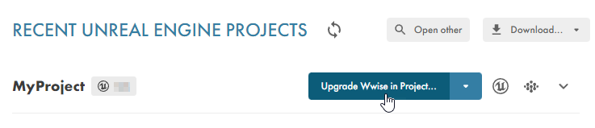

在升级完成后，打开 Wwise 工程。这时，会自动显示 Project Migration 对话框。

点击 **Update** 按钮继续。

在更新并保存 Wwise 工程后，便可打开 Unreal 工程。在打开时，会自动显示 Wwise Integration Migration 对话框。在此对话框中，可选择所要执行的迁移操作。建议马上执行所有迁移操作。不过，必要的话可将迁移流程延迟或单独执行每项操作。若要单独执行这些操作，建议先阅读 [部分迁移及工程迁移状态](pg_important_migration_notes_2022_1_0.html#partial_migration) 章节，再尝试迁移工程。在选择多项迁移操作时，会按照与 Migration Window 中所示相同的顺序予以执行。只要还有尚未执行的迁移操作，就可在 **Audiokinetic Migration > Finish Project Migration** 下的 Build Menu 中打开迁移对话框。

迁移当中有四项不同的操作：

- [SoundBank Migration](pg_important_migration_notes_2022_1_0.html#soundbankmigration)
- [Delete deprecated assets](pg_important_migration_notes_2022_1_0.html#cleanupdeprecatedassets)
- [Migrate Wwise Assets](pg_important_migration_notes_2022_1_0.html#assetsoutofdate)
- [Update Project Settings](pg_important_migration_notes_2022_1_0.html#modificationstoproject)

## SoundBank Migration

SoundBank 管理现在重新交由 Wwise 设计工具完成，因此已经不再需要并且必须删除 AkAudioBank 素材。在之前的工作流程中，SoundBank 在 Unreal 工程中表示为手动创建的 AkAudioBank 素材。随后，便可手动将 Event 和 Aux Bus 素材分组存放到这些 SoundBank 中。这在原有 Legacy 工作流程中是必要的，但 Event Based Packaging 并不需要。

对话框中可能会显示以下分区（取决于 Unreal 工程是否包含 AkAudioBank 素材）。在 Wwise 2022.1 中，此迁移操作可帮助您将现有 SoundBank 从 Unreal 工程传回到 Wwise 工程，并清理已被弃用的 AkAudioBank 素材。

| 选项 | 描述 |
| --- | --- |
| **Transfer SoundBanks to Wwise** | 若选中，须选择传输方法。详见下文 [传输方法](pg_important_migration_notes_2022_1_0.html#transfermethods) 章节。 |
| **Transfer Auto Load property** | Unreal 中的 AkAudioBank 素材设有一项属性，其允许用户指定是要自动还是手动加载 SoundBank 数据及素材（比如在 Blueprint 中使用素材时马上自动加载）。若选中，将把此属性的值传到分组存放到 SoundBank 中的素材。 |

|**Delete AkAudioBank Assets**|将删除工程中的所有 AkAudioBank 素材。若同时选中 Transfer SoundBanks，将在传输完毕后完成此操作。建议删除这些素材，因为其已经没用了。|在将其删除后，无法再执行 Transfer SoundBanks to Wwise 操作。|

### 传输方法

用户可通过创建 SoundBank Definition File 或使用 WAAPI 来将 SoundBank 传到 Wwise。

**Create SoundBank Definition File** 会创建包含一系列 SoundBank 名称及内容的文本文件。此文件随后可导入到 Wwise 中。若选择此选项，会显示相应字段。在此字段中，可选择要将生成的文件放在哪里。有关如何将该文件导入到 Wwise 工程中的具体信息，请参阅[官方文档](https://www.audiokinetic.com/library/edge/?source=Help&id=populating_soundbank_by_importing_definition_file)。

**WAAPI** 会利用 Unreal Editor 和 Wwise 之间建立的 WAAPI 连接来更新 Wwise 工程以将 SoundBank 包含在内。在传输 SoundBank 之后，请务必保存 Wwise 工程。

若要使用所述功能，须打开 Wwise 设计工具。若无法建立 WAAPI 连接，可选择在 Wwise User Settings 中禁用 Auto Connect to WAAPI 工程设置。

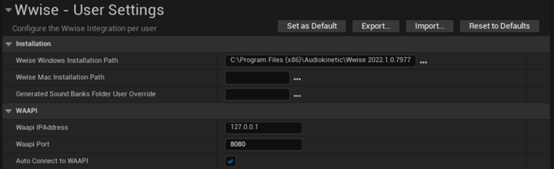

### 失败的 SoundBank 传输

若没能通过 WAAPI 将所有 SoundBank 成功传输到 Wwise，或过程当中无法写入到 SoundBank 定义文件，则会显示对话框并列出相应错误。在该对话框中，您可以取消迁移，也可忽略错误并继续。其中有些可能是预期之内并可接受的错误。比如，若已从 Wwise 工程中移除的 Event 仍作为素材存在于 Unreal 工程中，则涉及这些 Event 的 WAAPI 调用将会失败。

## Delete deprecated assets

之前的 Integration 版本中所用的有些 Wwise 素材类型已被弃用，因此需要从工程中移除。 通过选中 **Delete Deprecated Assets** 选项，可删除所有 AkMediaAsset、AkFolder 和 AkPlatformAssetData 类型的素材。

## Migrate Wwise Assets

Wwise 素材属性已发生更改，其不会再将 SoundBank 或媒体二进制数据序列化。现在只有加载或构建素材时所用的 GUID、ShortID、Name 和类型特定元数据属性才会序列化到 Wwise 素材中。在构建过程中，会将资源加载所需的信息序列化到游戏中打包的素材。

在选中 **Migrate Wwise assets** 时，会将工程中的所有 Wwise 素材标记为未同步状态并加以保存。若之前使用 EBP 并启用了 Split Switch Container Media，将在保存前把所有 Event 的 EventInfo.SwitchContainerLoading 标记设为 LoadOnReference。

|  |  |
| --- | --- |
|  | **注記：** 若选择将 Migrate Wwise Assets 作为唯一的迁移操作，之后将无法执行 Transfer SoundBanks to Wwise 操作，因为这样会从相关素材中清除执行该操作所需的信息。 |

## Update Project Settings

在选中 **Update Project Settings** 时，会根据是使用 Event-Based Packaging 还是原有工作流程来更新工程设置。在执行更改后，请务必保存工程。

**Event-Based Packaging 工作流程**：

- 在 Wwise 中：
  - 将启用 **Enable Auto Defined Soundbanks**。
  - 若启用了 **Split Media Per Folder**，将启用 **Create Sub-Folders for Generated Files**。
- 在 Unreal 中：
  - 将从 **Directories To Always Cook** 移除 **Wwise Sound Data Folder**。

**原有工作流程**： 不会在 Wwise 工程中更改任何设置。

- 在 Unreal 中：
  - 将从 **Directories To Always Stage As UFS** 移除 **Wwise Sound Data Folder**。
  - 将删除 **Wwise Sound Data Folder** 中生成的 .bnk 和 .wem 文件。

在两种情况下：

- 都会将 **GeneratedSoundBanks folder location** 字段中设置的路径应用于 Unreal 工程的 Wwise Settings 中的 **Generated Sound Banks Folder** 设置。该字段默认设为 Unreal 工程中设置的当前 **GeneratedSoundBanks Folder** 路径。建议使用标准的 `<Wwise Project\/GeneratedSoundBanks` 路径，除非工程有特定的要求。

|  |  |
| --- | --- |
|  | **警告：** 若在迁移过程中修改 **Generated Sound Banks folder location**，则可能需要手动更新 Wwise 中的设置。请参阅 [需要手动更新的设置](pg_important_migration_notes_2022_1_0.html#migration_manual_settings) 。 |

|  |  |
| --- | --- |
|  | **注記：** 在原有工程中，必须将 **GeneratedSoundBanks Folder** 放在 Unreal 工程的 Content 文件夹内以便进行打包。现在不需要再这样做。为此，建议不要将 GeneratedSoundBanks 文件夹放在 Unreal 工程的 Content 文件夹内。若 **GeneratedSoundBanks Folder** 在 Unreal 的 Content 文件夹内，则在生成 SoundBank 时将提示导入文件。您可以忽略这些提示。不过，建议将 **GeneratedSoundBanks Folder** 放在 Unreal 工程以外以免显示这些导入提示。稍后可在 Wwise 设计工具的 Project Settings 和 Unreal 的 Project Settings 中更改 **GeneratedSoundBanks Folder**。须单独地及时更新两项设置。 |

在完成迁移对话框中的所有操作后，工程也就准备好了。倘若使用外部源（External Source），还需执行附加迁移步骤。

## 工程迁移 Commandlet

集成包同时提供一个 Commandlet（参见 [使用工程迁移 Commandlet](using_features_migratecommandlet.html) 章节）以便通过命令行来执行上节中所述的迁移操作。

## 需要手动更新的设置

**Wwise Installation Path** (Unreal 中) 若在机器上安装了 Wwise 并想在不使用 WAAPI 的情况下在 Unreal 内生成 SoundBank，则须在 Wwise User Settings 中设定 Wwise Mac/Windows Installation Path 设置。

SoundBanks **Root Output Path** (Wwise 中) 建议确认 Wwise 设计工具的 SoundBanks Settings 中的 **Root Output Path** 是否与 Unreal Wwise Settings 的 **Generated Sound Banks Folder** 中设置的路径对应。

|  |  |
| --- | --- |
|  | **注記：** **Root Output Path** 与 Wwise 工程相对，**Generated Sound Banks Folder** 与 Unreal 工程的 **Content** 文件夹相对。 |

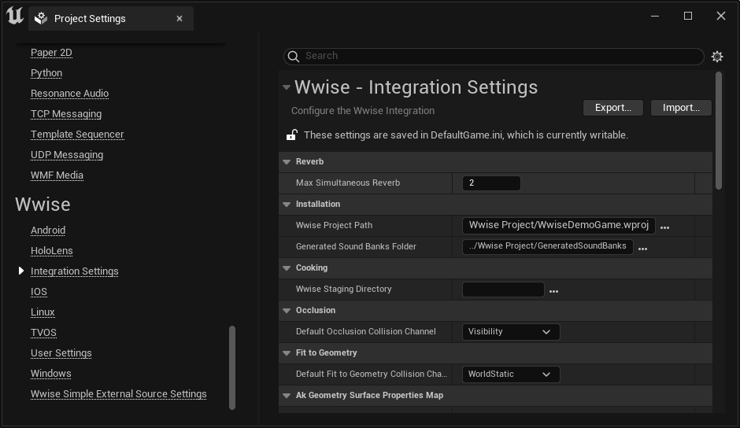

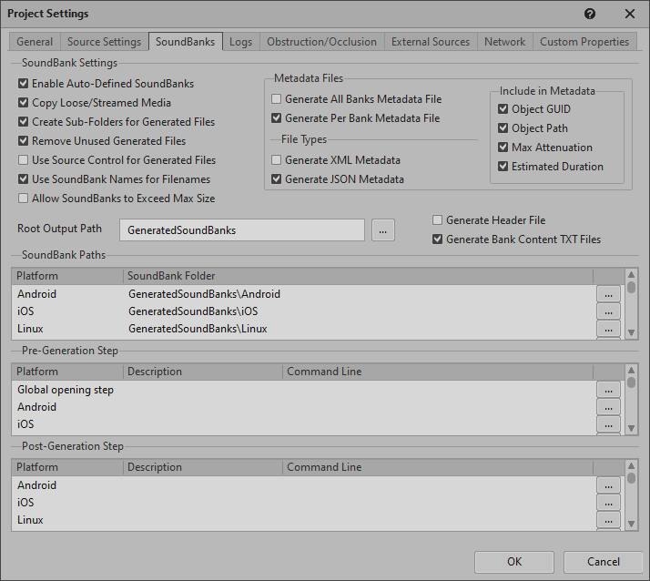

对于迁移的原有工程，确保平台特定 SoundBank Folder 设置不指向 Unreal 工程的 **Content** 文件夹内的位置。

### 迁移外部源（External Source）

2022.1 中对外部源（External Source）支持的实现做了大幅更改。其允许高级用户通过整合自己的系统来设置和追踪外部源（External Source）。另外，我们还会通过 WwiseSimpleExternalSourceManager 提供基本支持。其使用 Unreal Data Table 追踪外部源（External Source）媒体，并提供 API 和 Blueprint 函数，来为媒体指派外部源 ID。

此模块不再使用 FAkExternalSourceInfo 和 FAkSDKExternalSourceArray 结构。对于 Blueprint 中所要创建的每个 FAkExternalSourceInfo 实例，最好都替换为 "WwiseSimpleExternalSourceManager::SetExternalSourceMedia" Blueprint 节点。

在此之后，可移除 Blueprint 中对它们的所有引用。另外，可能还要重新编译包含与 FAkSDKExternalSourceArrays 关联的 PostEvent 节点的 Blueprint。

有关如何在 Wwise 2022.1 中使用 External Source 的更多详细信息，请参阅 [使用 Wwise Simple External Source Manager](using_features_simpleexternalsourcemanager.html) 章节。

## 部分迁移及工程迁移状态

我们建议一并执行所有迁移操作。不过，若要每次执行一项操作，或手动执行特定的操作，请注意以下事项：

- 在迁移素材时，会清除 Event 和 Auxiliary Bus 素材中的 SoundBank 分组信息。这会导致后续无法正常地将 SoundBank 从 Unreal 传输到 Wwise。另外，还会无法将 AutoLoad 设置从 AkAudioBank 素材传输到其中分组存放的 Event 或 Aux Bus。
- 在删除被弃用的素材和删除 AkAudioBank 素材时，若其包含对被删除素材的引用，可能需要签出额外的（非 Wwise）素材。

工程迁移状态主要使用 DefaultGame.ini 文件中的以下字段来追踪：

- `bSoundBanksTransfered`：追踪是否执行了 SoundBank Transfer 操作。
- `bAssetsMigrated`：追踪是否执行了 Asset Migration 操作。
- `bProjectMigrated`：追踪是否执行了 Project Migration 操作。

在迁移过程中，会根据是否成功执行了对应迁移操作来更新这些设置。

另外，还会基于 Unreal 工程的内容来决定工程迁移状态。若工程不包含 AkAudioBank 素材，则不需要迁移 SoundBank，并会自动更新设置。同样，只有在工程中找到被弃用的素材，才会显示用于删除素材的选项。

## 完成迁移

在迁移完成后，须重新生成 Wwise SoundBank。用户可通过 Unreal 中的 Wwise Picker 或 Build 菜单或者直接在 Wwise 中执行这一操作（SoundBank 管理已重新交由 Wwise 完成）。

在成功生成 SoundBank 后，便可在 Wwise Picker 中查看 Wwise 工程结构，并在 Play In Editor 模式下试听声音。

|  |  |
| --- | --- |
|  | **注記：** 在迁移后可能会显示以下消息：  `Unable to load <Asset>_FOLDER with outer Package <Package> because its class does not exist.`.  2022.1 中已不再使用这些素材。您可以手动或 [在迁移过程中](pg_important_migration_notes_2022_1_0.html#cleanupdeprecatedassets) 删除工程中遗留的所述素材。不然的话，也可忽略这一消息。 |

# Spatial Audio

## Portal

- 更新了 [AkPortalComponent](pg_features_spatialaudio.html#features_objects_akportalcomponent) 功能，以免对 OpenPortal 和 ClosePortal 的调用发生堆叠。这样的话，只要调用 OpenPortal 就会立即打开 Portal，只要调用 ClosePortal 就会立即关闭 Portal。之前，多次调用 OpenPortal 后需执行同样次数的 ClosePortal 调用方可关闭 Portal。如有基于此功能的代码，请对之进行更新。

## AkGeometry 组件

- 将 [AkGeometryComponent](pg_features_spatialaudio.html#features_objects_akgeometrycomponent) 的默认 Mesh Type 改为了 Simple Collision，以便于在 Map 中添加此类组件。在更新到 22.1 后，若将 [AkGeometryComponent](pg_features_spatialaudio.html#features_objects_akgeometrycomponent) 设为了 Static Mesh，则须再次加以设置，因为后续要将其改为 Simple Collision。

# 将 PreDelay 的单位由秒改为了毫秒

- 在 Unreal Integration 中，之前是以秒为单位来估算 PreDelay 混响参数的。该值现在以毫秒为单位计算。用户须更新接收 PreDelay 值的 RTPC，确保将 RTPC 设为以毫秒为单位。比如，若之前映射到 PreDelay 的 RTPC 值域为 0.0 ~ 1.0（秒），须将该值域改为 0.0 ~ 1000.0（毫秒）。

# CollisionChannel 属性

- 更改了 [AkSpatialAudioVolume](pg_features_spatialaudio.html#features_objects_akspatialaudiovolume) 和 [AkAcousticPortal](pg_features_spatialaudio.html#features_objects_akacousticportal) 中的 CollisionChannel 属性以及 [AkComponent](pg_features_objects_components.html#features_akcomponent) 中的 OcclusionCollisionChannel 属性的基础类型。这样做是为了更加明确地呈现在更改工程默认碰撞声道时现有对象会发生什么。若有直接通过 Blueprint 或 C++ 操纵这些属性的代码，则需更新类型并重新编译。

# 将 Event 分组存放到 SoundBank

之前，可通过右键单击素材并选择 **Group into Sound Bank** 来将 Event 分组存放到 SoundBank 中。现在，没法再这样做了；不过，可使用 Wwise 设计工具中的 User-Defined SoundBank 来获得相同的结果。###### 传输方法

###### 失败的 SoundBank 传输

###### 迁移外部源（External Source）

###### SoundBank Migration

###### Delete deprecated assets

###### Migrate Wwise Assets

###### Update Project Settings

###### 工程迁移 Commandlet

###### 需要手动更新的设置

###### 部分迁移及工程迁移状态

###### 完成迁移

###### Portal

###### AkGeometry 组件

##### 关于 Wwise 2022.1 Unreal Integration

##### 迁移至 Wwise 2022.1

##### Spatial Audio

##### 将 PreDelay 的单位由秒改为了毫秒

##### CollisionChannel 属性

##### 将 Event 分组存放到 SoundBank

#### 新增功能

#### 其他改进

#### 漏洞修复

#### 社区报告的漏洞修复

#### 新增功能

#### 社区报告的漏洞修复

#### 文档改进

#### 新增功能

#### 行为改进

#### 其他改进

#### 漏洞修复

#### 社区报告的漏洞修复

### 版本说明 2021.1.14.8108.2656

|  |
| --- |
| Wwise Unreal Integration Documentation |

版本说明 2021.1.14.8108.2656

此 Integration 的各个版本分别与特定的 Unreal Engine 版本对应。以下是 Integration 2021.1.14.8108.2656 版本中所作的更改（除升级到新的 Unreal 版本外）。

|  |  |
| --- | --- |
|  | **注記：** 此 Integration 版本不支持实验性的 Unreal Engine 功能。 |

|  |  |
| --- | --- |
|  | **注記：** 此 Integration 针对 Unreal Engine 4.26、4.27、5.1、5.2 和 5.3 编译，并且针对 Unreal Engine 4.27.2 和 5.3.1 进行了测试。暂不支持比上述更高的 Unreal Engine 大版本，但后续补丁版本中会提供相应支持。 |

有关早期版本的信息，请参阅 [过往版本的发行说明](previousreleases.html) 章节。

- [新增功能](releasenotes_2021_1_14_2656.html#generic_feature_changes_2021_1_14)
- [其他改进](releasenotes_2021_1_14_2656.html#generic_misc_2021_1_14)
- [漏洞修复](releasenotes_2021_1_14_2656.html#generic_bugs_2021_1_14)
- [社区报告的漏洞修复](releasenotes_2021_1_14_2656.html#generic_community_bugs_2021_1_14)

# 新增功能

- **WG-66138** 添加了对 Unreal Engine 5.2 的支持。
- **WG-67089** 添加了对 Unreal 5.3 的支持。

# 其他改进

- **WG-66542** Wwise Unreal 集成 需要 Audiokinetic Launcher 2023.1.1 或更高版本。
- **WG-66817** 现在默认的 Visual Studio 版本为 2022。

# 漏洞修复

- **WG-63820** 已修复：在关卡流播放期间调用打开/关闭的 Portal 时，UpdateConnectedRooms 当中 Unreal 发生崩溃。
- **WG-66661** 已修复：(Spatial Audio) Box Collision 上放置的 Late Reverb 组件具有错误的音量。
- **WG-67418** 已修复：在将某一关卡添加到另一关卡后执行“撤消”操作时，Unreal 发生崩溃。
- **WG-68221** 已修复：在更改电平时加载 Switch Container 会引发崩溃。

# 社区报告的漏洞修复

- **WG-58615** 已修复：在使用 Event-Based Packaging 时发现无效的弱指针，进而导致发生崩溃。
- **WG-64770** 已修复：UAkMediaAsset 中出现 BulkDataIORequest 泄漏。
- **WG-66952** 已修复：在尝试确定 Switch Container 的长度时，缺少 "Mixed" DurationType，进而导致死机。

### 版本说明 2021.1.13.8036.2580

|  |
| --- |
| Wwise Unreal Integration Documentation |

版本说明 2021.1.13.8036.2580

此 Integration 的各个版本分别与特定的 Unreal Engine 版本对应。以下是 Integration 2021.1.13.8036.2580 版本中所作的更改（除升级到新的 Unreal 版本外）。

|  |  |
| --- | --- |
|  | **注記：** 此 Integration 版本不支持实验性的 Unreal Engine 功能。 |

|  |  |
| --- | --- |
|  | **注記：** 此 Integration 针对 Unreal Engine 4.26、4.27、5.0 和 5.1 编译，并且针对 Unreal Engine 4.27.2 和 5.1.1 进行了测试。暂不支持比上述更高的 Unreal Engine 大版本，但后续补丁版本中会提供相应支持。 |

有关早期版本的信息，请参阅 [过往版本的发行说明](previousreleases.html) 章节。

- [新增功能](releasenotes_2021_1_13_2580.html#generic_feature_changes_2021_1_13)
- [社区报告的漏洞修复](releasenotes_2021_1_13_2580.html#generic_community_bugs_2021_1_13)
- [文档改进](releasenotes_2021_1_13_2580.html#generic_documentation_improvements_2021_1_13)

# 新增功能

- **WG-63815** 添加了对 UE5.2 早期分支的编译支持。

# 社区报告的漏洞修复

- **WG-55294** 已修复：在空白地图中启动 Play in Editor 会话时发生崩溃。
- **WG-56795** 已修复：(Spatial Audio) 在 Brush Editing 模式下修改通过 `AkSurfaceReflectorSets` 构建的 Room 后，Room 边界变得不精确。
- **WG-64787** 已修复：(Spatial Audio) Spatial Audio Unreal Detail Customization 类发生崩溃。

# 文档改进

- **WG-65256** 添加了有关如何找到 Wwise Unreal Demo Game 的详细信息。参见 [使用 Wwise Demo Game](using_samplegame.html) 章节。

### 版本说明 2021.1.12.7973.2505

|  |
| --- |
| Wwise Unreal Integration Documentation |

版本说明 2021.1.12.7973.2505

此 Integration 的各个版本分别与特定的 Unreal Engine 版本对应。以下是 Integration 2021.1.12.7973.2505 版本中所作的更改（除升级到新的 Unreal 版本外）。

|  |  |
| --- | --- |
|  | **注記：** 此 Integration 版本不支持实验性的 Unreal Engine 功能。 |

|  |  |
| --- | --- |
|  | **注記：** 此 Integration 针对 Unreal Engine 4.26、4.27、5.0 和 5.1 编译，并且针对 Unreal Engine 4.27.2 和 5.1.1 进行了测试。暂不支持比上述更高的 Unreal Engine 大版本，但后续补丁版本中会提供相应支持。 |

有关早期版本的信息，请参阅 [过往版本的发行说明](previousreleases.html) 章节。

- [新增功能](releasenotes_2021_1_12_2505.html#generic_feature_changes_2021_1_12)
- [行为改进](releasenotes_2021_1_12_2505.html#generic_behavior_changes_2021_1_12)
- [其他改进](releasenotes_2021_1_12_2505.html#generic_misc_2021_1_12)
- [漏洞修复](releasenotes_2021_1_12_2505.html#generic_bugs_2021_1_12)
- [社区报告的漏洞修复](releasenotes_2021_1_12_2505.html#generic_community_bugs_2021_1_12)

# 新增功能

- **WG-62790** 添加了对 Unreal Engine 5.1 的正式支持。
- **WG-63770** 基于 Wwise SDK 提供的新功能向 Advanced Initialization Settings 添加了 uMaxSystemAudioObjects。

# 行为改进

- **WG-63047** 已修复：在与 Unreal Engine 5.1 结合使用时，Integration 中发出弃用警告。

# 其他改进

- **WG-63832** 现在无需安装 macOS 特定 Wwise SDK 便可在 Windows 上将 Wwise 集成到 Unreal 工程中。

# 漏洞修复

- **WG-63448** 已修复：外部源媒体可能会进入到无法卸载的状态。
- **WG-63731** 已修复：若在加载本地化媒体时卸载关卡，异步 PostEvent 函数会发生崩溃。
- **WG-63884** 已修复：在卸载 World 后，在 "PostEventAsync" Blueprint 上将 StopWhenAttachedToDestroyed 设为 true 并不会停止 Event。

# 社区报告的漏洞修复

- **WG-60362** 已修复：由于依赖不可靠的 UObject 引用，导致 FAkUnrealIOHook 中的有些操作使得线程不安全。
- **WG-60972** 已修复：(Spatial Audio) 在 Portal 之间移动时出现声像摆位问题。
- **WG-62961** 已修复：有些设备的扬声器输出的来自 Wwise 的声音比其他设备低。为此添加了新的平台选项，以便在这些设备上禁用低延迟音频播放。
- **WG-63417** 已修复：在以流方式传输 Spatial Audio Geometry 和 Portal 时出现性能问题。
- **WG-63483** 已修复：SpawnAkComponentAtLocation 上的 AutoDestroy 选项无法销毁组件。

### 版本说明 2021.1.11.7933.2437

##### Spatial Audio AkGeometry 组件

#### 新增功能

#### 其他改进

#### 漏洞修复

#### 社区报告的漏洞修复

#### 重要迁移说明 2021.1.11.7933.2437

|  |
| --- |
| Wwise Unreal Integration Documentation |

重要迁移说明 2021.1.11.7933.2437

# Spatial Audio AkGeometry 组件

将 [AkGeometryComponent](pg_features_spatialaudio.html#features_objects_akgeometrycomponent) 的默认 Mesh Type 改为了 Simple Collision，以便于在 Map 中添加此类组件。在更新到 21.1.11 后，若将 [AkGeometryComponent](pg_features_spatialaudio.html#features_objects_akgeometrycomponent) 设为了 Static Mesh，则须再次加以设置，因为后续要将其改为 Simple Collision。

#### 性能改进

#### 其他改进

#### 漏洞修复

#### 社区报告的漏洞修复

|  |
| --- |
| Wwise Unreal Integration Documentation |

版本说明 2021.1.11.7933.2437

此 Integration 的各个版本分别与特定的 Unreal Engine 版本对应。以下是 Integration 2021.1.11.7933.2437 版本中所作的更改（除升级到新的 Unreal 版本外）。 [重要迁移说明 2021.1.11.7933.2437](pg_important_migration_notes_2021_1_11.html)

|  |  |
| --- | --- |
|  | **注記：** 此 Integration 版本不支持实验性的 Unreal Engine 功能。 |

|  |  |
| --- | --- |
|  | **注記：** 此 Integration 针对 Unreal Engine 4.26、4.27 和 5.0 编译，并且针对 Unreal Engine 4.27.2 和 5.0.2 进行了测试。暂不支持比上述更高的 Unreal Engine 大版本，但后续补丁版本中会提供相应支持。 |

有关早期版本的信息，请参阅 [过往版本的发行说明](previousreleases.html) 章节。

- [新增功能](releasenotes_2021_1_11_2437.html#generic_feature_changes_2021_1_11)
- [其他改进](releasenotes_2021_1_11_2437.html#generic_misc_2021_1_11)
- [漏洞修复](releasenotes_2021_1_11_2437.html#generic_bugs_2021_1_11)
- [社区报告的漏洞修复](releasenotes_2021_1_11_2437.html#generic_community_bugs_2021_1_11)

# 新增功能

- **WG-62395** 添加了对 Unreal Engine 5.1 的初步支持。

# 其他改进

- **WG-60370**: Added support for Visual Studio 2022
- **WG-61144** 降低了关于 Portal 的 Front Room 与 Back Room 相同的 AkAcousticPortal 消息的严重性。现在将其归为日志而非警告。
- **WG-61500** 现在 Havok 和其他物理引擎可使用 Wwise Unreal 集成。

# 漏洞修复

- **WG-61803** 已修复：AkAudioDevice::TryUnsetMedia 发生崩溃。

# 社区报告的漏洞修复

- **WG-53480** 已修复：Unreal 打包当中包含来自所构建平台以外的平台的 SoundBank。
- **WG-59395** 已修复："PostEventAsync" Blueprint 将引脚连到了垃圾收集器中的 Event 并为其赋予了附加时间，因而导致内存泄漏。
- **WG-59779** 已修复：在退出游戏时执行 `AkAudioDevice::CleanPinnedObjects` 操作可能会引发崩溃。
- **WG-60234** 已修复：未通过 Unreal IO 挂钩注册无预取数据块的流播放声音，进而导致发生 "Failed creating source" 错误。
- **WG-60969** 已修复：(Spatial Audio) 在听者位置与 Portal 重叠时，使用衍射的发声体可能会变得不可闻。
- **WG-60974** 已修复：在移动表面时重置了 AkSpatialAudioVolume 的对应表面特定声学信息。
- **WG-61026** 已修复：在 Wwise 中替换音频源内的数据并重新生成 Sound Data 后没有在 Unreal Editor 中更新内存中的媒体。
- **WG-61050** 已修复：在 Switch Container 中的两个不同 Switch 值之间共享媒体时发生 "Media not loaded" 错误。
- **WG-61202** 已修复：在停止 Play in Editor 会话时会停止 AkAudioMixer。
- **WG-61226** 已修复：在暂停 Play in Editor 会话时不会暂停声音。
- **WG-61291** 已修复：在 Editor 启动时更新了 DefaultGame.ini。
- **WG-61296** 已修复：仅可为活跃 Unreal Editor 支持的平台生成 SoundBank。
- **WG-61297** 已修复：在使用 Blueprint Clustering 时发出了错误的警告。
- **WG-61323** 已修复：在与 RTPC 结合使用时，HF Damping 始终显示 0。
- **WG-61597** 已修复：若垃圾收集器在错误的时间进行检视，流播放媒体可能会停止播放。现在向 AkUnrealIOHook 添加了更为详细的日志。
- **WG-61790** 已修复：在计算 Static Mesh 的情况下向较为复杂的 Mesh 添加 AkGeometry 会导致 Unreal 卡顿。
- **WG-61850** 已修复：(Spatial Audio) 在听者位置与 Portal 重叠时，使用衍射的发声体可能会变得不可闻。
- **WG-61910** 已修复：由于没有找到 Wwise 工程文件而记录了错误，可能会因而导致构建失败。
- **WG-62182** 已修复：在切换地图时，AkOcclusionObstructionService 可能会发生崩溃。
- **WG-62514** 已修复：在执行素材同步时，无法移动代表以数字字符为开头的 Folder 和 Work Unit 的 Unreal 素材。
- **WG-62722** 已修复：在运行 Commandlet 时打开了 Wwise Settings 对话框。

### 版本说明 2021.1.10.7883.2350

|  |
| --- |
| Wwise Unreal Integration Documentation |

版本说明 2021.1.10.7883.2350

此 Integration 的各个版本分别与特定的 Unreal Engine 版本对应。以下是 Integration 2021.1.10.7883.2350 版本中所作的更改（此外还升级到了新的 Unreal 版本）。

|  |  |
| --- | --- |
|  | **注記：** 此 Integration 版本不支持实验性的 Unreal Engine 功能。 |

|  |  |
| --- | --- |
|  | **注記：** 此 Integration 针对 Unreal Engine 4.26、4.27 和 5.0 编译，并且针对 Unreal Engine 4.27.2 和 5.0.2 进行了测试。暂不支持比上述更高的 Unreal Engine 大版本，但后续补丁版本中会提供相应支持。 |

有关早期版本的信息，请参阅 [过往版本的发行说明](previousreleases.html) 章节。

- [性能改进](releasenotes_2021_1_10_2350.html#generic_perf_changes_2021_1_10)
- [其他改进](releasenotes_2021_1_10_2350.html#generic_misc_2021_1_10)
- [漏洞修复](releasenotes_2021_1_10_2350.html#generic_bugs_2021_1_10)
- [社区报告的漏洞修复](releasenotes_2021_1_10_2350.html#generic_community_bugs_2021_1_10)

# 性能改进

- **WG-57180** 通过优化 AkComponent.h 代码提升了 Unreal Integration API 的性能。

# 其他改进

- **WG-59977** 优化了将 Static Mesh 组件的 Simple Collision Mesh 转换为 Spatial Audio Geometry 的代码。

# 漏洞修复

- **WG-60030** 已修复：在 UE5 中，在 Editor 内实施性能分析时，新建的 Ak Actor 具有通用的名称。
- **WG-60291** 已修复：在 Brush Editing 模式下连接 Spatial Audio Volume 的顶点时，Unreal 发生崩溃。
- **WG-60292** 已修复：Spatial Audio Tutorial Map 的所有 SAV 都将 Acoustic Texture 设为了 None。
- **WG-60331** 已修复：在将 Ak Late Reverb 组件添加到 Static Mesh 组件后执行垃圾收集时，Unreal 发生崩溃。
- **WG-60348** 已修复：`SetGameObjectRadius` API 调用没有返回其 Game Object ID。
- **WG-60351** 已修复：在 Unreal 游戏处于非活动状态时，每一帧都调用 `SetPosition` 和 `SetGameObjectInRoom`。
- **WG-60626** 已修复：在关闭 Unreal Editor 时，日志中显示不必要的 "Could not unload media" 错误。
- **WG-60744** 已修复：在切换关卡和关闭游戏时可能会发生崩溃。

# 社区报告的漏洞修复

- **WG-55309** 已修复：若在 Unreal Editor 处于关闭状态时创建了 Wwise 素材并在之后打开 Unreal Editor，Unreal 会创建素材但不会将其自动添加到版本控制系统。
- **WG-56694** 已修复：在升级 Wwise 后首次打开工程时发生崩溃。
- **WG-57295** 已修复：在通过 WAAPI 生成 SoundBank 时，Unreal Editor 发生崩溃。
- **WG-57514** 已修复：在运行 AddressSanitizer 时没有正确转换字符串。
- **WG-58812** 已修复：在从场景中注销某个 Portal 时会更新所有 Spatial Audio Room。
- **WG-60364** 已修复：在销毁没有完成加载的媒体素材时可能会中断游戏或渲染进程。
- **WG-60527** 已修复：在无法分配媒体内存时发生崩溃。
- **WG-60592** 已修复：在所用 Modulator 使用与内置属性（Built-in game parameter）绑定的 RTPC 时发生崩溃。
- **WG-60619** 已修复：在 UE 4.27 中启用 Chaos Physics 的情况下出现编译问题。
- **WG-60820** 已修复：在无法找到 Wwise Project Info 时，清除了 Wwise 设置中由 Unreal Culture 到 Wwise Culture 的映射。
- **WG-60864** 已修复：在暂停 Sequencer 时不会暂停声音。
- **WG-61029** 已修复：在专用服务器模式下运行 Editor 时显示多余的 "Skipping media load" 日志消息。

### 版本说明 2021.1.9.7847.2311

#### 其他改进

#### 漏洞修复

#### 社区报告的漏洞修复

##### 本地化

#### 新增功能

#### 行为改进

#### 其他改进

#### 漏洞修复

#### 社区报告的漏洞修复

#### 重要迁移说明 2021.1.8.7831.2285

|  |
| --- |
| Wwise Unreal Integration Documentation |

重要迁移说明 2021.1.8.7831.2285

# 本地化

鉴于对媒体和平台数据加载所作的修复，在迁移到 21.1.8 后必须重新生成 Sound Data。这一过程会更新大部分 Wwise Unreal 素材。在生成 Sound Data 后，若仍看到 "Media data [...] is not up to date. Please regenerate sound data." 之类的消息，请清除 Wwise Unreal 素材中的数据，然后再生成 Sound Data。

#### 行为改进

#### 社区报告的漏洞修复

|  |
| --- |
| Wwise Unreal Integration Documentation |

版本说明 2021.1.9.7847.2311

此 Integration 的各个版本分别与特定的 Unreal Engine 版本对应。以下是 Integration 2021.1.9.7847.2311 版本中所作的更改（除升级到新的 Unreal 版本外）。

|  |  |
| --- | --- |
|  | **注記：** 此 Integration 版本不支持实验性的 Unreal Engine 功能。 |

|  |  |
| --- | --- |
|  | **注記：** 此 Integration 针对 Unreal Engine 4.26、4.27 和 5.0 编译，并且针对 Unreal Engine 4.27.2 和 5.0.1 进行了测试。暂不支持比上述更高的 Unreal Engine 大版本，但后续补丁版本中会提供相应支持。 |

有关早期版本的信息，请参阅 [过往版本的发行说明](previousreleases.html) 章节。

- [其他改进](releasenotes_2021_1_9_2311.html#generic_misc_2021_1_9)
- [漏洞修复](releasenotes_2021_1_9_2311.html#generic_bugs_2021_1_9)
- [社区报告的漏洞修复](releasenotes_2021_1_9_2311.html#generic_community_bugs_2021_1_9)

# 其他改进

- **WG-60187** 移除了错误添加到 Geometric Tools Engine 库代码文件中的版权声明。

# 漏洞修复

- **WG-55708** 已修复：Wwise Unreal Engine Integration 插件名称和描述提及 Unreal Engine 4。
- **WG-58756** 已修复："Set Inner/Outer Radius" 和 "SetGameObjectRadius" Blueprint 函数出现混淆。
- **WG-58918** 已修复：UE5 中 Spatial Audio Volume 的 Volume 值有误。
- **WG-59253** 已修复：在更改 Static Mesh 组件的 Material 且其 Ak Geometry 组件被设为 Static Mesh 类型时发生崩溃。
- **WG-59951** 已修复：非箱形 Spatial Audio Volume 的表面面积有误。
- **WG-59965** 已修复：在 Spectator 模式下旋转 AkAcousticPortal 时无法进行更新。
- **WG-60023** 已修复：Fit to Geometry 的 Automatic Texture Assignment 损坏。
- **WG-60059** 已修复：在针对不包含目标语言的素材数据的 AkAudioBank 素材切换语言时发生崩溃。将 AkAudiobank "Could not find localized data" 日志由错误降级为了警告。
- **WG-60069** 已修复：对于 Ak Geometry 组件，将 Acoustic Texture 报告为了 Unknown 而非 None。
- **WG-60074** 已修复：XB1 平台上没有找到插件。
- **WG-60086** 已修复：在 Blueprint 中的 Collision 组件上，可将 Ak Geometry 组件设为 Static Mesh 类型。
- **WG-60394** 已修复：在关闭 Unity build 时构建失败。
- **WG-59600** 已修复：在非编辑器构建中，FAkAudioModule 加载图标并尝试初始化 WAAPI。

# 社区报告的漏洞修复

- **WG-58518** 已修复：在运行 "GenerateSoundBanks" Commandlet 时没有创建最近使用的媒体素材。使用新的 `forceAssetSync` Switch 强制创建新的素材。

### 版本说明 2021.1.8.7831.2285

|  |
| --- |
| Wwise Unreal Integration Documentation |

版本说明 2021.1.8.7831.2285

此 Integration 的各个版本分别与特定的 Unreal Engine 4 版本对应。以下是 Integration 2021.1.8.7831.2285 版本中所作的更改（此外还升级到了新的 Unreal 版本）。 [重要迁移说明 2021.1.8.7831.2285](pg_important_migration_notes_2021_1_8.html)

|  |  |
| --- | --- |
|  | **注記：** 此 Integration 版本不支持实验性的 Unreal Engine 4 功能。 |

|  |  |
| --- | --- |
|  | **注記：** 此 Integration 针对 Unreal Engine 4.26、4.27 和 5.0 编译，并且针对 Unreal Engine 4.27.2 和 5.0.1 进行了测试。暂不支持比上述更高的 Unreal Engine 大版本，但后续补丁版本中会提供相应支持。 |

有关早期版本的信息，请参阅 [过往版本的发行说明](previousreleases.html) 章节。

- [新增功能](releasenotes_2021_1_8_2285.html#generic_feature_changes_2021_1_8)
- [行为改进](releasenotes_2021_1_8_2285.html#generic_behavior_changes_2021_1_8)
- [其他改进](releasenotes_2021_1_8_2285.html#generic_misc_2021_1_8)
- [漏洞修复](releasenotes_2021_1_8_2285.html#generic_bugs_2021_1_8)
- [社区报告的漏洞修复](releasenotes_2021_1_8_2285.html#generic_community_bugs_2021_1_8)

# 新增功能

- **WG-54828** 现在可在 Unreal Content Browser 中使用新的选项来清除各个 Wwise 素材的 Sound Data。这样方便在将 Sound Voice 改为 Sound SFX（反之亦然）后执行必要的 Sound Data 清除操作。
- **WG-59571** 添加了对 Unreal 5.0.1 的支持。

# 行为改进

- **WG-58889** 现在会在结束 Play in Editor 会话时停止播放所有声音。
- **WG-59966** Integration 不再在加载时自动更正素材中的 ShortID。若在 Output log 中看到 Invalid ShortID 警告，请重新生成 Sound Data 并保存修改的所有素材。

# 其他改进

在本地输出中提前报告 Wwise 初始化错误。

- **WG-56843** 现在默认对 `UPROPERTY` 进行初始化。

# 漏洞修复

- **WG-54251** 已修复："Clear Sound Data" 工具没有移除本地化 Unreal 素材数据。
- **WG-59502** 已修复：同一媒体可能多次调用 SetMedia，导致发生内存泄漏。
- **WG-59589** 已修复：Unreal 中未被任何素材引用的 SoundBank 素材将所有 Event 添加到其 Linked Events 列表（这一问题不会影响 SoundBank 行为，但会对 Editor 的性能造成负面影响）。
- **WG-60163** 已修复：在 Wwise 中重新导入音频源并重新生成 Sound Data 后没有在Unreal Editor 中更新内存中的媒体。
- **WG-60218** 已修复：在未使用 Event-Based Packaging 时发生打包错误。
- **WG-60252** 已修复：在 Sound Voice 上添加 Convolution Reverb 时显示“无法设置自动加载”错误。
- **WG-60254** 已修复：本地化媒体发生 `AkMediaMemoryManager::ReleaseMediaMemory`: Negative RefCount 错误。
- **WG-60263** 已修复：在游戏启动时触发 RecursionNotAllowed 断言。

# 社区报告的漏洞修复

- **WG-50111** 已修复：在将本地化 Event 分组存放到 SoundBank 中时更改语言会导致错误。
- **WG-50220** 已修复：在通过 "Set Current Audio Culture" Blueprint 更改 Audio Culture 时发生崩溃。
- **WG-51577** 已修复：在加载关卡后马上更改本地化可能会引发崩溃。
- **WG-53151** 已修复：对于加载关卡（比如从 Level Sequence 时间线）后立即发送的 Event，本地化媒体数据加载得太晚了。
- **WG-55967** 已修复：在从 Content Browser 预览时无法播放本地化 Event。
- **WG-56459** 已修复：在两个地图之间切换而两者播放引用同一媒体的 Event 时会发生崩溃。
- **WG-56793** 已修复：对 Switch Container 中的本地化语音进行流播放有时会导致其无法播放。
- **WG-56935** 已修复：在地图过渡过程中若在播放 Event 会发生崩溃。
- **WG-57378** 已修复：向 Unreal DirectoryWatcher API 传递了错误的标记。
- **WG-57751** 已修复：无法正常加载启用了 Split Switch Container Media 的 Switch Container 中的本地化媒体。报告在 Sound Data 生成期间媒体被同时解析为流播放和非流播放，导致出现播放问题。
- **WG-58000** 已修复：没有很好地优化 `UAkSettings::OnAssetAdded`。
- **WG-58616** 已修复：缺少本地化媒体，导致无法切换到新的区域设置。
- **WG-58659** 已修复：在使用原有 SoundBank 时地图加载时间较长。
- **WG-59006** 已修复：在转换改变时没有更新 Unreal Spatial Audio Portal。
- **WG-59266** 已修复：没有迁移 AkPoly 和 AkEdgeInfo（在 2021.1.4 中分别重命名为了 AkSurfacePoly 和 AkSurfaceEdgeInfo）。
- **WG-59294** 已修复：在后续加载的两个关卡中发送时无法播放流播放的声音。
- **WG-59295** 已修复：Unreal Integration 的 AkRoomComponent.cpp 中存在未使用的变量。
- **WG-59440** 已修复：在 "GenerateSoundBanks" Commandlet 中指定不存在的平台作为参数时没有在日志中显示警告消息。
- **WG-60111** 已修复：在工程中存在 Wwise Convolution Reverb 效果器的情况下通过 WAAPI 生成 Sound Data 会发生崩溃。
- **WG-60162** 已修复：在 Media Asset Data 检查其是否需要在开始加载父级媒体素材前卸载时死机。
- **WG-60165** 已修复：在 Commandlet 中构建 Sound Data 时死机。
- **WG-60208** 已修复：在将 `UAkAssetDataSwitchContainer` 默认对象序列化时，日志中显示 "Event data not up to date" 警告消息。
- **WG-60233** 已修复：无法在 Linux Server build 上进行构建。

### 版本说明 2021.1.7.7796.2228

|  |
| --- |
| Wwise Unreal Integration Documentation |

版本说明 2021.1.7.7796.2228

此 Integration 的各个版本分别与特定的 Unreal Engine 4 版本对应。以下是 Integration 2021.1.7.7796.2228 版本中所作的更改（除升级到新的 Unreal 版本外）。

|  |  |
| --- | --- |
|  | **注記：** 此 Integration 版本不支持实验性的 Unreal Engine 4 功能。 |

|  |  |
| --- | --- |
|  | **注記：** 此 Integration 针对 Unreal Engine 4.23 及更高版本编译，但只针对 Unreal Engine 4.26 进行了测试。 |

有关早期版本的信息，请参阅 [过往版本的发行说明](previousreleases.html) 章节。

- [行为改进](releasenotes_2021_1_7_2228.html#generic_behavior_changes_2021_1_7)
- [社区报告的漏洞修复](releasenotes_2021_1_7_2228.html#generic_community_bugs_2021_1_7)

# 行为改进

- **WG-57995** 提升了 Sound Data 生成期间的素材加载性能。

# 社区报告的漏洞修复

- **WG-57987** 已修复：在 Legacy（非 EBP）模式下生成 Sound Data 时，不在游戏线程上加载素材会引发崩溃。
- **WG-58133** 已修复：在 AkAudio 模块之前加载 Wwise 素材时发生崩溃。
- **WG-58160** 已修复：在发送来自 AkSurfaceReflectorSetComponent 的几何构造时发生崩溃。
- **WG-58882** 已修复：Unreal 5 中出现 Linux 编译错误。

### 版本说明 2021.1.6.7774.2201

##### Spatial Audio Portal

#### 新增功能

#### 其他改进

#### 漏洞修复

#### 社区报告的漏洞修复

#### 重要迁移说明 2021.1.6.7774.2201

|  |
| --- |
| Wwise Unreal Integration Documentation |

重要迁移说明 2021.1.6.7774.2201

# Spatial Audio Portal

- 更新了 [AkPortalComponent](pg_features_spatialaudio.html#features_objects_akportalcomponent) 功能，以免对 OpenPortal 和 ClosePortal 的调用发生堆叠。这样的话，只要调用 OpenPortal 就会立即打开 Portal，只要调用 ClosePortal 就会立即关闭 Portal。之前，多次调用 OpenPortal 后需执行同样次数的 ClosePortal 调用方可关闭 Portal。如有基于此功能的代码，请对之进行更新。

#### 其他改进

#### 社区报告的漏洞修复

|  |
| --- |
| Wwise Unreal Integration Documentation |

版本说明 2021.1.6.7774.2201

此 Integration 的各个版本分别与特定的 Unreal Engine 4 版本对应。以下是 Integration 2021.1.6.7774.2201 版本中所作的更改（除升级到新的 Unreal 版本外）。 [重要迁移说明 2021.1.6.7774.2201](pg_important_migration_notes_2021_1_6.html)

|  |  |
| --- | --- |
|  | **注記：** 此 Integration 版本不支持实验性的 Unreal Engine 4 功能。 |

|  |  |
| --- | --- |
|  | **注記：** 此 Integration 针对 Unreal Engine 4.23 及更高版本编译，但只针对 Unreal Engine 4.26 进行了测试。 |

有关早期版本的信息，请参阅 [过往版本的发行说明](previousreleases.html) 章节。

- [新增功能](releasenotes_2021_1_6_2201.html#generic_feature_changes_2021_1_6)
- [其他改进](releasenotes_2021_1_6_2201.html#generic_misc_2021_1_6)
- [漏洞修复](releasenotes_2021_1_6_2201.html#generic_bugs_2021_1_6)
- [社区报告的漏洞修复](releasenotes_2021_1_6_2201.html#generic_community_bugs_2021_1_6)

# 新增功能

- **WG-55555** 向 `GenerateSoundBanks` Commandlet 添加了两个新的参数：`autosubmit`（将生成的素材自动提交到版本控制系统）和 `clnum`（指定提交编号）。
- **WG-57694** 增强了对 Unreal Engine Release\_5.0 分支的兼容性。依据 changelist #18425151 对集成包进行了测试。
- **WG-58002** 向 `AkRoomComponent` 添加了 `SetGeometryComponent` 函数。借助该函数，可选择要使用哪个 `AkGeometryComponent` 将 Room 的几何构造发送到 Wwise。

# 其他改进

- **WG-54479** 更新了 AkAcousticPortal 组件，以免对 OpenPortal 和 ClosePortal 的调用发生堆叠。

# 漏洞修复

- **WG-51015** 已修复：没有在 Event 回调中正确复制 Marker Label 和 Music Cue 名称。
- **WG-54245** 已修复：无法在 WAAPI 消息中正确发送非 ASCII 字符。
- **WG-55387** 已修复：在 Unreal Asset Registry 完成素材发现前打开 Level Sequence 时，Sequencer 发生崩溃。
- **WG-57433** 已修复：由于配置字段缺失，导致 Unreal Demo Game 无法在 Unreal 4.27.1 上使用 XDK 为 Xbox One 平台打包。

# 社区报告的漏洞修复

- **WG-53110** 已修复：在退出 Play In Editor (PIE) 模式后，通过 Content Browser 上下文菜单播放的 Event 没有声音。
- **WG-54864** 已修复：没有加载映射到通用路径的嵌套 Music Switch Container 中的媒体。
- **WG-56245** 已修复：在追踪 AkAudioBank 中的 LinkedAkEvent 时将 SoundBank 素材错误地标记为未同步状态。
- **WG-57271** 已修复：在旧模式下，AkBankManager 不允许卸载 SoundBank。
- **WG-57276** 已修复：在 AkAudioMixer 中，`FAkMixerPlatform::GetPlatformSettings()` 函数没有返回 `FPlatformProperties` 中指定的自定义平台设置。
- **WG-57789** 已修复：在使用 Blueprint 回调时发生崩溃并出现内存泄漏。
- **WG-57791** 已修复：`AkLateReverbComponent` 中的布尔逻辑运算符拼写有误。
- **WG-57812** 已修复：在 Blueprint 节点中使用 PostAndWaitEndOfEvent 时发生崩溃。
- **WG-57933** 已修复：在使用 Unreal 原有 I/O 挂钩时将设计工具连接到游戏会话导致崩溃或挂起。

### 版本说明 2021.1.5.7749.2171

|  |
| --- |
| Wwise Unreal Integration Documentation |

版本说明 2021.1.5.7749.2171

此 Integration 的各个版本分别与特定的 Unreal Engine 4 版本对应。以下是 Integration 2021.1.5.7749.2171 版本中所作的更改（除升级到新的 Unreal 版本外）。

|  |  |
| --- | --- |
|  | **注記：** 此 Integration 版本不支持实验性的 Unreal Engine 4 功能。 |

|  |  |
| --- | --- |
|  | **注記：** 此 Integration 针对 Unreal Engine 4.23 及更高版本编译，但只针对 Unreal Engine 4.26 进行了测试。 |

有关早期版本的信息，请参阅 [过往版本的发行说明](previousreleases.html) 章节。

- [其他改进](releasenotes_2021_1_5_2171.html#generic_misc_2021_1_5)
- [社区报告的漏洞修复](releasenotes_2021_1_5_2171.html#generic_community_bugs_2021_1_5)

# 其他改进

- **WG-57402** 将在下一 Wwise Unreal 集成版本中取消对 Matinee 的支持。这是最后一个可用于从 Matinee 迁移到 Level Sequence 的 Wwise Unreal 集成版本。

# 社区报告的漏洞修复

- **WG-56161** 已修复：如果在错误的时间卸载媒体素材，CreateStreamingRequest 可能会触发流播放媒体断言。现在会在请求获取新的流播放数据之前检查媒体素材有效性。
- **WG-56267** 已修复：在使用 Split Switch Container Media 时，因序列化顺序随机而导致出现 "Media not loaded" 错误。
- **WG-56455** 已修复：在 Switch Container 内的不同 Switch 引用同一 Media 时，XML/JSON SoundBank 文件中的有些 Media ID 丢失。
- **WG-56716** 已修复：在使用 Split Switch Container Media 和嵌套的 Switch Container 时出现 "Media not loaded" 错误。
- **WG-56795** 已修复：在 Brush Editing 模式下修改通过 `AkSurfaceReflectorSets` 构建的 Spatial Audio Room 后，Room 边界变得不精确。

### 版本说明 2021.1.4.7707.2130

#### 新增功能

#### API 改进

#### 漏洞修复

#### 社区报告的漏洞修复

#### 新增功能

#### API 改进

#### 行为改进

#### 其他改进

#### 漏洞修复

#### 社区报告的漏洞修复

|  |
| --- |
| Wwise Unreal Integration Documentation |

版本说明 2021.1.4.7707.2130

此 Integration 的各个版本分别与特定的 Unreal Engine 4 版本对应。以下是 Integration 2021.1.4.7707.2130 版本中所作的更改（除升级到新的 Unreal 版本外）。

|  |  |
| --- | --- |
|  | **注記：** 此 Integration 版本不支持实验性的 Unreal Engine 4 功能。 |

|  |  |
| --- | --- |
|  | **注記：** 此 Integration 针对 Unreal Engine 4.23 及更高版本编译，但只针对 Unreal Engine 4.26 进行了测试。 |

有关早期版本的信息，请参阅 [过往版本的发行说明](previousreleases.html) 章节。

- [新增功能](releasenotes_2021_1_4_2130.html#generic_feature_changes_2021_1_4)
- [API 改进](releasenotes_2021_1_4_2130.html#generic_api_changes_2021_1_4)
- [漏洞修复](releasenotes_2021_1_4_2130.html#generic_bugs_2021_1_4)
- [社区报告的漏洞修复](releasenotes_2021_1_4_2130.html#generic_community_bugs_2021_1_4)

# 新增功能

- **WG-29814** 添加了对离线渲染的支持。
- **WG-55847** 向 Unreal 插件添加了新的模块 AkAudioMixer，以便将 Unreal Audio Mixer 输出输出到 Wwise Audio Input 源。 向 Unreal 插件添加了新的输入组件 AkSubmixInputComponent，以便将 Unreal 子混音用作 Wwise Audio Input 源。
- **WG-56104** 在 AkGeometry Details 面板中添加了自定义分区以控制表面属性的 Override 操作。
- **WG-56197** 在 AkAudioDevice 中暴露了离线渲染 SDK 函数。

# API 改进

- **WG-55479** 在 AkAudioDevice 中暴露了离线渲染 SDK 函数。

# 漏洞修复

- **WG-52933** 已修复：在关闭 Automatic Asset Synchronization 的情况下替换重命名的 Wwise UAsset 可能会引发崩溃。
- **WG-54119** 已修复：在编辑 Brush Geometry 之后将 Acoustic Texture 指派给了 Spatial Audio Volume 中的错误表面。
- **WG-54524** 已修复：在生成 Sound Data 的过程中出现 Ensure condition failed 错误。
- **WG-55714** 已修复：在 Address Sanitizer 下使用 UE4 时，在 Spatial Audio 中读取错误的内存。
- **WG-55920** 已修复：AkPortalComponent、AkRoomComponent、AkLateReverbComponent 和 AkGeometryComponent 的 Transform 属性中显示非零值。
- **WG-55941** 已修复：AkRoomComponent 中的 Room 朝向有误。

# 社区报告的漏洞修复

- **WG-51494** 已修复：在 Sound Data 生成期间触发 AutoSave 可能会引发崩溃。现在会在生成过程中关闭 AutoSave。
- **WG-54995** 已修复：`FAkMixerPlatform::GetOutputDeviceInfo` 没有正确初始化必要的声道信息。
- **WG-55312** 已修复：因在 AkAudio 模块初始化之前加载媒体而导致发生 RecursionNotAllowed 错误。
- **WG-55548** 已修复：没有正确放置来自 AkGeometryComponent 的 Collision 几何构造。
- **WG-55715** 已修复：在“在关卡过渡当中媒体素材在构建之后受到破坏”这样的个别情况下，有可能会撤消对 Sound Engine 内媒体的设置。
- **WG-55966** 已修复：因在卸载过程中过早释放 Convolution Reverb 媒体而导致发生崩溃。
- **WG-56058** 已修复：没有与 UAkLateReverbComponent UPROPERTY 对应的类别，导致无法构建引擎插件。
- **WG-56139** 已修复：在生成 Sound Data 的过程中解析 SoundBank 素材数据时可能会发生死锁。

### 版本说明 2021.1.3.7665.2079

|  |
| --- |
| Wwise Unreal Integration Documentation |

版本说明 2021.1.3.7665.2079

此 Integration 的各个版本分别与特定的 Unreal Engine 4 版本对应。以下是 Integration 2021.1.3.7665.2079 版本中所作的更改（除升级到新的 Unreal 版本外）。

|  |  |
| --- | --- |
|  | **注記：** 此 Integration 版本不支持实验性的 Unreal Engine 4 功能。 |

|  |  |
| --- | --- |
|  | **注記：** 此 Integration 针对 Unreal Engine 4.23 及更高版本编译，但只针对 Unreal Engine 4.26 进行了测试。 |

有关早期版本的信息，请参阅 [过往版本的发行说明](previousreleases.html) 章节。

- [新增功能](releasenotes_2021_1_3_2079.html#generic_feature_changes_2021_1_3)
- [API 改进](releasenotes_2021_1_3_2079.html#generic_api_changes_2021_1_3)
- [行为改进](releasenotes_2021_1_3_2079.html#generic_behavior_changes_2021_1_3)
- [其他改进](releasenotes_2021_1_3_2079.html#generic_misc_2021_1_3)
- [漏洞修复](releasenotes_2021_1_3_2079.html#generic_bugs_2021_1_3)
- [社区报告的漏洞修复](releasenotes_2021_1_3_2079.html#generic_community_bugs_2021_1_3)

# 新增功能

- **WG-52844** 为了允许监控 Audio Device 电平表，向 Unreal 暴露了 `{{AK::SoundEngine::RegisterOutputDeviceMeteringCallback`}}。
- **WG-52873** 新的 Blueprint 函数现在使用以下 Spatial Audio API 函数：`SetPortalObstructionAndOcclusion`、`SetGameObjectToPortalObstruction` 和 `SetPortalToPortalObstruction`。
- **WG-53713** 现在支持 Unreal IO Store 打包选项。

# API 改进

- **WG-53512** 向 `AkAudioDevice` 暴露了 `SetRTPCValueByPlayingID`。
- **WG-53543** 以 Short ID 形式向 `FAkAudioDevice` 暴露了 `GetRTPCValue`、`SetRTPCValue`、`SetState` 和 `SetSwitch`。

# 行为改进

- **WG-54766** 现在在卸载媒体素材时会先停止播放媒体，然后等到不用了再卸载，而不是强制卸载。
- **WG-55592** 添加了关闭声音引擎时对 `StopAll` 的调用。

# 其他改进

- **WG-55062** 已修复：Wwise Demo Game 中圆顶建筑的 Reverb Volume 缺少 RoomVerb 引用。

# 漏洞修复

- **WG-54232** 已修复：在 Clear Sound Data 中选择相应选项后无法正常清理落单媒体。
- **WG-54273** 已修复：在结合 External Source 使用异步 PostEvent 调用时，会在发送 Event 之前清理内存中的 External Source 文件名。
- **WG-54493** 已修复：在执行 Clear Sound Data 操作时总是将条目标记为未同步状态。
- **WG-54950** 已修复：在使用 Event-Based Packaging 并将 Event 分组存放到 SoundBank 中时，Unreal Editor 在生成 Sound Data 的过程中发生崩溃。
- **WG-54998** 已修复：GenerateSoundbanksCommandlet 试图签入其无法签出的文件。
- **WG-55086** 已修复：在生成 SoundBank 的过程中解析与 Music Container 通用路径关联的媒体时发生崩溃。
- **WG-55097** 已修复：无法迁移到 Event-Based Packaging。现在通过确保将 InitBank 素材移到相应文件夹解决了这一问题。
- **WG-55201** 已修复：在启用 **Split Switch Container Media** 后，没有加载与 Music Switch Container 的 Generic Path 关联的媒体。现在会自动加载所述媒体以及引用它们的 Event。
- **WG-55229** 已修复：在 Unreal Editor 中删除 Switch Container 所引用的媒体素材时，Editor 发生崩溃。
- **WG-55318** 已修复：在打包构建版本时，WAAPI Picker 可能会引发崩溃。
- **WG-55336** 已修复：在 Undo 后针对 "AkSpatialAudioVolume" Actor 显示了错误 Volume 和 Area 的值。
- **WG-55460** 已修复：在销毁垃圾回收的 Latent Action 后执行与之交互的回调可能会引发崩溃。
- **WG-55591** 已修复：在卸载 Switch Value 素材时无法正常卸载与其关联的媒体。

# 社区报告的漏洞修复

- **WG-51927** 已修复：在验证 DirectoriesToAlwaysCook 时若其包含根文件夹条目就会发生崩溃。
- **WG-53436** 已修复：UAkInputComponent 在一段时间（几秒到几分钟）后意外停止。
- **WG-54287** 已修复：解析程序出现问题，导致无法正确设置 Init Bank 素材的 DefaultLanguage。
- **WG-54729** 已修复：在非 Event Based Packaging 工作流中生成 Sound Data 的过程中解析 SoundBank 信息时，Wwise Unreal 素材被不必要地标记为未同步状态。
- **WG-54843** 已修复：在过早卸载关卡时错误地取消了异步加载请求。
- **WG-54947** 已修复：倘若在处理过程中保存得太早，会无法将素材添加到 GenerateSoundBanksCommandlet 更改列表。
- **WG-55002** 已修复：在异步发送时没有自动清理启用了 Auto Destroy 的 AkComponent。
- **WG-55006** 已修复：在通过卸载关卡将 "FWaitEndOfEventAction" Latent Action 销毁后若仍要对其进行调用就会发生崩溃。
- **WG-55081** 已修复：有时不会为 State 值重新生成 Clear data in assets 所清理的 Wwise UAsset Short ID。现在会在 Unreal Log 中以警告形式报告错误的 Short ID。
- **WG-55107** 已修复：既没有在 AkComponent 的 "PostAkEventAndWaitForEnd" Blueprint 函数中正确设置返回的 Playing ID，也没有在 AkComponent 的 "PostAkEventAndWaitForEndAsync" Blueprint 函数中创建 Latent Action 并发送 Event。
- **WG-55464** 已修复：即便定位无误，AkAcousticPortal 也会返回无效的 Room ID。
- **WG-55578** 将 Wwise 初始化设置中 MONITOR\_QUEUE\_DEFAULT\_SIZE 的默认值更新为了 1 MB。

### 版本说明 2021.1.2.7629.2025

#### 性能改进

#### 其他改进

#### 漏洞修复

#### 社区报告的漏洞修复

#### 其他改进

#### 漏洞修复

#### 社区报告的漏洞修复

|  |
| --- |
| Wwise Unreal Integration Documentation |

版本说明 2021.1.2.7629.2025

此 Integration 的各个版本分别与特定的 Unreal Engine 4 版本对应。以下是 Integration 2021.1.2.7629.2025 版本中所作的更改（除升级到新的 Unreal 版本外）。

|  |  |
| --- | --- |
|  | **注記：** 此 Integration 版本不支持实验性的 Unreal Engine 4 功能。 |

|  |  |
| --- | --- |
|  | **注記：** 此 Integration 针对 Unreal Engine 4.23 及更高版本编译，但只针对 Unreal Engine 4.26 进行了测试。 |

有关早期版本的信息，请参阅 [过往版本的发行说明](previousreleases.html) 章节。

- [性能改进](releasenotes_2021_1_2_2025.html#generic_perf_changes_2021_1_2)
- [其他改进](releasenotes_2021_1_2_2025.html#generic_misc_2021_1_2)
- [漏洞修复](releasenotes_2021_1_2_2025.html#generic_bugs_2021_1_2)
- [社区报告的漏洞修复](releasenotes_2021_1_2_2025.html#generic_community_bugs_2021_1_2)

# 性能改进

- **WG-54411** 缩短了 Editor 加载时间。

# 其他改进

- **WG-53918** 更改了 AkRoomComponent 中 AkEvent 属性的优先级，以使其与 Details 面板中的其他属性离得更近一些。
- **WG-54267** 增大了 Unreal Demo Game Monitor Queue Pool Size。

# 漏洞修复

- **WG-54115** 已修复：在通过 Add Component 按钮将 Spatial Audio 组件添加到关卡中的 Blueprint Actor 实例时发生崩溃。
- **WG-54151** 已修复：在 AkRoomComponent 所对应的 Details 面板中，在编辑 AkEvent 分区内的属性后该分区被折叠。
- **WG-54171** 已修复：在没有与 AkLateReverbComponent 同级的 AkRoomComponent 时无法正确处理属性更改。
- **WG-54264** 已修复：(Spatial Audio) 在自动注册 Room 游戏对象的过程中有时无法根据需要注册 Room，导致 Capture Log 中显示 "Unknown listener game object ID." 消息。
- **WG-54417** 已修复：在 Event 所引用的 Switch Container 包含引用多个 Actor-Mixer 的 Switch 值时，生成 Sound Data 后始终将 Event 标记为未同步状态。
- **WG-54494** 已修复：在 Content Browser 中删除 AkEvent UAsset 或针对其执行无效的移动操作时可能会发生崩溃。
- **WG-54517** 已修复：在 Spatial Audio Volume 所对应的 Details 面板中，Fit To Geometry 分区与相关分区离得很远。
- **WG-54536** 已修复：(Unreal Acoustic Portal) 在原地旋转 Portal 时没有对 Portal 的有效性进行更新。
- **WG-54597** 已修复：在从 Level Editor 添加到无效的父对象后重新设定父对象时，Late Reverb 组件保持停用状态。
- **WG-54662** 已修复：在保存文本可视化工具属性时，Unreal 地图被不必要地标记为未同步状态。
- **WG-54750** 已修复：在 AkAcousticPortal 所对应的 Details 面板中，Fit To Geometry 分区与相关分区离得很远。
- **WG-54751** 已修复：在针对 Fit To Geometry 属性执行撤消/重做操作后，Spatial Audio Volume 几何构造变得不精确。
- **WG-54780** 已修复：在将 Late Reverb 组件添加到无效的组件类型时发生崩溃。
- **WG-54791** 已修复：在 Play In Editor 会话期间编辑 Room Component 属性时发生崩溃。

# 社区报告的漏洞修复

- **WG-54498** 已修复：在启用 Split Switch Container Media 的情况下生成 Sound Data 时可能会发生崩溃。
- **WG-54558** 已修复：在重新加载未启用零延迟的流播放声音时可能会发生崩溃并出现播放问题。
- **WG-54581** 已修复：在卸载并重新加载流播放关卡而其包含非 Room 类型的 SpatialAudioVolume 时发生崩溃。

### 版本说明 2021.1.1.7601.1995

|  |
| --- |
| Wwise Unreal Integration Documentation |

版本说明 2021.1.1.7601.1995

此 Integration 的各个版本分别与特定的 Unreal Engine 4 版本对应。以下是 Integration 2021.1.1.7601.1995 版本中所作的更改（除升级到新的 Unreal 版本外）。

|  |  |
| --- | --- |
|  | **注記：** 此 Integration 版本不支持实验性的 Unreal Engine 4 功能。 |

|  |  |
| --- | --- |
|  | **注記：** 此 Integration 针对 Unreal Engine 4.23 及更高版本编译，但只针对 Unreal Engine 4.26 进行了测试。 |

有关早期版本的信息，请参阅 [过往版本的发行说明](previousreleases.html) 章节。

- [其他改进](releasenotes_2021_1_1_1995.html#generic_misc_2021_1_1)
- [漏洞修复](releasenotes_2021_1_1_1995.html#generic_bugs_2021_1_1)
- [社区报告的漏洞修复](releasenotes_2021_1_1_1995.html#generic_community_bugs_2021_1_1)

# 其他改进

- **WG-53145** 在 Spatial Audio Volume 所对应的 Details 面板中把 Geometry Settings 跟 Geometry Surfaces 分开了。

# 漏洞修复

- **WG-50934** 已修复：在 AkBankManager 中卸载 SoundBank 时可能会发生崩溃。
- **WG-51387** 已修复：在重新加载 InitBank 素材后生成 Sound Data 时发生崩溃。
- **WG-53164** 已修复：在 IsEnabled 被设为 false 的情况下无法在运行时启用 AkRoomComponent。
- **WG-53257** 已修复：Integration 中的 CPU Limit 值不在有效范围内。
- **WG-53440** 已修复：在 Play in Editor 模式下，\*Enable Surface Reflectors\* 复选框不起作用。
- **WG-53456** 已修复：在 Wwise 中创建与所在文件夹或 Work Unit 同名的素材时 Unreal 发生错误。该项修复会重命名现有隐藏文件夹元数据 uasset 文件，并在其名称中添加 \_FOLDER 后缀。
- **WG-53589** 已修复：没有针对 AkLateReverbComponent 和 AkGeometryComponent 显示关于 Editor 属性发生更改的通知。
- **WG-53604** 已修复：无法在由 Blueprint 创建的组件中应用 UPROPERTY 更改。
- **WG-53645** 已修复：Wwise User Settings 中将相对于 `Wwise.app` 的路径报告为无效。
- **WG-53803** 已修复：Split Switch Container Media 功能无法正常运行。
- **WG-53984** 已修复：在将 AkRoomComponent 从 Level Editor 添加到 Actor 时发生崩溃。
- **WG-54031** 已修复：将 AkLateReverbComponent 添加到 Auto-Assign Aux Bus 默认设为 true 的自定义 Blueprint 之后，在 Level Editor 的 Details 面板中更改了 Auto-Assign Aux Bus 设置，但是无法编辑与该组件对应的 Aux Bus。
- **WG-54088** 已修复：在由 Blueprint 添加的组件中禁用 Auto-Assign Aux Bus 后，无法恢复用户指派给 AkLateReverbComponent 的 Aux Bus。
- **WG-54244** 已修复：在使用 Switch Container 时，打包好的游戏中缺少媒体。该项修复后会修改所有媒体素材。

# 社区报告的漏洞修复

- **WG-51186** 已修复：在异步卸载后马上重新加载正在使用的 SoundBank 时发生崩溃。
- **WG-53031** 已修复：在 Convolution Reverb 生成尾音时卸载关卡可能会导致 Event-Based Packaging 发生崩溃。
- **WG-53340** 已修复：在未使用 Event-Based Packaging 时，元数据发生更改后没有将 Event 标记为未同步状态。
- **WG-53585** 已修复：在 SoundBank 生成过程中，没有等到完成所有解析任务便开始构建媒体。
- **WG-53707** 已修复：在删除 Event 素材时，规定 SoundBank 中的 Linked Ak Events 列表没有清除对应条目。
- **WG-53789** 已修复：在销毁 AkAudioEvent 时，UAkAudioEvent::IsReadyForFinishDestroy() 导致出现丢帧。
- **WG-53850** 已修复：Unreal Editor 中的垃圾收集程序无法删除 `FAkAudioStyle::TextMaterial`，进而导致发生崩溃。
- **WG-53947** 已修复：除非使用 Event-Based Packaging，否则无法生成只包含 AuxBus 的 SoundBank。
- **WG-54076** 已修复：由于在异步任务中执行游戏线程代码，导致在 Sound Data 生成过程中发生崩溃。
- **WG-54116** 已修复：在 Sound Data 生成过程中，在调试时使用 Editor 会引发崩溃。

### 版本说明 2021.1.0.7575.1956

##### Spatial Audio Portal

#### 新增功能

#### API 改进

#### 行为改进

#### 其他改进

#### 漏洞修复

#### 社区报告的漏洞修复

#### 重要迁移说明 2021.1.0.7575.1956

|  |
| --- |
| Wwise Unreal Integration Documentation |

重要迁移说明 2021.1.0.7575.1956

在 2021.1 中，对 Spatial Audio Initialization Settings 实施了更新和改进。若将工程更新至 2021.1，请务必检查 Spatial Audio Initialization Settings，以确保所有设置仍然符合要求。有关新设置的详细信息，请参阅 [AkSpatialAudioInitSettings 结构参考](https://www.audiokinetic.com/library/edge/?source=SDK&id=struct_ak_spatial_audio_init_settings.html)。

# Spatial Audio Portal

- 对 [AkPortalComponent](pg_features_spatialaudio.html#features_objects_akportalcomponent) 进行了更新，在检测相连 Room 时改用局部 X 轴作为前轴，以确保与 Unreal 坐标系保持一致。同时，会对现有关卡中的 Portal 实施变换以确保其朝向得当。
- 弃用了 [AkAcousticPortal](pg_features_spatialaudio.html#features_objects_akacousticportal) 中的 **Initial State** 属性。Initial State 现在交由 `AkPortalComponent` 处理。现有 `AkAcousticPortal` Actor 会将其 Initial State 传给对应的 `AkPortalComponent` 。

|  |
| --- |
| Wwise Unreal Integration Documentation |

版本说明 2021.1.0.7575.1956

此 Integration 的各个版本分别与特定的 Unreal Engine 4 版本对应。以下是 Integration 2021.1.0.7575.1956 版本中所作的改进（除升级到新的 Unreal 版本外）。 [重要迁移说明 2021.1.0.7575.1956](pg_important_migration_notes_2021_1_0.html)

|  |  |
| --- | --- |
|  | **注記：** 此 Integration 版本不支持实验性的 Unreal Engine 4 功能。 |

|  |  |
| --- | --- |
|  | **注記：** 此 Integration 针对 Unreal Engine 4.23 及更高版本编译，但只针对 Unreal Engine 4.26 进行了测试。 |

有关早期版本的信息，请参阅 [过往版本的发行说明](previousreleases.html) 章节。

- [新增功能](releasenotes_2021_1_0_1956.html#generic_feature_changes_2021_1)
- [API 改进](releasenotes_2021_1_0_1956.html#generic_api_changes_2021_1)
- [行为改进](releasenotes_2021_1_0_1956.html#generic_behavior_changes_2021_1)
- [其他改进](releasenotes_2021_1_0_1956.html#generic_misc_2021_1)
- [漏洞修复](releasenotes_2021_1_0_1956.html#generic_bugs_2021_1)
- [社区报告的漏洞修复](releasenotes_2021_1_0_1956.html#generic_community_bugs_2021_1)

# 新增功能

- **WG-35740** Blueprint 中的 Spatial Audio：添加了 UAkPortalComponent，可与 UPrimitiveParent 组件绑定。统一了 UAkRoomComponent、UAkLateReverbComponent 和 UAkGeometryComponent，使其可与任何 UPrimitiveComponent 绑定。在 Integration Settings 中添加了 Visualize Rooms and Portals 选项，以此为 Room 和 Portal 放置提供辅助。
- **WG-46375** 现在可将 Ak Portal 组件添加到 Blueprint 类。
- **WG-48244** System Audio Device 现在支持通过 Microsoft Spatial Sound 来应用 3D Audio。
- **WG-48270** 向 AkLateReverbComponent 添加了 Auto Assign Aux Bus 和 Reverb Parameter Estimation 功能。
- **WG-48507** 添加了 Volumetric Emitter Component。
- **WG-48703** 在 Unreal Editor 视口中添加了 Visualize Rooms and Portals 选项，可通过 Unreal Project Settings 菜单中的 Wwise Integration Settings 启用/禁用。
- **WG-50210** 现在可使用游戏发送的新设置来调节用户针对 Game Object 3D Viewer 定义的各项大小。
- **WG-51976** 现在可在 Wwise 工程和 Unreal 工程之间同步 Acoustic Texture 的颜色。
- **WG-52051** 更新了 Ak Surface Reflector Set 组件和 Spatial Audio Volume 上 Acoustic Surfaces 属性的 UI。现在可在 Unreal Editor 中使用 Brush Editing 模式将 Acoustic Texture 指派给一个或多个表面。
- **WG-52685** 现在可直接通过工程文件解析 Physical Folder 层级结构。

# API 改进

- **WG-47085** 为便于重新分配内存，针对 `AK::IAkPluginMemAlloc` 添加了新的方法：`AK::IAkPluginMemAlloc::Realloc` 和 `AK::IAkPluginMemAlloc::ReallocAligned`。
- **WG-50742** 重新命名了 Spatial Audio 中的参数，由原来的“声笼”改为使用“透射损失”。

# 行为改进

- **WG-47039** 现在可在 Wwise 和 Unreal Content Browser 之间自动同步 Virtual Folder。
- **WG-48155** 现在可将 Ak Room 和 Ak Late Reverb 组件添加到 AVolume 以外的 Actor。现在可通过 Actor Blueprint 调用 Ak Room 和 Ak Late Reverb 组件 Blueprint 函数。
- **WG-49551** AkAssetDatabase 不再在 Editor 打开时或素材同步期间加载素材。这样可以缩短总体加载时间。
- **WG-52785** 现在在运行 Commandlet 时会禁用 WAAPI。

# 其他改进

- **WG-47980** 为插件添加了新的可选 XML 属性以便指定其静态库的名称。
- **WG-49988** Portal 现在使用 X 轴作为前轴以确保与 Unreal 坐标系保持一致。
- **WG-53093** 针对素材移动和素材同步操作减少了不必要的对话框消息。

# 漏洞修复

- **WG-48689** 已修复：在实例化 Blueprint 类中的 AkGeometry 组件时发生 nullptr 异常。
- **WG-50804** 已修复：MaxSimultaneousReverbVolumes 的名称和工具提示没有将组件涵盖在内。
- **WG-50861** 已修复：因针对所有 UAkRoomComponent 和 UAkLateReverbComponent 执行线性搜索而导致无法恰当更新 AkComponent 的位置。为此，我们将这种线性搜索替换为了对空间索引数据结构的查询，以便依据组件数量实施对数缩放。
- **WG-52242** 已修复：Unreal Editor 无法通过发送相应的 WAAPI 命令来移动名称中包含特殊字符的文件夹。
- **WG-52305** 已修复：素材同步操作存在多种问题。
- **WG-52824** 已修复：在删除大批素材时发生崩溃。
- **WG-53335** 已修复：AkExternalSourceInfo 的 Codec ID 下拉菜单中未列入 WEM Opus 格式。

# 社区报告的漏洞修复

- **WG-52245** 已修复：有时无法将 Unreal Editor 中对 Wwise 对象所作的更改应用到 Wwise 设计工具中。
- **WG-52893** 已修复：没有将对嵌套 Work Unit 所作的修改应用到 Wwise Picker 中。
- **WG-53195** 已修复：AkGeometry 的 `ConvertConvexMeshToGeometryData()` 无法获取 Convex Mesh，反而总是使用 Bounding Box。
- **WG-53444** 已修复：`AkLowLevelMemory::Alloc` 有时无法返回按页面对齐的内存。

### 版本说明 2019.2.15.7667.2164

##### 本地化

#### 新增功能

#### 行为改进

#### 其他改进

#### 漏洞修复

#### 社区报告的漏洞修复

#### 重要迁移说明 2019.2.15.7667.2164

|  |
| --- |
| Wwise Unreal Integration Documentation |

重要迁移说明 2019.2.15.7667.2164

# 本地化

鉴于对媒体和平台数据加载所作的修复，在迁移到 2019.2.15 后必须重新生成 Sound Data。这一过程会更新大部分 Wwise Unreal 素材。在生成 Sound Data 后，若仍看到 "Media data [...] is not up to date. Please regenerate sound data." 之类的消息，请清除 Wwise Unreal 素材中的数据，然后再生成 Sound Data。

|  |
| --- |
| Wwise Unreal Integration Documentation |

版本说明 2019.2.15.7667.2164

此 Integration 的各个版本分别与特定的 Unreal Engine 4 版本对应。以下是 Integration 2019.2.15.7667.2164 版本中所作的更改（此外还升级到了新的 Unreal 版本）。

- [重要迁移说明 2019.2.15.7667.2164](pg_important_migration_notes_2019_2_15.html)

|  |  |
| --- | --- |
|  | **注記：** 此 Integration 版本不支持实验性的 Unreal Engine 4 功能。 |

|  |  |
| --- | --- |
|  | **注記：** 此 Integration 针对 Unreal Engine 4.26 和 4.27 编译，并且针对 Unreal Engine 4.27.2 进行了测试。暂不支持比上述更高的 Unreal Engine 大版本。Wwise 2019.2 不提供对 Unreal Engine 5 的支持。要支持 Unreal Engine 5，请更新到 Wwise 2021.1。 |

有关早期版本的信息，请参阅 [过往版本的发行说明](previousreleases.html) 章节。

- [新增功能](releasenotes_2019_2_15_2164.html#generic_feature_changes_2019_2_15)
- [行为改进](releasenotes_2019_2_15_2164.html#generic_behavior_changes_2019_2_15)
- [其他改进](releasenotes_2019_2_15_2164.html#generic_misc_2019_2_15)
- [漏洞修复](releasenotes_2019_2_15_2164.html#generic_bugs_2019_2_15)
- [社区报告的漏洞修复](releasenotes_2019_2_15_2164.html#generic_community_bugs_2019_2_15)

# 新增功能

- **WG-54828** 现在可在 Unreal Content Browser 中使用新的选项来清除各个 Wwise 素材的 Sound Data。这样方便在将 Sound Voice 改为 Sound SFX（反之亦然）后执行必要的 Sound Data 清除操作。
- **WG-55555** 向 `GenerateSoundBanks` Commandlet 添加了两个新的参数：`autosubmit`（将生成的素材自动提交到版本控制系统）和 `clnum`（指定提交编号）。

# 行为改进

- **WG-57995** 提升了 Sound Data 生成期间的素材加载性能。
- **WG-58889** 现在会在结束 Play in Editor 会话时停止播放所有声音。
- **WG-59966** Integration 不再在加载时自动更正素材中的 ShortID。若在 Output log 中看到 Invalid ShortID 警告，请重新生成 Sound Data 并保存修改的所有素材。

# 其他改进

- **WG-56843** 现在默认对 `UPROPERTY` 进行初始化。

# 漏洞修复

- **WG-54251** 已修复："Clear Sound Data" 工具没有移除本地化 Unreal 素材数据。
- **WG-55387** 已修复：在 Unreal Asset Registry 完成素材发现前打开 Level Sequence 时，Sequencer 发生崩溃。
- **WG-59502** 已修复：同一媒体可能多次调用 SetMedia，导致发生内存泄漏。
- **WG-59600** 已修复：在非编辑器构建中，FAkAudioModule 加载图标并尝试初始化 WAAPI。
- **WG-60059** 已修复：在针对不包含目标语言的素材数据的 AkAudioBank 素材切换语言时发生崩溃。将 AkAudiobank "Could not find localized data" 日志由错误降级为了警告。
- **WG-60163** 已修复：在 Wwise 中重新导入音频源并重新生成 Sound Data 后没有在Unreal Editor 中更新内存中的媒体。
- **WG-60218** 已修复：在未使用 Event-Based Packaging 时发生打包错误。
- **WG-60252** 已修复：在 Sound Voice 上添加 Convolution Reverb 时显示“无法设置自动加载”错误。
- **WG-60254** 已修复：本地化媒体发生 `AkMediaMemoryManager::ReleaseMediaMemory`: Negative RefCount 错误。
- **WG-60263** 已修复：在游戏启动时触发 RecursionNotAllowed 断言。
- **WG-60394** 已修复：在关闭 Unity build 时构建失败。

# 社区报告的漏洞修复

- **WG-50111** 已修复：在将本地化 Event 分组存放到 SoundBank 中时更改语言会导致错误。
- **WG-50220** 已修复：在通过 "Set Current Audio Culture" Blueprint 更改 Audio Culture 时发生崩溃。
- **WG-51577** 已修复：在加载关卡后马上更改本地化可能会引发崩溃。
- **WG-53110** 已修复：在退出 Play In Editor (PIE) 模式后，通过 Content Browser 上下文菜单播放的 Event 没有声音。
- **WG-53151** 已修复：对于加载关卡（比如从 Level Sequence 时间线）后立即发送的 Event，本地化媒体数据加载得太晚了。
- **WG-55967** 已修复：在从 Content Browser 预览时无法播放本地化 Event。
- **WG-56793** 已修复：对 Switch Container 中的本地化语音进行流播放有时会导致其无法播放。
- **WG-56935** 已修复：在地图过渡过程中若在播放 Event 会发生崩溃。
- **WG-57271** 已修复：在旧模式下，AkBankManager 不允许卸载 SoundBank。
- **WG-57378** 已修复：向 Unreal DirectoryWatcher API 传递了错误的标记。
- **WG-57751** 已修复：无法正常加载启用了 Split Switch Container Media 的 Switch Container 中的本地化媒体。报告在 Sound Data 生成期间媒体被同时解析为流播放和非流播放，导致出现播放问题。
- **WG-57789** 已修复：在使用 Blueprint 回调时发生崩溃并出现内存泄漏。
- **WG-57791** 已修复：`AkLateReverbComponent` 中的布尔逻辑运算符拼写有误。
- **WG-57812** 已修复：在 Blueprint 节点中使用 PostAndWaitEndOfEvent 时发生崩溃。
- **WG-57933** 已修复：在使用 Unreal 原有 I/O 挂钩时将设计工具连接到游戏会话导致崩溃或挂起。
- **WG-57987** 已修复：在 Legacy（非 EBP）模式下生成 Sound Data 时，不在游戏线程上加载素材会引发崩溃。
- **WG-58133** 已修复：在 AkAudio 模块之前加载 Wwise 素材时发生崩溃。
- **WG-58518** 已修复：在运行 "GenerateSoundBanks" Commandlet 时没有创建最近使用的媒体素材。使用新的 `forceAssetSync` Switch 强制创建新的素材。
- **WG-58616** 已修复：缺少本地化媒体，导致无法切换到新的区域设置。
- **WG-59294** 已修复：在后续加载的两个关卡中发送时无法播放流播放的声音。
- **WG-60035** 已修复：在加载本地化媒体和 SoundBank 数据时出现各种问题。
- **WG-60111** 已修复：在工程中存在 Wwise Convolution Reverb 效果器的情况下通过 WAAPI 生成 Sound Data 会发生崩溃。
- **WG-60162** 已修复：在 Media Asset Data 检查其是否需要在开始加载父级媒体素材前卸载时死机。
- **WG-60165** 已修复：在 Commandlet 中构建 Sound Data 时死机。
- **WG-60233** 已修复：无法在 Linux Server build 上进行构建。

### 版本说明 2019.2.14.7616.2082

#### 其他改进

#### 漏洞修复

#### 社区报告的漏洞修复

#### 新增功能

#### API 改进

#### 行为改进

#### 漏洞修复

#### 社区报告的漏洞修复

|  |
| --- |
| Wwise Unreal Integration Documentation |

版本说明 2019.2.14.7616.2082

此 Integration 的各个版本分别与特定的 Unreal Engine 4 版本对应。以下是 Integration 2019.2.14.7616.2082 版本中所作的更改（除升级到新的 Unreal 版本外）。

|  |  |
| --- | --- |
|  | **注記：** 此 Integration 版本不支持实验性的 Unreal Engine 4 功能。 |

|  |  |
| --- | --- |
|  | **注記：** 此 Integration 针对 Unreal Engine 4.23 及更高版本编译，但只针对 Unreal Engine 4.26 进行了测试。 |

有关早期版本的信息，请参阅 [过往版本的发行说明](previousreleases.html) 章节。

- [其他改进](releasenotes_2019_2_14_2082.html#generic_misc_2019_2_14)
- [漏洞修复](releasenotes_2019_2_14_2082.html#generic_bugs_2019_2_14)
- [社区报告的漏洞修复](releasenotes_2019_2_14_2082.html#generic_community_bugs_2019_2_14)

# 其他改进

- **WG-57433** 已修复：由于配置字段缺失，导致 Unreal Demo Game 无法在 Unreal 4.27.1 上使用 XDK 为 Xbox One 平台打包。

# 漏洞修复

- **WG-51015** 已修复：没有在 Event 回调中正确复制 Marker Label 和 Music Cue 名称。
- **WG-54245** 已修复：无法在 WAAPI 消息中正确发送非 ASCII 字符。

# 社区报告的漏洞修复

- **WG-54864** 已修复：没有加载映射到通用路径的嵌套 Music Switch Container 中的媒体。
- **WG-55312** 已修复：因在 AkAudio 模块初始化之前加载媒体而导致发生 RecursionNotAllowed 错误。
- **WG-55715** 已修复：在“在关卡过渡当中媒体素材在构建之后受到破坏”这样的个别情况下，有可能会撤消对 Sound Engine 内媒体的设置。
- **WG-56139** 已修复：在生成 Sound Data 的过程中解析 SoundBank 素材数据时可能会发生死锁。
- **WG-56161** 已修复：如果在错误的时间卸载媒体素材，CreateStreamingRequest 可能会触发流播放媒体断言。现在会在请求获取新的流播放数据之前检查媒体素材有效性。
- **WG-56245** 已修复：在追踪 AkAudioBank 中的 LinkedAkEvent 时将 SoundBank 素材错误地标记为未同步状态。
- **WG-56455** 已修复：在 Switch Container 内的不同 Switch 引用同一 Media 时，XML/JSON SoundBank 文件中的有些 Media ID 丢失。
- **WG-56716** 已修复：在使用 Split Switch Container Media 和嵌套的 Switch Container 时出现 "Media not loaded" 错误。

### 版本说明 2019.2.13.7577.2037

|  |
| --- |
| Wwise Unreal Integration Documentation |

版本说明 2019.2.13.7577.2037

此 Integration 的各个版本分别与特定的 Unreal Engine 4 版本对应。以下是 Integration 2019.2.13.7577.2037 版本中所作的更改（除升级到新的 Unreal 版本外）。

|  |  |
| --- | --- |
|  | **注記：** 此 Integration 版本不支持实验性的 Unreal Engine 4 功能。 |

|  |  |
| --- | --- |
|  | **注記：** 此 Integration 针对 Unreal Engine 4.23 及更高版本编译，但只针对 Unreal Engine 4.26 进行了测试。 |

有关早期版本的信息，请参阅 [过往版本的发行说明](previousreleases.html) 章节。

- [新增功能](releasenotes_2019_2_13_2037.html#generic_feature_changes_2019_2_13)
- [API 改进](releasenotes_2019_2_13_2037.html#generic_api_changes_2019_2_13)
- [行为改进](releasenotes_2019_2_13_2037.html#generic_behavior_changes_2019_2_13)
- [漏洞修复](releasenotes_2019_2_13_2037.html#generic_bugs_2019_2_13)
- [社区报告的漏洞修复](releasenotes_2019_2_13_2037.html#generic_community_bugs_2019_2_13)

# 新增功能

- **WG-52794** 提前添加了对 Unreal Engine 5 的访问兼容性。
- **WG-53713** 现在支持 Unreal IO Store 打包选项。
- **WG-55316** 增添了对 Unreal Engine UE4.27 的支持。

# API 改进

- **WG-55748** 向 Unreal 静态函数暴露了 `AK::SoundEngine::ResetRTPCValue()`，以便将 Game Parameter 的值重置为默认值。
- **WG-56084** 更新了 `AkUtilities.GetWwiseSoundBankDestinationFolder` 函数签名。

# 行为改进

- **WG-55592** 添加了关闭声音引擎时对 `StopAll` 的调用。

# 漏洞修复

- **WG-48540** 已修复：在关闭/重新打开 Picker 或切换 WAAPI 功能时没有刷新 WAAPI Picker 订阅。
- **WG-52933** 已修复：在关闭 Automatic Asset Synchronization 的情况下替换重命名的 Wwise UAsset 可能会引发崩溃。
- **WG-54273** 已修复：在结合 External Source 使用异步 PostEvent 调用时，会在发送 Event 之前清理内存中的 External Source 文件名。
- **WG-55097** 已修复：无法迁移到 Event-Based Packaging。现在通过确保将 InitBank 素材移到相应文件夹解决了这一问题。
- **WG-55318** 已修复：在打包构建版本时，WAAPI Picker 可能会引发崩溃。
- **WG-55460** 已修复：在销毁垃圾回收的 Latent Action 后执行与之交互的回调可能会引发崩溃。
- **WG-55591** 已修复：在卸载 Switch Value 素材时没有卸载与其关联的媒体。
- **WG-55891** 已修复：在禁用 Automatic Asset Synchronization 的情况下重命名 Wwise 素材可能会导致行为不一致。
- **WG-55939** 已修复：在 PIE 期间实施性能分析时，WAAPI Picker 同步选择操作引发崩溃。

# 社区报告的漏洞修复

- **WG-51494** 已修复：在 Sound Data 生成期间触发 AutoSave 可能会引发崩溃。现在会在生成过程中关闭 AutoSave。
- **WG-54995** 已修复：`FAkMixerPlatform::GetOutputDeviceInfo` 没有正确初始化必要的声道信息。
- **WG-55006** 已修复：在通过卸载关卡将 "FWaitEndOfEventAction" Latent Action 销毁后若仍要对其进行调用就会发生崩溃。
- **WG-55081** 已修复：有时不会为 State 值重新生成 Clear data in assets 所清理的 Wwise UAsset Short ID。现在会在 Unreal Log 中以警告形式报告错误的 Short ID。
- **WG-55107** 已修复：既没有在 AkComponent 的 "PostAkEventAndWaitForEnd" Blueprint 函数中正确设置返回的 Playing ID，也没有在 AkComponent 的 "PostAkEventAndWaitForEndAsync" Blueprint 函数中创建 Latent Action 并发送 Event。
- **WG-55548** 已修复：没有正确放置来自 AkGeometryComponent 的 Collision 几何构造。
- **WG-55881** 已修复：include 中存在大小写拼写错误，导致无法在 Linux 上构建集成包。
- **WG-55966** 已修复：因在卸载过程中过早释放 Convolution Reverb 媒体而导致发生崩溃。

### 版本说明 2019.2.12.7544.1988

#### API 改进

#### 行为改进

#### 漏洞修复

#### 社区报告的漏洞修复

#### 性能改进

#### 漏洞修复

#### 社区报告的漏洞修复

|  |
| --- |
| Wwise Unreal Integration Documentation |

版本说明 2019.2.12.7544.1988

此 Integration 的各个版本分别与特定的 Unreal Engine 4 版本对应。以下是 Integration 2019.2.12.7544.1988 版本中所作的更改（除升级到新的 Unreal 版本外）。

|  |  |
| --- | --- |
|  | **注記：** 此 Integration 版本不支持实验性的 Unreal Engine 4 功能。 |

|  |  |
| --- | --- |
|  | **注記：** 此 Integration 针对 Unreal Engine 4.23 及更高版本编译，但只针对 Unreal Engine 4.26 进行了测试。 |

有关早期版本的信息，请参阅 [过往版本的发行说明](previousreleases.html) 章节。

- [API 改进](releasenotes_2019_2_12_1988.html#generic_api_changes_2019_2_12)
- [行为改进](releasenotes_2019_2_12_1988.html#generic_behavior_changes_2019_2_12)
- [漏洞修复](releasenotes_2019_2_12_1988.html#generic_bugs_2019_2_12)
- [社区报告的漏洞修复](releasenotes_2019_2_12_1988.html#generic_community_bugs_2019_2_12)

# API 改进

- **WG-53512** 向 `AkAudioDevice` 暴露了 `SetRTPCValueByPlayingID`。
- **WG-53543** 以 Short ID 形式向 `FAkAudioDevice` 暴露了 `GetRTPCValue`、`SetRTPCValue`、`SetState` 和 `SetSwitch`。

# 行为改进

- **WG-54766** 现在在卸载媒体素材时会先停止播放媒体，然后等到不用了再卸载，而不是强制卸载。

# 漏洞修复

- **WG-54232** 已修复：在 Clear Sound Data 中选择相应选项后无法正常清理落单媒体。
- **WG-54493** 已修复：在执行 Clear Sound Data 操作时总是将条目标记为未同步状态。
- **WG-54524** 已修复：在生成 Sound Data 的过程中出现 Ensure condition failed 错误。
- **WG-54950** 已修复：在使用 Event-Based Packaging 并将 Event 分组存放到 SoundBank 中时，Unreal Editor 在生成 Sound Data 的过程中发生崩溃。
- **WG-54998** 已修复：GenerateSoundbanksCommandlet 试图签入其无法签出的文件。
- **WG-55086** 已修复：在生成 SoundBank 的过程中解析与 Music Container 通用路径关联的媒体时发生崩溃。
- **WG-55201** 已修复：在启用 **Split Switch Container Media** 后，没有加载与 Music Switch Container 的 Generic Path 关联的媒体。现在会自动加载所述媒体以及引用它们的 Event。
- **WG-55229** 已修复：在 Unreal Editor 中删除 Switch Container 所引用的媒体素材时，Editor 发生崩溃。

# 社区报告的漏洞修复

- **WG-53436** 已修复：UAkInputComponent 在一段时间（几秒到几分钟）后意外停止。
- **WG-54287** 已修复：解析程序出现问题，导致无法正确设置 Init Bank 素材的 DefaultLanguage。
- **WG-54558** 已修复：在重新加载未启用零延迟的流播放声音时可能会发生崩溃并出现播放问题。
- **WG-54729** 已修复：在非 Event Based Packaging 工作流中生成 Sound Data 的过程中解析 SoundBank 信息时，Wwise Unreal 素材被不必要地标记为未同步状态。
- **WG-54843** 已修复：在过早卸载关卡时错误地取消了异步加载请求。
- **WG-54947** 已修复：倘若在处理过程中保存得太早，会无法将素材添加到 GenerateSoundBanksCommandlet 更改列表。
- **WG-55002** 已修复：在异步发送时没有自动清理启用了 Auto Destroy 的 AkComponent。
- **WG-55128** 已修复：有时不会为 State 值重新生成 Clear data in assets 所清理的 Wwise UAsset Short ID。现在会在 Unreal Log 中以警告形式报告错误的 Short ID。

### 版本说明 2019.2.11.7512.1949

|  |
| --- |
| Wwise Unreal Integration Documentation |

版本说明 2019.2.11.7512.1949

此 Integration 的各个版本分别与特定的 Unreal Engine 4 版本对应。以下是 Integration 2019.2.11.7512.1949 版本中所作的更改（除升级到新的 Unreal 版本外）。

|  |  |
| --- | --- |
|  | **注記：** 此 Integration 版本不支持实验性的 Unreal Engine 4 功能。 |

|  |  |
| --- | --- |
|  | **注記：** 此 Integration 针对 Unreal Engine 4.23 及更高版本编译，但只针对 Unreal Engine 4.26 进行了测试。 |

有关早期版本的信息，请参阅 [过往版本的发行说明](previousreleases.html) 章节。

- [性能改进](releasenotes_2019_2_11_1949.html#generic_perf_changes_2019_2_11)
- [漏洞修复](releasenotes_2019_2_11_1949.html#generic_bugs_2019_2_11)
- [社区报告的漏洞修复](releasenotes_2019_2_11_1949.html#generic_community_bugs_2019_2_11)

# 性能改进

- **WG-54411** 缩短了 Editor 加载时间。

# 漏洞修复

- **WG-51387** 已修复：在重新加载 InitBank 素材后生成 Sound Data 时发生崩溃。
- **WG-53456** 已修复：在 Wwise 中创建与所在文件夹或 Work Unit 同名的素材时 Unreal 发生错误。该项修复会重命名现有隐藏文件夹元数据 uasset 文件，并在其名称中添加 \_FOLDER 后缀。
- **WG-53645** 已修复：Wwise User Settings 中将相对于 `Wwise.app` 的路径报告为无效。
- **WG-54244** 已修复：在使用 Switch Container 时，打包好的游戏中缺少媒体。该项修复后会修改所有媒体素材。
- **WG-54417** 已修复：在 Event 所引用的 Switch Container 包含引用多个 Actor-Mixer 的 Switch 值时，生成 Sound Data 后始终将 Event 标记为未同步状态。
- **WG-54494** 已修复：在删除 AkEvent UAsset 或针对其执行无效的移动操作时可能会发生崩溃。
- **WG-54498** 已修复：在启用 Split Switch Container Media 的情况下生成 Sound Data 时可能会发生崩溃。

# 社区报告的漏洞修复

- **WG-51186** 已修复：在异步卸载后马上重新加载正在使用的 SoundBank 时发生崩溃。
- **WG-53340** 已修复：在未使用 Event-Based Packaging 时，元数据发生更改后没有将 Event 标记为未同步状态。
- **WG-53789** 已修复：在销毁 AkAudioEvent 时，`UAkAudioEvent::IsReadyForFinishDestroy()` 导致帧率下降。
- **WG-53947** 已修复：除非使用 Event-Based Packaging，否则无法生成只包含 AuxBus 的 SoundBank。
- **WG-54076** 已修复：由于在异步任务中执行游戏线程代码，导致在 Sound Data 生成过程中发生崩溃。
- **WG-54116** 已修复：在 Sound Data 生成过程中，在调试时使用 Editor 会引发崩溃。

### 版本说明 2019.2.10.7490.1917

#### 新增功能

#### 行为改进

#### 其他改进

#### 漏洞修复

#### 社区报告的漏洞修复

#### 行为改进

#### 漏洞修复

#### 社区报告的漏洞修复

##### 结合 iOS 使用 Bitcode

#### 新增功能

#### 行为改进

#### 漏洞修复

#### 重要迁移说明 2019.2.8.7432.1840

|  |
| --- |
| Wwise Unreal Integration Documentation |

重要迁移说明 2019.2.8.7432.1840

# 结合 iOS 使用 Bitcode

自 2019.2.8 起，使用 XCode 12 构建 Wwise SDK for iOS。若仍使用 XCode 11，则需为 Shipping 配置禁用 Bitcode。为此，可转到 iOS 平台所对应的 Unreal Project Settings。从菜单依次选择 Edit > Project Settings，然后滚动左侧窗格，直至看到 Platforms 分区。单击 iOS。在 Build 分区中，禁用 Support bitcode in Shipping。

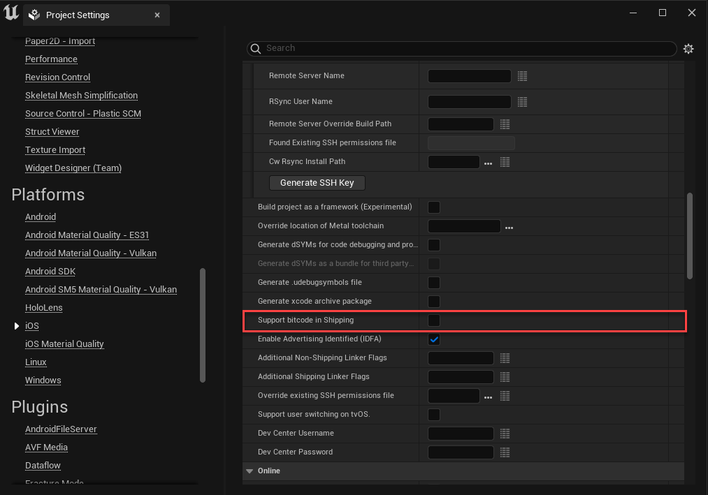

|  |
| --- |
| Wwise Unreal Integration Documentation |

版本说明 2019.2.10.7490.1917

此 Integration 的各个版本分别与特定的 Unreal Engine 4 版本对应。以下是 Integration 2019.2.10.7490.1917 版本中所作的更改（除升级到新的 Unreal 版本外）。

|  |  |
| --- | --- |
|  | **警告：** 鉴于引用设置中所作的改进，在将工程迁移到 Wwise 2019.2.10 后必须更新所有 Wwise 素材。建议用户先执行 Clear Sound Data 再执行 Generate Sound Data 操作。否则，打包好的游戏中可能会触发 Unreal 断言并显示以下错误消息： `Error: Assertion failed: Offset + BytesToRead <= UncompressedFileSize && Offset >= 0` |

|  |  |
| --- | --- |
|  | **注記：** 此 Integration 版本不支持实验性的 Unreal Engine 4 功能。 |

|  |  |
| --- | --- |
|  | **注記：** 此 Integration 针对 Unreal Engine 4.23 及更高版本编译，但只针对 Unreal Engine 4.26 进行了测试。 |

有关早期版本的信息，请参阅 [过往版本的发行说明](previousreleases.html) 章节。

- [新增功能](releasenotes_2019_2_10_1917.html#generic_feature_changes_2019_2_10)
- [行为改进](releasenotes_2019_2_10_1917.html#generic_behavior_changes_2019_2_10)
- [其他改进](releasenotes_2019_2_10_1917.html#generic_misc_2019_2_10)
- [漏洞修复](releasenotes_2019_2_10_1917.html#generic_bugs_2019_2_10)
- [社区报告的漏洞修复](releasenotes_2019_2_10_1917.html#generic_community_bugs_2019_2_10)

# 新增功能

- **WG-52685** 现在可直接通过工程文件解析 Physical Folder 层级结构。

# 行为改进

- **WG-47039** 现在可在 Wwise 和 Unreal Content Browser 之间自动同步 Virtual Folder。
- **WG-49551** AkAssetDatabase 不再在 Editor 打开时或素材同步期间加载素材。这样可以缩短总体加载时间。
- **WG-50863** Event 中的媒体引用改成了硬引用，现在使用 Bulk Data Async IO API 加载媒体数据。在大多数情况下，在要使用 Audio Event 时，只需加载素材便可使用所有相关媒体。
- **WG-52785** 现在在运行 Commandlet 时会禁用 WAAPI。

# 其他改进

- **WG-53093** 针对素材移动和素材同步操作减少了不必要的对话框消息。

# 漏洞修复

- **WG-50934** 已修复：在 AkBankManager 中卸载 SoundBank 时可能会发生崩溃。
- **WG-52242** 已修复：Unreal Editor 无法通过发送相应的 WAAPI 命令来移动名称中包含特殊字符的文件夹。
- **WG-52305** 已修复：素材同步操作存在多种问题。
- **WG-52824** 已修复：在删除大批素材时发生崩溃。
- **WG-53335** 已修复：AkExternalSourceInfo 的 Codec ID 下拉菜单中未列入 WEM Opus 格式。

# 社区报告的漏洞修复

- **WG-50334** 已修复：若在 `GIsInitialLoad` 为 True 时加载 Event，则在打包好的构建版本中启动时将触发断言。
- **WG-51258** 已修复：因过早释放媒体内存而导致 SoundEngine 发生崩溃。
- **WG-52893** 已修复：没有将对嵌套 Work Unit 所作的修改应用到 Wwise Picker 中。
- **WG-52991** 已修复：每次直接调用 `Load()` 函数，分组值中存储的数据包路径都会变长。
- **WG-53031** 已修复：在 Convolution Reverb 生成尾音时卸载关卡可能会导致 Event-Based Packaging 发生崩溃。
- **WG-53195** 已修复：AkGeometry 的 `ConvertConvexMeshToGeometryData()` 无法获取 Convex Mesh，反而总是使用 Bounding Box。
- **WG-53444** 已修复：`AkLowLevelMemory::Alloc` 有时无法返回按页面对齐的内存。
- **WG-53585** 已修复：在 SoundBank 生成过程中，没有等到完成所有解析任务便开始构建媒体。
- **WG-53707** 已修复：在删除 Event 素材时，规定 SoundBank 中的 Linked Ak Events 列表没有清除对应条目。

### 版本说明 2019.2.9.7459.1876

|  |
| --- |
| Wwise Unreal Integration Documentation |

版本说明 2019.2.9.7459.1876

此 Integration 的各个版本分别与特定的 Unreal Engine 4 版本对应。以下是 Integration 2019.2.9.7459.1876 版本中所作的更改（除升级到新的 Unreal 版本外）。

|  |  |
| --- | --- |
|  | **注記：** 此 Integration 版本不支持实验性的 Unreal Engine 4 功能。 |

|  |  |
| --- | --- |
|  | **注記：** 此 Integration 针对 Unreal Engine 4.23 及更高版本编译，但只针对 Unreal Engine 4.25 进行了测试。 |

有关早期版本的信息，请参阅 [过往版本的发行说明](previousreleases.html) 章节。

- [行为改进](releasenotes_2019_2_9_1876.html#generic_behavior_changes_2019_2_9)
- [漏洞修复](releasenotes_2019_2_9_1876.html#generic_bugs_2019_2_9)
- [社区报告的漏洞修复](releasenotes_2019_2_9_1876.html#generic_community_bugs_2019_2_9)

# 行为改进

- **WG-51199** 将 **Auto Connect to WAAPI** 和 **Auto Enable Automatic Asset Synchronization** 移到了用户特定 Wwise 设置。

# 漏洞修复

- **WG-47326** 已修复：在 Spatial Audio 教程中，为实现对白语音的距离衰减而应用的低通滤波器反应幅度过大。
- **WG-51371** 已修复：无法在 UE4 Editor 中重命名 SoundBank 素材。
- **WG-52226** 已修复：在 AkGeometry 从 Mesh 获取无效数据时，Spatial Audio 发生崩溃。
- **WG-52494** 已修复：在 Editor 启动时修改 Wwise 工程会导致 XML 解析错误。
- **WG-52529** 已修复：无法播放设备特定压缩音频。
- **WG-52595** 已修复：在游戏线程上运行关联委托回调前销毁 `AkComponent` 会引发崩溃。
- **WG-52611** 已修复：在通过 “`GenerateSoundBanks`” Commandlet 发现新的 Wwise 对象时未在 Unreal 端新建相应的对象。
- **WG-52624** 已修复：在生成 WwiseConsole Sound Data 的过程中报告了错误，但却依然解析了生成的数据并将其保存到了素材中。
- **WG-52762** 已修复：因 AkMemFreeVM 实现有误导致某些虚拟内存发生泄漏。
- **WG-52877** 已修复：未报告 Work Unit 解析错误，导致有效素材被预定删除。

# 社区报告的漏洞修复

- **WG-51695** 已修复：Wwise Picker 中没有显示对嵌套 Work Unit 所作的修改。
- **WG-52245** 已修复：有时无法将 Unreal Editor 中对 Wwise 工程结构所作的更改应用到 Wwise 设计工具中。

### 版本说明 2019.2.8.7432.1840

|  |
| --- |
| Wwise Unreal Integration Documentation |

版本说明 2019.2.8.7432.1840

此 Integration 的各个版本分别与特定的 Unreal Engine 4 版本对应。以下是 Integration 2019.2.8.7432.1840 版本中所作的更改（除升级到新的 Unreal 版本外）。

- [重要迁移说明 2019.2.8.7432.1840](pg_important_migration_notes_2019_2_8.html)

|  |  |
| --- | --- |
|  | **注記：** 此 Integration 版本不支持实验性的 Unreal Engine 4 功能。 |

|  |  |
| --- | --- |
|  | **注記：** 此 Integration 针对 Unreal Engine 4.23 及更高版本编译，但只针对 Unreal Engine 4.25 进行了测试。 |

有关早期版本的信息，请参阅 [过往版本的发行说明](previousreleases.html) 章节。

- [新增功能](releasenotes_2019_2_8_1840.html#generic_feature_changes_2019_2_8)
- [行为改进](releasenotes_2019_2_8_1840.html#generic_behavior_changes_2019_2_8)
- [漏洞修复](releasenotes_2019_2_8_1840.html#generic_bugs_2019_2_8)

# 新增功能

- **WG-49536** 在 Integration Settings 中添加了用来按文件夹拆分媒体的选项，以便减少单个文件夹中的文件数量。
- **WG-51110** 添加了对 Unreal 4.26 的支持。

# 行为改进

- **WG-51592** 现在默认禁用 Event-Based Packaging，在迁移现有工程时不再提示进行相应迁移。

# 漏洞修复

- **WG-50752** 已修复：对于 SoundBanksInfo.xml，Interactive Music Hierarchy 中嵌套 State 值的解析出现问题。
- **WG-51495** 已修复：在将 Event Section 从某一 Sequencer Track 复制到另一 Sequencer Track 时发生崩溃。
- **WG-51670** 已修复：在 AkGeometry 从 Mesh 获取无效数据时，Spatial Audio 发生崩溃。
- **WG-51886** 已修复：State 和 Switch 值素材的 Group Short ID 无效。

### 版本说明 2019.2.7.7402.1803

#### 新增功能

#### API 改进

#### 性能改进

#### 漏洞修复

#### 社区报告的漏洞修复

#### 新增功能

#### API 改进

#### 行为改进

#### 漏洞修复

#### 社区报告的漏洞修复

|  |
| --- |
| Wwise Unreal Integration Documentation |

版本说明 2019.2.7.7402.1803

此 Integration 的各个版本分别与特定的 Unreal Engine 4 版本对应。以下是 Integration 2019.2.7.7402.1803 版本中所作的更改（除升级到新的 Unreal 版本外）。

|  |  |
| --- | --- |
|  | **注記：** 此 Integration 版本不支持实验性的 Unreal Engine 4 功能。 |

|  |  |
| --- | --- |
|  | **注記：** 此 Integration 针对 Unreal Engine 4.23 及更高版本编译，但只针对 Unreal Engine 4.25 进行了测试。 |

有关早期版本的信息，请参阅 [过往版本的发行说明](previousreleases.html) 章节。

- [新增功能](releasenotes_2019_2_7_1803.html#generic_feature_changes_2019_2_7)
- [API 改进](releasenotes_2019_2_7_1803.html#generic_api_changes_2019_2_7)
- [性能改进](releasenotes_2019_2_7_1803.html#generic_perf_changes_2019_2_7)
- [漏洞修复](releasenotes_2019_2_7_1803.html#generic_bugs_2019_2_7)
- [社区报告的漏洞修复](releasenotes_2019_2_7_1803.html#generic_community_bugs_2019_2_7)

# 新增功能

- **WG-49997** SoundBank 现在包含一系列 Linked AkEvents，并会显示到 Unreal 属性检视器中。

# API 改进

- **WG-51158** 现在允许利用一系列 Event 来通过 C++ 生成 Sound Data。

# 性能改进

- **WG-50843** 优化了 `FAkAudioDevice::Get()` 的性能。

# 漏洞修复

- **WG-49667** 已修复：External Source Factory 不支持相对路径。
- **WG-49678** 已修复：Reverb Volumes 和 Spatial Audio Volumes 与射线投射和粒子系统发生冲突。
- **WG-50785** 已修复：在通过 WwiseConsole 生成 Sound Data 时将 Event 分组存放到 SoundBank 会导致 SoundBank 名称重复。
- **WG-50888** 已修复：在生成 Sound Data 的过程中发生字符串解析错误，可能会进而导致有些媒体文件无法生成。
- **WG-50936** 已修复：在构建 Sound Data 时，针对本地化数据创建了重复的媒体素材，导致无法生成 Sound Data。
- **WG-50995** 已修复：`UAkAssetDataWithMedia::Load` 出现访问冲突。
- **WG-51157** 已修复：”GenerateSoundBanks” Commandlet 出现参数解析错误。
- **WG-51190** 已修复：`FAkAudioDevice::EventToPlayingIDMap` 会导致线程不安全。
- **WG-51307** 已修复：在生成 SoundData 后没有将 Wwise 中针对媒体所作的修改反映到 Unreal 中。
- **WG-51379** 已修复：在卸载尚未完成加载的素材时发生崩溃。
- **WG-51392** 已修复：InitBank 素材中的默认语言为空。
- **WG-51470** 已修复：在未使用 Event-Based Packaging 时，`GenerateSoundBanks` Commandlet 自动同步素材。

# 社区报告的漏洞修复

- **WG-50921** 已修复：在退出 Unreal Editor 时显示与 SoundBank 卸载相关的错误消息。

### 版本说明 2019.2.6.7381.1779

|  |
| --- |
| Wwise Unreal Integration Documentation |

版本说明 2019.2.6.7381.1779

此 Integration 的各个版本分别与特定的 Unreal Engine 4 版本对应。以下是 Integration 2019.2.6.7381.1779 版本中所作的更改（除升级到新的 Unreal 版本外）。

|  |  |
| --- | --- |
|  | **注記：** 此 Integration 版本不支持实验性的 Unreal Engine 4 功能。 |

|  |  |
| --- | --- |
|  | **注記：** 此 Integration 针对 Unreal Engine 4.23 及更高版本编译，但只针对 Unreal Engine 4.25 进行了测试。 |

有关早期版本的信息，请参阅 [过往版本的发行说明](previousreleases.html) 章节。

- [新增功能](releasenotes_2019_2_6_1779.html#generic_feature_changes_2019_2_6)
- [API 改进](releasenotes_2019_2_6_1779.html#generic_api_changes_2019_2_6)
- [行为改进](releasenotes_2019_2_6_1779.html#generic_behavior_changes_2019_2_6)
- [漏洞修复](releasenotes_2019_2_6_1779.html#generic_bugs_2019_2_6)
- [社区报告的漏洞修复](releasenotes_2019_2_6_1779.html#generic_community_bugs_2019_2_6)

# 新增功能

- **WG-50055** 在 Editor 内选中关闭的门户时将以不同方式予以显示。
- **WG-50993** 在 AkGeometry 组件中新增了 Welding Threshold 参数。在 Mesh Type 中选择 Static Mesh 时，可通过调节 Welding Threshold 来指定两个要融为一体的顶点之间的距离。

# API 改进

- **WG-50332** WAAPI 订阅 ak.wwise.core.soundbank.generate 现在会依据严重性发布各项日志消息。

# 行为改进

- **WG-50108** Unreal 中的 Media 素材现在使用内容的哈希值作为未同步标记来加以保存。这对通过版本控制系统共享的工程来说更加可靠。
- **WG-50675** 提高了 Event-Based Packaging 工作流程中对缺失或过期素材进行重构时的检查效率。

# 漏洞修复

- **WG-47325** 已修复：Spatial Audio 教程中使用的混响效果器启用了 Early Reflection。
- **WG-47374** 已修复：在移除 Spatial Audio Room 时，房间底噪被视作落单处理。
- **WG-48701** 已修复：Surface Reflector 组件没有默认启用衍射。
- **WG-49620** 已修复：在 Editor 初始化时显示 Master bus structure not loaded 错误消息。
- **WG-49910** 已修复：需要尝试多次才能将工程成功迁移到 Event-Based Packaging。
- **WG-49936** 已修复：在用作 Spatial Audio Geometry 时，教程中的 Spatial Audio Mesh 显示错误消息。
- **WG-50109** 已修复：(Windows) `AkComponentCallbackManager` `EndOfEvent` 回调引发崩溃。
- **WG-50116** 已修复：在生成 WAAPI Sound Data 时出现争用问题，进而导致媒体引用失效。
- **WG-50283** 已修复：在卸载尚未完成加载的 Event 或 SoundBank 时发生崩溃。
- **WG-50439** 已修复：在打包时发出与外部源相关的警告。
- **WG-50580** 已修复：在仅重新生成 Media 时，Event 被标记为未同步状态。
- **WG-50619** 已修复：有时无法在 Init Bank 中正常设置 Default Language。
- **WG-50683** 已修复：在 Launcher 中实施集成时没有将 XboxOne\_vc150 和 XboxOne\_vc160 文件夹复制到 ThirdParty 文件夹。
- **WG-50730** 已修复：在将 AkGeometry 添加到较大 Mesh 时导致 UE4 发生崩溃。
- **WG-50796** 已修复：在使用名称发送 Event 时发生崩溃。
- **WG-50835** 已修复：在将 Event 分组存放到 SoundBank 中和使用 Event-Based Packaging 时，对于未使用规定 SoundBank 的 Event，没有任何声音。
- **WG-50895** 已修复：无法构建非 Unity 工程。

# 社区报告的漏洞修复

- **WG-49209** 已修复：数据包名称中包含括号时会出现问题。现在会在自动导入 Wwise 素材时对其进行替换。使用 "SanitizeWwiseObjectPath" Commandlet 来迁移包含无效字符的原有素材。

### 版本说明 2019.2.5.7349.1747

#### 漏洞修复

#### 行为改进

#### 其他改进

#### 漏洞修复

#### 社区报告的漏洞修复

#### 新增功能

#### 行为改进

#### 漏洞修复

|  |
| --- |
| Wwise Unreal Integration Documentation |

版本说明 2019.2.5.7349.1747

此 Integration 的各个版本分别与特定的 Unreal Engine 4 版本对应。以下是 Integration 2019.2.5.7349.1747 版本中所作的更改（除升级到新的 Unreal 版本外）。

|  |  |
| --- | --- |
|  | **注記：** 此 Integration 版本不支持实验性的 Unreal Engine 4 功能。 |

|  |  |
| --- | --- |
|  | **注記：** 此 Integration 针对 Unreal Engine 4.23 及更高版本编译，但只针对 Unreal Engine 4.25 进行了测试。 |

有关早期版本的信息，请参阅 [过往版本的发行说明](previousreleases.html) 章节。

- [漏洞修复](releasenotes_2019_2_5_1747.html#generic_bugs_2019_2_5)

# 漏洞修复

- **WG-49849** 已修复：Blueprint Editor 中没有针对 AkGeometry 组件暴露 Transform。
- **WG-49611** 已修复：在卸载尚未完成加载的媒体时发生崩溃。
- **WG-49758** 已修复：在卸载声音引擎正在播放的媒体时发生崩溃。
- **WG-49438** 已修复：在 Post Event Blueprint 尝试播放未完全加载的媒体时，日志中没有显示警告信息。
- **WG-49411** 已修复：Post Event 节点上的 "Stop when attached to Destroyed" 输入引脚不起作用。
- **WG-49634** 已修复：在 Editor 的 Build 菜单中加载包含 Ak Geometry 组件的关卡时实施序列化导致死机。
- **WG-49991** 已修复：在注销 AkGeometry 组件的委托前删除其父对象时发生崩溃。
- **WG-50327** 已修复：在 Event 停止引用 Switch Container 时生成 Sound Data 会引发崩溃。
- **WG-50228** 已修复：(Spatial Audio) 在没有任何 Portal 与 "Outdoors" 相连的情况下，未创建默认的 "Outdoors" Room，导致播放 "Outdoors" 的声音无法透射。
- **WG-49786** 已修复：听者在其位置被改写后使用错误的位置对 Room 和 Reverb Volume 实施几何包含关系检测。

### 版本说明 2019.2.4.7329.1721

|  |
| --- |
| Wwise Unreal Integration Documentation |

版本说明 2019.2.4.7329.1721

此 Integration 的各个版本分别与特定的 Unreal Engine 4 版本对应。以下是 Integration 2019.2.4.7329.1721 版本中所作的更改（除升级到新的 Unreal 版本外）。

|  |  |
| --- | --- |
|  | **注記：** 此 Integration 版本不支持实验性的 Unreal Engine 4 功能。 |

|  |  |
| --- | --- |
|  | **注記：** 此 Integration 针对 Unreal Engine 4.23 及更高版本编译，但只针对 Unreal Engine 4.25 进行了测试。 |

# 行为改进

- **WG-49413** 针对 Event-Based Packaging 添加了相应的迁移选项以便跳过重定向程序的修正。

# 其他改进

- **WG-49857** 在 SoundBanksInfo 文件中新增了有关 Event 内 Switch Container 所用默认 Switch 值的信息。

# 漏洞修复

- **WG-47623** 已修复：Event 的发送位置已经过遮蔽处理，却依然按照遮蔽值实施淡变。
- **WG-48631** 已修复：在生成工程中一小部分 SoundBank 时会导致所需插件列表发生变动。
- **WG-48803** 已修复：在针对 Event 执行特定操作（Post Event、Post Trigger、Set State、Set Switch）时出现“未加载媒体”错误。
- **WG-48806** 已修复：若 Wwise 有打开的模式窗口，则在 WAAPI Picker 中单击 **Populate** 会引发崩溃。
- **WG-49105** 已修复：在配置文件受 Perforce 版本控制系统监管的情况下，一启动编辑器便会打开 Migration to Event-Based Packaging 对话框。
- **WG-49266** 已修复：有时无法正常保存 Re-set Wwise Path 对话框中 Don't show this again 选项的设置。
- **WG-49366** 已修复：Integration Settings 中 Use Event-Based Packaging 复选框的可操作性较差。
- **WG-49384** 已修复：在将工程迁移到 Event-Based Packaging 之后，没有对 Additional non-asset directory to package (DirectoriesToAlwaysStageAsUFS) 下的 Sound Data 路径进行修正。
- **WG-49390** 已修复：在通过用户定义的辅助发送使用插件媒体时没有将其打包。
- **WG-49435** 已修复：在生成 Sound Data 时触发断言。
- **WG-49442** 已修复：打包好的游戏出现 LogStreaming 错误。
- **WG-49730** 已修复：AkAudioEvent 元数据 getter（MinimumDuration、MaximumDuration、IsInfinite 和 MaxAttenuationRadius）损坏。
- **WG-49735** 已修复：在生成 Sound Data 后，素材被不必要地标记为未同步状态。

# 社区报告的漏洞修复

- **WG-49432** 已修复：无法顺畅地执行与 Wwise 不相关的 Event 拖放操作。
- **WG-49604** 已修复：在垃圾收集阶段卸载流播放媒体时死机。

### 版本说明 2019.2.3.7304.1690

|  |
| --- |
| Wwise Unreal Integration Documentation |

版本说明 2019.2.3.7304.1690

此 Integration 的各个版本分别与特定的 Unreal Engine 4 版本对应。以下是 Integration 2019.2.3.7304.1690 版本中所作的更改（除升级到新的 Unreal 版本外）。

|  |  |
| --- | --- |
|  | **注記：** 此 Integration 版本不支持实验性的 Unreal Engine 4 功能。 |

|  |  |
| --- | --- |
|  | **注記：** 此 Integration 针对 Unreal Engine 4.23 及更高版本编译，但只针对 Unreal Engine 4.25 进行了测试。 |

# 新增功能

- **WG-49104** 新增了异步版本的各种 “PostEvent” Blueprint 节点和 AkAudioDevice 函数。异步版本会等到加载媒体之后再适时发送 Event。

# 行为改进

- **WG-48918** 为了解决“运行时缺少素材”问题，将把 Wwise Sound Data Folder 自动添加到 Packaging 设置中的 **Directories to Always Cook**。
- **WG-49019** 移除了 “AkPluginActivator” Commandlet。

# 漏洞修复

- **WG-47563** 已修复：IO 挂钩无法正确关闭文件包。
- **WG-48787** 已修复：在加载媒体时发生错误：Attempt to sync load bulk data。
- **WG-48801** 已修复：在插件激活 Client 和 Server 配置的过程中构建失败。
- **WG-48914** 已修复：“Generate SoundBank” Commandlet 存在以下小问题：在 AssetRegistry 加载完成之前解析 Work Unit；无法正确初始化版本控制模块；在保存修改后的数据包时显示不必要的对话框。
- **WG-48919** 已修复：无法找到 Wwise 工程，导致在正常使用 Editor 时显示错误。
- **WG-48936** 已修复：在结束播放与 AkRoomComponent 关联的活跃房间底噪时发生崩溃。
- **WG-49032** 已修复：在加载 Init Bank 的过程中发生崩溃。
- **WG-49045** 已修复：在因 AkBankManager 而退出游戏时发生崩溃。
- **WG-49060** 已修复：在播放本地化 Event 时更改语言会引发崩溃。
- **WG-49132** 已修复：在旧模式下运行 Unreal 时，Sound Data Folder 中的 WEM 文件出现问题，导致无法生成 SoundBank。
- **WG-49307** 已修复：HoloLens 构建失败。

### 版本说明 2019.2.2.7275.1661

##### Unreal Engine 4.25

#### Unreal Engine 4.23/4.24/4.25 - Wwise 2019.2.2.7275.1661

#### 重要迁移说明 2019.2.2.7275.1661

|  |
| --- |
| Wwise Unreal Integration Documentation |

重要迁移说明 2019.2.2.7275.1661

# Unreal Engine 4.25

- 由于 Unreal Engine 4.25 中的 Android 工具链发生变更，所以需要更改 ThirdParty 文件夹内的 Android SDK 文件夹层次结构。为此，请将以下文件夹移动到 `Android` 文件夹内，并相应地进行重命名：
  - 移动 `Android_armeabi-v7a` 并重命名为 `Android/armeabi-v7a`
  - 移动 `Android_arm64-v8a` 并重命名为 `Android/arm64-v8a`
  - 移动 `Android_x86` 并重命名为 `Android/x86`
  - 移动 `Android_x86_64` 并重命名为 `Android/x86_64`
- 若当前使用 Visual Studio 2019 进行 Windows 相关编译，则需将插件从 `x64_vc150/∗/bin` 文件夹复制到 `x64_vc160/∗/bin` 文件夹。

##### 新增功能：Event-Based Packaging

#### Unreal Engine 4.23/4.24 - Wwise 2019.2.1.7250.1621

#### 重要迁移说明 2019.2.1.7250.1621

|  |
| --- |
| Wwise Unreal Integration Documentation |

重要迁移说明 2019.2.1.7250.1621

# 新增功能：Event-Based Packaging

Unreal Integration 2019.2 中针对素材管理实施了一些重大改进，包括新增了 Event-Based Packaging 工作流程。现在无需手动将 Wwise Event 导入到 Content Browser 中，也不必通过手动创建的 SoundBank Unreal 素材来管理引用。

这一新的工作流程会自动创建工程所需的全部素材：Event、Auxiliary Bus、Media、Init Bank、RTPC (Game Parameter)、Switch Value、State Value、Trigger 和 Acoustic Texture。在构建 Sound Data 时，所有 Event 和 Auxiliary Bus 素材都会包含不带媒体的 SoundBank。媒体素材现在被封装到了专门的 Unreal 素材中，而每个 Event 都对应有一系列所需媒体。不再需要手动加载 SoundBank；若地图中引用了 Event 或 Aux Bus，则会将必要的 SoundBank 数据和相关媒体自动加载到内存中。

在使用 Audiokinetic Launcher 将 Wwise 集成到 Unreal 工程中之后，会默认启用新的工作流程，并自动对 Wwise 工程实施所有必要更改。同时还会启用 WAAPI 连接，以此大幅提升 Sound Data 生成性能，并激活 Integration 内的其他功能。有关详细信息，请参阅 [对 Wwise 工程的更改](install_changes_wproj.html) 章节。

|  |  |
| --- | --- |
|  | **注記：** 为了在 Event-Based Packaging 工作流程当中尽可能地优化 IO 挂钩，在把 Wwise 连接到编辑器或游戏时，将在 Advanced Profiler 的 Loaded Media 选项卡中显示 MediaID 而非文件名称。 |

对于使用现有 Wwise Integration 的工程，需要将现有 Unreal 素材迁移到新的工作流程。若工程较大，则强烈建议通过 “GenerateSoundBanks” Commandlet 来执行此迁移操作：在通过 Audiokinetic Launcher 更新 Wwise Unreal 集成后使用 -Migration 开关（详见 [Generating SoundBanks with the GenerateSoundBanks Commandlet](using_features_generatecommandlet.html) 章节）。注意，此迁移操作比较耗时。若工程较小，则在通过 Audiokinetic Launcher 更新 Wwise Unreal 集成后首次在 Unreal Editor 中打开 Unreal 工程时便可触发迁移流程。这时对话框会询问是否需要使用新的工作流程。如需启动迁移流程，请单击 Yes。

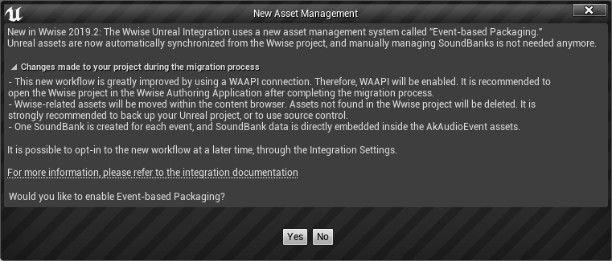

迁移流程会对 Unreal 工程实施以下更改：

- 默认在 Content/WwiseAudio 文件夹中自动创建用于代表 Wwise 工程内各个 Wwise 对象所需的全部 Unreal 素材（Event、State、Switch、Trigger、Auxiliary Bus 和 Acoustic Texture）。
  - 把使用旧版 Wwise Unreal 集成手动创建的现有素材全部合并到新建的素材中。
- 生成 Sound Data。
  - 由 Wwise 生成 SoundBank，并在对应 Unreal 素材中进行序列化处理。
  - 在对应 Wwise Media Unreal 素材中封装媒体文件。
  - 在 Event/Auxiliary Bus 和 Media 之间建立依赖关系。
  - 在必要时，将更改提交到版本控制系统。

若决定停用 Event-Based Packaging，则将对 Unreal 和 Wwise 工程实施以下更改。

- 创建仅用来存储插件列表的 InitBank 素材。
- 在 Wwise Project Settings 中激活 **Generate Metadata File\*\*、\*\*Generate XML Metadata\*\*、\*\*Generate JSON Metadata\*\*、\*\*Generate Per Bank Metadata File\*\*、\*\*Include GUID\*\*、\*\*Max Attenuation** 和 \*\*Estimated Duration\*\*。

##### 在 Wwise Unreal 集成中迁移 Spatial Audio 功能

#### Unreal Engine 4.23/4.24 - Wwise 2019.2.0.7216.1583

#### 重要迁移说明 2019.2.0.7216.1583

|  |
| --- |
| Wwise Unreal Integration Documentation |

重要迁移说明 2019.2.0.7216.1583

# 在 Wwise Unreal 集成中迁移 Spatial Audio 功能

因为可直接在 Wwise 设计工具中配置 Spatial Audio 设置，所以弃用了 AkComponent 中的一些 Spatial Audio 参数。

- \*\*Early Reflection Order\*\*：此参数现在为全局设置，可在初始化设置中找到。
- \*\*Early Reflection Max Path Length\*\*：此参数已被弃用。现在需要针对此 GameObject 发出的声音为 Attenuation Max Distance 执行相同的设置。
- \*\*Room Reverb Aux Bus Gain\*\*：此参数已被弃用。现在需要在设计工具内的 Sound Property Editor 中为 Game-Defined Auxiliary Sends Volume 执行相同的设置。
- \*\*Diffraction Max Edges、Diffraction Max Paths 和 Diffraction Max Path Length\*\*：这些参数已被弃用。现在只需在 Sound Property Editor 的 Positioning 选项卡中直接选中 Enable Diffraction 复选框即可。

a

Blueprint 函数 **UseEarlyReflections** 已被弃用。您可以将其彻底移除，转而在设计工具端设置相应的参数。

#### 新增功能

#### 行为改进

#### 漏洞修复

##### Unreal Engine 4.25

#### Unreal Engine 4.21/4.22/4.23/4.24/4.25 - Wwise 2019.1.9.7221.1609

#### 重要迁移说明 2019.1.9.7221.1609

|  |
| --- |
| Wwise Unreal Integration Documentation |

重要迁移说明 2019.1.9.7221.1609

# Unreal Engine 4.25

- 由于 Unreal Engine 4.25 中的 Android 工具链发生变更，所以需要更改 ThirdParty 文件夹内的 Android SDK 文件夹层次结构。为此，请将以下文件夹移动到 `Android` 文件夹内，并相应地进行重命名：
  - 移动 `Android_armeabi-v7a` 并重命名为 `Android/armeabi-v7a`
  - 移动 `Android_arm64-v8a` 并重命名为 `Android/arm64-v8a`
  - 移动 `Android_x86` 并重命名为 `Android/x86`
  - 移动 `Android_x86_64` 并重命名为 `Android/x86_64`

|  |
| --- |
| Wwise Unreal Integration Documentation |

版本说明 2019.2.2.7275.1661

此 Integration 的各个版本分别与特定的 Unreal Engine 4 版本对应。以下是 Integration 2019.2.2.7275.1661 版本中所作的改进。

[重要迁移说明 2019.2.2.7275.1661](pg_important_migration_notes_2019_2_2.html)

|  |  |
| --- | --- |
|  | **注記：** 此 Integration 版本不支持实验性的 Unreal Engine 4 功能。 |

|  |  |
| --- | --- |
|  | **注記：** 此 Integration 针对 Unreal Engine 4.23 及更高版本编译，但只针对 Unreal Engine 4.24 进行了测试。 |

# Unreal Engine 4.23/4.24/4.25 - Wwise 2019.2.2.7275.1661

- **WG-42472** 添加了对 HoloLens 2 平台的支持。
- **WG-45207** 实现了 WAAPI Picker 和 Wwise Project Explorer 之间选择操作的同步。
- **WG-48046** 添加了对 Unreal 4.25 的支持。
- **WG-48212** 已修复：(Xbox One) 无法在 .Build.cs 文件中正确检测 Visual Studio 版本。
- **WG-48229** 已修复：倘若 Work Unit 的名称中包含下划线，在 Wwise 中将其移动时会发生错误。
- **WG-48251** 已修复：在打包或构建游戏时，Paper2D 编辑器插件发生崩溃。
- **WG-48403** 已修复：在尝试通过命令提示符生成 SoundBank 时显示 ReadFile beyond EOF 错误消息。
- **WG-48682** 已修复：无法将新的素材类型用作 Blueprint 中的变量。
- **WG-48745** 已修复：打包好的游戏发生崩溃，并显示“Assertion failed: AsyncLoadingThread.RecursionNotAllowed”。
- **WG-48762** 已修复：在使用 AkMeter 插件时发生打包错误。

### 版本说明 2019.2.1.7250.1621

|  |
| --- |
| Wwise Unreal Integration Documentation |

版本说明 2019.2.1.7250.1621

此 Integration 的各个版本分别与特定的 Unreal Engine 4 版本对应。以下是 Integration 2019.2.1.7250.1621 版本中所作的改进。

[重要迁移说明 2019.2.1.7250.1621](pg_important_migration_notes_2019_2_1.html)

|  |  |
| --- | --- |
|  | **注記：** 此 Integration 版本不支持实验性的 Unreal Engine 4 功能。 |

|  |  |
| --- | --- |
|  | **注記：** 此 Integration 针对 Unreal Engine 4.23 及更高版本编译，但只针对 Unreal Engine 4.24 进行了测试。 |

# Unreal Engine 4.23/4.24 - Wwise 2019.2.1.7250.1621

- **WG-29995** 添加了对本地化的支持。
- **WG-33506** 重新设计了 SoundBank 管理功能。
- **WG-44463** 在没有打开 Wwise 的情况下生成 SoundBank 时，Unreal Integration 现在使用 WwiseConsole.exe 而非 WwiseCLI.exe。
- **WG-47524** 已修复：在垃圾收集阶段，在 Blueprint 中使用 Event 回调时发生死锁。
- **WG-47698** (Switch) 暴露了新的通信设置，现在允许在 Wwise Communication Settings 中设为直接通过 HTCS 进行连接并实施性能分析。
- **WG-47809** 添加了对 tvOS 平台的支持。
- **WG-47981** 已修复：(PS4) 移除了 public 头文件中的模块依赖项。

### 版本说明 2019.2.0.7216.1583

|  |
| --- |
| Wwise Unreal Integration Documentation |

版本说明 2019.2.0.7216.1583

此 Integration 的各个版本分别与特定的 Unreal Engine 4 版本对应。以下是 Integration 2019.2.0.7216.1583 版本中所作的改进。

[重要迁移说明 2019.2.0.7216.1583](pg_important_migration_notes_2019_2_0.html)

|  |  |
| --- | --- |
|  | **注記：** 此 Integration 版本不支持实验性的 Unreal Engine 4 功能。 |

|  |  |
| --- | --- |
|  | **注記：** 此 Integration 针对 Unreal Engine 4.23 及更高版本编译，但只针对 Unreal Engine 4.24 进行了测试。 |

# Unreal Engine 4.23/4.24 - Wwise 2019.2.0.7216.1583

- **WG-34431** 现在可在 Unreal 支持的所有平台中使用共享库。
- **WG-34896** (WAAPI) 消除了对 SoundFrame 的依赖。
- **WG-42515** 在实施 API 改进后相应地更新了 Unreal Spatial Audio Integration。
- **WG-42760** (Spatial Audio) Unreal AkRoomComponent 现在支持房间底噪：

  针对 Spatial Audio Geometry 添加了新的 Unreal 组件 AkGeometryComponent。该组件可应用于 StaticMeshComponent。AkGeometryComponent 会将 StaticMeshComponent 的 Mesh 发送给 Spatial Audio。
- **WG-44742** 更新了 Unreal 和 Unity 中 Spatial Audio Settings 的值域限制。
- **WG-45586** 为 Spatial Audio 添加了 bEnableDirectPathDiffraction 参数，以便统一启用或禁用衍射。
- **WG-46105** 此 Integration 采用 Unreal Engine 4.21 及更高版本编译，但只使用 Unreal Engine 4.23 进行了测试。
- **WG-47309** 已修复：在使用 macOS Editor 更改与 Sequencer Section 关联的 AkAudioEvent 时可能会发生崩溃。

### 版本说明 2019.1.11.7296.1702

|  |
| --- |
| Wwise Unreal Integration Documentation |

版本说明 2019.1.11.7296.1702

此 Integration 的各个版本分别与特定的 Unreal Engine 4 版本对应。以下是 Integration 2019.1.11.7296.1702 版本中所作的更改（除升级到新的 Unreal 版本外）。

|  |  |
| --- | --- |
|  | **注記：** 此 Integration 版本不支持实验性的 Unreal Engine 4 功能。 |

|  |  |
| --- | --- |
|  | **注記：** 此 Integration 针对 Unreal Engine 4.25 及更高版本编译，但只针对 Unreal Engine 4.26 进行了测试。  由于 UE4.26 要求使用 XCode 12，所以 macOS 上不支持此 Wwise Integration。在 macOS 上使用 UE4.26 构建的工程需升级到最新的 Wwise 2019.2.x Unreal Integration。 |

有关早期版本的信息，请参阅 [过往版本的发行说明](previousreleases.html) 章节。

- [新增功能](releasenotes_2019_1_11_1702.html#generic_feature_changes_2019_1_11)
- [行为改进](releasenotes_2019_1_11_1702.html#generic_behavior_changes_2019_1_11)

# 新增功能

- **WG-52934** 添加了对 Unreal 4.26 的支持。

# 行为改进

- **WG-52861** 不再对基于 Unreal Engine 4.24 及更早版本构建的 Android 版本提供官方支持。

### 版本说明 2019.1.10.7250.1643

|  |
| --- |
| Wwise Unreal Integration Documentation |

版本说明 2019.1.10.7250.1643

此 Integration 的各个版本分别与特定的 Unreal Engine 4 版本对应。以下是 Integration 2019.1.10.7250.1643 版本中所作的更改（除升级到新的 Unreal 版本外）。

|  |  |
| --- | --- |
|  | **注記：** 此 Integration 版本不支持实验性的 Unreal Engine 4 功能。 |

|  |  |
| --- | --- |
|  | **注記：** 此 Integration 针对 Unreal Engine 4.23 及更高版本编译，但只针对 Unreal Engine 4.25 进行了测试。 |

有关早期版本的信息，请参阅 [过往版本的发行说明](previousreleases.html) 章节。

- [漏洞修复](releasenotes_2019_1_10_1643.html#generic_bugs_2019_1_10)

# 漏洞修复

- **WG-47623** 已修复：Event 的发送位置已经过遮蔽处理，却依然按照遮蔽值实施淡变。
- **WG-47563** 已修复：IO 挂钩无法正确关闭文件包。

### 版本说明 2019.1.9.7221.1609

|  |
| --- |
| Wwise Unreal Integration Documentation |

版本说明 2019.1.9.7221.1609

此 Integration 的各个版本分别与特定的 Unreal Engine 4 版本对应。以下是 Integration 2019.1.9.7221.1609 版本中所作的更改（除升级到新的 Unreal 版本外）。

[重要迁移说明 2019.1.9.7221.1609](pg_important_migration_notes_2019_1_9.html)

|  |  |
| --- | --- |
|  | **注記：** 此 Integration 版本不支持实验性的 Unreal Engine 4 功能。 |

# Unreal Engine 4.21/4.22/4.23/4.24/4.25 - Wwise 2019.1.9.7221.1609

- **WG-47524** 已修复：在垃圾收集阶段，在 Blueprint 中使用 Event 回调时死机。
- **WG-48046** 添加了对 Unreal 4.25 的支持。
- **WG-48877** 针对所有 Windows Wwise 声音引擎和插件静态库添加了 vc\_160 库的分发，以满足 Unreal 4.25 的相应需要。同时，移除了 Crankcase 插件中 vc\_120 库的特定分发。

### 版本说明 2019.1.8.7173.1554

#### Unreal Engine 4.21/4.22/4.23/4.24 - Wwise 2019.1.8.7173.1554

#### Unreal Engine 4.21/4.22/4.23/4.24 - Wwise 2019.1.7.7135.1513

#### Unreal Engine 4.21/4.22/4.23 - Wwise 2019.1.6.7110.1478

#### Unreal Engine 4.21/4.22/4.23 - Wwise 2019.1.5.7093.1459

#### Unreal Engine 4.21/4.22/4.23 - Wwise 2019.1.4.7065.1430

#### Unreal Engine 4.21/4.22 - Wwise 2019.1.3.7048.1409

#### Unreal Engine 4.21/4.22 - Wwise 2019.1.2.7018.1378

#### Unreal Engine 4.21/4.22 - Wwise 2019.1.1.6977.1336

#### Unreal Engine 4.21/4.22 - Wwise 2019.1.0.6947.1305

|  |
| --- |
| Wwise Unreal Integration Documentation |

版本说明 2019.1.8.7173.1554

此 Integration 的各个版本分别与特定的 Unreal Engine 4 版本对应。以下是 Integration 2019.1.8.7173.1554 版本中所作的更改（除升级到新的 Unreal 版本外）。

|  |  |
| --- | --- |
|  | **注記：** 此 Integration 版本不支持实验性的 Unreal Engine 4 功能。 |

# Unreal Engine 4.21/4.22/4.23/4.24 - Wwise 2019.1.8.7173.1554

- **WG-47309** 已修复：在使用 macOS Editor 更改与 Sequencer Section 关联的 AkAudioEvent 时可能会发生崩溃。

### 版本说明 2019.1.7.7135.1513

|  |
| --- |
| Wwise Unreal Integration Documentation |

版本说明 2019.1.7.7135.1513

此 Integration 的各个版本分别与特定的 Unreal Engine 4 版本对应。以下是 Integration 2019.1.7.7135.1513 版本中所作的改进（除升级到新的 Unreal 版本外）。

|  |  |
| --- | --- |
|  | **注記：** 此 Integration 版本不支持实验性的 Unreal Engine 4 功能。 |

# Unreal Engine 4.21/4.22/4.23/4.24 - Wwise 2019.1.7.7135.1513

- **WG-45876** 已修复：在 Blueprint 的 WAAPI URI 列表中添加了缺失的 URI。
- **WG-46047** 添加了对 UE4.24 的支持。
- **WG-46662** 已修复：现在会在初始化过程中更早地加载 Init Bank。

### 版本说明 2019.1.6.7110.1478

|  |
| --- |
| Wwise Unreal Integration Documentation |

版本说明 2019.1.6.7110.1478

此 Integration 的各个版本分别与特定的 Unreal Engine 4 版本对应。以下是 Integration 2019.1.6.7110.1478 版本中所作的更改（除升级到新的 Unreal 版本外）。

|  |  |
| --- | --- |
|  | **注記：** 此 Integration 版本不支持实验性的 Unreal Engine 4 功能。 |

# Unreal Engine 4.21/4.22/4.23 - Wwise 2019.1.6.7110.1478

没有针对 Wwise 2019.1.6 的 Unreal Integration 更新。

### 版本说明 2019.1.5.7093.1459

|  |
| --- |
| Wwise Unreal Integration Documentation |

版本说明 2019.1.5.7093.1459

此 Integration 的各个版本分别与特定的 Unreal Engine 4 版本对应。以下是 Integration 2019.1.5.7093.1459 版本中所作的更改（除升级到新的 Unreal 版本外）。

|  |  |
| --- | --- |
|  | **注記：** 此 Integration 版本不支持实验性的 Unreal Engine 4 功能。 |

# Unreal Engine 4.21/4.22/4.23 - Wwise 2019.1.5.7093.1459

- **WG-44704** (Switch) 修复了启用多核渲染时的崩溃问题。
- **WG-44792** 避免了 DefaultGame.ini 中不必要的修改。
- **WG-44937** 修复了关闭引擎时的挂起问题。
- **WG-45030** 现在可在 PostAndWaitForEndOfEvent 中正常返回播放 ID。
- **WG-45095** 移除了构建过程中的 Python 警告。
- **WG-45549** (PS4) 更改了 ACP Batch Buffer Size 的默认值。

### 版本说明 2019.1.4.7065.1430

|  |
| --- |
| Wwise Unreal Integration Documentation |

版本说明 2019.1.4.7065.1430

此 Integration 的各个版本分别与特定的 Unreal Engine 4 版本对应。以下是 Integration 2019.1.4.7065.1430 版本中所作的更改（除升级到新的 Unreal 版本外）。

|  |  |
| --- | --- |
|  | **注記：** 此 Integration 版本不支持实验性的 Unreal Engine 4 功能。 |

# Unreal Engine 4.21/4.22/4.23 - Wwise 2019.1.4.7065.1430

- **WG-43178** 添加了对 Stadia 的初步支持（如需进行访问，请联系 Audiokinetic 技术支持部门）。
- **WG-44197** 添加了对 Unreal 4.23 的支持。
- **WG-44645** 已修复：在使用 Room 和 Portal 播放声音时显示未知听者 ID 错误消息。
- **WG-44675** 减少了 WAAPI 不可用时多余的日志消息。
- **WG-44783** 修复了将 Wwise 安装路径由工程设置迁移到用户设置时存在的问题。
- **WG-44830** 增加了 AK::SoundEngine::RegisterPluginDLL 重载，现在允许注册指定路径下的插件。

### 版本说明 2019.1.3.7048.1409

|  |
| --- |
| Wwise Unreal Integration Documentation |

版本说明 2019.1.3.7048.1409

此 Integration 的各个版本分别与特定的 Unreal Engine 4 版本对应。以下是 Integration 2019.1.3.7048.1409 版本中所作的更改（除升级到新的 Unreal 版本外）。

|  |  |
| --- | --- |
|  | **注記：** 此 Integration 版本不支持实验性的 Unreal Engine 4 功能。 |

# Unreal Engine 4.21/4.22 - Wwise 2019.1.3.7048.1409

- **WG-43403** 现在无法通过拖放将 AkAudioEvent 添加到 Niagara 时间线。
- **WG-43602** 移除了 SoundBank 不含任何 Event 时的日志消息。
- **WG-44056** 因为在 Magic Leap 上仅可通过 mabu 文件加载共享库，所以在要实现 getPluginDLLPath() 时会转而显示相应的错误消息。
- **WG-44118** 修复了使用字符串参数时没能正确解析的 Load Bank 和 Unload Bank Blueprint 节点。
- **WG-43178** 添加了对 Stadia 的初步支持。

### 版本说明 2019.1.2.7018.1378

|  |
| --- |
| Wwise Unreal Integration Documentation |

版本说明 2019.1.2.7018.1378

此 Integration 的各个版本分别与特定的 Unreal Engine 4 版本对应。以下是 Integration 2019.1.2.7018.1378 版本中所作的更改（除升级到新的 Unreal 版本外）。

|  |  |
| --- | --- |
|  | **注記：** 此 Integration 版本不支持实验性的 Unreal Engine 4 功能。 |

# Unreal Engine 4.21/4.22 - Wwise 2019.1.2.7018.1378

- **WG-42524** 确保了不在 Niagara Editor 中显示 AK Event Track 和 RTPC Sequencer Track。
- **WG-42885** 向 Blueprint 暴露了 External Sources API。
- **WG-43007** 向 Wwise User Settings 窗口暴露了 WAAPI IP 地址和端口。
- **WG-43682** 已修复：在游戏包含活跃的流播放声音时将其关闭会发生崩溃。
- **WG-43725** 已修复：反复播放时长未知的 Wwise Event。
- **WG-43878** 现在允许创建不与任何 AkEvent 关联的 AkEvent Sequencer Section。
- **WG-39214** 向 FAkAudioDevice 暴露了 Suspend 和 WakeupFromSuspend。

### 版本说明 2019.1.1.6977.1336

|  |
| --- |
| Wwise Unreal Integration Documentation |

版本说明 2019.1.1.6977.1336

此 Integration 的各个版本分别与特定的 Unreal Engine 4 版本对应。以下是 Integration 2019.1.1.6977.1336 版本中所作的更改（除升级到新的 Unreal 版本外）。

|  |  |
| --- | --- |
|  | **注記：** 此 Integration 版本不支持实验性的 Unreal Engine 4 功能。 |

# Unreal Engine 4.21/4.22 - Wwise 2019.1.1.6977.1336

- **WG-42262** 确保了声笼射线投射忽略 PlayerController。
- **WG-42728** 已修复：在将插件安装为引擎插件时存在构建问题。
- **WG-42747** 现在会在 AkComponent 属性中显示 Spatial Audio 选项。

### 版本说明 2019.1.0.6947.1305

|  |
| --- |
| Wwise Unreal Integration Documentation |

版本说明 2019.1.0.6947.1305

此 Integration 的各个版本分别与特定的 Unreal Engine 4 版本对应。以下是 Integration 2019.1.0.6947.1305 版本中所作的更改（除升级到新的 Unreal 版本外）。

|  |  |
| --- | --- |
|  | **注記：** 此 Integration 版本不支持实验性的 Unreal Engine 4 功能。 |

# Unreal Engine 4.21/4.22 - Wwise 2019.1.0.6947.1305

- 添加了对 Unreal Engine 4.22 的支持

### 版本说明 2019.1.0.6947.1299

#### Unreal Engine 4.21 - Wwise 2019.1.0.6947.1299

#### Unreal Engine 4.19/4.20/4.21/4.22 - Wwise 2018.1.7.6880.1266

#### Unreal Engine 4.19/4.20/4.21 - Wwise 2018.1.6.6858.1242

#### Unreal Engine 4.19/4.20/4.21 - Wwise 2018.1.5.6835.1218

#### Unreal Engine 4.19/4.20/4.21 - Wwise 2018.1.4.6807.1189

#### Unreal Engine 4.19/4.20/4.21 - Wwise 2018.1.3.6784.1177

#### Unreal Engine 4.19/4.20 - Wwise 2018.1.3.6784.6784.1153

|  |
| --- |
| Wwise Unreal Integration Documentation |

版本说明 2019.1.0.6947.1299

此 Integration 的各个版本分别与特定的 Unreal Engine 4 版本对应。以下是 Integration 2019.1.0.6947.1299 版本中所作的更改（除升级到新的 Unreal 版本外）。

|  |  |
| --- | --- |
|  | **注記：** 此 Integration 版本不支持实验性的 Unreal Engine 4 功能。 |

# Unreal Engine 4.21 - Wwise 2019.1.0.6947.1299

- **WG-31477** 为了便于配置生成的 SoundBank 文件夹，添加了 Project Settings 选项。
- **WG-36379** 通过 UI 暴露了初始化设置。
- **WG-36438** 对 `AnimNotify_AkEvent` 进行了修改，现在会在创建 `AkComponent` 时记录警告。有关详细信息，请参阅 [Triggering Wwise Events in Animation Sequences](using_features_anim.html) 。
- **WG-37825**向 Blueprint 暴露了 `GetRTPCValue` 。
- **WG-38260** 向 UI 暴露了初始化设置。
- **WG-38693** 已修复：(WAAPI) 在将 AkAutobahn 用于多个集成包和示例时出现争用问题。
- **WG-40368** 已修复：`AK::SoundEngine::SetSpeakerAngles` 参数 `in_pfSpeakerAngles`。现在将其由 `AkReal32*` 改为了 `const AkReal32*`。
- **WG-40554** 将 SoundBank 生成过程改成了非阻塞性。
- **WG-40869** 添加了新的 Blueprint 函数 `SetMultipleSpeakerEmitterPositions`，其功能与 `SetMultipleChannelEmittePositions` 相似，只不过直接接收扬声器掩码而非声道配置。

### Release Notes 2018.1.7.6880.1266

|  |
| --- |
| Wwise Unreal Integration Documentation |

Release Notes 2018.1.7.6880.1266

此 Integration 的各个版本分别与特定的 Unreal Engine 4 版本对应。Here is what has changed between the 2018.1.6.6858.1242 and the {WWISE\_MAJOR}.{WWISE\_MINOR}.{WWISE\_SUBMINOR}.{WWISE\_BUILD}.{UNREAL\_BUILD} release of the integration (in addition to upgrading to the new Unreal build).

|  |  |
| --- | --- |
|  | **注記：** 此 Integration 版本不支持实验性的 Unreal Engine 4 功能。 |

# Unreal Engine 4.19/4.20/4.21/4.22 - Wwise 2018.1.7.6880.1266

- **WG-41693** Added support for Unreal Engine 4.22.
- **WG-42262** 确保了声笼射线投射忽略 PlayerController。
- **WG-42728** 已修复：在将插件安装为引擎插件时存在构建问题。
- **WG-42747** 现在会在 AkComponent 属性中显示 Spatial Audio 选项。

### Release Notes 2018.1.6.6858.1242

|  |
| --- |
| Wwise Unreal Integration Documentation |

Release Notes 2018.1.6.6858.1242

此 Integration 的各个版本分别与特定的 Unreal Engine 4 版本对应。Here is what has changed between the 2018.1.5.6835.1218 and the 2018.1.6.6858.1242 release of the integration (in addition to upgrading to the new Unreal build).

|  |  |
| --- | --- |
|  | **注記：** 此 Integration 版本不支持实验性的 Unreal Engine 4 功能。 |

# Unreal Engine 4.19/4.20/4.21 - Wwise 2018.1.6.6858.1242

- **WG-40782** Changed Blueprint's `AkCallbackInfo` to be pooled and created on demand.
- **WG-41003** Removed "*Structure member is not initialized properly*" warnings.
- **WG-41101** Reduced compile time by stopping use of monolithic headers.
- **WG-41204** Fixed: An Unreal window hangs when running in headless mode and the Wwise Project path is empty.
- **WG-41245** Fixed: In Wwise Demo Game, WAAPI subscriptions to boolean calls do not return a call failed message.
- **WG-41259** Removed Wwise Motion from the Integration Demo.
- **WG-41339** Fixed: Sequencer Event clips continuously retrigger when clip length exceeds Event duration.

### Release Notes 2018.1.5.6835.1218

|  |
| --- |
| Wwise Unreal Integration Documentation |

Release Notes 2018.1.5.6835.1218

此 Integration 的各个版本分别与特定的 Unreal Engine 4 版本对应。Here is what has changed between the 2018.1.4.6807.1189 and the 2018.1.5.6835.1218 release of the integration (in addition to upgrading to the new Unreal build).

|  |  |
| --- | --- |
|  | **注記：** 此 Integration 版本不支持实验性的 Unreal Engine 4 功能。 |

# Unreal Engine 4.19/4.20/4.21 - Wwise 2018.1.5.6835.1218

- **WG-38420** Fixed: Crash when Sequencer AkAudioEvent section is garbage collected while playing.
- **WG-39056** Lists of available properties in the WAAPI widgets have been updated.
- **WG-40197** Ensured the occlusion or obstruction values are properly being set depending on the use of SpatialAudio rooms.
- **WG-40318** Fixed: WAAPI Picker does not refresh.
- **WG-40420** Fixed: Crash when creating a new actor with AkRoom and AkLateReveb components.
- **WG-40542** Added a nice error when you try to generate your first SoundBank with no Event referenced in it.

### Release Notes 2018.1.4.6807.1189

|  |
| --- |
| Wwise Unreal Integration Documentation |

Release Notes 2018.1.4.6807.1189

此 Integration 的各个版本分别与特定的 Unreal Engine 4 版本对应。Here is what has changed between the 2018.1.3.6784.1177 and the 2018.1.4.6807.1189 release of the integration (in addition to upgrading to the new Unreal build).

# Unreal Engine 4.19/4.20/4.21 - Wwise 2018.1.4.6807.1189

- **WG-39671**: Exposed `ExecuteActionOnEvent` to Blueprint.
- **WG-40333**: Ensured all `PostEvent` calls go through the Callback Manager.
- **WG-40344**: Exposed GetSpeakerAngles and SetSpeakerAngles in Blueprint.
- **WG-40365**: Changed SoundBank generation message to make it clearer that the SoundBank can be generated but still have errors.
- **WG-40380**: Prevented crash when calling `PostAkEventAndWaitForEnd` with an invalid AkEvent.

### Release Notes 2018.1.3.6784.1177

|  |
| --- |
| Wwise Unreal Integration Documentation |

Release Notes 2018.1.3.6784.1177

此 Integration 的各个版本分别与特定的 Unreal Engine 4 版本对应。Here is what has changed between the 2018.1.3.6784.1153 and the 2018.1.3.6784.1177 release of the integration (in addition to upgrading to the new Unreal build).

# Unreal Engine 4.19/4.20/4.21 - Wwise 2018.1.3.6784.1177

- Added support for Unreal 4.21
- **WG-38379**: Added a new Wwise setting for the default Occlusion Collision Channel value used by Ak Component.
- **WG-38497**: Improved stability of the Sequencer while playing and moving around AkAudioEvent.
- **WG-38746**: Added setting to allow using Multi-core rendering.
- **WG-39181**: Fixed: Crash when resizing an AkAudioEvent section in the sequencer to its minimum width.
- **WG-39408**: Wwise Installation Path can now be configured per user. Use Wwise User Settings in the Project Settings to edit the Wwise installation path.
- **WG-39669**: Added parameter restrictions to Wall Occlusion in Ak Room component and Send Level in Ak Late Reverb Component.
- **WG-39713**: UAkAuxBus no longer causes premature initialization of FAkAudioDevice.
- **WG-40128**: Fixed: File handle leak in the IO hook.

### Release Notes 2018.1.3.6784.1153

|  |
| --- |
| Wwise Unreal Integration Documentation |

Release Notes 2018.1.3.6784.1153

此 Integration 的各个版本分别与特定的 Unreal Engine 4 版本对应。Here is what has changed between the 2018.1.2.6762.1124 and the 2018.1.3.6784.1153 release of the integration (in addition to upgrading to the new Unreal build).

# Unreal Engine 4.19/4.20 - Wwise 2018.1.3.6784.6784.1153

- **WG-36728** Added a Commandlet allowing to generate SoundBanks from the command line.
- **WG-39113** Fixed: (iOS, Linux, macOS) No audio for Shipping configuration.
- **WG-39715** Added a checkbox allowing to disable Spatial Audio on an AkComponent. This allows the use of `SetMultiplePositions` on such a component.
- **WG-39833** Fixed: Reduced the number of calls to `SetAuxSends` when unnecessary.

### Release Notes 2018.1.2.6762.1124

#### Unreal Engine 4.19/4.20 - Wwise 2018.1.2.6762.1124

#### Unreal Engine 4.19/4.20 - Wwise 2018.1.1.6727.1082

#### Unreal Engine 4.19/4.20 - Wwise 2018.1.0.6714.1065

#### Unreal Engine 4.17/4.18/4.19/4.20/4.21 - Wwise 2017.2.9.6726.1089

#### Unreal Engine 4.17/4.18/4.19/4.20 - Wwise 2017.2.8.6698.1053

#### Unreal Engine 4.17/4.18/4.19 - Wwise 2017.2.7.6667.1010

#### Unreal Engine 4.17/4.18/4.19 - Wwise 2017.2.6.6636.979

|  |
| --- |
| Wwise Unreal Integration Documentation |

Release Notes 2018.1.2.6762.1124

此 Integration 的各个版本分别与特定的 Unreal Engine 4 版本对应。Here is what has changed between the 2018.1.1.6727.1082 and the 2018.1.2.6762.1124 release of the integration (in addition to upgrading to the new Unreal build).

# Unreal Engine 4.19/4.20 - Wwise 2018.1.2.6762.1124

- **WG-37990** Fixed: (Xbox One) Crash when loading large SoundBank in a packaged game not using PAK files.
- **WG-38420** Fixed: Crash when Sequencer AkAudioEvent section is garbage collected while playing.
- **WG-38693** 已修复：(WAAPI) 在将 AkAutobahn 用于多个集成包和示例时出现争用问题。
- **WG-39055** Fixed: Display issue where waveform in Sequencer sections would render over text.
- **WG-39091** Fixed: Made `RoomComponent` and `LateReverbComponent` compatible with level streaming.
- **WG-39097** Fixed: Removed build warnings about missing samples folder.
- **WG-39115** Fixed: Obstruction refresh issue on Portals.
- **WG-39170** Fixed: Invalid argument passed to `UnloadBank`.
- **WG-39219** Fixed: WAAPI reconnection issue when Wwise Authoring is quickly restarted.
- **WG-39301** Fixed: `CancelEventCallbackCookie` does not properly use user-supplied cookies to cancel.
- **WG-39334** Re-enabled Opus codec on Android and Mac.
- **WG-39393** Fixed: (Switch) Invalid State Group ID.
- **WG-39604** Fixed: Added description to `PostAndWaitForEndOfEvent`.

### Release Notes 2018.1.1.6727.1082

|  |
| --- |
| Wwise Unreal Integration Documentation |

Release Notes 2018.1.1.6727.1082

此 Integration 的各个版本分别与特定的 Unreal Engine 4 版本对应。Here is what has changed between the 2018.1.0.6714.1065 and the 2018.1.1.6727.1082 release of the integration (in addition to upgrading to the new Unreal build).

# Unreal Engine 4.19/4.20 - Wwise 2018.1.1.6727.1082

- **WG-32970** (Xbox One) Removed warnings when building.
- **WG-38486** Fixed: Crash when removing an always-loaded level that uses `AkRoomComponents` and/or `AkLateReverbComponents`.
- **WG-38741** Fixed: Hang on initialization due to some critical sections being initialized before `AK::SoundEngine::Init`.
- **WG-38805** Corrected Integration to unregister all global callbacks after terminating sound engine.
- **WG-39228** Fixed: WAAPI crash when closing Wwise Authoring and Unreal editor simultaneously.

### Release Notes 2018.1.0.6714.1065

|  |
| --- |
| Wwise Unreal Integration Documentation |

Release Notes 2018.1.0.6714.1065

此 Integration 的各个版本分别与特定的 Unreal Engine 4 版本对应。Here is what has changed in the 2018.1.0.6714.1065 release of the integration (in addition to upgrading to the new Unreal build).

# Unreal Engine 4.19/4.20 - Wwise 2018.1.0.6714.1065

- Added support for Unreal Engine 4.20.
- **WG-30002** Added support for audio input using the Wwise Audio Input plug-in. 请参阅 [Providing Audio Input to Wwise](using_features_audioinput.html) 。
- **WG-33507** Exposed Event and SoundBank callbacks to Blueprint. See [在 Blueprint 中使用回调](features_blueprintcallback.html) for more information.
- **WG-34570** Added ability to register to the global callback via delegates.
- **WG-35615** At sound engine initialization time the floor plane can be set using a new value in `AkInitSettings`. The Audiokinetic Unreal integration sets this value, in AkAudioDevice.cpp, to use X-Y as the floor plane.
- **WG-38608** Added experimental support for Lumin.
- **WG-38676** Fixed: Changing Spatial Audio Volume shape makes Unreal Editor freeze.

### Release Notes 2017.2.9.6726.1089

|  |
| --- |
| Wwise Unreal Integration Documentation |

Release Notes 2017.2.9.6726.1089

此 Integration 的各个版本分别与特定的 Unreal Engine 4 版本对应。Here is what has changed between the 2017.2.8.6698.1053 and the 2017.2.9.6726.1089 release of the integration (in addition to upgrading to the new Unreal build).

# Unreal Engine 4.17/4.18/4.19/4.20/4.21 - Wwise 2017.2.9.6726.1089

- Added support for Unreal 4.21.
- **WG-38420** Fixed: Crash when Sequencer AkAudioEvent section is garbage collected while playing.
- **WG-39408** Wwise Installation Path can now be configured per user. Use Wwise User Settings in the Project Settings to edit the Wwise installation path.
- **WG-40128** Fixed: File handle leak in the IO hook.

### Release Notes 2017.2.8.6698.1053

|  |
| --- |
| Wwise Unreal Integration Documentation |

Release Notes 2017.2.8.6698.1053

此 Integration 的各个版本分别与特定的 Unreal Engine 4 版本对应。Here is what has changed between the 2017.2.7.6667.1010 and the 2017.2.8.6698.1053 release of the integration (in addition to upgrading to the new Unreal build).

# Unreal Engine 4.17/4.18/4.19/4.20 - Wwise 2017.2.8.6698.1053

- **WG-36728** Added a Commandlet allowing to generate SoundBanks from the command line.
- **WG-37990** Fixed: (Xbox One) Crash when loading large SoundBank in a packaged game not using PAK files.
- **WG-38420** Fixed: Crash when Sequencer AkAudioEvent section is garbage collected while playing.
- **WG-39091** Made `RoomComponent` and `LateReverbComponent` compatible with level streaming.
- **WG-39097** Removed build warnings about missing samples folder.
- **WG-39113** Fixed: (iOS, Linux, macOS) No audio for Shipping configuration.
- **WG-39115** Fixed: Obstruction refresh issue on Portals.
- **WG-39170** Fixed: Invalid argument passed to `UnloadBank`.
- **WG-39301** Fixed: `CancelEventCallbackCookie` does not properly use user-supplied cookies to cancel.
- **WG-39393** Fixed: (Switch) Invalid State Group ID.
- **WG-39833** Fixed: Reduced the number of calls to SetAuxSends when unnecessary.

### Release Notes 2017.2.7.6667.1010

|  |
| --- |
| Wwise Unreal Integration Documentation |

Release Notes 2017.2.7.6667.1010

此 Integration 的各个版本分别与特定的 Unreal Engine 4 版本对应。Here is what has changed between the 2017.2.6.6636.979 and the 2017.2.7.6667.1010 release of the integration (in addition to upgrading to the new Unreal build).

# Unreal Engine 4.17/4.18/4.19 - Wwise 2017.2.7.6667.1010

- Added support for Unreal Engine 4.20.
- **WG-38486**: Fixed: Crash when removing an always-loaded level that uses AkRoomComponents and/or AkLateReverbComponents.
- **WG-38608**: Added experimental support for Lumin.
- **WG-38676**: Fixed: Changing Spatial Audio Volume shape makes Unreal Editor freeze.

### Release Notes 2017.2.6.6636.979

|  |
| --- |
| Wwise Unreal Integration Documentation |

Release Notes 2017.2.6.6636.979

此 Integration 的各个版本分别与特定的 Unreal Engine 4 版本对应。Here is what has changed between the 2017.2.5.6619.962 and the 2017.2.6.6636.979 release of the integration (in addition to upgrading to the new Unreal build).

# Unreal Engine 4.17/4.18/4.19 - Wwise 2017.2.6.6636.979

- **WG-37921** Fixed hang on teardown.
- **WG-38187** Fixed enabling/disabling of occlusion using the OcclusionRefreshInterval.
- **WG-38282** Increased stack size to 1 MB on Switch platform.
- **WG-38418** Fixed unload bank failed error when quitting game.

### Release Notes 2017.2.5.6619.962

#### Unreal Engine 4.17/4.18/4.19 - Wwise 2017.2.5.6619.962

#### Unreal Engine 4.17/4.18/4.19 - Wwise 2017.2.4.6590.933

#### Unreal Engine 4.17/4.18/4.19 - Wwise 2017.2.3.6575.917

#### Unreal Engine 4.17/4.18 - Wwise 2017.2.2.6553.895

#### Unreal Engine 4.17/4.18 - Wwise 2017.2.1.6524.866

##### 迁移到新的坐标系

##### Migrating Ak Acoustic Portal objects

#### Unreal Engine 4.17/4.18 - Wwise 2017.2.0.6500.836

#### Migration Notes 2017.2.0.6500.836

|  |
| --- |
| Wwise Unreal Integration Documentation |

Migration Notes 2017.2.0.6500.836

# 迁移到新的坐标系

A coordinate system conversion has been removed from the 2017.2.0 integration. This conversion was put in place to convert from the left-hand axis system used in Unreal Engine 4 (with the X and Y axes being the floor) to the default left-hand system used in Wwise Game Object 3D Viewer (with the X and Z axes being the floor). In order for the Wwise Game Object 3D Viewer to properly display Game Objects from Unreal, please go to the Game Object 3D Viewer settings and set the Floor Plane to X-Y:

# Migrating Ak Acoustic Portal objects

Please note that in Wwise 2017.2.0, Spatial Audio Portals have a distinct orientation. The Portal's local Y-axis is the axis along which two adjacent Rooms are linked. It will be necessary to examine all existing Portals, and rotate (by 90 degrees, along the Z-axis) those that are not properly aligned in order to link Rooms along the Y-axis. A new visualization component has been added to the Portals to make the orientation of the Portal immediately apparent to the user. Portals that are incorrectly aligned may behave unexpectedly or return errors when sent to Wwise Spatial Audio.

#### Unreal Engine 4.15/4.16/4.17/4.18/4.19 - Wwise 2017.1.9.6501.856

#### Unreal Engine 4.15/4.16/4.17/4.18/4.19 - Wwise 2017.1.8.6488.843

#### Unreal Engine 4.15/4.16/4.17/4.18 - Wwise 2017.1.7.6467.822

|  |
| --- |
| Wwise Unreal Integration Documentation |

Release Notes 2017.2.5.6619.962

此 Integration 的各个版本分别与特定的 Unreal Engine 4 版本对应。Here is what has changed between the 2017.2.4.6590.933 and the 2017.2.5.6619.962 release of the integration (in addition to upgrading to the new Unreal build).

# Unreal Engine 4.17/4.18/4.19 - Wwise 2017.2.5.6619.962

- **WG-37624** Allowed to perform an asset diff on the Wwise .uasset files.
- **WG-37736** Reorganized some WAAPI Blueprint nodes under the "Audiokinetic" category.
- **WG-37790** Fixed bad listener handling that caused Spatial Audio failures in editor.
- **WG-37808** Fixed errors for WAAPI builds on Visual Studio 2017.
- **WG-37917** Ensured the plug-in compiles when the game does not use precompiled headers.
- **WG-38041** Fixed crash when performing occlusion calculations.
- **WG-38142** Fixed crash due to initialization of `AkOcclusionObstructionService` not binding `SetOcclusionObstructionFcn` when refresh interval is 0.

### Release Notes 2017.2.4.6590.933

|  |
| --- |
| Wwise Unreal Integration Documentation |

Release Notes 2017.2.4.6590.933

此 Integration 的各个版本分别与特定的 Unreal Engine 4 版本对应。Here is what has changed between the 2017.2.3.6575.917 and the 2017.2.4.6590.933 release of the integration (in addition to upgrading to the new Unreal build).

# Unreal Engine 4.17/4.18/4.19 - Wwise 2017.2.4.6590.933

- **WG-37256** `AK::SpatialAudio::SetPortal` error incorrectly reported when starting game in Editor.
- **WG-37453** Fixed Auxiliary Busses not working in PIE session while running a dedicated server.
- **WG-37561** Ensured Room and LateReverb component work properly with the garbage collector.

### Release Notes 2017.2.3.6575.917

|  |
| --- |
| Wwise Unreal Integration Documentation |

Release Notes 2017.2.3.6575.917

此 Integration 的各个版本分别与特定的 Unreal Engine 4 版本对应。Here is what has changed between the 2017.2.2.6553.895 and the 2017.2.3.6575.917 release of the integration (in addition to upgrading to the new Unreal build).

# Unreal Engine 4.17/4.18/4.19 - Wwise 2017.2.3.6575.917

- Added support for Unreal Engine 4.19.
- **WG-36727** Excluded WAAPI from Visual Studio 2017 builds.
- **WG-36883** Moved occlusion raycasts into an async task.
- **WG-37088** Changed to use `GEngine->GetFirstLocalPlayerController()` instead of `UWorld->GetFirstPlayerController()`.
- **WG-37246** Fixed editor crash when starting with -nosound flag.

### Release Notes 2017.2.2.6553.895

|  |
| --- |
| Wwise Unreal Integration Documentation |

Release Notes 2017.2.2.6553.895

此 Integration 的各个版本分别与特定的 Unreal Engine 4 版本对应。Here is what has changed between the 2017.2.1.6524.866 and the 2017.2.2.6553.895 release of the integration (in addition to upgrading to the new Unreal build).

# Unreal Engine 4.17/4.18 - Wwise 2017.2.2.6553.895

- **WG-35044** Made the behavior of overlapping reverb volumes sharing the same Auxiliary Bus more deterministic.
- **WG-36335** Removed unnecessary logs.
- **WG-36369** Added missing include in AkAudioDevice.h.
- **WG-36429** Replaced `LoadModuleChecked` with `GetModulePtr` in `FAkAudioDevice::Init()`.
- **WG-36494** Made `FAkAudioStyle` into a singleton to avoid a non-editor crash.

### Release Notes 2017.2.1.6524.866

|  |
| --- |
| Wwise Unreal Integration Documentation |

Release Notes 2017.2.1.6524.866

此 Integration 的各个版本分别与特定的 Unreal Engine 4 版本对应。Here is what has changed between the 2017.2.0.6500.836 and the 2017.2.1.6524.866 release of the integration (in addition to upgrading to the new Unreal build).

# Unreal Engine 4.17/4.18 - Wwise 2017.2.1.6524.866

- **WG-34960** Removed min and max properties in AkSlider widget, which are now automatically set via WAAPI.
- **WG-35238** Fixed: All open AkEvent Sequencer segments update to dirty when changes are detected in their Work Units.
- **WG-35773** Added bounds to the`UAkComponent::UseEarlyReflections` *order* parameter.
- **WG-35949** Added ability to generate a single SoundBank containing only an Auxiliary Bus.
- **WG-36083** Removed WAAPI log spam when generating SoundBanks while the Sequencer window is open.
- **WG-36200** Fixed crash when running editor with `-game` flag.
- **WG-36357** Changed Launcher to now copy Visual Studio 2017 dependencies to *ThirdParty* folder.
- **WG-36415** Fixed crash in Unreal when adding new AkSlider in UMG

### Release Notes 2017.2.0.6500.836

|  |
| --- |
| Wwise Unreal Integration Documentation |

Release Notes 2017.2.0.6500.836

此 Integration 的各个版本分别与特定的 Unreal Engine 4 版本对应。Here is what has changed in the 2017.2.0.6500.836 release of the integration (in addition to upgrading to the new Unreal build).

[Migration Notes 2017.2.0.6500.836](migrationnotes_2017_2_0.html)

# Unreal Engine 4.17/4.18 - Wwise 2017.2.0.6500.836

- Improved listener handling while in the Editor. See [Using the Editor Listener](features_editor_listener.html) for more information.
- Added a new WAAPI-enabled Wwise picker. See [Using Waapi Features](features_editor_wwise_browser.html#features_editor_waapi_picker) for more information.
- Improved Sequencer integration with scrubbing and 'play from anywhere' support. See [Using the Level Sequencer](using_features_sequencer.html) for more information.
- Added WAAPI-enabled waveform rendering to AkAudioEventSection Sequencer sections. See [Using the Level Sequencer](using_features_sequencer.html) for more information.
- Exposed WAAPI to Blueprint.
- Added WAAPI-enabled widgets for use in UMG. See [WAAPI 小组件](pg_features_objects__w_a_a_p_i.html) for more information.
- **WG-30009** Fixed: Added support for multiple listeners via Blueprint.
- **WG-30010** Fixed: [`SetMultiplePositions`](https://www.audiokinetic.com/library/edge/?source=SDK&id=namespace_a_k_1_1_sound_engine_ad63431938ab1e605a1f6e7fb013c0128.html) is now exposed in Blueprint.
- **WG-33932** Fixed: Removed the experimental alternate occlusion feature.
- **WG-34745** Fixed: Reduced Lower Engine memory pool size on mobile platforms.
- **WG-34879** Fixed: Exposed the collision channel used for the occlusion line trace in AkComponent's properties.
- **WG-35104** Fixed: Fixed listeners to be properly handled in a multiplayer scenario.
- **WG-35307** Fixed: Added more configurations to the Set Bus Config Blueprint node.
- **WG-35614** Fixed: Removed coordinates conversion. 有关详细信息，请参阅 [迁移到新的坐标系](migrationnotes_2017_2_0.html#migration_to_new_coord_system) 章节。

### Release Notes 2017.1.9.6501.856

|  |
| --- |
| Wwise Unreal Integration Documentation |

Release Notes 2017.1.9.6501.856

此 Integration 的各个版本分别与特定的 Unreal Engine 4 版本对应。Here is what has changed between the 2017.1.8.6488.843 and the 2017.1.9.6501.856 release of the integration (in addition to upgrading to the new Unreal build).

# Unreal Engine 4.15/4.16/4.17/4.18/4.19 - Wwise 2017.1.9.6501.856

- No updates to the Unreal Integration for Wwise 2017.1.9.

### Release Notes 2017.1.8.6488.843

|  |
| --- |
| Wwise Unreal Integration Documentation |

Release Notes 2017.1.8.6488.843

此 Integration 的各个版本分别与特定的 Unreal Engine 4 版本对应。Here is what has changed between the 2017.1.7.6467.822 and the 2017.1.8.6488.843 release of the integration (in addition to upgrading to the new Unreal build).

# Unreal Engine 4.15/4.16/4.17/4.18/4.19 - Wwise 2017.1.8.6488.843

- **LAUN-858** Fixed: Install both Visual Studio 2015 and 2017 Wwise SDKs in the Unreal project.

### Release Notes 2017.1.7.6467.822

|  |
| --- |
| Wwise Unreal Integration Documentation |

Release Notes 2017.1.7.6467.822

此 Integration 的各个版本分别与特定的 Unreal Engine 4 版本对应。Here is what has changed between the 2017.1.6.6446.801 and the 2017.1.7.6467.822 release of the integration (in addition to upgrading to the new Unreal build).

# Unreal Engine 4.15/4.16/4.17/4.18 - Wwise 2017.1.7.6467.822

- Added support for Unreal Engine 4.19.

#### Unreal Engine 4.15/4.16/4.17/4.18 - Wwise 2017.1.6.6446.801

#### Unreal Engine 4.15/4.16/4.17/4.18 - Wwise 2017.1.5.6429.783

#### Unreal Engine 4.15/4.16/4.17/4.18 - Wwise 2017.1.4.6407.760

#### Unreal Engine 4.15/4.16/4.17/4.18 - Wwise 2017.1.3.6377.732

#### Unreal Engine 4.15/4.16/4.17 - Wwise 2017.1.3.6377.715

#### Unreal Engine 4.15/4.16/4.17 - Wwise 2017.1.2.6361.696

#### Unreal Engine 4.15/4.16/4.17 - Wwise 2017.1.1.6340.673

#### Unreal Engine 4.15/4.16 - Wwise 2017.1.0.6302.628

#### Unreal Engine 4.15/4.16/4.17/4.18 - Wwise 2016.2.6.6153.513

### Release Notes 2017.1.6.6446.801

|  |
| --- |
| Wwise Unreal Integration Documentation |

Release Notes 2017.1.6.6446.801

此 Integration 的各个版本分别与特定的 Unreal Engine 4 版本对应。Here is what has changed between the 2017.1.5.6429.783 and the 2017.1.6.6446.801 release of the integration (in addition to upgrading to the new Unreal build).

# Unreal Engine 4.15/4.16/4.17/4.18 - Wwise 2017.1.6.6446.801

- **WG-35044** Made the behavior of overlapping reverb volumes sharing the same Auxiliary Bus more deterministic.
- **WG-36446** Fixed: Crash when switching from map with SpatialAudioVolume to map without one.

### Release Notes 2017.1.5.6429.783

|  |
| --- |
| Wwise Unreal Integration Documentation |

Release Notes 2017.1.5.6429.783

此 Integration 的各个版本分别与特定的 Unreal Engine 4 版本对应。Here is what has changed between the 2017.1.4.6407.760 and the 2017.1.5.6429.783 release of the integration (in addition to upgrading to the new Unreal build).

# Unreal Engine 4.15/4.16/4.17/4.18 - Wwise 2017.1.5.6429.783

- **WG-36016** Fixed error message about unknown game object ID when loading an empty map.
- **WG-36200** Fixed crash when running editor with `-game` flag.

### Release Notes 2017.1.4.6407.760

|  |
| --- |
| Wwise Unreal Integration Documentation |

Release Notes 2017.1.4.6407.760

此 Integration 的各个版本分别与特定的 Unreal Engine 4 版本对应。Here is what has changed between the 2017.1.3.6377.732 and the 2017.1.4.6407.760 release of the integration (in addition to upgrading to the new Unreal build).

# Unreal Engine 4.15/4.16/4.17/4.18 - Wwise 2017.1.4.6407.760

- **WG-33333** Removed obsolete code that tried to handle global focus.
- **WG-34745** Reduced Lower Engine memory pool size on mobile platforms.
- **WG-34879** Exposed the collision channel used for occlusion line trace in AkComponent's properties.
- **WG-35035** Ensured setting the occlusion refresh interval to 0 from Blueprint correctly disables the feature.
- **WG-35104** In a multiplayer scenario, listeners are now properly handled.
- **WG-35463** Fixed: Portals not working on 32-bit platforms.
- **WG-35473** Now register game objects only when the world is valid.
- **WG-35614** Removed coordinates conversion. 有关详细信息，请参阅 [迁移到新的坐标系](migrationnotes_2017_2_0.html#migration_to_new_coord_system) 章节。

### Release Notes 2017.1.3.6377.732

|  |
| --- |
| Wwise Unreal Integration Documentation |

Release Notes 2017.1.3.6377.732

此 Integration 的各个版本分别与特定的 Unreal Engine 4 版本对应。Here is what has changed between the 2017.1.3.6377.715 and the 2017.1.3.6377.732 release of the integration (in addition to upgrading to the new Unreal build).

# Unreal Engine 4.15/4.16/4.17/4.18 - Wwise 2017.1.3.6377.732

- Added support for Unreal 4.18.
- **WG-35104** Fixed: Do not create a listener on a dedicated server.
- **WG-35272** Fixed: Added support for Android 64-bit builds.
- **WG-35286** Fixed: Avoid crash when having a Add Surface Reflector Set Component Blueprint node connected to nothing.

### Release Notes 2017.1.3.6377.715

|  |
| --- |
| Wwise Unreal Integration Documentation |

Release Notes 2017.1.3.6377.715

此 Integration 的各个版本分别与特定的 Unreal Engine 4 版本对应。Here is what has changed between the 2017.1.2.6361.696 and the 2017.1.3.6377.715 release of the integration (in addition to upgrading to the new Unreal build).

# Unreal Engine 4.15/4.16/4.17 - Wwise 2017.1.3.6377.715

- **WG-34797** Undoing a surface deletion on a Spatial Audio Volume properly refreshes its details panel.
- **WG-34810** Late Reverb Component properties are now properly serialized.
- **WG-34878, WG-34906** Sounds are now properly spatialized in a Play in Editor session.
- **WG-34907** Performance improvement for `FAkAudioDevice::Get()`.

### Release Notes 2017.1.2.6361.696

|  |
| --- |
| Wwise Unreal Integration Documentation |

Release Notes 2017.1.2.6361.696

此 Integration 的各个版本分别与特定的 Unreal Engine 4 版本对应。Here is what has changed between the 2017.1.1.6340.673 and the 2017.1.2.6361.696 release of the integration (in addition to upgrading to the new Unreal build).

# Unreal Engine 4.15/4.16/4.17 - Wwise 2017.1.2.6361.696

- **WG-32413** Fixed: Cannot hear sounds in the Content Browser and the Animation Editor.
- **WG-33970** Fixed: (Mac) Crash when running game with PAK files.
- **WG-34030** Fixed: Properly update the details panel when a surface is removed from an AkSpatialAudioVolume.
- **WG-34083** Fixed: Refresh issue when changing a Spatial Audio Volume's geometry properties.
- **WG-34213** Fixed: Sounds can now be heard from the Content Browser and the Animation Editor.
- **WG-34222** Virtual Acoustics factory ShareSets now appear in the Wwise Picker.
- **WG-34276** Added ability to allow posted Events to continue playing past their associated sections within Level Sequences.
- **WG-34605** Fixed: Portals are not pushed to Wwise Spatial Audio when starting a game, in some circumstances.
- **WG-34630** Fixed: Crash when `-nosound` option is enabled.
- **WG-34703** Fixed: Prevent crash when modifying multiple SpatialAudioVolumes at the same time.
- **WG-34704** Fixed: Prevent crash when unregistering an AkComponent that is a default listener.
- **WG-34745** Fixed: Reduced lower engine memory pool size.

### Release Notes 2017.1.1.6340.673

|  |
| --- |
| Wwise Unreal Integration Documentation |

Release Notes 2017.1.1.6340.673

此 Integration 的各个版本分别与特定的 Unreal Engine 4 版本对应。Here is what has changed between the 2017.1.0.6302.628 and the 2017.1.1.6340.673 release of the integration (in addition to upgrading to the new Unreal build).

# Unreal Engine 4.15/4.16/4.17 - Wwise 2017.1.1.6340.673

- Added support for Unreal Engine 4.17
- Since Unreal 4.17, the Unreal audio system needs to be disabled on the Xbox One and Switch platforms. Please refer to [常见问题解答](using_faq.html) for more information.
- **WG-34098** (Mac) An `AkComponent` located at exactly the same position as a volume with an `AkRoomComponent` will be properly assigned to that room.
- **WG-34119** Fixed: Uninitialized listener ID value sent to SpatialAudio API via `SetEmitterAuxSendValues`.
- **WG-34368** Fixed: `FAkAudioDevice::PostEventAtLocation` does not register game object.
- **WG-34388** Fixed: Crash in Editor when resetting RTPC sequence name to default in Level Sequencer.

### Release Notes 2017.1.0.6302.628

|  |
| --- |
| Wwise Unreal Integration Documentation |

Release Notes 2017.1.0.6302.628

此 Integration 的各个版本分别与特定的 Unreal Engine 4 版本对应。Here is what has changed in the 2017.1.0.6302.628 release of the integration (in addition to upgrading to the new Unreal build).

# Unreal Engine 4.15/4.16 - Wwise 2017.1.0.6302.628

- Added Spatial Audio components. See [Wwise Spatial Audio 对象](pg_features_spatialaudio.html) for more information.
- **WG-32095**: Added support for Visual Studio 2017
- **WG-32388** Fixed: Properly parse Max attenuation radius when generating SoundBanks.

### Release Notes 2016.2.6.6153.513

|  |
| --- |
| Wwise Unreal Integration Documentation |

Release Notes 2016.2.6.6153.513

此 Integration 的各个版本分别与特定的 Unreal Engine 4 版本对应。Here is what has changed between the 2016.2.5.6121.484 and the 2016.2.6.6153.513 release of the integration (in addition to upgrading to the new Unreal build).

# Unreal Engine 4.15/4.16/4.17/4.18 - Wwise 2016.2.6.6153.513

- Added support for Unreal 4.18
- **WG-33970** Fixed: Crash on Mac when running game with PAK files.
- **WG-34907** Fixed: Performance improvement in `FAkAudioDevice::Get()`.

### Release Notes 2016.2.5.6121.484

#### Unreal Engine 4.15/4.16/4.17 - Wwise 2016.2.5.6121.484

#### Unreal Engine 4.12/4.13/4.14/4.15/4.16 - Wwise 2016.2.5.6121.471

#### Unreal Engine 4.12/4.13/4.14/4.15/4.16 - Wwise 2016.2.4.6098.451

#### Unreal Engine 4.12/4.13/4.14/4.15 - Wwise 2016.2.3.6077.435

#### Unreal Engine 4.12/4.13/4.14/4.15 - Wwise 2016.2.3.6077.422

#### Unreal Engine 4.12/4.13/4.14/4.15 - Wwise 2016.2.2.6022.371

#### Unreal Engine 4.12/4.13/4.14/4.15 - Wwise 2016.2.2.6022.359

#### Unreal Engine 4.12/4.13/4.14 - Wwise 2016.2.1.5995.317

#### Unreal Engine 4.12/4.13/4.14 - Wwise 2016.2.0.5972.301

#### Unreal Engine 4.12/4.13 - Wwise 2016.2.0.5972.274

|  |
| --- |
| Wwise Unreal Integration Documentation |

Release Notes 2016.2.5.6121.484

此 Integration 的各个版本分别与特定的 Unreal Engine 4 版本对应。Here is what has changed between the 2016.2.5.6121.471 and the 2016.2.5.6121.484 release of the integration (in addition to upgrading to the new Unreal build).

# Unreal Engine 4.15/4.16/4.17 - Wwise 2016.2.5.6121.484

- Removed support for UE 4.12, 4.13 and 4.14
- Added support for UE 4.17
- Since Unreal 4.17, the Unreal audio system needs to be disabled on the Xbox One and Switch platforms. Please refer to [常见问题解答](using_faq.html) for more information.
- **WG-34388** Fixed: Crash in Editor when resetting RTPC sequence name to default in Level Sequencer.

### Release Notes 2016.2.5.6121.471

|  |
| --- |
| Wwise Unreal Integration Documentation |

Release Notes 2016.2.5.6121.471

此 Integration 的各个版本分别与特定的 Unreal Engine 4 版本对应。Here is what has changed between the 2016.2.4.6098.451 and the 2016.2.5.6121.471 release of the integration (in addition to upgrading to the new Unreal build).

# Unreal Engine 4.12/4.13/4.14/4.15/4.16 - Wwise 2016.2.5.6121.471

- **WG-32388** Fixed: `Max Attenuation` does not update Events that call Switches.
- **WG-32554** Fixed: Crash with `AkComponent::UpdateGameObjectPosition` when cooking Unreal project.

### Release Notes 2016.2.4.6098.451

|  |
| --- |
| Wwise Unreal Integration Documentation |

Release Notes 2016.2.4.6098.451

此 Integration 的各个版本分别与特定的 Unreal Engine 4 版本对应。Here is what has changed between the 2016.2.3.6077.435 and the 2016.2.4.6098.451 release of the integration (in addition to upgrading to the new Unreal build).

# Unreal Engine 4.12/4.13/4.14/4.15/4.16 - Wwise 2016.2.4.6098.451

- Added support for Unreal Engine 4.16
- **WG-31942** Fixed: Added support for Wwise file packages.
- **WG-33251** Fixed: Added missing include files when building non-Unity builds.

### Release Notes 2016.2.3.6077.435

|  |
| --- |
| Wwise Unreal Integration Documentation |

Release Notes 2016.2.3.6077.435

此 Integration 的各个版本分别与特定的 Unreal Engine 4 版本对应。Here is what has changed between the 2016.2.3.6077.422 and the 2016.2.3.6077.435 release of the integration (in addition to upgrading to the new Unreal build).

# Unreal Engine 4.12/4.13/4.14/4.15 - Wwise 2016.2.3.6077.435

- **WG-32914** Fixed: Avoid potential deadlocks and crashes in the AK Unreal IO code in a packaged game.

### Release Notes 2016.2.3.6077.422

|  |
| --- |
| Wwise Unreal Integration Documentation |

Release Notes 2016.2.3.6077.422

此 Integration 的各个版本分别与特定的 Unreal Engine 4 版本对应。Here is what has changed between the 2016.2.2.6022.371 and the 2016.2.3.6077.422 release of the integration (in addition to upgrading to the new Unreal build).

# Unreal Engine 4.12/4.13/4.14/4.15 - Wwise 2016.2.3.6077.422

- **WG-30020** Fixed: Allow possibility to dismiss the warning about missing Wwise project on editor startup.
- **WG-30695** Added support for the Switch platform.
- **WG-31076** Fixed: Marked all of the Wwise Blueprint nodes as `BlueprintCosmetic` to avoid running them on a dedicated server.
- **WG-31455** Added AkComponentCallbackManager. This allows better handling of required callbacks for an AkComponent, reducing concurrency risks.
- **WG-32046** Fixed: Add possibility to automatically start an AkAmbientSound on BeginPlay
- **WG-32490** Fixed: Deprecated level sequencer code
- **WG-32763** Fixed: Discontinued use of monolithic engine header files, like "Engine.h".
- **WG-32768** Fixed: Crash when loading large banks using EDL.
- **WG-32799** Fixed: Increased number of concurrent IO transfers in editor to speed up SoundBank loading.

### Release Notes 2016.2.2.6022.371

|  |
| --- |
| Wwise Unreal Integration Documentation |

Release Notes 2016.2.2.6022.371

此 Integration 的各个版本分别与特定的 Unreal Engine 4 版本对应。Here is what has changed between the 2016.2.2.6022.359 and the 2016.2.2.6022.371 release of the integration (in addition to upgrading to the new Unreal build).

# Unreal Engine 4.12/4.13/4.14/4.15 - Wwise 2016.2.2.6022.371

- **WG-32464** Allow opening an existing project in UE4.15 on the Mac platform.

### Release Notes 2016.2.2.6022.359

|  |
| --- |
| Wwise Unreal Integration Documentation |

Release Notes 2016.2.2.6022.359

此 Integration 的各个版本分别与特定的 Unreal Engine 4 版本对应。Here is what has changed between the 2016.2.1.5995.317 and the 2016.2.2.6022.359 release of the integration (in addition to upgrading to the new Unreal build).

# Unreal Engine 4.12/4.13/4.14/4.15 - Wwise 2016.2.2.6022.359

- **WG-31087** Added Level Sequence support.
- **WG-31687** Added Event Driven Loader support.
- **WG-31816** Added migration of Matinee tracks to Sequencer tracks.
- **WG-31924** Fixed: Editor crash when trying to post an Event on an AkComponent that is being auto-destroyed.
- **WG-32259** Fixed: Made AkComponent a Blueprintable component. Blueprint components can now use AkComponent as a base class.

### Release Notes 2016.2.1.5995.317

|  |
| --- |
| Wwise Unreal Integration Documentation |

Release Notes 2016.2.1.5995.317

此 Integration 的各个版本分别与特定的 Unreal Engine 4 版本对应。Here is what has changed between the 2016.2.0.5972.301 and the 2016.2.1.5995.317 release of the integration (in addition to upgrading to the new Unreal build).

# Unreal Engine 4.12/4.13/4.14 - Wwise 2016.2.1.5995.317

- **WG-31588** Fixed: Make sure no sound is played on a dying actor.
- **WG-31590** Improved low-memory conditions related to callbacks.
- **WG-31860** Fixed: Remove warnings found by clang static code analysis.
- **WG-31876** Fixed: Allow relative paths for the Wwise install path.
- **WG-31888** Fixed: Potential crash on exit due to accessing deleted FString.

### Release Notes 2016.2.0.5972.301

|  |
| --- |
| Wwise Unreal Integration Documentation |

Release Notes 2016.2.0.5972.301

此 Integration 的各个版本分别与特定的 Unreal Engine 4 版本对应。Here is what has changed between the 2016.2.0.5972.274 and the 2016.2.0.5972.301 release of the integration (in addition to upgrading to the new Unreal build).

# Unreal Engine 4.12/4.13/4.14 - Wwise 2016.2.0.5972.301

- **WG-31589** Fixed: Do not destroy a spawned component that is not set to auto-destroy and is failing to post an event.
- **WG-31678** Fixed: Streaming files can now be opened correctly.
- **WG-31771** Fixed: Avoid a crash when adding an AnimNotify\_AkEvent to a playing animation.

### Release Notes 2016.2.0.5972.274

|  |
| --- |
| Wwise Unreal Integration Documentation |

Release Notes 2016.2.0.5972.274

此 Integration 的各个版本分别与特定的 Unreal Engine 4 版本对应。Here is what has changed in the 2016.2.0.5972.274 release of the integration (in addition to upgrading to the new Unreal build).

# Unreal Engine 4.12/4.13 - Wwise 2016.2.0.5972.274

- **WG-29980** Language-specific folders are now parsed to retrieve max attenuation values for Events.
- **WG-30448** Improved logging of AkComponent when attempting to post an invalid AkEvent.
- **WG-30491** Fixed: Make sure to stop sounds when ending a PIE session.
- **WG-31030** Fixed: Optimized `FAkAudioDevice::Get()`.
- **WG-31040** Fixed: Memory leak in AkComponent when attempting to post an invalid AkEvent.
- **WG-31075** Fixed: Removed call to `FAkAudioDevice::Get()` from bank load callbacks in order to prevent crash in module manager.
- **WG-31186** Fixed: Prevent crash in `AkComponentCallback` by canceling Event callbacks when AkComponent gets destroyed.
- **WG-31204** Fixed: Memory leak when a spawned AkComponent failed to post its associated Event.
- **WG-31277** Fixed: Crash in editor when attempting to post an Event on a destroyed actor.

### Release Notes 2016.1.6

#### Unreal Engine 4.12/4.13/4.14 - Wwise 2016.1.6

#### Unreal Engine 4.11/4.12/4.13/4.14 - Wwise 2016.1.5

#### Unreal Engine 4.11/4.12/4.13/4.14 - Wwise 2016.1.4

#### Unreal Engine 4.11/4.12/4.13 - Wwise 2016.1.3

#### Unreal Engine 4.11/4.12 - Wwise 2016.1.2

#### Unreal Engine 4.11/4.12 - Wwise 2016.1.1

#### Migrating to the UE4.11/4.12 Wwise 2016.1.1 integration

|  |
| --- |
| Wwise Unreal Integration Documentation |

Migrating to the UE4.11/4.12 Wwise 2016.1.1 integration

As part of the fix for WG-30404, the `AttenuationScalingFactor` `UPROPERTY` of `AkComponent` has been made read-only in Blueprints. To set its value, you now need to call the `SetAttenuationScalingFactor` method on `AkComponent`.

#### Unreal Engine 4.11.2 - Wwise 2016.1

#### Unreal Engine 4.11.2 - Wwise 2016.1

#### Unreal Engine 4.12 - Wwise 2015.1.7

|  |
| --- |
| Wwise Unreal Integration Documentation |

Release Notes 2016.1.6

此 Integration 的各个版本分别与特定的 Unreal Engine 4 版本对应。Here is what has changed in the 2016.1.6 release of the integration (in addition to upgrading to the new Unreal build).

# Unreal Engine 4.12/4.13/4.14 - Wwise 2016.1.6

- Removed support for UE 4.11.

### Release Notes 2016.1.5

|  |
| --- |
| Wwise Unreal Integration Documentation |

Release Notes 2016.1.5

此 Integration 的各个版本分别与特定的 Unreal Engine 4 版本对应。Here is what has changed in the 2016.1.5 release of the integration (in addition to upgrading to the new Unreal build).

# Unreal Engine 4.11/4.12/4.13/4.14 - Wwise 2016.1.5

- **WG-31588** Fixed: Make sure no sound is played on a dying actor.
- **WG-31860** Fixed: Remove warnings found by clang static code analysis.
- **WG-31876** Fixed: Allow relative paths for the Wwise install path.

### Release Notes 2016.1.4

|  |
| --- |
| Wwise Unreal Integration Documentation |

Release Notes 2016.1.4

此 Integration 的各个版本分别与特定的 Unreal Engine 4 版本对应。Here is what has changed in the 2016.1.4 release of the integration (in addition to upgrading to the new Unreal build).

# Unreal Engine 4.11/4.12/4.13/4.14 - Wwise 2016.1.4

- **WG-29980** Language-specific folders are now parsed to retrieve max attenuation values for Events.
- **WG-31030** Optimized `FAkAudioDevice::Get()`.
- **WG-31075** Removed call to `FAkAudioDevice::Get()` from bank load callbacks in order to prevent crash in module manager.
- **WG-31186** Fixed: Crash in `AkComponentCallback` by canceling Event callbacks when AkComponent gets destroyed.
- **WG-31204** Fixed: Memory leak when a spawned AkComponent failed to post its associated Event.
- **WG-31277** Fixed: Crash in editor when attempting to post an Event on a destroyed actor.

### Release Notes 2016.1.3

|  |
| --- |
| Wwise Unreal Integration Documentation |

Release Notes 2016.1.3

此 Integration 的各个版本分别与特定的 Unreal Engine 4 版本对应。Here is what has changed in the 2016.1.3 release of the integration (in addition to upgrading to the new Unreal build).

# Unreal Engine 4.11/4.12/4.13 - Wwise 2016.1.3

- **WG-30993** Fixed: Remove explicit LoadLibrary on XAudio 2.7.
- **WG-31015** Fixed: Link with the Recorder plug-in.

### Release Notes 2016.1.2

|  |
| --- |
| Wwise Unreal Integration Documentation |

Release Notes 2016.1.2

此 Integration 的各个版本分别与特定的 Unreal Engine 4 版本对应。Here is what has changed in the 2016.1.2 release of the integration (in addition to upgrading to the new Unreal build).

# Unreal Engine 4.11/4.12 - Wwise 2016.1.2

- **WG-30304** Fixed: "Unload stream level" no longer posts a global "Stop All" to the SoundEngine.
- **WG-30754** Fixed: `FAkAudioDevice::PostEvent` now always returns the playing ID.
- **WG-30804** Fixed: Removed dependencies on the Wwise SDK samples. The new IO system now uses Unreal IO utilities only.

### Release Notes 2016.1.1

|  |
| --- |
| Wwise Unreal Integration Documentation |

Release Notes 2016.1.1

此 Integration 的各个版本分别与特定的 Unreal Engine 4 版本对应。Here is what has changed in the 2016.1.1 release of the integration (in addition to upgrading to the new Unreal build).

[Migrating to the UE4.11/4.12 Wwise 2016.1.1 integration](migration_to_2016_1_1.html)

# Unreal Engine 4.11/4.12 - Wwise 2016.1.1

- **WG-29972** Fixed: Multiple potential threading issues with the auto-destroy behavior of the AkComponent.
- **WG-29979** Fixed: EndOfEvent callbacks are now always called.
- **WG-30004** Fixed: SetGameObjectOutputBusVolume is now exposed in Blueprints and AkAudioDevice.
- **WG-30404** Fixed: The attenuation scaling factor now properly works on `AkComponents`.
- **WG-30409** Fixed: It is now possible to decode Vorbis-encoded files.

### Release Notes 2016.1.0 (Update to UE4.12)

|  |
| --- |
| Wwise Unreal Integration Documentation |

Release Notes 2016.1.0 (Update to UE4.12)

此 Integration 的各个版本分别与特定的 Unreal Engine 4 版本对应。Here is what has changed in the 2016.1.0 release of the integration (in addition to upgrading to the new Unreal build).

# Unreal Engine 4.11.2 - Wwise 2016.1

- Added support for UE4.12
- **WG-29917** Fixed: Fixed a case where the attenuation radius of `AkAmbientSounds` did not show up in the Editor window.
- **WG-30000** Fixed: Changed meta properties of `StartAllAmbientSounds` and `StopAllAmbientSounds`.
- **WG-30012** Fixed: Show project supported platforms as "Available Platforms" in the "Generate Sound Banks" window.
- **WG-30014** Fixed: Fixed a crash when starting a Play in Editor session that uses a dedicated server.
- **WG-30031** Fixed: Removed usage of the `World` global pointer.
- **WG-30205** Fixed: On the Mac platform, the Wwise.app path may now contain spaces.

### Release Notes 2016.1.0

|  |
| --- |
| Wwise Unreal Integration Documentation |

Release Notes 2016.1.0

此 Integration 的各个版本分别与特定的 Unreal Engine 4 版本对应。Here is what has changed in the 2016.1.0 release of the integration (in addition to upgrading to the new Unreal build).

# Unreal Engine 4.11.2 - Wwise 2016.1

- **WG-29917** Fixed: Fixed a case where the attenuation radius of `AkAmbientSounds` did not show up in the Editor window.
- **WG-30000** Fixed: Changed meta properties of `StartAllAmbientSounds` and `StopAllAmbientSounds`.
- **WG-30012** Fixed: Show project supported platforms as "Available Platforms" in the "Generate Sound Banks" window.
- **WG-30014** Fixed: Fixed a crash when starting a Play in Editor session that uses a dedicated server.
- **WG-30031** Fixed: Removed usage of the `World` global pointer.
- **WG-30205** Fixed: On the Mac platform, the Wwise.app path may now contain spaces.

### Release Notes 2015.1.7

|  |
| --- |
| Wwise Unreal Integration Documentation |

Release Notes 2015.1.7

此 Integration 的各个版本分别与特定的 Unreal Engine 4 版本对应。Here is what has changed in the 2015.1.7 release of the integration (in addition to upgrading to the new Unreal build).

# Unreal Engine 4.12 - Wwise 2015.1.7

- **WG-29917** Fixed: Fixed a case where the attenuation radius of `AkAmbientSounds` did not show up in the Editor window.
- **WG-29991** Added `AkEvent String Input Field` to `AkAmbientSound`.
- **WG-29997** Suppressed duplicate "LogAkAudio: StopAll API called" entries in the output log.
- **WG-30000** Fixed: Changed meta properties of `StartAllAmbientSounds` and `StopAllAmbientSounds`.
- **WG-30012** Fixed: Match the list of available platforms for SoundBank generation to the Supported Platforms under the Unreal project settings.
- **WG-30014** Fixed: Fixed a crash when starting a Play in Editor session that uses a dedicated server.
- **WG-30031** Fixed: Removed usage of the `World` global pointer.
- **WG-30218** Fixed: Crash when connecting the Wwise Profiler to the Android platform.
- **WG-30255** Fixed: UE4 crash when adding key to `Ak Event Track` in Matinee.

### Unreal Engine 4.11 - Wwise 2015.1.6

##### 从 UE4 Wwise Integration 源码迁移到插件版本

##### Migrating &quot;...by name&quot; methods

##### Migrating the Wwise project path

#### Unreal Engine 4.11 - Wwise 2015.1.6

#### 迁移说明

|  |
| --- |
| Wwise Unreal Integration Documentation |

迁移说明

# 从 UE4 Wwise Integration 源码迁移到插件版本

Starting from Unreal Engine 4.11, the Wwise UE4 integration will now be distributed as a plug-in.

|  |  |
| --- | --- |
|  | **注記：** Events can no longer be dragged from Wwise and dropped in the Unreal Content Browser to create corresponding AkAudioEvent objects. They can now be dragged directly from the Wwise Picker into the Unreal Content Browser to create their corresponding objects. |

To update a UE4 project from UE 4.10 (or older) to UE 4.11 (or newer):

1. Back up your game project.
2. Install Unreal Engine from the Epic Games Launcher or compile your own Unreal Engine from source code.
3. Install the Wwise Unreal plug-in as an Engine or a Game plug-in, as outlined in [安装](installation.html). Make sure that you use the SDK files you built when doing so.
4. Load your game project in the Unreal Editor.
5. If you installed the Wwise Unreal plug-in as an Engine plug-in, enable the Wwise plug-in by going to **Edit > Plugins > Audio** and selecting the "enable" option under the Wwise Unreal Engine 4 Integration section. You will need to reload your project to enable the plug-in.
6. If your project uses the AkEvent or the AkEventByName AnimNotify, you will be prompted to reload your project as some assets were modified to support the new plug-in model.

The last step is necessary because the AnimNotifies provided with the plug-in had to be moved from the Engine content folder to the plug-in's own content folder. Moving the references requires a project reload.

Once all the steps have been completed, you are ready to use the Wwise Unreal plug-in.

# Migrating "...by name" methods

Starting with the 4.11 version of the Wwise Unreal plug-in, all "...by Name" methods (for example, PostEventByName or LoadBankByName) are deprecated. It is still possible to use strings to post Events or load SoundBanks by using the advanced fields in the Blueprint nodes. For example, if you wish to post an Event by name, you should now use the "Event Name" field of the "PostEvent" Blueprint node:

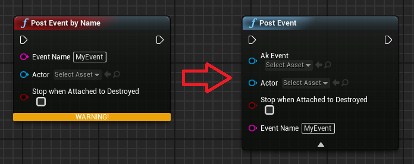

# Migrating the Wwise project path

Starting with the 4.11 version of the Wwise Unreal plug-in, the Wwise project path, found in the Wwise settings, is now relative to the game folder, instead of the UE4Editor.exe file. The change should be automatically done the first time you run the 4.11 Wwise Unreal plug-in.

#### Unreal Engine 4.10 - Wwise v2015.1.4

#### Unreal Engine 4.9 - Wwise v2015.1.2

#### Unreal Engine 4.8 - Wwise v2015.1

#### Unreal Engine 4.8 - Wwise v2014.1.5

#### Unreal Engine 4.7 - Wwise v2014.1.3

|  |
| --- |
| Wwise Unreal Integration Documentation |

Unreal Engine 4.11 - Wwise 2015.1.6

此 Integration 的各个版本分别与特定的 Unreal Engine 4 版本对应。Here is what has changed in the Unreal Engine 4.11 release of the integration (in addition to upgrading to the new Unreal build).

[迁移说明](migrationnotes_411.html)

# Unreal Engine 4.11 - Wwise 2015.1.6

- The Wwise Unreal integration is now a plug-in. Please see [从 UE4 Wwise Integration 源码迁移到插件版本](migrationnotes_411.html#migrating411_to_plugin) for migration notes.
- **UI-273** Fixed: Create a new uasset type for Auxiliary Busses. This allows one to assign an AuxBus to a SoundBank. 有关详细信息，请参阅 [UAkAuxBus](pg_features_objects_assets.html#features_objects_classes_UAkAuxBus) 章节。
- **UI-280** Fixed: Deprecated "...by name" methods, and replaced then with a string field in the relevant methods. See [Migrating "...by name" methods](migrationnotes_411.html#migrating411_byname) for more information.
- **UI-309** Fixed: Made the Wwise project path relative to the game folder, instead of relative to the UE4Editor.exe file. See [Migrating the Wwise project path](migrationnotes_411.html#migrating411_wwiseproject) for more information.

### Unreal Engine 4.10 - Wwise 2015.1.4

|  |
| --- |
| Wwise Unreal Integration Documentation |

Unreal Engine 4.10 - Wwise 2015.1.4

此 Integration 的各个版本分别与特定的 Unreal Engine 4 版本对应。Here is what has changed in the Unreal Engine 4.10 release of the integration (in addition to upgrading to the new Unreal build).

# Unreal Engine 4.10 - Wwise v2015.1.4

- **UI-265** Fixed: In the AnimNotifies, test the AkComponent's validity before using it. This reduces log spam when using UE with the `-nosound` option.
- **UI-270** Fixed: It is now possible to build in non-Unity mode.

### Unreal Engine 4.9 - Wwise 2015.1.2

|  |
| --- |
| Wwise Unreal Integration Documentation |

Unreal Engine 4.9 - Wwise 2015.1.2

此 Integration 的各个版本分别与特定的 Unreal Engine 4 版本对应。Here is what has changed in the Unreal Engine 4.9 release of the integration (in addition to upgrading to the new Unreal build).

# Unreal Engine 4.9 - Wwise v2015.1.2

- **UI-249** Fixed: Avoid crashing when no Audio Playback device is available on Windows.
- Added a "Spawn AkComponent at location" Blueprint node. See [Spawn Ak Component at Location](features_blueprint.html#blueprint_spawncomponent) for more information.
- Added support for the Mac Editor.
- Added support for the Mac platform.
- Added support for the iOS platform.
- Added support for the Linux platform.

### Unreal Engine 4.8 - Wwise 2015.1.0

|  |
| --- |
| Wwise Unreal Integration Documentation |

Unreal Engine 4.8 - Wwise 2015.1.0

此 Integration 的各个版本分别与特定的 Unreal Engine 4 版本对应。Here is what has changed in the Unreal Engine 4.8 release of the integration (in addition to upgrading to the new Unreal build).

# Unreal Engine 4.8 - Wwise v2015.1

- Migrated the UE4.8 integration to Wwise 2015.1
- Fixed a crash on Xbox One if the app manifest did not contain a definition for Wwise communication ports.

### Unreal Engine 4.8 - Wwise 2014.1.5

|  |
| --- |
| Wwise Unreal Integration Documentation |

Unreal Engine 4.8 - Wwise 2014.1.5

此 Integration 的各个版本分别与特定的 Unreal Engine 4 版本对应。Here is what has changed in the Unreal Engine 4.8 release of the integration (in addition to upgrading to the new Unreal build).

# Unreal Engine 4.8 - Wwise v2014.1.5

- **UI-206** Fixed: Sounds with an attenuation can now be heard when an animation window is opened.
- **UI-212** Fixed: Added a "Load Init Bank" Blueprint node.
- **UI-213** Fixed: Added null checks in Blueprint nodes, preventing crashes.
- **UI-214** Fixed: No crash when saving an output capture to disk.
- **UI-215** Fixed: No issue with the Attenuation Scaling Factor of an AkComponent not being set when attached to an actor.
- **UI-217** Fixed: Made AkReverbVolume's collision settings visible in the details panel.
- **UI-220** Fixed: Fixed the occlusion fade behavior for sounds that a spawn occluded.
- **UI-223** Fixed: The gathering of the max attenuations for AkEvent does not halt when the parsing of one SoundBank fails.
- **UI-226** Fixed: SoundBank generation is now performed by the 32-bit WwiseCLI.exe when the 64-bit WwiseCLI.exe is missing.
- **UI-230** Fixed: Now using `OnComponentDestroyed` instead of `FinishDestroy` to unregister Wwise Game Objects, which had caused some Game Objects to be registered for too long.
- **UI-233** Fixed: Added validity checks on actors in the GetGameObjectID function.
- **UI-234** Fixed: Multiple viewports in the SetListener function are properly handled. This fixes a crash in AkAudioDevice.cpp.
- **UI-236** Fixed: The Location Type given to the GetAkComponent Blueprint node is properly handled.
- **UI-239** Fixed: No crash at engine shutdown as a result of the Bank Manager unloading SoundBanks that might already have been destroyed.
- Added a "Follow" check box to the AnimNotify\_AkEvent. Leaving it unchecked will post the AkEvent at a specific location, instead of attaching to the parent.
- Added a new AnimNotify: AnimNotify\_AkEventByName, allowing to post events using their name as a string.
- Added Debugging tools to Blueprints. For more information, see [Debug Blueprint 函数](features_blueprintdebug.html)

### Unreal Engine 4.7 - Wwise 2014.1.3

|  |
| --- |
| Wwise Unreal Integration Documentation |

Unreal Engine 4.7 - Wwise 2014.1.3

此 Integration 的各个版本分别与特定的 Unreal Engine 4 版本对应。Here is what has changed in the Unreal Engine 4.7 release of the integration (in addition to upgrading to the new Unreal build).

# Unreal Engine 4.7 - Wwise v2014.1.3

- Added support for the Android platform.
- Now including a new demonstration game, based on Epic's First Person Template. For more information, see [使用 Wwise Demo Game](using_samplegame.html).
- All Wwise Integration settings now have their page in the Unreal Project Settings window. No need to manually edit INI files anymore!
- **UI-157** Fixed: When generating the SoundBanks, add the Max Attenuation information to AkEvents. It can be retrieved via Blueprints.
- **UI-187** Fixed: Allow the preview of AkEvents from the Content Browser by pressing the space bar.
- **UI-188** Fixed: When an AkAmbientSound is about to be destroyed, cancel its event callback to avoid using a destroyed object in the callback.
- **UI-189** Fixed: Added an attenuation scaling factor to AkComponent, allowing to make each actor's attenuation radius unique.
- **UI-190** Fixed: Added a new Blueprint node that allows setting the exact list of loaded SoundBanks. 有关详细信息，请参阅 [已移除和已弃用的函数](features_blueprintsoundbanks.html#features_blueprintsoundbanks_removed) 章节。
- **UI-193** Fixed: Get the `UAkAudioEventFactory` directly when creating `UAkAudioEvents` by Drag & Drop.
- **UI-194** Fixed: Optimized the finding of `AkReverbVolumes` at a location.
- **UI-195** Fixed: Added [blueprint\_actor\_posteventbyname](features_blueprintactor.html#blueprint_actor_postevent), [features\_blueprintsoundbanks\_removed](features_blueprintsoundbanks.html#features_blueprintsoundbanks_removed), and [已移除和已弃用的函数](features_blueprintsoundbanks.html#features_blueprintsoundbanks_removed) Blueprint nodes.
- **UI-196** Fixed: Added a configuration parameter for the maximum number of concurrent Reverb Volumes applied on a sound.
- **UI-201** Fixed: Added an UAkAudioEvent to AkComponent, to bring it in sync with Unreal's AudioComponent. An AkComponent can by added in a Blueprint via drag & drop of a UAkAudioEvent. An actor with an attached AkComponent will also show its attenuation radius in the Editor.
- **UI-204** Fixed: Added code to unload auto-loaded SoundBanks.
- **UI-205** Fixed: Don't post events in a world that does not allow audio playback.
- **UI-208** Fixed: Fixed a potential crash when generating SoundBanks.

### Unreal Engine 4.6 - Wwise 2014.1.1

#### Unreal Engine 4.6 - Wwise v2014.1.1

#### Unreal Engine 4.5 - Wwise v2014.1

#### August 2014 - Wwise v2014.1

#### August 2014 - Wwise v2013.2.9

#### July 2014 - Wwise v2013.2.9

#### June 2014 - Wwise v2013.2.8

#### April 2014 - Wwise v2013.2.7

#### March 2014 - Wwise v2013.2.6

#### January 2014 - Wwise v2013.2.5

#### December 2013 - Wwise v2013.2.4

|  |
| --- |
| Wwise Unreal Integration Documentation |

Unreal Engine 4.6 - Wwise 2014.1.1

此 Integration 的各个版本分别与特定的 Unreal Engine 4 版本对应。Here is what has changed in the Unreal Engine 4.6 release of the integration (in addition to upgrading to the new Unreal build).

# Unreal Engine 4.6 - Wwise v2014.1.1

- **UI-183** Fixed: Use the debug SoundEngine libraries when UnrealBuildTool is configured to use the debug CRT libraries (`bDebugBuildsActuallyUseDebugCRT = true`).
- **UI-184** Fixed: Added a billboard component to AkComponent to make them visible in the Editor.
- **UI-186** Fixed: Allow drag & drop of .bnk files in the Content Browser to create UAkAudioBank assets.

### Unreal Engine 4.5 - Wwise 2014.1

|  |
| --- |
| Wwise Unreal Integration Documentation |

Unreal Engine 4.5 - Wwise 2014.1

此 Integration 的各个版本分别与特定的 Unreal Engine 4 版本对应。Here is what has changed in the Unreal Engine 4.5 release of the integration (in addition to upgrading to the new Unreal build).

# Unreal Engine 4.5 - Wwise v2014.1

- **UI-172** Fixed: Resolved assert created by the AkReverbVolumeChannel collision channel.
- **UI-174** Fixed: Optimized the "Generate SoundBanks" window.
- **UI-175** Fixed: Added preprocessor guards to remove compilation errors on platforms not supported by this integration.

### August 2014 - Wwise v2014.1

|  |
| --- |
| Wwise Unreal Integration Documentation |

August 2014 - Wwise v2014.1

此 Integration 的各个版本分别与特定的 Unreal Engine 4 版本对应。Here is what has changed in the Unreal Engine August 2014 release of the integration (in addition to upgrading to the new Unreal build).

# August 2014 - Wwise v2014.1

- **UI-166** Fixed: Auxiliary Bus properties are now applied on Ambient Sounds contained within Reverb Volumes.
- Updated Wwise version to 2014.1. If you wish to keep on using 2013.2.x, see [常见问题解答](using_faq.html).

### August 2014 - Wwise v2013.2.9

|  |
| --- |
| Wwise Unreal Integration Documentation |

August 2014 - Wwise v2013.2.9

此 Integration 的各个版本分别与特定的 Unreal Engine 4 版本对应。Here is what has changed in the Unreal Engine August 2014 release of the integration (in addition to upgrading to the new Unreal build).

# August 2014 - Wwise v2013.2.9

- Added Japanese documentation.

### July 2014 - Wwise v2013.2.9

|  |
| --- |
| Wwise Unreal Integration Documentation |

July 2014 - Wwise v2013.2.9

此 Integration 的各个版本分别与特定的 Unreal Engine 4 版本对应。Here is what has changed in the Unreal Engine July 2014 release of the integration (in addition to upgrading to the new Unreal build).

# July 2014 - Wwise v2013.2.9

- Added a SwitchDemo map to the UnrealWwiseDemo sample game, demonstrating the use of switches.
- **UI-161** Fixed: Removed the duplicate AkComponent created when starting an ambient sound. This prevented the Stop Ambient Sound method from working.

### June 2014 - Wwise v2013.2.8

|  |
| --- |
| Wwise Unreal Integration Documentation |

June 2014 - Wwise v2013.2.8

此 Integration 的各个版本分别与特定的 Unreal Engine 4 版本对应。Here is what has changed in the Unreal Engine June 2014 release of the integration (in addition to upgrading to the new Unreal build).

# June 2014 - Wwise v2013.2.8

- **UI-152** Fixed: Add SoundBanks and streamed files to the packaging process.

### April 2014 - Wwise v2013.2.7

|  |
| --- |
| Wwise Unreal Integration Documentation |

April 2014 - Wwise v2013.2.7

此 Integration 的各个版本分别与特定的 Unreal Engine 4 版本对应。Here is what has changed in the Unreal Engine April 2014 release of the integration (in addition to upgrading to the new Unreal build).

# April 2014 - Wwise v2013.2.7

- **UI-149** Fixed: Set proper default values for AkReverbVolumes.

### March 2014 - Wwise v2013.2.6

|  |
| --- |
| Wwise Unreal Integration Documentation |

March 2014 - Wwise v2013.2.6

此 Integration 的各个版本分别与特定的 Unreal Engine 4 版本对应。Here is what has changed in the Unreal Engine March 2014 release of the integration (in addition to upgrading to the new Unreal build).

# March 2014 - Wwise v2013.2.6

- Visual Studio 2013 is now used by default. Please refer to the [平台要求](requirements.html) page for more details.
- **UI-146** Fixed: Fixed non-unity build compilation errors.
- **UI-147** Fixed:
  - Verify the SoundEngine is initialized in the AkComponent tick function;
  - Properly set the collision channel name for AkReverbVolumes;
  - Avoid loading banks in a commandlet;
  - Removed the automatic bank creation mechanism.
- **UI-148** Fixed: Use "Get Player Controller" in the RTPCDemo Blueprint to ensure sound keeps playing when transitioning between "Simulate" and "Possess" modes in Editor.

### January 2014 - Wwise v2013.2.5

|  |
| --- |
| Wwise Unreal Integration Documentation |

January 2014 - Wwise v2013.2.5

此 Integration 的各个版本分别与特定的 Unreal Engine 4 版本对应。Here is what has changed in the Unreal Engine January 2014 release of the integration (in addition to upgrading to the new Unreal build).

# January 2014 - Wwise v2013.2.5

- Added an example of AkAnimNotify in ShooterGame. It is located in the FPP\_RifleReload animation.
- **UI-131** Fixed: Spatialized sounds are now audible in the Animation Editor: Added a second listener for the Animation Editor window, and routed game objects created in this window to the new listener.

  |  |  |
  | --- | --- |
  |  | **警告：** This fix changes the AnimNotify\_AkEvent Blueprint. If you have made modifications to it, be sure to keep a backup before merging this integration. |
- **UI-134** Fixed: Removed the input flag StopWhenOwnerDestroyed to GetAkComponent. It was unused and could create confusion. Added a SetStopWhenOwnerDestroyed method to the AkComponent.
- **UI-136** Fixed: Allow Wwise Authoring to communicate with an Xbox One application.
- **UI-137** Fixed: Make sure a temporary game object (created by "Post Event at Location") is subject to AAkReverbVolumes.
- **UI-138** Fixed: Prevent the Sound Engine from creating UE errors while running in a commandlet. This is a workaround. Maybe the Sound Engine should not be initialized at all.
- **UI-139** Fixed: Removed FMath::Abs on Z projection when setting listener position in SoundEngine (Unreal code has been left untouched). This allows upside down listeners.
- **UI-145** Fixed: Fixed an error in the AkComponent::SetRTPCValue method that prevented RTPCs from being properly applied.

### December 2013 - Wwise v2013.2.4

|  |
| --- |
| Wwise Unreal Integration Documentation |

December 2013 - Wwise v2013.2.4

此 Integration 的各个版本分别与特定的 Unreal Engine 4 版本对应。Here is what has changed in the Unreal Engine December 2013 release of the integration (in addition to upgrading to the new Unreal build).

# December 2013 - Wwise v2013.2.4

- Unreal Wwise integration now officially supports PS4 and Xbox One platforms!
- Added platform selection to bank generation dialog box.
- Added bank generation dialog box to build menu.
- `LinkedProject` configuration parameter has been moved from `Engine/Config/BaseEditor.ini` to `<Your Game>/Config/DefaultGame.ini`.
- Added simple occlusion support.
- Fixed a crash when getting the UAkComponent from another component which has no owner.
- **UI-130** Fixed: Fixed performance issues with the UAkComponent::UpdateAkReverbVolumeList method.
- **UI-130** Fixed: Added a flag to the UAkComponent specifying if it is influenced by reverb volumes.
- **UI-132** Fixed: Prevent UAkComponents from ticking on server configurations.
- **UI-135** Fixed: Expose RTPC interpolation time.

### October 2013 - Wwise v2013.2.1

#### October 2013 - Wwise v2013.2.1

#### September 2013 - Wwise v2013.2.1

#### August 2013 - Wwise v2013.2

#### July 2013 - Wwise v2013.1.1

#### June 2013 - Wwise v2013.1.1

#### May 2013 - Wwise v2013.1.1

#### March 2013 - Wwise v2013.1

|  |
| --- |
| Wwise Unreal Integration Documentation |

October 2013 - Wwise v2013.2.1

此 Integration 的各个版本分别与特定的 Unreal Engine 4 版本对应。Here is what has changed in the Unreal Engine October 2013 release of the integration (in addition to upgrading to the new Unreal build).

# October 2013 - Wwise v2013.2.1

- Added bank generation for PlayStation4 and Xbox One.
- Added AkReverbVolume, allowing for mapping a volume in space to a Wwise auxiliary bus.
- **UI-128** Fixed: Implemented asynchronous IO access.

### September 2013 - Wwise v2013.2.1

|  |
| --- |
| Wwise Unreal Integration Documentation |

September 2013 - Wwise v2013.2.1

此 Integration 的各个版本分别与特定的 Unreal Engine 4 版本对应。Here is what has changed in the Unreal Engine September 2013 release of the integration (in addition to upgrading to the new Unreal build).

# September 2013 - Wwise v2013.2.1

- Fixed build settings for Visual Studio 2012.
- Fixed UEngine::UseSound() returning false when only AkAudioDevice is present.
- Fixed crash in UAkComponent::PostAkEvent with null event.
- Fixed game object position with static actor.

### August 2013 - Wwise v2013.2

|  |
| --- |
| Wwise Unreal Integration Documentation |

August 2013 - Wwise v2013.2

此 Integration 的各个版本分别与特定的 Unreal Engine 4 版本对应。Here is what has changed in the Unreal Engine August 2013 release of the integration (in addition to upgrading to the new Unreal build).

# August 2013 - Wwise v2013.2

- Fixed confusion between Actor, AkComponent, the Wwise game object and their respective lifespans:
  - AkComponent follows attachment semantics of Epic's AudioComponent. AkComponents are re-used when all attachment parameters match.
  - AkGameplayStatics contains global helpers targetting Actors for easy use in blueprints.
- Fixed missing Events and Banks in SoundBank Definition File.
- Fixed game object names in Wwise Profiler.
- Generating SoundBanks now triggers a refresh of loaded banks.
- Set RTPC Value global helper now supports setting a Game Parameter at global scope (no Actor target).

### July 2013 - Wwise v2013.1.1

|  |
| --- |
| Wwise Unreal Integration Documentation |

July 2013 - Wwise v2013.1.1

此 Integration 的各个版本分别与特定的 Unreal Engine 4 版本对应。Here is what has changed in the Unreal Engine July 2013 release of the integration (in addition to upgrading to the new Unreal build).

# July 2013 - Wwise v2013.1.1

- Added message box in case of error during SoundBank Generation.
- New, distinct colors for Audiokinetic Event and Audiokinetic Bank asset types in the Content Browser.
- Fixed compilation on Xbox One and PS4 platforms.
- Fixed issue with AnimNotify\_AkEvent using the wrong type.
- Fixed update of AkComponent Game Object position.

### June 2013 - Wwise v2013.1.1

|  |
| --- |
| Wwise Unreal Integration Documentation |

June 2013 - Wwise v2013.1.1

此 Integration 的各个版本分别与特定的 Unreal Engine 4 版本对应。Here is what has changed in the Unreal Engine June 2013 release of the integration (in addition to upgrading to the new Unreal build).

# June 2013 - Wwise v2013.1.1

- Added DebugGame build configuration support.
- Partial Wwise SDK now included to help setting up the integration.
- Fixed xaudio2/mmdev DLL unload issues in Windows 64-bit build.
- Stopped matinee movie from playing in demomap - was preventing user input from working.
- Fixed AkAudioDevice listener position update in FLevelEditorViewportClient::UpdateAudioListener.
- Changed the AudioDeviceModuleName default value to XAudio2 on the windows platform.

### May 2013 - Wwise v2013.1.1

|  |
| --- |
| Wwise Unreal Integration Documentation |

May 2013 - Wwise v2013.1.1

此 Integration 的各个版本分别与特定的 Unreal Engine 4 版本对应。Here is what has changed in the Unreal Engine May 2013 release of the integration (in addition to upgrading to the new Unreal build).

# May 2013 - Wwise v2013.1.1

- Introduced doxygen documentation.
- Now building using Wwise 2013.1.1 build 4677.

### March 2013 - Wwise v2013.1

|  |
| --- |
| Wwise Unreal Integration Documentation |

March 2013 - Wwise v2013.1

此 Integration 的各个版本分别与特定的 Unreal Engine 4 版本对应。Here is what has changed in the Unreal Engine March 2013 release of the integration (in addition to upgrading to the new Unreal build).

# March 2013 - Wwise v2013.1

- Now building using Wwise 2013.1 beta build 4609.

#### 烘焙和打包

#### 部分支持 No Threading 模式

### Wwise Unreal 集成 的实现说明和已知问题

### 已知问题

### 升级到 Unreal 4.25 或更高版本

### 通过 Windows 远程构建

### 使用 Unreal 音频

### GTE Mathematics

## 已知问题

|  |
| --- |
| Wwise Unreal Integration Documentation |

已知问题

# Wwise Unreal 集成 的实现说明和已知问题

## 烘焙和打包

Unreal 支持在选择 **Package Using Bulk Data** Wwise Integration 设置时执行迭代烘焙和多线程烘焙。

从 Unreal Engine 5.4 开始，迭代烘焙无法检测所生成 SoundBank 中做的更改。

此设置还可修复 Unreal Engine 5.4 或更高版本中的问题。若要提升迭代烘焙的稳定性，建议启用目标域的类筛选器。这样还可修复一些与 Wwise 无关的 Unreal 特定迭代烘焙问题。若要添加适用于整个工程的迭代烘焙筛选器，请在 `DefaultEditor.ini` 文件中添加以下代码行：

[CookSettings]

IterativeUseClassFilters=true

未来的 Unreal Engine 版本将支持检测迭代烘焙中做的自定义更改。目前最简单的解决办法是在生成 SoundBank 时手动删除暂存的文件。参见 <https://issues.unrealengine.com/issue/UE-167603>。

在 Unreal Engine 5.4 中，在启用 Class Filter 的情况下，建议将 Wwise Integration 筛选设置添加到 `DefaultEditor.ini` 文件：

[TargetDomain]

+IterativeClassDenyList=/Script/AkAudio.AkAudioType

+IterativeClassDenyList=/Script/WwiseAssetLibrary.WwiseAssetLibrary

在 Unreal Engine 5.5 或更高版本中，请移除 Wwise Integration 的 Deny List，因为它可以正确处理所生成 SoundBank 中做的更改。

## 部分支持 No Threading 模式

Wwise Unreal 集成部分支持 `-nothreading` Unreal 命令行参数。不过，存在以下限制：

- 部分支持仅适用于 Unreal 5 或更高版本。
- 即便设置了 `-nothreading` ，Wwise 声音引擎也会创建额外的线程。
- 会出现速度减慢和声音问题。而且，可能会发生崩溃或出现其他问题。

只在 No Threading 模式下做了简单的测试，所以并不适合在制作环境中使用相应功能。

另外，建议在运行 `-nothreading` 的同时运行 `-nosound` 以便完全禁用 Wwise 声音引擎。

# 已知问题

- **WG-44750** 无法以针对 Mesh 启用 Physical Material Override 的形式来通过 AkGeometryComponent 指派 Acoustic Texture。
- **WG-52497** 在针对当前音频设备修改 Spatial Sound 选项时，Unreal Editor 可能会挂起。比如，在由 **Windows Sonic for Headphones** 改为 **Off** 时便可能会出现此问题。在遇到该问题时，用户可禁用 UE Audio 以避免挂起。有关如何禁用 Unreal 音频的详细信息，请参阅 [Combining Unreal and Wwise Audio with AudioLink](using_audio_link.html) 章节。
- **WG-69181** 在将 "Fix issue" 应用于 Wwise Niagara 模块时可能会发生崩溃。在使用 Unreal 音频时，出现了类似的行为。
- **WG-69640** 在从禁用的插件加载 Niagara 模块时，Unreal Editor 可能会发生崩溃。Wwise Niagara 也会因此而受到影响。
- **WG-69735** 只有顶层的 "Post Persistent Event" Niagara 模块播放音频。

## 有关 Android 的特定信息

|  |
| --- |
| Wwise Unreal Integration Documentation |

有关 Android 的特定信息

此页面列出了在开发者针对 Android 使用 Unreal Integration 构建应用程序时的相关要求及特别注意事项。

# 升级到 Unreal 4.25 或更高版本

- Unreal Engine 4.25 中对 Android 工具链进行了改进。若要从较早版本迁移到 Unreal 4.25 或更高版本，必须更改 `ThirdParty` 文件夹内的 Android SDK 文件夹层级结构。为此，请按照说明将以下文件夹移动到 `Android` 文件夹中并相应地进行重命名：
  - 将 `Android_armeabi-v7a` 移动到 `Android/armeabi-v7a` 并重命名
  - 将 `Android_arm64-v8a` 移动到 `Android/arm64-v8a` 并重命名
  - 将 `Android_x86` 移动到 `Android/x86` 并重命名
  - 将 `Android_x86_64` 移动到 `Android/x86_64` 并重命名

## 有关 iOS 的特定信息

|  |
| --- |
| Wwise Unreal Integration Documentation |

有关 iOS 的特定信息

此页面列出了在开发者针对 iOS 使用 Unreal Integration 构建应用程序时的相关要求及特别注意事项。

# 通过 Windows 远程构建

You can build projects for iOS from a Windows system with remote build options. For more information, see [iOS for Windows Users](https://dev.epicgames.com/documentation/en-us/unreal-engine/working-on-ios-projects-using-a-windows-machine-in-unreal-engine). 不过需要进行额外的一些配置，因为并非所有文件都会默认复制到远程 macOS 系统。

为了确保这种构建方式能够正常工作，必须创建 `RsyncProject.txt` 文件，来强制 Unreal 复制 `/Build/Rsync/` 路径下的文件。该文件须包含以下代码行：

+ /Plugins/Wwise/ThirdParty/include/\*\*

+ /Plugins/Wwise/ThirdParty/iOS/\*\*

# 使用 Unreal 音频

若在 iOS 上结合 Wwise 使用内置 Unreal 音频，可能会遇到错误并导致游戏发生崩溃或无法予以加载。If that happens, you must either disable Unreal audio or use [Combining Unreal and Wwise Audio with AudioLink](using_audio_link.html).

若要禁用 Unreal 音频，请确保选中 **Enable Wwise SoundEngine only** 音频通路选项（详请参见 [Selecting Audio Routing Options](using_audio_link.html#using_audio_link_enabling) 章节）。

## Wwise 中的开源组件

|  |
| --- |
| Wwise Unreal Integration Documentation |

Wwise 中的开源组件

Unreal Wwise Integration 中提供以下开源组件。

查看此处了解 Wwise 中提供的其他开源组件：[Wwise 中的开源组件](https://www.audiokinetic.com/library/edge/?source=SDK&id=open_source.html)。

# GTE Mathematics

Boost Software License - Version 1.0 - August 17th, 2003

Permission is hereby granted, free of charge, to any person or organization obtaining a copy of the software and accompanying documentation covered by this license (the "Software") to use, reproduce, display, distribute, execute, and transmit the Software, and to prepare derivative works of the Software, and to permit third-parties to whom the Software is furnished to do so, all subject to the following:

The copyright notices in the Software and this entire statement, including the above license grant, this restriction and the following disclaimer, must be included in all copies of the Software, in whole or in part, and all derivative works of the Software, unless such copies or derivative works are solely in the form of machine-executable object code generated by a source language processor.

THE SOFTWARE IS PROVIDED "AS IS", WITHOUT WARRANTY OF ANY KIND, EXPRESS OR IMPLIED, INCLUDING BUT NOT LIMITED TO THE WARRANTIES OF MERCHANTABILITY, FITNESS FOR A PARTICULAR PURPOSE, TITLE AND NON-INFRINGEMENT. IN NO EVENT SHALL THE COPYRIGHT HOLDERS OR ANYONE DISTRIBUTING THE SOFTWARE BE LIABLE FOR ANY DAMAGES OR OTHER LIABILITY, WHETHER IN CONTRACT, TORT OR OTHERWISE, ARISING FROM, OUT OF OR IN CONNECTION WITH THE SOFTWARE OR THE USE OR OTHER DEALINGS IN THE SOFTWARE.

## Copyright

|  |
| --- |
| Wwise Unreal Integration Documentation |

Copyright

© 2024 Audiokinetic Inc. All rights reserved. Wwise Unreal Integration

This document (whether in written, graphic or video form) is supplied as a guide for the Wwise Unreal Integration product. This documentation is the property of Audiokinetic Inc. (“Audiokinetic”), and protected by Canadian copyright law and in other jurisdictions by virtue of international copyright treaties. It may be used by you in accordance with the following.

This documentation may be duplicated, reproduced, stored or transmitted, exclusively for your internal, non-commercial purposes. You may compile different extracts of the documentation to suit such internal purposes, but you may not alter the content of any portion of the documentation. Any copy of the documentation shall retain all copyright and other proprietary notices contained therein.

The content of this documentation is furnished for information purposes only, and its content is subject to change without notice. Reasonable care has been taken in preparing the information contained in this document, however, we disclaim all representations, warranties and conditions, whether express, implied or arising out of usage of trade or course of dealing, concerning this documentation and assume no responsibility or liability for any losses or damages of any kind arising out of the use of this guide or of any error or inaccuracy it may contain, even if we have been advised of the possibility of such loss or damage.

Wwise®, Audiokinetic®, Actor-Mixer®, SoundFrame® and Soundseed® are registered trademarks, and Master-Mixer™, SoundCaster™ and Randomizer™ are trademarks of Audiokinetic. Other trademarks, trade names or company names referenced herein may be the property of their respective owners.

### 使用示例

## Commandlet 用法和参数

## 操作顺序

## 迁移 Wwise 素材

# Wwise Unreal Integration

|  |
| --- |
| Wwise Unreal Integration Documentation |

Wwise Unreal Integration

Wwise Unreal 集成是一款 Unreal 插件，允许开发者在 Unreal 游戏中使用 Wwise 声音引擎。您可以将此处信息视为对 [Wwise SDK](https://www.audiokinetic.com/library/edge/?source=SDK&id=index.html) 和 [Wwise Help](https://www.audiokinetic.com/library/edge/?source=Help&id=wwise_help) 文档的补充。如需查看 Wwise 在运行时支持的全部功能，请参阅 [Wwise SDK](https://www.audiokinetic.com/library/edge/?source=SDK&id=index.html)。

# 文档

本文档包含以下几个主要章节：

- [平台要求](requirements.html)   
  此插件有何要求。
- [安装](installation.html)   
  如何安装此插件。
- [构建插件](building.html)   
  如何生成包含此插件的 Unreal 版本。
- [使用集成包](using.html)   
  如何使用集成包（包含可用功能相关说明）。
- [Introductory 教程](gettingstarted.html)   
  该系列教程主要面向使用 Wwise Unreal 集成的新手。
- [深入探索](pg_goingfurther.html)   
  如何借助 Spatial Audio 和 Customizable Module 来充分利用集成包。
- [版本说明 2025.1](releasenotes.html)   
  此插件版本中添加和更改了哪些功能。
- [过往版本的发行说明](previousreleases.html)   
  参阅本节来查看先前 Wwise 版本中针对插件所作的各项改进。
- [已知问题](using_knownissues.html)   
  参阅本节来查看 Integration 中发现的各项已知问题。
- [有关 Android 的特定信息](pg__android_specificinfo.html)   
  参阅此页面来了解有关 Android 的特定信息。
- [有关 iOS 的特定信息](pg_ios_specificinfo.html)   
  参阅此页面来了解有关 iOS/tvOS 的特定信息。
- [Wwise 中的开源组件](ue_open_source.html)   
  参阅此页面来了解集成包内开源组件的授权。
- [Copyright](pg_unreal_copyright.html)   
  参阅此页面来了解版权信息。

# 使用工程迁移 Commandlet

|  |
| --- |
| Wwise Unreal Integration Documentation |

使用工程迁移 Commandlet

Wwise Unreal 插件包含相应的 Commandlet，方便通过命令行将 Unreal 工程迁移到 Wwise 2022.1。

# Commandlet 用法和参数

Commandlet 用法：

<UnrealEditor.exe> <path\_to\_uproject> -run=AkMigration [ [-transfer-bank-waapi] OR [-generate-bank-definition=<Path/To/Save/FileName>.tsv] ][-ignore-bank-errors] [-transfer-bank-autoload] [-delete-banks] [-migrate-assets] [-update-settings] [-delete-deprecated-assets] [-generated-soundbanks-folder=<Path/To/Folder>]

以下参数执行 Migration Window 中可用的相同操作。有关这些操作的详细信息，请参阅 [将工程升级到 Wwise 2022.1](pg_important_migration_notes_2022_1_0.html) 页面。

- **transfer-bank-waapi**：（可选）通过 WAAPI 将 Unreal 工程中的 SoundBank 传输到 Wwise。此参数不可与 generate-bank-definition 结合使用。
- **generate-bank-definition**：（可选）在指定的路径创建 SoundBank 定义文件。使用绝对文件路径 (C:...)。之后须将文件手动导入到 Wwise 中来创建 SoundBank。此参数不可与 transfer-bank-waapi 结合使用。
  - **ignore-bank-errors**：（可选）忽略在通过 WAAPI 传输 SoundBank 期间或在写入到 SoundBank 定义文件时发生的错误并继续实施迁移。
- **transfer-bank-autoload**：（可选）将 AkAudioBank AutoLoad 属性传输到其中分组存放的素材。
- **delete-banks**：（可选）在完成传输后删除 Unreal 工程中的所有 SoundBank 素材。
- **delete-deprecated-assets**：（可选）删除所有还在工程中但已弃用的 Wwise 素材。
- **migrate-assets**：（可选）迁移工程中的 Wwise 素材。
- **update-settings**：更新 Wwise 和 Unreal 工程的设置。
  - **generated-soundbanks-folder**：（可选）与 update-settings 结合使用的 GeneratedSoundBanks 文件夹的路径。使用绝对文件路径 (C:/...)。此参数用于设定 Unreal 工程中的 Generated Sound Banks Folder 设置。
- **help**：（可选）输出消息来描述所有参数并马上终止 Commandlet。

## 使用示例

C:\UE\_5.0\Engine\Binaries\Win64\UnrealEditor-Cmd.exe C:\MyProjects\Demo\WwiseDemoGame.uproject -run=AkMigration -transfer-bank-waapi -transfer-bank-autoload -delete-banks -migrate-assets -delete-deprecated-assets -update-settings -generated-soundbanks-folder="C:/Project/WwiseProject/GeneratedSoundBanks"

|  |  |
| --- | --- |
|  | **TIP：** Commandlet 窗口会在执行命令后立即关闭。若要将命令的结果输出到文本文件，请在命令的末尾添加 `> log.txt`。这时会在当前目录下创建名为 `log.txt` 的文本文件并在其中包含相关错误或警告。 |

# 操作顺序

迁移操作的执行顺序跟编辑器内的迁移相同，其并不受命令行中的参数顺序影响。 顺序如下：

1. 生成 Bank
   1. 传输 Auto Load 属性
   2. 传输 Bank（WAAPI 或 SoundBank 定义文件）
   3. 删除弃用的 AkAudioBank 素材

# 迁移 Wwise 素材

1. 删除弃用的素材
2. 更新工程设置

